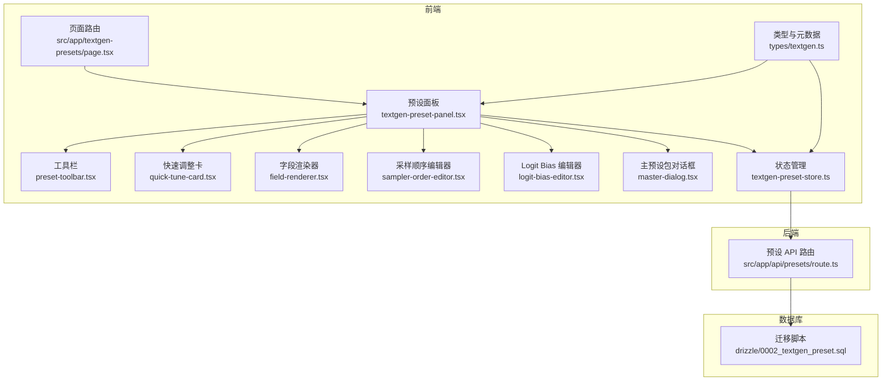
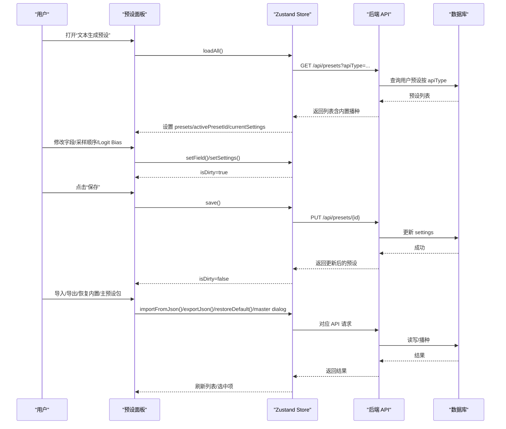
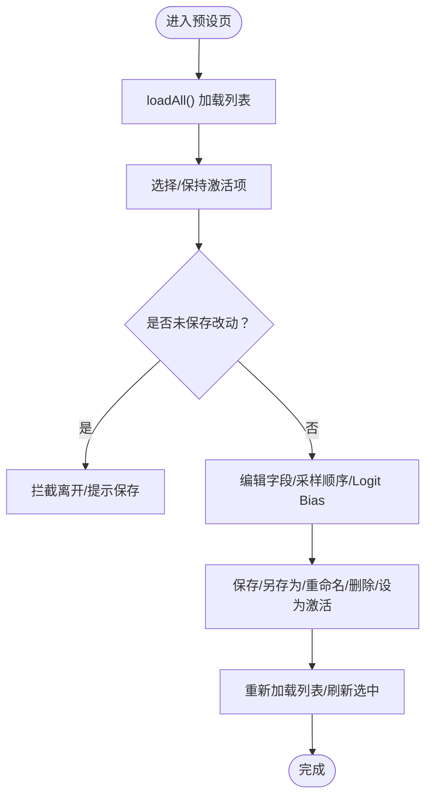
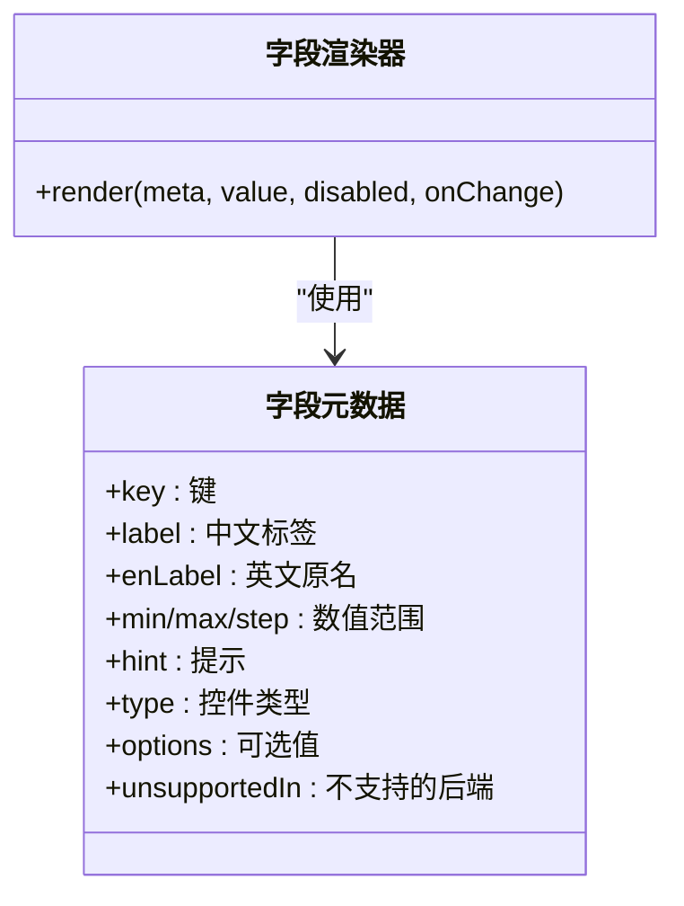
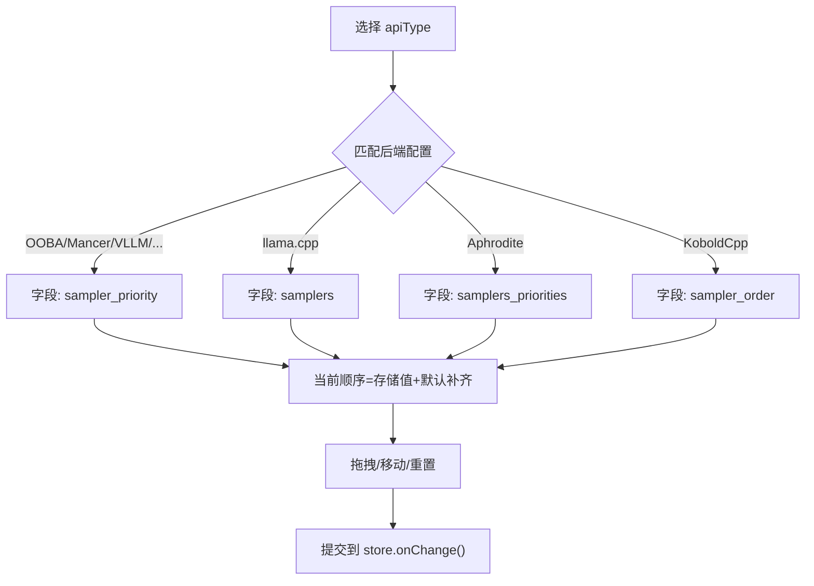
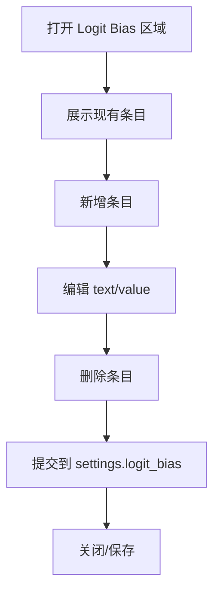
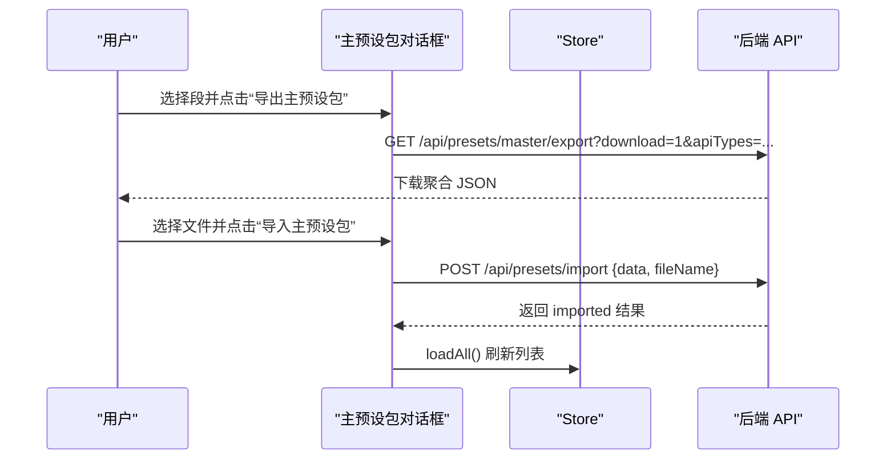
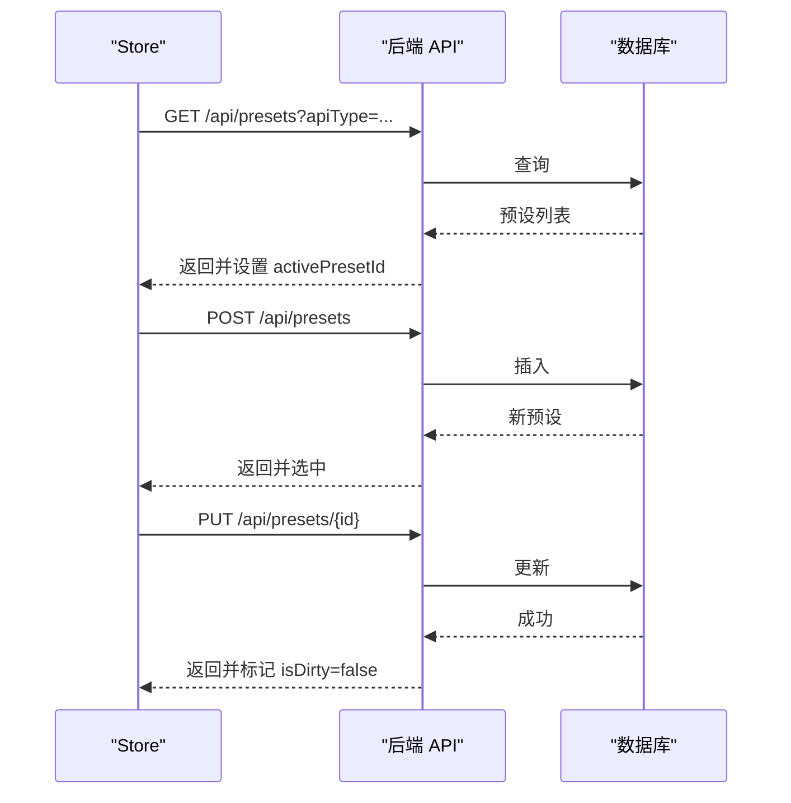
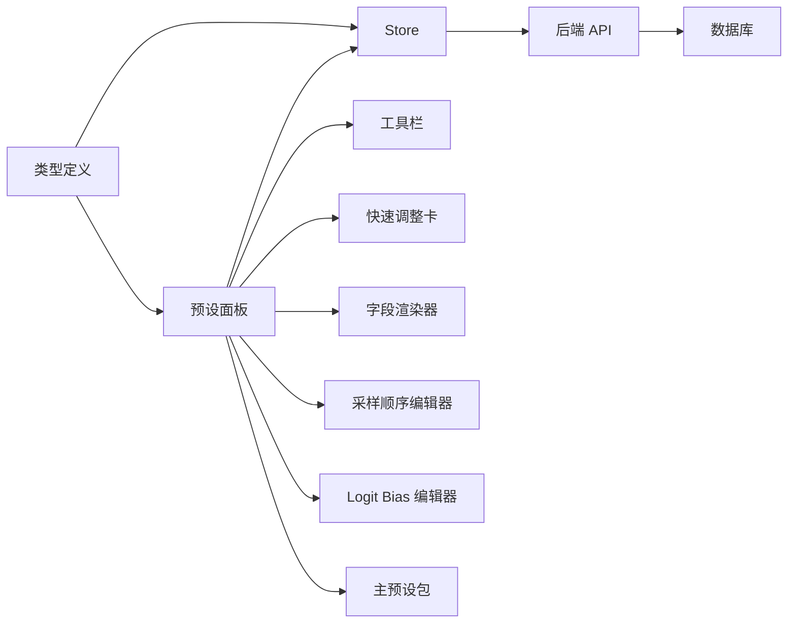

# 文本生成预设

<cite>
**本文引用的文件**
- [src/app/textgen-presets/page.tsx](file://src/app/textgen-presets/page.tsx)
- [src/components/textgen-preset/textgen-preset-panel.tsx](file://src/components/textgen-preset/textgen-preset-panel.tsx)
- [src/components/textgen-preset/preset-toolbar.tsx](file://src/components/textgen-preset/preset-toolbar.tsx)
- [src/components/textgen-preset/quick-tune-card.tsx](file://src/components/textgen-preset/quick-tune-card.tsx)
- [src/components/textgen-preset/field-renderer.tsx](file://src/components/textgen-preset/field-renderer.tsx)
- [src/components/textgen-preset/sampler-order-editor.tsx](file://src/components/textgen-preset/sampler-order-editor.tsx)
- [src/components/textgen-preset/logit-bias-editor.tsx](file://src/components/textgen-preset/logit-bias-editor.tsx)
- [src/components/textgen-preset/master-dialog.tsx](file://src/components/textgen-preset/master-dialog.tsx)
- [src/stores/textgen-preset-store.ts](file://src/stores/textgen-preset-store.ts)
- [src/types/textgen.ts](file://src/types/textgen.ts)
- [src/app/api/presets/route.ts](file://src/app/api/presets/route.ts)
- [drizzle/0002_textgen_preset.sql](file://drizzle/0002_textgen_preset.sql)
- [default/presets/textgen/Default.json](file://default/presets/textgen/Default.json)
- [default/presets/context/Default.json](file://default/presets/context/Default.json)
</cite>

## 目录
1. [简介](#简介)
2. [项目结构](#项目结构)
3. [核心组件](#核心组件)
4. [架构总览](#架构总览)
5. [详细组件分析](#详细组件分析)
6. [依赖关系分析](#依赖关系分析)
7. [性能考虑](#性能考虑)
8. [故障排查指南](#故障排查指南)
9. [结论](#结论)
10. [附录](#附录)

## 简介
本文件面向 SillyTavern Next 的“文本生成预设”系统，系统性阐述 AI 生成参数的配置管理、模板化提示词设计与参数优化策略，并覆盖预设的创建、编辑、导入导出、版本与内置恢复、采样参数控制（温度、最大输出长度等）、分类管理、快速切换与批量应用、以及调优指南与性能优化建议。文档同时提供可视化图示，帮助非技术用户理解参数含义与交互流程。

## 项目结构
文本生成预设系统由前端 UI、状态管理、类型定义与后端 API/数据库迁移共同组成：
- 前端入口与面板：页面路由负责挂载预设面板组件
- 预设面板：提供字段编辑、采样顺序、Logit Bias 等三大区域
- 工具栏：提供 API 类型切换、预设选择与搜索、主操作（保存/另存为/重命名/设为激活/重置改动）、数据操作（导出/导入/恢复内置/主预设包/删除）
- 快速调整卡：高频字段（温度、Top P、Top K、Min P、重复惩罚、重复范围）快捷微调
- 字段渲染器：依据字段元数据驱动的通用控件（数值/布尔/下拉/多行文本/字符串/JSON）
- 采样顺序编辑器：针对不同后端的采样器执行顺序拖拽/移动
- Logit Bias 编辑器：对 token/字符串施加正负偏置
- 主预设包：一次导入/导出多段（文本补全、Instruct、Context、Sysprompt、Reasoning、SRW）
- 状态管理：Zustand store 封装 CRUD、脏检查、导入导出、内置恢复、列表加载与激活
- 类型定义：74 字段全量 schema、字段元数据、默认顺序、API 类型枚举
- 后端 API：预设列表、创建、更新、删除、激活、导入/导出、内置恢复、主预设包
- 数据库迁移：为 presets 表新增 api_type 与 is_active 字段

**图表来源**
- [src/app/textgen-presets/page.tsx:1-10](file://src/app/textgen-presets/page.tsx#L1-L10)
- [src/components/textgen-preset/textgen-preset-panel.tsx:1-145](file://src/components/textgen-preset/textgen-preset-panel.tsx#L1-L145)
- [src/stores/textgen-preset-store.ts:1-376](file://src/stores/textgen-preset-store.ts#L1-L376)
- [src/app/api/presets/route.ts:1-37](file://src/app/api/presets/route.ts#L1-L37)
- [drizzle/0002_textgen_preset.sql:1-5](file://drizzle/0002_textgen_preset.sql#L1-L5)

**章节来源**
- [src/app/textgen-presets/page.tsx:1-10](file://src/app/textgen-presets/page.tsx#L1-L10)
- [src/components/textgen-preset/textgen-preset-panel.tsx:1-145](file://src/components/textgen-preset/textgen-preset-panel.tsx#L1-L145)
- [src/stores/textgen-preset-store.ts:1-376](file://src/stores/textgen-preset-store.ts#L1-L376)
- [src/app/api/presets/route.ts:1-37](file://src/app/api/presets/route.ts#L1-L37)
- [drizzle/0002_textgen_preset.sql:1-5](file://drizzle/0002_textgen_preset.sql#L1-L5)

## 核心组件
- 预设面板：承载三大编辑区域（字段、采样顺序、Logit Bias），顶部工具栏与快速调整卡，Tab 切换与加载/错误状态处理
- 工具栏：API 类型切换、预设选择与搜索、主操作（保存/另存为/重命名/设为激活/重置改动）、数据操作（导出/导入/恢复内置/主预设包/删除）
- 快速调整卡：高频字段（温度、Top P、Top K、Min P、重复惩罚、重复范围）快捷微调
- 字段渲染器：依据字段元数据渲染通用控件，支持数值滑块/输入、布尔开关、下拉、多行文本、字符串、JSON
- 采样顺序编辑器：按后端类型映射默认顺序，支持拖拽与上下移动，支持重置默认
- Logit Bias 编辑器：支持增删改、清空、批量管理
- 主预设包：一次导出/导入多段（文本补全、Instruct、Context、Sysprompt、Reasoning、SRW），自动识别段落并写入对应类型
- 状态管理：Zustand store 提供 CRUD、列表加载、激活、导入导出、内置恢复、脏检查与拦截离开
- 类型定义：74 字段 schema、字段元数据、默认采样顺序、API 类型枚举、字段支持性判断

**章节来源**
- [src/components/textgen-preset/textgen-preset-panel.tsx:1-145](file://src/components/textgen-preset/textgen-preset-panel.tsx#L1-L145)
- [src/components/textgen-preset/preset-toolbar.tsx:1-290](file://src/components/textgen-preset/preset-toolbar.tsx#L1-L290)
- [src/components/textgen-preset/quick-tune-card.tsx:1-61](file://src/components/textgen-preset/quick-tune-card.tsx#L1-L61)
- [src/components/textgen-preset/field-renderer.tsx:1-185](file://src/components/textgen-preset/field-renderer.tsx#L1-L185)
- [src/components/textgen-preset/sampler-order-editor.tsx:1-264](file://src/components/textgen-preset/sampler-order-editor.tsx#L1-L264)
- [src/components/textgen-preset/logit-bias-editor.tsx:1-111](file://src/components/textgen-preset/logit-bias-editor.tsx#L1-L111)
- [src/components/textgen-preset/master-dialog.tsx:1-234](file://src/components/textgen-preset/master-dialog.tsx#L1-L234)
- [src/stores/textgen-preset-store.ts:1-376](file://src/stores/textgen-preset-store.ts#L1-L376)
- [src/types/textgen.ts:1-388](file://src/types/textgen.ts#L1-L388)

## 架构总览
前端通过 Zustand store 与后端 API 交互，store 负责：
- 列表加载与激活：首次访问时按 apiType 自动播种内置预设，随后加载并选择激活项
- 字段编辑：局部 setField 更新 currentSettings，isDirty 标记未保存改动
- CRUD：保存、另存为、重命名、删除、设为激活
- 导入导出：单预设 JSON 导出/导入，主预设包批量导入/导出
- 内置恢复：列出内置名称并恢复指定预设

后端 API：
- GET /api/presets：按 apiType/provider/all 获取预设列表，首次访问自动播种
- POST /api/presets：创建新预设
- PUT /api/presets/{id}：更新预设
- DELETE /api/presets/{id}：删除预设
- POST /api/presets/{id}/activate：设为激活
- POST /api/presets/import：导入 JSON（支持单条或多条）
- GET /api/presets/{id}/export：导出单个预设为 JSON
- POST /api/presets/restore：恢复内置预设
- GET /api/presets/restore：列举内置名称
- GET /api/presets/master/export：导出主预设包（多段聚合）

**图表来源**
- [src/stores/textgen-preset-store.ts:101-137](file://src/stores/textgen-preset-store.ts#L101-L137)
- [src/stores/textgen-preset-store.ts:179-205](file://src/stores/textgen-preset-store.ts#L179-L205)
- [src/app/api/presets/route.ts:5-25](file://src/app/api/presets/route.ts#L5-L25)

**章节来源**
- [src/stores/textgen-preset-store.ts:101-137](file://src/stores/textgen-preset-store.ts#L101-L137)
- [src/app/api/presets/route.ts:5-25](file://src/app/api/presets/route.ts#L5-L25)

## 详细组件分析

### 预设面板与工具栏
- 预设面板：初始化加载、Tab 切换、错误与加载状态、高频快速调整卡、三大编辑区域
- 工具栏：API 类型切换、预设选择与搜索、主操作（保存/另存为/重命名/设为激活/重置改动）、数据操作（导出/导入/恢复内置/主预设包/删除）
- 未保存改动拦截：beforeunload 防误关/刷新/前进后退

**图表来源**
- [src/components/textgen-preset/textgen-preset-panel.tsx:34-49](file://src/components/textgen-preset/textgen-preset-panel.tsx#L34-L49)
- [src/components/textgen-preset/preset-toolbar.tsx:154-243](file://src/components/textgen-preset/preset-toolbar.tsx#L154-L243)

**章节来源**
- [src/components/textgen-preset/textgen-preset-panel.tsx:1-145](file://src/components/textgen-preset/textgen-preset-panel.tsx#L1-L145)
- [src/components/textgen-preset/preset-toolbar.tsx:1-290](file://src/components/textgen-preset/preset-toolbar.tsx#L1-L290)

### 字段元数据与渲染
- 字段元数据：包含字段键、中文标签、英文原名、取值范围、步长、提示、控件类型、可选值、不支持的后端类型
- 字段支持性：isFieldSupported 根据 apiType 与 unsupportedIn 判断是否可用
- 字段分区：13 分区（基础采样、重复惩罚、动态温度、Smoothing、DRY、Mirostat、CFG、XTC/N-Sigma/Adaptive、束搜索、Epsilon/Eta 截断、语法约束、Token 禁用、生成控制）
- 字段渲染器：统一渲染数值/布尔/下拉/多行文本/字符串/JSON 控件，支持禁用与变更回调

**图表来源**
- [src/types/textgen.ts:241-267](file://src/types/textgen.ts#L241-L267)
- [src/types/textgen.ts:273-387](file://src/types/textgen.ts#L273-L387)
- [src/components/textgen-preset/field-renderer.tsx:14-184](file://src/components/textgen-preset/field-renderer.tsx#L14-L184)

**章节来源**
- [src/types/textgen.ts:241-387](file://src/types/textgen.ts#L241-L387)
- [src/components/textgen-preset/field-renderer.tsx:1-185](file://src/components/textgen-preset/field-renderer.tsx#L1-L185)

### 采样顺序编辑器
- 支持后端：OOBA/Mancer/VLLM/Tabby/HuggingFace/Generic、llama.cpp、Aphrodite、KoboldCpp
- 默认顺序：按各后端定义的采样器顺序
- 编辑方式：拖拽排序、上下移动、重置默认
- 显示逻辑：根据 apiType 选择对应字段（sampler_priority/samplers/samplers_priorities/sampler_order）

**图表来源**
- [src/components/textgen-preset/sampler-order-editor.tsx:76-115](file://src/components/textgen-preset/sampler-order-editor.tsx#L76-L115)
- [src/components/textgen-preset/sampler-order-editor.tsx:118-263](file://src/components/textgen-preset/sampler-order-editor.tsx#L118-L263)
- [src/types/textgen.ts:47-103](file://src/types/textgen.ts#L47-L103)

**章节来源**
- [src/components/textgen-preset/sampler-order-editor.tsx:1-264](file://src/components/textgen-preset/sampler-order-editor.tsx#L1-L264)
- [src/types/textgen.ts:47-103](file://src/types/textgen.ts#L47-L103)

### Logit Bias 编辑器
- 支持增删改、清空、批量管理
- 每项包含 id、text（token/字符串）、value（bias 值）
- 提示：正值更可能、负值更不可能；范围一般 -100~100，不同后端定义略有差异

**图表来源**
- [src/components/textgen-preset/logit-bias-editor.tsx:18-111](file://src/components/textgen-preset/logit-bias-editor.tsx#L18-L111)

**章节来源**
- [src/components/textgen-preset/logit-bias-editor.tsx:1-111](file://src/components/textgen-preset/logit-bias-editor.tsx#L1-L111)

### 主预设包（批量导入/导出）
- 导出：按选择的段（文本补全/Instruct/Context/Sysprompt/Reasoning/SRW）导出聚合 JSON
- 导入：解析 JSON，按字段自动识别段并写入对应类型，返回导入结果
- 元信息：记录每段的 apiType、masterKey、name，用于 UI 选择与回显

**图表来源**
- [src/components/textgen-preset/master-dialog.tsx:84-131](file://src/components/textgen-preset/master-dialog.tsx#L84-L131)
- [src/components/textgen-preset/master-dialog.tsx:31-233](file://src/components/textgen-preset/master-dialog.tsx#L31-L233)

**章节来源**
- [src/components/textgen-preset/master-dialog.tsx:1-234](file://src/components/textgen-preset/master-dialog.tsx#L1-L234)

### 快速调整卡
- 高频字段：temp、top_p、top_k、min_p、rep_pen、rep_pen_range
- 作用：减少滚动，快速微调核心采样器

**章节来源**
- [src/components/textgen-preset/quick-tune-card.tsx:1-61](file://src/components/textgen-preset/quick-tune-card.tsx#L1-L61)

### 状态管理与 API 交互
- 列表加载：setApiType -> loadAll -> fetch /api/presets?apiType=... -> 选中策略（active/保留/首个）
- 字段编辑：setField/setSettings/replaceSettings -> isDirty=true
- 保存：PUT /api/presets/{id} -> 更新并刷新列表
- 另存为：POST /api/presets -> 创建新预设并选中
- 删除：DELETE /api/presets/{id} -> 若为激活则切换到下一个或清空
- 设为激活：POST /api/presets/{id}/activate -> 同一 apiType 下仅一项激活
- 导入/导出：/api/presets/import、/api/presets/{id}/export
- 内置恢复：/api/presets/restore（GET 列举名称，POST 恢复指定）

**图表来源**
- [src/stores/textgen-preset-store.ts:101-137](file://src/stores/textgen-preset-store.ts#L101-L137)
- [src/stores/textgen-preset-store.ts:207-234](file://src/stores/textgen-preset-store.ts#L207-L234)
- [src/stores/textgen-preset-store.ts:179-205](file://src/stores/textgen-preset-store.ts#L179-L205)

**章节来源**
- [src/stores/textgen-preset-store.ts:101-376](file://src/stores/textgen-preset-store.ts#L101-L376)

## 依赖关系分析
- 组件耦合
  - 预设面板依赖 store、类型定义、三大编辑器与工具栏
  - 工具栏依赖 store 与类型定义，负责主/次操作
  - 编辑器依赖类型定义与 store 的 onChange
- 外部依赖
  - 后端 API：Next.js 路由封装
  - 数据库：Drizzle 迁移脚本扩展 presets 表
- 循环依赖
  - 未发现直接循环依赖；store 通过 API 间接依赖后端路由

**图表来源**
- [src/components/textgen-preset/textgen-preset-panel.tsx:1-145](file://src/components/textgen-preset/textgen-preset-panel.tsx#L1-L145)
- [src/stores/textgen-preset-store.ts:1-376](file://src/stores/textgen-preset-store.ts#L1-L376)
- [src/app/api/presets/route.ts:1-37](file://src/app/api/presets/route.ts#L1-L37)
- [drizzle/0002_textgen_preset.sql:1-5](file://drizzle/0002_textgen_preset.sql#L1-L5)

**章节来源**
- [src/components/textgen-preset/textgen-preset-panel.tsx:1-145](file://src/components/textgen-preset/textgen-preset-panel.tsx#L1-L145)
- [src/stores/textgen-preset-store.ts:1-376](file://src/stores/textgen-preset-store.ts#L1-L376)
- [src/app/api/presets/route.ts:1-37](file://src/app/api/presets/route.ts#L1-L37)
- [drizzle/0002_textgen_preset.sql:1-5](file://drizzle/0002_textgen_preset.sql#L1-L5)

## 性能考虑
- 状态更新粒度：使用局部 setField，避免全量替换，降低重渲染成本
- 列表加载：首次访问按 apiType 自动播种内置预设，减少空列表等待
- 搜索过滤：前端 useMemo 缓存过滤结果，避免频繁计算
- 导入/导出：主预设包一次请求/响应，减少多次往返
- 采样顺序：仅在需要时渲染拖拽 UI，避免不必要的 DOM
- 字段渲染：统一控件复用，减少组件实例化

[本节为通用指导，无需具体文件引用]

## 故障排查指南
- 无法加载预设
  - 检查网络与认证状态；确认 /api/presets?apiType 参数正确
  - 查看 store.error 并检查后端返回
- 保存失败
  - 检查字段合法性（schema 校验）；确认 isDirty 状态
  - 查看后端 400/401/5xx 错误
- 导入失败
  - 确认 JSON 结构合法；后端会返回错误详情
- 删除后激活丢失
  - 删除激活预设会自动切换到下一个；若无则清空当前设置
- 采样顺序无效
  - 确认当前 apiType 支持该字段；不同后端字段不同

**章节来源**
- [src/stores/textgen-preset-store.ts:131-136](file://src/stores/textgen-preset-store.ts#L131-L136)
- [src/stores/textgen-preset-store.ts:199-204](file://src/stores/textgen-preset-store.ts#L199-L204)
- [src/stores/textgen-preset-store.ts:346-349](file://src/stores/textgen-preset-store.ts#L346-L349)
- [src/components/textgen-preset/sampler-order-editor.tsx:124-130](file://src/components/textgen-preset/sampler-order-editor.tsx#L124-L130)

## 结论
SillyTavern Next 的文本生成预设系统以类型安全的 schema 为核心，结合元数据驱动的 UI 与 Zustand 状态管理，实现了对 74 个采样字段的完整覆盖与跨后端兼容。通过工具栏、快速调整卡、采样顺序与 Logit Bias 编辑器，用户可以高效地进行参数调优与模板化提示词设计。内置播种、导入导出与主预设包进一步提升了预设的可移植性与批量应用能力。建议在实际使用中遵循“先稳定再创新”的原则，逐步微调关键参数，配合主预设包实现团队共享与版本管理。

[本节为总结，无需具体文件引用]

## 附录

### 采样参数与调优要点
- 温度（temp）：0=贪心；0.7-1.0 常用；越高越随机，越低越稳定
- Top P/Top K/Min P：核采样与 Top K 的组合；常用 0.9/40；Min P 可替代
- 重复惩罚（rep_pen）：1 不惩罚；1.05-1.3 常用；过高会破坏流畅度
- DRY：新一代防重复，推荐 0.8 倍率与 1.75 底数
- Mirostat：维持目标困惑度；τ=5，η=0.1 常用
- CFG：negative_prompt 反向引导；guidance_scale 1 禁用
- XTC/N-Sigma/Adaptive：实验性；适度开启可提升多样性
- 束搜索（beam search）：num_beams 越大越慢；length_penalty 控制长度偏好
- Epsilon/Eta 截断：排除低概率 token，提高质量
- 语法约束（Grammar/JSON Schema）：强制结构化输出
- Token 禁用：banned_tokens/global_banned_tokens；ban_eos_token/ignore_eos_token
- 生成控制：do_sample、seed、streaming、max_tokens_second

**章节来源**
- [src/types/textgen.ts:273-387](file://src/types/textgen.ts#L273-L387)

### 最大输出长度与上下文长度
- genamt（amount_gen）：回复 token 上限（生成长度）
- max_length（max_context）：上下文长度
- 建议：根据模型上下文窗口与任务需求合理设置，避免超限

**章节来源**
- [src/types/textgen.ts:227-228](file://src/types/textgen.ts#L227-L228)

### 示例预设参考
- 文本补全默认预设：包含完整采样器顺序与字段
- 上下文模板默认预设：故事串、分隔符、角色占位等

**章节来源**
- [default/presets/textgen/Default.json:1-122](file://default/presets/textgen/Default.json#L1-L122)
- [default/presets/context/Default.json:1-15](file://default/presets/context/Default.json#L1-L15)