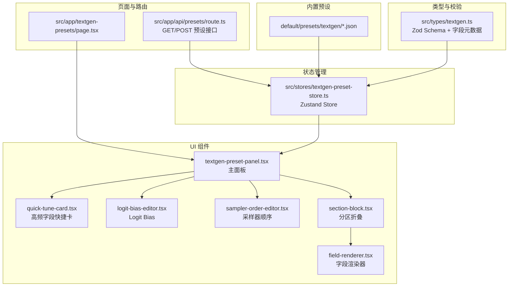
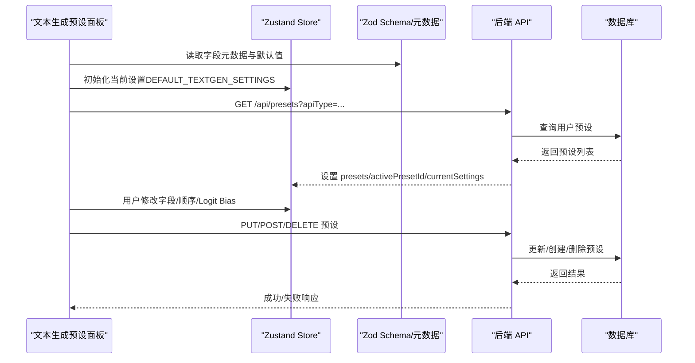
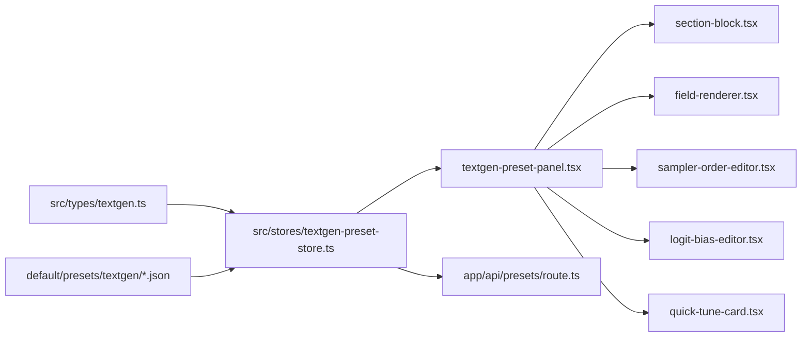

# 预设参数配置

<cite>
**本文引用的文件**
- [src/types/textgen.ts](file://src/types/textgen.ts)
- [src/stores/textgen-preset-store.ts](file://src/stores/textgen-preset-store.ts)
- [src/components/textgen-preset/textgen-preset-panel.tsx](file://src/components/textgen-preset/textgen-preset-panel.tsx)
- [src/components/textgen-preset/section-block.tsx](file://src/components/textgen-preset/section-block.tsx)
- [src/components/textgen-preset/field-renderer.tsx](file://src/components/textgen-preset/field-renderer.tsx)
- [src/components/textgen-preset/sampler-order-editor.tsx](file://src/components/textgen-preset/sampler-order-editor.tsx)
- [src/components/textgen-preset/logit-bias-editor.tsx](file://src/components/textgen-preset/logit-bias-editor.tsx)
- [src/components/textgen-preset/quick-tune-card.tsx](file://src/components/textgen-preset/quick-tune-card.tsx)
- [src/app/textgen-presets/page.tsx](file://src/app/textgen-presets/page.tsx)
- [src/app/api/presets/route.ts](file://src/app/api/presets/route.ts)
- [default/presets/textgen/Default.json](file://default/presets/textgen/Default.json)
- [default/presets/textgen/Universal-Creative.json](file://default/presets/textgen/Universal-Creative.json)
- [default/presets/textgen/Deterministic.json](file://default/presets/textgen/Deterministic.json)
</cite>

## 目录
1. [简介](#简介)
2. [项目结构](#项目结构)
3. [核心组件](#核心组件)
4. [架构总览](#架构总览)
5. [详细组件分析](#详细组件分析)
6. [依赖分析](#依赖分析)
7. [性能考虑](#性能考虑)
8. [故障排查指南](#故障排查指南)
9. [结论](#结论)
10. [附录](#附录)

## 简介
本文件系统性梳理“文本生成预设”的参数配置体系，覆盖采样参数（温度、Top-P、Top-K 等）、约束参数（最大生成长度、停止序列等）、模型特定参数（采样器顺序、Logit Bias 等），并结合前端 UI 组件与后端服务，给出参数作用机制、取值范围、推荐配置、相互影响关系、最佳实践、参数验证规则、默认值与优化策略，以及常见参数组合示例与性能调优建议。

## 项目结构
本模块由“类型与校验层 + 状态管理 + UI 组件 + API 路由 + 内置预设”构成，形成完整的“参数定义—界面渲染—持久化—导入导出”的闭环。

图表来源
- [src/types/textgen.ts:113-233](file://src/types/textgen.ts#L113-L233)
- [src/stores/textgen-preset-store.ts:85-370](file://src/stores/textgen-preset-store.ts#L85-L370)
- [src/components/textgen-preset/textgen-preset-panel.tsx:21-144](file://src/components/textgen-preset/textgen-preset-panel.tsx#L21-L144)
- [src/components/textgen-preset/section-block.tsx:22-80](file://src/components/textgen-preset/section-block.tsx#L22-L80)
- [src/components/textgen-preset/field-renderer.tsx:13-184](file://src/components/textgen-preset/field-renderer.tsx#L13-L184)
- [src/components/textgen-preset/sampler-order-editor.tsx:117-263](file://src/components/textgen-preset/sampler-order-editor.tsx#L117-L263)
- [src/components/textgen-preset/logit-bias-editor.tsx:17-110](file://src/components/textgen-preset/logit-bias-editor.tsx#L17-L110)
- [src/components/textgen-preset/quick-tune-card.tsx:17-60](file://src/components/textgen-preset/quick-tune-card.tsx#L17-L60)
- [src/app/textgen-presets/page.tsx:1-10](file://src/app/textgen-presets/page.tsx#L1-L10)
- [src/app/api/presets/route.ts:5-36](file://src/app/api/presets/route.ts#L5-L36)

章节来源
- [src/types/textgen.ts:113-233](file://src/types/textgen.ts#L113-L233)
- [src/stores/textgen-preset-store.ts:85-370](file://src/stores/textgen-preset-store.ts#L85-L370)
- [src/components/textgen-preset/textgen-preset-panel.tsx:21-144](file://src/components/textgen-preset/textgen-preset-panel.tsx#L21-L144)

## 核心组件
- 参数类型与校验：通过 Zod Schema 定义 74 项参数字段、默认值、取值范围与 passthrough 扩展字段，保证前后端 JSON 互通与强类型约束。
- 字段元数据与分区：提供 13 个参数分区（基础采样、重复惩罚、动态温度、DRY、Mirostat、CFG、XTC/N-Sigma/Adaptive、束搜索、Epsilon/Eta 截断、语法约束、Token 禁用、生成控制），并标注各字段的中文标签、英文原名、类型、范围、步长与提示。
- 状态管理：Zustand Store 提供预设列表、活动预设、当前编辑设置、脏状态、加载/保存错误等管理，并封装 CRUD 与导入导出。
- UI 渲染：元数据驱动的字段渲染器，支持数值滑块/输入、布尔、下拉、多行文本、JSON 等控件；分区折叠块按布尔/非布尔两列布局；采样器顺序编辑器支持拖拽与上下移动；Logit Bias 支持增删改清空；高频字段快捷卡突出最常用参数。
- 页面与路由：页面入口组件挂载主面板；API 路由负责预设列表、创建、激活、导入导出等操作。

章节来源
- [src/types/textgen.ts:240-387](file://src/types/textgen.ts#L240-L387)
- [src/stores/textgen-preset-store.ts:25-65](file://src/stores/textgen-preset-store.ts#L25-L65)
- [src/components/textgen-preset/field-renderer.tsx:13-184](file://src/components/textgen-preset/field-renderer.tsx#L13-L184)
- [src/components/textgen-preset/section-block.tsx:22-80](file://src/components/textgen-preset/section-block.tsx#L22-L80)
- [src/components/textgen-preset/sampler-order-editor.tsx:117-263](file://src/components/textgen-preset/sampler-order-editor.tsx#L117-L263)
- [src/components/textgen-preset/logit-bias-editor.tsx:17-110](file://src/components/textgen-preset/logit-bias-editor.tsx#L17-L110)
- [src/components/textgen-preset/quick-tune-card.tsx:17-60](file://src/components/textgen-preset/quick-tune-card.tsx#L17-L60)
- [src/app/textgen-presets/page.tsx:1-10](file://src/app/textgen-presets/page.tsx#L1-L10)
- [src/app/api/presets/route.ts:5-36](file://src/app/api/presets/route.ts#L5-L36)

## 架构总览
参数配置从“类型定义”出发，经“状态管理”注入到“UI 组件”，最终通过“API 路由”持久化到后端。内置预设作为初始种子参与首次加载。

图表来源
- [src/types/textgen.ts:237-238](file://src/types/textgen.ts#L237-L238)
- [src/stores/textgen-preset-store.ts:85-137](file://src/stores/textgen-preset-store.ts#L85-L137)
- [src/app/api/presets/route.ts:5-36](file://src/app/api/presets/route.ts#L5-L36)

## 详细组件分析

### 参数类型与校验（Zod Schema）
- 字段覆盖：包含采样、重复惩罚、动态温度、平滑、DRY、Mirostat、CFG、XTC/N-Sigma/Adaptive、束搜索、Epsilon/Eta 截断、语法约束、Token 禁用、生成控制等 13 个分区，共计 74 项参数。
- 默认值：每个字段提供合理默认值，确保初次使用即有可用配置。
- 范围与步长：通过元数据定义 min/max/step，配合 UI 渲染器实现精确调节。
- 扩展字段：passthrough 保留未知字段，保证与原项目 preset JSON 双向兼容。
- 运行时字段：如 genamt/max_length 等，用于同步生成上限与上下文长度。

章节来源
- [src/types/textgen.ts:113-233](file://src/types/textgen.ts#L113-L233)
- [src/types/textgen.ts:237-238](file://src/types/textgen.ts#L237-L238)

### 字段元数据与分区（UI 驱动）
- 分区组织：按功能划分为 13 个分区，每个分区含字段清单与中文标题、英文标题与提示。
- 字段类型：number/bool/string/textarea/select/json，分别映射到不同的渲染控件。
- 支持性检测：isFieldSupported 根据 apiType 与字段黑名单决定是否可用，避免在不支持的后端显示无效配置。

章节来源
- [src/types/textgen.ts:240-387](file://src/types/textgen.ts#L240-L387)
- [src/types/textgen.ts:262-267](file://src/types/textgen.ts#L262-L267)

### 状态管理（Zustand Store）
- 关键状态：apiType、presets、activePresetId、currentSettings、isDirty、loading/saving/error。
- 数据解析：parseSettings 使用 Zod schema 将任意输入解析为完整 TextGenSettings，缺失字段以默认值补齐。
- CRUD 与导入导出：封装了加载、选择、保存、另存为、重命名、删除、激活、恢复内置、导入 JSON、导出 Blob 等操作。
- 脏状态：浅比较 currentSettings 与活动预设，若不同则标记 isDirty 并拦截页面卸载。

章节来源
- [src/stores/textgen-preset-store.ts:25-65](file://src/stores/textgen-preset-store.ts#L25-L65)
- [src/stores/textgen-preset-store.ts:67-74](file://src/stores/textgen-preset-store.ts#L67-L74)
- [src/stores/textgen-preset-store.ts:85-370](file://src/stores/textgen-preset-store.ts#L85-L370)

### UI 主面板与分区渲染
- 主面板：包含工具栏、错误提示、加载状态、高频快速调整卡、分区标签页（字段/采样顺序/Logit Bias）。
- 分区块：按布尔/非布尔两列布局，支持展开/收起与字段不可用提示。
- 字段渲染器：统一处理数值滑块/输入、布尔勾选、下拉、多行文本、单行文本、JSON 输入，支持禁用与变更回调。

章节来源
- [src/components/textgen-preset/textgen-preset-panel.tsx:21-144](file://src/components/textgen-preset/textgen-preset-panel.tsx#L21-L144)
- [src/components/textgen-preset/section-block.tsx:22-80](file://src/components/textgen-preset/section-block.tsx#L22-L80)
- [src/components/textgen-preset/field-renderer.tsx:13-184](file://src/components/textgen-preset/field-renderer.tsx#L13-L184)

### 采样器顺序编辑器
- 多后端适配：针对 ooba/mancer/vllm/tabby/infermaticai/featherless/huggingface/generic、llamacpp、aphrodite、koboldcpp 四类后端，提供不同的顺序字段与默认顺序。
- 拖拽与上下移动：支持拖拽排序与按钮微调，恢复默认顺序一键完成。
- 显示逻辑：仅当 apiType 对应字段可用时显示，否则提示不支持。

章节来源
- [src/components/textgen-preset/sampler-order-editor.tsx:117-263](file://src/components/textgen-preset/sampler-order-editor.tsx#L117-L263)
- [src/types/textgen.ts:47-103](file://src/types/textgen.ts#L47-L103)

### Logit Bias 编辑器
- 结构：数组项（id、text、value），支持新增、删除、清空、逐项修改。
- 用途：对特定 token 或字符串施加偏置，正值更可能、负值更不可能，范围通常 -100~100（不同后端定义略有差异）。

章节来源
- [src/components/textgen-preset/logit-bias-editor.tsx:17-110](file://src/components/textgen-preset/logit-bias-editor.tsx#L17-L110)
- [src/types/textgen.ts:105-111](file://src/types/textgen.ts#L105-L111)

### 高频字段快捷卡
- 快速通道：将最常用的 6 个核采样器（温度、Top-P、Top-K、Min-P、重复惩罚、重复惩罚范围）置顶展示，减少滚动与查找成本。
- 支持性：根据 isFieldSupported 判断是否可用。

章节来源
- [src/components/textgen-preset/quick-tune-card.tsx:17-60](file://src/components/textgen-preset/quick-tune-card.tsx#L17-L60)
- [src/types/textgen.ts:262-267](file://src/types/textgen.ts#L262-L267)

### 页面与 API 路由
- 页面入口：渲染 TextGenPresetPanel。
- API 路由：GET 列表（支持首次访问自动播种内置默认预设）、POST 创建、支持 provider 与 apiType 过滤；同时提供导入导出与激活等操作。

章节来源
- [src/app/textgen-presets/page.tsx:1-10](file://src/app/textgen-presets/page.tsx#L1-L10)
- [src/app/api/presets/route.ts:5-36](file://src/app/api/presets/route.ts#L5-L36)

## 依赖分析
- 类型层依赖：UI 组件与状态管理均依赖 src/types/textgen.ts 的 Schema 与元数据。
- 状态层依赖：Store 依赖类型层进行解析与默认值填充。
- UI 层依赖：主面板依赖分区块、字段渲染器、采样顺序编辑器、Logit Bias 编辑器、快捷卡。
- 路由依赖：Store 通过 fetch 调用 API 路由，实现 CRUD 与导入导出。
- 内置预设依赖：Store 在首次加载时根据 apiType 与 seed 参数触发播种。

图表来源
- [src/types/textgen.ts:113-233](file://src/types/textgen.ts#L113-L233)
- [src/stores/textgen-preset-store.ts:85-370](file://src/stores/textgen-preset-store.ts#L85-L370)
- [src/components/textgen-preset/textgen-preset-panel.tsx:21-144](file://src/components/textgen-preset/textgen-preset-panel.tsx#L21-L144)
- [src/app/api/presets/route.ts:5-36](file://src/app/api/presets/route.ts#L5-L36)
- [default/presets/textgen/Default.json:1-122](file://default/presets/textgen/Default.json#L1-L122)

## 性能考虑
- 流式输出：开启 streaming 可实现实时 token 返回，降低首 token 延迟；关闭则一次性返回完整结果，适合批量处理。
- 速率限制：max_tokens_second 可限制每秒 token 数，避免后端过载。
- 推测解码：speculative_ngram 可加速推理，但需后端支持且可能影响稳定性。
- 采样器顺序：将对结果影响较大的采样器（如重复惩罚、温度、Top-P/TOP-K）前置，有助于更快收敛到期望行为。
- 日志与调试：store 提供 error 字段与 console 错误记录，便于定位网络与解析异常。

章节来源
- [src/types/textgen.ts:352-362](file://src/types/textgen.ts#L352-L362)
- [src/stores/textgen-preset-store.ts:131-136](file://src/stores/textgen-preset-store.ts#L131-L136)

## 故障排查指南
- 预设加载失败：检查 API 路由返回状态与错误信息，确认用户认证与 apiType 参数正确。
- 保存失败：查看 store 的 error 字段，确认请求体结构与必填字段（name/settings）有效。
- 字段不可用：使用 isFieldSupported 检查 apiType 与字段黑名单，避免在不支持的后端配置不兼容参数。
- JSON Schema/语法约束：确保 GBNF/JSON Schema 语法正确，部分后端（如 TabbyAPI、llama.cpp、Aphrodite）才支持。
- Logit Bias：注意不同后端的 bias 定义差异，避免过大绝对值导致极端输出。

章节来源
- [src/stores/textgen-preset-store.ts:101-137](file://src/stores/textgen-preset-store.ts#L101-L137)
- [src/stores/textgen-preset-store.ts:179-205](file://src/stores/textgen-preset-store.ts#L179-L205)
- [src/types/textgen.ts:339-342](file://src/types/textgen.ts#L339-L342)

## 结论
本模块通过强类型 Schema、元数据驱动的 UI、完善的 CRUD 与导入导出能力，构建了可扩展、可移植、可优化的文本生成参数配置体系。建议在实际使用中遵循“先基础采样、再重复惩罚、最后高级采样器”的顺序调整策略，并结合内置预设进行快速迭代与性能调优。

## 附录

### 参数分类与作用机制（摘要）
- 基础采样
  - 温度（temp）：控制随机性，0=贪心；推荐 0.7-1.0。
  - Top-P（top_p）：核采样，常用 0.9-0.95；1=禁用。
  - Top-K（top_k）：限制最高 K 个候选；0=禁用；常用 40-100。
  - Min-P（min_p）：动态最小概率截断，可替代 Top-P/Top-K。
  - 典型 P（typical_p）、尾部自由采样（tfs）、Top-A（top_a）：细化分布截断与平滑。
- 重复惩罚
  - 重复惩罚（rep_pen）、频率惩罚（freq_pen）、存在惩罚（presence_pen）、N-gram 禁止（no_repeat_ngram_size）、编码器重复惩罚（encoder_rep_pen）：防止循环与重复。
- 动态温度
  - dynatemp、min_temp、max_temp、dynatemp_exponent：按熵动态调整温度。
- 平滑与 DRY
  - 平滑因子/曲线（smoothing_factor/smoothing_curve）：实验性。
  - DRY（dry_multiplier/dry_base/dry_allowed_length/dry_penalty_last_n/dry_sequence_breakers）：新一代防重复。
- Mirostat
  - mirostat_mode、mirostat_tau、mirostat_eta：维持目标困惑度的自适应采样。
- CFG（无分类引导）
  - guidance_scale、negative_prompt：对负面提示词的反向引导。
- XTC/N-Sigma/Adaptive
  - xtc_threshold、xtc_probability、nsigma、min_keep、adaptive_target、adaptive_decay：实验性增强采样。
- 束搜索
  - penalty_alpha、num_beams、length_penalty、min_length、early_stopping：控制生成长度与质量权衡。
- 截断
  - epsilon_cutoff、eta_cutoff：概率极低 token 的截断。
- 语法约束
  - grammar_string（GBNF）、json_schema、json_schema_allow_empty：强制结构化输出。
- Token 禁用
  - banned_tokens/global_banned_tokens/send_banned_tokens、ban_eos_token、ignore_eos_token、skip_special_tokens：控制输出 token。
- 生成控制
  - do_sample、seed、skew、add_bos_token、spaces_between_special_tokens、include_reasoning、speculative_ngram、streaming、max_tokens_second：整体生成行为控制。

章节来源
- [src/types/textgen.ts:117-233](file://src/types/textgen.ts#L117-L233)
- [src/types/textgen.ts:273-387](file://src/types/textgen.ts#L273-L387)

### 参数取值范围与推荐配置（摘要）
- 温度（temp）：0-5，默认 0.7；创意写作可 1.0-1.5。
- Top-P（top_p）：0-1，默认 0.5；常用 0.9-0.95。
- Top-K（top_k）：0-200，默认 40；常用 40-100。
- Min-P（min_p）：0-1，默认 0；常用 0.05-0.1。
- 重复惩罚（rep_pen）：1-3，默认 1.2；过高会破坏流畅度。
- DRY（dry_multiplier）：0-5，默认 0；推荐 0.8。
- Mirostat（mirostat_mode）：0/1/2；常用 0（禁用）或 2。
- CFG（guidance_scale）：0-5，默认 1；常用 1（禁用）或 1.3-1.7。
- 速率限制（max_tokens_second）：0-1000，默认 0（不限制）。

章节来源
- [src/types/textgen.ts:273-387](file://src/types/textgen.ts#L273-L387)

### 参数验证规则与默认值
- Zod 校验：所有字段均有默认值与范围约束；passthrough 保留扩展字段。
- 解析容错：parseSettings 在解析失败时回退到默认值集合，避免崩溃。
- 字段支持：isFieldSupported 根据 apiType 与 unsupportedIn 黑名单决定显示/可用。

章节来源
- [src/types/textgen.ts:117-233](file://src/types/textgen.ts#L117-L233)
- [src/types/textgen.ts:262-267](file://src/types/textgen.ts#L262-L267)
- [src/stores/textgen-preset-store.ts:67-74](file://src/stores/textgen-preset-store.ts#L67-L74)

### 参数优化策略与最佳实践
- 调参顺序：先调 temp 与 top_p/top_k，再引入重复惩罚与 DRY，最后尝试 Mirostat/CFG/XTC 等。
- 采样器顺序：将重复惩罚、温度、Top-P/Top-K 等前置，提升收敛速度与一致性。
- 生成控制：需要稳定输出时关闭 do_sample 或设置 seed；需要流式体验时开启 streaming。
- 结构化输出：优先使用 JSON Schema（部分后端支持），其次 GBNF 语法约束。
- 性能优先：在高并发场景下适当降低 max_tokens_second，启用 speculative_ngram（若后端支持）。

章节来源
- [src/types/textgen.ts:352-362](file://src/types/textgen.ts#L352-L362)
- [src/components/textgen-preset/sampler-order-editor.tsx:117-263](file://src/components/textgen-preset/sampler-order-editor.tsx#L117-L263)

### 常见参数组合示例
- 默认稳健组合（适合通用对话）
  - 温度：0.7；Top-P：0.9；Top-K：40；重复惩罚：1.1；DRY：0.8；Min-P：0.01；采样顺序：重复惩罚→温度→Top-P→Top-K。
  - 参考路径：[default/presets/textgen/Default.json:1-122](file://default/presets/textgen/Default.json#L1-L122)
- 创意写作组合（追求多样性）
  - 温度：1.5；Top-P：1.0；Min-P：0.1；重复惩罚：1.0；采样顺序：温度→Top-P→Min-P→重复惩罚。
  - 参考路径：[default/presets/textgen/Universal-Creative.json:1-120](file://default/presets/textgen/Universal-Creative.json#L1-L120)
- 确定性输出组合（追求稳定）
  - 温度：0；Top-P：0；Top-K：1；do_sample：false；采样顺序：温度→Top-K。
  - 参考路径：[default/presets/textgen/Deterministic.json:1-120](file://default/presets/textgen/Deterministic.json#L1-L120)

章节来源
- [default/presets/textgen/Default.json:1-122](file://default/presets/textgen/Default.json#L1-L122)
- [default/presets/textgen/Universal-Creative.json:1-120](file://default/presets/textgen/Universal-Creative.json#L1-L120)
- [default/presets/textgen/Deterministic.json:1-120](file://default/presets/textgen/Deterministic.json#L1-L120)