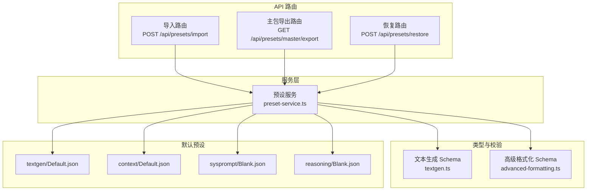
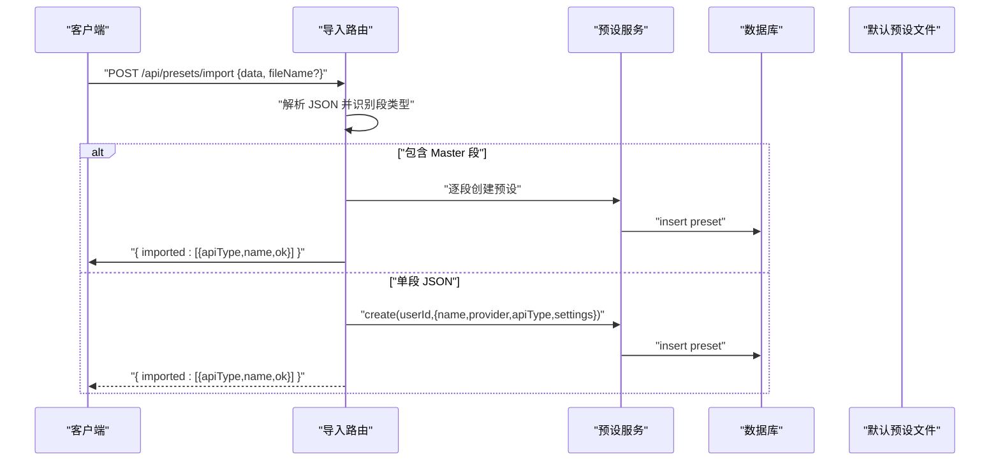
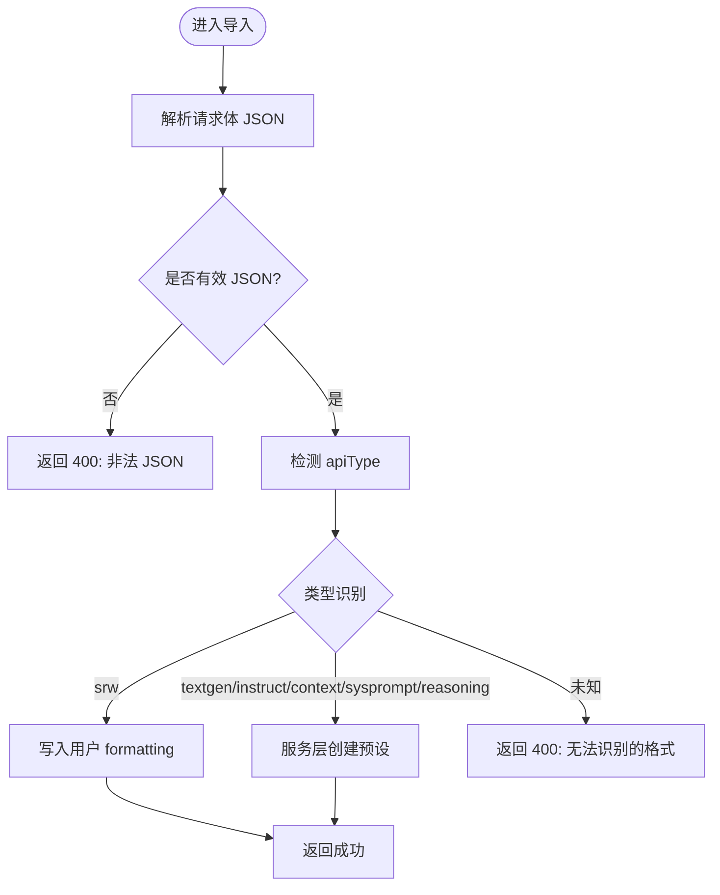
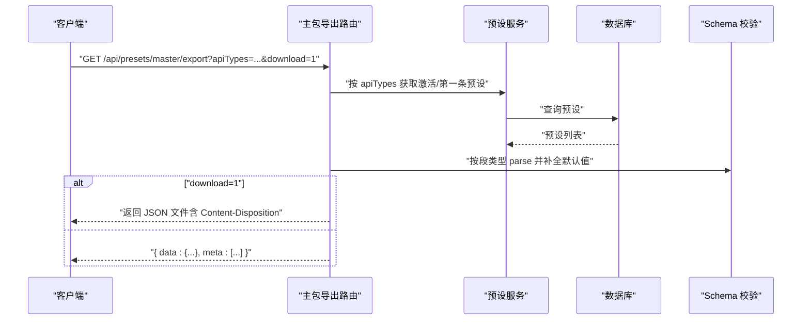
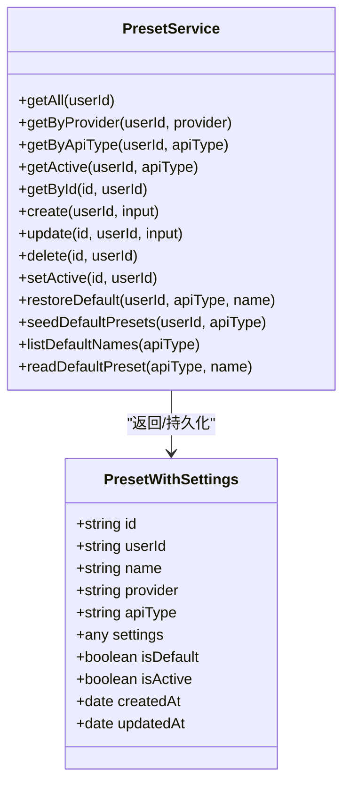
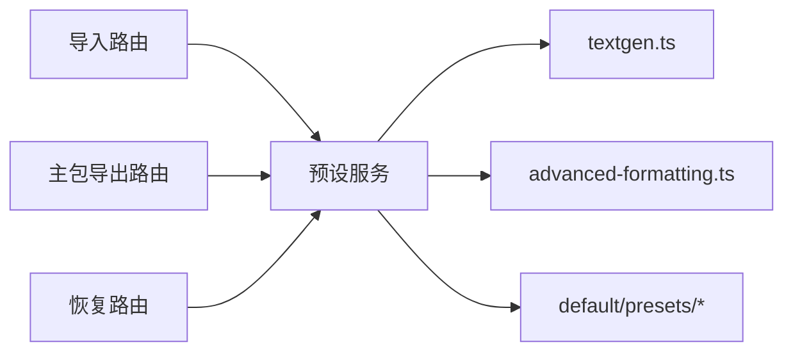

# 预设导入导出

<cite>
**本文引用的文件**
- [src/app/api/presets/import/route.ts](file://src/app/api/presets/import/route.ts)
- [src/app/api/presets/master/export/route.ts](file://src/app/api/presets/master/export/route.ts)
- [src/app/api/presets/restore/route.ts](file://src/app/api/presets/restore/route.ts)
- [src/lib/services/preset-service.ts](file://src/lib/services/preset-service.ts)
- [src/types/textgen.ts](file://src/types/textgen.ts)
- [src/types/advanced-formatting.ts](file://src/types/advanced-formatting.ts)
- [default/presets/textgen/Default.json](file://default/presets/textgen/Default.json)
- [default/presets/context/Default.json](file://default/presets/context/Default.json)
- [default/presets/sysprompt/Blank.json](file://default/presets/sysprompt/Blank.json)
- [default/presets/reasoning/Blank.json](file://default/presets/reasoning/Blank.json)
</cite>

## 目录
1. [简介](#简介)
2. [项目结构](#项目结构)
3. [核心组件](#核心组件)
4. [架构总览](#架构总览)
5. [详细组件分析](#详细组件分析)
6. [依赖关系分析](#依赖关系分析)
7. [性能考量](#性能考量)
8. [故障排查指南](#故障排查指南)
9. [结论](#结论)
10. [附录](#附录)

## 简介
本文件面向“文本生成预设”的导入与导出能力，系统性说明以下内容：
- JSON 预设数据结构与序列化机制
- 导入流程中的格式识别、数据验证与错误处理
- 导出流程中的文件生成、命名规则与下载机制
- 跨平台兼容性、版本升级与数据迁移策略
- 预设分享、备份与恢复的操作步骤与注意事项

## 项目结构
与预设导入导出直接相关的后端路由集中在 API 层，业务逻辑由服务层实现，类型与校验通过 Zod schema 提供保障。默认预设位于 default/presets/* 目录，便于恢复与迁移。

图表来源
- [src/app/api/presets/import/route.ts:107-191](file://src/app/api/presets/import/route.ts#L107-L191)
- [src/app/api/presets/master/export/route.ts:81-146](file://src/app/api/presets/master/export/route.ts#L81-L146)
- [src/app/api/presets/restore/route.ts:11-32](file://src/app/api/presets/restore/route.ts#L11-L32)
- [src/lib/services/preset-service.ts:140-323](file://src/lib/services/preset-service.ts#L140-L323)
- [src/types/textgen.ts:117-233](file://src/types/textgen.ts#L117-L233)
- [src/types/advanced-formatting.ts:34-144](file://src/types/advanced-formatting.ts#L34-L144)

章节来源
- [src/app/api/presets/import/route.ts:107-191](file://src/app/api/presets/import/route.ts#L107-L191)
- [src/app/api/presets/master/export/route.ts:81-146](file://src/app/api/presets/master/export/route.ts#L81-L146)
- [src/app/api/presets/restore/route.ts:11-32](file://src/app/api/presets/restore/route.ts#L11-L32)
- [src/lib/services/preset-service.ts:140-323](file://src/lib/services/preset-service.ts#L140-L323)
- [src/types/textgen.ts:117-233](file://src/types/textgen.ts#L117-L233)
- [src/types/advanced-formatting.ts:34-144](file://src/types/advanced-formatting.ts#L34-L144)

## 核心组件
- 导入路由：识别单段或多段 Master JSON，进行格式判定、写入 SRW（聊天前缀）到用户设置，以及创建预设记录。
- 主包导出路由：按段聚合导出（instruct/context/sysprompt/preset/reasoning/srw），支持按需筛选与下载。
- 恢复路由：将内置默认预设恢复到当前用户库。
- 预设服务：提供 CRUD、激活状态管理、默认预设读取与种子填充、恢复默认等功能。
- 类型与校验：文本生成与高级格式化均提供 Zod schema，用于导入导出时的字段补全与兼容。

章节来源
- [src/app/api/presets/import/route.ts:107-191](file://src/app/api/presets/import/route.ts#L107-L191)
- [src/app/api/presets/master/export/route.ts:81-146](file://src/app/api/presets/master/export/route.ts#L81-L146)
- [src/app/api/presets/restore/route.ts:11-32](file://src/app/api/presets/restore/route.ts#L11-L32)
- [src/lib/services/preset-service.ts:140-323](file://src/lib/services/preset-service.ts#L140-L323)
- [src/types/textgen.ts:117-233](file://src/types/textgen.ts#L117-L233)
- [src/types/advanced-formatting.ts:34-144](file://src/types/advanced-formatting.ts#L34-L144)

## 架构总览
导入/导出围绕“用户会话 -> 路由 -> 服务层 -> 数据库/文件系统 -> 响应”展开，类型校验贯穿其中，确保与上游项目格式兼容。

图表来源
- [src/app/api/presets/import/route.ts:107-191](file://src/app/api/presets/import/route.ts#L107-L191)
- [src/lib/services/preset-service.ts:188-203](file://src/lib/services/preset-service.ts#L188-L203)

## 详细组件分析

### 导入流程（单段与 Master 多段）
- 格式识别
  - 依据字段集合判断 apiType：textgen（含温度/采样/惩罚等字段）、instruct（含 name/input_sequence/output_sequence）、context（含 name/story_string）、sysprompt（含 name/content 且非 instruct/context）、reasoning（含 name/prefix/suffix/separator）、srw（含 value/show）。
- 单段导入
  - 若为 srw，直接写入用户设置的 formatting.start_reply_with 与 show_reply_prefix。
  - 其他类型通过服务层创建预设记录。
- Master 多段导入
  - 支持同时导入多个段，逐段创建；srw 段单独写入 formatting，不创建预设。
  - 未显式 name 时，使用 fileName 或拼接键名作为默认名称。
- 错误处理
  - 非法 JSON、未授权、无法识别格式、写入失败等均有明确响应与日志记录。

图表来源
- [src/app/api/presets/import/route.ts:107-191](file://src/app/api/presets/import/route.ts#L107-L191)

章节来源
- [src/app/api/presets/import/route.ts:107-191](file://src/app/api/presets/import/route.ts#L107-L191)

### 导出流程（主包多段）
- 导出结构
  - 输出包含 instruct/context/sysprompt/preset/reasoning/srw 六段，与上游项目兼容。
  - 每段 settings 经相应 schema 解析，补全默认字段，确保与运行时快照一致。
- 选择策略
  - 每段优先取当前激活预设；若无激活则取该 apiType 下第一条；srw 从用户 formatting 读取。
- 下载机制
  - 支持查询参数 download=1，返回带 Content-Disposition 的 JSON 文件，文件名为 master-{ISO 时间戳}.json。
- 过滤
  - 可通过 apiTypes 参数逗号分隔过滤段类型。

图表来源
- [src/app/api/presets/master/export/route.ts:81-146](file://src/app/api/presets/master/export/route.ts#L81-L146)
- [src/types/textgen.ts:42-64](file://src/types/textgen.ts#L42-L64)
- [src/types/advanced-formatting.ts:34-144](file://src/types/advanced-formatting.ts#L34-L144)

章节来源
- [src/app/api/presets/master/export/route.ts:81-146](file://src/app/api/presets/master/export/route.ts#L81-L146)
- [src/types/textgen.ts:42-64](file://src/types/textgen.ts#L42-L64)
- [src/types/advanced-formatting.ts:34-144](file://src/types/advanced-formatting.ts#L34-L144)

### 恢复默认预设
- 支持按 name 与 apiType 恢复内置默认预设；若用户库中已存在同名同类型预设，则更新其 settings；否则新建并标记为默认。
- 提供列出内置默认预设名称的接口，便于前端展示。

章节来源
- [src/app/api/presets/restore/route.ts:11-32](file://src/app/api/presets/restore/route.ts#L11-L32)
- [src/lib/services/preset-service.ts:257-287](file://src/lib/services/preset-service.ts#L257-L287)

### 预设服务与数据模型
- 预设记录包含 id、userId、name、provider、apiType、settings（JSON 字符串）、isDefault、isActive 等字段。
- 服务层提供：
  - 列表、按 provider/apiType 查询、按 id 获取、创建、更新、删除、设置唯一激活、恢复默认、种子填充默认预设等。
- 默认预设读取：根据 apiType 映射到 default/presets/* 目录，读取对应 JSON 文件。

图表来源
- [src/lib/services/preset-service.ts:56-88](file://src/lib/services/preset-service.ts#L56-L88)
- [src/lib/services/preset-service.ts:140-323](file://src/lib/services/preset-service.ts#L140-L323)

章节来源
- [src/lib/services/preset-service.ts:56-88](file://src/lib/services/preset-service.ts#L56-L88)
- [src/lib/services/preset-service.ts:140-323](file://src/lib/services/preset-service.ts#L140-L323)

### JSON 预设数据结构与序列化
- 文本生成（textgen）：字段与上游项目对齐，包含采样、惩罚、动态温度、DRY、Mirostat、CFG、XTC/N-Sigma/Adaptive、束搜索、截断、语法/JSON Schema、禁用 Token、生成控制等，均以 snake_case 命名，使用 Zod schema 完成默认值补全与 passthrough 保留未知字段。
- 上下文模板（context）：包含 story_string、分隔符、激活正则、角色注入策略、单行生成等字段。
- 指令模板（instruct）：包含输入/输出/系统序列、首次/末次序列、停止序列、宏行为等。
- 系统提示（sysprompt）：包含 content 与 post_history。
- 推理模板（reasoning）：包含 prefix/suffix/separator。
- 全局格式化（srw）：存储于用户设置 formatting，包含 start_reply_with 与 show_reply_prefix。

章节来源
- [src/types/textgen.ts:117-233](file://src/types/textgen.ts#L117-L233)
- [src/types/advanced-formatting.ts:34-144](file://src/types/advanced-formatting.ts#L34-L144)
- [default/presets/textgen/Default.json:1-122](file://default/presets/textgen/Default.json#L1-L122)
- [default/presets/context/Default.json:1-15](file://default/presets/context/Default.json#L1-L15)
- [default/presets/sysprompt/Blank.json:1-6](file://default/presets/sysprompt/Blank.json#L1-L6)
- [default/presets/reasoning/Blank.json:1-7](file://default/presets/reasoning/Blank.json#L1-L7)

## 依赖关系分析
- 导入路由依赖预设服务与用户认证；对 srw 段额外访问用户设置表。
- 主包导出路由依赖预设服务与多种 schema；按需返回文件或 JSON。
- 恢复路由依赖预设服务与默认预设文件系统。
- 类型与校验通过 Zod schema 保证字段完整性与兼容性。

图表来源
- [src/app/api/presets/import/route.ts:107-191](file://src/app/api/presets/import/route.ts#L107-L191)
- [src/app/api/presets/master/export/route.ts:81-146](file://src/app/api/presets/master/export/route.ts#L81-L146)
- [src/app/api/presets/restore/route.ts:11-32](file://src/app/api/presets/restore/route.ts#L11-L32)
- [src/lib/services/preset-service.ts:140-323](file://src/lib/services/preset-service.ts#L140-L323)
- [src/types/textgen.ts:117-233](file://src/types/textgen.ts#L117-L233)
- [src/types/advanced-formatting.ts:34-144](file://src/types/advanced-formatting.ts#L34-L144)

章节来源
- [src/app/api/presets/import/route.ts:107-191](file://src/app/api/presets/import/route.ts#L107-L191)
- [src/app/api/presets/master/export/route.ts:81-146](file://src/app/api/presets/master/export/route.ts#L81-L146)
- [src/app/api/presets/restore/route.ts:11-32](file://src/app/api/presets/restore/route.ts#L11-L32)
- [src/lib/services/preset-service.ts:140-323](file://src/lib/services/preset-service.ts#L140-L323)
- [src/types/textgen.ts:117-233](file://src/types/textgen.ts#L117-L233)
- [src/types/advanced-formatting.ts:34-144](file://src/types/advanced-formatting.ts#L34-L144)

## 性能考量
- 导入/导出涉及数据库查询与文件读取，建议：
  - 导入时批量处理 Master 段，减少多次数据库往返。
  - 导出时按需筛选 apiTypes，避免不必要的段加载。
  - 使用 schema 解析补全默认值发生在导出阶段，注意对大段 settings 的处理开销。
- 建议对用户设置表的读写采用缓存策略（如内存缓存）以降低频繁读取成本。

## 故障排查指南
- 导入报错“非法 JSON”
  - 检查请求体是否为合法 JSON；确认包含 data 字段或顶层即为预设对象。
- 导入报错“无法识别的格式”
  - 确认 JSON 字段集合满足任一类型识别条件；必要时补充缺失字段。
- 导入 srw 失败
  - 检查用户设置表读写权限；查看服务端日志定位异常。
- 导出为空或缺少段
  - 确认用户是否存在对应 apiType 的激活或默认预设；检查 apiTypes 过滤参数。
- 下载文件名异常
  - 确认 download=1 参数；浏览器/系统对文件名字符的兼容性问题需在客户端处理。

章节来源
- [src/app/api/presets/import/route.ts:112-115](file://src/app/api/presets/import/route.ts#L112-L115)
- [src/app/api/presets/import/route.ts:162-164](file://src/app/api/presets/import/route.ts#L162-L164)
- [src/app/api/presets/master/export/route.ts:133-142](file://src/app/api/presets/master/export/route.ts#L133-L142)

## 结论
本方案通过统一的类型校验与服务层抽象，实现了与上游项目的 JSON 格式兼容与双向互操作。导入/导出流程清晰、错误处理完善，并提供了主包多段导出与下载、SRW 写入用户设置等关键能力。配合默认预设恢复与种子填充，能够满足分享、备份与迁移场景的需求。

## 附录

### JSON 预设字段与类型速览
- 文本生成（textgen）
  - 关键字段：采样、惩罚、动态温度、DRY、Mirostat、CFG、XTC/N-Sigma/Adaptive、束搜索、截断、语法/JSON Schema、禁用 Token、生成控制等。
  - 命名：snake_case，与上游项目对齐。
- 上下文模板（context）
  - 关键字段：story_string、example_separator、chat_start、use_stop_strings、names_as_stop_strings、story_string_position/depth/role、always_force_name2、trim_sentences、single_line、activation_regex。
- 指令模板（instruct）
  - 关键字段：enabled、bind_to_context、activation_regex、wrap、macro、sequences_as_stop_strings、skip_examples、names_behavior、story_string_*、input_*、output_*、system_*、first/last_*、stop_sequence、user_alignment_message。
- 系统提示（sysprompt）
  - 关键字段：name、content、post_history。
- 推理模板（reasoning）
  - 关键字段：name、prefix、suffix、separator。
- 全局格式化（srw）
  - 关键字段：start_reply_with、show_reply_prefix（存储于用户设置 formatting）。

章节来源
- [src/types/textgen.ts:117-233](file://src/types/textgen.ts#L117-L233)
- [src/types/advanced-formatting.ts:34-144](file://src/types/advanced-formatting.ts#L34-L144)
- [default/presets/textgen/Default.json:1-122](file://default/presets/textgen/Default.json#L1-L122)
- [default/presets/context/Default.json:1-15](file://default/presets/context/Default.json#L1-L15)
- [default/presets/sysprompt/Blank.json:1-6](file://default/presets/sysprompt/Blank.json#L1-L6)
- [default/presets/reasoning/Blank.json:1-7](file://default/presets/reasoning/Blank.json#L1-L7)

### 导入/导出操作步骤与注意事项
- 导入
  - 准备 JSON：单段或 Master 多段；Master 段包含 instruct/context/sysprompt/preset/reasoning/srw。
  - 发送请求：POST /api/presets/import，请求体包含 data 与可选 fileName。
  - 查看结果：返回 imported 数组，包含每一段的 apiType、name 与 ok 状态。
  - 注意事项：确保字段集合满足识别条件；srw 会写入用户 formatting。
- 导出
  - 单段导出：按 apiType 查询并导出该段 settings。
  - 主包导出：GET /api/presets/master/export，可选参数 apiTypes 与 download。
  - 下载：download=1 时返回带 Content-Disposition 的 JSON 文件，文件名为 master-{ISO 时间戳}.json。
  - 注意事项：导出 settings 会经 schema 补全默认值；若用户无对应预设，导出可能为空。
- 恢复默认
  - POST /api/presets/restore，请求体包含 name 与可选 apiType；或 GET /api/presets/restore?apiType=xxx 获取默认预设名称列表。
  - 注意事项：若用户库已存在同名同类型预设，将更新其 settings；否则新建并标记为默认。
- 分享与备份
  - 使用主包导出功能生成包含六段的 JSON 包，便于分享与归档。
  - 备份时建议同时导出并记录 meta 信息，以便后续迁移与对照。

章节来源
- [src/app/api/presets/import/route.ts:107-191](file://src/app/api/presets/import/route.ts#L107-L191)
- [src/app/api/presets/master/export/route.ts:81-146](file://src/app/api/presets/master/export/route.ts#L81-L146)
- [src/app/api/presets/restore/route.ts:11-32](file://src/app/api/presets/restore/route.ts#L11-L32)