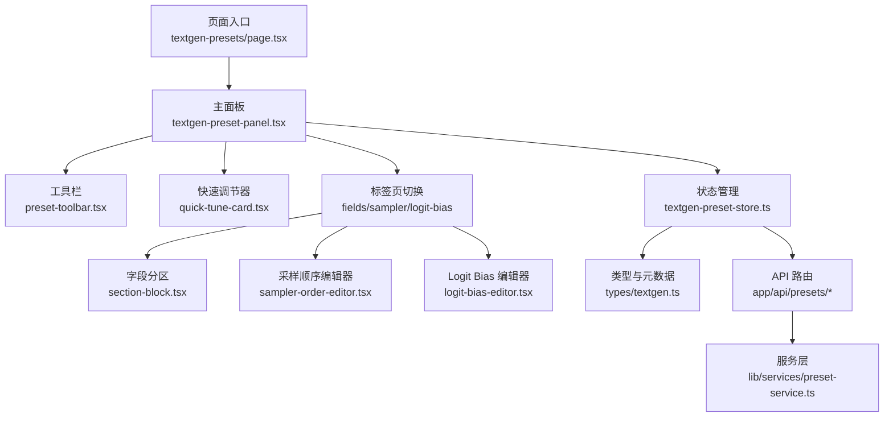
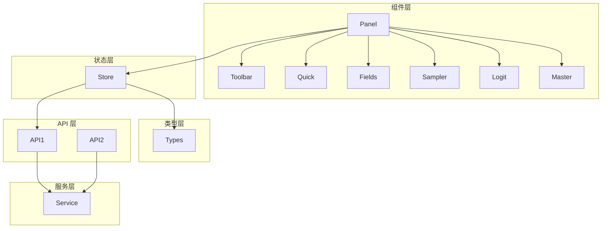
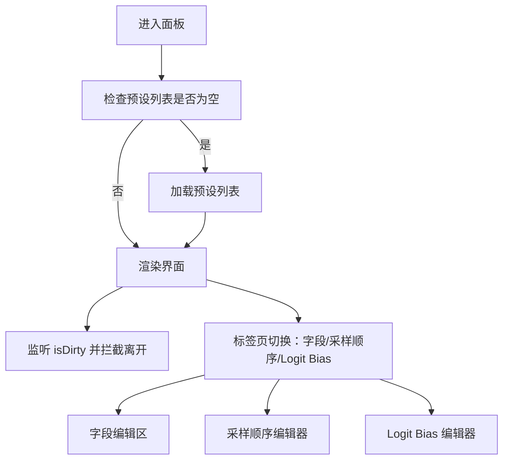
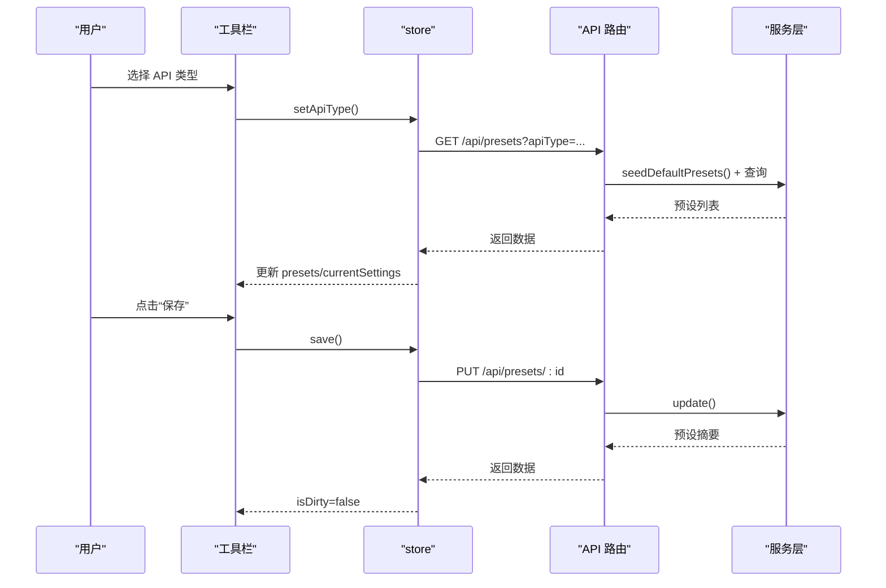
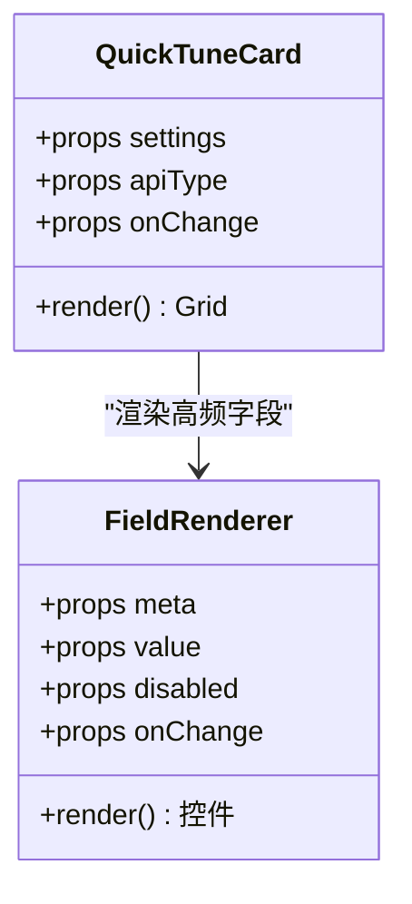
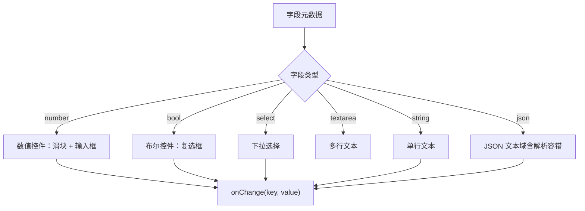
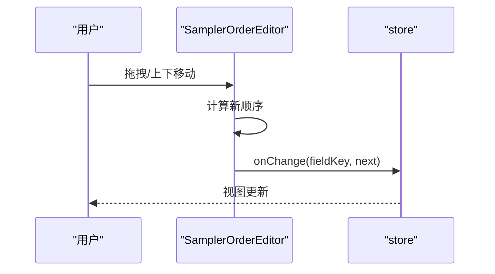
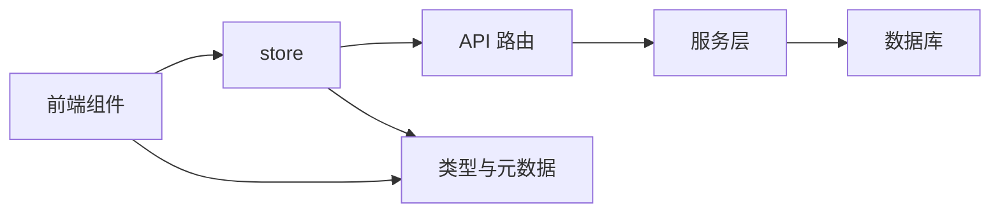

# 预设界面组件

<cite>
**本文引用的文件**
- [src/app/textgen-presets/page.tsx](file://src/app/textgen-presets/page.tsx)
- [src/components/textgen-preset/textgen-preset-panel.tsx](file://src/components/textgen-preset/textgen-preset-panel.tsx)
- [src/components/textgen-preset/preset-toolbar.tsx](file://src/components/textgen-preset/preset-toolbar.tsx)
- [src/components/textgen-preset/quick-tune-card.tsx](file://src/components/textgen-preset/quick-tune-card.tsx)
- [src/components/textgen-preset/section-block.tsx](file://src/components/textgen-preset/section-block.tsx)
- [src/components/textgen-preset/field-renderer.tsx](file://src/components/textgen-preset/field-renderer.tsx)
- [src/components/textgen-preset/sampler-order-editor.tsx](file://src/components/textgen-preset/sampler-order-editor.tsx)
- [src/components/textgen-preset/logit-bias-editor.tsx](file://src/components/textgen-preset/logit-bias-editor.tsx)
- [src/components/textgen-preset/master-dialog.tsx](file://src/components/textgen-preset/master-dialog.tsx)
- [src/stores/textgen-preset-store.ts](file://src/stores/textgen-preset-store.ts)
- [src/types/textgen.ts](file://src/types/textgen.ts)
- [src/lib/services/preset-service.ts](file://src/lib/services/preset-service.ts)
- [src/app/api/presets/route.ts](file://src/app/api/presets/route.ts)
- [src/app/api/presets/[id]/route.ts](file://src/app/api/presets/[id]/route.ts)
</cite>

## 目录
1. [简介](#简介)
2. [项目结构](#项目结构)
3. [核心组件](#核心组件)
4. [架构总览](#架构总览)
5. [组件详解](#组件详解)
6. [依赖关系分析](#依赖关系分析)
7. [性能与可用性](#性能与可用性)
8. [故障排查](#故障排查)
9. [结论](#结论)
10. [附录](#附录)

## 简介
本文件面向“文本生成预设”的前端界面组件系统，系统性梳理了预设面板的整体布局、交互设计与组件职责，解释了工具栏、参数卡片、快速调节器、字段渲染器、采样顺序编辑器、Logit Bias 编辑器以及主预设包对话框之间的协作方式。文档同时给出状态同步策略、响应式设计要点、可访问性建议、用户体验优化方案，以及组件定制、样式修改与功能扩展的开发指南。

## 项目结构
- 页面入口负责挂载主面板组件。
- 主面板组织工具栏、快速调节器、字段分区与专业编辑器（采样顺序、Logit Bias），并通过标签页切换。
- 状态管理集中于 zustand store，负责列表加载、字段变更、CRUD、导入导出、激活预设等。
- 类型系统定义了 74 字段的元数据、分区、默认顺序与 schema 校验。
- 后端 API 提供预设列表、单个预设、激活、导入导出、内置恢复等能力。

**图表来源**
- [src/app/textgen-presets/page.tsx:1-10](file://src/app/textgen-presets/page.tsx#L1-L10)
- [src/components/textgen-preset/textgen-preset-panel.tsx:1-145](file://src/components/textgen-preset/textgen-preset-panel.tsx#L1-L145)
- [src/components/textgen-preset/preset-toolbar.tsx:1-290](file://src/components/textgen-preset/preset-toolbar.tsx#L1-L290)
- [src/components/textgen-preset/quick-tune-card.tsx:1-61](file://src/components/textgen-preset/quick-tune-card.tsx#L1-L61)
- [src/components/textgen-preset/section-block.tsx:1-81](file://src/components/textgen-preset/section-block.tsx#L1-L81)
- [src/components/textgen-preset/sampler-order-editor.tsx:1-264](file://src/components/textgen-preset/sampler-order-editor.tsx#L1-L264)
- [src/components/textgen-preset/logit-bias-editor.tsx:1-111](file://src/components/textgen-preset/logit-bias-editor.tsx#L1-L111)
- [src/stores/textgen-preset-store.ts:1-376](file://src/stores/textgen-preset-store.ts#L1-L376)
- [src/types/textgen.ts:1-388](file://src/types/textgen.ts#L1-L388)
- [src/app/api/presets/route.ts:1-37](file://src/app/api/presets/route.ts#L1-L37)
- [src/app/api/presets/[id]/route.ts:1-44](file://src/app/api/presets/[id]/route.ts#L1-L44)
- [src/lib/services/preset-service.ts:1-323](file://src/lib/services/preset-service.ts#L1-L323)

**章节来源**
- [src/app/textgen-presets/page.tsx:1-10](file://src/app/textgen-presets/page.tsx#L1-L10)
- [src/components/textgen-preset/textgen-preset-panel.tsx:1-145](file://src/components/textgen-preset/textgen-preset-panel.tsx#L1-L145)

## 核心组件
- 主面板 TextGenPresetPanel：承载整体布局、加载与错误处理、标签页切换、高频快速调节器、字段分区与专业编辑器。
- 工具栏 PresetToolbar：API 类型切换、预设选择与搜索、主操作（保存、另存为、重命名、设为激活、重置改动）、数据操作（导出 JSON、导入 JSON、恢复内置、主预设包、删除）。
- 快速调节器 QuickTuneCard：将高频核采样器（温度、TopP、TopK、MinP、重复惩罚、惩罚范围）置顶展示，减少滚动。
- 字段渲染器 FieldRenderer：依据元数据驱动渲染数值/布尔/字符串/多行文本/下拉/JSON 等控件。
- 字段分区 SectionBlock：13 个分区折叠块，按 bool 两列、其他单列布局，支持展开/收起与提示气泡。
- 采样顺序编辑器 SamplerOrderEditor：按 API 类型选择不同字段，拖拽或上下移动调整采样器执行顺序。
- Logit Bias 编辑器 LogitBiasEditor：增删改查偏置项，支持批量清空。
- 主预设包 MasterDialog：导出/导入聚合 JSON，按段选择导出类型，展示导入结果。
- 状态管理 useTextGenPresetStore：统一管理 apiType、列表、当前编辑设置、脏标记、加载/保存状态与错误信息。
- 类型与元数据 types/textgen：定义 74 字段元数据、分区、默认顺序、schema 校验与字段支持性判断。
- 服务层 preset-service：数据库 CRUD、内置默认预设读取与种子、激活一致性维护、导入导出。
- API 路由：提供预设列表、单个预设、激活、导入导出等接口。

**章节来源**
- [src/components/textgen-preset/textgen-preset-panel.tsx:1-145](file://src/components/textgen-preset/textgen-preset-panel.tsx#L1-L145)
- [src/components/textgen-preset/preset-toolbar.tsx:1-290](file://src/components/textgen-preset/preset-toolbar.tsx#L1-L290)
- [src/components/textgen-preset/quick-tune-card.tsx:1-61](file://src/components/textgen-preset/quick-tune-card.tsx#L1-L61)
- [src/components/textgen-preset/field-renderer.tsx:1-185](file://src/components/textgen-preset/field-renderer.tsx#L1-L185)
- [src/components/textgen-preset/section-block.tsx:1-81](file://src/components/textgen-preset/section-block.tsx#L1-L81)
- [src/components/textgen-preset/sampler-order-editor.tsx:1-264](file://src/components/textgen-preset/sampler-order-editor.tsx#L1-L264)
- [src/components/textgen-preset/logit-bias-editor.tsx:1-111](file://src/components/textgen-preset/logit-bias-editor.tsx#L1-L111)
- [src/components/textgen-preset/master-dialog.tsx:1-234](file://src/components/textgen-preset/master-dialog.tsx#L1-L234)
- [src/stores/textgen-preset-store.ts:1-376](file://src/stores/textgen-preset-store.ts#L1-L376)
- [src/types/textgen.ts:1-388](file://src/types/textgen.ts#L1-L388)
- [src/lib/services/preset-service.ts:1-323](file://src/lib/services/preset-service.ts#L1-L323)
- [src/app/api/presets/route.ts:1-37](file://src/app/api/presets/route.ts#L1-L37)
- [src/app/api/presets/[id]/route.ts:1-44](file://src/app/api/presets/[id]/route.ts#L1-L44)

## 架构总览
系统采用“组件 + 状态 + 类型 + 服务 + API”的分层架构：
- 组件层：负责 UI 呈现与用户交互。
- 状态层：集中管理当前编辑设置、列表、脏标记、加载/保存状态。
- 类型层：提供字段元数据、分区、默认顺序与强类型校验。
- 服务层：封装数据库操作、内置预设读取与种子、激活一致性。
- API 层：提供 REST 接口，配合鉴权与输入校验。

**图表来源**
- [src/components/textgen-preset/textgen-preset-panel.tsx:1-145](file://src/components/textgen-preset/textgen-preset-panel.tsx#L1-L145)
- [src/stores/textgen-preset-store.ts:1-376](file://src/stores/textgen-preset-store.ts#L1-L376)
- [src/types/textgen.ts:1-388](file://src/types/textgen.ts#L1-L388)
- [src/lib/services/preset-service.ts:1-323](file://src/lib/services/preset-service.ts#L1-L323)
- [src/app/api/presets/route.ts:1-37](file://src/app/api/presets/route.ts#L1-L37)
- [src/app/api/presets/[id]/route.ts:1-44](file://src/app/api/presets/[id]/route.ts#L1-L44)

## 组件详解

### 主面板 TextGenPresetPanel
- 职责：组织页面布局、加载预设列表、处理错误与加载态、渲染工具栏、快速调节器、标签页与对应内容区。
- 关键点：
  - 首次进入若列表为空则触发加载。
  - 未保存改动时拦截浏览器关闭/刷新/前进后退。
  - 顶部标题与副标题国际化提示。
  - 快速调节器置顶展示高频字段。
  - 标签页切换字段编辑、采样顺序、Logit Bias。

**图表来源**
- [src/components/textgen-preset/textgen-preset-panel.tsx:34-49](file://src/components/textgen-preset/textgen-preset-panel.tsx#L34-L49)
- [src/components/textgen-preset/textgen-preset-panel.tsx:97-141](file://src/components/textgen-preset/textgen-preset-panel.tsx#L97-L141)

**章节来源**
- [src/components/textgen-preset/textgen-preset-panel.tsx:1-145](file://src/components/textgen-preset/textgen-preset-panel.tsx#L1-L145)

### 工具栏 PresetToolbar
- 职责：API 类型切换、预设选择与搜索、主操作（保存、另存为、重命名、设为激活、重置改动）、数据操作（导出 JSON、导入 JSON、恢复内置、主预设包、删除）。
- 关键点：
  - 预设搜索过滤，支持筛选与统计。
  - 通过 store 方法实现 CRUD 与激活。
  - 恢复内置弹窗列出默认名称并覆盖/新建。
  - 主预设包对话框支持多段选择导出与导入结果展示。

**图表来源**
- [src/components/textgen-preset/preset-toolbar.tsx:14-290](file://src/components/textgen-preset/preset-toolbar.tsx#L14-L290)
- [src/stores/textgen-preset-store.ts:96-137](file://src/stores/textgen-preset-store.ts#L96-L137)
- [src/app/api/presets/route.ts:5-25](file://src/app/api/presets/route.ts#L5-L25)
- [src/lib/services/preset-service.ts:138-168](file://src/lib/services/preset-service.ts#L138-L168)

**章节来源**
- [src/components/textgen-preset/preset-toolbar.tsx:1-290](file://src/components/textgen-preset/preset-toolbar.tsx#L1-L290)
- [src/stores/textgen-preset-store.ts:1-376](file://src/stores/textgen-preset-store.ts#L1-L376)
- [src/app/api/presets/route.ts:1-37](file://src/app/api/presets/route.ts#L1-L37)
- [src/lib/services/preset-service.ts:1-323](file://src/lib/services/preset-service.ts#L1-L323)

### 快速调节器 QuickTuneCard
- 职责：将高频核采样器（温度、TopP、TopK、MinP、重复惩罚、惩罚范围）以网格形式置顶展示，便于快速微调。
- 关键点：
  - 使用元数据与字段支持性判断决定是否禁用。
  - 通过 onChange 回调更新 store 中的字段值。

**图表来源**
- [src/components/textgen-preset/quick-tune-card.tsx:17-61](file://src/components/textgen-preset/quick-tune-card.tsx#L17-L61)
- [src/components/textgen-preset/field-renderer.tsx:13-185](file://src/components/textgen-preset/field-renderer.tsx#L13-L185)
- [src/types/textgen.ts:263-267](file://src/types/textgen.ts#L263-L267)

**章节来源**
- [src/components/textgen-preset/quick-tune-card.tsx:1-61](file://src/components/textgen-preset/quick-tune-card.tsx#L1-L61)
- [src/types/textgen.ts:273-362](file://src/types/textgen.ts#L273-L362)

### 字段渲染器 FieldRenderer
- 职责：依据字段元数据动态渲染不同类型的输入控件（数值滑块+输入框、布尔复选框、下拉、多行文本、单行文本、JSON）。
- 关键点：
  - 数值型：滑块与数字输入联动，支持 min/max/step。
  - 布尔型：带提示气泡与禁用态。
  - 下拉/文本/JSON：支持选项与 JSON 解析容错。
  - 通过 onChange 将变更回传给父组件。

**图表来源**
- [src/components/textgen-preset/field-renderer.tsx:13-185](file://src/components/textgen-preset/field-renderer.tsx#L13-L185)
- [src/types/textgen.ts:240-260](file://src/types/textgen.ts#L240-L260)

**章节来源**
- [src/components/textgen-preset/field-renderer.tsx:1-185](file://src/components/textgen-preset/field-renderer.tsx#L1-L185)
- [src/types/textgen.ts:240-387](file://src/types/textgen.ts#L240-L387)

### 字段分区 SectionBlock
- 职责：将字段按分区折叠展示，支持展开/收起、bool 两列布局、其他单列布局、提示气泡。
- 关键点：
  - 默认展开“基础采样”分区。
  - 根据字段类型拆分为 bool 与其他两类，分别渲染。

**章节来源**
- [src/components/textgen-preset/section-block.tsx:1-81](file://src/components/textgen-preset/section-block.tsx#L1-L81)
- [src/types/textgen.ts:364-387](file://src/types/textgen.ts#L364-L387)

### 采样顺序编辑器 SamplerOrderEditor
- 职责：按 API 类型选择不同的顺序字段（如 sampler_priority、samplers、samplers_priorities、sampler_order），支持拖拽与上下移动，支持恢复默认。
- 关键点：
  - 根据 apiType 选择配置，解析默认顺序与中文标签。
  - 保证现有顺序与默认顺序的合并，缺失补全、多余剔除。
  - 支持拖拽排序与上下移动，提交时更新 store。

**图表来源**
- [src/components/textgen-preset/sampler-order-editor.tsx:118-264](file://src/components/textgen-preset/sampler-order-editor.tsx#L118-L264)
- [src/types/textgen.ts:47-103](file://src/types/textgen.ts#L47-L103)

**章节来源**
- [src/components/textgen-preset/sampler-order-editor.tsx:1-264](file://src/components/textgen-preset/sampler-order-editor.tsx#L1-L264)
- [src/types/textgen.ts:47-115](file://src/types/textgen.ts#L47-L115)

### Logit Bias 编辑器 LogitBiasEditor
- 职责：增删改查 Logit Bias 条目，支持清空，提供中文提示与输入校验。
- 关键点：
  - 每个条目包含文本与 bias 值，支持字符串或 token id。
  - 提交时更新 store 中 logit_bias 字段。

**章节来源**
- [src/components/textgen-preset/logit-bias-editor.tsx:1-111](file://src/components/textgen-preset/logit-bias-editor.tsx#L1-L111)

### 主预设包 MasterDialog
- 职责：导出/导入聚合 JSON，按段选择导出类型，展示导入结果。
- 关键点：
  - 首次打开加载元数据，勾选已有段。
  - 导出时按选中的 apiTypes 拼接查询参数。
  - 导入时解析 JSON，调用导入接口并刷新列表。

**章节来源**
- [src/components/textgen-preset/master-dialog.tsx:1-234](file://src/components/textgen-preset/master-dialog.tsx#L1-L234)

## 依赖关系分析
- 组件依赖 store 的方法与状态，store 通过 fetch 调用 API 路由，API 路由委托服务层完成数据库操作。
- 类型层提供字段元数据与 schema，贯穿渲染器与 store 的字段解析与校验。
- 工具栏与主面板共同驱动 store 的状态变化，形成双向绑定：用户操作 → store → API → 数据库。

**图表来源**
- [src/stores/textgen-preset-store.ts:1-376](file://src/stores/textgen-preset-store.ts#L1-L376)
- [src/app/api/presets/route.ts:1-37](file://src/app/api/presets/route.ts#L1-L37)
- [src/lib/services/preset-service.ts:1-323](file://src/lib/services/preset-service.ts#L1-L323)
- [src/types/textgen.ts:1-388](file://src/types/textgen.ts#L1-L388)

**章节来源**
- [src/stores/textgen-preset-store.ts:1-376](file://src/stores/textgen-preset-store.ts#L1-L376)
- [src/app/api/presets/route.ts:1-37](file://src/app/api/presets/route.ts#L1-L37)
- [src/lib/services/preset-service.ts:1-323](file://src/lib/services/preset-service.ts#L1-L323)
- [src/types/textgen.ts:1-388](file://src/types/textgen.ts#L1-L388)

## 性能与可用性
- 性能
  - store 中使用浅比较函数判断设置是否相等，避免不必要的重渲染。
  - 字段渲染器按需渲染，布尔字段两列布局减少滚动与视觉负担。
  - 采样顺序编辑器仅在需要时展开，避免大列表渲染压力。
- 可访问性
  - 所有输入控件提供 label 与提示气泡，支持键盘操作。
  - 禁用态通过 aria-disabled 与视觉禁用同步。
  - 对话框使用遮罩层与阻止事件冒泡，避免误触。
- 用户体验
  - 未保存改动时显示徽标与拦截离开，防止数据丢失。
  - 预设搜索与筛选提升查找效率。
  - 快速调节器置顶高频字段，降低操作成本。

[本节为通用指导，无需特定文件来源]

## 故障排查
- 常见问题
  - 预设列表为空：确认首次访问是否触发内置默认预设种子，检查 API 返回与错误状态。
  - 保存失败：检查 isDirty 与 saving 状态，查看 store 错误信息。
  - 导入失败：确认 JSON 格式正确，服务端返回错误信息。
  - 字段不可用：检查字段支持性判断与 apiType 是否匹配。
- 定位方法
  - 查看 store 的 error 字段与日志输出。
  - 检查 API 路由返回状态与服务层异常。
  - 在渲染器中验证 disabled 状态与元数据匹配。

**章节来源**
- [src/stores/textgen-preset-store.ts:131-136](file://src/stores/textgen-preset-store.ts#L131-L136)
- [src/stores/textgen-preset-store.ts:198-204](file://src/stores/textgen-preset-store.ts#L198-L204)
- [src/components/textgen-preset/preset-toolbar.tsx:48-61](file://src/components/textgen-preset/preset-toolbar.tsx#L48-L61)
- [src/types/textgen.ts:263-267](file://src/types/textgen.ts#L263-L267)

## 结论
该预设界面组件系统以清晰的分层架构实现了高内聚低耦合的设计：组件层专注交互与呈现，状态层统一管理数据与流程，类型层提供强类型保障，服务层与 API 层负责持久化与接口能力。通过高频字段快速调节、元数据驱动的字段渲染、专业编辑器与完善的 CRUD/导入导出能力，系统在易用性与扩展性之间取得了良好平衡。

[本节为总结，无需特定文件来源]

## 附录

### 状态同步策略
- store 中的 setField/setSettings/replaceSettings 会同时更新 currentSettings 与 isDirty。
- 保存成功后重置 isDirty 并刷新列表摘要。
- 设为激活时清理同 apiType 下其他激活项，确保唯一性。

**章节来源**
- [src/stores/textgen-preset-store.ts:155-168](file://src/stores/textgen-preset-store.ts#L155-L168)
- [src/stores/textgen-preset-store.ts:191-196](file://src/stores/textgen-preset-store.ts#L191-L196)
- [src/stores/textgen-preset-store.ts:274-289](file://src/stores/textgen-preset-store.ts#L274-L289)

### 响应式设计与可访问性
- 响应式：网格布局在不同屏幕尺寸下自动适配；折叠块支持移动端展开/收起。
- 可访问性：提供 label、aria-disabled、键盘导航与焦点管理；对话框具备遮罩与 ESC 关闭。

[本节为通用指导，无需特定文件来源]

### 组件定制、样式修改与功能扩展指南
- 定制字段渲染
  - 在字段元数据中新增/修改 FieldMeta，渲染器将自动适配。
  - 若需特殊控件，可在渲染器中扩展类型分支。
- 扩展分区
  - 在 TEXTGEN_FIELD_SECTIONS 中新增 FieldSection，SectionBlock 会自动渲染。
- 新增 API 类型支持
  - 在 TEXTGEN_TYPES 与默认顺序常量中添加新类型，SamplerOrderEditor 会自动识别。
- 样式修改
  - 使用 Tailwind 类名覆盖默认样式；注意保持无障碍属性不变。
- 功能扩展
  - 在 store 中新增动作方法，配合 API 路由与服务层实现后端集成。
  - 如需多段聚合导入导出，参考 MasterDialog 的实现思路。

**章节来源**
- [src/types/textgen.ts:273-387](file://src/types/textgen.ts#L273-L387)
- [src/components/textgen-preset/field-renderer.tsx:13-185](file://src/components/textgen-preset/field-renderer.tsx#L13-L185)
- [src/components/textgen-preset/sampler-order-editor.tsx:76-115](file://src/components/textgen-preset/sampler-order-editor.tsx#L76-L115)
- [src/components/textgen-preset/master-dialog.tsx:133-234](file://src/components/textgen-preset/master-dialog.tsx#L133-L234)