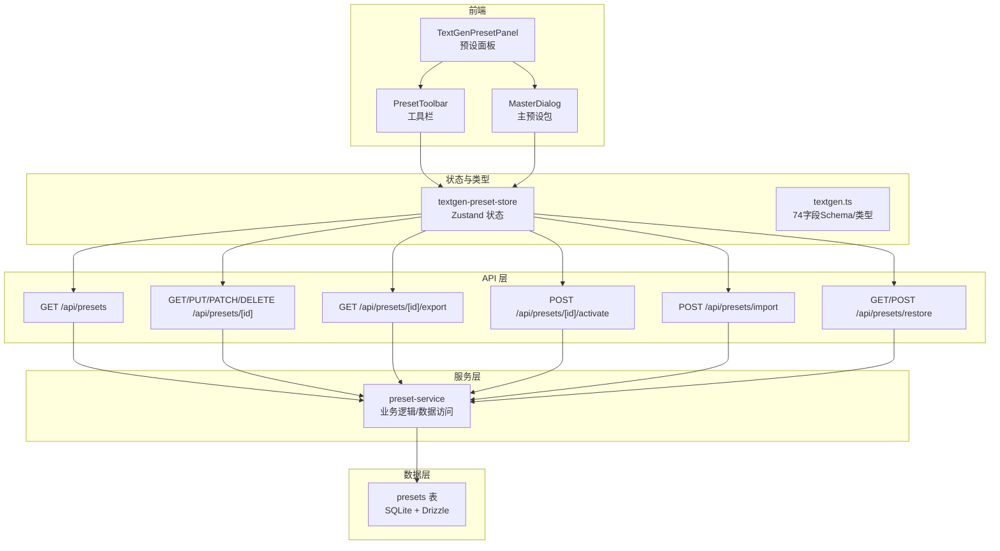
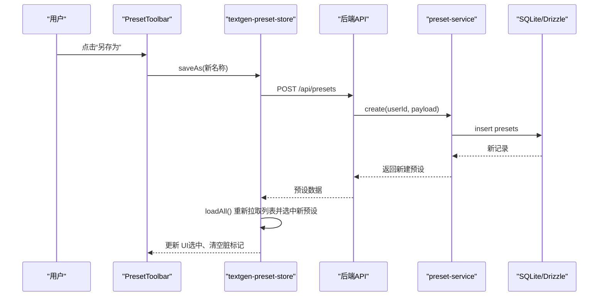
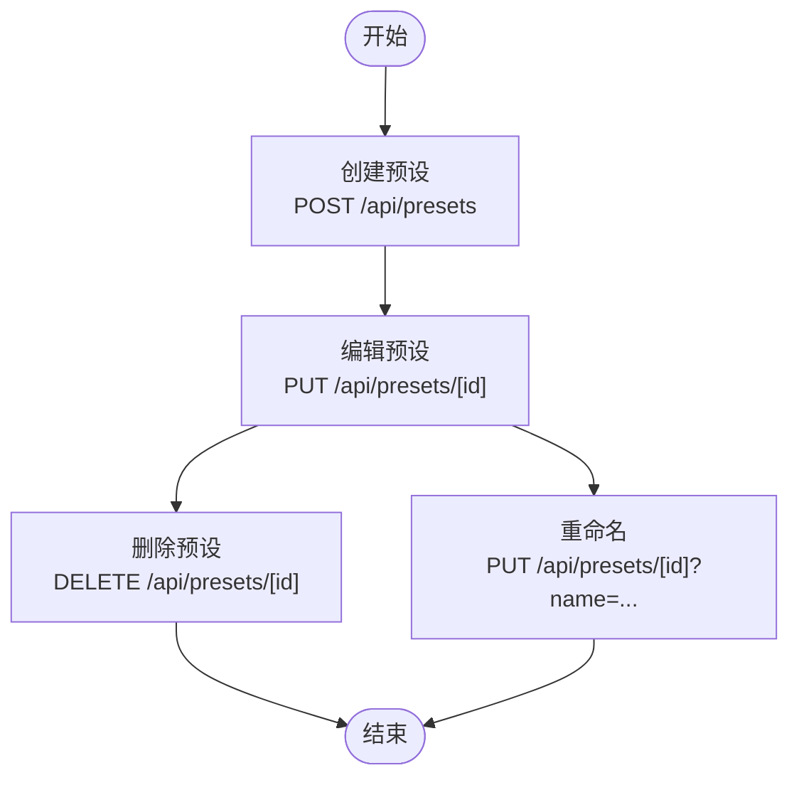
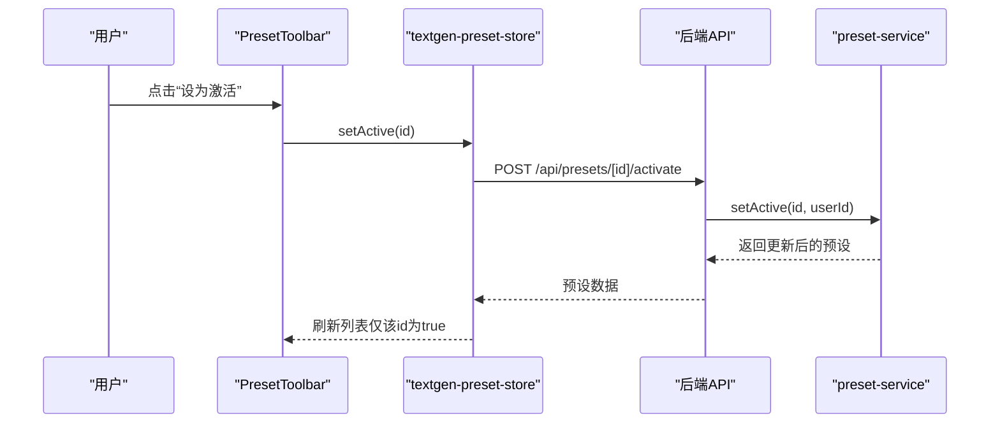
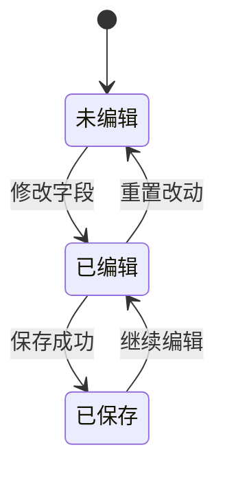
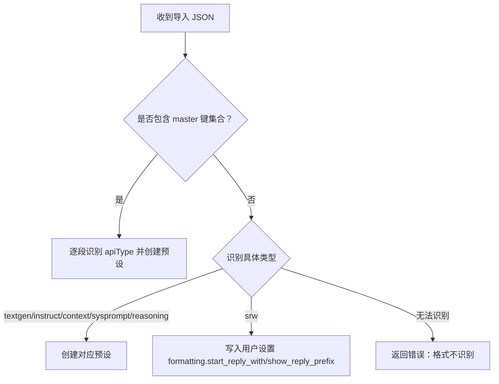
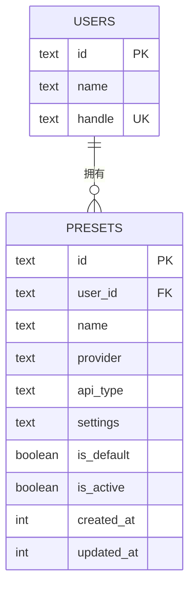

# 预设管理操作

<cite>
**本文引用的文件**
- [src/app/api/presets/route.ts](file://src/app/api/presets/route.ts)
- [src/app/api/presets/[id]/route.ts](file://src/app/api/presets/[id]/route.ts)
- [src/app/api/presets/[id]/export/route.ts](file://src/app/api/presets/[id]/export/route.ts)
- [src/app/api/presets/[id]/activate/route.ts](file://src/app/api/presets/[id]/activate/route.ts)
- [src/app/api/presets/import/route.ts](file://src/app/api/presets/import/route.ts)
- [src/app/api/presets/restore/route.ts](file://src/app/api/presets/restore/route.ts)
- [src/lib/services/preset-service.ts](file://src/lib/services/preset-service.ts)
- [src/stores/textgen-preset-store.ts](file://src/stores/textgen-preset-store.ts)
- [src/types/textgen.ts](file://src/types/textgen.ts)
- [src/components/textgen-preset/textgen-preset-panel.tsx](file://src/components/textgen-preset/textgen-preset-panel.tsx)
- [src/components/textgen-preset/preset-toolbar.tsx](file://src/components/textgen-preset/preset-toolbar.tsx)
- [src/components/textgen-preset/master-dialog.tsx](file://src/components/textgen-preset/master-dialog.tsx)
- [src/app/textgen-presets/page.tsx](file://src/app/textgen-presets/page.tsx)
- [src/lib/db/schema.ts](file://src/lib/db/schema.ts)
- [drizzle/0002_textgen_preset.sql](file://drizzle/0002_textgen_preset.sql)
</cite>

## 目录
1. [简介](#简介)
2. [项目结构](#项目结构)
3. [核心组件](#核心组件)
4. [架构总览](#架构总览)
5. [详细组件分析](#详细组件分析)
6. [依赖关系分析](#依赖关系分析)
7. [性能考量](#性能考量)
8. [故障排除指南](#故障排除指南)
9. [结论](#结论)
10. [附录](#附录)

## 简介
本文件面向“文本生成预设”的管理操作模块，系统化梳理从创建、编辑、删除、重命名到选择、激活、复制、批量导入导出、备份恢复、状态管理（活动状态、脏标记、版本控制）以及 JSON 格式规范与兼容性的全流程。读者无需深入源码即可理解如何高效、安全地管理各类预设。

## 项目结构
预设管理涉及三层：API 层（REST 接口）、服务层（业务逻辑与数据访问）、前端状态与 UI（Zustand store + React 组件）。数据库采用 SQLite + Drizzle ORM，预设数据持久化于 presets 表，并通过迁移脚本扩展 api_type 与 is_active 字段以支持多类预设与活动状态。

图表来源
- [src/app/api/presets/route.ts:1-37](file://src/app/api/presets/route.ts#L1-L37)
- [src/app/api/presets/[id]/route.ts](file://src/app/api/presets/[id]/route.ts#L1-L44)
- [src/app/api/presets/[id]/export/route.ts](file://src/app/api/presets/[id]/export/route.ts#L1-L37)
- [src/app/api/presets/[id]/activate/route.ts](file://src/app/api/presets/[id]/activate/route.ts#L1-L17)
- [src/app/api/presets/import/route.ts:1-191](file://src/app/api/presets/import/route.ts#L1-L191)
- [src/app/api/presets/restore/route.ts:1-32](file://src/app/api/presets/restore/route.ts#L1-L32)
- [src/lib/services/preset-service.ts:1-323](file://src/lib/services/preset-service.ts#L1-L323)
- [src/stores/textgen-preset-store.ts:1-376](file://src/stores/textgen-preset-store.ts#L1-L376)
- [src/lib/db/schema.ts:185-196](file://src/lib/db/schema.ts#L185-L196)

章节来源
- [src/app/textgen-presets/page.tsx:1-10](file://src/app/textgen-presets/page.tsx#L1-L10)
- [src/components/textgen-preset/textgen-preset-panel.tsx:1-145](file://src/components/textgen-preset/textgen-preset-panel.tsx#L1-L145)
- [src/components/textgen-preset/preset-toolbar.tsx:1-290](file://src/components/textgen-preset/preset-toolbar.tsx#L1-L290)
- [src/components/textgen-preset/master-dialog.tsx:1-234](file://src/components/textgen-preset/master-dialog.tsx#L1-L234)

## 核心组件
- API 层：提供预设的增删改查、激活、导出、导入、恢复内置等接口。
- 服务层：封装数据库访问、默认预设读取、种子填充、活动状态一致性保证等。
- 前端状态与 UI：Zustand store 管理列表、活动预设、当前编辑设置、脏标记；React 组件负责交互与导出导入。
- 数据层：presets 表存储每个用户的预设，包含 name、provider、apiType、settings、isDefault、isActive 等字段。

章节来源
- [src/lib/db/schema.ts:185-196](file://src/lib/db/schema.ts#L185-L196)
- [drizzle/0002_textgen_preset.sql:1-5](file://drizzle/0002_textgen_preset.sql#L1-L5)
- [src/lib/services/preset-service.ts:140-323](file://src/lib/services/preset-service.ts#L140-L323)
- [src/stores/textgen-preset-store.ts:25-65](file://src/stores/textgen-preset-store.ts#L25-L65)

## 架构总览
预设管理遵循“前端状态驱动 + 后端 API 提供数据”的模式。前端 store 在用户操作时发起网络请求，后端服务层统一处理业务规则（如同 apiType 下仅允许一个 active），并将结果回写到数据库。

图表来源
- [src/components/textgen-preset/preset-toolbar.tsx:63-67](file://src/components/textgen-preset/preset-toolbar.tsx#L63-L67)
- [src/stores/textgen-preset-store.ts:207-234](file://src/stores/textgen-preset-store.ts#L207-L234)
- [src/app/api/presets/route.ts:27-36](file://src/app/api/presets/route.ts#L27-L36)
- [src/lib/services/preset-service.ts:188-203](file://src/lib/services/preset-service.ts#L188-L203)

## 详细组件分析

### CRUD 操作流程
- 创建：前端调用 POST /api/presets，服务层写入数据库，返回新建预设。
- 编辑：前端调用 PUT/PATCH /api/presets/[id]，服务层按需更新字段，返回最新预设。
- 删除：前端调用 DELETE /api/presets/[id]，服务层删除记录，必要时切换活动预设。
- 重命名：前端调用 PUT /api/presets/[id] 并传入 name 字段，服务层更新并返回。

图表来源
- [src/app/api/presets/route.ts:27-36](file://src/app/api/presets/route.ts#L27-L36)
- [src/app/api/presets/[id]/route.ts](file://src/app/api/presets/[id]/route.ts#L17-L33)

章节来源
- [src/app/api/presets/route.ts:27-36](file://src/app/api/presets/route.ts#L27-L36)
- [src/app/api/presets/[id]/route.ts](file://src/app/api/presets/[id]/route.ts#L17-L43)
- [src/lib/services/preset-service.ts:188-231](file://src/lib/services/preset-service.ts#L188-L231)

### 选择、激活、复制与批量管理
- 选择：GET /api/presets/[id] 获取单个预设详情，store 更新当前编辑设置。
- 激活：POST /api/presets/[id]/activate 将该预设设为同 apiType 下唯一 active，其余设为非 active。
- 复制：另存为（saveAs）创建新预设，保留 settings，name 可自定义。
- 批量：主预设包（Master Dialog）支持同时导出/导入多段（preset/instruct/context/sysprompt/reasoning/srw）。

图表来源
- [src/components/textgen-preset/preset-toolbar.tsx:82-85](file://src/components/textgen-preset/preset-toolbar.tsx#L82-L85)
- [src/stores/textgen-preset-store.ts:274-289](file://src/stores/textgen-preset-store.ts#L274-L289)
- [src/app/api/presets/[id]/activate/route.ts](file://src/app/api/presets/[id]/activate/route.ts#L7-L16)
- [src/lib/services/preset-service.ts:233-250](file://src/lib/services/preset-service.ts#L233-L250)

章节来源
- [src/components/textgen-preset/preset-toolbar.tsx:82-85](file://src/components/textgen-preset/preset-toolbar.tsx#L82-L85)
- [src/stores/textgen-preset-store.ts:274-289](file://src/stores/textgen-preset-store.ts#L274-L289)
- [src/components/textgen-preset/master-dialog.tsx:84-131](file://src/components/textgen-preset/master-dialog.tsx#L84-L131)

### 状态管理机制
- 活动状态：同一 apiType 下仅允许一个 active 预设。服务层在 setActive 时先清空同类型其它记录，再设置目标为 active。
- 脏标记：store 在用户修改字段时置位 isDirty；在保存成功或重置到活动预设后清除；离开页面前若存在未保存改动会提示拦截。
- 版本控制：数据库记录 createdAt/updatedAt；导出时按 74 字段完整 Schema 补齐默认值，确保与原项目 preset JSON 体积与字段对齐。

图表来源
- [src/stores/textgen-preset-store.ts:155-168](file://src/stores/textgen-preset-store.ts#L155-L168)
- [src/stores/textgen-preset-store.ts:170-177](file://src/stores/textgen-preset-store.ts#L170-L177)
- [src/stores/textgen-preset-store.ts:179-205](file://src/stores/textgen-preset-store.ts#L179-L205)

章节来源
- [src/lib/services/preset-service.ts:233-250](file://src/lib/services/preset-service.ts#L233-L250)
- [src/stores/textgen-preset-store.ts:35-40](file://src/stores/textgen-preset-store.ts#L35-L40)
- [src/app/api/presets/[id]/export/route.ts](file://src/app/api/presets/[id]/export/route.ts#L17-L29)

### 导入导出与 JSON 规范
- 单段 JSON：自动识别类型（textgen/instruct/context/sysprompt/reasoning/srw），写入对应 apiType 的预设或 srw 写入用户设置。
- 主预设包：导出时按当前激活预设聚合为多段 JSON；导入时按字段特征识别段落并批量创建。
- 兼容性：导出时使用 74 字段完整 Schema 补齐默认值，确保与原项目 SillyTavern preset JSON 体积与字段对齐。

图表来源
- [src/app/api/presets/import/route.ts:10-57](file://src/app/api/presets/import/route.ts#L10-L57)
- [src/app/api/presets/import/route.ts:107-191](file://src/app/api/presets/import/route.ts#L107-L191)

章节来源
- [src/app/api/presets/import/route.ts:10-57](file://src/app/api/presets/import/route.ts#L10-L57)
- [src/app/api/presets/import/route.ts:107-191](file://src/app/api/presets/import/route.ts#L107-L191)
- [src/app/api/presets/[id]/export/route.ts](file://src/app/api/presets/[id]/export/route.ts#L17-L29)
- [src/types/textgen.ts:117-233](file://src/types/textgen.ts#L117-L233)

### 备份恢复与最佳实践
- 恢复内置：GET /api/presets/restore 列出内置名称；POST /api/presets/restore 按名称恢复到当前用户库。若同名已存在则覆盖 settings，否则新建。
- 种子填充：首次访问 GET /api/presets?apiType=textgenerationwebui 且 seed!=0 时，自动将内置默认预设写入用户库（仅当用户库为空时）。
- 最佳实践：
  - 使用“主预设包”进行批量导入导出，避免遗漏段落。
  - 导出前确保当前激活预设正确，避免导出空段。
  - 恢复内置前先确认是否已有同名预设，避免意外覆盖。
  - 使用“另存为”进行复制，保留原始预设不变。

章节来源
- [src/app/api/presets/restore/route.ts:5-31](file://src/app/api/presets/restore/route.ts#L5-L31)
- [src/lib/services/preset-service.ts:252-287](file://src/lib/services/preset-service.ts#L252-L287)
- [src/app/api/presets/route.ts:13-17](file://src/app/api/presets/route.ts#L13-L17)
- [src/lib/services/preset-service.ts:289-311](file://src/lib/services/preset-service.ts#L289-L311)

## 依赖关系分析
- 前端依赖关系：UI 组件依赖 store；store 依赖后端 API；API 依赖服务层；服务层依赖数据库。
- 数据模型：presets 表包含用户标识、预设名称、provider、apiType、settings JSON、默认/活动标记及时间戳。
- 迁移：通过 0002_textgen_preset.sql 为 presets 表增加 api_type 与 is_active 字段，支撑多类预设与活动状态。

图表来源
- [src/lib/db/schema.ts:6-16](file://src/lib/db/schema.ts#L6-L16)
- [src/lib/db/schema.ts:185-196](file://src/lib/db/schema.ts#L185-L196)

章节来源
- [drizzle/0002_textgen_preset.sql:1-5](file://drizzle/0002_textgen_preset.sql#L1-L5)
- [src/lib/db/schema.ts:185-196](file://src/lib/db/schema.ts#L185-L196)

## 性能考量
- 列表加载：前端首次进入页面时触发 GET /api/presets?apiType=textgenerationwebui，服务层在用户库为空时自动种子填充内置预设，避免空列表体验。
- 活动状态一致性：服务层在 setActive 时先清空同 apiType 的其它 active，再设置目标为 active，避免并发场景下的状态不一致。
- 导入性能：主预设包导入时按段落识别并批量创建，建议控制段落数量，避免单次导入过大导致内存压力。
- 导出体积：导出时使用完整 74 字段 Schema 补齐默认值，确保与原项目体积一致，便于跨平台迁移。

## 故障排除指南
- 未授权访问：所有 API 前置鉴权，未登录返回 401。检查登录状态与认证中间件。
- 输入校验失败：create/update schema 校验失败返回 400，检查 name 长度、provider 非空、settings 为对象。
- 预设不存在：GET/PUT/DELETE /api/presets/[id] 返回 404，确认 id 与用户匹配。
- 导入格式不识别：导入 JSON 无法识别类型或缺少必要字段，返回 400 或 500，检查 JSON 结构与字段。
- 恢复内置失败：内置文件不存在或读取失败，返回 404，检查 apiType 与名称是否正确。
- 活动状态异常：同 apiType 下出现多个 active，检查服务层 setActive 逻辑是否被并发请求破坏。
- 未保存改动拦截：离开页面前若有 isDirty，浏览器会提示确认，可在 UI 中点击“重置改动”或“保存”。

章节来源
- [src/app/api/presets/route.ts:5-8](file://src/app/api/presets/route.ts#L5-L8)
- [src/app/api/presets/route.ts:31-32](file://src/app/api/presets/route.ts#L31-L32)
- [src/app/api/presets/[id]/route.ts](file://src/app/api/presets/[id]/route.ts#L12-L14)
- [src/app/api/presets/import/route.ts:162-164](file://src/app/api/presets/import/route.ts#L162-L164)
- [src/app/api/presets/restore/route.ts:21-22](file://src/app/api/presets/restore/route.ts#L21-L22)
- [src/lib/services/preset-service.ts:233-250](file://src/lib/services/preset-service.ts#L233-L250)
- [src/stores/textgen-preset-store.ts:40-49](file://src/stores/textgen-preset-store.ts#L40-L49)

## 结论
本模块通过清晰的前后端职责划分与完善的业务规则（活动状态唯一性、种子填充、主预设包批量管理、74 字段 Schema 兼容导出），实现了稳定、可扩展、易用的预设管理能力。建议在生产环境中结合“主预设包”进行批量迁移，在导入前做好备份，并充分利用“另存为”与“恢复内置”功能进行版本与回滚管理。

## 附录
- 预设类型与字段：74 字段完整 Schema 与 UI 分区元数据定义见 textgen.ts。
- 页面入口：/textgen-presets 页面承载预设面板与工具栏。

章节来源
- [src/types/textgen.ts:117-233](file://src/types/textgen.ts#L117-L233)
- [src/app/textgen-presets/page.tsx:1-10](file://src/app/textgen-presets/page.tsx#L1-L10)