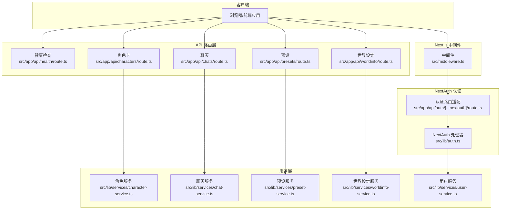
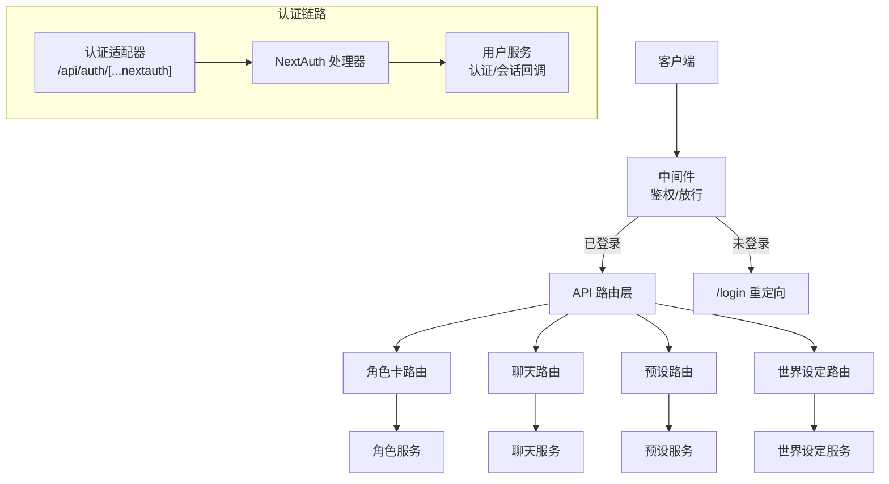
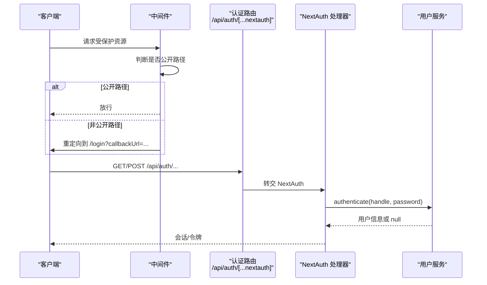
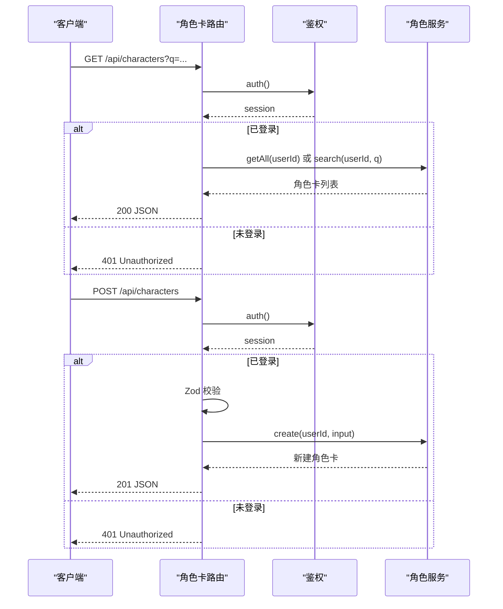
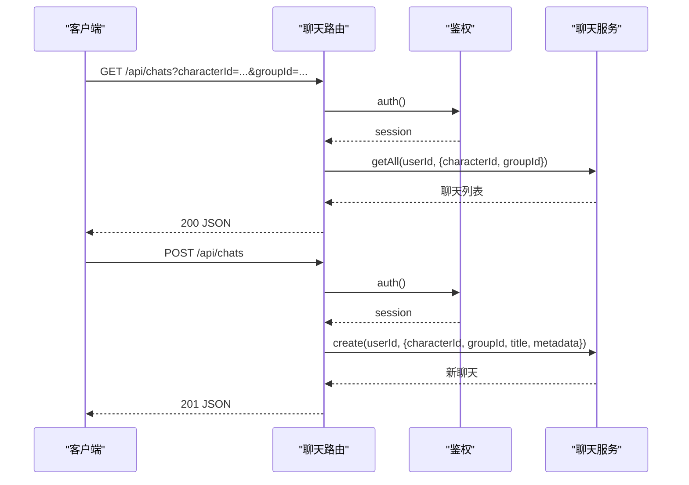
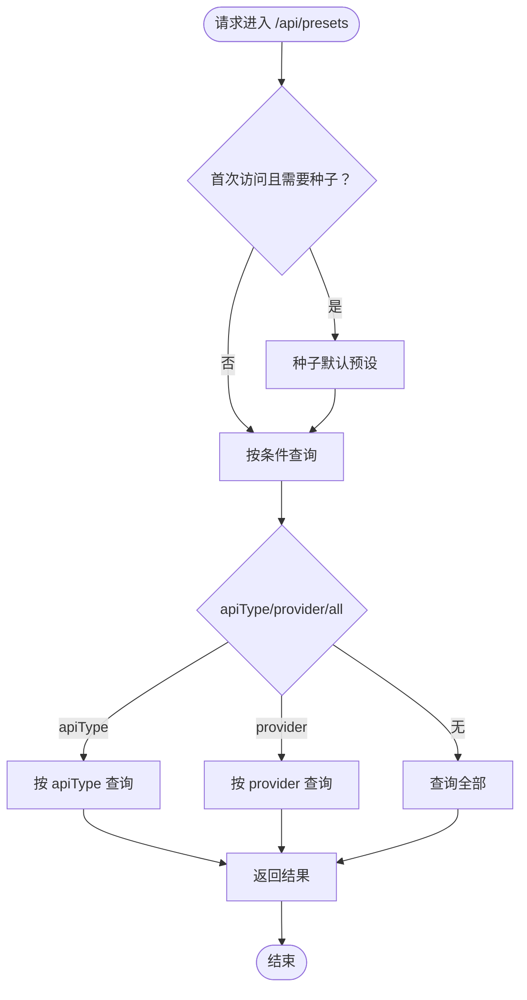
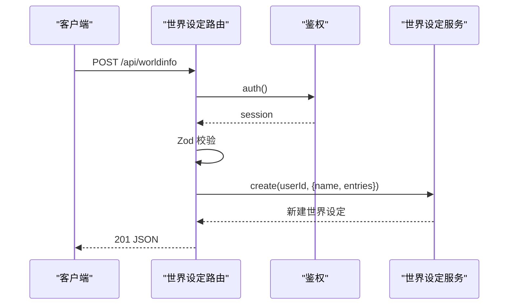
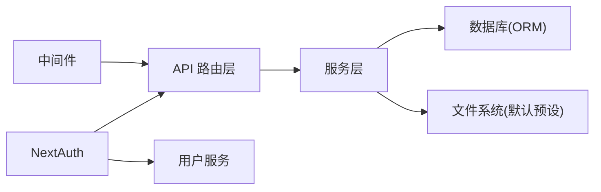

# API 架构设计

<cite>
**本文引用的文件**
- [src/app/api/health/route.ts](file://src/app/api/health/route.ts)
- [src/app/api/auth/[...nextauth]/route.ts](file://src/app/api/auth/[...nextauth]/route.ts)
- [src/middleware.ts](file://src/middleware.ts)
- [src/lib/auth.ts](file://src/lib/auth.ts)
- [src/app/api/characters/route.ts](file://src/app/api/characters/route.ts)
- [src/app/api/chats/route.ts](file://src/app/api/chats/route.ts)
- [src/app/api/presets/route.ts](file://src/app/api/presets/route.ts)
- [src/app/api/worldinfo/route.ts](file://src/app/api/worldinfo/route.ts)
- [src/lib/services/character-service.ts](file://src/lib/services/character-service.ts)
- [src/lib/services/chat-service.ts](file://src/lib/services/chat-service.ts)
- [src/lib/services/user-service.ts](file://src/lib/services/user-service.ts)
- [src/lib/services/preset-service.ts](file://src/lib/services/preset-service.ts)
- [src/lib/services/worldinfo-service.ts](file://src/lib/services/worldinfo-service.ts)
</cite>

## 目录
1. [引言](#引言)
2. [项目结构](#项目结构)
3. [核心组件](#核心组件)
4. [架构总览](#架构总览)
5. [详细组件分析](#详细组件分析)
6. [依赖关系分析](#依赖关系分析)
7. [性能考虑](#性能考虑)
8. [故障排查指南](#故障排查指南)
9. [结论](#结论)
10. [附录](#附录)

## 引言
本设计文档面向 SillyTavern Next 的 API 层，系统阐述基于 Next.js App Router 的 API 路由设计模式、服务层架构与业务逻辑封装。文档重点包括：
- RESTful 设计原则与请求/响应处理
- 鉴权与安全控制（NextAuth、中间件）
- 数据验证与错误处理
- API 层与服务层的职责分离
- 请求流程与架构图
- 性能优化、缓存策略与扩展性设计
- 开发者最佳实践与实现指导

## 项目结构
SillyTavern Next 的 API 路由采用 Next.js App Router 的“文件即路由”约定，位于 src/app/api 下，每个子目录对应资源域（如 characters、chats、presets、worldinfo 等）。每个资源通常包含多个方法路由（GET/POST/...），并在路由文件内部完成鉴权、输入校验、调用服务层与统一错误处理。

图表来源
- [src/middleware.ts:1-35](file://src/middleware.ts#L1-L35)
- [src/app/api/auth/[...nextauth]/route.ts:1-3](file://src/app/api/auth/[...nextauth]/route.ts#L1-L3)
- [src/lib/auth.ts:1-59](file://src/lib/auth.ts#L1-L59)
- [src/app/api/health/route.ts:1-10](file://src/app/api/health/route.ts#L1-L10)
- [src/app/api/characters/route.ts:1-42](file://src/app/api/characters/route.ts#L1-L42)
- [src/app/api/chats/route.ts:1-45](file://src/app/api/chats/route.ts#L1-L45)
- [src/app/api/presets/route.ts:1-37](file://src/app/api/presets/route.ts#L1-L37)
- [src/app/api/worldinfo/route.ts:1-23](file://src/app/api/worldinfo/route.ts#L1-L23)
- [src/lib/services/character-service.ts:1-252](file://src/lib/services/character-service.ts#L1-L252)
- [src/lib/services/chat-service.ts:1-301](file://src/lib/services/chat-service.ts#L1-L301)
- [src/lib/services/preset-service.ts:1-323](file://src/lib/services/preset-service.ts#L1-L323)
- [src/lib/services/worldinfo-service.ts:1-428](file://src/lib/services/worldinfo-service.ts#L1-L428)
- [src/lib/services/user-service.ts:1-170](file://src/lib/services/user-service.ts#L1-L170)

章节来源
- [src/app/api/health/route.ts:1-10](file://src/app/api/health/route.ts#L1-L10)
- [src/app/api/auth/[...nextauth]/route.ts:1-3](file://src/app/api/auth/[...nextauth]/route.ts#L1-L3)
- [src/middleware.ts:1-35](file://src/middleware.ts#L1-L35)
- [src/lib/auth.ts:1-59](file://src/lib/auth.ts#L1-L59)

## 核心组件
- API 路由层：每个资源路由文件负责：
  - 鉴权（auth/session 校验）
  - 查询参数与请求体解析
  - Zod 输入校验
  - 统一错误处理（401/400/500）
  - 调用服务层执行业务逻辑
  - 返回标准化 JSON 响应
- 服务层：封装数据库操作、序列化/反序列化、复杂业务规则与跨表级联处理。
- 中间件与 NextAuth：全局鉴权拦截、公开路径放行、NextAuth 凭据登录与会话回调。

章节来源
- [src/app/api/characters/route.ts:1-42](file://src/app/api/characters/route.ts#L1-L42)
- [src/app/api/chats/route.ts:1-45](file://src/app/api/chats/route.ts#L1-L45)
- [src/app/api/presets/route.ts:1-37](file://src/app/api/presets/route.ts#L1-L37)
- [src/app/api/worldinfo/route.ts:1-23](file://src/app/api/worldinfo/route.ts#L1-L23)
- [src/lib/services/character-service.ts:1-252](file://src/lib/services/character-service.ts#L1-L252)
- [src/lib/services/chat-service.ts:1-301](file://src/lib/services/chat-service.ts#L1-L301)
- [src/lib/services/preset-service.ts:1-323](file://src/lib/services/preset-service.ts#L1-L323)
- [src/lib/services/worldinfo-service.ts:1-428](file://src/lib/services/worldinfo-service.ts#L1-L428)
- [src/lib/services/user-service.ts:1-170](file://src/lib/services/user-service.ts#L1-L170)

## 架构总览
下面的架构图展示了从客户端到 API 路由、服务层与数据库的交互路径，并标注了鉴权与中间件的关键节点。

图表来源
- [src/middleware.ts:1-35](file://src/middleware.ts#L1-L35)
- [src/app/api/auth/[...nextauth]/route.ts:1-3](file://src/app/api/auth/[...nextauth]/route.ts#L1-L3)
- [src/lib/auth.ts:1-59](file://src/lib/auth.ts#L1-L59)
- [src/lib/services/user-service.ts:1-170](file://src/lib/services/user-service.ts#L1-L170)
- [src/app/api/characters/route.ts:1-42](file://src/app/api/characters/route.ts#L1-L42)
- [src/app/api/chats/route.ts:1-45](file://src/app/api/chats/route.ts#L1-L45)
- [src/app/api/presets/route.ts:1-37](file://src/app/api/presets/route.ts#L1-L37)
- [src/app/api/worldinfo/route.ts:1-23](file://src/app/api/worldinfo/route.ts#L1-L23)
- [src/lib/services/character-service.ts:1-252](file://src/lib/services/character-service.ts#L1-L252)
- [src/lib/services/chat-service.ts:1-301](file://src/lib/services/chat-service.ts#L1-L301)
- [src/lib/services/preset-service.ts:1-323](file://src/lib/services/preset-service.ts#L1-L323)
- [src/lib/services/worldinfo-service.ts:1-428](file://src/lib/services/worldinfo-service.ts#L1-L428)

## 详细组件分析

### 鉴权与中间件
- 中间件在进入受保护页面前进行登录状态判断，对公开路径（如 /login、/api/auth、/_next、favicon.ico）直接放行。
- 未登录用户会被重定向至 /login 并携带 callbackUrl。
- 认证适配器将 NextAuth 的 handlers 暴露为 /api/auth/[...nextauth] 的 GET/POST，内部委托给 NextAuth 处理器。
- NextAuth 处理器使用凭据提供者，结合 Zod 校验与用户服务完成认证，并通过回调将用户信息注入 JWT 与 Session。

图表来源
- [src/middleware.ts:1-35](file://src/middleware.ts#L1-L35)
- [src/app/api/auth/[...nextauth]/route.ts:1-3](file://src/app/api/auth/[...nextauth]/route.ts#L1-L3)
- [src/lib/auth.ts:1-59](file://src/lib/auth.ts#L1-L59)
- [src/lib/services/user-service.ts:1-170](file://src/lib/services/user-service.ts#L1-L170)

章节来源
- [src/middleware.ts:1-35](file://src/middleware.ts#L1-L35)
- [src/app/api/auth/[...nextauth]/route.ts:1-3](file://src/app/api/auth/[...nextauth]/route.ts#L1-L3)
- [src/lib/auth.ts:1-59](file://src/lib/auth.ts#L1-L59)

### 角色卡 API（REST 设计与数据流）
- 资源：/api/characters
- 方法：
  - GET：支持查询参数 q（模糊搜索），根据当前用户过滤数据，返回角色卡列表。
  - POST：解析请求体，使用 Zod schema 校验，调用角色服务创建并返回 201。
- 错误处理：未登录返回 401；输入校验失败返回 400；服务异常捕获并返回 500。

图表来源
- [src/app/api/characters/route.ts:1-42](file://src/app/api/characters/route.ts#L1-L42)
- [src/lib/services/character-service.ts:1-252](file://src/lib/services/character-service.ts#L1-L252)

章节来源
- [src/app/api/characters/route.ts:1-42](file://src/app/api/characters/route.ts#L1-L42)
- [src/lib/services/character-service.ts:1-252](file://src/lib/services/character-service.ts#L1-L252)

### 聊天 API（消息与分支）
- 资源：/api/chats
- 方法：
  - GET：支持 characterId/groupId 查询，返回聊天列表（不含消息）。
  - POST：创建新聊天，返回 201。
- 消息子资源：/api/chats/[id]/messages（新增/更新/删除消息）、/api/chats/[id]/branch（从某消息分支创建新聊天）。
- 服务层提供消息增删改查与聊天分支复制完整逻辑，确保数据一致性与外键约束。

图表来源
- [src/app/api/chats/route.ts:1-45](file://src/app/api/chats/route.ts#L1-L45)
- [src/lib/services/chat-service.ts:1-301](file://src/lib/services/chat-service.ts#L1-L301)

章节来源
- [src/app/api/chats/route.ts:1-45](file://src/app/api/chats/route.ts#L1-L45)
- [src/lib/services/chat-service.ts:1-301](file://src/lib/services/chat-service.ts#L1-L301)

### 预设 API（种子默认预设与多维度筛选）
- 资源：/api/presets
- 方法：
  - GET：支持 apiType/provider/seed 参数；首次访问对应 apiType 时自动种子化默认预设。
  - POST：Zod 校验后创建预设。
- 服务层提供：
  - 按 apiType/provider/all 列表查询
  - 设置唯一激活预设（同 apiType 下互斥）
  - 从内置 JSON 目录恢复/种子默认预设
  - 通用 JSON 解析与字段透传，保留 instruct/context/sysprompt/reasoning/textgen 等任意自定义字段

图表来源
- [src/app/api/presets/route.ts:1-37](file://src/app/api/presets/route.ts#L1-L37)
- [src/lib/services/preset-service.ts:1-323](file://src/lib/services/preset-service.ts#L1-L323)

章节来源
- [src/app/api/presets/route.ts:1-37](file://src/app/api/presets/route.ts#L1-L37)
- [src/lib/services/preset-service.ts:1-323](file://src/lib/services/preset-service.ts#L1-L323)

### 世界设定 API（词条导入/导出与级联清理）
- 资源：/api/worldinfo
- 方法：
  - GET：返回当前用户的世界设定列表。
  - POST：Zod 校验后创建世界设定。
- 服务层提供：
  - 词条新增/更新/删除
  - JSON 导入兼容（支持 lorebook 与 V2 character_book）
  - JSON 导出（与原项目格式对齐）
  - 级联清理：删除世界设定时清空角色卡引用、从全局设置中移除引用

图表来源
- [src/app/api/worldinfo/route.ts:1-23](file://src/app/api/worldinfo/route.ts#L1-L23)
- [src/lib/services/worldinfo-service.ts:1-428](file://src/lib/services/worldinfo-service.ts#L1-L428)

章节来源
- [src/app/api/worldinfo/route.ts:1-23](file://src/app/api/worldinfo/route.ts#L1-L23)
- [src/lib/services/worldinfo-service.ts:1-428](file://src/lib/services/worldinfo-service.ts#L1-L428)

### 健康检查 API
- 路径：/api/health
- 特性：无需鉴权，返回服务运行状态与时间戳，便于容器编排与监控系统探活。

章节来源
- [src/app/api/health/route.ts:1-10](file://src/app/api/health/route.ts#L1-L10)

## 依赖关系分析
- API 路由层对服务层的依赖为单向、清晰的业务入口。
- 服务层依赖数据库（Drizzle ORM）与少量文件系统（默认预设目录）。
- 中间件与 NextAuth 提供统一的鉴权入口，避免在路由层重复实现。
- 错误处理集中在路由层，服务层抛出异常或返回 null/布尔值，路由层统一转换为 HTTP 状态码。

图表来源
- [src/app/api/characters/route.ts:1-42](file://src/app/api/characters/route.ts#L1-L42)
- [src/app/api/chats/route.ts:1-45](file://src/app/api/chats/route.ts#L1-L45)
- [src/app/api/presets/route.ts:1-37](file://src/app/api/presets/route.ts#L1-L37)
- [src/app/api/worldinfo/route.ts:1-23](file://src/app/api/worldinfo/route.ts#L1-L23)
- [src/lib/services/character-service.ts:1-252](file://src/lib/services/character-service.ts#L1-L252)
- [src/lib/services/chat-service.ts:1-301](file://src/lib/services/chat-service.ts#L1-L301)
- [src/lib/services/preset-service.ts:1-323](file://src/lib/services/preset-service.ts#L1-L323)
- [src/lib/services/worldinfo-service.ts:1-428](file://src/lib/services/worldinfo-service.ts#L1-L428)
- [src/middleware.ts:1-35](file://src/middleware.ts#L1-L35)
- [src/lib/auth.ts:1-59](file://src/lib/auth.ts#L1-L59)

## 性能考虑
- 数据库查询优化
  - 使用索引字段（如 userId、apiType、provider）进行过滤与排序，避免全表扫描。
  - 列表查询按 updatedAt 降序，减少无关数据传输。
- 序列化成本控制
  - 服务层集中做 JSON.parse/stringify，避免在路由层重复处理。
- 缓存策略建议
  - 对只读列表（如角色卡、聊天列表、预设列表）可引入短期缓存（如 Redis）以降低数据库压力。
  - 鉴权令牌缓存与会话存储（NextAuth 默认内存/外部存储，需按部署选择持久化）。
- 扩展性设计
  - 服务层接口稳定，路由层仅做薄薄的输入校验与错误包装，便于横向扩展新资源。
  - 预设服务的“种子默认预设”机制可作为新 apiType 的快速上线通道。
- I/O 优化
  - 文件系统读取默认预设仅在首次访问触发，避免每次请求开销。
  - 消息与聊天的批量复制（分支）在服务层一次性完成，减少往返。

[本节为通用性能建议，不直接分析具体文件，故无章节来源]

## 故障排查指南
- 401 未授权
  - 检查中间件是否正确重定向至 /login，并确认 NextAuth 会话是否有效。
  - 确认路由中调用 auth() 是否返回 session.user。
- 400 输入校验失败
  - 查看路由中 Zod.safeParse 的错误详情（flatten），定位字段与约束。
- 500 服务器错误
  - 路由层 try/catch 捕获并记录错误日志，检查服务层数据库事务与异常传播。
- 聊天/消息一致性问题
  - 确认服务层在消息更新后同步更新聊天 updatedAt，避免脏读。
- 世界设定删除级联
  - 确认服务层在删除时清理角色卡引用与全局设置中的引用数组。

章节来源
- [src/app/api/characters/route.ts:1-42](file://src/app/api/characters/route.ts#L1-L42)
- [src/app/api/chats/route.ts:1-45](file://src/app/api/chats/route.ts#L1-L45)
- [src/app/api/presets/route.ts:1-37](file://src/app/api/presets/route.ts#L1-L37)
- [src/app/api/worldinfo/route.ts:1-23](file://src/app/api/worldinfo/route.ts#L1-L23)
- [src/lib/services/chat-service.ts:1-301](file://src/lib/services/chat-service.ts#L1-L301)
- [src/lib/services/worldinfo-service.ts:1-428](file://src/lib/services/worldinfo-service.ts#L1-L428)

## 结论
SillyTavern Next 的 API 架构遵循 Next.js App Router 的文件即路由约定，结合中间件与 NextAuth 实现统一鉴权，路由层承担输入校验与错误处理，服务层专注业务逻辑与数据一致性。该设计具备良好的可维护性、扩展性与安全性，适合在多资源场景下持续演进。

[本节为总结性内容，不直接分析具体文件，故无章节来源]

## 附录
- 最佳实践清单
  - 路由层：始终进行鉴权与输入校验；统一错误处理；返回明确的状态码与错误信息。
  - 服务层：保持纯函数式与幂等性；对外暴露稳定接口；必要时使用事务保证一致性。
  - 安全：最小权限原则；敏感字段不在响应中泄露；密码使用强散列与盐值。
  - 可观测性：记录关键错误日志；为健康检查与关键路径埋点。
  - 扩展：新增资源优先复用现有模式；服务层接口变更需谨慎评估影响范围。

[本节为通用指导，不直接分析具体文件，故无章节来源]