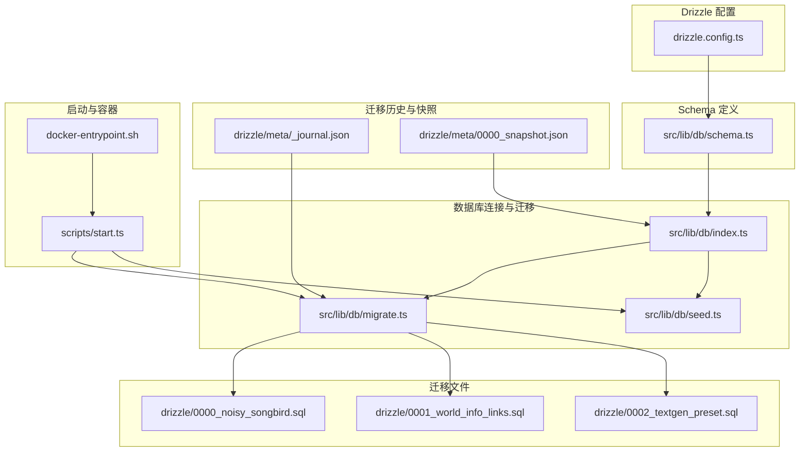
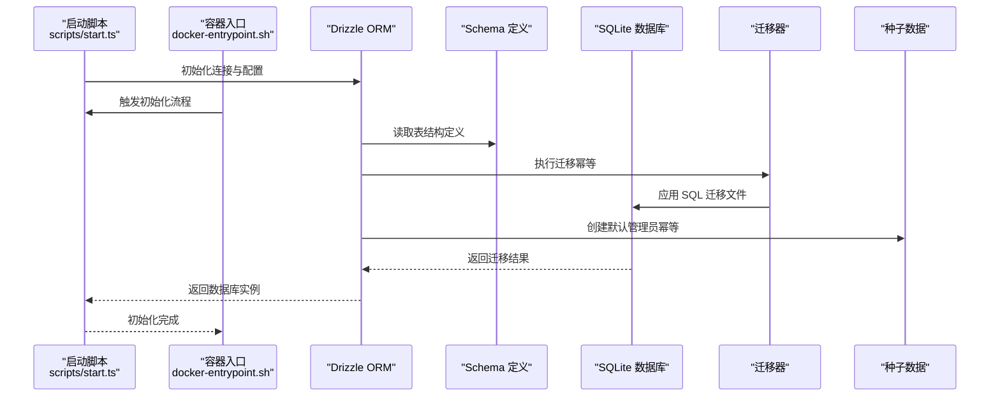
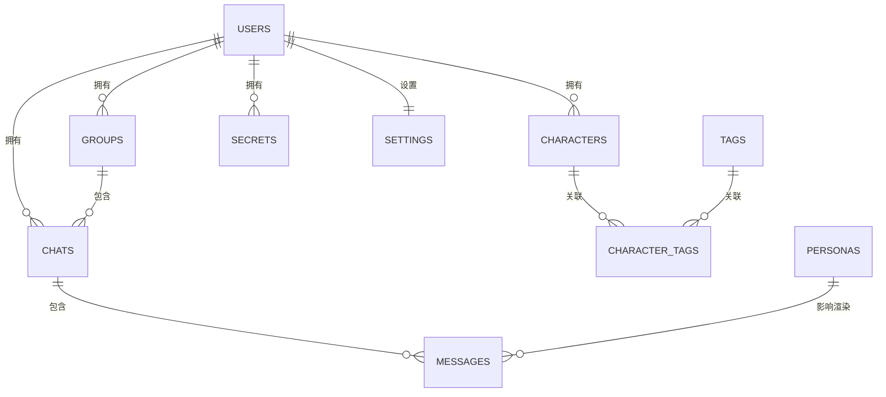
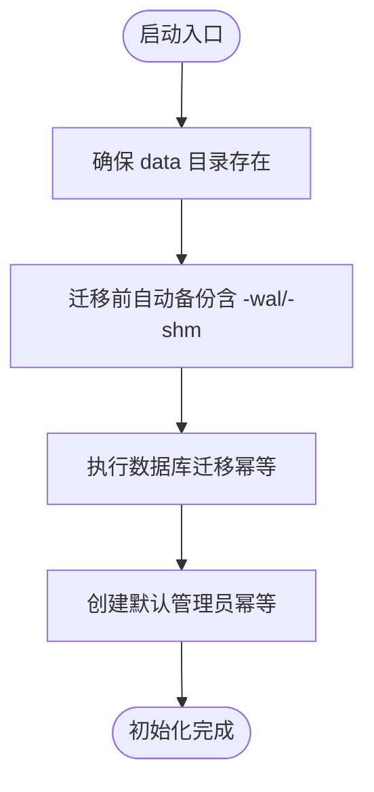
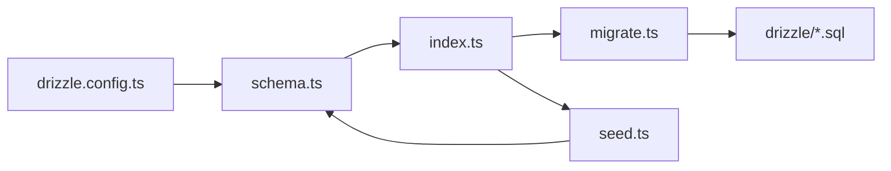

# 数据架构设计

<cite>
**本文引用的文件**
- [drizzle.config.ts](file://drizzle.config.ts)
- [schema.ts](file://src/lib/db/schema.ts)
- [index.ts](file://src/lib/db/index.ts)
- [migrate.ts](file://src/lib/db/migrate.ts)
- [seed.ts](file://src/lib/db/seed.ts)
- [0000_noisy_songbird.sql](file://drizzle/0000_noisy_songbird.sql)
- [0001_world_info_links.sql](file://drizzle/0001_world_info_links.sql)
- [0002_textgen_preset.sql](file://drizzle/0002_textgen_preset.sql)
- [_journal.json](file://drizzle/meta/_journal.json)
- [0000_snapshot.json](file://drizzle/meta/0000_snapshot.json)
- [start.ts](file://scripts/start.ts)
- [docker-entrypoint.sh](file://docker-entrypoint.sh)
- [README.md](file://README.md)
</cite>

## 目录
1. [简介](#简介)
2. [项目结构](#项目结构)
3. [核心组件](#核心组件)
4. [架构总览](#架构总览)
5. [详细组件分析](#详细组件分析)
6. [依赖分析](#依赖分析)
7. [性能考量](#性能考量)
8. [故障排查指南](#故障排查指南)
9. [结论](#结论)
10. [附录](#附录)

## 简介
本文件面向 SillyTavern Next 的数据架构设计，系统性阐述数据库设计模式、表结构关系与数据模型定义；解释 Drizzle ORM 的使用方式、数据库迁移策略与版本控制机制；说明数据访问层设计、实体关系映射与约束定义；并给出数据库模式图与实体关系图，分析数据持久化策略、缓存机制与性能优化要点，为开发者提供深入理解与实践指导。

## 项目结构
围绕数据库的核心文件组织如下：
- Drizzle 配置：定义 schema 路径、输出目录、方言与数据库凭据
- Schema 定义：以 TypeScript 声明所有表结构与字段类型
- 数据库连接与迁移：初始化 SQLite 连接、启用 WAL 与外键、自动迁移与字段幂等补齐
- 迁移脚本：按顺序执行迁移文件夹中的 SQL 片段
- 种子数据：创建默认管理员账户
- 迁移历史与快照：记录已执行迁移与当前数据库快照
- 启动脚本与容器入口：自动备份、迁移与种子数据的编排流程



图表来源
- [drizzle.config.ts:1-11](file://drizzle.config.ts#L1-L11)
- [schema.ts:1-240](file://src/lib/db/schema.ts#L1-L240)
- [index.ts:1-134](file://src/lib/db/index.ts#L1-L134)
- [migrate.ts:1-34](file://src/lib/db/migrate.ts#L1-L34)
- [seed.ts:1-40](file://src/lib/db/seed.ts#L1-L40)
- [0000_noisy_songbird.sql:1-161](file://drizzle/0000_noisy_songbird.sql#L1-L161)
- [0001_world_info_links.sql:1-3](file://drizzle/0001_world_info_links.sql#L1-L3)
- [0002_textgen_preset.sql:1-5](file://drizzle/0002_textgen_preset.sql#L1-L5)
- [start.ts:1-95](file://scripts/start.ts#L1-L95)
- [_journal.json:1-27](file://drizzle/meta/_journal.json#L1-L27)
- [0000_snapshot.json:1-800](file://drizzle/meta/0000_snapshot.json#L1-L800)

章节来源
- [drizzle.config.ts:1-11](file://drizzle.config.ts#L1-L11)
- [schema.ts:1-240](file://src/lib/db/schema.ts#L1-L240)
- [index.ts:1-134](file://src/lib/db/index.ts#L1-L134)
- [migrate.ts:1-34](file://src/lib/db/migrate.ts#L1-L34)
- [seed.ts:1-40](file://src/lib/db/seed.ts#L1-L40)
- [0000_noisy_songbird.sql:1-161](file://drizzle/0000_noisy_songbird.sql#L1-L161)
- [0001_world_info_links.sql:1-3](file://drizzle/0001_world_info_links.sql#L1-L3)
- [0002_textgen_preset.sql:1-5](file://drizzle/0002_textgen_preset.sql#L1-L5)
- [start.ts:1-95](file://scripts/start.ts#L1-L95)
- [_journal.json:1-27](file://drizzle/meta/_journal.json#L1-L27)
- [0000_snapshot.json:1-800](file://drizzle/meta/0000_snapshot.json#L1-L800)

## 核心组件
- Drizzle 配置：指定 schema 文件路径、SQLite 输出目录、数据库 URL（优先环境变量）、方言为 sqlite
- Schema 定义：以强类型声明所有表字段、主键、外键、唯一索引与枚举约束
- 数据库连接与迁移：初始化 better-sqlite3 连接，启用 WAL 与外键；自动执行迁移；对关键表进行字段幂等补齐；确保迁移幂等
- 迁移管理：通过 drizzle-orm 的 migrator 执行 SQL 迁移文件夹
- 种子数据：创建默认管理员用户（幂等），兼容原项目密码哈希
- 迁移历史与快照：记录已执行迁移条目与当前数据库快照，便于审计与回滚
- 启动与容器：自动备份、迁移与种子数据的编排流程，支持回滚提示

章节来源
- [drizzle.config.ts:1-11](file://drizzle.config.ts#L1-L11)
- [schema.ts:1-240](file://src/lib/db/schema.ts#L1-L240)
- [index.ts:1-134](file://src/lib/db/index.ts#L1-L134)
- [migrate.ts:1-34](file://src/lib/db/migrate.ts#L1-L34)
- [seed.ts:1-40](file://src/lib/db/seed.ts#L1-L40)
- [_journal.json:1-27](file://drizzle/meta/_journal.json#L1-L27)
- [0000_snapshot.json:1-800](file://drizzle/meta/0000_snapshot.json#L1-L800)
- [start.ts:1-95](file://scripts/start.ts#L1-L95)
- [docker-entrypoint.sh:25-69](file://docker-entrypoint.sh#L25-L69)

## 架构总览
下图展示数据库层的整体交互：Drizzle ORM 通过 schema 定义映射到 SQLite；迁移由 migrator 执行；启动脚本负责备份、迁移与种子数据；容器入口在部署时复用相同流程。



图表来源
- [start.ts:1-95](file://scripts/start.ts#L1-L95)
- [docker-entrypoint.sh:25-69](file://docker-entrypoint.sh#L25-L69)
- [index.ts:1-134](file://src/lib/db/index.ts#L1-L134)
- [migrate.ts:1-34](file://src/lib/db/migrate.ts#L1-L34)
- [schema.ts:1-240](file://src/lib/db/schema.ts#L1-L240)

## 详细组件分析

### 数据库设计模式与表结构
- 设计模式
  - 实体-关系建模：以用户为中心，围绕角色卡、群组、聊天、消息、世界设定、预设、密钥、设置、模板等实体展开
  - 强类型约束：通过 Drizzle 的 sqliteTable 与类型系统保证字段约束与枚举值
  - 外键与级联：合理使用外键与 onDelete 策略（如 cascade、set null、no action）
  - JSON 字段：大量使用 text 存储 JSON 结构，便于灵活扩展
- 主要表与字段概览
  - users：用户基本信息与认证字段
  - characters：角色卡，兼容 TavernCard V2，并扩展 Talkative、头像、扩展字段、角色书与世界书关联
  - tags：标签
  - character_tags：角色-标签多对多关联
  - personas：角色人格模型，含描述注入位置、深度、角色、世界书关联与连接关系
  - groups：群组，含成员列表、禁用成员、激活策略、生成模式、自动生成延迟、隐藏静音精灵、最后聊天时间与聊天元数据
  - chats：会话，关联用户、角色与群组，支持标题与元数据
  - messages：消息，支持多角色、系统消息标记、滑动信息、生成起止时间、头像覆盖与书签链接
  - world_info：世界设定，按名称分组的条目集合
  - presets：文本生成预设，含 provider、api_type、settings、默认与激活状态
  - secrets：用户级 API 密钥
  - settings：用户设置，一对一
  - instruct_templates：Instruct 模板
  - context_templates：上下文模板

章节来源
- [schema.ts:1-240](file://src/lib/db/schema.ts#L1-L240)
- [0000_noisy_songbird.sql:1-161](file://drizzle/0000_noisy_songbird.sql#L1-L161)
- [0001_world_info_links.sql:1-3](file://drizzle/0001_world_info_links.sql#L1-L3)
- [0002_textgen_preset.sql:1-5](file://drizzle/0002_textgen_preset.sql#L1-L5)

### Drizzle ORM 使用与实体关系映射
- ORM 使用
  - better-sqlite3 作为驱动，初始化时启用 WAL 与外键
  - 通过 schema.ts 的 sqliteTable 映射到 SQLite 表
  - 使用 migrate 执行迁移文件夹中的 SQL
- 实体关系映射
  - users 与 characters：一对多（用户拥有多个角色卡）
  - users 与 groups：一对多（用户拥有多个群组）
  - users 与 chats：一对多（用户拥有多个会话）
  - chats 与 messages：一对多（会话包含多条消息）
  - characters 与 character_tags：一对多（角色卡与标签的多对多中间表）
  - tags 与 character_tags：一对多（标签与中间表）
  - users 与 secrets：一对多（用户拥有多个密钥）
  - users 与 settings：一对一（用户设置）
  - users 与 presets/instruct_templates/context_templates：一对多（用户拥有多个模板与预设）

章节来源
- [index.ts:1-134](file://src/lib/db/index.ts#L1-L134)
- [schema.ts:1-240](file://src/lib/db/schema.ts#L1-L240)

### 数据库迁移策略与版本控制
- 迁移策略
  - 使用 drizzle-orm 的 migrator 执行 drizzle 目录下的 SQL 迁移文件
  - 迁移幂等：drizzle 会记录已执行迁移，重复执行不会重复应用
  - 启动时自动迁移：index.ts 中 ensureMigrated 包裹 migrate 调用
- 版本控制
  - _journal.json 记录迁移条目（版本、时间戳、标签）
  - 0000_snapshot.json 记录当前数据库快照（表、列、外键、索引等）
- 迁移文件演进
  - 0000_noisy_songbird：初始 schema
  - 0001_world_info_links：为 characters 表增加 character_book 与 world_info_book_id
  - 0002_textgen_preset：为 presets 表增加 api_type 与 is_active

章节来源
- [migrate.ts:1-34](file://src/lib/db/migrate.ts#L1-L34)
- [index.ts:16-30](file://src/lib/db/index.ts#L16-L30)
- [_journal.json:1-27](file://drizzle/meta/_journal.json#L1-L27)
- [0000_snapshot.json:1-800](file://drizzle/meta/0000_snapshot.json#L1-L800)
- [0000_noisy_songbird.sql:1-161](file://drizzle/0000_noisy_songbird.sql#L1-L161)
- [0001_world_info_links.sql:1-3](file://drizzle/0001_world_info_links.sql#L1-L3)
- [0002_textgen_preset.sql:1-5](file://drizzle/0002_textgen_preset.sql#L1-L5)

### 数据访问层设计与约束定义
- 数据访问层
  - 通过 drizzle 实例封装数据库操作
  - 迁移与种子脚本提供幂等初始化能力
  - 字段幂等补齐：在迁移完成后，针对关键表进行列补齐，避免 schema 与迁移不同步导致的错误
- 约束定义
  - 主键：所有表均以 text 类型的 id 为主键
  - 外键：严格参照 users 与其他实体的引用关系
  - 唯一约束：users.handle 与 settings.user_id 唯一
  - 枚举约束：messages.role 限定为 user、assistant、system
  - 默认值：布尔字段采用 0/1 存储并以模式转换为 boolean；时间戳字段默认当前时间
  - JSON 字段：多处使用 text 存储 JSON，便于灵活扩展

章节来源
- [schema.ts:1-240](file://src/lib/db/schema.ts#L1-L240)
- [index.ts:30-132](file://src/lib/db/index.ts#L30-L132)

### 数据持久化策略、缓存机制与性能优化
- 持久化策略
  - SQLite 本地文件存储，支持 WAL 模式提升并发写入性能
  - 启动时自动迁移与字段幂等补齐，确保 schema 与数据一致
- 缓存机制
  - 未发现显式应用层缓存逻辑；可通过业务层引入内存缓存或二级缓存（建议）
- 性能优化
  - WAL 模式与外键开启已在连接初始化阶段完成
  - 建议：为高频查询字段建立索引（如 chats.user_id、messages.chat_id、characters.user_id 等）
  - 对大字段（JSON）进行分页读取与懒加载，避免一次性传输过多数据

章节来源
- [index.ts:10-11](file://src/lib/db/index.ts#L10-L11)
- [index.ts:30-132](file://src/lib/db/index.ts#L30-L132)

### 数据库模式图与实体关系图

#### 数据库模式图


图表来源
- [schema.ts:1-240](file://src/lib/db/schema.ts#L1-L240)
- [0000_noisy_songbird.sql:1-161](file://drizzle/0000_noisy_songbird.sql#L1-L161)

#### 实体关系类图
```mermaid
classDiagram
class Users {
+string id
+string name
+string handle
+string password
+string salt
+string avatar
+boolean admin
+boolean enabled
+integer created_at
}
class Characters {
+string id
+string user_id
+string name
+string description
+string personality
+string scenario
+string first_message
+string example_dialogue
+string creator_notes
+string system_prompt
+string post_history_instructions
+string alternate_greetings
+string tags
+string creator
+string character_version
+number talkativeness
+boolean fav
+string avatar
+string extensions
+string character_book
+string world_info_book_id
+string create_date
+integer created_at
+integer updated_at
}
class Tags {
+string id
+string user_id
+string name
+string color
+string color2
+integer created_at
}
class CharacterTags {
+string id
+string character_id
+string tag_id
}
class Personas {
+string id
+string user_id
+string name
+string description
+string avatar
+boolean is_active
+boolean is_default
+integer description_position
+integer depth
+integer depth_role
+string lorebook_id
+string connections
+integer created_at
}
class Groups {
+string id
+string user_id
+string name
+string members
+string disabled_members
+string avatar
+boolean fav
+integer activation_strategy
+integer generation_mode
+boolean allow_self_responses
+string generation_mode_join_prefix
+string generation_mode_join_suffix
+integer auto_mode_delay
+boolean hide_muted_sprites
+integer date_last_chat
+string chat_metadata
+integer created_at
+integer updated_at
}
class Chats {
+string id
+string user_id
+string character_id
+string group_id
+string title
+string metadata
+integer created_at
+integer updated_at
}
class Messages {
+string id
+string chat_id
+string name
+boolean is_user
+string content
+string role
+string swipes
+integer swipe_id
+string swipe_info
+boolean is_system
+string force_avatar
+string original_avatar
+string gen_started
+string gen_finished
+string bookmark_link
+string extra
+string send_date
+integer created_at
}
class WorldInfo {
+string id
+string user_id
+string name
+string entries
+integer created_at
+integer updated_at
}
class Presets {
+string id
+string user_id
+string name
+string provider
+string api_type
+string settings
+boolean is_default
+boolean is_active
+integer created_at
+integer updated_at
}
class Secrets {
+string id
+string user_id
+string key
+string value
+integer created_at
}
class Settings {
+string id
+string user_id
+string data
+integer updated_at
}
class InstructTemplates {
+string id
+string user_id
+string name
+string content
+integer created_at
}
class ContextTemplates {
+string id
+string user_id
+string name
+string content
+integer created_at
}
Users ||--o{ Characters : "拥有"
Users ||--o{ Groups : "拥有"
Users ||--o{ Chats : "拥有"
Users ||--o{ Secrets : "拥有"
Users ||--|| Settings : "设置"
Characters ||--o{ CharacterTags : "关联"
Tags ||--o{ CharacterTags : "关联"
Chats ||--o{ Messages : "包含"
Users ||--o{ WorldInfo : "拥有"
Users ||--o{ Presets : "拥有"
Users ||--o{ InstructTemplates : "拥有"
Users ||--o{ ContextTemplates : "拥有"
```

图表来源
- [schema.ts:1-240](file://src/lib/db/schema.ts#L1-L240)

### 迁移与启动流程

#### 启动流程（本地与容器）


图表来源
- [start.ts:18-95](file://scripts/start.ts#L18-L95)
- [docker-entrypoint.sh:25-69](file://docker-entrypoint.sh#L25-L69)

## 依赖分析
- 组件耦合
  - schema.ts 与 index.ts 高内聚：前者定义结构，后者负责连接与迁移
  - migrate.ts 与 index.ts 松耦合：通过 db 实例共享连接
  - seed.ts 依赖 schema 与 db，独立于迁移流程
- 外部依赖
  - better-sqlite3：SQLite 驱动
  - drizzle-orm：ORM 与迁移工具
  - sqlite3 命令（容器中）：用于在线备份



图表来源
- [schema.ts:1-240](file://src/lib/db/schema.ts#L1-L240)
- [index.ts:1-134](file://src/lib/db/index.ts#L1-L134)
- [migrate.ts:1-34](file://src/lib/db/migrate.ts#L1-L34)
- [seed.ts:1-40](file://src/lib/db/seed.ts#L1-L40)
- [drizzle.config.ts:1-11](file://drizzle.config.ts#L1-L11)

章节来源
- [schema.ts:1-240](file://src/lib/db/schema.ts#L1-L240)
- [index.ts:1-134](file://src/lib/db/index.ts#L1-L134)
- [migrate.ts:1-34](file://src/lib/db/migrate.ts#L1-L34)
- [seed.ts:1-40](file://src/lib/db/seed.ts#L1-L40)
- [drizzle.config.ts:1-11](file://drizzle.config.ts#L1-L11)

## 性能考量
- 已有优化
  - WAL 模式与外键开启，提升并发写入与一致性
- 建议优化
  - 为高频查询字段添加索引（如 chats.user_id、messages.chat_id、characters.user_id）
  - 对大 JSON 字段进行分页读取与懒加载
  - 将热点数据放入内存缓存（如用户设置、常用预设）
  - 控制单次查询返回的数据量，避免长列表一次性加载

## 故障排查指南
- 迁移失败
  - 现象：迁移执行报错
  - 排查：检查 drizzle 目录是否存在、SQL 语法是否正确、_journal.json 是否与当前快照匹配
  - 回滚：根据启动日志提示的回滚命令恢复数据库与 WAL/SHM 文件
- 启动失败
  - 现象：容器启动失败或初始化中断
  - 排查：查看容器入口脚本输出，确认备份、迁移与种子脚本执行情况
- 数据不一致
  - 现象：字段缺失或类型不匹配
  - 排查：检查 index.ts 中的字段幂等补齐逻辑是否执行
- 默认管理员未创建
  - 现象：首次登录无管理员账户
  - 排查：确认 seed 脚本执行与幂等逻辑

章节来源
- [migrate.ts:19-25](file://src/lib/db/migrate.ts#L19-L25)
- [index.ts:16-30](file://src/lib/db/index.ts#L16-L30)
- [index.ts:129-131](file://src/lib/db/index.ts#L129-L131)
- [start.ts:67-83](file://scripts/start.ts#L67-L83)
- [docker-entrypoint.sh:52-66](file://docker-entrypoint.sh#L52-L66)

## 结论
SillyTavern Next 的数据架构以 Drizzle ORM 为核心，结合 SQLite 本地文件存储与 WAL 模式，在保证一致性的同时兼顾性能。通过强类型 schema、外键约束与迁移机制，实现了稳定的演进能力。建议在后续迭代中补充索引、缓存与分页策略，进一步提升查询性能与用户体验。

## 附录
- 部署注意事项
  - 生产环境务必修改默认密码
  - 数据卷必须挂载，确保数据持久化
  - 反向代理建议提供 HTTPS
- 升级与回滚
  - 启动时自动备份，保留最近 5 份
  - 迁移失败时按提示回滚至最近备份

章节来源
- [README.md:150-197](file://README.md#L150-L197)