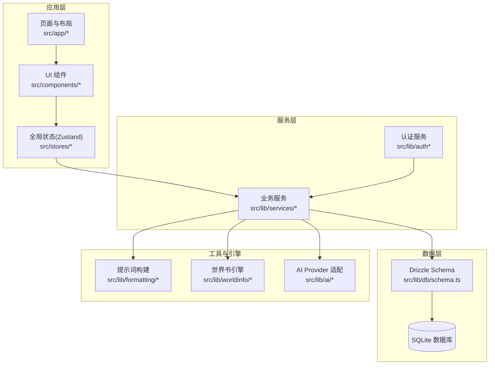
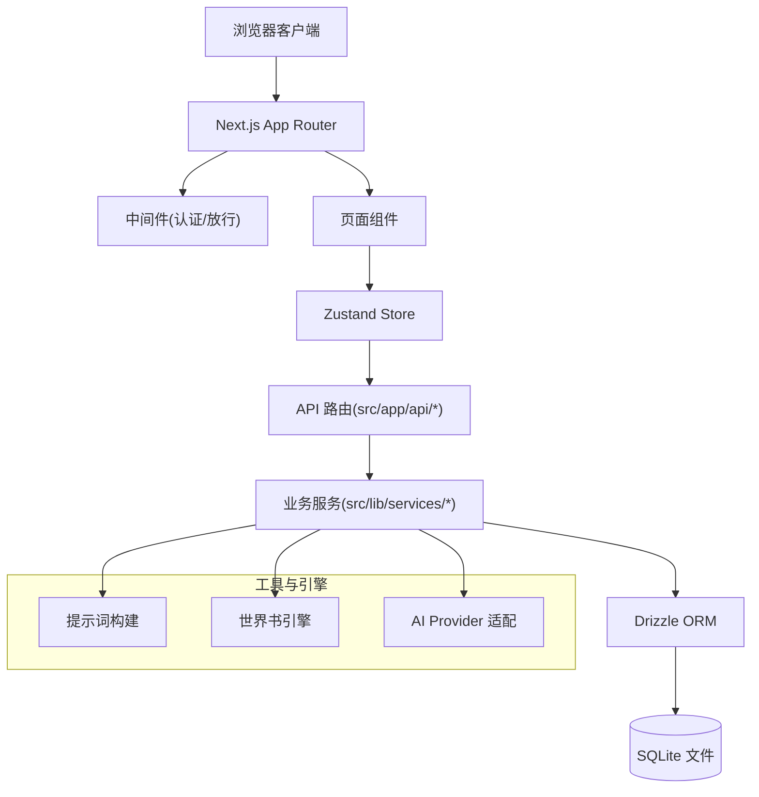
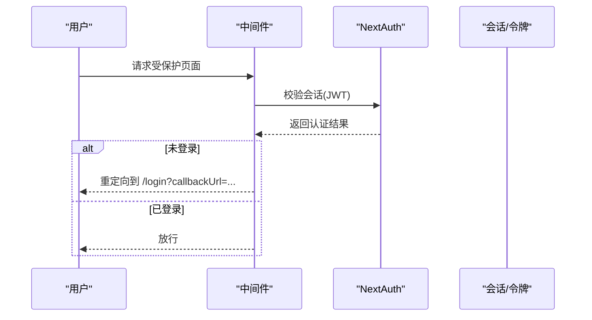
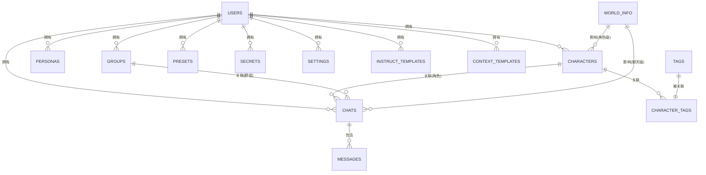
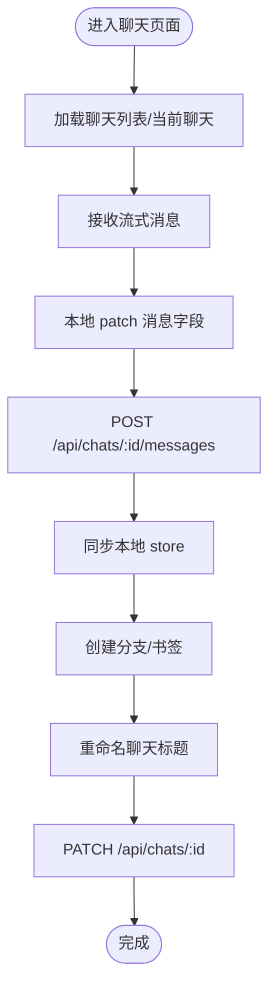
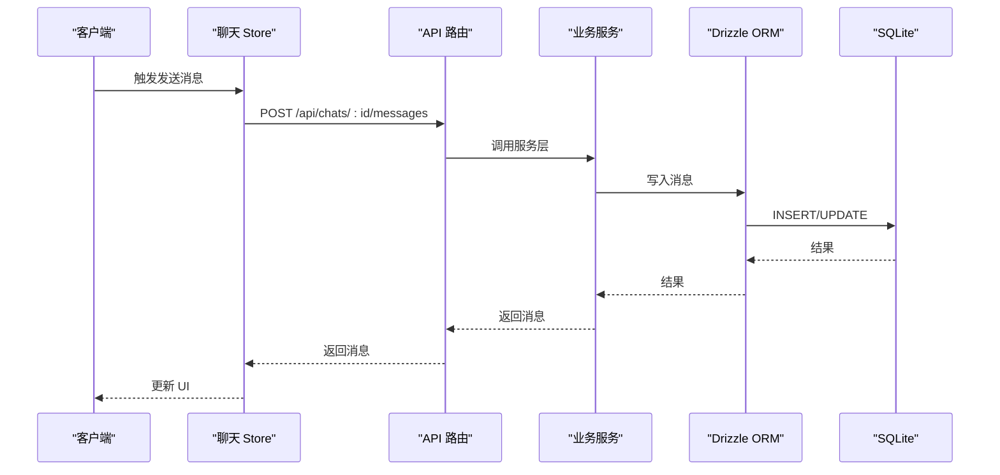
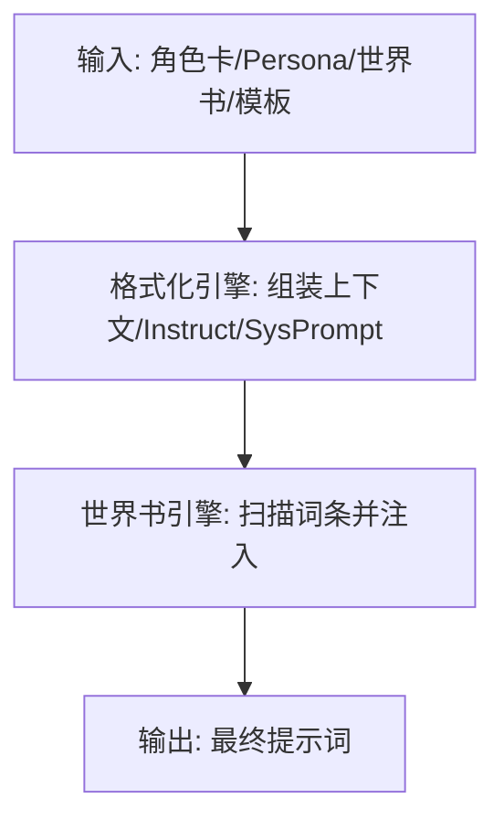
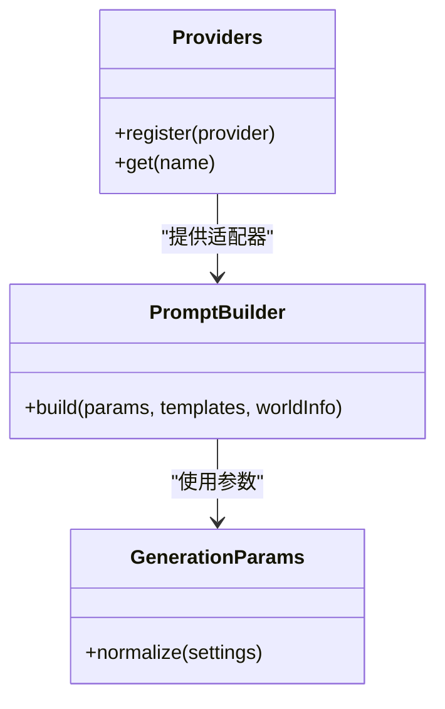
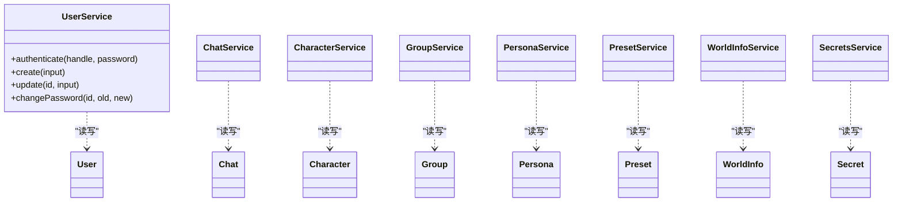
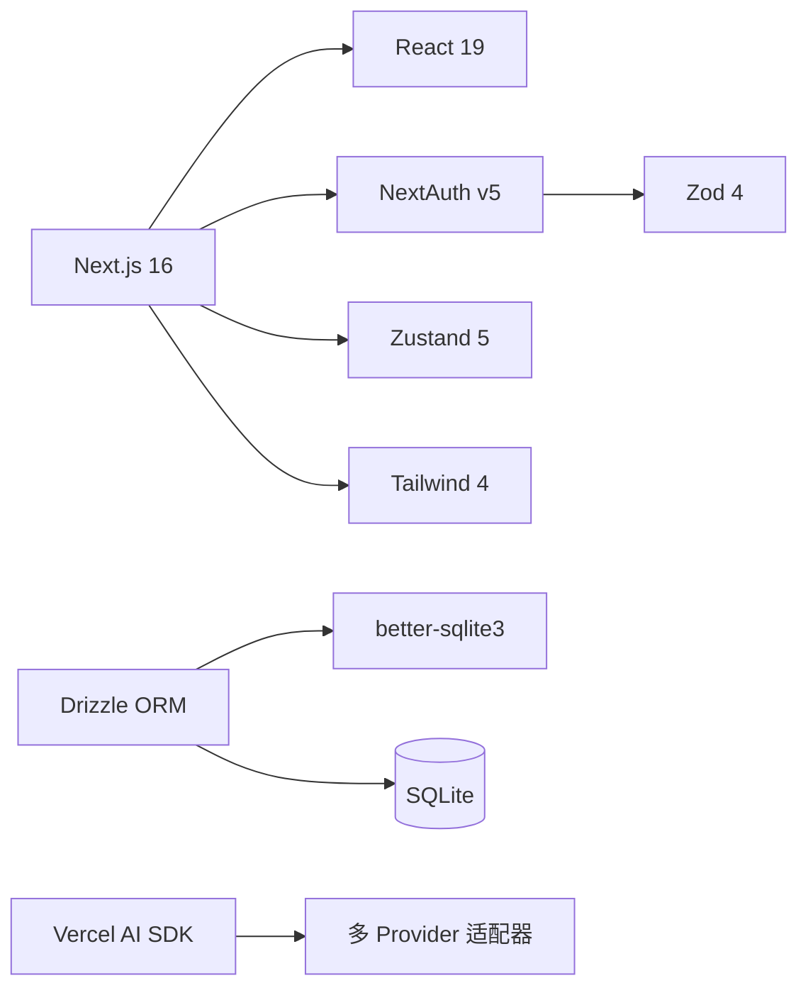

# 架构设计

<cite>
**本文引用的文件**
- [README.md](file://README.md)
- [package.json](file://package.json)
- [next.config.ts](file://next.config.ts)
- [drizzle.config.ts](file://drizzle.config.ts)
- [src/middleware.ts](file://src/middleware.ts)
- [src/lib/auth.config.ts](file://src/lib/auth.config.ts)
- [src/lib/auth.ts](file://src/lib/auth.ts)
- [src/app/layout.tsx](file://src/app/layout.tsx)
- [src/lib/db/schema.ts](file://src/lib/db/schema.ts)
- [src/lib/services/user-service.ts](file://src/lib/services/user-service.ts)
- [src/stores/chat-store.ts](file://src/stores/chat-store.ts)
- [src/lib/formatting/build-prompt.ts](file://src/lib/formatting/build-prompt.ts)
- [src/lib/worldinfo/engine.ts](file://src/lib/worldinfo/engine.ts)
- [src/lib/ai/providers.ts](file://src/lib/ai/providers.ts)
- [src/lib/ai/prompt-builder.ts](file://src/lib/ai/prompt-builder.ts)
- [src/lib/ai/generation-params.ts](file://src/lib/ai/generation-params.ts)
- [src/lib/services/chat-service.ts](file://src/lib/services/chat-service.ts)
- [src/lib/services/character-service.ts](file://src/lib/services/character-service.ts)
- [src/lib/services/group-service.ts](file://src/lib/services/group-service.ts)
- [src/lib/services/persona-service.ts](file://src/lib/services/persona-service.ts)
- [src/lib/services/preset-service.ts](file://src/lib/services/preset-service.ts)
- [src/lib/services/secrets-service.ts](file://src/lib/services/secrets-service.ts)
- [src/lib/services/worldinfo-service.ts](file://src/lib/services/worldinfo-service.ts)
</cite>

## 目录
1. [引言](#引言)
2. [项目结构](#项目结构)
3. [核心组件](#核心组件)
4. [架构总览](#架构总览)
5. [详细组件分析](#详细组件分析)
6. [依赖分析](#依赖分析)
7. [性能考量](#性能考量)
8. [故障排查指南](#故障排查指南)
9. [结论](#结论)
10. [附录](#附录)

## 引言
本文件为 SillyTavern Next 的架构设计文档，面向开发者与架构师，系统阐述系统的整体架构、分层设计、组件交互、认证与数据库层、状态管理、API 设计与数据流。项目基于 Next.js App Router、TypeScript、SQLite 与 Drizzle ORM，采用 Zustand 管理前端状态，提供角色卡、群聊、Persona、世界书、高级格式化与多 AI 提供商等能力。

## 项目结构
- 前端入口与页面：src/app 下采用 Next.js App Router，包含页面路由与 API 路由。
- 组件层：src/components 提供 UI 组件与业务组件。
- 服务层：src/lib/services 提供业务服务封装，连接数据库与外部接口。
- 数据层：src/lib/db 使用 Drizzle ORM 定义 schema，并配合 drizzle-kit 进行迁移。
- 状态层：src/stores 使用 Zustand 管理聊天、格式化、Persona 等全局状态。
- 认证：src/lib/auth 与 src/lib/auth.config 配合 NextAuth v5 实现凭据认证。
- 工具与引擎：src/lib/formatting、src/lib/worldinfo、src/lib/ai 等模块提供提示词构建、世界书检索与 AI 适配。

**图表来源**
- [src/app/layout.tsx:1-24](file://src/app/layout.tsx#L1-L24)
- [src/lib/db/schema.ts:1-240](file://src/lib/db/schema.ts#L1-L240)
- [src/lib/services/user-service.ts:1-170](file://src/lib/services/user-service.ts#L1-L170)
- [src/stores/chat-store.ts:1-583](file://src/stores/chat-store.ts#L1-L583)
- [src/lib/auth.ts:1-59](file://src/lib/auth.ts#L1-L59)
- [src/lib/formatting/build-prompt.ts](file://src/lib/formatting/build-prompt.ts)
- [src/lib/worldinfo/engine.ts](file://src/lib/worldinfo/engine.ts)
- [src/lib/ai/providers.ts](file://src/lib/ai/providers.ts)
- [src/lib/ai/prompt-builder.ts](file://src/lib/ai/prompt-builder.ts)
- [src/lib/ai/generation-params.ts](file://src/lib/ai/generation-params.ts)

**章节来源**
- [README.md:78-108](file://README.md#L78-L108)
- [src/app/layout.tsx:1-24](file://src/app/layout.tsx#L1-L24)

## 核心组件
- Next.js App Router 与中间件：统一页面与 API 路由，中间件实现全局认证拦截与公开端点放行。
- 认证系统：基于 NextAuth v5 的凭据认证，JWT 会话策略，回调处理 token 与 session 注入。
- 数据库层：SQLite + Drizzle ORM，schema 定义完善，涵盖用户、角色卡、群组、聊天、消息、预设、世界书、密钥与设置等。
- 状态管理：Zustand Store 管理聊天上下文、消息流式更新、分支/书签、Swipe 切换等。
- 业务服务：用户、聊天、角色卡、群组、Persona、预设、世界书、密钥等服务封装，统一对外暴露方法。
- 提示词与世界书引擎：构建上下文、Instruct、SysPrompt 模板，以及世界书词条检索与注入。
- AI Provider 适配：统一的生成参数与提示词构建，支持多提供商。

**章节来源**
- [src/middleware.ts:1-35](file://src/middleware.ts#L1-L35)
- [src/lib/auth.config.ts:1-53](file://src/lib/auth.config.ts#L1-L53)
- [src/lib/auth.ts:1-59](file://src/lib/auth.ts#L1-L59)
- [src/lib/db/schema.ts:1-240](file://src/lib/db/schema.ts#L1-L240)
- [src/stores/chat-store.ts:1-583](file://src/stores/chat-store.ts#L1-L583)
- [src/lib/services/user-service.ts:1-170](file://src/lib/services/user-service.ts#L1-L170)
- [src/lib/formatting/build-prompt.ts](file://src/lib/formatting/build-prompt.ts)
- [src/lib/worldinfo/engine.ts](file://src/lib/worldinfo/engine.ts)
- [src/lib/ai/providers.ts](file://src/lib/ai/providers.ts)
- [src/lib/ai/prompt-builder.ts](file://src/lib/ai/prompt-builder.ts)
- [src/lib/ai/generation-params.ts](file://src/lib/ai/generation-params.ts)

## 架构总览
系统采用清晰的分层设计：
- 表现层：Next.js App Router 页面与组件，负责渲染与用户交互。
- 服务层：业务服务封装数据访问与跨域调用，统一错误处理与返回。
- 数据层：Drizzle ORM + SQLite，提供类型安全的数据模型与迁移工具链。
- 工具与引擎：提示词构建、世界书检索、AI Provider 适配，作为纯函数或轻量服务被业务层调用。

**图表来源**
- [src/middleware.ts:1-35](file://src/middleware.ts#L1-L35)
- [src/app/layout.tsx:1-24](file://src/app/layout.tsx#L1-L24)
- [src/lib/db/schema.ts:1-240](file://src/lib/db/schema.ts#L1-L240)
- [src/lib/services/user-service.ts:1-170](file://src/lib/services/user-service.ts#L1-L170)
- [src/lib/formatting/build-prompt.ts](file://src/lib/formatting/build-prompt.ts)
- [src/lib/worldinfo/engine.ts](file://src/lib/worldinfo/engine.ts)
- [src/lib/ai/providers.ts](file://src/lib/ai/providers.ts)

## 详细组件分析

### 认证与会话（NextAuth v5 + JWT）
- 配置：Edge 兼容的 NextAuth 配置，JWT 会话策略，回调注入用户信息到 token 与 session。
- 凭据提供者：用户名/密码校验，结合用户服务进行认证。
- 中间件：拦截非公开路径，未登录重定向至登录页，携带 callbackUrl。

**图表来源**
- [src/middleware.ts:8-30](file://src/middleware.ts#L8-L30)
- [src/lib/auth.config.ts:38-46](file://src/lib/auth.config.ts#L38-L46)
- [src/lib/auth.ts:37-58](file://src/lib/auth.ts#L37-L58)

**章节来源**
- [src/lib/auth.config.ts:1-53](file://src/lib/auth.config.ts#L1-L53)
- [src/lib/auth.ts:1-59](file://src/lib/auth.ts#L1-L59)
- [src/middleware.ts:1-35](file://src/middleware.ts#L1-L35)

### 数据库层（SQLite + Drizzle ORM）
- Schema 设计：覆盖用户、角色卡、标签、Persona、群组、聊天、消息、世界书、预设、密钥、设置、Instruct/Context 模板等。
- 关系：外键约束保证数据一致性；JSON 字段承载扩展信息与复杂对象。
- 迁移：drizzle-kit + schema 定义，统一迁移流程。

**图表来源**
- [src/lib/db/schema.ts:1-240](file://src/lib/db/schema.ts#L1-L240)

**章节来源**
- [src/lib/db/schema.ts:1-240](file://src/lib/db/schema.ts#L1-L240)
- [drizzle.config.ts:1-11](file://drizzle.config.ts#L1-L11)

### 状态管理（Zustand）
- 聊天 Store：管理当前聊天、聊天列表、消息流式更新、分支/书签、Swipe 切换、消息移动、推理块等。
- 乐观更新与回写：本地乐观更新，异步持久化到服务端，失败时记录日志。
- 与 API 的交互：通过 fetch 调用 /api/chats、/api/chats/:id/messages 等端点。

**图表来源**
- [src/stores/chat-store.ts:167-233](file://src/stores/chat-store.ts#L167-L233)
- [src/stores/chat-store.ts:235-272](file://src/stores/chat-store.ts#L235-L272)
- [src/stores/chat-store.ts:505-536](file://src/stores/chat-store.ts#L505-L536)
- [src/stores/chat-store.ts:538-559](file://src/stores/chat-store.ts#L538-L559)

**章节来源**
- [src/stores/chat-store.ts:1-583](file://src/stores/chat-store.ts#L1-L583)

### API 设计与数据流
- API 路由：位于 src/app/api/*，遵循 Next.js App Router 的路由约定，按资源划分目录结构。
- 设计原则：REST 风格、幂等性、明确的状态码、错误统一返回、鉴权中间件保护。
- 数据流：前端 Store -> API -> 业务服务 -> Drizzle ORM -> SQLite；部分操作支持流式响应（如文本生成）。

**图表来源**
- [src/stores/chat-store.ts:235-272](file://src/stores/chat-store.ts#L235-L272)
- [src/lib/services/chat-service.ts](file://src/lib/services/chat-service.ts)

**章节来源**
- [src/stores/chat-store.ts:235-272](file://src/stores/chat-store.ts#L235-L272)

### 提示词构建与世界书引擎
- 提示词构建：根据角色卡、Persona、世界书、上下文模板、Instruct 模板等组装最终提示词。
- 世界书引擎：扫描聊天上下文，提取词条并注入到提示词中，支持全局/角色/聊天级联动。

**图表来源**
- [src/lib/formatting/build-prompt.ts](file://src/lib/formatting/build-prompt.ts)
- [src/lib/worldinfo/engine.ts](file://src/lib/worldinfo/engine.ts)

**章节来源**
- [src/lib/formatting/build-prompt.ts](file://src/lib/formatting/build-prompt.ts)
- [src/lib/worldinfo/engine.ts](file://src/lib/worldinfo/engine.ts)

### AI Provider 适配与生成参数
- Provider 注册：集中管理各提供商的适配器与元信息。
- 生成参数：统一的参数结构，支持不同提供商的差异化设置。
- 提示词构建：与 AI SDK 集成，按提供商要求格式化请求。

**图表来源**
- [src/lib/ai/providers.ts](file://src/lib/ai/providers.ts)
- [src/lib/ai/prompt-builder.ts](file://src/lib/ai/prompt-builder.ts)
- [src/lib/ai/generation-params.ts](file://src/lib/ai/generation-params.ts)

**章节来源**
- [src/lib/ai/providers.ts](file://src/lib/ai/providers.ts)
- [src/lib/ai/prompt-builder.ts](file://src/lib/ai/prompt-builder.ts)
- [src/lib/ai/generation-params.ts](file://src/lib/ai/generation-params.ts)

### 业务服务层（概览）
- 用户服务：认证、创建、更新、密码变更等。
- 聊天/角色/群组/Persona/预设/世界书/密钥服务：围绕核心实体提供 CRUD 与业务逻辑。
- 服务层职责：参数校验、事务边界、错误处理、与 Drizzle ORM 的交互。

**图表来源**
- [src/lib/services/user-service.ts:60-170](file://src/lib/services/user-service.ts#L60-L170)
- [src/lib/services/chat-service.ts](file://src/lib/services/chat-service.ts)
- [src/lib/services/character-service.ts](file://src/lib/services/character-service.ts)
- [src/lib/services/group-service.ts](file://src/lib/services/group-service.ts)
- [src/lib/services/persona-service.ts](file://src/lib/services/persona-service.ts)
- [src/lib/services/preset-service.ts](file://src/lib/services/preset-service.ts)
- [src/lib/services/worldinfo-service.ts](file://src/lib/services/worldinfo-service.ts)
- [src/lib/services/secrets-service.ts](file://src/lib/services/secrets-service.ts)

**章节来源**
- [src/lib/services/user-service.ts:1-170](file://src/lib/services/user-service.ts#L1-L170)

## 依赖分析
- 框架与运行时：Next.js 16、React 19、Edge Runtime 兼容的认证配置。
- 数据库与 ORM：better-sqlite3 + drizzle-orm，迁移工具 drizzle-kit。
- 认证：next-auth v5（凭据提供者 + JWT 会话）。
- 状态：zustand 5。
- 校验：zod 4。
- AI SDK：vercel/ai 与多提供商适配器。

**图表来源**
- [package.json:18-46](file://package.json#L18-L46)
- [next.config.ts:1-14](file://next.config.ts#L1-L14)
- [drizzle.config.ts:1-11](file://drizzle.config.ts#L1-L11)

**章节来源**
- [package.json:1-61](file://package.json#L1-L61)
- [next.config.ts:1-14](file://next.config.ts#L1-L14)

## 性能考量
- 中间件匹配器：仅对非静态资源与非图片资源生效，减少不必要的鉴权检查。
- 会话策略：JWT 会话避免频繁查询数据库，提升登录态读取性能。
- 状态更新：Store 采用局部更新与乐观更新，降低 UI 重绘成本。
- 数据库：Drizzle ORM 提供类型安全与最小必要查询，配合索引与外键约束保障一致性。
- 生成性能：AI Provider 适配与参数归一化，减少重复序列化与网络往返。

[本节为通用性能讨论，无需具体文件引用]

## 故障排查指南
- 认证失败：检查 AUTH_SECRET 是否正确设置，确认凭据提供者的 authorize 流程与用户状态。
- 中间件重定向循环：确认公开端点（/login、/api/auth、/_next、favicon.ico）是否正确放行。
- 数据库迁移：确保 DATABASE_URL 正确指向 SQLite 文件，执行迁移与种子脚本。
- 状态异常：Store 的持久化失败会记录日志，检查 API 返回与网络连通性。
- 生成异常：检查各 Provider 的密钥配置与网络连通性，查看服务层日志。

**章节来源**
- [src/middleware.ts:12-30](file://src/middleware.ts#L12-L30)
- [src/lib/auth.config.ts:17-19](file://src/lib/auth.config.ts#L17-L19)
- [drizzle.config.ts:7-9](file://drizzle.config.ts#L7-L9)
- [src/stores/chat-store.ts:206-208](file://src/stores/chat-store.ts#L206-L208)

## 结论
SillyTavern Next 采用现代前端技术栈与清晰的分层架构，结合 Next.js App Router、NextAuth v5、Drizzle ORM、Zustand 与多 AI Provider 适配，实现了角色卡、群聊、Persona、世界书与高级格式化的完整体验。系统在安全性（JWT 会话）、可维护性（类型安全 ORM、模块化服务层）与可扩展性（Provider 与模板引擎）方面具备良好基础，适合单机部署与二次开发。

## 附录
- 部署建议：使用 Docker，挂载数据卷，生产环境配置强随机 AUTH_SECRET，建议前置反向代理提供 HTTPS。
- 常用命令：dev、build、start、setup（迁移+种子）、db:generate、db:migrate、db:seed、lint、typecheck。

**章节来源**
- [README.md:150-157](file://README.md#L150-L157)
- [README.md:123-136](file://README.md#L123-L136)