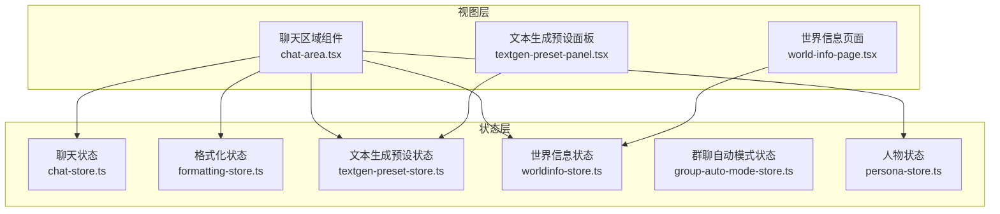
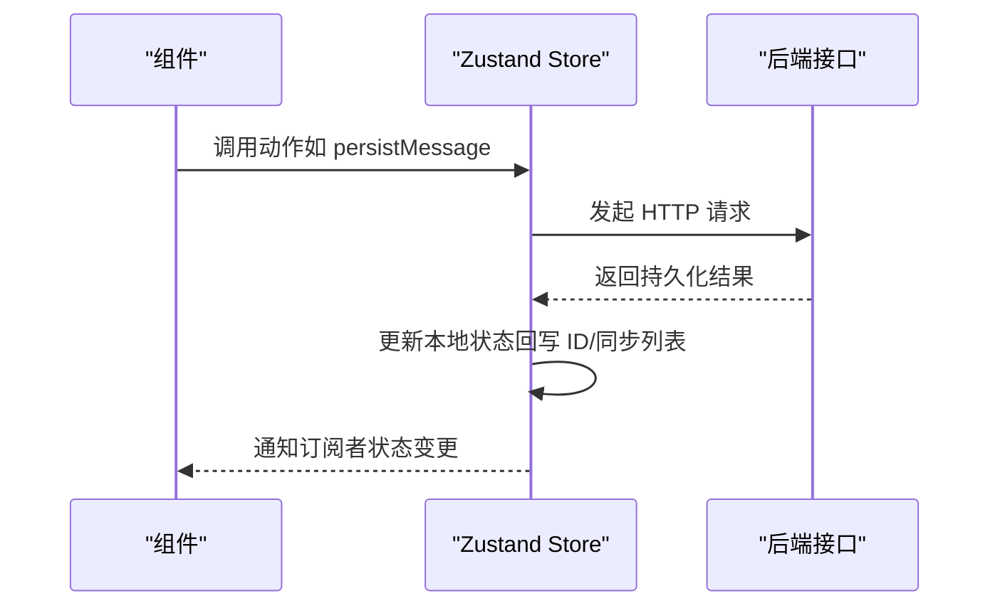
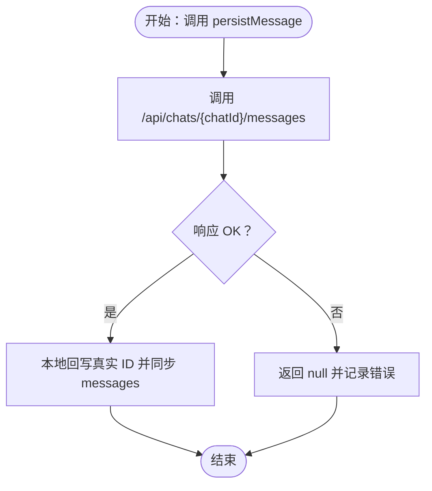
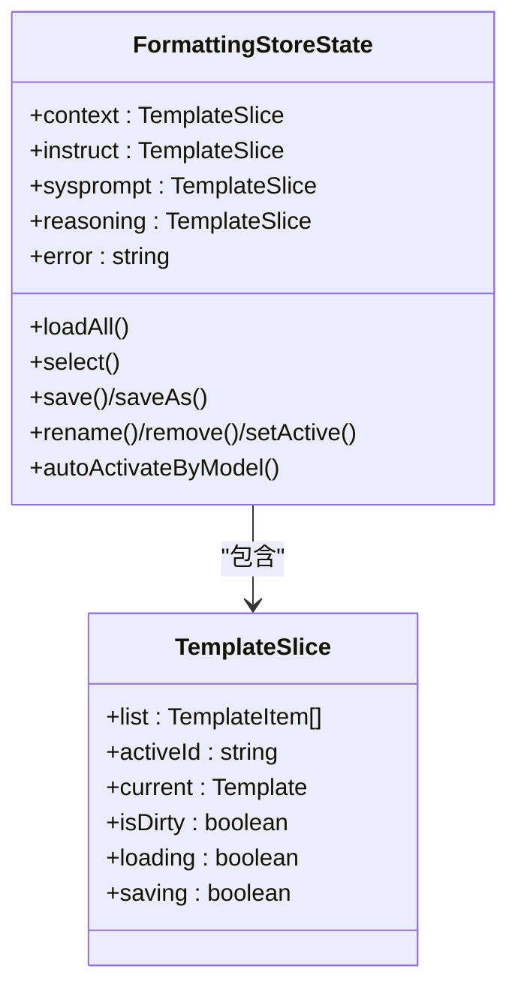
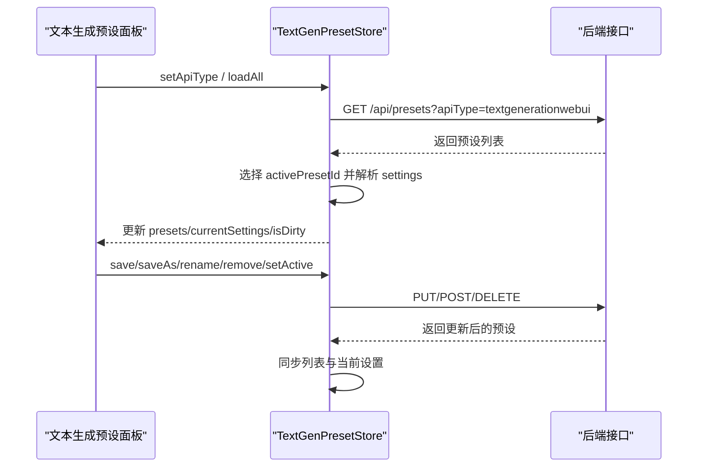
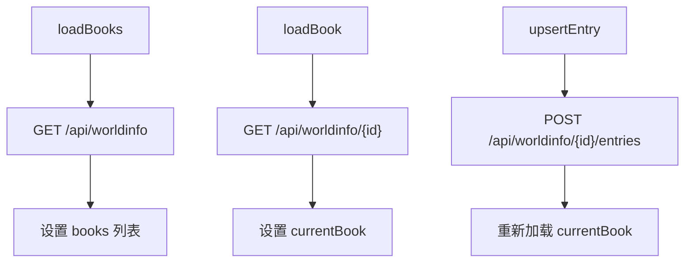
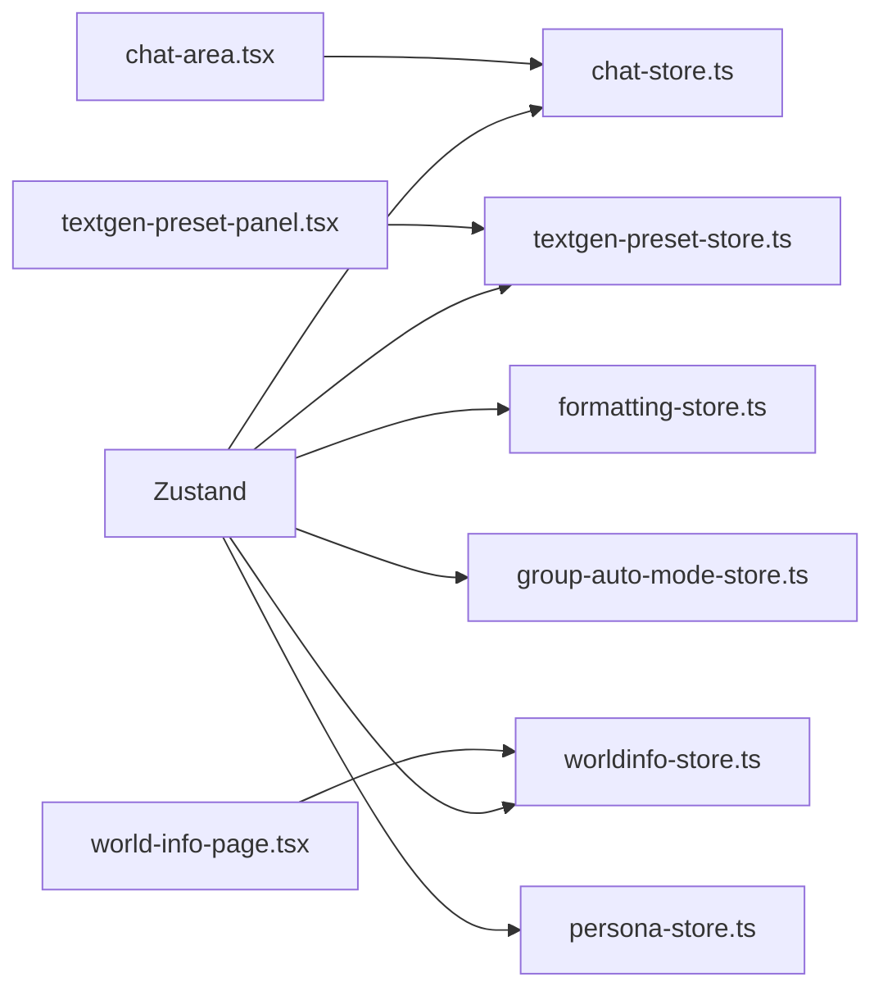

# 状态管理架构

<cite>
**本文档引用的文件**
- [package.json](file://package.json)
- [chat-store.ts](file://src/stores/chat-store.ts)
- [formatting-store.ts](file://src/stores/formatting-store.ts)
- [textgen-preset-store.ts](file://src/stores/textgen-preset-store.ts)
- [worldinfo-store.ts](file://src/stores/worldinfo-store.ts)
- [group-auto-mode-store.ts](file://src/stores/group-auto-mode-store.ts)
- [persona-store.ts](file://src/stores/persona-store.ts)
- [chat-area.tsx](file://src/components/chat/chat-area.tsx)
- [textgen-preset-panel.tsx](file://src/components/textgen-preset/textgen-preset-panel.tsx)
- [world-info-page.tsx](file://src/components/world-info/world-info-page.tsx)
- [advanced-formatting.ts](file://src/types/advanced-formatting.ts)
- [textgen.ts](file://src/types/textgen.ts)
- [index.ts](file://src/types/index.ts)
</cite>

## 目录
1. [简介](#简介)
2. [项目结构](#项目结构)
3. [核心组件](#核心组件)
4. [架构总览](#架构总览)
5. [详细组件分析](#详细组件分析)
6. [依赖分析](#依赖分析)
7. [性能考量](#性能考量)
8. [故障排查指南](#故障排查指南)
9. [结论](#结论)
10. [附录](#附录)

## 简介
本文件系统性梳理 SillyTavern Next 的状态管理架构，围绕 Zustand 设计模式、全局状态组织、状态同步与副作用处理、持久化策略、订阅与性能优化等方面展开。文档面向不同技术背景的读者，既提供高层概览，也给出代码级的可视化图表与实操建议。

## 项目结构
- 状态容器集中于 src/stores 目录，采用“按功能域划分”的模块化组织方式，每个 store 独立封装自身状态、动作与副作用。
- 组件通过 hooks 方式订阅 store，形成“视图层 -> 状态层”的单向数据流。
- 类型系统位于 src/types，为各 store 的数据结构与 API 交互提供强类型保障。

**图表来源**
- [chat-store.ts:105-583](file://src/stores/chat-store.ts#L105-L583)
- [formatting-store.ts:131-506](file://src/stores/formatting-store.ts#L131-L506)
- [textgen-preset-store.ts:85-371](file://src/stores/textgen-preset-store.ts#L85-L371)
- [worldinfo-store.ts:43-257](file://src/stores/worldinfo-store.ts#L43-L257)
- [group-auto-mode-store.ts:13-18](file://src/stores/group-auto-mode-store.ts#L13-L18)
- [persona-store.ts:24-59](file://src/stores/persona-store.ts#L24-L59)
- [chat-area.tsx:34-112](file://src/components/chat/chat-area.tsx#L34-L112)
- [textgen-preset-panel.tsx:22-31](file://src/components/textgen-preset/textgen-preset-panel.tsx#L22-L31)
- [world-info-page.tsx:18-38](file://src/components/world-info/world-info-page.tsx#L18-L38)

**章节来源**
- [package.json:45-45](file://package.json#L45-L45)
- [chat-store.ts:105-583](file://src/stores/chat-store.ts#L105-L583)
- [formatting-store.ts:131-506](file://src/stores/formatting-store.ts#L131-L506)
- [textgen-preset-store.ts:85-371](file://src/stores/textgen-preset-store.ts#L85-L371)
- [worldinfo-store.ts:43-257](file://src/stores/worldinfo-store.ts#L43-L257)
- [group-auto-mode-store.ts:13-18](file://src/stores/group-auto-mode-store.ts#L13-L18)
- [persona-store.ts:24-59](file://src/stores/persona-store.ts#L24-L59)
- [chat-area.tsx:34-112](file://src/components/chat/chat-area.tsx#L34-L112)
- [textgen-preset-panel.tsx:22-31](file://src/components/textgen-preset/textgen-preset-panel.tsx#L22-L31)
- [world-info-page.tsx:18-38](file://src/components/world-info/world-info-page.tsx#L18-L38)

## 核心组件
- 聊天状态容器（chat-store.ts）：负责当前聊天、消息列表、生成状态、消息增删改查、分支/书签、群聊加载与持久化。
- 格式化状态容器（formatting-store.ts）：维护上下文/指令/系统提示/推理四类模板的列表、当前选中、脏标记与导入导出。
- 文本生成预设状态容器（textgen-preset-store.ts）：管理文本生成后端类型、预设列表、当前编辑设置、脏标记与导入导出。
- 世界信息状态容器（worldinfo-store.ts）：管理世界书列表、当前编辑世界书、词条增删改、全局设置与导入导出。
- 群聊自动模式状态容器（group-auto-mode-store.ts）：提供全局开关，便于统一控制群聊自动生成功能。
- 人物状态容器（persona-store.ts）：管理当前激活的 Persona，支持加载、激活与取消。

**章节来源**
- [chat-store.ts:15-103](file://src/stores/chat-store.ts#L15-L103)
- [formatting-store.ts:84-117](file://src/stores/formatting-store.ts#L84-L117)
- [textgen-preset-store.ts:25-65](file://src/stores/textgen-preset-store.ts#L25-L65)
- [worldinfo-store.ts:9-41](file://src/stores/worldinfo-store.ts#L9-L41)
- [group-auto-mode-store.ts:7-11](file://src/stores/group-auto-mode-store.ts#L7-L11)
- [persona-store.ts:13-22](file://src/stores/persona-store.ts#L13-L22)

## 架构总览
Zustand 在本项目中采用“单文件一 store”的模式，每个 store 通过 create 构造函数暴露状态与动作，动作内部可组合本地更新与异步副作用（网络请求、本地回写），并提供错误日志与状态回滚策略（如乐观更新 + 失败告警）。

**图表来源**
- [chat-store.ts:236-272](file://src/stores/chat-store.ts#L236-L272)
- [formatting-store.ts:232-258](file://src/stores/formatting-store.ts#L232-L258)
- [textgen-preset-store.ts:179-205](file://src/stores/textgen-preset-store.ts#L179-L205)
- [worldinfo-store.ts:63-78](file://src/stores/worldinfo-store.ts#L63-L78)

## 详细组件分析

### 聊天状态容器（ChatStore）
- 设计要点
  - 本地状态与持久化动作分离：本地动作（addMessage、patchMessage、moveMessage）即时更新；持久化动作（persistMessage、updateMessage、deleteMessage）与后端同步。
  - 消息滑动（swipe）系统：支持多版本内容与元数据同步，提供 appendSwipe、deleteSwipe、setActiveSwipe。
  - 群聊支持：loadOrCreateGroupChat、loadChatsForGroup，自动注入首条消息。
  - 乐观更新：renameChat 本地先更新，再异步提交，失败时可继续使用本地状态。
- 数据流
  - 组件通过 useChatStore 订阅 currentChat、isGenerating 等；动作通过 set/get 组合实现状态更新与副作用。
- 错误处理
  - 所有异步动作均包裹 try/catch 并打印错误日志，避免阻塞 UI。

**图表来源**
- [chat-store.ts:236-272](file://src/stores/chat-store.ts#L236-L272)

**章节来源**
- [chat-store.ts:105-583](file://src/stores/chat-store.ts#L105-L583)
- [chat-area.tsx:34-112](file://src/components/chat/chat-area.tsx#L34-L112)

### 格式化状态容器（FormattingStore）
- 设计要点
  - 模板切片（TemplateSlice）抽象：context/instruct/sysprompt/reasoning 四类模板共享同一切片结构，统一 list/current/activeId/isDirty/loading/saving/error 状态。
  - 类型安全：通过 Zod schema 校验与默认值回退，确保模板数据一致性。
  - 自动激活：autoActivateByModel 基于模型名正则匹配自动切换 instruct/context。
  - 导入导出：支持单段与“主文件”（含多段）两种导入路径。
- 数据流
  - 组件通过 useFormattingStore 选择模板类别与动作，store 内部通过 setSlice 与 getSlice 组合更新状态。

**图表来源**
- [formatting-store.ts:62-117](file://src/stores/formatting-store.ts#L62-L117)
- [formatting-store.ts:131-506](file://src/stores/formatting-store.ts#L131-L506)
- [advanced-formatting.ts:34-116](file://src/types/advanced-formatting.ts#L34-L116)

**章节来源**
- [formatting-store.ts:131-506](file://src/stores/formatting-store.ts#L131-L506)
- [advanced-formatting.ts:1-279](file://src/types/advanced-formatting.ts#L1-L279)
- [chat-area.tsx:67-71](file://src/components/chat/chat-area.tsx#L67-L71)

### 文本生成预设状态容器（TextGenPresetStore）
- 设计要点
  - 后端类型（apiType）隔离：不同后端（如 ooba、llama.cpp 等）拥有独立预设列表与设置集。
  - 脏标记与浅比较：isDirty 与 isSettingsEqual 用于判断是否需要保存，避免不必要的网络请求。
  - 导入导出：支持单预设与批量导入，自动定位 textgenerationwebui 类型并选中。
- 数据流
  - 组件通过 useTextGenPresetStore 订阅 apiType、presets、currentSettings 与 isDirty，动作负责加载、保存、重命名、删除与激活。

**图表来源**
- [textgen-preset-store.ts:96-137](file://src/stores/textgen-preset-store.ts#L96-L137)
- [textgen-preset-store.ts:179-205](file://src/stores/textgen-preset-store.ts#L179-L205)
- [textgen-preset-store.ts:236-272](file://src/stores/textgen-preset-store.ts#L236-L272)
- [textgen-preset-store.ts:291-309](file://src/stores/textgen-preset-store.ts#L291-L309)
- [textgen-preset-store.ts:322-350](file://src/stores/textgen-preset-store.ts#L322-L350)
- [textgen-preset-store.ts:352-370](file://src/stores/textgen-preset-store.ts#L352-L370)

**章节来源**
- [textgen-preset-store.ts:85-371](file://src/stores/textgen-preset-store.ts#L85-L371)
- [textgen.ts:1-388](file://src/types/textgen.ts#L1-L388)
- [textgen-preset-panel.tsx:22-31](file://src/components/textgen-preset/textgen-preset-panel.tsx#L22-L31)

### 世界信息状态容器（WorldInfoStore）
- 设计要点
  - 三层联动：全局（globalSelect）、角色（characterBook）、聊天（metadata.world_info_book_ids）构建世界信息请求。
  - 词条管理：新增、更新、删除、复制世界书，支持导入导出与设置同步。
- 数据流
  - 组件通过 useWorldInfoStore 订阅 books/currentBook/settings，动作负责列表加载、书籍操作与设置更新。

**图表来源**
- [worldinfo-store.ts:49-61](file://src/stores/worldinfo-store.ts#L49-L61)
- [worldinfo-store.ts:164-173](file://src/stores/worldinfo-store.ts#L164-L173)
- [worldinfo-store.ts:177-195](file://src/stores/worldinfo-store.ts#L177-L195)

**章节来源**
- [worldinfo-store.ts:43-257](file://src/stores/worldinfo-store.ts#L43-L257)
- [world-info-page.tsx:18-38](file://src/components/world-info/world-info-page.tsx#L18-L38)

### 群聊自动模式状态容器（GroupAutoModeStore）
- 设计要点
  - 最简 store：仅包含 enabled、toggle、setEnabled 三个动作，便于全局开关控制。
- 数据流
  - 组件通过 useGroupAutoModeStore 订阅 enabled 并调用 toggle/setEnabled。

**章节来源**
- [group-auto-mode-store.ts:13-18](file://src/stores/group-auto-mode-store.ts#L13-L18)

### 人物状态容器（PersonaStore）
- 设计要点
  - 激活/取消激活 Persona：通过 API 同步当前激活状态，store 内部负责加载与更新。
- 数据流
  - 组件通过 usePersonaStore 订阅 activePersona 并调用 loadActive/activate/deactivate。

**章节来源**
- [persona-store.ts:24-59](file://src/stores/persona-store.ts#L24-L59)
- [chat-area.tsx:74-76](file://src/components/chat/chat-area.tsx#L74-L76)

## 依赖分析
- 外部依赖
  - Zustand：状态容器核心库，提供 create 与动作组合能力。
  - Zod：类型校验与默认值回退，确保模板与预设数据的健壮性。
  - Next.js：SSR/CSR 环境下的状态生命周期与路由集成。
- 组件与 store 的耦合
  - 组件通过 hooks 订阅 store，动作通过 set/get 组合实现状态更新与副作用，降低耦合度。
- 循环依赖
  - 各 store 独立，无直接相互依赖；通过组件协调跨域状态使用。

**图表来源**
- [package.json:45-45](file://package.json#L45-L45)
- [chat-area.tsx:34-54](file://src/components/chat/chat-area.tsx#L34-L54)
- [textgen-preset-panel.tsx:22-29](file://src/components/textgen-preset/textgen-preset-panel.tsx#L22-L29)
- [world-info-page.tsx:18-31](file://src/components/world-info/world-info-page.tsx#L18-L31)

**章节来源**
- [package.json:45-45](file://package.json#L45-L45)
- [chat-area.tsx:34-54](file://src/components/chat/chat-area.tsx#L34-L54)
- [textgen-preset-panel.tsx:22-29](file://src/components/textgen-preset/textgen-preset-panel.tsx#L22-L29)
- [world-info-page.tsx:18-31](file://src/components/world-info/world-info-page.tsx#L18-L31)

## 性能考量
- 本地优先与乐观更新
  - renameChat 本地先更新 title，再异步提交，提升交互响应速度。
- 并发请求与去抖
  - moveMessage 对两条消息并发 PATCH，减少往返延迟。
- 脏标记与浅比较
  - isDirty 与 isSettingsEqual 避免无效保存与重渲染。
- 列表懒加载
  - 仅在首次访问时加载预设/模板/世界书，减少初始开销。
- 渲染粒度
  - 组件按需订阅 store 片段，避免全局重渲染。

[本节为通用性能建议，无需特定文件引用]

## 故障排查指南
- 网络异常
  - 所有异步动作均打印错误日志，可在控制台定位失败原因。
  - 建议检查后端接口状态与鉴权配置。
- 持久化不一致
  - persistMessage 成功后会回写服务端真实 ID，若分支/书签无法定位消息，检查本地 messages 是否已正确替换。
- 模板/预设解析失败
  - Zod 校验失败时回退默认值，确认模板/预设 JSON 结构与字段命名是否符合规范。
- 世界信息联动无效
  - 确认 globalSelect/characterBook/chat metadata 是否正确设置，构建 payload 时三者之一存在即触发。

**章节来源**
- [chat-store.ts:236-272](file://src/stores/chat-store.ts#L236-L272)
- [formatting-store.ts:54-60](file://src/stores/formatting-store.ts#L54-L60)
- [textgen-preset-store.ts:68-74](file://src/stores/textgen-preset-store.ts#L68-L74)
- [worldinfo-store.ts:101-112](file://src/stores/worldinfo-store.ts#L101-L112)

## 结论
本项目以 Zustand 为核心的状态管理方案，通过“按功能域划分”的 store 组织、严格的类型校验与合理的副作用设计，实现了高内聚、低耦合的状态体系。结合本地优先、乐观更新与并发优化，整体具备良好的用户体验与扩展性。建议在后续迭代中进一步完善错误边界与持久化一致性校验，持续优化大列表与复杂模板的渲染性能。

[本节为总结性内容，无需特定文件引用]

## 附录
- 最佳实践
  - 将本地动作与持久化动作分离，明确职责边界。
  - 使用 Zod schema 与默认值回退，增强数据健壮性。
  - 通过 isDirty 与浅比较避免无效保存。
  - 在组件层面按需订阅，减少不必要的重渲染。
- 调试技巧
  - 利用浏览器开发工具观察 store 变化轨迹。
  - 在关键动作（如 persistMessage、updateMessage）前后记录日志。
  - 使用错误边界捕获并上报异常。
- 扩展策略
  - 新增 store 时遵循现有命名与目录约定。
  - 为复杂动作引入中间件（如日志、重试、幂等）。
  - 对大列表与高频更新场景引入虚拟滚动与分页加载。

[本节为通用指导，无需特定文件引用]