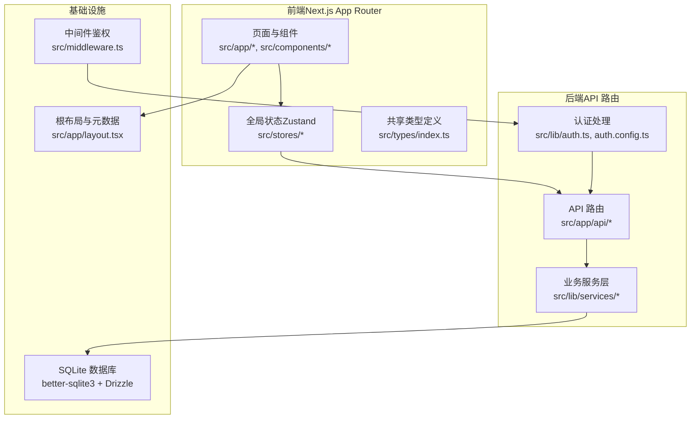
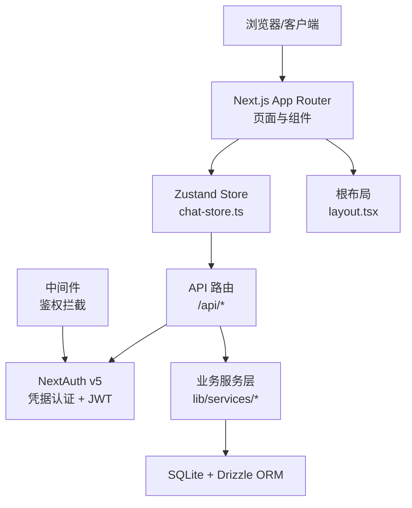
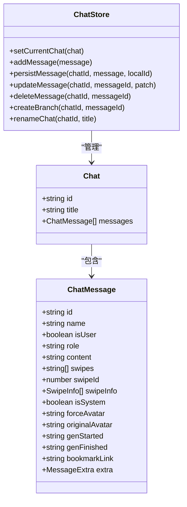
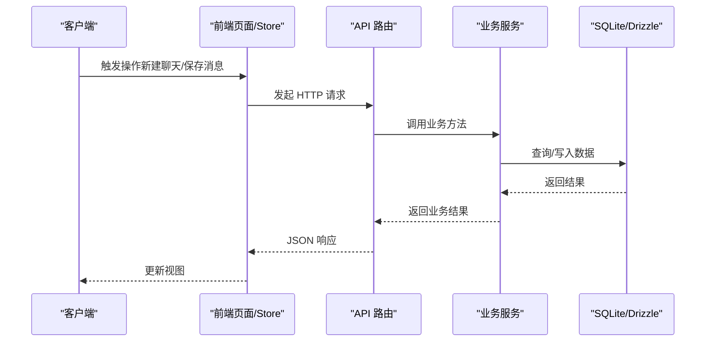
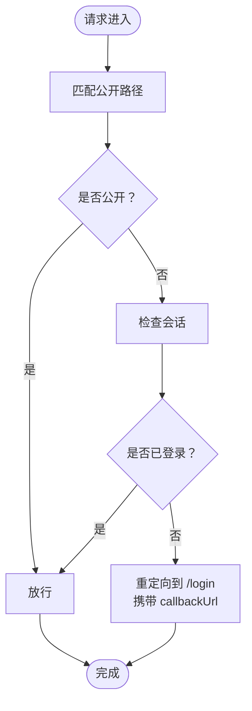
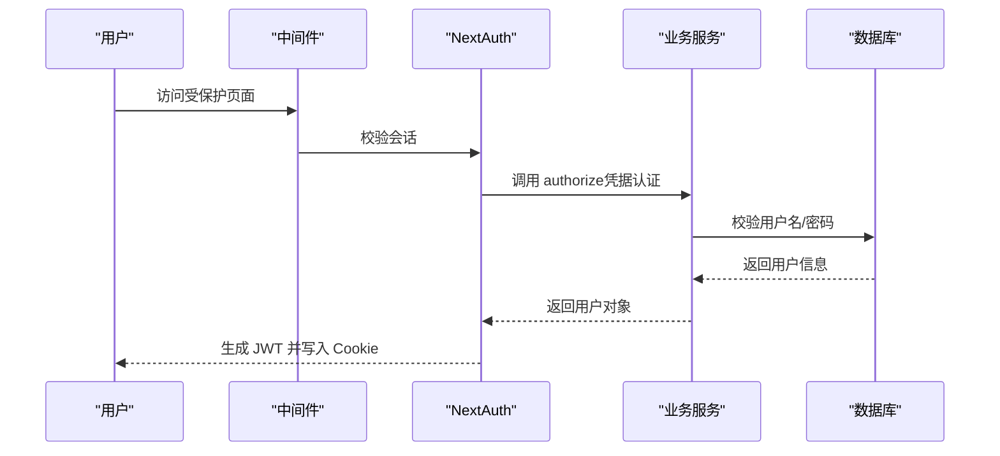
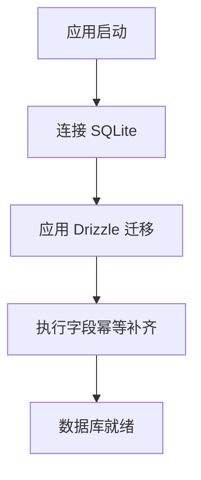
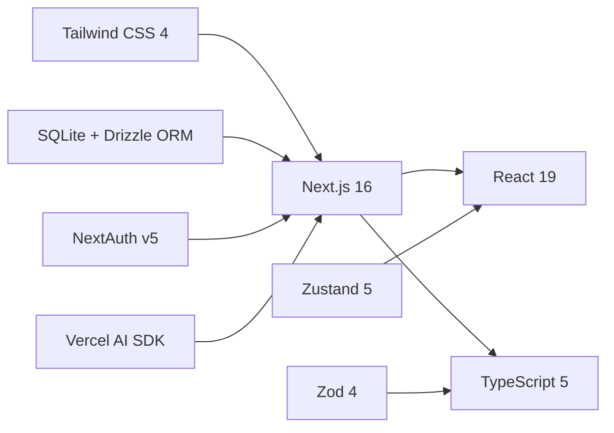

# 系统架构概览

<cite>
**本文档引用的文件**
- [README.md](file://README.md)
- [package.json](file://package.json)
- [src/middleware.ts](file://src/middleware.ts)
- [src/lib/auth.config.ts](file://src/lib/auth.config.ts)
- [src/lib/auth.ts](file://src/lib/auth.ts)
- [src/lib/db/index.ts](file://src/lib/db/index.ts)
- [src/app/layout.tsx](file://src/app/layout.tsx)
- [src/app/api/auth/[...nextauth]/route.ts](file://src/app/api/auth/[...nextauth]/route.ts)
- [src/app/api/health/route.ts](file://src/app/api/health/route.ts)
- [src/types/index.ts](file://src/types/index.ts)
- [src/stores/chat-store.ts](file://src/stores/chat-store.ts)
</cite>

## 目录
1. [引言](#引言)
2. [项目结构](#项目结构)
3. [核心组件](#核心组件)
4. [架构总览](#架构总览)
5. [详细组件分析](#详细组件分析)
6. [依赖分析](#依赖分析)
7. [性能考量](#性能考量)
8. [故障排查指南](#故障排查指南)
9. [结论](#结论)
10. [附录](#附录)

## 引言
本文件为 SillyTavern Next 的系统架构概览文档，面向开发者与架构师，系统性阐述前端（Next.js App Router）、后端（API 路由）、中间件与认证架构的设计理念与实现方式。文档重点覆盖：
- 分层设计模式：表现层、业务层、数据层的职责划分与边界
- 组件间交互关系与数据流向
- 技术栈选择与架构决策的权衡
- 系统架构图与组件关系图
- 常见问题排查与优化建议

## 项目结构
SillyTavern Next 采用 Next.js 16 App Router 架构，结合 TypeScript、SQLite + Drizzle ORM、Zustand 状态管理、NextAuth v5 认证与 Vercel AI SDK，形成前后端一体化的现代化单机部署方案。

图表来源
- [src/app/layout.tsx:1-24](file://src/app/layout.tsx#L1-L24)
- [src/middleware.ts:1-35](file://src/middleware.ts#L1-L35)
- [src/lib/auth.ts:1-59](file://src/lib/auth.ts#L1-L59)
- [src/lib/db/index.ts:1-134](file://src/lib/db/index.ts#L1-L134)
- [src/stores/chat-store.ts:1-583](file://src/stores/chat-store.ts#L1-L583)

章节来源
- [README.md:78-108](file://README.md#L78-L108)
- [package.json:18-46](file://package.json#L18-L46)

## 核心组件
- 前端表现层
  - 页面与组件：位于 src/app 与 src/components，负责渲染与用户交互
  - 全局状态：Zustand stores（如 chat-store）管理聊天、预设、世界书等状态
  - 类型系统：src/types/index.ts 提供跨层共享的数据模型与接口
- 后端业务层
  - API 路由：src/app/api 下的路由处理器，暴露 REST 风格接口
  - 业务服务：src/lib/services/* 提供领域服务（角色、聊天、群组、世界书等）
  - 数据访问：src/lib/db/index.ts 通过 Drizzle ORM 访问 SQLite
- 中间件与认证
  - NextAuth v5：凭据认证 + JWT 会话策略
  - 中间件：统一鉴权拦截与登录跳转
- 基础设施
  - 数据库：SQLite（better-sqlite3）+ Drizzle 迁移与幂等补齐
  - 健康检查：/api/health 无需鉴权

章节来源
- [src/stores/chat-store.ts:1-583](file://src/stores/chat-store.ts#L1-L583)
- [src/types/index.ts:1-533](file://src/types/index.ts#L1-L533)
- [src/lib/db/index.ts:1-134](file://src/lib/db/index.ts#L1-L134)
- [src/app/api/health/route.ts:1-10](file://src/app/api/health/route.ts#L1-L10)

## 架构总览
系统采用“前端路由 + API 路由 + 中间件 + 认证 + 数据库”的分层架构，强调：
- 前端负责 UI 与交互，通过 fetch 调用后端 API
- 后端 API 路由作为边界层，协调业务服务与数据访问
- 中间件统一处理鉴权与登录跳转
- 认证采用 JWT 会话，支持凭据登录与回调扩展
- 数据层以 SQLite 为核心，Drizzle 提供类型安全的迁移与查询

图表来源
- [src/stores/chat-store.ts:168-209](file://src/stores/chat-store.ts#L168-L209)
- [src/app/api/auth/[...nextauth]/route.ts:1-3](file://src/app/api/auth/[...nextauth]/route.ts#L1-L3)
- [src/lib/db/index.ts:1-134](file://src/lib/db/index.ts#L1-L134)
- [src/middleware.ts:8-30](file://src/middleware.ts#L8-L30)
- [src/app/layout.tsx:11-23](file://src/app/layout.tsx#L11-L23)

## 详细组件分析

### 前端架构（Next.js App Router）
- 页面组织：src/app 下按功能域划分页面（如 characters、chat、settings），支持动态路由与嵌套路由
- 组件化：src/components 下按功能域拆分组件，复用性强
- 全局状态：Zustand store（如 chat-store）集中管理聊天上下文、消息、分支与书签等状态
- 类型系统：src/types/index.ts 定义消息、角色、聊天、世界书、预设等核心模型，确保跨层一致性

图表来源
- [src/stores/chat-store.ts:15-103](file://src/stores/chat-store.ts#L15-L103)
- [src/types/index.ts:60-84](file://src/types/index.ts#L60-L84)
- [src/types/index.ts:86-91](file://src/types/index.ts#L86-L91)

章节来源
- [src/stores/chat-store.ts:105-583](file://src/stores/chat-store.ts#L105-L583)
- [src/types/index.ts:57-131](file://src/types/index.ts#L57-L131)

### 后端架构（API 路由）
- API 路由组织：src/app/api 下按资源域划分（如 /api/chats、/api/characters、/api/worldinfo 等）
- 认证入口：/api/auth/[...nextauth] 路由转发至 NextAuth handlers
- 健康检查：/api/health 无需鉴权，供容器编排与监控使用
- 业务协作：API 路由调用业务服务层，后者通过 Drizzle 访问数据库

图表来源
- [src/stores/chat-store.ts:168-209](file://src/stores/chat-store.ts#L168-L209)
- [src/app/api/health/route.ts:7-9](file://src/app/api/health/route.ts#L7-L9)

章节来源
- [src/app/api/auth/[...nextauth]/route.ts:1-3](file://src/app/api/auth/[...nextauth]/route.ts#L1-L3)
- [src/app/api/health/route.ts:1-10](file://src/app/api/health/route.ts#L1-L10)

### 中间件架构
- 统一鉴权：src/middleware.ts 使用 NextAuth 的 auth 包裹，对受保护路径进行登录校验
- 公开路径：允许 /login、/api/auth、/_next、favicon.ico 等无需鉴权
- 登录跳转：未登录访问受保护路径时，自动重定向至 /login 并携带 callbackUrl

图表来源
- [src/middleware.ts:8-30](file://src/middleware.ts#L8-L30)

章节来源
- [src/middleware.ts:1-35](file://src/middleware.ts#L1-L35)

### 认证架构（NextAuth v5 + 凭据认证）
- 配置：src/lib/auth.config.ts 定义凭据提供者、JWT 策略、会话策略与回调
- 实现：src/lib/auth.ts 注册凭据提供者，结合 userService.authenticate 完成用户认证
- 会话：JWT 中携带用户 id、handle、admin 等信息，回调注入到 session
- 登录页：/login 由 NextAuth pages.signIn 指定

图表来源
- [src/lib/auth.config.ts:5-52](file://src/lib/auth.config.ts#L5-L52)
- [src/lib/auth.ts:21-35](file://src/lib/auth.ts#L21-L35)
- [src/middleware.ts:38-46](file://src/middleware.ts#L38-L46)

章节来源
- [src/lib/auth.config.ts:1-53](file://src/lib/auth.config.ts#L1-L53)
- [src/lib/auth.ts:1-59](file://src/lib/auth.ts#L1-L59)
- [src/app/api/auth/[...nextauth]/route.ts:1-3](file://src/app/api/auth/[...nextauth]/route.ts#L1-L3)

### 数据层（SQLite + Drizzle ORM）
- 连接与迁移：src/lib/db/index.ts 初始化 better-sqlite3，使用 Drizzle migrate 应用迁移
- 幂等补齐：启动时对表结构进行幂等补齐，避免迁移文件滞后导致 500
- 字段补齐：针对 characters、presets、messages、personas、groups 等表进行列补齐
- 配置：WAL 模式、外键约束开启，提升并发与一致性

图表来源
- [src/lib/db/index.ts:16-134](file://src/lib/db/index.ts#L16-L134)

章节来源
- [src/lib/db/index.ts:1-134](file://src/lib/db/index.ts#L1-L134)

## 依赖分析
- 框架与语言：Next.js 16 + React 19 + TypeScript 5
- 样式与状态：Tailwind CSS 4 + Zustand 5
- 数据库：SQLite + better-sqlite3 + Drizzle ORM
- 认证：NextAuth v5（凭据提供者 + JWT）
- AI SDK：Vercel AI SDK + 多 Provider 适配
- 校验：Zod 4
- 构建与工具：ESLint、TypeScript、drizzle-kit、tsx

图表来源
- [package.json:18-46](file://package.json#L18-L46)
- [README.md:110-122](file://README.md#L110-L122)

章节来源
- [package.json:1-61](file://package.json#L1-L61)
- [README.md:110-122](file://README.md#L110-L122)

## 性能考量
- 前端性能
  - 使用 Zustand 精简状态更新，避免不必要的重渲染
  - API 调用采用并发与乐观更新策略，减少等待时间
- 数据库性能
  - SQLite WAL 模式提升读写并发
  - Drizzle ORM 提供类型安全与高效查询
- 认证性能
  - JWT 会话避免频繁数据库查询
  - 中间件轻量拦截，仅对受保护路径生效
- 部署建议
  - Docker 单机部署，数据卷持久化
  - 生产环境建议前置 Nginx/Caddy 提供 HTTPS

## 故障排查指南
- 认证相关
  - 确认 AUTH_SECRET 已正确设置且为强随机串
  - 检查 /api/auth/* 是否正常转发至 NextAuth handlers
  - 核对中间件是否正确拦截未登录访问
- 数据库相关
  - 启动日志中查看迁移与字段补齐是否成功
  - 如出现字段缺失错误，确认幂等补齐逻辑是否执行
- API 健康检查
  - 访问 /api/health 确认服务可用，响应包含时间戳
- 常见问题
  - 首次登录后需修改默认密码
  - 环境变量 DATABASE_URL 与数据卷映射需一致

章节来源
- [src/lib/auth.config.ts:48-52](file://src/lib/auth.config.ts#L48-L52)
- [src/lib/db/index.ts:16-134](file://src/lib/db/index.ts#L16-L134)
- [src/app/api/health/route.ts:7-9](file://src/app/api/health/route.ts#L7-L9)

## 结论
SillyTavern Next 通过 Next.js App Router、Zustand、NextAuth v5、SQLite + Drizzle ORM 的组合，构建了轻量、可维护、可扩展的单机部署方案。其分层清晰、职责明确，既满足功能需求，又兼顾性能与可运维性。开发者可在此基础上快速扩展新功能与 AI Provider。

## 附录
- 目录结构与职责
  - src/app：页面与 API 路由
  - src/components：UI 组件
  - src/lib：认证、服务、数据库、类型等
  - src/stores：全局状态
  - src/types：共享类型
- 常用命令
  - 开发：npm run dev
  - 构建：npm run build
  - 启动：npm run start
  - 初始化：npm run setup
  - 数据库：npm run db:generate / db:migrate / db:seed

章节来源
- [README.md:78-136](file://README.md#L78-L136)