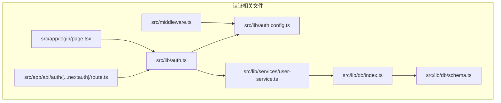
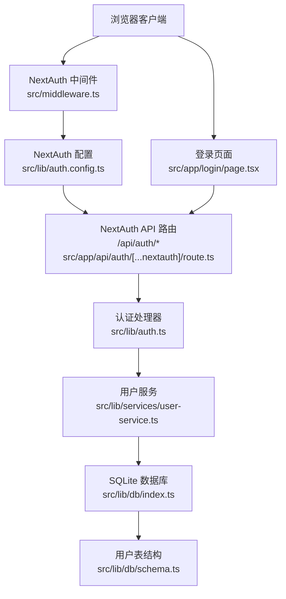
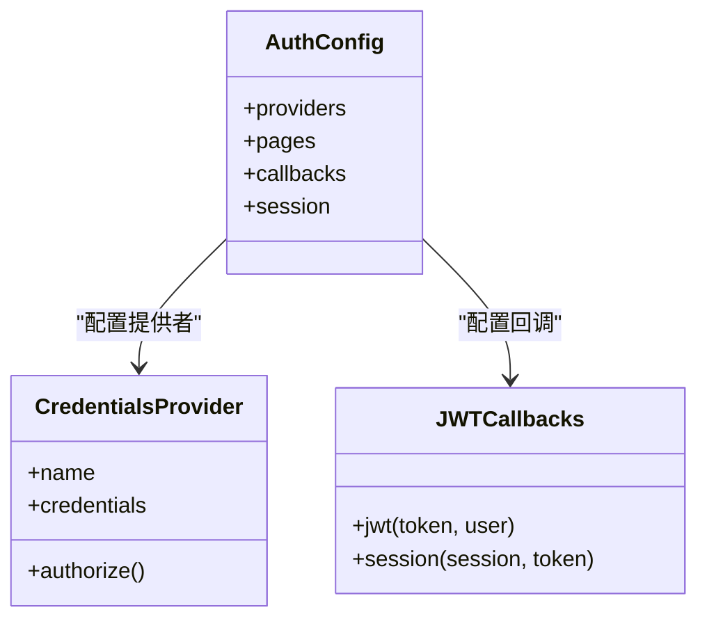
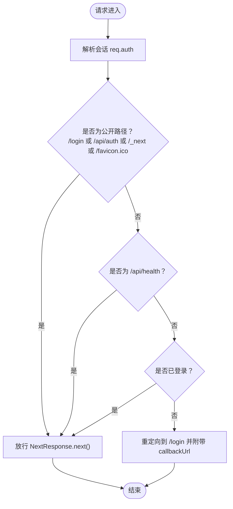
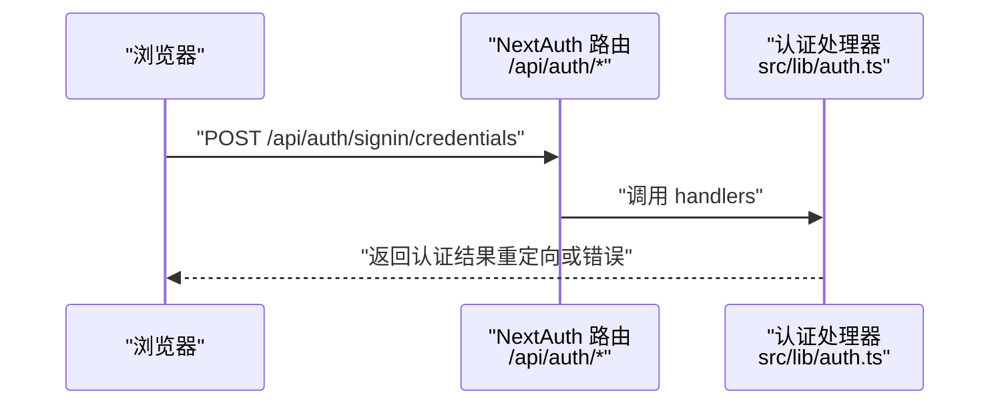
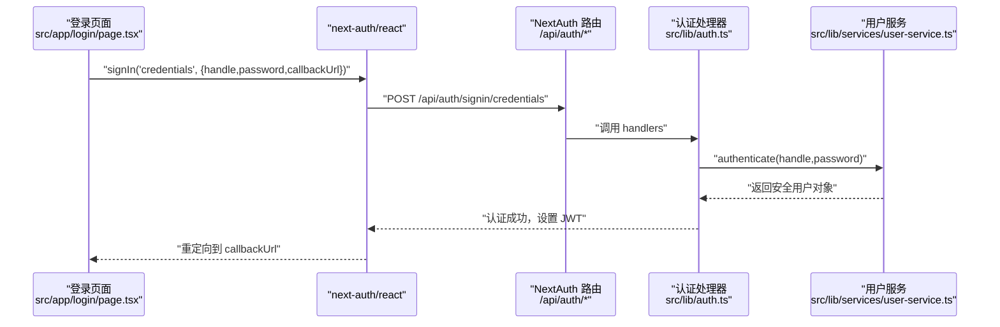
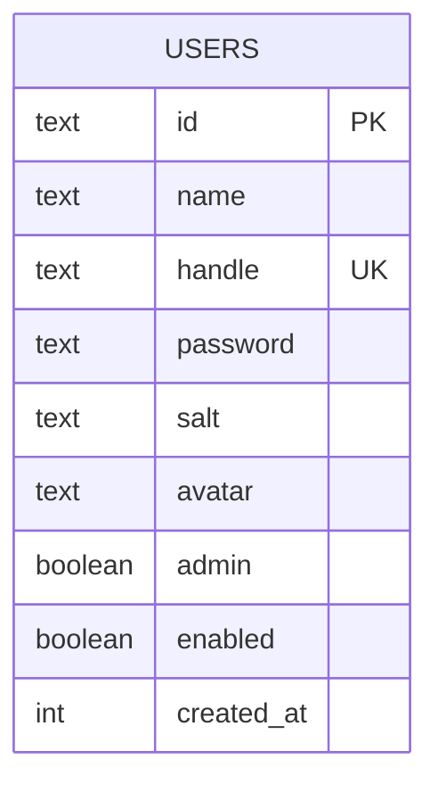
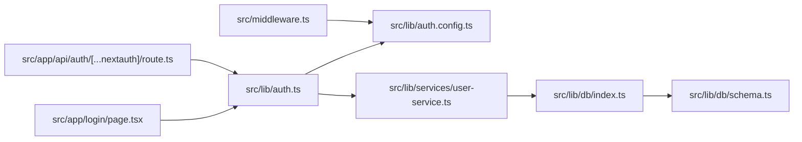

# 认证架构设计

<cite>
**本文档引用的文件**
- [src/lib/auth.ts](file://src/lib/auth.ts)
- [src/lib/auth.config.ts](file://src/lib/auth.config.ts)
- [src/middleware.ts](file://src/middleware.ts)
- [src/app/api/auth/[...nextauth]/route.ts](file://src/app/api/auth/[...nextauth]/route.ts)
- [src/app/login/page.tsx](file://src/app/login/page.tsx)
- [src/lib/services/user-service.ts](file://src/lib/services/user-service.ts)
- [src/lib/db/index.ts](file://src/lib/db/index.ts)
- [src/lib/db/schema.ts](file://src/lib/db/schema.ts)
- [package.json](file://package.json)
</cite>

## 目录
1. [简介](#简介)
2. [项目结构](#项目结构)
3. [核心组件](#核心组件)
4. [架构总览](#架构总览)
5. [详细组件分析](#详细组件分析)
6. [依赖关系分析](#依赖关系分析)
7. [性能考量](#性能考量)
8. [故障排除指南](#故障排除指南)
9. [结论](#结论)

## 简介
本文件为 SillyTavern Next 的认证架构设计文档，聚焦于 NextAuth v5 在应用中的集成方式、中间件认证机制与会话管理策略。文档从整体架构出发，逐步深入到关键组件与数据流，解释认证流程、用户状态管理、权限控制策略以及安全最佳实践，并提供流程图与安全架构图帮助开发者快速理解与实施。

## 项目结构
围绕认证的关键文件组织如下：
- 认证入口与配置：src/lib/auth.ts、src/lib/auth.config.ts
- 中间件：src/middleware.ts
- NextAuth API 路由：src/app/api/auth/[...nextauth]/route.ts
- 登录页面：src/app/login/page.tsx
- 用户服务与数据库：src/lib/services/user-service.ts、src/lib/db/index.ts、src/lib/db/schema.ts
- 依赖声明：package.json

**图表来源**
- [src/lib/auth.ts:12-58](file://src/lib/auth.ts#L12-L58)
- [src/lib/auth.config.ts:5-52](file://src/lib/auth.config.ts#L5-L52)
- [src/middleware.ts:6-34](file://src/middleware.ts#L6-L34)
- [src/app/api/auth/[...nextauth]/route.ts:1-3](file://src/app/api/auth/[...nextauth]/route.ts#L1-L3)
- [src/app/login/page.tsx:13-30](file://src/app/login/page.tsx#L13-L30)
- [src/lib/services/user-service.ts:60-169](file://src/lib/services/user-service.ts#L60-L169)
- [src/lib/db/index.ts:1-134](file://src/lib/db/index.ts#L1-L134)
- [src/lib/db/schema.ts:6-16](file://src/lib/db/schema.ts#L6-L16)

**章节来源**
- [src/lib/auth.ts:12-58](file://src/lib/auth.ts#L12-L58)
- [src/lib/auth.config.ts:5-52](file://src/lib/auth.config.ts#L5-L52)
- [src/middleware.ts:6-34](file://src/middleware.ts#L6-L34)
- [src/app/api/auth/[...nextauth]/route.ts:1-3](file://src/app/api/auth/[...nextauth]/route.ts#L1-L3)
- [src/app/login/page.tsx:13-30](file://src/app/login/page.tsx#L13-L30)
- [src/lib/services/user-service.ts:60-169](file://src/lib/services/user-service.ts#L60-L169)
- [src/lib/db/index.ts:1-134](file://src/lib/db/index.ts#L1-L134)
- [src/lib/db/schema.ts:6-16](file://src/lib/db/schema.ts#L6-L16)

## 核心组件
- NextAuth 配置与提供者
  - 凭证提供者（Credentials Provider）：基于用户名与密码进行认证，授权逻辑在自定义 authorize 回调中实现。
  - JWT 会话策略：采用 JWT 作为会话载体，配置了 30 天有效期。
  - 回调函数：jwt 与 session 回调负责在首次登录时将用户信息写入 token，并在后续请求中将 token 信息注入到 session。
- 中间件认证
  - 使用 NextAuth 提供的 auth 包装器在请求进入时解析会话并进行路由保护。
  - 对特定公开路径（如 /login、/api/auth、/_next、/favicon.ico）放行；对 /api/health 健康检查端点也无需鉴权。
- NextAuth API 路由
  - 将 NextAuth 的 handlers 暴露为 /api/auth/* 的 GET/POST 接口，供前端 next-auth/react 使用。
- 登录页面
  - 前端通过 next-auth/react 的 signIn 方法提交凭据，触发认证流程。
- 用户服务与数据库
  - 用户服务封装认证逻辑：查询用户、校验启用状态、使用 scrypt 验证密码、返回安全用户对象。
  - 数据库采用 better-sqlite3 与 drizzle-orm，用户表包含 id、handle、password、salt、admin、enabled 等字段。

**章节来源**
- [src/lib/auth.ts:12-58](file://src/lib/auth.ts#L12-L58)
- [src/lib/auth.config.ts:5-52](file://src/lib/auth.config.ts#L5-L52)
- [src/middleware.ts:8-30](file://src/middleware.ts#L8-L30)
- [src/app/api/auth/[...nextauth]/route.ts:1-3](file://src/app/api/auth/[...nextauth]/route.ts#L1-L3)
- [src/app/login/page.tsx:13-30](file://src/app/login/page.tsx#L13-L30)
- [src/lib/services/user-service.ts:64-69](file://src/lib/services/user-service.ts#L64-L69)
- [src/lib/db/schema.ts:6-16](file://src/lib/db/schema.ts#L6-L16)

## 架构总览
下图展示了认证系统在客户端、中间件与后端之间的交互关系：

**图表来源**
- [src/middleware.ts:6-34](file://src/middleware.ts#L6-L34)
- [src/lib/auth.config.ts:5-52](file://src/lib/auth.config.ts#L5-L52)
- [src/app/api/auth/[...nextauth]/route.ts:1-3](file://src/app/api/auth/[...nextauth]/route.ts#L1-L3)
- [src/lib/auth.ts:12-58](file://src/lib/auth.ts#L12-L58)
- [src/lib/services/user-service.ts:64-69](file://src/lib/services/user-service.ts#L64-L69)
- [src/lib/db/index.ts:1-134](file://src/lib/db/index.ts#L1-L134)
- [src/lib/db/schema.ts:6-16](file://src/lib/db/schema.ts#L6-L16)
- [src/app/login/page.tsx:13-30](file://src/app/login/page.tsx#L13-L30)

## 详细组件分析

### NextAuth 配置与提供者
- 凭证提供者
  - 字段定义：handle（文本）、password（密码）。
  - 授权流程：前端提交凭据 → NextAuth 调用 authorize → 使用 Zod 校验 → 调用用户服务进行认证 → 返回包含 id、name、handle、admin 的用户对象。
- 回调处理
  - jwt 回调：首次登录时将用户信息写入 token。
  - session 回调：将 token 中的信息注入到 session.user。
- 会话策略
  - 策略：JWT。
  - 有效期：30 天。
- 页面重定向
  - 登录页：/login。

**图表来源**
- [src/lib/auth.config.ts:5-52](file://src/lib/auth.config.ts#L5-L52)
- [src/lib/auth.ts:14-36](file://src/lib/auth.ts#L14-L36)
- [src/lib/auth.ts:37-57](file://src/lib/auth.ts#L37-L57)

**章节来源**
- [src/lib/auth.ts:14-36](file://src/lib/auth.ts#L14-L36)
- [src/lib/auth.ts:37-57](file://src/lib/auth.ts#L37-L57)
- [src/lib/auth.config.ts:5-52](file://src/lib/auth.config.ts#L5-L52)

### 中间件认证机制
- 中间件职责
  - 解析请求中的会话信息，判断是否已登录。
  - 放行公开路径：/login、/api/auth、/_next、/favicon.ico。
  - 对 /api/health 健康检查端点放行。
  - 未登录用户重定向至 /login，并携带 callbackUrl。
- 匹配规则
  - 使用 matcher 对非静态资源路径进行拦截。

**图表来源**
- [src/middleware.ts:8-30](file://src/middleware.ts#L8-L30)

**章节来源**
- [src/middleware.ts:8-30](file://src/middleware.ts#L8-L30)

### NextAuth API 路由
- 路由暴露
  - 将 NextAuth 的 handlers 暴露为 /api/auth/* 的 GET/POST 接口。
- 前端交互
  - 前端通过 next-auth/react 的 signIn 方法向该路由发起认证请求。

**图表来源**
- [src/app/api/auth/[...nextauth]/route.ts:1-3](file://src/app/api/auth/[...nextauth]/route.ts#L1-L3)
- [src/lib/auth.ts:12-58](file://src/lib/auth.ts#L12-L58)

**章节来源**
- [src/app/api/auth/[...nextauth]/route.ts:1-3](file://src/app/api/auth/[...nextauth]/route.ts#L1-L3)
- [src/lib/auth.ts:12-58](file://src/lib/auth.ts#L12-L58)

### 登录页面与认证流程
- 登录页面
  - 提供用户名与密码输入框，提交时调用 next-auth/react 的 signIn 方法。
- 认证流程
  - 前端提交凭据 → NextAuth API 路由 → 认证处理器 → 用户服务验证 → 成功后写入 JWT 并重定向到首页。

**图表来源**
- [src/app/login/page.tsx:13-30](file://src/app/login/page.tsx#L13-L30)
- [src/app/api/auth/[...nextauth]/route.ts:1-3](file://src/app/api/auth/[...nextauth]/route.ts#L1-L3)
- [src/lib/auth.ts:21-34](file://src/lib/auth.ts#L21-L34)
- [src/lib/services/user-service.ts:64-69](file://src/lib/services/user-service.ts#L64-L69)

**章节来源**
- [src/app/login/page.tsx:13-30](file://src/app/login/page.tsx#L13-L30)
- [src/lib/auth.ts:21-34](file://src/lib/auth.ts#L21-L34)
- [src/lib/services/user-service.ts:64-69](file://src/lib/services/user-service.ts#L64-L69)

### 用户服务与数据库
- 用户服务
  - authenticate：根据 handle 查询用户，校验 enabled 状态，使用 scrypt 验证密码，返回安全用户对象。
  - create/update/delete/changePassword：提供用户生命周期管理能力。
- 数据库与表结构
  - 用户表 users：包含 id、name、handle、password、salt、avatar、admin、enabled、createdAt 等字段。
  - 数据库初始化：better-sqlite3 + drizzle-orm，启动时自动迁移。

**图表来源**
- [src/lib/db/schema.ts:6-16](file://src/lib/db/schema.ts#L6-L16)

**章节来源**
- [src/lib/services/user-service.ts:64-69](file://src/lib/services/user-service.ts#L64-L69)
- [src/lib/db/schema.ts:6-16](file://src/lib/db/schema.ts#L6-L16)
- [src/lib/db/index.ts:1-134](file://src/lib/db/index.ts#L1-L134)

## 依赖关系分析
- 组件耦合
  - 认证处理器依赖用户服务与 NextAuth 配置。
  - 中间件依赖 NextAuth 配置进行会话解析。
  - 登录页面依赖 next-auth/react 与 NextAuth API 路由。
  - 用户服务依赖数据库连接与 schema。
- 外部依赖
  - next-auth v5、better-sqlite3、drizzle-orm、zod。

**图表来源**
- [src/lib/auth.ts:12-58](file://src/lib/auth.ts#L12-L58)
- [src/lib/auth.config.ts:5-52](file://src/lib/auth.config.ts#L5-L52)
- [src/middleware.ts:6-34](file://src/middleware.ts#L6-L34)
- [src/app/api/auth/[...nextauth]/route.ts:1-3](file://src/app/api/auth/[...nextauth]/route.ts#L1-L3)
- [src/app/login/page.tsx:13-30](file://src/app/login/page.tsx#L13-L30)
- [src/lib/services/user-service.ts:60-169](file://src/lib/services/user-service.ts#L60-L169)
- [src/lib/db/index.ts:1-134](file://src/lib/db/index.ts#L1-L134)
- [src/lib/db/schema.ts:6-16](file://src/lib/db/schema.ts#L6-L16)

**章节来源**
- [package.json:18-46](file://package.json#L18-L46)

## 性能考量
- JWT 会话策略
  - 优点：无服务器状态，适合边缘部署与多实例扩展。
  - 注意：令牌大小受用户信息影响，应避免在 token 中存放过大负载。
- 数据库访问
  - 用户认证仅涉及单表查询与密码校验，建议保持索引与查询简洁，避免不必要的 JOIN。
- 中间件匹配
  - matcher 已过滤静态资源与图标，减少对静态文件的中间件开销。

[本节为通用性能建议，不直接分析具体文件]

## 故障排除指南
- 认证失败
  - 检查登录页面提交的凭据是否符合 Zod 校验规则。
  - 确认用户处于启用状态且密码正确。
- 会话无效
  - 检查 JWT 是否过期（默认 30 天）。
  - 确认中间件未错误拦截 /api/health 等公开端点。
- 数据库问题
  - 确认数据库迁移已执行，必要时重新初始化数据库。
- 权限相关
  - 当前配置未实现细粒度权限控制，如需角色级权限，可在 jwt/session 回调中扩展权限字段并在业务层校验。

**章节来源**
- [src/lib/auth.ts:7-10](file://src/lib/auth.ts#L7-L10)
- [src/lib/services/user-service.ts:64-69](file://src/lib/services/user-service.ts#L64-L69)
- [src/middleware.ts:42-45](file://src/middleware.ts#L42-L45)
- [src/lib/db/index.ts:16-29](file://src/lib/db/index.ts#L16-L29)

## 结论
SillyTavern Next 的认证体系以 NextAuth v5 为核心，结合 JWT 会话策略与中间件路由保护，实现了轻量、可扩展的认证方案。通过凭证提供者与自定义授权回调，系统能够灵活地对接内部用户模型与数据库。当前实现聚焦于基础认证与会话管理，若需进一步增强，可在回调中扩展权限字段并在业务层实施更细粒度的权限控制。