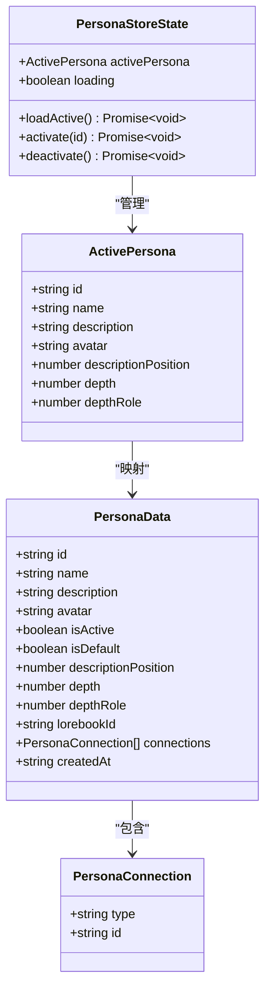
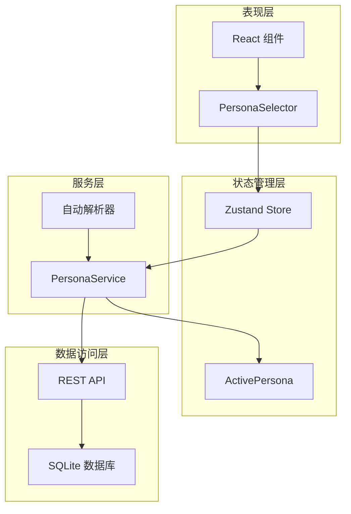
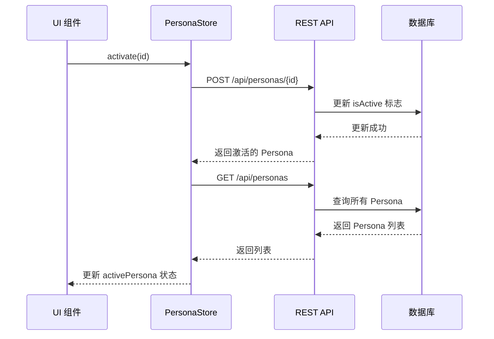
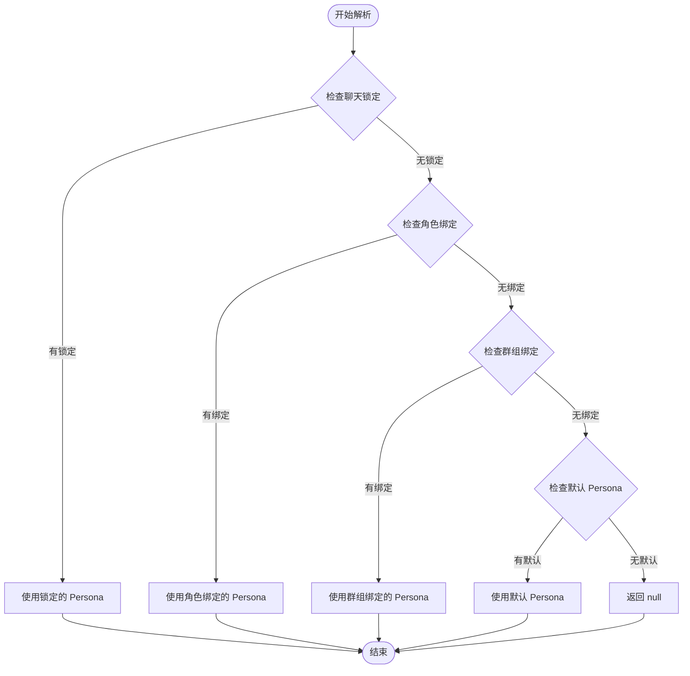
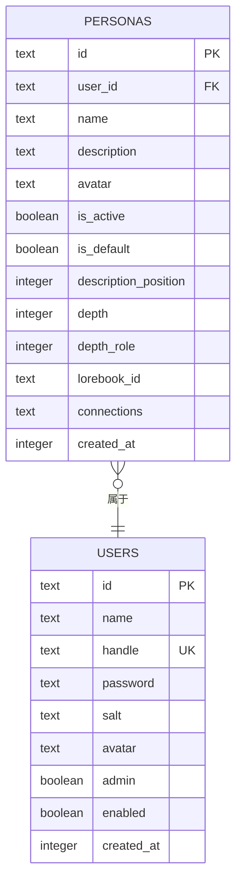
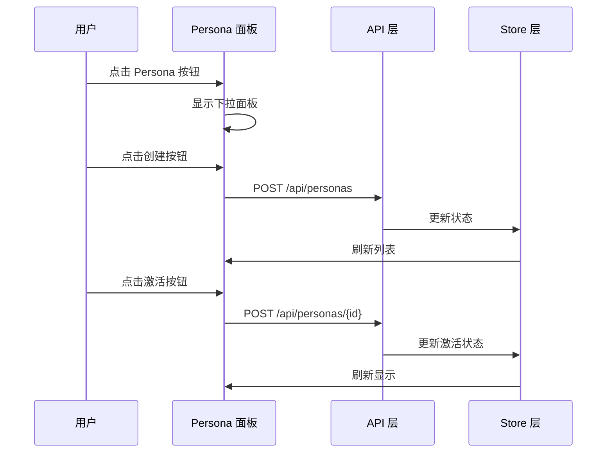

# Persona 状态管理

<cite>
**本文档引用的文件**
- [persona-store.ts](file://src/stores/persona-store.ts)
- [persona-service.ts](file://src/lib/services/persona-service.ts)
- [schema.ts](file://src/lib/db/schema.ts)
- [index.ts](file://src/lib/db/index.ts)
- [route.ts](file://src/app/api/personas/route.ts)
- [route.ts](file://src/app/api/personas/[id]/route.ts)
- [PersonaSelector.tsx](file://src/components/settings/PersonaSelector.tsx)
- [chat-area.tsx](file://src/components/chat/chat-area.tsx)
- [chat-store.ts](file://src/stores/chat-store.ts)
</cite>

## 目录
1. [简介](#简介)
2. [项目结构](#项目结构)
3. [核心组件](#核心组件)
4. [架构概览](#架构概览)
5. [详细组件分析](#详细组件分析)
6. [依赖关系分析](#依赖关系分析)
7. [性能考虑](#性能考虑)
8. [故障排除指南](#故障排除指南)
9. [结论](#结论)

## 简介

Persona 状态管理系统是 SillyTavern Next 中用于管理用户 Persona（角色扮演配置）的核心模块。Persona 是用户在与 AI 模型交互时使用的角色扮演配置，包含角色描述、行为模式、注入策略等个性化设置。

本系统的设计目标是提供：
- **统一的 Persona 状态管理**：通过 Zustand 管理激活的 Persona 状态
- **完整的 CRUD 操作**：支持 Persona 的创建、编辑、删除、复制
- **智能切换机制**：基于聊天上下文自动解析应激活的 Persona
- **持久化存储**：使用 SQLite 数据库存储 Persona 数据
- **实时同步**：前端状态与后端数据保持同步

## 项目结构

Persona 状态管理涉及以下关键文件和目录：

```mermaid
graph TB
subgraph "前端状态层"
PS[persona-store.ts<br/>Zustand Store]
PC[PersonaSelector.tsx<br/>UI 组件]
end
subgraph "服务层"
API1[api/personas/route.ts<br/>GET/POST]
API2[api/personas/[id]/route.ts<br/>PATCH/DELETE/POST]
SVC[persona-service.ts<br/>业务逻辑]
end
subgraph "数据层"
DB[db/schema.ts<br/>数据库模式]
IDX[db/index.ts<br/>数据库初始化]
end
subgraph "应用集成"
CA[chat-area.tsx<br/>聊天界面]
CS[chat-store.ts<br/>聊天状态]
end
PS --> API1
PS --> API2
PC --> API1
PC --> API2
SVC --> DB
SVC --> IDX
CA --> PS
CS --> SVC
```

**图表来源**
- [persona-store.ts:1-59](file://src/stores/persona-store.ts#L1-L59)
- [persona-service.ts:1-272](file://src/lib/services/persona-service.ts#L1-L272)
- [schema.ts:76-98](file://src/lib/db/schema.ts#L76-L98)

**章节来源**
- [persona-store.ts:1-59](file://src/stores/persona-store.ts#L1-L59)
- [schema.ts:76-98](file://src/lib/db/schema.ts#L76-L98)

## 核心组件

### Persona 数据模型

Persona 系统的核心数据结构包括：



**图表来源**
- [persona-store.ts:3-22](file://src/stores/persona-store.ts#L3-L22)
- [persona-service.ts:66-79](file://src/lib/services/persona-service.ts#L66-L79)
- [persona-service.ts:61-64](file://src/lib/services/persona-service.ts#L61-L64)

### API 接口设计

系统提供 RESTful API 接口：

| 方法 | 路径 | 功能 | 请求体 | 响应 |
|------|------|------|--------|------|
| GET | `/api/personas` | 获取所有 Persona | 无 | Persona 数组 |
| POST | `/api/personas` | 创建新 Persona | Persona 创建数据 | 新 Persona |
| PATCH | `/api/personas/:id` | 更新 Persona | Persona 更新数据 | 更新后的 Persona |
| DELETE | `/api/personas/:id` | 删除 Persona | 无 | `{ success: true }` |
| POST | `/api/personas/:id` | 激活 Persona | 无 | 激活的 Persona |
| POST | `/api/personas/none` | 取消激活 | 无 | `{ success: true }` |

**章节来源**
- [route.ts:5-33](file://src/app/api/personas/route.ts#L5-L33)
- [route.ts:7-66](file://src/app/api/personas/[id]/route.ts#L7-L66)

## 架构概览

Persona 状态管理采用分层架构设计：



**图表来源**
- [persona-store.ts:24-58](file://src/stores/persona-store.ts#L24-L58)
- [persona-service.ts:106-271](file://src/lib/services/persona-service.ts#L106-L271)

## 详细组件分析

### 1. Persona Store（状态管理）

Persona Store 使用 Zustand 实现轻量级状态管理：

#### 核心功能
- **状态维护**：管理当前激活的 Persona 和加载状态
- **异步操作**：提供 CRUD 操作的异步方法
- **错误处理**：统一的错误处理和状态恢复

#### 关键方法流程



**图表来源**
- [persona-store.ts:44-52](file://src/stores/persona-store.ts#L44-L52)

**章节来源**
- [persona-store.ts:24-58](file://src/stores/persona-store.ts#L24-L58)

### 2. Persona Service（业务逻辑）

Persona Service 提供完整的业务逻辑处理：

#### 核心功能
- **数据验证**：使用 Zod 验证输入数据
- **数据转换**：在数据库记录和前端模型之间转换
- **复杂查询**：支持按连接关系查找 Persona
- **自动解析**：根据聊天上下文自动选择合适的 Persona

#### 自动解析算法



**图表来源**
- [persona-service.ts:246-270](file://src/lib/services/persona-service.ts#L246-L270)

**章节来源**
- [persona-service.ts:106-271](file://src/lib/services/persona-service.ts#L106-L271)

### 3. 数据库模式

Persona 数据库模式设计支持完整的 Persona 功能：



**图表来源**
- [schema.ts:79-98](file://src/lib/db/schema.ts#L79-L98)

**章节来源**
- [schema.ts:79-98](file://src/lib/db/schema.ts#L79-L98)
- [index.ts:82-106](file://src/lib/db/index.ts#L82-L106)

### 4. UI 组件集成

PersonaSelector 组件提供完整的 Persona 管理界面：

#### 主要功能
- **Persona 列表显示**：展示所有可用的 Persona
- **创建/编辑**：支持创建新 Persona 和编辑现有 Persona
- **激活控制**：提供激活、取消激活、设为默认等功能
- **响应式设计**：适配不同屏幕尺寸

#### 组件交互流程



**图表来源**
- [PersonaSelector.tsx:79-87](file://src/components/settings/PersonaSelector.tsx#L79-L87)
- [PersonaSelector.tsx:89-105](file://src/components/settings/PersonaSelector.tsx#L89-L105)

**章节来源**
- [PersonaSelector.tsx:1-301](file://src/components/settings/PersonaSelector.tsx#L1-L301)

### 5. 聊天系统集成

Persona 状态与聊天系统的深度集成：

#### 集成点
- **聊天区域**：在聊天界面显示当前激活的 Persona
- **自动解析**：根据聊天上下文自动选择 Persona
- **状态同步**：确保聊天状态与 Persona 状态保持一致

**章节来源**
- [chat-area.tsx:73-75](file://src/components/chat/chat-area.tsx#L73-L75)
- [chat-store.ts:105-103](file://src/stores/chat-store.ts#L105-L103)

## 依赖关系分析

### 组件依赖图

```mermaid
graph TB
subgraph "外部依赖"
ZUSTAND[zustand]
DRIZZLE[drizzle-orm]
REACT[react]
NEXT[next/server]
end
subgraph "内部模块"
STORE[persona-store.ts]
SERVICE[persona-service.ts]
SCHEMA[schema.ts]
ROUTE1[api/personas/route.ts]
ROUTE2[api/personas/[id]/route.ts]
UI[PersonaSelector.tsx]
CHAT[chat-area.tsx]
end
ZUSTAND --> STORE
DRIZZLE --> SERVICE
REACT --> UI
NEXT --> ROUTE1
NEXT --> ROUTE2
STORE --> SERVICE
SERVICE --> SCHEMA
UI --> ROUTE1
UI --> ROUTE2
CHAT --> STORE
```

**图表来源**
- [persona-store.ts:1](file://src/stores/persona-store.ts#L1)
- [persona-service.ts:1](file://src/lib/services/persona-service.ts#L1)
- [route.ts:1](file://src/app/api/personas/route.ts#L1)

### 循环依赖检测

经过分析，系统中不存在循环依赖：
- Store 仅依赖外部状态管理库
- Service 仅依赖数据库访问层
- UI 组件只依赖 Store 和 API
- API 层只依赖 Service

**章节来源**
- [persona-store.ts:1-59](file://src/stores/persona-store.ts#L1-L59)
- [persona-service.ts:1-272](file://src/lib/services/persona-service.ts#L1-L272)

## 性能考虑

### 1. 状态缓存策略

- **本地缓存**：Zustand Store 在客户端缓存当前激活的 Persona
- **懒加载**：只有在需要时才从服务器获取完整列表
- **批量更新**：UI 组件通过单一 API 调用批量更新状态

### 2. 数据库优化

- **索引设计**：在 `userId` 和 `isActive` 字段上建立索引
- **查询优化**：使用条件查询减少不必要的数据传输
- **连接池**：Drizzle ORM 提供连接池管理

### 3. 网络优化

- **请求去重**：避免重复的 API 调用
- **错误重试**：在网络异常时提供重试机制
- **超时控制**：设置合理的请求超时时间

## 故障排除指南

### 常见问题及解决方案

#### 1. Persona 无法激活
**症状**：点击激活按钮后状态没有变化
**可能原因**：
- API 请求失败
- 数据库更新失败
- 网络连接问题

**解决方案**：
- 检查浏览器开发者工具的网络面板
- 验证用户认证状态
- 确认数据库连接正常

#### 2. Persona 列表为空
**症状**：Persona 管理面板显示空列表
**可能原因**：
- 用户没有创建任何 Persona
- 数据库查询失败
- 权限问题

**解决方案**：
- 检查用户是否已登录
- 验证数据库连接
- 确认用户权限

#### 3. 自动解析不工作
**症状**：聊天时 Persona 没有按预期切换
**可能原因**：
- 聊天锁定设置冲突
- 角色绑定配置错误
- 默认 Persona 未设置

**解决方案**：
- 检查聊天锁定设置
- 验证角色绑定配置
- 设置默认 Persona

**章节来源**
- [persona-store.ts:28-42](file://src/stores/persona-store.ts#L28-L42)
- [persona-service.ts:246-270](file://src/lib/services/persona-service.ts#L246-L270)

## 结论

Persona 状态管理系统是一个设计良好的状态管理解决方案，具有以下特点：

### 优势
- **清晰的分层架构**：各层职责明确，便于维护和扩展
- **完整的 CRUD 支持**：提供完整的 Persona 生命周期管理
- **智能解析机制**：基于上下文的自动 Persona 选择
- **良好的用户体验**：直观的 UI 和流畅的操作体验
- **可靠的错误处理**：完善的错误处理和恢复机制

### 设计亮点
- **Zustand 状态管理**：轻量级且易于使用的状态管理方案
- **Zod 数据验证**：强大的数据验证和类型安全保证
- **Drizzle ORM 集成**：现代化的数据库访问层
- **RESTful API 设计**：符合标准的 API 接口设计

### 改进建议
- **增加缓存策略**：可以考虑增加更细粒度的缓存机制
- **性能监控**：添加性能指标监控和分析
- **测试覆盖**：增加单元测试和集成测试覆盖率
- **文档完善**：补充更详细的开发文档和 API 文档

该系统为 SillyTavern Next 提供了强大而灵活的 Persona 管理能力，能够满足用户在不同场景下的角色扮演需求。