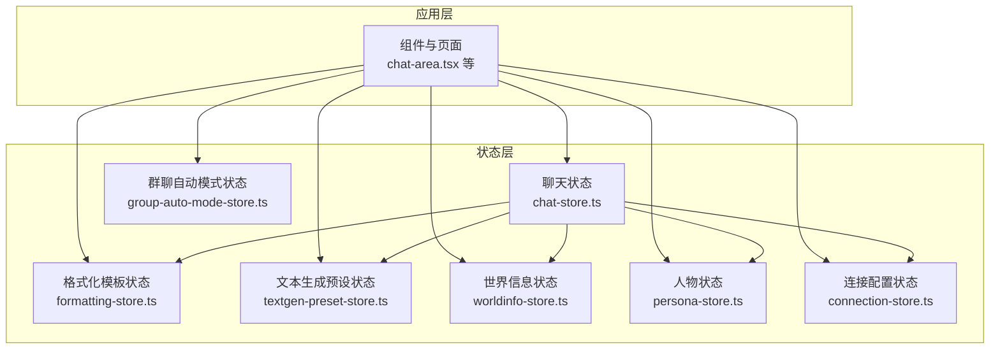
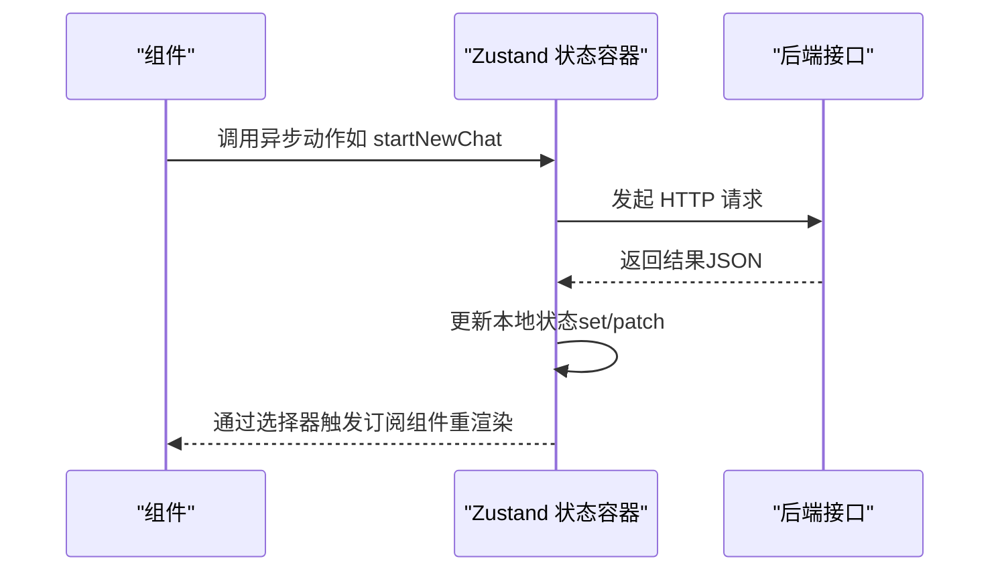
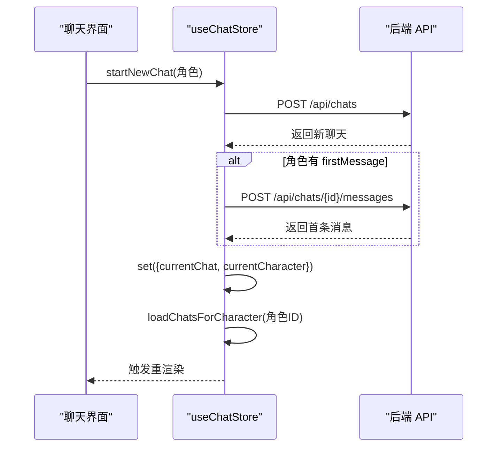
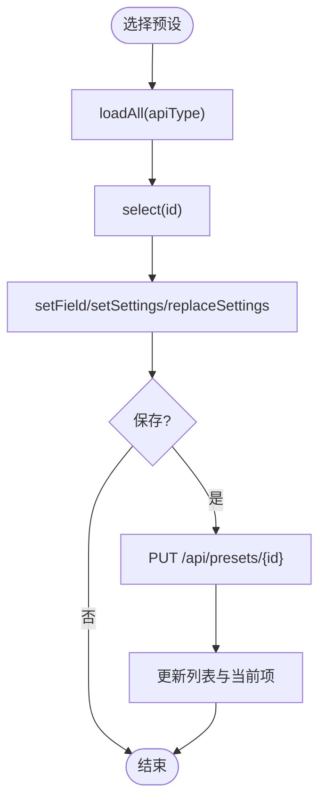
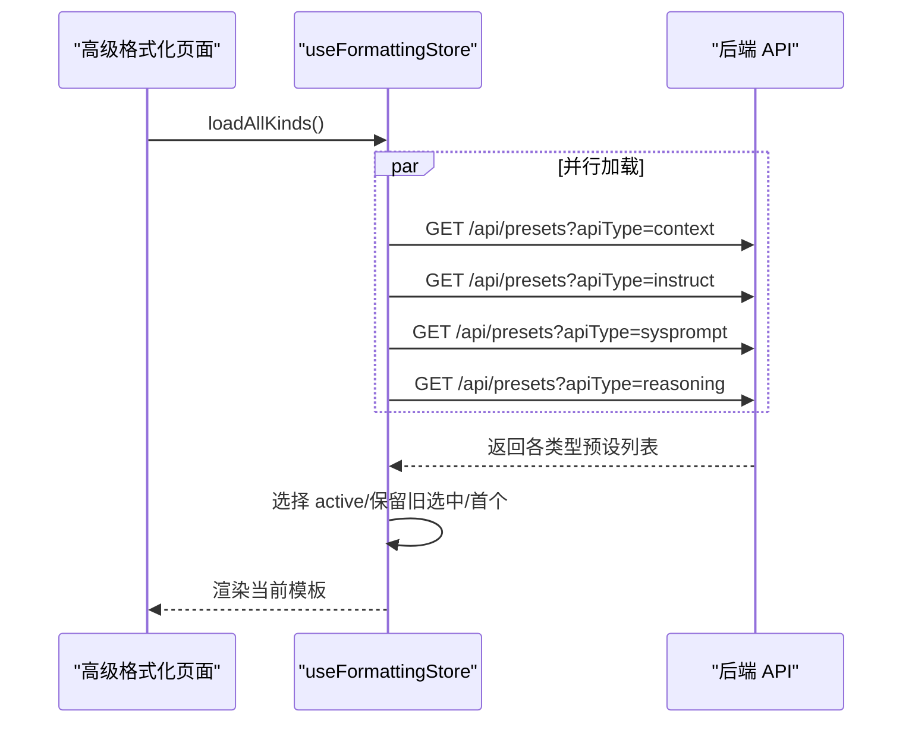
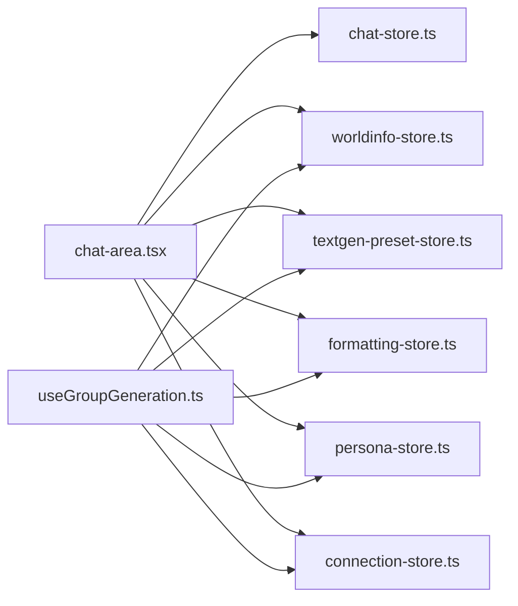

# Zustand 状态管理集成

<cite>
**本文档引用的文件**
- [package.json](file://package.json)
- [chat-store.ts](file://src/stores/chat-store.ts)
- [formatting-store.ts](file://src/stores/formatting-store.ts)
- [textgen-preset-store.ts](file://src/stores/textgen-preset-store.ts)
- [worldinfo-store.ts](file://src/stores/worldinfo-store.ts)
- [persona-store.ts](file://src/stores/persona-store.ts)
- [group-auto-mode-store.ts](file://src/stores/group-auto-mode-store.ts)
- [connection-store.ts](file://src/lib/stores/connection-store.ts)
- [chat-area.tsx](file://src/components/chat/chat-area.tsx)
- [useGroupGeneration.ts](file://src/hooks/useGroupGeneration.ts)
</cite>

## 目录
1. [简介](#简介)
2. [项目结构](#项目结构)
3. [核心组件](#核心组件)
4. [架构总览](#架构总览)
5. [详细组件分析](#详细组件分析)
6. [依赖关系分析](#依赖关系分析)
7. [性能考虑](#性能考虑)
8. [故障排除指南](#故障排除指南)
9. [结论](#结论)
10. [附录](#附录)

## 简介
本文件系统性梳理 SillyTavern Next 中基于 Zustand 的状态管理集成方案，覆盖架构设计、状态容器创建模式、状态选择器模式、异步状态更新流程、状态持久化策略、状态同步机制与性能优化技巧，并提供调试方法与开发工具使用建议。文档面向不同技术背景的读者，既提供高层概览，也给出代码级细节与可视化图示。

## 项目结构
- Zustand 版本：5.0.13
- 状态存储集中于 src/stores 与 src/lib/stores 目录，采用“按功能域划分”的模块化组织方式
- 组件通过状态选择器订阅所需字段，避免不必要的重渲染
- 连接配置与运行时状态分离，支持持久化与跨组件共享

**图表来源**
- [chat-area.tsx:34-112](file://src/components/chat/chat-area.tsx#L34-L112)
- [chat-store.ts:105-582](file://src/stores/chat-store.ts#L105-L582)
- [formatting-store.ts:131-505](file://src/stores/formatting-store.ts#L131-L505)
- [textgen-preset-store.ts:85-370](file://src/stores/textgen-preset-store.ts#L85-L370)
- [worldinfo-store.ts:43-256](file://src/stores/worldinfo-store.ts#L43-L256)
- [persona-store.ts:24-58](file://src/stores/persona-store.ts#L24-L58)
- [group-auto-mode-store.ts:13-17](file://src/stores/group-auto-mode-store.ts#L13-L17)
- [connection-store.ts:32-184](file://src/lib/stores/connection-store.ts#L32-L184)

**章节来源**
- [package.json:45-45](file://package.json#L45-L45)
- [chat-area.tsx:34-112](file://src/components/chat/chat-area.tsx#L34-L112)

## 核心组件
- 聊天状态容器：负责当前聊天、消息列表、生成状态与消息的增删改查、分支与书签、群聊加载等
- 文本生成预设状态容器：维护不同 API 类型下的预设列表、当前编辑设置、脏标记与导入导出
- 高级格式化模板状态容器：按模板类型（上下文、指令、系统提示、推理）管理列表与当前编辑项
- 世界信息状态容器：管理 lorebook 列表、当前编辑 book、词条 CRUD、全局设置与导入导出
- 人物状态容器：管理当前激活的 Persona
- 群聊自动模式状态容器：全局开关控制
- 连接配置状态容器：管理 API 类别、提供者、模型、代理、格式化全局设置与持久化

**章节来源**
- [chat-store.ts:15-103](file://src/stores/chat-store.ts#L15-L103)
- [textgen-preset-store.ts:25-65](file://src/stores/textgen-preset-store.ts#L25-L65)
- [formatting-store.ts:84-117](file://src/stores/formatting-store.ts#L84-L117)
- [worldinfo-store.ts:9-41](file://src/stores/worldinfo-store.ts#L9-L41)
- [persona-store.ts:3-22](file://src/stores/persona-store.ts#L3-L22)
- [group-auto-mode-store.ts:7-11](file://src/stores/group-auto-mode-store.ts#L7-L11)
- [connection-store.ts:5-30](file://src/lib/stores/connection-store.ts#L5-L30)

## 架构总览
Zustand 在本项目中采用“单一 create 调用 + 动作函数”的模式，将状态与副作用解耦，通过状态选择器实现细粒度订阅。异步操作统一通过 fetch 接口与后端交互，成功后同步更新本地状态，失败时记录日志并保持 UI 一致性。

**图表来源**
- [chat-store.ts:168-209](file://src/stores/chat-store.ts#L168-L209)
- [textgen-preset-store.ts:101-137](file://src/stores/textgen-preset-store.ts#L101-L137)
- [formatting-store.ts:138-171](file://src/stores/formatting-store.ts#L138-L171)

## 详细组件分析

### 聊天状态容器（chat-store）
- 设计要点
  - 使用 create<State>((set,get) => actions) 模式，将本地状态与异步动作分离
  - 本地动作（如 addMessage、patchMessage、setIsGenerating）直接 set，确保即时响应
  - 异步动作（如 startNewChat、persistMessage、updateMessage、deleteMessage）先发起请求，再同步本地状态
  - 支持消息的 swipe 切换、推理块初始化、分支与书签、消息移动、隐藏等复杂场景
- 关键流程
  - 新建聊天：POST /api/chats → 若角色有 firstMessage，则 POST /api/chats/{id}/messages 注入首条消息 → 刷新聊天列表
  - 持久化消息：POST /api/chats/{chatId}/messages → 成功后回写本地消息 ID，保证分支/检查点引用一致
  - 更新消息：PATCH /api/chats/{chatId}/messages/{messageId} → 成功后本地 patch 同步
  - 删除消息：DELETE /api/chats/{chatId}/messages/{messageId} → 本地移除
  - 群聊加载/创建：GET /api/chats?groupId → 若无则 POST /api/chats 创建并可选注入首条消息
- 最佳实践
  - 乐观更新：renameChat 先本地更新标题，再异步提交，失败时可回滚
  - 并发更新：moveMessage 并发 PATCH 两条消息的时间戳，减少冲突
  - 错误处理：所有异步动作均包裹 try/catch 并记录错误日志

**图表来源**
- [chat-store.ts:168-209](file://src/stores/chat-store.ts#L168-L209)
- [chat-store.ts:224-233](file://src/stores/chat-store.ts#L224-L233)

**章节来源**
- [chat-store.ts:15-103](file://src/stores/chat-store.ts#L15-L103)
- [chat-store.ts:105-582](file://src/stores/chat-store.ts#L105-L582)

### 文本生成预设状态容器（textgen-preset-store）
- 设计要点
  - 维护 apiType、预设列表、当前编辑 settings、脏标记与错误状态
  - 通过 parseSettings 与 schema 校验，确保 settings 结构安全
  - 提供 setField/setSettings/replaceSettings 等局部更新能力，降低重渲染成本
- 关键流程
  - 切换 API 类型：setApiType → loadAll → 选择 active/保留旧选中/首个
  - 保存/另存为：PUT/POST /api/presets → 更新列表与当前编辑项
  - 激活预设：POST /api/presets/{id}/activate → 同一类型下仅一项激活
  - 导入/导出：/api/presets/import 与 /api/presets/{id}/export
- 最佳实践
  - isDirty 标记用于控制保存按钮状态
  - replaceSettings 前进行 parse，避免无效字段污染

**图表来源**
- [textgen-preset-store.ts:96-137](file://src/stores/textgen-preset-store.ts#L96-L137)
- [textgen-preset-store.ts:139-153](file://src/stores/textgen-preset-store.ts#L139-L153)
- [textgen-preset-store.ts:179-205](file://src/stores/textgen-preset-store.ts#L179-L205)

**章节来源**
- [textgen-preset-store.ts:25-65](file://src/stores/textgen-preset-store.ts#L25-L65)
- [textgen-preset-store.ts:85-370](file://src/stores/textgen-preset-store.ts#L85-L370)

### 高级格式化模板状态容器（formatting-store）
- 设计要点
  - 按模板类型（context/instruct/sysprompt/reasoning）拆分为独立 slice，统一管理列表、当前编辑、脏标记与加载状态
  - 通过 parseByKind 与各类型 schema 校验，确保模板 settings 有效
  - 支持“主文件”导入（自动识别 instruct/context/sysprompt/preset/reasoning/srw 字段）与单段 JSON 导入
  - autoActivateByModel 根据模型名正则匹配自动激活 instruct/context
- 关键流程
  - 加载全部类型：Promise.all 并行加载
  - 选择与编辑：select → setField/setSettings/replaceSettings → save/saveAs
  - 导入：主文件走 /api/presets/import，单段走 /api/presets
- 最佳实践
  - 使用 setSlice/getSlice 抽象 slice 操作，降低重复代码
  - 导入后统一 loadAllKinds，确保 UI 一致

**图表来源**
- [formatting-store.ts:173-177](file://src/stores/formatting-store.ts#L173-L177)
- [formatting-store.ts:138-171](file://src/stores/formatting-store.ts#L138-L171)

**章节来源**
- [formatting-store.ts:84-117](file://src/stores/formatting-store.ts#L84-L117)
- [formatting-store.ts:131-505](file://src/stores/formatting-store.ts#L131-L505)

### 世界信息状态容器（worldinfo-store）
- 设计要点
  - 管理 lorebook 列表、当前编辑 book、词条 CRUD、全局设置（含 globalSelect）
  - 支持导入/导出、重命名、复制、删除、设置更新
- 关键流程
  - 加载列表：GET /api/worldinfo → set({ books })
  - 加载单本：GET /api/worldinfo/{id} → set({ currentBook })
  - 更新设置：GET /api/settings → 合并 worldInfo 字段 → PUT /api/settings
- 最佳实践
  - 所有异步操作均设置 loading/error 状态，提升用户体验
  - 删除 book 后清理 currentBook 并刷新列表

**章节来源**
- [worldinfo-store.ts:9-41](file://src/stores/worldinfo-store.ts#L9-L41)
- [worldinfo-store.ts:43-256](file://src/stores/worldinfo-store.ts#L43-L256)

### 人物状态容器（persona-store）
- 设计要点
  - 管理当前激活的 Persona，支持加载、激活、取消激活
- 关键流程
  - 加载：GET /api/personas → 选择 isActive 的条目
  - 激活：POST /api/personas/{id} → 重新加载列表
  - 取消：POST /api/personas/none → set({ activePersona: null })

**章节来源**
- [persona-store.ts:3-22](file://src/stores/persona-store.ts#L3-L22)
- [persona-store.ts:24-58](file://src/stores/persona-store.ts#L24-L58)

### 群聊自动模式状态容器（group-auto-mode-store）
- 设计要点
  - 简单布尔开关与切换动作，便于全局控制群聊生成行为

**章节来源**
- [group-auto-mode-store.ts:7-11](file://src/stores/group-auto-mode-store.ts#L7-L11)
- [group-auto-mode-store.ts:13-17](file://src/stores/group-auto-mode-store.ts#L13-L17)

### 连接配置状态容器（connection-store）
- 设计要点
  - 管理 API 类别、提供者、模型、代理、格式化全局设置
  - 运行时状态（连接状态、已知模型）与持久化配置分离
  - 提供 getFormatting/setFormatting 读写全局格式化设置并持久化
- 关键流程
  - 保存配置：saveConfig PUT /api/settings
  - 加载配置：loadConfig → 恢复 connectedModels → 初始化 connectionStatus

**章节来源**
- [connection-store.ts:5-30](file://src/lib/stores/connection-store.ts#L5-L30)
- [connection-store.ts:32-184](file://src/lib/stores/connection-store.ts#L32-L184)

## 依赖关系分析
- 组件依赖
  - chat-area.tsx 同时依赖聊天、世界信息、文本生成预设、格式化模板、人物与连接配置状态
  - useGroupGeneration 依赖连接配置、文本生成预设、格式化模板、人物与世界信息设置
- 状态耦合
  - 聊天状态与世界信息、文本生成预设、格式化模板、人物存在强关联，用于构建生成请求
  - 连接配置状态贯穿多个容器，提供全局 formatting 与运行时状态

**图表来源**
- [chat-area.tsx:34-112](file://src/components/chat/chat-area.tsx#L34-L112)
- [useGroupGeneration.ts:67-97](file://src/hooks/useGroupGeneration.ts#L67-L97)

**章节来源**
- [chat-area.tsx:34-112](file://src/components/chat/chat-area.tsx#L34-L112)
- [useGroupGeneration.ts:67-97](file://src/hooks/useGroupGeneration.ts#L67-L97)

## 性能考虑
- 状态选择器与细粒度订阅
  - 组件通过选择器仅订阅所需字段，避免整 store 重渲染
  - 示例：useChatStore(s => s.currentChat)、useFormattingStore(s => s.context.current)
- 乐观更新与回滚
  - renameChat 先本地更新，再异步提交，失败时可回滚
- 并发请求
  - moveMessage 并发 PATCH 两条消息的时间戳，减少等待
  - loadAllKinds 使用 Promise.all 并行加载多类型模板
- 数据校验与默认值
  - parseSettings/parseByKind 与 schema 校验，避免无效数据导致的异常渲染
- 脏标记
  - isDirty 控制保存按钮状态，减少不必要的网络请求

**章节来源**
- [chat-area.tsx:63-76](file://src/components/chat/chat-area.tsx#L63-L76)
- [textgen-preset-store.ts:179-205](file://src/stores/textgen-preset-store.ts#L179-L205)
- [formatting-store.ts:173-177](file://src/stores/formatting-store.ts#L173-L177)
- [chat-store.ts:461-494](file://src/stores/chat-store.ts#L461-L494)

## 故障排除指南
- 异步动作失败
  - 所有异步动作均包裹 try/catch 并打印错误日志，定位失败原因
  - 建议检查网络请求状态码与后端返回体
- 状态不一致
  - 持久化后需同步本地状态（如 persistMessage 回写 ID、updateMessage 同步 patch）
  - 乐观更新失败时，确保本地状态回滚
- 并发冲突
  - moveMessage 使用并发 PATCH，注意捕获异常并忽略不影响整体流程
- 导入/导出问题
  - 主文件导入走 /api/presets/import，单段导入走 /api/presets
  - 导入失败时检查后端返回的错误信息

**章节来源**
- [chat-store.ts:236-272](file://src/stores/chat-store.ts#L236-L272)
- [chat-store.ts:335-351](file://src/stores/chat-store.ts#L335-L351)
- [formatting-store.ts:384-446](file://src/stores/formatting-store.ts#L384-L446)
- [textgen-preset-store.ts:322-350](file://src/stores/textgen-preset-store.ts#L322-L350)

## 结论
本项目采用清晰的 Zustand 状态管理架构：以 create 函数定义状态与动作，通过状态选择器实现细粒度订阅，结合异步动作与乐观更新策略，确保 UI 的即时反馈与状态一致性。通过解析与默认值策略、并发请求与脏标记等手段，兼顾了性能与可靠性。建议在扩展新功能时遵循现有模式，保持状态容器职责单一、动作语义明确、错误处理完备。

## 附录

### Zustand 版本与安装
- 依赖：zustand ^5.0.13
- 建议升级路径：关注官方发布说明，逐步迁移至新版本特性（如中间件组合）

**章节来源**
- [package.json:45-45](file://package.json#L45-L45)

### 状态选择器模式示例路径
- 聊天状态选择器
  - [chat-area.tsx:36-54](file://src/components/chat/chat-area.tsx#L36-L54)
- 文本生成预设选择器
  - [chat-area.tsx:63-65](file://src/components/chat/chat-area.tsx#L63-L65)
- 高级格式化模板选择器
  - [chat-area.tsx:68-71](file://src/components/chat/chat-area.tsx#L68-L71)
- 世界信息设置与书籍
  - [chat-area.tsx:57-60](file://src/components/chat/chat-area.tsx#L57-L60)
- 人物状态
  - [chat-area.tsx:74-76](file://src/components/chat/chat-area.tsx#L74-L76)