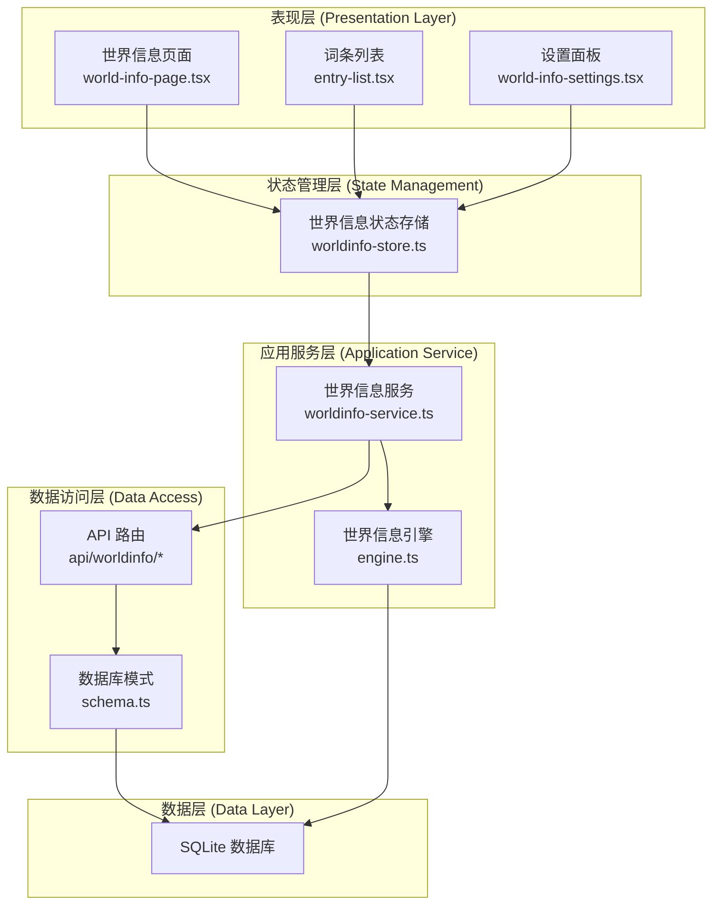
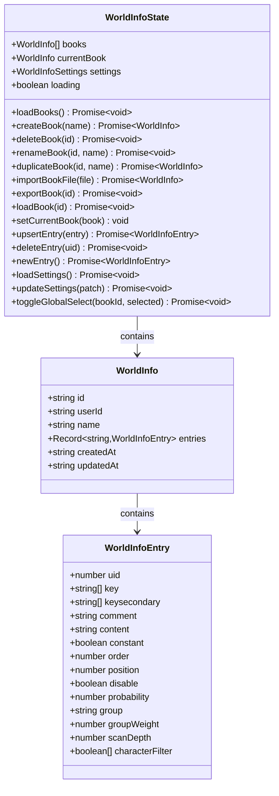
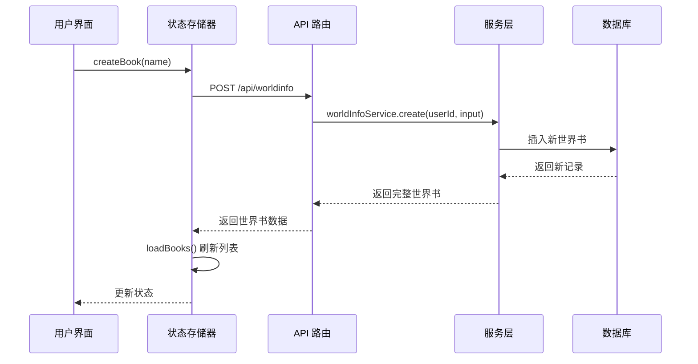
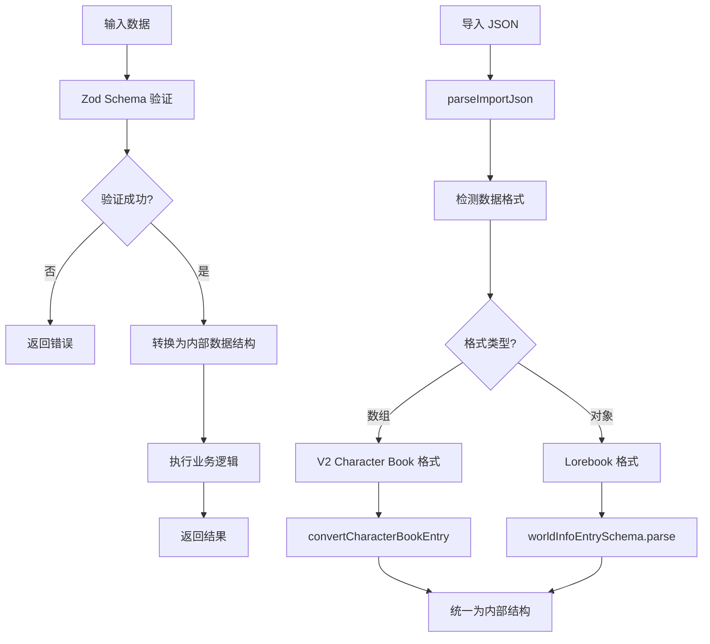
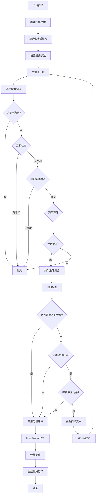
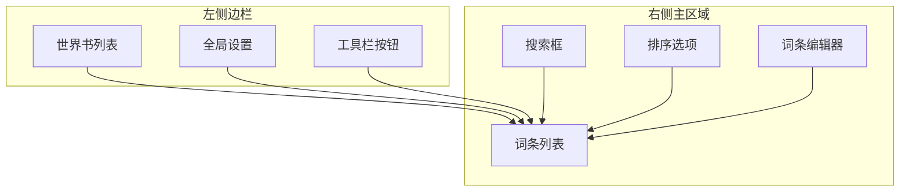

# 世界设定状态管理

<cite>
**本文档引用的文件**
- [src/stores/worldinfo-store.ts](file://src/stores/worldinfo-store.ts)
- [src/lib/services/worldinfo-service.ts](file://src/lib/services/worldinfo-service.ts)
- [src/lib/worldinfo/engine.ts](file://src/lib/worldinfo/engine.ts)
- [src/app/api/worldinfo/route.ts](file://src/app/api/worldinfo/route.ts)
- [src/app/api/worldinfo/[id]/route.ts](file://src/app/api/worldinfo/[id]/route.ts)
- [src/components/world-info/world-info-page.tsx](file://src/components/world-info/world-info-page.tsx)
- [src/components/world-info/entry-list.tsx](file://src/components/world-info/entry-list.tsx)
- [src/components/world-info/world-info-settings.tsx](file://src/components/world-info/world-info-settings.tsx)
- [src/lib/db/schema.ts](file://src/lib/db/schema.ts)
- [src/types/index.ts](file://src/types/index.ts)
</cite>

## 目录
1. [简介](#简介)
2. [项目结构](#项目结构)
3. [核心组件](#核心组件)
4. [架构概览](#架构概览)
5. [详细组件分析](#详细组件分析)
6. [依赖关系分析](#依赖关系分析)
7. [性能考虑](#性能考虑)
8. [故障排除指南](#故障排除指南)
9. [结论](#结论)

## 简介

世界设定状态管理系统是 SillyTavern Next 中的核心功能模块，负责管理用户创建和编辑的"世界书"(Lorebook)及其包含的"词条"(Entry)。该系统实现了完整的 CRUD 操作、深度扫描算法、词条匹配策略和实时更新机制。

系统采用 Zustand 状态管理库实现前端状态管理，结合 Drizzle ORM 数据库操作，通过 RESTful API 与后端服务进行交互。核心功能包括：

- 世界书的创建、删除、重命名、复制和导入导出
- 词条的增删改查和批量操作
- 深度扫描算法的状态维护
- 词条匹配策略和插入优先级管理
- 与聊天系统的集成和实时更新

## 项目结构

世界设定状态管理模块主要分布在以下目录结构中：

```mermaid
graph TB
subgraph "状态管理层"
A[src/stores/worldinfo-store.ts]
B[src/types/index.ts]
end
subgraph "服务层"
C[src/lib/services/worldinfo-service.ts]
D[src/lib/worldinfo/engine.ts]
end
subgraph "API 层"
E[src/app/api/worldinfo/route.ts]
F[src/app/api/worldinfo/[id]/route.ts]
end
subgraph "UI 层"
G[src/components/world-info/world-info-page.tsx]
H[src/components/world-info/entry-list.tsx]
I[src/components/world-info/world-info-settings.tsx]
end
subgraph "数据层"
J[src/lib/db/schema.ts]
end
A --> C
C --> J
C --> D
E --> C
F --> C
G --> A
H --> A
I --> A
```

**图表来源**
- [src/stores/worldinfo-store.ts:1-257](file://src/stores/worldinfo-store.ts#L1-L257)
- [src/lib/services/worldinfo-service.ts:1-428](file://src/lib/services/worldinfo-service.ts#L1-L428)
- [src/lib/worldinfo/engine.ts:1-424](file://src/lib/worldinfo/engine.ts#L1-L424)

**章节来源**
- [src/stores/worldinfo-store.ts:1-257](file://src/stores/worldinfo-store.ts#L1-L257)
- [src/lib/services/worldinfo-service.ts:1-428](file://src/lib/services/worldinfo-service.ts#L1-L428)
- [src/lib/worldinfo/engine.ts:1-424](file://src/lib/worldinfo/engine.ts#L1-L424)

## 核心组件

### 状态存储器 (Zustand Store)

世界设定状态管理的核心是基于 Zustand 的状态存储器，提供以下主要功能：

- **世界书管理**: 获取全部世界书、创建新世界书、删除世界书、重命名、复制
- **当前世界书管理**: 加载特定世界书、设置当前编辑的书籍
- **词条管理**: 新增/更新词条、删除词条、创建新词条
- **全局设置管理**: 加载设置、更新设置、切换全局选择状态

### 服务层 (Service Layer)

服务层封装了业务逻辑，提供以下核心功能：

- **数据验证**: 使用 Zod Schema 验证输入数据
- **数据库操作**: 通过 Drizzle ORM 进行 CRUD 操作
- **数据转换**: 支持不同格式之间的转换（Lorebook vs Character Book）
- **导入导出**: 处理 JSON 文件的导入和导出

### 引擎层 (Engine Layer)

引擎层实现了复杂的深度扫描算法，包括：

- **词条匹配**: 支持多种匹配策略（AND_ANY、NOT_ALL、NOT_ANY、AND_ALL）
- **概率计算**: 基于词条概率的随机触发机制
- **递归扫描**: 支持词条内容再次触发其他词条的能力
- **Token 预算**: 限制上下文使用的 Token 数量
- **分组评分**: 同一分组内的词条评分和选择机制

**章节来源**
- [src/stores/worldinfo-store.ts:9-41](file://src/stores/worldinfo-store.ts#L9-L41)
- [src/lib/services/worldinfo-service.ts:97-300](file://src/lib/services/worldinfo-service.ts#L97-L300)
- [src/lib/worldinfo/engine.ts:174-290](file://src/lib/worldinfo/engine.ts#L174-L290)

## 架构概览

系统采用分层架构设计，确保关注点分离和代码的可维护性：



**图表来源**
- [src/components/world-info/world-info-page.tsx:18-202](file://src/components/world-info/world-info-page.tsx#L18-L202)
- [src/stores/worldinfo-store.ts:43-256](file://src/stores/worldinfo-store.ts#L43-L256)
- [src/lib/services/worldinfo-service.ts:97-300](file://src/lib/services/worldinfo-service.ts#L97-L300)
- [src/lib/worldinfo/engine.ts:174-290](file://src/lib/worldinfo/engine.ts#L174-L290)

## 详细组件分析

### 状态存储器组件分析

#### 状态结构设计

状态存储器定义了完整的状态结构，包括：



**图表来源**
- [src/stores/worldinfo-store.ts:9-41](file://src/stores/worldinfo-store.ts#L9-L41)
- [src/types/index.ts:418-426](file://src/types/index.ts#L418-L426)
- [src/types/index.ts:368-416](file://src/types/index.ts#L368-L416)

#### API 调用流程



**图表来源**
- [src/stores/worldinfo-store.ts:63-78](file://src/stores/worldinfo-store.ts#L63-L78)
- [src/app/api/worldinfo/route.ts:13-22](file://src/app/api/worldinfo/route.ts#L13-L22)
- [src/lib/services/worldinfo-service.ts:126-140](file://src/lib/services/worldinfo-service.ts#L126-L140)

**章节来源**
- [src/stores/worldinfo-store.ts:43-256](file://src/stores/worldinfo-store.ts#L43-L256)
- [src/types/index.ts:418-507](file://src/types/index.ts#L418-L507)

### 服务层组件分析

#### 数据验证和转换

服务层使用 Zod Schema 进行严格的数据验证：



**图表来源**
- [src/lib/services/worldinfo-service.ts:12-70](file://src/lib/services/worldinfo-service.ts#L12-L70)
- [src/lib/services/worldinfo-service.ts:357-387](file://src/lib/services/worldinfo-service.ts#L357-L387)

#### 数据库操作模式

服务层通过 Drizzle ORM 进行数据库操作，支持复杂查询和事务处理：

**章节来源**
- [src/lib/services/worldinfo-service.ts:97-300](file://src/lib/services/worldinfo-service.ts#L97-L300)
- [src/lib/db/schema.ts:173-180](file://src/lib/db/schema.ts#L173-L180)

### 引擎层组件分析

#### 深度扫描算法

引擎层实现了复杂的深度扫描算法，支持多种匹配策略：



**图表来源**
- [src/lib/worldinfo/engine.ts:174-290](file://src/lib/worldinfo/engine.ts#L174-L290)
- [src/lib/worldinfo/engine.ts:292-342](file://src/lib/worldinfo/engine.ts#L292-L342)

#### 匹配策略实现

引擎支持四种主要的匹配逻辑：

| 逻辑类型 | 描述 | 实现方式 |
|---------|------|----------|
| AND_ANY | 主关键词任意命中且副关键词任意命中 | `anyMatch(primaryKeys) && anyMatch(secondaryKeys)` |
| NOT_ALL | 主关键词任意命中且副关键词不全部命中 | `anyMatch(primaryKeys) && !allMatch(secondaryKeys)` |
| NOT_ANY | 主关键词任意命中且副关键词任意不命中 | `anyMatch(primaryKeys) && !anyMatch(secondaryKeys)` |
| AND_ALL | 主关键词任意命中且副关键词全部命中 | `anyMatch(primaryKeys) && allMatch(secondaryKeys)` |

**章节来源**
- [src/lib/worldinfo/engine.ts:90-131](file://src/lib/worldinfo/engine.ts#L90-L131)
- [src/lib/worldinfo/engine.ts:344-423](file://src/lib/worldinfo/engine.ts#L344-L423)

### UI 组件分析

#### 世界信息页面

世界信息页面提供了完整的 CRUD 操作界面：



**图表来源**
- [src/components/world-info/world-info-page.tsx:77-201](file://src/components/world-info/world-info-page.tsx#L77-L201)

#### 词条列表组件

词条列表组件实现了智能搜索和排序功能：

**章节来源**
- [src/components/world-info/world-info-page.tsx:18-38](file://src/components/world-info/world-info-page.tsx#L18-L38)
- [src/components/world-info/entry-list.tsx:11-105](file://src/components/world-info/entry-list.tsx#L11-L105)

## 依赖关系分析

系统各组件之间的依赖关系如下：

```mermaid
graph TB
subgraph "外部依赖"
ZUSTAND[zustand - 状态管理]
DRIZZLE[drizzle-orm - 数据库 ORM]
ZOD[zod - 数据验证]
NEXT[next/server - Web 框架]
end
subgraph "内部模块"
STORE[worldinfo-store.ts]
SERVICE[worldinfo-service.ts]
ENGINE[engine.ts]
TYPES[index.ts]
SCHEMA[schema.ts]
API1[api/worldinfo/route.ts]
API2[api/worldinfo/[id]/route.ts]
UI1[world-info-page.tsx]
UI2[entry-list.tsx]
UI3[world-info-settings.tsx]
end
ZUSTAND --> STORE
DRIZZLE --> SERVICE
ZOD --> SERVICE
NEXT --> API1
NEXT --> API2
STORE --> SERVICE
SERVICE --> ENGINE
SERVICE --> SCHEMA
STORE --> TYPES
SERVICE --> TYPES
ENGINE --> TYPES
UI1 --> STORE
UI2 --> STORE
UI3 --> STORE
STORE --> API1
STORE --> API2
```

**图表来源**
- [src/stores/worldinfo-store.ts:1](file://src/stores/worldinfo-store.ts#L1)
- [src/lib/services/worldinfo-service.ts:1-6](file://src/lib/services/worldinfo-service.ts#L1-L6)
- [src/lib/worldinfo/engine.ts:13-21](file://src/lib/worldinfo/engine.ts#L13-L21)

**章节来源**
- [src/stores/worldinfo-store.ts:1-8](file://src/stores/worldinfo-store.ts#L1-L8)
- [src/lib/services/worldinfo-service.ts:1-6](file://src/lib/services/worldinfo-service.ts#L1-L6)

## 性能考虑

### 状态管理优化

1. **状态分割**: 将大对象拆分为多个独立的状态片段，减少不必要的重渲染
2. **选择器模式**: 使用 Zustand 的 selector 函数只订阅需要的状态变化
3. **批量更新**: 合并多个状态更新操作，避免频繁的重新渲染

### 数据库查询优化

1. **索引设计**: 为常用查询字段建立适当的索引
2. **查询优化**: 使用 LIMIT 和 ORDER BY 优化大数据集的查询性能
3. **连接池**: 合理配置数据库连接池大小

### 引擎性能优化

1. **早期退出**: 在匹配失败时立即停止进一步检查
2. **缓存机制**: 对重复计算的结果进行缓存
3. **内存管理**: 及时释放不再使用的临时数据结构

## 故障排除指南

### 常见问题及解决方案

#### 状态同步问题

**问题**: UI 显示的状态与实际数据库状态不一致

**解决方案**:
1. 确保每次 API 调用后都调用 `loadBooks()` 或 `loadBook()` 方法
2. 检查网络请求的响应状态码
3. 验证客户端和服务器端的时间戳一致性

#### 数据验证错误

**问题**: 导入或保存世界书时出现数据验证错误

**解决方案**:
1. 检查输入数据格式是否符合 Zod Schema 定义
2. 验证 JSON 文件的完整性
3. 确认字段类型和范围的有效性

#### 性能问题

**问题**: 大量词条时页面响应缓慢

**解决方案**:
1. 实施虚拟滚动技术
2. 优化数据库查询索引
3. 添加加载状态指示器

**章节来源**
- [src/stores/worldinfo-store.ts:49-61](file://src/stores/worldinfo-store.ts#L49-L61)
- [src/lib/services/worldinfo-service.ts:126-140](file://src/lib/services/worldinfo-service.ts#L126-L140)

## 结论

世界设定状态管理系统通过清晰的分层架构和完善的组件设计，实现了高效、可靠的世界书管理功能。系统的主要优势包括：

1. **模块化设计**: 各层职责明确，便于维护和扩展
2. **强类型支持**: 使用 TypeScript 和 Zod Schema 确保数据完整性
3. **高性能引擎**: 深度扫描算法经过优化，支持大规模数据处理
4. **用户体验**: 提供直观的 UI 界面和流畅的操作体验

未来可以考虑的改进方向：
- 添加更多的搜索和过滤选项
- 实现离线数据同步机制
- 增强导入导出功能的灵活性
- 优化移动端的用户体验