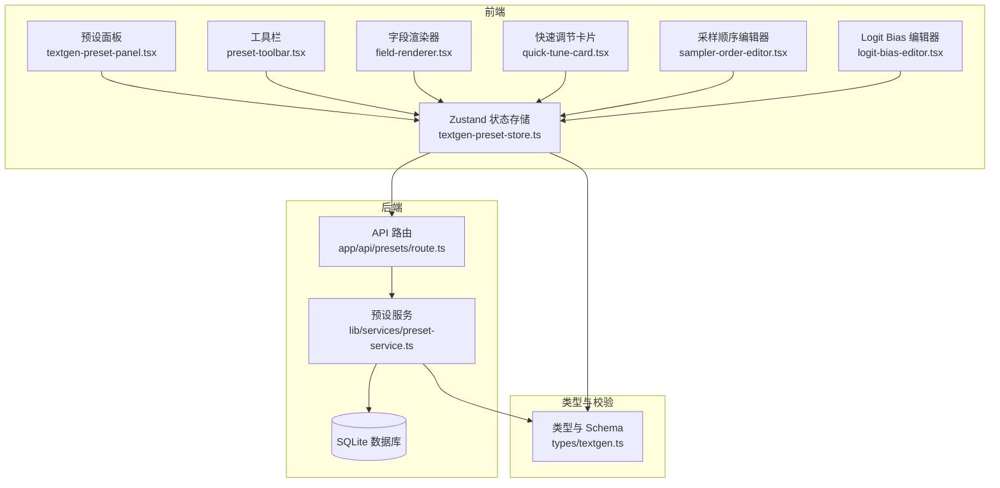
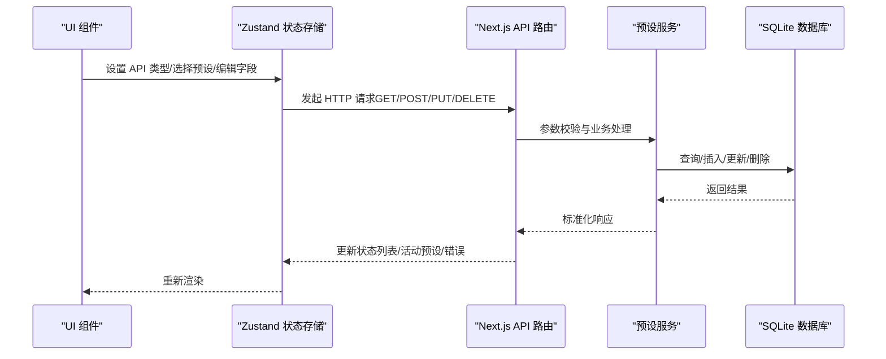
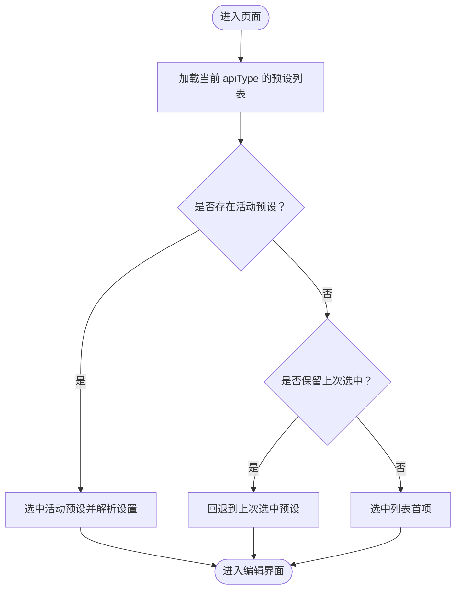
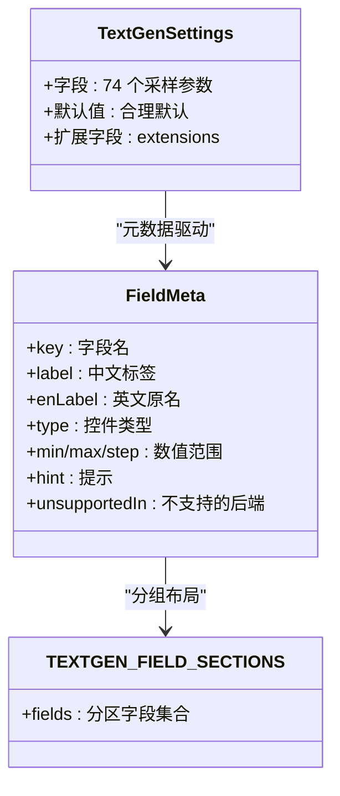
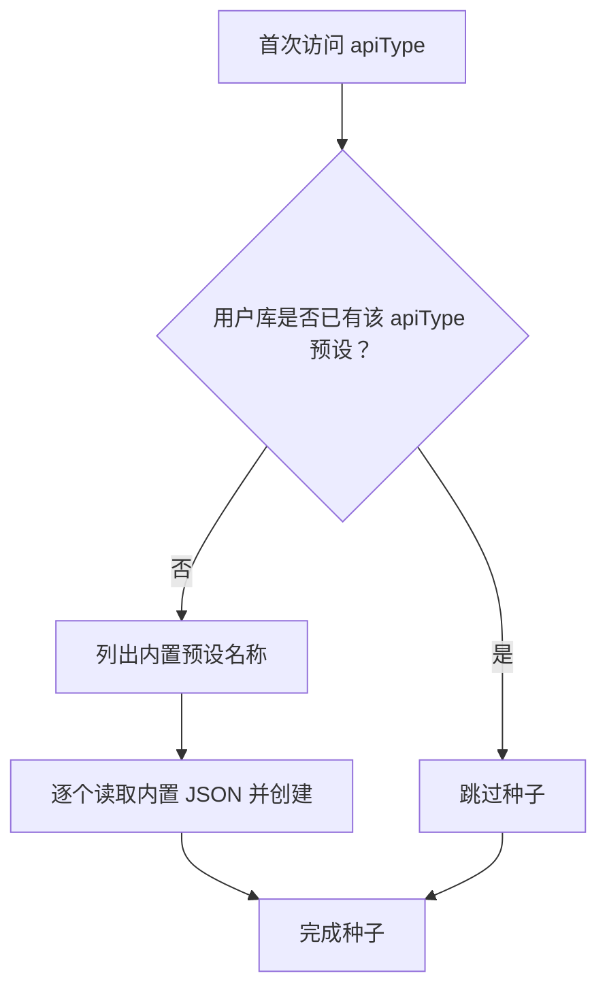
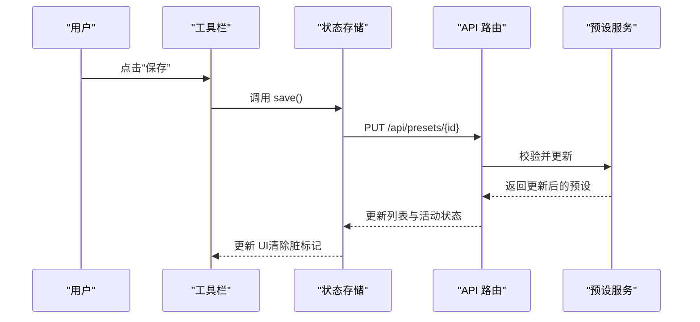
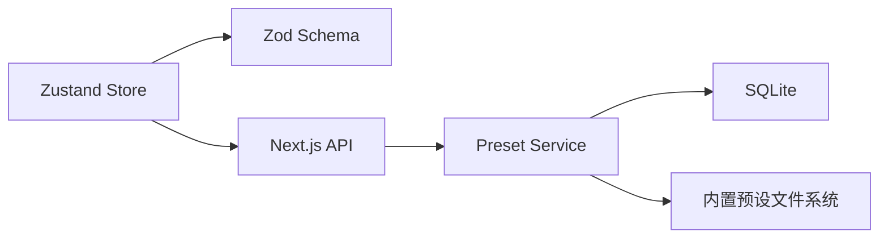

# 文本生成预设状态管理

<cite>
**本文档引用的文件**
- [src/stores/textgen-preset-store.ts](file://src/stores/textgen-preset-store.ts)
- [src/types/textgen.ts](file://src/types/textgen.ts)
- [src/lib/services/preset-service.ts](file://src/lib/services/preset-service.ts)
- [src/app/api/presets/route.ts](file://src/app/api/presets/route.ts)
- [src/lib/db/schema.ts](file://src/lib/db/schema.ts)
- [drizzle/0002_textgen_preset.sql](file://drizzle/0002_textgen_preset.sql)
- [src/app/textgen-presets/page.tsx](file://src/app/textgen-presets/page.tsx)
- [src/components/textgen-preset/textgen-preset-panel.tsx](file://src/components/textgen-preset/textgen-preset-panel.tsx)
- [src/components/textgen-preset/preset-toolbar.tsx](file://src/components/textgen-preset/preset-toolbar.tsx)
- [src/components/textgen-preset/field-renderer.tsx](file://src/components/textgen-preset/field-renderer.tsx)
- [src/components/textgen-preset/quick-tune-card.tsx](file://src/components/textgen-preset/quick-tune-card.tsx)
- [src/components/textgen-preset/sampler-order-editor.tsx](file://src/components/textgen-preset/sampler-order-editor.tsx)
- [src/components/textgen-preset/logit-bias-editor.tsx](file://src/components/textgen-preset/logit-bias-editor.tsx)
</cite>

## 目录
1. [简介](#简介)
2. [项目结构](#项目结构)
3. [核心组件](#核心组件)
4. [架构总览](#架构总览)
5. [详细组件分析](#详细组件分析)
6. [依赖关系分析](#依赖关系分析)
7. [性能考虑](#性能考虑)
8. [故障排除指南](#故障排除指南)
9. [结论](#结论)

## 简介
本文件系统性阐述“文本生成预设状态管理”的架构设计与实现细节，涵盖以下方面：
- 预设状态的前端存储与后端持久化
- AI 生成参数的类型安全与参数验证
- 预设模板的创建、编辑、删除、应用与同步策略
- 预设状态与 AI 生成引擎的交互关系
- 性能优化与用户体验保障

## 项目结构
围绕文本生成预设的核心模块包括：
- 前端状态管理：使用 Zustand 管理当前 API 类型、预设列表、活动预设、编辑中的设置以及脏标记等
- 类型与校验：Zod Schema 定义 74 个采样字段，保证前后端一致的参数结构
- 服务层：后端服务封装数据库操作、内置预设恢复、种子填充与激活策略
- API 层：Next.js 路由处理预设的增删改查、激活、导入导出与内置恢复
- 数据层：SQLite 表结构定义预设表及扩展字段
- UI 层：提供字段编辑、采样顺序、Logit Bias 等专业编辑器

**图表来源**
- [src/stores/textgen-preset-store.ts:85-370](file://src/stores/textgen-preset-store.ts#L85-L370)
- [src/app/textgen-presets/page.tsx:1-10](file://src/app/textgen-presets/page.tsx#L1-L10)
- [src/components/textgen-preset/textgen-preset-panel.tsx:22-144](file://src/components/textgen-preset/textgen-preset-panel.tsx#L22-L144)
- [src/components/textgen-preset/preset-toolbar.tsx:14-289](file://src/components/textgen-preset/preset-toolbar.tsx#L14-L289)
- [src/app/api/presets/route.ts:5-36](file://src/app/api/presets/route.ts#L5-L36)
- [src/lib/services/preset-service.ts:140-322](file://src/lib/services/preset-service.ts#L140-L322)
- [src/lib/db/schema.ts:185-196](file://src/lib/db/schema.ts#L185-L196)
- [src/types/textgen.ts:117-233](file://src/types/textgen.ts#L117-L233)

**章节来源**
- [src/stores/textgen-preset-store.ts:1-376](file://src/stores/textgen-preset-store.ts#L1-L376)
- [src/types/textgen.ts:1-388](file://src/types/textgen.ts#L1-L388)
- [src/lib/services/preset-service.ts:1-323](file://src/lib/services/preset-service.ts#L1-L323)
- [src/app/api/presets/route.ts:1-37](file://src/app/api/presets/route.ts#L1-L37)
- [src/lib/db/schema.ts:185-196](file://src/lib/db/schema.ts#L185-L196)
- [src/app/textgen-presets/page.tsx:1-10](file://src/app/textgen-presets/page.tsx#L1-L10)
- [src/components/textgen-preset/textgen-preset-panel.tsx:1-145](file://src/components/textgen-preset/textgen-preset-panel.tsx#L1-L145)

## 核心组件
- 状态存储（Zustand）
  - 管理当前 API 类型、预设列表、活动预设 ID、当前编辑设置、脏标记、加载/保存状态与错误信息
  - 提供 CRUD、激活、导入导出、内置恢复、重置等方法
- 类型与 Schema（Zod）
  - 定义 74 个采样字段的完整结构，含默认值、数值范围、数组字段、扩展字段与 passthrough
  - 提供字段元数据与分组，支撑 UI 元编程渲染
- 服务层（后端）
  - 封装数据库查询、创建、更新、删除、激活、内置预设种子填充与恢复
  - 支持按 provider/apiType 查询与按 apiType 恢复内置预设
- API 层
  - GET /api/presets：支持按 apiType/provider 列表查询，首次访问自动种子内置预设
  - POST /api/presets：创建新预设
  - 其他路由：按 id 获取、更新、删除、激活、导出、导入、内置恢复
- 数据层
  - presets 表新增 api_type 与 is_active 字段，支持多后端与激活策略
- UI 层
  - 预设面板：顶部工具栏、快速调节卡片、字段编辑、采样顺序与 Logit Bias 专业编辑器
  - 字段渲染器：统一渲染数值、布尔、下拉、文本、JSON 等控件，支持禁用与提示

**章节来源**
- [src/stores/textgen-preset-store.ts:25-65](file://src/stores/textgen-preset-store.ts#L25-L65)
- [src/types/textgen.ts:117-233](file://src/types/textgen.ts#L117-L233)
- [src/lib/services/preset-service.ts:140-322](file://src/lib/services/preset-service.ts#L140-L322)
- [src/app/api/presets/route.ts:5-36](file://src/app/api/presets/route.ts#L5-L36)
- [src/lib/db/schema.ts:185-196](file://src/lib/db/schema.ts#L185-L196)
- [src/components/textgen-preset/textgen-preset-panel.tsx:22-144](file://src/components/textgen-preset/textgen-preset-panel.tsx#L22-L144)

## 架构总览
前端通过 Zustand 管理状态，调用 Next.js API 路由与后端服务交互，后端服务操作 SQLite 数据库完成持久化。类型系统贯穿前端与后端，确保参数结构一致与可扩展。

**图表来源**
- [src/stores/textgen-preset-store.ts:101-137](file://src/stores/textgen-preset-store.ts#L101-L137)
- [src/app/api/presets/route.ts:5-36](file://src/app/api/presets/route.ts#L5-L36)
- [src/lib/services/preset-service.ts:140-322](file://src/lib/services/preset-service.ts#L140-L322)

## 详细组件分析

### 状态存储（Zustand）
- 状态键
  - apiType：当前选择的后端类型，决定预设列表与活动预设归属
  - presets：当前 apiType 下的预设列表摘要
  - activePresetId：当前活动预设 ID
  - currentSettings：当前编辑中的完整设置（74 字段）
  - isDirty：当前设置是否与活动预设存在未保存改动
  - loading/saving/error：异步操作状态与错误信息
- 关键方法
  - setApiType/loadAll/select：列表加载与选中逻辑，支持优先活动、回退旧选中、否则首个
  - setField/setSettings/replaceSettings/resetToActive：字段级更新与重置
  - save/saveAs/rename/remove/setActive：CRUD 与激活
  - restoreDefault/listDefaultNames/importFromJson/exportJson：内置恢复、导入导出与默认名列举
- 参数解析与比较
  - parseSettings：使用 Zod Schema 解析并补全默认值
  - shallowEqualSettings：浅比较两个设置对象是否相等（用于脏标记）

**图表来源**
- [src/stores/textgen-preset-store.ts:101-137](file://src/stores/textgen-preset-store.ts#L101-L137)

**章节来源**
- [src/stores/textgen-preset-store.ts:25-65](file://src/stores/textgen-preset-store.ts#L25-L65)
- [src/stores/textgen-preset-store.ts:67-83](file://src/stores/textgen-preset-store.ts#L67-L83)
- [src/stores/textgen-preset-store.ts:85-370](file://src/stores/textgen-preset-store.ts#L85-L370)

### 类型与参数验证（Zod Schema）
- 结构特征
  - 74 个采样字段：基础采样、重复惩罚、动态温度、DRY、Mirostat、CFG、XTC/N-Sigma/Adaptive、束搜索、Epsilon/Eta 截断、语法约束、Token 禁用、生成控制等
  - 默认值与范围：每个字段提供合理默认值与数值范围
  - 扩展字段：extensions 与 passthrough，确保与原项目 JSON 双向兼容
- 字段元数据与分组
  - TEXTGEN_FIELD_META：字段中文标签、英文原名、控件类型、范围、提示与不支持后端
  - TEXTGEN_FIELD_SECTIONS：13 分区布局，对应 UI 折叠区块
- 支持的后端类型
  - TEXTGEN_TYPES：覆盖主流后端类型，便于 UI 选择与功能灰显

**图表来源**
- [src/types/textgen.ts:117-233](file://src/types/textgen.ts#L117-L233)
- [src/types/textgen.ts:241-387](file://src/types/textgen.ts#L241-L387)

**章节来源**
- [src/types/textgen.ts:1-388](file://src/types/textgen.ts#L1-L388)

### 服务层（后端预设服务）
- 数据库操作
  - getAll/getByProvider/getByApiType/getActive/getById：按用户、提供方、API 类型与活动状态查询
  - create/update/delete：标准 CRUD，支持设置 JSON 序列化
  - setActive：同一 API 类型下仅允许一个活动预设，其余取消
- 内置预设
  - readDefaultPreset/listDefaultNames：按 apiType 解析内置 JSON
  - seedDefaultPresets：首次访问按 apiType 种子化内置预设（已存在则跳过）
  - restoreDefault：按名称恢复内置预设，存在则覆盖设置，否则新建并标记为默认
- 兼容性
  - 旧版 chat-completion schema 保留，避免导入丢失字段

**图表来源**
- [src/lib/services/preset-service.ts:289-316](file://src/lib/services/preset-service.ts#L289-L316)

**章节来源**
- [src/lib/services/preset-service.ts:140-322](file://src/lib/services/preset-service.ts#L140-L322)

### API 层（Next.js 路由）
- GET /api/presets
  - 支持按 apiType/provider 查询，首次访问自动种子内置预设
- POST /api/presets
  - 创建新预设，入参使用通用 record，不剥离字段，确保双向兼容
- 其他路由
  - 按 id 的 GET/PUT/DELETE/激活/导出/导入/内置恢复

**章节来源**
- [src/app/api/presets/route.ts:5-36](file://src/app/api/presets/route.ts#L5-L36)

### 数据层（SQLite）
- presets 表
  - 新增 api_type 与 is_active 字段，支持多后端与激活策略
  - settings 字段为 JSON，存储 TextGenSettings 或其他预设结构
- 迁移脚本
  - 0002_textgen_preset.sql：为 presets 表增加 api_type 与 is_active 列

**章节来源**
- [src/lib/db/schema.ts:185-196](file://src/lib/db/schema.ts#L185-L196)
- [drizzle/0002_textgen_preset.sql:1-5](file://drizzle/0002_textgen_preset.sql#L1-L5)

### UI 组件与交互
- 预设面板
  - 顶部工具栏：API 类型切换、预设选择与搜索、主操作按钮（保存/另存为/重命名/设为激活/重置改动）
  - 快速调节卡片：高频字段（温度、TopP、TopK、MinP、重复惩罚、惩罚范围）快速调整
  - 字段编辑：按 13 分区渲染，元数据驱动，支持禁用与提示
  - 专业编辑器：采样顺序与 Logit Bias 编辑器，支持拖拽与批量操作
- 未保存改动拦截
  - 页面卸载/刷新/前进后退时提示未保存改动

**图表来源**
- [src/components/textgen-preset/preset-toolbar.tsx:154-196](file://src/components/textgen-preset/preset-toolbar.tsx#L154-L196)
- [src/stores/textgen-preset-store.ts:179-205](file://src/stores/textgen-preset-store.ts#L179-L205)
- [src/app/api/presets/route.ts:27-36](file://src/app/api/presets/route.ts#L27-L36)
- [src/lib/services/preset-service.ts:205-223](file://src/lib/services/preset-service.ts#L205-L223)

**章节来源**
- [src/components/textgen-preset/textgen-preset-panel.tsx:22-144](file://src/components/textgen-preset/textgen-preset-panel.tsx#L22-L144)
- [src/components/textgen-preset/preset-toolbar.tsx:14-289](file://src/components/textgen-preset/preset-toolbar.tsx#L14-L289)
- [src/components/textgen-preset/quick-tune-card.tsx:17-60](file://src/components/textgen-preset/quick-tune-card.tsx#L17-L60)
- [src/components/textgen-preset/field-renderer.tsx:13-184](file://src/components/textgen-preset/field-renderer.tsx#L13-L184)
- [src/components/textgen-preset/sampler-order-editor.tsx:117-263](file://src/components/textgen-preset/sampler-order-editor.tsx#L117-L263)
- [src/components/textgen-preset/logit-bias-editor.tsx:17-110](file://src/components/textgen-preset/logit-bias-editor.tsx#L17-L110)

## 依赖关系分析
- 前端依赖
  - Zustand 管理状态，依赖 Zod Schema 进行参数解析与校验
  - UI 组件依赖字段元数据与分组进行元编程渲染
- 后端依赖
  - Drizzle ORM 访问 SQLite，依赖 presets 表结构与迁移脚本
  - 预设服务依赖内置预设目录与文件系统
- 外部集成
  - Next.js API 路由提供 REST 接口，配合认证中间件

**图表来源**
- [src/stores/textgen-preset-store.ts:1-8](file://src/stores/textgen-preset-store.ts#L1-L8)
- [src/types/textgen.ts:117-233](file://src/types/textgen.ts#L117-L233)
- [src/app/api/presets/route.ts:1-3](file://src/app/api/presets/route.ts#L1-L3)
- [src/lib/services/preset-service.ts:1-10](file://src/lib/services/preset-service.ts#L1-L10)
- [src/lib/db/schema.ts:185-196](file://src/lib/db/schema.ts#L185-L196)

**章节来源**
- [src/stores/textgen-preset-store.ts:1-8](file://src/stores/textgen-preset-store.ts#L1-L8)
- [src/types/textgen.ts:117-233](file://src/types/textgen.ts#L117-L233)
- [src/lib/services/preset-service.ts:1-10](file://src/lib/services/preset-service.ts#L1-L10)
- [src/lib/db/schema.ts:185-196](file://src/lib/db/schema.ts#L185-L196)

## 性能考虑
- 状态更新粒度
  - 字段级 setField 与局部 setSettings，避免全量替换导致的过度重渲染
- 脏标记与拦截
  - isDirty 与 beforeunload 拦截，减少误操作带来的数据丢失风险
- 列表加载策略
  - 首次访问按 apiType 自动种子内置预设，后续列表查询走缓存与本地状态
- 参数解析成本
  - parseSettings 使用 Zod Schema，建议在批量更新时合并多次变更，减少重复解析
- UI 渲染优化
  - 字段渲染器按需渲染，支持禁用态与提示，降低无效交互
- 数据库写入
  - 批量导入/种子填充时逐条写入，建议在后端引入事务或批量写入以提升吞吐

[本节为通用性能指导，无需具体文件分析]

## 故障排除指南
- 加载失败
  - 现象：列表加载中或显示错误
  - 排查：检查 API 返回状态、网络连接与认证状态
  - 参考路径：[src/stores/textgen-preset-store.ts:101-137](file://src/stores/textgen-preset-store.ts#L101-L137)、[src/app/api/presets/route.ts:5-25](file://src/app/api/presets/route.ts#L5-L25)
- 保存失败
  - 现象：保存按钮禁用或报错
  - 排查：确认 activePresetId、isDirty 与后端返回错误详情
  - 参考路径：[src/stores/textgen-preset-store.ts:179-205](file://src/stores/textgen-preset-store.ts#L179-L205)、[src/app/api/presets/route.ts:27-36](file://src/app/api/presets/route.ts#L27-L36)
- 激活冲突
  - 现象：同一 API 类型下多个活动预设
  - 排查：后端 setActive 仅允许一个活动预设，检查数据库 is_active 字段
  - 参考路径：[src/lib/services/preset-service.ts:233-250](file://src/lib/services/preset-service.ts#L233-L250)、[drizzle/0002_textgen_preset.sql:3-4](file://drizzle/0002_textgen_preset.sql#L3-L4)
- 内置恢复异常
  - 现象：恢复内置预设失败或未覆盖
  - 排查：确认内置 JSON 文件存在、apiType 映射正确与同名预设逻辑
  - 参考路径：[src/lib/services/preset-service.ts:257-287](file://src/lib/services/preset-service.ts#L257-L287)
- 导入导出问题
  - 现象：导入 JSON 解析错误或导出文件名异常
  - 排查：检查文件内容格式、Content-Disposition 与下载逻辑
  - 参考路径：[src/stores/textgen-preset-store.ts:322-369](file://src/stores/textgen-preset-store.ts#L322-L369)、[src/components/textgen-preset/preset-toolbar.tsx:48-61](file://src/components/textgen-preset/preset-toolbar.tsx#L48-L61)

**章节来源**
- [src/stores/textgen-preset-store.ts:101-137](file://src/stores/textgen-preset-store.ts#L101-L137)
- [src/app/api/presets/route.ts:5-36](file://src/app/api/presets/route.ts#L5-L36)
- [src/lib/services/preset-service.ts:233-287](file://src/lib/services/preset-service.ts#L233-L287)
- [drizzle/0002_textgen_preset.sql:3-4](file://drizzle/0002_textgen_preset.sql#L3-L4)
- [src/components/textgen-preset/preset-toolbar.tsx:48-61](file://src/components/textgen-preset/preset-toolbar.tsx#L48-L61)

## 结论
本系统通过类型安全的 Schema、完善的前端状态管理与后端服务封装，实现了跨后端的文本生成预设管理。其关键优势包括：
- 参数结构与 UI 元数据解耦，支持快速扩展与维护
- 内置预设种子与恢复机制，降低用户初始配置成本
- 激活策略与多后端支持，满足多样化部署场景
- 专业编辑器与高频字段快捷入口，提升编辑效率
- 脏标记与拦截机制，保障数据一致性与用户体验