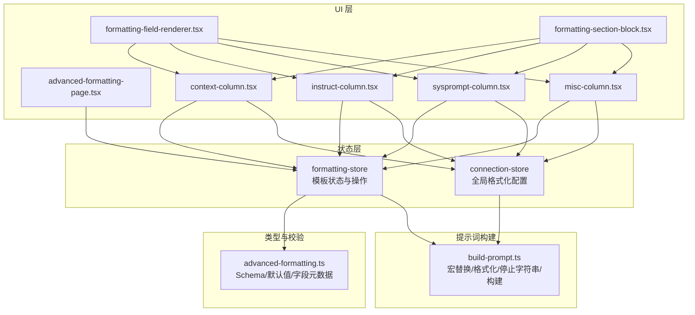
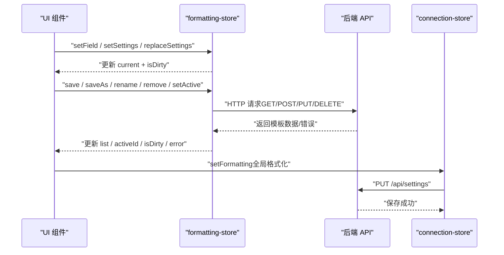
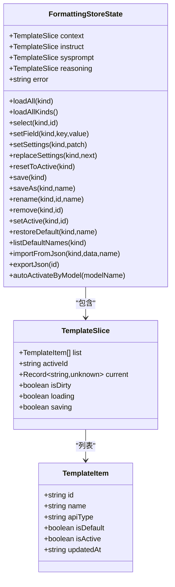
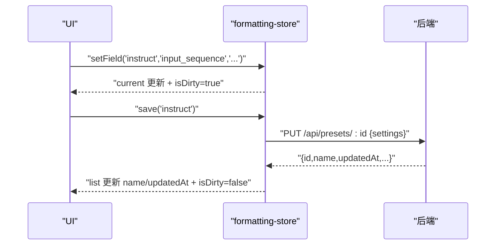
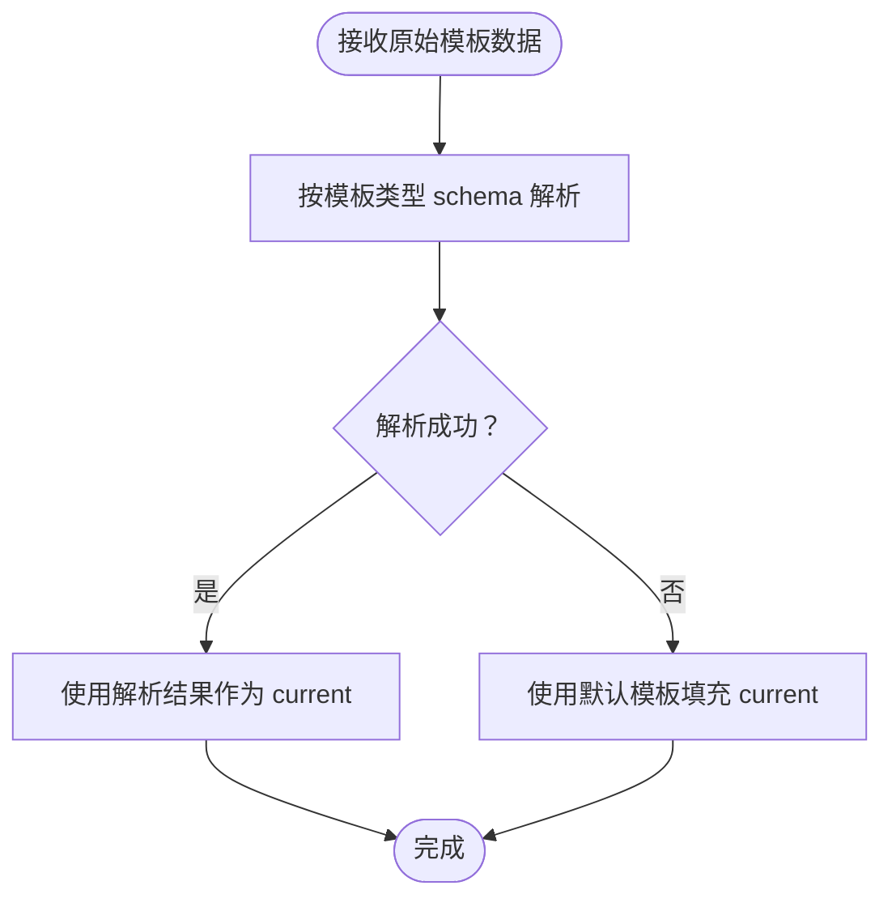
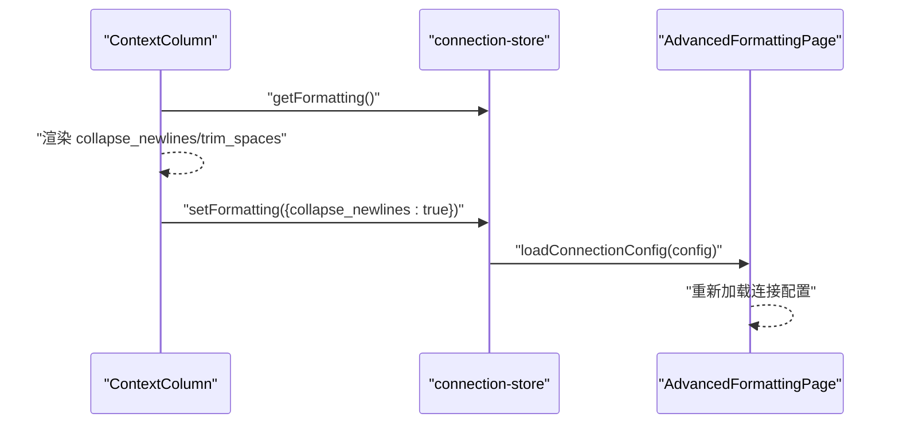
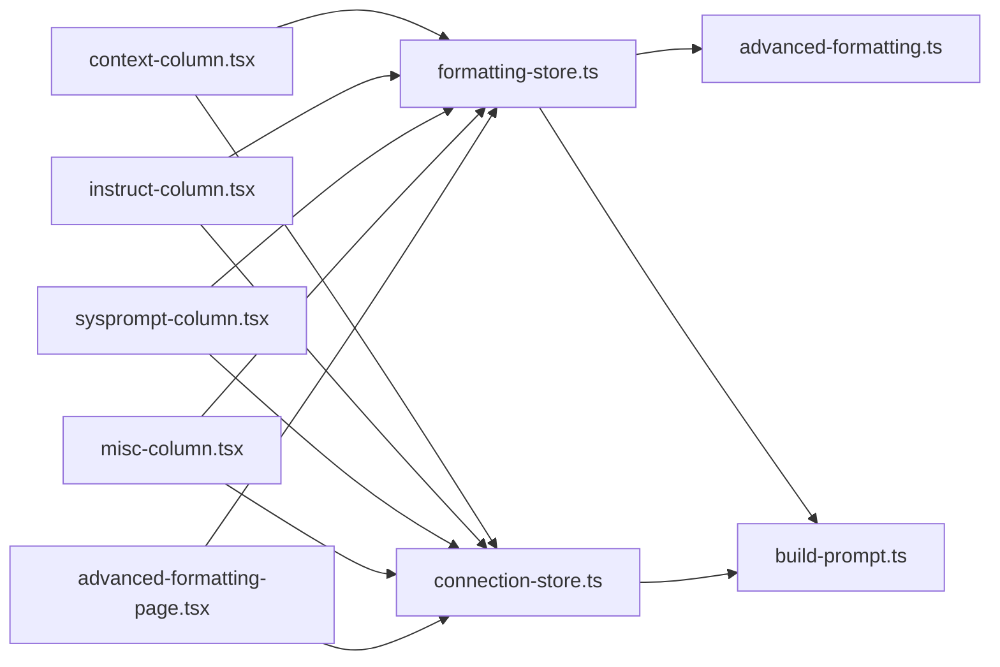

# 格式化状态管理

<cite>
**本文档引用的文件**
- [src/stores/formatting-store.ts](file://src/stores/formatting-store.ts)
- [src/types/advanced-formatting.ts](file://src/types/advanced-formatting.ts)
- [src/lib/formatting/build-prompt.ts](file://src/lib/formatting/build-prompt.ts)
- [src/components/advanced-formatting/advanced-formatting-page.tsx](file://src/components/advanced-formatting/advanced-formatting-page.tsx)
- [src/components/advanced-formatting/context-column.tsx](file://src/components/advanced-formatting/context-column.tsx)
- [src/components/advanced-formatting/instruct-column.tsx](file://src/components/advanced-formatting/instruct-column.tsx)
- [src/components/advanced-formatting/sysprompt-column.tsx](file://src/components/advanced-formatting/sysprompt-column.tsx)
- [src/components/advanced-formatting/misc-column.tsx](file://src/components/advanced-formatting/misc-column.tsx)
- [src/components/advanced-formatting/formatting-field-renderer.tsx](file://src/components/advanced-formatting/formatting-field-renderer.tsx)
- [src/components/advanced-formatting/formatting-section-block.tsx](file://src/components/advanced-formatting/formatting-section-block.tsx)
- [src/lib/stores/connection-store.ts](file://src/lib/stores/connection-store.ts)
</cite>

## 目录
1. [简介](#简介)
2. [项目结构](#项目结构)
3. [核心组件](#核心组件)
4. [架构总览](#架构总览)
5. [详细组件分析](#详细组件分析)
6. [依赖关系分析](#依赖关系分析)
7. [性能考虑](#性能考虑)
8. [故障排除指南](#故障排除指南)
9. [结论](#结论)

## 简介
本文件系统性阐述“格式化状态管理”的设计与实现，围绕 formatting-store 的设计理念、提示词格式化的状态管理机制、模板系统的状态维护、格式化规则的存储与持久化、模板的动态更新与用户自定义选项的持久化、格式化状态的同步机制以及性能优化策略展开。目标是帮助开发者与使用者理解如何通过前端状态与后端 API 协作，实现跨模板类型的统一格式化体验，并确保用户自定义配置在不同会话间保持一致。

## 项目结构
与“格式化状态管理”直接相关的模块分布如下：
- 状态层：formatting-store（Zustand store），负责模板列表、当前模板、脏状态、加载/保存状态以及 CRUD、导入导出、自动激活等动作。
- 类型与校验：advanced-formatting.ts（Zod schema + 字段元数据），定义各模板的结构、默认值与 UI 元信息。
- 提示词构建：build-prompt.ts（宏替换、全局格式化、停止字符串收集、Instruct/简单模式构建），将模板与全局配置组合为最终提示词。
- UI 层：advanced-formatting 页面与四个列组件（上下文、Instruct、系统提示词、杂项），负责展示与编辑。
- 连接状态：connection-store（Zustand store），负责用户连接配置与全局格式化设置的持久化与联动。

图表来源
- [src/stores/formatting-store.ts:131-506](file://src/stores/formatting-store.ts#L131-L506)
- [src/types/advanced-formatting.ts:1-279](file://src/types/advanced-formatting.ts#L1-L279)
- [src/lib/formatting/build-prompt.ts:1-379](file://src/lib/formatting/build-prompt.ts#L1-L379)
- [src/components/advanced-formatting/advanced-formatting-page.tsx:1-138](file://src/components/advanced-formatting/advanced-formatting-page.tsx#L1-L138)
- [src/components/advanced-formatting/context-column.tsx:1-90](file://src/components/advanced-formatting/context-column.tsx#L1-L90)
- [src/components/advanced-formatting/instruct-column.tsx:1-74](file://src/components/advanced-formatting/instruct-column.tsx#L1-L74)
- [src/components/advanced-formatting/sysprompt-column.tsx:1-54](file://src/components/advanced-formatting/sysprompt-column.tsx#L1-L54)
- [src/components/advanced-formatting/misc-column.tsx:1-64](file://src/components/advanced-formatting/misc-column.tsx#L1-L64)
- [src/components/advanced-formatting/formatting-field-renderer.tsx:1-149](file://src/components/advanced-formatting/formatting-field-renderer.tsx#L1-L149)
- [src/components/advanced-formatting/formatting-section-block.tsx:1-72](file://src/components/advanced-formatting/formatting-section-block.tsx#L1-L72)
- [src/lib/stores/connection-store.ts:1-186](file://src/lib/stores/connection-store.ts#L1-L186)

章节来源
- [src/stores/formatting-store.ts:1-506](file://src/stores/formatting-store.ts#L1-L506)
- [src/types/advanced-formatting.ts:1-279](file://src/types/advanced-formatting.ts#L1-L279)
- [src/lib/formatting/build-prompt.ts:1-379](file://src/lib/formatting/build-prompt.ts#L1-L379)
- [src/components/advanced-formatting/advanced-formatting-page.tsx:1-138](file://src/components/advanced-formatting/advanced-formatting-page.tsx#L1-L138)

## 核心组件
- formatting-store：统一管理四种模板类型（上下文、Instruct、系统提示词、推理）的状态，提供加载、选择、编辑、保存、导入导出、自动激活等能力。
- advanced-formatting.ts：定义每种模板的 Zod schema、默认值、字段元数据与 UI 分区，确保前后端一致的结构与校验。
- build-prompt.ts：将模板与全局格式化配置结合，执行宏替换、全局格式化、停止字符串收集与提示词构建。
- UI 组件：四个列组件分别承载模板编辑与全局格式化设置，配合通用字段渲染器与分区块组件实现元数据驱动的 UI。
- connection-store：管理用户连接配置与全局格式化设置，负责持久化与联动更新。

章节来源
- [src/stores/formatting-store.ts:84-117](file://src/stores/formatting-store.ts#L84-L117)
- [src/types/advanced-formatting.ts:33-146](file://src/types/advanced-formatting.ts#L33-L146)
- [src/lib/formatting/build-prompt.ts:12-159](file://src/lib/formatting/build-prompt.ts#L12-L159)
- [src/lib/stores/connection-store.ts:5-30](file://src/lib/stores/connection-store.ts#L5-L30)

## 架构总览
formatting-store 作为状态中枢，通过 API 与后端交互，维护每种模板类型的列表、当前模板、激活状态与脏状态。UI 通过字段渲染器与分区块组件驱动状态变更，connection-store 负责全局格式化设置的持久化与联动。构建阶段，build-prompt.ts 将模板与全局配置组合为最终提示词。

图表来源
- [src/stores/formatting-store.ts:138-351](file://src/stores/formatting-store.ts#L138-L351)
- [src/lib/stores/connection-store.ts:173-184](file://src/lib/stores/connection-store.ts#L173-L184)

## 详细组件分析

### formatting-store 设计理念与状态模型
- 设计理念
  - 以“模板切片（TemplateSlice）”为核心抽象，每种模板类型拥有独立的 list、activeId、current、isDirty、loading、saving 状态，降低耦合。
  - 使用 Zod schema 对原始数据进行解析与默认值填充，保证数据一致性与健壮性。
  - 通过公共方法族（loadAll、select、setField、setSettings、save、importFromJson、autoActivateByModel 等）统一操作入口，便于 UI 与业务流程编排。
- 状态模型
  - TemplateItem：模板元信息（id、name、apiType、isDefault、isActive、updatedAt）。
  - TemplateSlice：模板集合与当前编辑态的组合，支持批量更新与局部替换。
  - FormattingStoreState：聚合四种模板切片与全局错误状态，暴露统一的操作接口。

图表来源
- [src/stores/formatting-store.ts:19-117](file://src/stores/formatting-store.ts#L19-L117)

章节来源
- [src/stores/formatting-store.ts:19-117](file://src/stores/formatting-store.ts#L19-L117)

### 提示词格式化的状态管理机制
- 字段编辑与脏状态
  - setField：逐字段更新 current 并标记 isDirty。
  - setSettings/replaceSettings：批量更新 current 并标记 isDirty；replaceSettings 会先按 schema 解析，确保类型安全。
- 模板选择与重置
  - select：根据 id 拉取单个模板并解析为当前编辑态。
  - resetToActive：若存在 activeId，则重新 select；否则回退到默认模板。
- 列表与激活
  - loadAll：拉取某类模板列表，解析并选择 active 或保留之前的 activeId；同时维护 loading 与 error。
  - setActive：调用后端激活接口，更新列表中 isActive 标记。
- 保存与持久化
  - save：仅当 activeId 存在时保存，PUT 更新当前模板；保存成功后更新列表中的 name 与 updatedAt。
  - saveAs：POST 创建新模板，随后重新加载并选择新模板。
  - rename/remove：更新/删除模板，必要时重置 activeId 并回退到默认模板。
- 导入导出与主包
  - importFromJson：支持“主包”（包含多段模板）与“单段”两种模式，主包由后端自动识别并分段写入，随后全量重载。
  - exportJson：触发后端导出并下载文件。
- 自动激活
  - autoActivateByModel：根据模型名匹配模板的 activation_regex，自动激活对应的 instruct/context 模板。

图表来源
- [src/stores/formatting-store.ts:197-258](file://src/stores/formatting-store.ts#L197-L258)

章节来源
- [src/stores/formatting-store.ts:138-351](file://src/stores/formatting-store.ts#L138-L351)

### 模板系统的状态维护与 Schema 校验
- 模板类型与默认值
  - 每种模板类型（context/instruct/sysprompt/reasoning）均定义了 Zod schema 与默认值，确保未配置时也能得到合理初始值。
- 解析与回退
  - parseByKind：尝试按 schema 解析原始数据，失败时回退到默认模板，避免 UI 异常。
- 字段元数据与 UI 分区
  - 每种模板提供 FieldMeta 与 FieldSection，驱动 UI 的通用渲染器与分区块，实现元数据驱动的可维护性。

图表来源
- [src/stores/formatting-store.ts:54-60](file://src/stores/formatting-store.ts#L54-L60)
- [src/types/advanced-formatting.ts:33-115](file://src/types/advanced-formatting.ts#L33-L115)

章节来源
- [src/types/advanced-formatting.ts:33-146](file://src/types/advanced-formatting.ts#L33-L146)

### 格式化规则的存储、模板的动态更新与用户自定义选项的持久化
- 存储与持久化
  - 模板 CRUD：通过 /api/presets 与 /api/presets/:id、/api/presets/:id/activate、/api/presets/:id/export 等端点实现。
  - 全局格式化：通过 /api/settings PUT 持久化 connection-store 中的 formatting 字段。
- 动态更新
  - loadAllKinds：并发拉取四种模板类型，确保 UI 同步更新。
  - importFromJson：主包导入后全量重载，确保 UI 看到新增模板。
- 用户自定义选项
  - 全局 formatting（如 collapse_newlines、trim_spaces、tokenizer 等）通过 connection-store 的 setFormatting 部分更新并立即保存。

章节来源
- [src/stores/formatting-store.ts:173-177](file://src/stores/formatting-store.ts#L173-L177)
- [src/stores/formatting-store.ts:384-445](file://src/stores/formatting-store.ts#L384-L445)
- [src/lib/stores/connection-store.ts:145-157](file://src/lib/stores/connection-store.ts#L145-L157)
- [src/lib/stores/connection-store.ts:173-184](file://src/lib/stores/connection-store.ts#L173-L184)

### 格式化状态的同步机制
- UI 与状态同步
  - 字段渲染器与分区块组件通过 props 将 values 与 onChange 绑定到 formatting-store 的 setField，实现双向同步。
- 全局格式化联动
  - 上下文与杂项列组件从 connection-store 读取 formatting 并通过 setFormatting 写回，实现全局 formatting 与模板编辑的联动。
- 主包导入后的重载
  - advanced-formatting-page 在导入完成后调用 loadAllKinds 与 loadConnectionConfig，确保 UI 与连接配置同步。

图表来源
- [src/components/advanced-formatting/context-column.tsx:24-31](file://src/components/advanced-formatting/context-column.tsx#L24-L31)
- [src/components/advanced-formatting/advanced-formatting-page.tsx:64-71](file://src/components/advanced-formatting/advanced-formatting-page.tsx#L64-L71)
- [src/lib/stores/connection-store.ts:159-171](file://src/lib/stores/connection-store.ts#L159-L171)

章节来源
- [src/components/advanced-formatting/context-column.tsx:24-31](file://src/components/advanced-formatting/context-column.tsx#L24-L31)
- [src/components/advanced-formatting/advanced-formatting-page.tsx:64-71](file://src/components/advanced-formatting/advanced-formatting-page.tsx#L64-L71)
- [src/lib/stores/connection-store.ts:159-171](file://src/lib/stores/connection-store.ts#L159-L171)

### 性能优化策略
- 并发加载：loadAllKinds 使用 Promise.all 并行拉取四种模板类型，减少首屏等待。
- 局部更新：setSlice 与 getSlice 仅更新对应模板切片，避免全量重渲染。
- 脏状态控制：isDirty 标识仅在编辑时置位，减少不必要的保存与网络请求。
- UI 渲染优化：通用字段渲染器与分区块组件按需渲染，布尔字段与非布尔字段分离布局，提升可读性与交互效率。
- 宏替换与格式化：build-prompt.ts 将宏替换与全局格式化集中处理，避免重复计算。

章节来源
- [src/stores/formatting-store.ts:173-177](file://src/stores/formatting-store.ts#L173-L177)
- [src/stores/formatting-store.ts:197-216](file://src/stores/formatting-store.ts#L197-L216)
- [src/lib/formatting/build-prompt.ts:119-132](file://src/lib/formatting/build-prompt.ts#L119-L132)

## 依赖关系分析
- formatting-store 依赖 advanced-formatting.ts 的 schema 与默认值，确保解析与回退逻辑正确。
- UI 组件依赖 formatting-store 与 connection-store 的状态与动作，形成“视图-状态-动作”的清晰边界。
- build-prompt.ts 依赖 formatting-store 的模板状态与 connection-store 的全局格式化配置，完成最终提示词构建。

图表来源
- [src/stores/formatting-store.ts:1-17](file://src/stores/formatting-store.ts#L1-L17)
- [src/types/advanced-formatting.ts:1-16](file://src/types/advanced-formatting.ts#L1-L16)
- [src/lib/formatting/build-prompt.ts:5-10](file://src/lib/formatting/build-prompt.ts#L5-L10)
- [src/lib/stores/connection-store.ts:1-3](file://src/lib/stores/connection-store.ts#L1-L3)

章节来源
- [src/stores/formatting-store.ts:1-17](file://src/stores/formatting-store.ts#L1-L17)
- [src/types/advanced-formatting.ts:1-16](file://src/types/advanced-formatting.ts#L1-L16)
- [src/lib/formatting/build-prompt.ts:5-10](file://src/lib/formatting/build-prompt.ts#L5-L10)
- [src/lib/stores/connection-store.ts:1-3](file://src/lib/stores/connection-store.ts#L1-L3)

## 性能考虑
- 并发与批处理：使用 Promise.all 并行加载多类模板，减少等待时间。
- 粒度控制：仅在需要时更新对应模板切片，避免全量重渲染。
- 缓存与回退：解析失败时使用默认模板，避免异常导致的 UI 卡顿。
- 渲染优化：将复杂字段渲染逻辑下沉至通用组件，减少重复代码与渲染开销。
- 网络请求节流：isDirty 与 saving 状态避免重复提交；错误处理统一记录，防止 UI 无响应。

## 故障排除指南
- 加载失败
  - 现象：loadAll/loadAllKinds/select 抛错并设置 error。
  - 处理：检查网络连通性与后端 /api/presets 相关端点可用性；查看浏览器控制台错误信息。
- 保存失败
  - 现象：save/saveAs 返回 null 或 error。
  - 处理：确认 activeId 存在；检查后端返回的 JSON 结构是否符合预期；查看后端日志定位问题。
- 导入失败
  - 现象：importFromJson 抛错或后端返回错误信息。
  - 处理：确认导入文件为合法 JSON；主包需包含正确的键结构；查看后端返回的 error 字段。
- 自动激活无效
  - 现象：切换模型后未自动激活对应模板。
  - 处理：检查模板的 activation_regex 是否正确；确认 autoActivateByModel 调用链正常；查看控制台警告。

章节来源
- [src/stores/formatting-store.ts:167-170](file://src/stores/formatting-store.ts#L167-L170)
- [src/stores/formatting-store.ts:253-257](file://src/stores/formatting-store.ts#L253-L257)
- [src/stores/formatting-store.ts:441-445](file://src/stores/formatting-store.ts#L441-L445)
- [src/stores/formatting-store.ts:499-501](file://src/stores/formatting-store.ts#L499-L501)

## 结论
formatting-store 通过“模板切片 + Zod schema + 元数据驱动 UI”的架构，实现了跨模板类型的统一状态管理与健壮的数据校验。配合 build-prompt.ts 的宏替换与全局格式化，能够稳定地将用户配置转化为高质量提示词。UI 与连接状态的协同，确保用户自定义选项在不同会话间持久化与同步。整体设计兼顾了可维护性、可扩展性与性能表现，适合在复杂提示工程场景中长期演进。