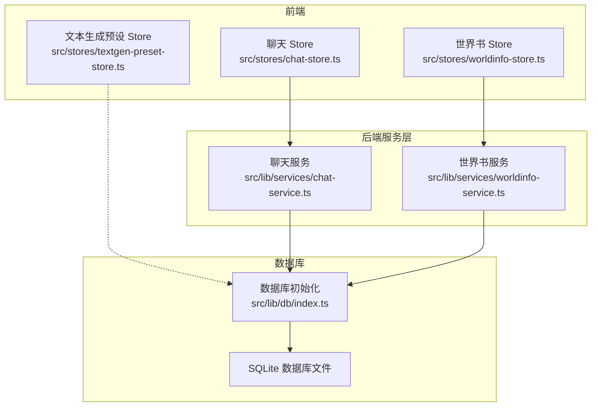
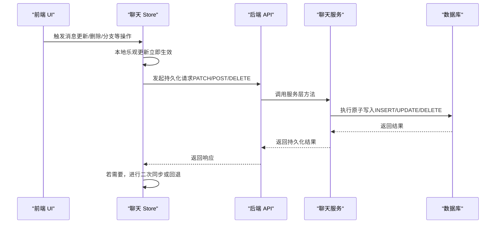
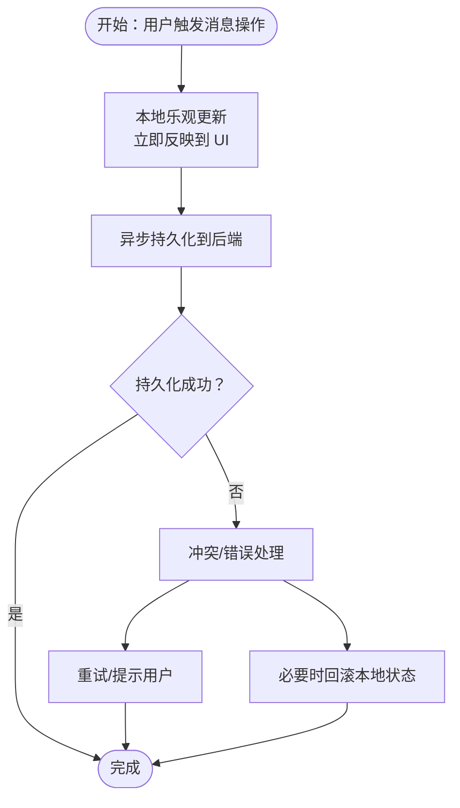
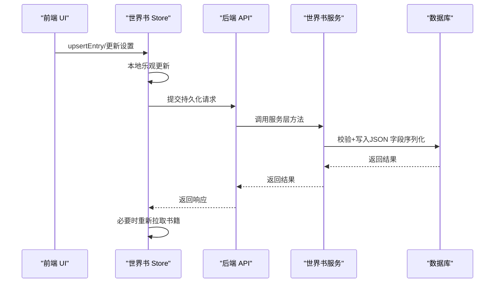
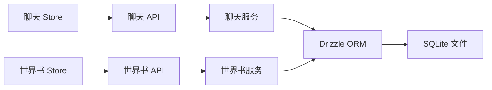

# 状态同步与持久化

<cite>
**本文档引用的文件**
- [src/lib/db/index.ts](file://src/lib/db/index.ts)
- [src/lib/services/chat-service.ts](file://src/lib/services/chat-service.ts)
- [src/lib/services/worldinfo-service.ts](file://src/lib/services/worldinfo-service.ts)
- [src/stores/chat-store.ts](file://src/stores/chat-store.ts)
- [src/stores/worldinfo-store.ts](file://src/stores/worldinfo-store.ts)
- [src/stores/textgen-preset-store.ts](file://src/stores/textgen-preset-store.ts)
- [src/types/index.ts](file://src/types/index.ts)
</cite>

## 目录
1. [简介](#简介)
2. [项目结构](#项目结构)
3. [核心组件](#核心组件)
4. [架构总览](#架构总览)
5. [详细组件分析](#详细组件分析)
6. [依赖关系分析](#依赖关系分析)
7. [性能考量](#性能考量)
8. [故障排查指南](#故障排查指南)
9. [结论](#结论)
10. [附录](#附录)

## 简介
本文件系统性阐述 SillyTavern Next 中的状态同步与持久化机制，重点覆盖以下方面：
- 本地状态与服务器状态的协调策略与数据一致性保证
- 乐观更新、冲突解决与回滚机制的实现方式
- 状态持久化的存储策略、缓存机制与性能优化
- 状态迁移、版本管理与数据恢复的处理方案

通过对前端 Zustand Store、后端 Drizzle ORM 服务层以及 SQLite 数据库的深入分析，帮助读者全面理解从 UI 交互到数据库落盘的完整链路。

## 项目结构
围绕状态同步与持久化，项目采用“前端 Store + 后端服务层 + 数据库”的分层设计：
- 前端 Store：负责 UI 交互态与本地状态管理，提供乐观更新与即时反馈
- 后端服务层：封装数据库操作，确保原子性与一致性
- 数据库：SQLite + WAL 模式，配合 Drizzle ORM 与迁移脚本

**图表来源**
- [src/stores/chat-store.ts:105-583](file://src/stores/chat-store.ts#L105-L583)
- [src/stores/worldinfo-store.ts:43-257](file://src/stores/worldinfo-store.ts#L43-L257)
- [src/stores/textgen-preset-store.ts:85-376](file://src/stores/textgen-preset-store.ts#L85-L376)
- [src/lib/services/chat-service.ts:60-301](file://src/lib/services/chat-service.ts#L60-L301)
- [src/lib/services/worldinfo-service.ts:97-428](file://src/lib/services/worldinfo-service.ts#L97-L428)
- [src/lib/db/index.ts:1-134](file://src/lib/db/index.ts#L1-L134)

**章节来源**
- [src/lib/db/index.ts:1-134](file://src/lib/db/index.ts#L1-L134)
- [src/lib/services/chat-service.ts:60-301](file://src/lib/services/chat-service.ts#L60-L301)
- [src/lib/services/worldinfo-service.ts:97-428](file://src/lib/services/worldinfo-service.ts#L97-L428)
- [src/stores/chat-store.ts:105-583](file://src/stores/chat-store.ts#L105-L583)
- [src/stores/worldinfo-store.ts:43-257](file://src/stores/worldinfo-store.ts#L43-L257)
- [src/stores/textgen-preset-store.ts:85-376](file://src/stores/textgen-preset-store.ts#L85-L376)

## 核心组件
- 聊天 Store：提供聊天、消息的本地状态与异步持久化动作，支持乐观更新、分支、书签、滑动版本等复杂交互
- 世界书 Store：提供世界设定的增删改查、导入导出、全局选择等管理能力
- 文本生成预设 Store：提供预设列表、激活、保存、导入导出等管理能力
- 聊天服务：封装聊天与消息的数据库操作，保证事务性与一致性
- 世界书服务：封装世界书与词条的数据库操作，提供导入导出与兼容转换
- 数据库初始化：SQLite 连接、WAL 模式、外键约束与迁移保障

**章节来源**
- [src/stores/chat-store.ts:15-103](file://src/stores/chat-store.ts#L15-L103)
- [src/stores/worldinfo-store.ts:9-41](file://src/stores/worldinfo-store.ts#L9-L41)
- [src/stores/textgen-preset-store.ts:25-65](file://src/stores/textgen-preset-store.ts#L25-L65)
- [src/lib/services/chat-service.ts:60-301](file://src/lib/services/chat-service.ts#L60-L301)
- [src/lib/services/worldinfo-service.ts:97-428](file://src/lib/services/worldinfo-service.ts#L97-L428)
- [src/lib/db/index.ts:1-134](file://src/lib/db/index.ts#L1-L134)

## 架构总览
状态同步遵循“前端乐观更新 + 后端原子持久化”的模式。UI 交互先在本地 Store 更新，随后异步提交至后端服务层，服务层通过 Drizzle ORM 写入数据库。数据库采用 WAL 模式提升并发写入性能，并通过迁移脚本与幂等补齐确保 Schema 与数据一致性。

**图表来源**
- [src/stores/chat-store.ts:335-351](file://src/stores/chat-store.ts#L335-L351)
- [src/lib/services/chat-service.ts:205-251](file://src/lib/services/chat-service.ts#L205-L251)
- [src/lib/db/index.ts:1-134](file://src/lib/db/index.ts#L1-L134)

## 详细组件分析

### 聊天状态同步与持久化
- 乐观更新策略
  - 重命名聊天：本地立即更新当前聊天与列表项，随后异步提交至后端；若失败，可在 UI 层提示或进行补偿
  - 消息滑动切换：本地即时切换 active swipe，同时异步写入数据库，失败不回滚本地状态，避免阻塞交互
  - 新建/分支/书签：本地先构建新聊天或消息结构，再异步持久化，成功后刷新列表
- 冲突解决与回滚
  - 移动消息：本地先交换 createdAt 与顺序，随后并发 PATCH 两条消息；若部分失败，可通过重新拉取或 UI 修复
  - 删除消息：本地先移除，再异步删除数据库记录；若删除失败，保留本地状态并提示用户重试
- 数据一致性
  - 服务层在执行前校验聊天归属（userId），防止越权访问
  - 消息字段（如 swipes、swipeInfo、extra 等）通过 JSON 序列化持久化，读取时安全解析，避免类型不一致导致的异常

**图表来源**
- [src/stores/chat-store.ts:368-388](file://src/stores/chat-store.ts#L368-L388)
- [src/stores/chat-store.ts:460-494](file://src/stores/chat-store.ts#L460-L494)
- [src/stores/chat-store.ts:561-581](file://src/stores/chat-store.ts#L561-L581)
- [src/lib/services/chat-service.ts:205-251](file://src/lib/services/chat-service.ts#L205-L251)

**章节来源**
- [src/stores/chat-store.ts:52-103](file://src/stores/chat-store.ts#L52-L103)
- [src/stores/chat-store.ts:335-351](file://src/stores/chat-store.ts#L335-L351)
- [src/stores/chat-store.ts:368-388](file://src/stores/chat-store.ts#L368-L388)
- [src/stores/chat-store.ts:460-494](file://src/stores/chat-store.ts#L460-L494)
- [src/stores/chat-store.ts:561-581](file://src/stores/chat-store.ts#L561-L581)
- [src/lib/services/chat-service.ts:205-251](file://src/lib/services/chat-service.ts#L205-L251)

### 世界书状态同步与持久化
- 乐观更新策略
  - 词条新增/修改：本地先 upsertEntry，再异步提交；成功后重新拉取书籍以保证 UI 与数据库一致
  - 全局选择切换：本地立即更新设置，随后异步写回后端；失败时可回滚本地变更
- 数据一致性
  - 服务层对词条字段进行 Zod 校验与默认值补齐，确保入库数据结构稳定
  - 删除世界书时，服务层执行级联清理（角色卡引用清空、全局设置中移除 ID），保证引用完整性

**图表来源**
- [src/stores/worldinfo-store.ts:177-195](file://src/stores/worldinfo-store.ts#L177-L195)
- [src/stores/worldinfo-store.ts:249-255](file://src/stores/worldinfo-store.ts#L249-L255)
- [src/lib/services/worldinfo-service.ts:206-218](file://src/lib/services/worldinfo-service.ts#L206-L218)
- [src/lib/services/worldinfo-service.ts:161-192](file://src/lib/services/worldinfo-service.ts#L161-L192)

**章节来源**
- [src/stores/worldinfo-store.ts:177-195](file://src/stores/worldinfo-store.ts#L177-L195)
- [src/stores/worldinfo-store.ts:249-255](file://src/stores/worldinfo-store.ts#L249-L255)
- [src/lib/services/worldinfo-service.ts:206-218](file://src/lib/services/worldinfo-service.ts#L206-L218)
- [src/lib/services/worldinfo-service.ts:161-192](file://src/lib/services/worldinfo-service.ts#L161-L192)

### 文本生成预设状态同步与持久化
- 乐观更新策略
  - 字段编辑：本地立即更新 currentSettings，并标记 isDirty；保存时仅提交差异
  - 列表切换：本地立即切换 activePresetId，并异步拉取对应预设详情
- 数据一致性
  - 服务层对设置进行 Schema 校验与默认值补齐，确保前后端一致
  - 保存/激活/导入导出等操作均通过后端接口完成，避免前端状态漂移

**章节来源**
- [src/stores/textgen-preset-store.ts:155-168](file://src/stores/textgen-preset-store.ts#L155-L168)
- [src/stores/textgen-preset-store.ts:139-153](file://src/stores/textgen-preset-store.ts#L139-L153)
- [src/stores/textgen-preset-store.ts:179-205](file://src/stores/textgen-preset-store.ts#L179-L205)
- [src/stores/textgen-preset-store.ts:274-289](file://src/stores/textgen-preset-store.ts#L274-L289)

### 数据模型与类型定义
- 聊天与消息：包含 swipes、swipeInfo、extra、生成时间戳、头像强制/原始映射、书签链接等字段
- 世界书：词条结构包含关键词、位置、概率、深度、角色、过滤器等丰富属性
- 预设：包含生成参数、API 类型、是否默认/激活等元信息

**章节来源**
- [src/types/index.ts:60-149](file://src/types/index.ts#L60-L149)
- [src/types/index.ts:369-416](file://src/types/index.ts#L369-L416)
- [src/types/index.ts:309-318](file://src/types/index.ts#L309-L318)

## 依赖关系分析
- Store 与服务层的耦合
  - 聊天 Store 与世界书 Store 通过 HTTP API 与服务层解耦，便于替换后端实现
  - 服务层依赖 Drizzle ORM 与 SQLite，提供统一的数据访问抽象
- 数据库层
  - 初始化阶段启用 WAL 模式与外键约束，提升并发与一致性
  - 迁移脚本与幂等补齐确保 Schema 与历史数据兼容

**图表来源**
- [src/stores/chat-store.ts:168-209](file://src/stores/chat-store.ts#L168-L209)
- [src/stores/worldinfo-store.ts:63-78](file://src/stores/worldinfo-store.ts#L63-L78)
- [src/lib/services/chat-service.ts:60-116](file://src/lib/services/chat-service.ts#L60-L116)
- [src/lib/services/worldinfo-service.ts:97-140](file://src/lib/services/worldinfo-service.ts#L97-L140)
- [src/lib/db/index.ts:1-134](file://src/lib/db/index.ts#L1-L134)

**章节来源**
- [src/stores/chat-store.ts:168-209](file://src/stores/chat-store.ts#L168-L209)
- [src/stores/worldinfo-store.ts:63-78](file://src/stores/worldinfo-store.ts#L63-L78)
- [src/lib/services/chat-service.ts:60-116](file://src/lib/services/chat-service.ts#L60-L116)
- [src/lib/services/worldinfo-service.ts:97-140](file://src/lib/services/worldinfo-service.ts#L97-L140)
- [src/lib/db/index.ts:1-134](file://src/lib/db/index.ts#L1-L134)

## 性能考量
- 存储策略
  - SQLite + WAL 模式：提升写入吞吐与并发读取性能
  - JSON 字段：消息扩展字段与世界书词条以 JSON 形式存储，便于灵活扩展
- 缓存机制
  - 前端 Store 缓存当前聊天、列表与世界书书籍，减少重复请求
  - 服务层按需查询，避免一次性加载过多数据
- 优化建议
  - 对高频字段建立索引（如 messages.chatId、chats.userId）
  - 对大字段（如 extra、entries）进行懒加载或分页
  - 在网络不稳定场景下，增加重试与退避策略

[本节为通用性能讨论，无需具体文件分析]

## 故障排查指南
- 常见问题
  - 乐观更新后网络失败：检查 Store 的错误回调与 UI 提示，必要时回滚本地状态
  - 并发更新导致的冲突：对关键操作采用幂等设计（如重命名、移动消息），并在失败时重新拉取
  - 数据库迁移失败：确认迁移脚本与幂等补齐逻辑是否正确执行
- 定位方法
  - 查看 Store 日志与错误捕获
  - 检查服务层返回码与数据库变更
  - 核对类型定义与 JSON 字段序列化/反序列化

**章节来源**
- [src/stores/chat-store.ts:540-559](file://src/stores/chat-store.ts#L540-L559)
- [src/stores/chat-store.ts:481-494](file://src/stores/chat-store.ts#L481-L494)
- [src/lib/db/index.ts:16-134](file://src/lib/db/index.ts#L16-L134)

## 结论
SillyTavern Next 的状态同步与持久化采用“前端乐观更新 + 后端原子持久化”的稳健策略。通过 Store 的即时反馈与服务层的强一致写入，系统在保证用户体验的同时兼顾了数据一致性与可维护性。结合 SQLite 的 WAL 模式、Drizzle ORM 的类型安全与迁移机制，整体架构具备良好的扩展性与可靠性。

[本节为总结性内容，无需具体文件分析]

## 附录

### 状态迁移与版本管理
- 迁移脚本：位于 drizzle 目录，启动时自动执行，幂等跳过已执行的迁移
- 幂等补齐：对历史表结构进行字段补齐，避免因迁移文件滞后导致的 500 错误
- 版本演进：通过服务层与 Store 的类型定义保持前后端一致，逐步引入新字段并兼容旧数据

**章节来源**
- [src/lib/db/index.ts:16-134](file://src/lib/db/index.ts#L16-L134)

### 数据恢复方案
- 聊天分支与书签：通过分支与 bookmarkLink 实现历史版本保存与快速回溯
- 世界书导入导出：支持 lorebook 与 V2 character_book 格式互转，便于备份与迁移
- 预设导入导出：支持 JSON 导入导出，便于跨环境迁移

**章节来源**
- [src/stores/chat-store.ts:505-536](file://src/stores/chat-store.ts#L505-L536)
- [src/lib/services/worldinfo-service.ts:230-282](file://src/lib/services/worldinfo-service.ts#L230-L282)
- [src/stores/textgen-preset-store.ts:322-349](file://src/stores/textgen-preset-store.ts#L322-L349)