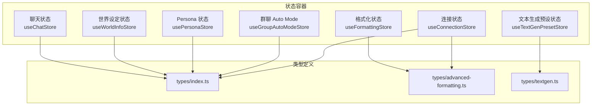
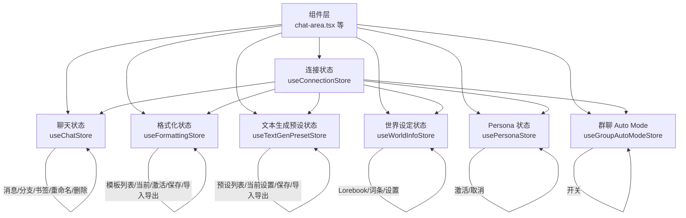
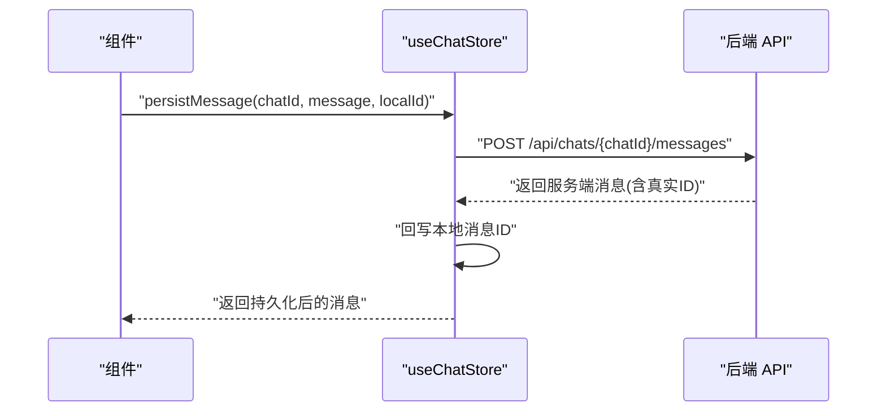
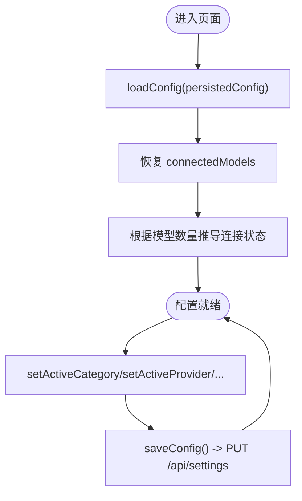
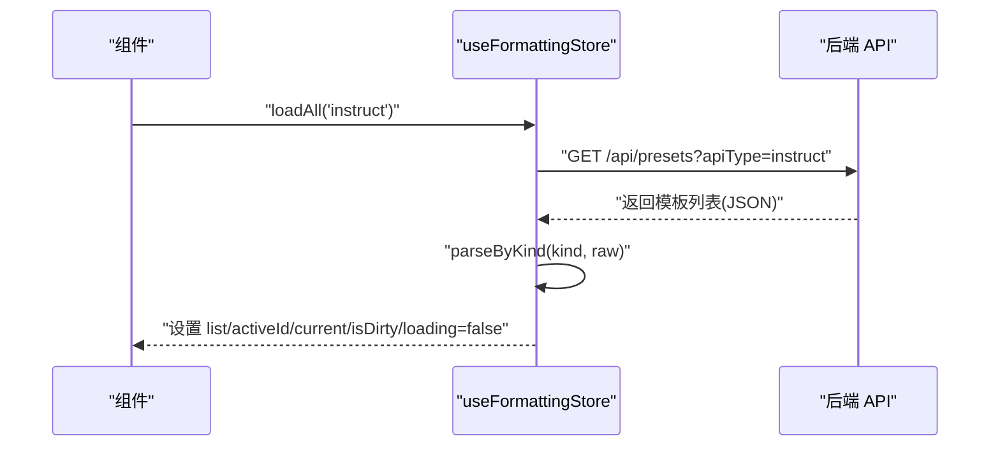
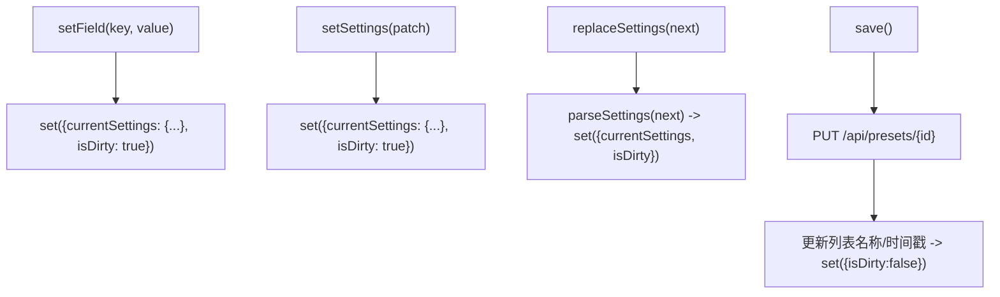
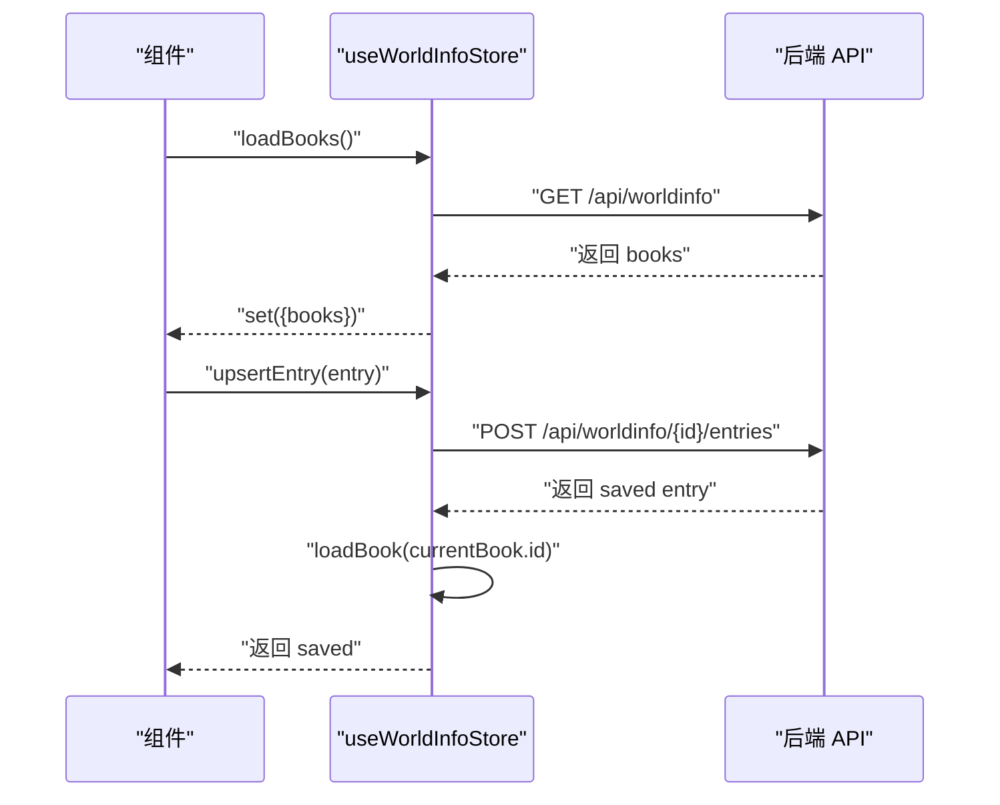
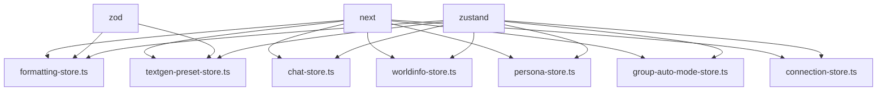

# 状态管理

<cite>
**本文引用的文件**
- [src/stores/chat-store.ts](file://src/stores/chat-store.ts)
- [src/stores/formatting-store.ts](file://src/stores/formatting-store.ts)
- [src/stores/textgen-preset-store.ts](file://src/stores/textgen-preset-store.ts)
- [src/stores/worldinfo-store.ts](file://src/stores/worldinfo-store.ts)
- [src/stores/persona-store.ts](file://src/stores/persona-store.ts)
- [src/stores/group-auto-mode-store.ts](file://src/stores/group-auto-mode-store.ts)
- [src/lib/stores/connection-store.ts](file://src/lib/stores/connection-store.ts)
- [src/types/index.ts](file://src/types/index.ts)
- [src/types/advanced-formatting.ts](file://src/types/advanced-formatting.ts)
- [src/types/textgen.ts](file://src/types/textgen.ts)
- [src/components/chat/chat-area.tsx](file://src/components/chat/chat-area.tsx)
- [package.json](file://package.json)
- [next.config.ts](file://next.config.ts)
</cite>

## 目录
1. [简介](#简介)
2. [项目结构](#项目结构)
3. [核心组件](#核心组件)
4. [架构总览](#架构总览)
5. [详细组件分析](#详细组件分析)
6. [依赖关系分析](#依赖关系分析)
7. [性能考量](#性能考量)
8. [故障排查指南](#故障排查指南)
9. [结论](#结论)
10. [附录](#附录)

## 简介
本文件系统性梳理 SillyTavern Next 的 Zustand 状态管理体系，覆盖设计理念、全局状态架构、状态持久化策略、状态容器职责划分、状态更新机制与订阅模式、状态同步与一致性保障、性能优化、调试与热重载、迁移策略，以及最佳实践与扩展开发指南。文档面向不同技术背景读者，既提供高层概览，也给出代码级细节与可视化图示。

## 项目结构
- 状态容器集中于 src/stores 与 src/lib/stores，采用“按功能域拆分”的组织方式：
  - 聊天域：聊天列表、当前会话、消息、分支与书签、Swipe 切换等
  - 配置域：连接配置（Provider、模型、代理、自动连接）、高级格式化全局设置
  - 预设域：文本生成预设（74 字段）、高级格式化模板（上下文/指令/系统提示/推理）
  - 世界设定域：Lorebook 列表、词条 CRUD、全局设置
  - 角色域：Persona 激活/取消
  - 群聊域：群聊 Auto Mode 全局开关
- 类型体系集中在 src/types，涵盖消息、角色、聊天、世界设定、文本生成设置、高级格式化模板等，为状态容器提供强类型保障。

图表来源
- [src/stores/chat-store.ts:15-103](file://src/stores/chat-store.ts#L15-L103)
- [src/stores/formatting-store.ts:84-117](file://src/stores/formatting-store.ts#L84-L117)
- [src/stores/textgen-preset-store.ts:25-65](file://src/stores/textgen-preset-store.ts#L25-L65)
- [src/stores/worldinfo-store.ts:9-41](file://src/stores/worldinfo-store.ts#L9-L41)
- [src/stores/persona-store.ts:13-22](file://src/stores/persona-store.ts#L13-L22)
- [src/stores/group-auto-mode-store.ts:7-11](file://src/stores/group-auto-mode-store.ts#L7-L11)
- [src/lib/stores/connection-store.ts:5-30](file://src/lib/stores/connection-store.ts#L5-L30)
- [src/types/index.ts:58-184](file://src/types/index.ts#L58-L184)
- [src/types/advanced-formatting.ts:34-146](file://src/types/advanced-formatting.ts#L34-L146)
- [src/types/textgen.ts:117-238](file://src/types/textgen.ts#L117-L238)

章节来源
- [src/stores/chat-store.ts:15-103](file://src/stores/chat-store.ts#L15-L103)
- [src/stores/formatting-store.ts:84-117](file://src/stores/formatting-store.ts#L84-L117)
- [src/stores/textgen-preset-store.ts:25-65](file://src/stores/textgen-preset-store.ts#L25-L65)
- [src/stores/worldinfo-store.ts:9-41](file://src/stores/worldinfo-store.ts#L9-L41)
- [src/stores/persona-store.ts:13-22](file://src/stores/persona-store.ts#L13-L22)
- [src/stores/group-auto-mode-store.ts:7-11](file://src/stores/group-auto-mode-store.ts#L7-L11)
- [src/lib/stores/connection-store.ts:5-30](file://src/lib/stores/connection-store.ts#L5-L30)
- [src/types/index.ts:58-184](file://src/types/index.ts#L58-L184)
- [src/types/advanced-formatting.ts:34-146](file://src/types/advanced-formatting.ts#L34-L146)
- [src/types/textgen.ts:117-238](file://src/types/textgen.ts#L117-L238)

## 核心组件
- 设计理念
  - 以“功能域”划分状态容器，每个容器聚焦单一业务边界，降低耦合、提升可维护性。
  - 使用 create 函数声明式定义状态与动作，结合 set/get 实现原子更新与跨动作组合。
  - 强类型：通过 TypeScript 与 Zod Schema 双层校验，确保状态结构与数据一致性。
  - 乐观更新与回滚：对网络操作采用乐观更新，失败时通过日志与错误状态反馈。
- 全局状态架构
  - 聊天域：currentChat、chats、currentCharacter、isGenerating；支持消息增删改、Swipe 切换、分支/书签、重命名/删除等。
  - 配置域：UserConnectionConfig（活动分类、Provider、模型、Base URL、代理、自动连接、connectedModels、formatting），并提供连接状态与模型缓存。
  - 预设域：按 apiType 分组的预设列表与当前编辑设置，支持字段级/批量更新、保存/另存为/重命名/删除/激活、默认恢复与导入导出。
  - 世界设定域：Lorebook 列表与当前编辑 Book、词条 CRUD、全局设置（含全局选择）。
  - 角色域：Persona 激活/取消，便于个性化体验。
  - 群聊域：全局 Auto Mode 开关，统一控制群聊行为。
- 状态持久化策略
  - 连接配置：通过 saveConfig 将 config 写入 /api/settings，实现浏览器端持久化。
  - 聊天域：消息持久化与 ID 回写、分支/书签、重命名、删除等均与后端 API 协同，确保本地与远端一致。
  - 预设域：预设列表与当前设置在内存中管理，变更通过 PUT/POST/DELETE 与后端同步。
  - 世界设定域：Lorebook 与词条 CRUD 通过 /api/worldinfo/* 与 /api/worldinfo/{id}/entries* 同步。
  - 角色域：Persona 激活/取消通过 /api/personas/* 同步。
  - 群聊域：enabled 状态为内存态，可在需要时扩展为持久化。
- 状态更新机制与订阅模式
  - 更新机制：set 用于纯内存更新；get 用于跨动作组合与读取当前状态；异步动作通过 fetch 与后端交互，成功后 set 合并状态。
  - 订阅模式：React 组件通过 useStore(selector) 订阅所需字段，实现细粒度重渲染。
- 状态同步与一致性
  - 乐观更新：如重命名聊天、更新消息、切换 Swipe 等，先本地更新，再异步写库；失败时可通过错误状态或回滚策略处理。
  - 并发写入：moveMessage 使用 Promise.all 并发 PATCH 两条消息的时间戳，确保一致性。
  - ID 回写：persistMessage 成功后将服务端真实 ID 回写本地，避免分支/检查点找不到消息。
- 性能优化
  - 选择器订阅：组件仅订阅必要字段，减少重渲染。
  - 并发加载：loadAllKinds、Promise.all 并发请求，缩短等待时间。
  - 浅比较：isSettingsEqual 使用 JSON 序列化浅层比较，避免深层遍历开销。
  - 本地缓存：connectedModels 缓存 Provider 的可用模型列表，减少重复测试。
- 调试、热重载与迁移
  - 调试：各 store 在关键路径打印错误日志，便于定位问题。
  - 热重载：Next.js 开发环境支持热重载，Zustand 容器在模块更新时重建实例，建议在需要时保留关键状态。
  - 迁移：Zod Schema 用于预设与模板的解析与默认填充，确保旧版数据兼容。

章节来源
- [src/stores/chat-store.ts:105-582](file://src/stores/chat-store.ts#L105-L582)
- [src/lib/stores/connection-store.ts:32-185](file://src/lib/stores/connection-store.ts#L32-L185)
- [src/stores/formatting-store.ts:131-505](file://src/stores/formatting-store.ts#L131-L505)
- [src/stores/textgen-preset-store.ts:85-370](file://src/stores/textgen-preset-store.ts#L85-L370)
- [src/stores/worldinfo-store.ts:43-256](file://src/stores/worldinfo-store.ts#L43-L256)
- [src/stores/persona-store.ts:24-58](file://src/stores/persona-store.ts#L24-L58)
- [src/stores/group-auto-mode-store.ts:13-17](file://src/stores/group-auto-mode-store.ts#L13-L17)

## 架构总览
下图展示状态容器之间的协作关系与数据流向，体现“配置驱动 + 功能域自治”的设计。

图表来源
- [src/components/chat/chat-area.tsx:34-112](file://src/components/chat/chat-area.tsx#L34-L112)
- [src/lib/stores/connection-store.ts:32-185](file://src/lib/stores/connection-store.ts#L32-L185)
- [src/stores/chat-store.ts:105-582](file://src/stores/chat-store.ts#L105-L582)
- [src/stores/formatting-store.ts:131-505](file://src/stores/formatting-store.ts#L131-L505)
- [src/stores/textgen-preset-store.ts:85-370](file://src/stores/textgen-preset-store.ts#L85-L370)
- [src/stores/worldinfo-store.ts:43-256](file://src/stores/worldinfo-store.ts#L43-L256)
- [src/stores/persona-store.ts:24-58](file://src/stores/persona-store.ts#L24-L58)
- [src/stores/group-auto-mode-store.ts:13-17](file://src/stores/group-auto-mode-store.ts#L13-L17)

## 详细组件分析

### 聊天状态容器（useChatStore）
- 职责划分
  - 维护当前聊天、聊天列表、当前角色、生成状态
  - 本地消息增删改、流式中间态更新、Swipe 切换
  - 与后端 API 协作：创建/加载/重命名/删除聊天；持久化/更新/删除消息；分支/书签；移动消息；推理块初始化
- 关键流程
  - 新建聊天：POST /api/chats，可选注入 firstMessage，随后刷新列表
  - 持久化消息：POST /api/chats/{id}/messages，成功后将服务端 ID 回写本地
  - 更新消息：PATCH /api/chats/{id}/messages/{mid}，成功后同步本地
  - 移动消息：并发 PATCH 两条消息的 createdAt，保证一致性
  - 分支/书签：POST /api/chats/{id}/branch，创建后刷新列表
- 数据模型
  - Chat、ChatMessage、Character、MessageExtra、SwipeInfo 等类型定义见类型文件

图表来源
- [src/stores/chat-store.ts:235-272](file://src/stores/chat-store.ts#L235-L272)

章节来源
- [src/stores/chat-store.ts:15-103](file://src/stores/chat-store.ts#L15-L103)
- [src/stores/chat-store.ts:167-209](file://src/stores/chat-store.ts#L167-L209)
- [src/stores/chat-store.ts:235-272](file://src/stores/chat-store.ts#L235-L272)
- [src/stores/chat-store.ts:335-351](file://src/stores/chat-store.ts#L335-L351)
- [src/stores/chat-store.ts:460-494](file://src/stores/chat-store.ts#L460-L494)
- [src/stores/chat-store.ts:505-536](file://src/stores/chat-store.ts#L505-L536)
- [src/types/index.ts:58-184](file://src/types/index.ts#L58-L184)

### 连接状态容器（useConnectionStore）
- 职责划分
  - 维护 UserConnectionConfig（活动分类、Provider、模型、Base URL、代理、自动连接、connectedModels、formatting）
  - 提供连接状态与模型缓存，支持保存与加载
- 关键流程
  - 保存配置：PUT /api/settings
  - 获取/设置 formatting 全局设置（自动填充默认值）
  - 恢复配置：从持久化数据恢复 connectedModels，并推导 connectionStatus

图表来源
- [src/lib/stores/connection-store.ts:159-185](file://src/lib/stores/connection-store.ts#L159-L185)

章节来源
- [src/lib/stores/connection-store.ts:5-30](file://src/lib/stores/connection-store.ts#L5-L30)
- [src/lib/stores/connection-store.ts:159-185](file://src/lib/stores/connection-store.ts#L159-L185)

### 高级格式化状态容器（useFormattingStore）
- 职责划分
  - 维护四类模板（context/instruct/sysprompt/reasoning）的列表、当前编辑、激活项、脏状态、加载/保存状态
  - 支持字段级/批量更新、保存/另存为/重命名/删除/激活、默认恢复、导入导出、按模型名自动激活
- 关键流程
  - 加载模板：GET /api/presets?apiType={kind}，解析并填充 defaults
  - 选择模板：GET /api/presets/{id}，解析后设置为 current
  - 保存/另存为：PUT/POST /api/presets*
  - 导入：POST /api/presets/import 或 POST /api/presets
  - 自动激活：扫描 instruct/context 的 activation_regex，匹配模型名后激活

图表来源
- [src/stores/formatting-store.ts:138-177](file://src/stores/formatting-store.ts#L138-L177)

章节来源
- [src/stores/formatting-store.ts:84-117](file://src/stores/formatting-store.ts#L84-L117)
- [src/stores/formatting-store.ts:138-177](file://src/stores/formatting-store.ts#L138-L177)
- [src/stores/formatting-store.ts:384-446](file://src/stores/formatting-store.ts#L384-L446)
- [src/stores/formatting-store.ts:467-504](file://src/stores/formatting-store.ts#L467-L504)
- [src/types/advanced-formatting.ts:34-146](file://src/types/advanced-formatting.ts#L34-L146)

### 文本生成预设状态容器（useTextGenPresetStore）
- 职责划分
  - 维护 apiType、预设列表、当前编辑设置、脏状态、加载/保存状态
  - 支持字段级/批量更新、保存/另存为/重命名/删除/激活、默认恢复、导入导出
- 关键流程
  - 加载预设：GET /api/presets?apiType=textgenerationwebui，解析并填充 defaults
  - 选择预设：GET /api/presets/{id}，解析后设置 currentSettings
  - 保存/另存为：PUT/POST /api/presets*
  - 导入：POST /api/presets/import
  - 比较：isSettingsEqual 使用浅比较判断是否脏

图表来源
- [src/stores/textgen-preset-store.ts:155-168](file://src/stores/textgen-preset-store.ts#L155-L168)
- [src/stores/textgen-preset-store.ts:179-205](file://src/stores/textgen-preset-store.ts#L179-L205)
- [src/stores/textgen-preset-store.ts:322-350](file://src/stores/textgen-preset-store.ts#L322-L350)

章节来源
- [src/stores/textgen-preset-store.ts:25-65](file://src/stores/textgen-preset-store.ts#L25-L65)
- [src/stores/textgen-preset-store.ts:155-168](file://src/stores/textgen-preset-store.ts#L155-L168)
- [src/stores/textgen-preset-store.ts:179-205](file://src/stores/textgen-preset-store.ts#L179-L205)
- [src/stores/textgen-preset-store.ts:322-350](file://src/stores/textgen-preset-store.ts#L322-L350)
- [src/types/textgen.ts:117-238](file://src/types/textgen.ts#L117-L238)

### 世界设定状态容器（useWorldInfoStore）
- 职责划分
  - 维护 Lorebook 列表、当前编辑 Book、全局设置
  - 支持 CRUD、导入导出、词条新增/删除/保存、全局选择切换
- 关键流程
  - 加载/创建/删除/重命名/复制/导入/导出：/api/worldinfo/*
  - 词条 upsert/delete/new：/api/worldinfo/{id}/entries*

图表来源
- [src/stores/worldinfo-store.ts:49-61](file://src/stores/worldinfo-store.ts#L49-L61)
- [src/stores/worldinfo-store.ts:177-195](file://src/stores/worldinfo-store.ts#L177-L195)

章节来源
- [src/stores/worldinfo-store.ts:9-41](file://src/stores/worldinfo-store.ts#L9-L41)
- [src/stores/worldinfo-store.ts:49-61](file://src/stores/worldinfo-store.ts#L49-L61)
- [src/stores/worldinfo-store.ts:177-195](file://src/stores/worldinfo-store.ts#L177-L195)
- [src/stores/worldinfo-store.ts:220-255](file://src/stores/worldinfo-store.ts#L220-L255)

### 角色 Persona 状态容器（usePersonaStore）
- 职责划分
  - 维护当前激活的 Persona，支持加载、激活、取消
- 关键流程
  - 加载：GET /api/personas
  - 激活：POST /api/personas/{id}
  - 取消：POST /api/personas/none

章节来源
- [src/stores/persona-store.ts:13-22](file://src/stores/persona-store.ts#L13-L22)
- [src/stores/persona-store.ts:28-57](file://src/stores/persona-store.ts#L28-L57)

### 群聊 Auto Mode 状态容器（useGroupAutoModeStore）
- 职责划分
  - 维护全局开关 enabled，支持 toggle 与 setEnabled
- 关键流程
  - 切换：toggle()
  - 设置：setEnabled(v)

章节来源
- [src/stores/group-auto-mode-store.ts:7-11](file://src/stores/group-auto-mode-store.ts#L7-L11)
- [src/stores/group-auto-mode-store.ts:13-17](file://src/stores/group-auto-mode-store.ts#L13-L17)

## 依赖关系分析
- 外部依赖
  - Zustand：状态容器核心
  - Zod：类型与数据校验
  - Next.js：框架与构建
- 内部依赖
  - 组件通过 useStore(selector) 订阅状态，形成“配置驱动 + 功能域自治”
  - 聊天/世界设定/预设/格式化等容器均依赖后端 API，实现本地与远端一致

图表来源
- [package.json:44-45](file://package.json#L44-L45)
- [src/stores/chat-store.ts:1-1](file://src/stores/chat-store.ts#L1-L1)
- [src/stores/formatting-store.ts:1-1](file://src/stores/formatting-store.ts#L1-L1)
- [src/stores/textgen-preset-store.ts:1-1](file://src/stores/textgen-preset-store.ts#L1-L1)
- [src/stores/worldinfo-store.ts:1-1](file://src/stores/worldinfo-store.ts#L1-L1)
- [src/stores/persona-store.ts:1-1](file://src/stores/persona-store.ts#L1-L1)
- [src/stores/group-auto-mode-store.ts:1-1](file://src/stores/group-auto-mode-store.ts#L1-L1)
- [src/lib/stores/connection-store.ts:1-1](file://src/lib/stores/connection-store.ts#L1-L1)

章节来源
- [package.json:18-45](file://package.json#L18-L45)
- [next.config.ts:1-13](file://next.config.ts#L1-L13)

## 性能考量
- 选择器订阅：组件仅订阅必要字段，避免不必要的重渲染
- 并发请求：loadAllKinds、moveMessage 使用 Promise.all 并发，缩短等待时间
- 浅比较：isSettingsEqual 使用 JSON 序列化进行浅层比较，避免深层遍历开销
- 本地缓存：connectedModels 缓存 Provider 的可用模型列表，减少重复测试
- 乐观更新：先本地更新，再异步写库，提升交互响应速度

## 故障排查指南
- 常见问题
  - 聊天持久化失败：检查 persistMessage 返回值与错误日志，确认服务端返回的真实 ID 是否正确回写
  - 消息更新失败：检查 updateMessage 的 PATCH 请求与本地 patch 同步
  - 移动消息不一致：确认并发 PATCH 的两条消息 createdAt 是否正确交换
  - 预设导入失败：检查 /api/presets/import 返回的错误信息，确认 data 结构
  - 连接配置保存失败：检查 saveConfig 的 PUT /api/settings 错误日志
- 调试建议
  - 在关键动作前后打印状态快照
  - 使用浏览器开发者工具 Network 面板观察 API 请求与响应
  - 在组件中使用 React DevTools 检查订阅字段变化

章节来源
- [src/stores/chat-store.ts:268-271](file://src/stores/chat-store.ts#L268-L271)
- [src/stores/chat-store.ts:347-350](file://src/stores/chat-store.ts#L347-L350)
- [src/stores/chat-store.ts:482-493](file://src/stores/chat-store.ts#L482-L493)
- [src/stores/textgen-preset-store.ts:330-334](file://src/stores/textgen-preset-store.ts#L330-L334)
- [src/lib/stores/connection-store.ts:173-184](file://src/lib/stores/connection-store.ts#L173-L184)

## 结论
SillyTavern Next 的 Zustand 状态管理以“功能域自治 + 配置驱动”为核心，通过强类型与 Zod 校验、乐观更新与并发写入、本地缓存与持久化策略，实现了高可用、高性能的状态系统。建议在扩展新功能时遵循现有模式：按域拆分容器、明确动作边界、使用选择器订阅、保持数据一致性与可观测性。

## 附录
- 最佳实践
  - 动作函数尽量原子化，必要时使用 get() 组合多个 set
  - 对外暴露的 selector 仅返回必要字段，避免过度订阅
  - 对网络错误进行日志记录与用户提示，必要时提供回滚策略
  - 使用 Zod schema 保证数据结构与默认值一致性
- 扩展开发指南
  - 新增状态容器时，参考现有容器的接口设计与错误处理
  - 如需持久化，优先考虑 /api/settings 或对应资源 API 的 PUT/POST/DELETE
  - 对复杂流程使用 Promise.all 并发优化，注意错误聚合与回滚
  - 为关键状态增加类型定义，确保 IDE 与编译期检查