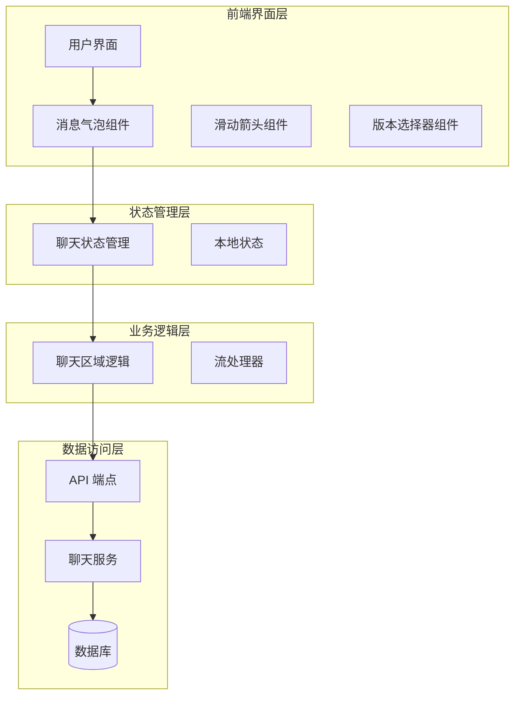
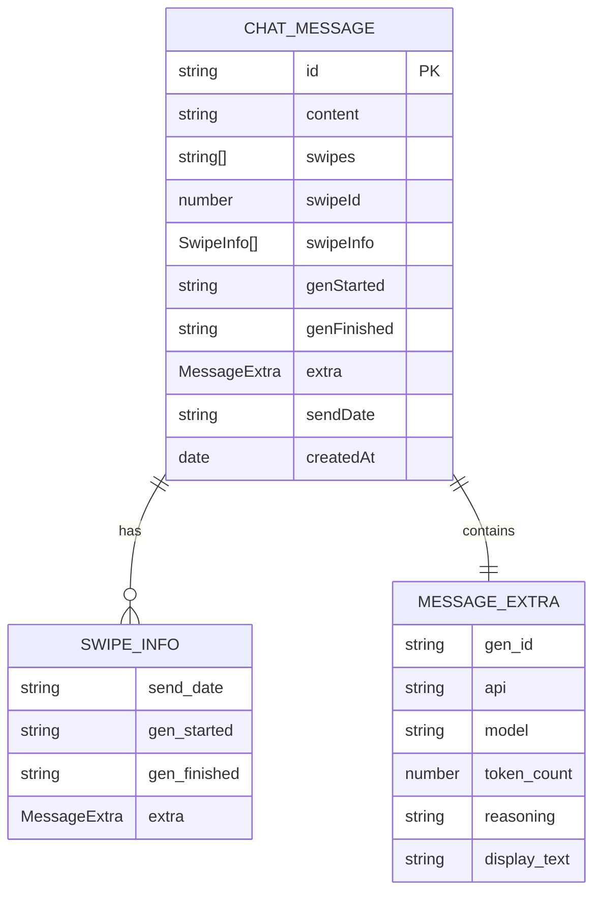
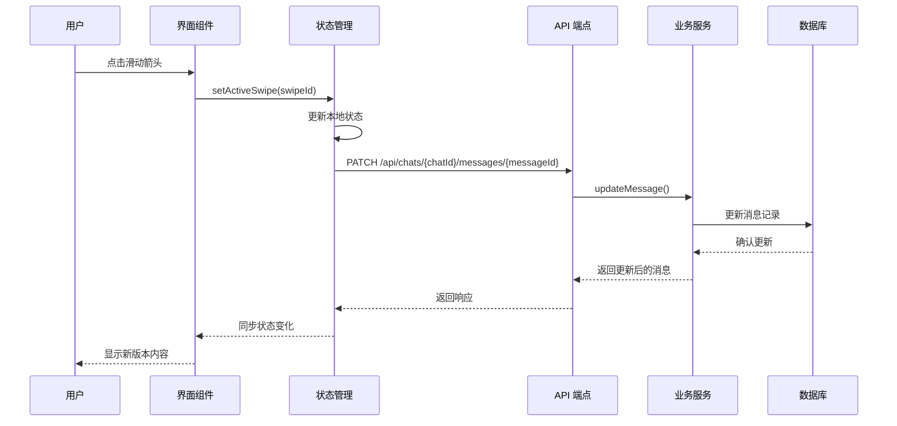
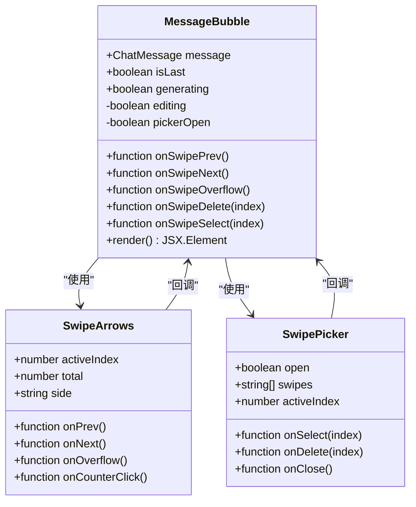
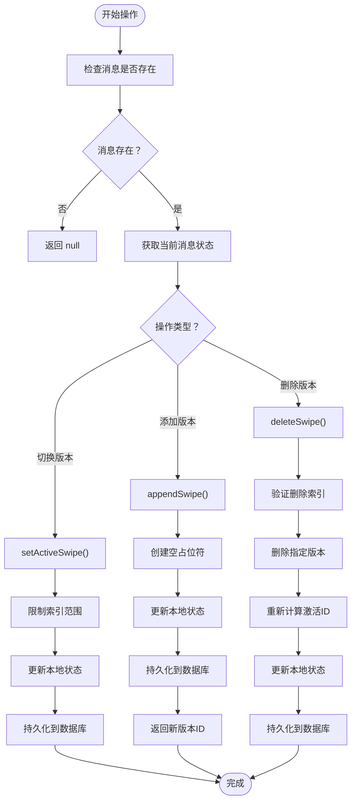
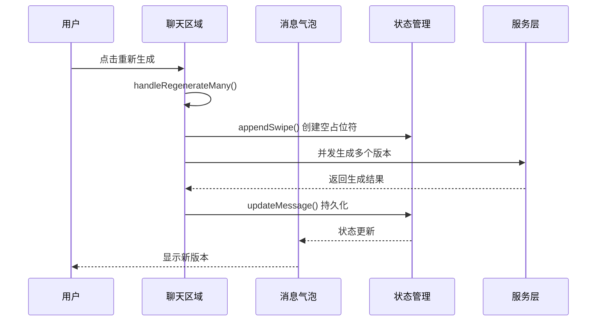
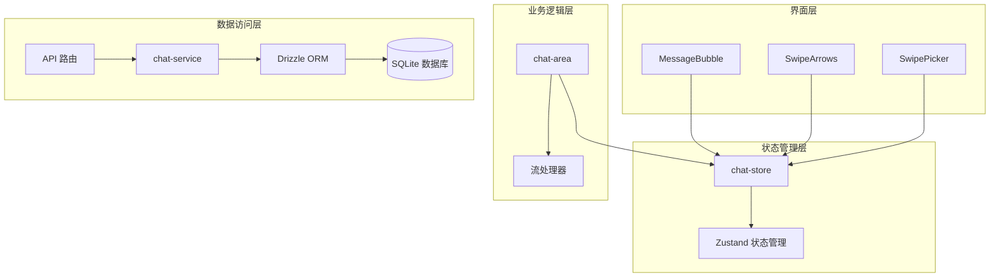

# Swipes 切换系统

<cite>
**本文档引用的文件**
- [chat-store.ts](file://src/stores/chat-store.ts)
- [chat-area.tsx](file://src/components/chat/chat-area.tsx)
- [MessageBubble.tsx](file://src/components/chat/message-bubble/MessageBubble.tsx)
- [SwipeArrows.tsx](file://src/components/chat/message-bubble/SwipeArrows.tsx)
- [SwipePicker.tsx](file://src/components/chat/message-bubble/SwipePicker.tsx)
- [index.ts](file://src/types/index.ts)
- [route.ts](file://src/app/api/chats/[id]/messages/[messageId]/route.ts)
- [chat-service.ts](file://src/lib/services/chat-service.ts)
</cite>

## 目录
1. [简介](#简介)
2. [项目结构](#项目结构)
3. [核心组件](#核心组件)
4. [架构概览](#架构概览)
5. [详细组件分析](#详细组件分析)
6. [依赖关系分析](#依赖关系分析)
7. [性能考虑](#性能考虑)
8. [故障排除指南](#故障排除指南)
9. [结论](#结论)
10. [附录](#附录)

## 简介

Swipes 切换系统是 SillyTavern Next 中的一个重要功能模块，它允许用户在同一消息的不同生成版本之间进行切换和管理。该系统的核心理念是为每次 AI 生成提供多个候选版本，用户可以通过滑动或选择的方式来比较和选择最满意的内容。

系统的设计基于以下核心概念：
- **多版本生成**：同一消息可以有多个不同的生成版本
- **实时切换**：用户可以在不同版本之间即时切换
- **版本管理**：支持添加、删除和组织版本
- **持久化存储**：所有版本信息都会保存到数据库中
- **用户体验优化**：提供直观的滑动界面和版本选择器

## 项目结构

Swipes 系统涉及多个层次的组件协作：

**图表来源**
- [chat-area.tsx:778-915](file://src/components/chat/chat-area.tsx#L778-L915)
- [chat-store.ts:368-452](file://src/stores/chat-store.ts#L368-L452)

**章节来源**
- [chat-area.tsx:778-915](file://src/components/chat/chat-area.tsx#L778-L915)
- [chat-store.ts:368-452](file://src/stores/chat-store.ts#L368-L452)

## 核心组件

### 数据模型设计

Swipes 系统的核心数据结构定义如下：

**图表来源**
- [index.ts:60-91](file://src/types/index.ts#L60-L91)

### 核心数据结构

系统使用以下关键数据结构来管理消息版本：

- **ChatMessage**：包含主内容和版本数组
- **SwipeInfo**：每个版本的元数据信息
- **MessageExtra**：扩展属性和生成统计信息

**章节来源**
- [index.ts:60-131](file://src/types/index.ts#L60-L131)

## 架构概览

Swipes 系统采用分层架构设计，确保了良好的分离关注点和可维护性：

**图表来源**
- [chat-store.ts:368-388](file://src/stores/chat-store.ts#L368-L388)
- [route.ts:23-60](file://src/app/api/chats/[id]/messages/[messageId]/route.ts#L23-L60)

**章节来源**
- [chat-store.ts:368-388](file://src/stores/chat-store.ts#L368-L388)
- [route.ts:23-60](file://src/app/api/chats/[id]/messages/[messageId]/route.ts#L23-L60)

## 详细组件分析

### 消息气泡组件

MessageBubble 是 Swipes 功能的核心界面组件，负责渲染消息及其版本控制元素：

**图表来源**
- [MessageBubble.tsx:60-233](file://src/components/chat/message-bubble/MessageBubble.tsx#L60-L233)
- [SwipeArrows.tsx:30-94](file://src/components/chat/message-bubble/SwipeArrows.tsx#L30-L94)
- [SwipePicker.tsx:21-128](file://src/components/chat/message-bubble/SwipePicker.tsx#L21-L128)

#### 滑动箭头组件

SwipeArrows 提供了左右两侧的版本切换控件：

- **左侧箭头**：用于向前切换版本（除了第一个版本）
- **右侧箭头**：用于向后切换版本，当到达最后一个版本时触发重新生成
- **计数器**：显示当前版本号和总版本数

**章节来源**
- [SwipeArrows.tsx:30-94](file://src/components/chat/message-bubble/SwipeArrows.tsx#L30-L94)

#### 版本选择器组件

SwipePicker 提供了一个下拉列表来显示和选择所有版本：

- **版本列表**：显示所有版本的预览
- **激活状态**：突出显示当前激活的版本
- **删除功能**：允许删除不需要的版本（至少保留一个）

**章节来源**
- [SwipePicker.tsx:21-128](file://src/components/chat/message-bubble/SwipePicker.tsx#L21-L128)

### 状态管理机制

chat-store.ts 实现了 Swipes 系统的核心状态管理逻辑：

**图表来源**
- [chat-store.ts:368-452](file://src/stores/chat-store.ts#L368-L452)

#### 版本切换机制

setActiveSwipe 函数实现了版本切换的核心逻辑：

1. **边界检查**：确保消息存在且包含 swipes 数组
2. **索引限制**：使用 Math.max 和 Math.min 限制索引在有效范围内
3. **内容更新**：根据新索引获取对应的版本内容
4. **元数据同步**：同步生成时间戳和额外信息
5. **数据库持久化**：异步更新数据库记录

**章节来源**
- [chat-store.ts:368-388](file://src/stores/chat-store.ts#L368-L388)

#### 版本添加机制

appendSwipe 函数负责创建新的版本：

1. **初始化数组**：如果 swipes 不存在则基于当前内容创建
2. **元数据初始化**：创建对应的 swipeInfo 数组
3. **内容追加**：将新内容添加到 swipes 数组末尾
4. **状态更新**：更新本地状态和数据库记录
5. **ID 返回**：返回新版本的索引

**章节来源**
- [chat-store.ts:390-422](file://src/stores/chat-store.ts#L390-L422)

#### 版本删除机制

deleteSwipe 函数实现了安全的版本删除：

1. **完整性检查**：确保至少保留一个版本
2. **索引验证**：验证删除索引的有效性
3. **数组操作**：同时删除 swipes 和 swipeInfo 中的对应项
4. **ID 重新计算**：根据删除位置重新计算激活版本ID
5. **状态同步**：更新本地状态和数据库

**章节来源**
- [chat-store.ts:424-452](file://src/stores/chat-store.ts#L424-L452)

### 聊天区域集成

chat-area.tsx 将 Swipes 功能集成到聊天界面中：

**图表来源**
- [chat-area.tsx:778-915](file://src/components/chat/chat-area.tsx#L778-L915)

#### 并发生成流程

系统支持同时生成多个版本的高级功能：

1. **批量创建**：为每个新版本创建空占位符
2. **并发处理**：使用 Promise.all 并发生成所有版本
3. **结果收集**：收集所有生成结果并更新状态
4. **统一持久化**：一次性更新数据库记录

**章节来源**
- [chat-area.tsx:778-915](file://src/components/chat/chat-area.tsx#L778-L915)

## 依赖关系分析

Swipes 系统的依赖关系展现了清晰的分层架构：

**图表来源**
- [chat-store.ts:1-50](file://src/stores/chat-store.ts#L1-L50)
- [chat-service.ts:1-200](file://src/lib/services/chat-service.ts#L1-L200)

### 外部依赖

系统依赖的关键外部库和框架：

- **Zustand**：轻量级状态管理库
- **Lucide React**：图标库
- **Drizzle ORM**：数据库查询构建器
- **Next.js API Routes**：服务器端路由

**章节来源**
- [chat-store.ts:1-50](file://src/stores/chat-store.ts#L1-L50)
- [chat-service.ts:1-200](file://src/lib/services/chat-service.ts#L1-L200)

## 性能考虑

### 内存管理

Swipes 系统在内存管理方面采用了多项优化策略：

1. **数组克隆**：在修改 swipes 数组时使用扩展运算符创建副本
2. **条件更新**：只在必要时更新状态，避免不必要的重渲染
3. **异步持久化**：数据库操作异步执行，不影响用户界面响应

### 数据库优化

1. **JSON 存储**：使用 JSON 格式存储 swipes 和 swipeInfo 数组
2. **批量操作**：支持批量更新多个版本的状态
3. **索引优化**：在相关字段上建立适当的数据库索引

### 网络优化

1. **乐观更新**：先更新本地状态再进行数据库同步
2. **错误隔离**：数据库操作失败不会影响本地状态
3. **并发控制**：合理控制并发请求的数量

## 故障排除指南

### 常见问题及解决方案

#### 版本切换无效

**症状**：点击箭头无法切换版本

**可能原因**：
1. 消息不存在或已删除
2. swipes 数组为空
3. 索引超出范围

**解决方法**：
1. 检查消息状态
2. 验证 swipes 数组长度
3. 确认索引范围

#### 版本删除失败

**症状**：无法删除版本

**可能原因**：
1. 至少保留一个版本的要求
2. 索引越界
3. 权限不足

**解决方法**：
1. 确保至少有一个版本
2. 验证删除索引
3. 检查用户权限

#### 数据不同步

**症状**：界面显示与数据库状态不一致

**可能原因**：
1. 网络请求失败
2. 乐观更新回滚
3. 并发更新冲突

**解决方法**：
1. 检查网络连接
2. 刷新页面重新加载
3. 等待异步操作完成

**章节来源**
- [chat-store.ts:368-452](file://src/stores/chat-store.ts#L368-L452)

## 结论

Swipes 切换系统是一个设计精良的功能模块，它成功地将复杂的版本管理功能封装在直观易用的界面中。系统的主要优势包括：

1. **用户体验优秀**：提供流畅的滑动和选择体验
2. **功能完整**：支持版本的创建、切换、删除和管理
3. **数据持久化**：所有操作都会安全地保存到数据库
4. **性能优化**：采用多种技术确保系统的响应性和稳定性
5. **可扩展性**：模块化的架构设计便于未来的功能扩展

该系统为 AI 聊天应用提供了强大的内容管理和比较功能，显著提升了用户的创作效率和满意度。

## 附录

### API 接口规范

系统提供的主要 API 接口：

- **PATCH /api/chats/{chatId}/messages/{messageId}**：更新消息状态
- **DELETE /api/chats/{chatId}/messages/{messageId}**：删除消息

### 配置选项

系统支持的配置选项包括：

- **最大版本数量**：限制同时存在的版本数量
- **自动清理**：定期清理过期的版本历史
- **存储策略**：控制版本数据的存储方式