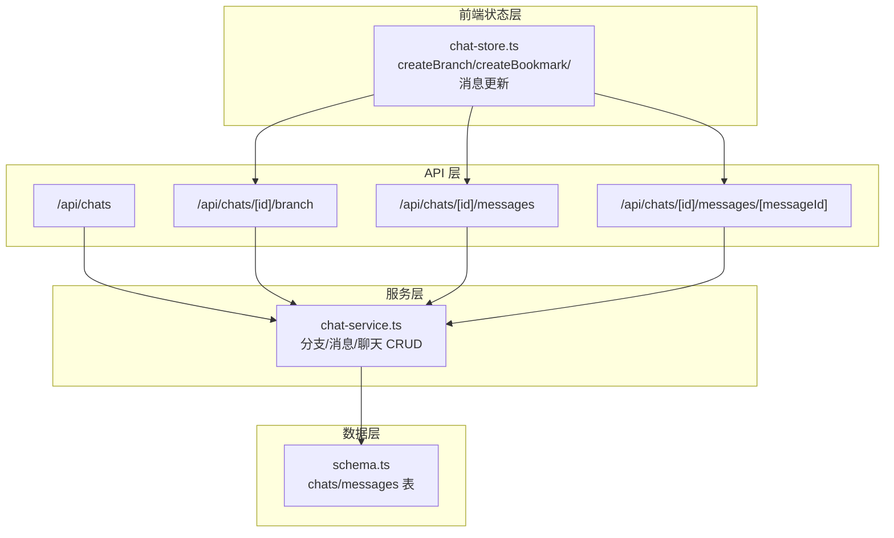
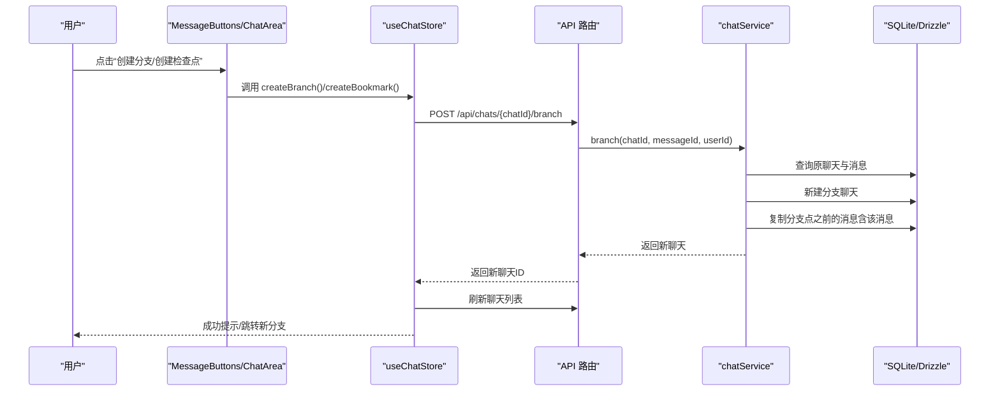
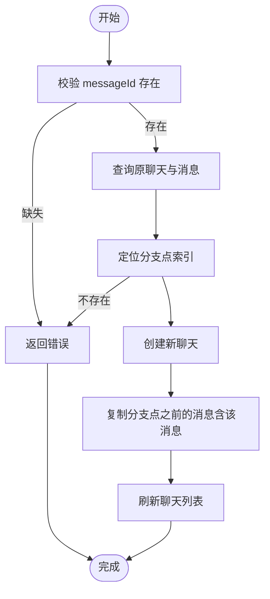
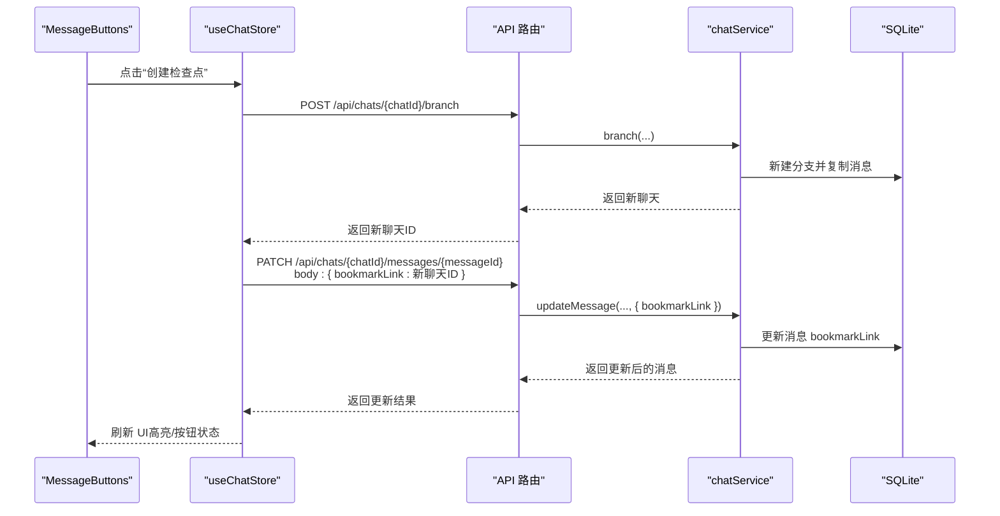
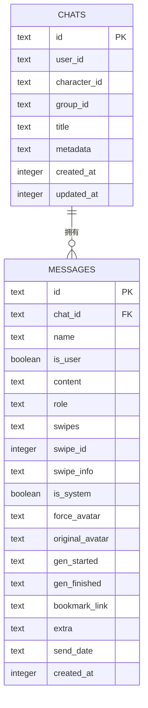
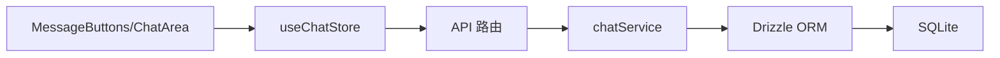

# 分支与书签

<cite>
**本文引用的文件**
- [src/app/api/chats/route.ts](file://src/app/api/chats/route.ts)
- [src/app/api/chats/[id]/branch/route.ts](file://src/app/api/chats/[id]/branch/route.ts)
- [src/app/api/chats/[id]/messages/route.ts](file://src/app/api/chats/[id]/messages/route.ts)
- [src/app/api/chats/[id]/messages/[messageId]/route.ts](file://src/app/api/chats/[id]/messages/[messageId]/route.ts)
- [src/stores/chat-store.ts](file://src/stores/chat-store.ts)
- [src/lib/services/chat-service.ts](file://src/lib/services/chat-service.ts)
- [src/lib/db/schema.ts](file://src/lib/db/schema.ts)
- [src/types/index.ts](file://src/types/index.ts)
- [src/components/chat/message-bubble/MessageButtons.tsx](file://src/components/chat/message-bubble/MessageButtons.tsx)
- [src/components/chat/chat-area.tsx](file://src/components/chat/chat-area.tsx)
</cite>

## 目录
1. [简介](#简介)
2. [项目结构](#项目结构)
3. [核心组件](#核心组件)
4. [架构总览](#架构总览)
5. [详细组件分析](#详细组件分析)
6. [依赖分析](#依赖分析)
7. [性能考虑](#性能考虑)
8. [故障排查指南](#故障排查指南)
9. [结论](#结论)
10. [附录](#附录)

## 简介
本文件系统性阐述“分支与书签”功能的设计与实现，覆盖以下要点：
- 聊天分支的创建机制与消息截断策略
- 分支之间的关联关系与继承规则
- 书签功能的实现原理（分支创建、书签链接设置与分支导航）
- 分支创建的触发条件、消息截断策略与分支继承规则
- 分支合并、删除与书签管理的操作流程
- 实际使用场景与操作示例

## 项目结构
围绕分支与书签功能，涉及三层：
- API 层：负责鉴权、路由与对外接口
- 服务层：封装业务逻辑（分支、消息 CRUD、聊天 CRUD）
- 前端状态层：Zustand Store 封装 UI 交互与持久化调用
- 数据层：Drizzle ORM 映射 SQLite 表结构

图表来源
- [src/app/api/chats/route.ts:1-45](file://src/app/api/chats/route.ts#L1-L45)
- [src/app/api/chats/[id]/branch/route.ts](file://src/app/api/chats/[id]/branch/route.ts#L1-L37)
- [src/app/api/chats/[id]/messages/route.ts](file://src/app/api/chats/[id]/messages/route.ts#L1-L65)
- [src/app/api/chats/[id]/messages/[messageId]/route.ts](file://src/app/api/chats/[id]/messages/[messageId]/route.ts#L33-L84)
- [src/lib/services/chat-service.ts:60-300](file://src/lib/services/chat-service.ts#L60-L300)
- [src/lib/db/schema.ts:131-168](file://src/lib/db/schema.ts#L131-L168)
- [src/stores/chat-store.ts:505-536](file://src/stores/chat-store.ts#L505-L536)

章节来源
- [src/app/api/chats/route.ts:1-45](file://src/app/api/chats/route.ts#L1-L45)
- [src/app/api/chats/[id]/branch/route.ts](file://src/app/api/chats/[id]/branch/route.ts#L1-L37)
- [src/app/api/chats/[id]/messages/route.ts](file://src/app/api/chats/[id]/messages/route.ts#L1-L65)
- [src/app/api/chats/[id]/messages/[messageId]/route.ts](file://src/app/api/chats/[id]/messages/[messageId]/route.ts#L33-L84)
- [src/lib/services/chat-service.ts:60-300](file://src/lib/services/chat-service.ts#L60-L300)
- [src/lib/db/schema.ts:131-168](file://src/lib/db/schema.ts#L131-L168)
- [src/stores/chat-store.ts:505-536](file://src/stores/chat-store.ts#L505-L536)

## 核心组件
- API 路由
  - GET /api/chats：按角色或群组筛选聊天列表
  - POST /api/chats：创建新聊天
  - POST /api/chats/[id]/branch：从某条消息开始创建分支
  - GET /api/chats/[id]/messages：获取聊天全部消息
  - PATCH /api/chats/[id]/messages/[messageId]：更新消息（含 bookmarkLink）
  - DELETE /api/chats/[id]/messages/[messageId]：删除消息
- 服务层
  - chatService：封装分支、消息、聊天 CRUD，校验用户归属
- 前端状态层
  - useChatStore：封装 createBranch、createBookmark、消息更新、删除、移动等
- 数据层
  - chats、messages 表：包含 bookmarkLink 字段，支持分支与书签

章节来源
- [src/app/api/chats/route.ts:5-44](file://src/app/api/chats/route.ts#L5-L44)
- [src/app/api/chats/[id]/branch/route.ts](file://src/app/api/chats/[id]/branch/route.ts#L5-L36)
- [src/app/api/chats/[id]/messages/route.ts](file://src/app/api/chats/[id]/messages/route.ts#L5-L64)
- [src/app/api/chats/[id]/messages/[messageId]/route.ts](file://src/app/api/chats/[id]/messages/[messageId]/route.ts#L33-L84)
- [src/lib/services/chat-service.ts:60-300](file://src/lib/services/chat-service.ts#L60-L300)
- [src/lib/db/schema.ts:131-168](file://src/lib/db/schema.ts#L131-L168)
- [src/stores/chat-store.ts:505-536](file://src/stores/chat-store.ts#L505-L536)

## 架构总览
分支与书签的端到端流程如下：

图表来源
- [src/components/chat/message-bubble/MessageButtons.tsx:128-149](file://src/components/chat/message-bubble/MessageButtons.tsx#L128-L149)
- [src/components/chat/chat-area.tsx:1398-1413](file://src/components/chat/chat-area.tsx#L1398-L1413)
- [src/stores/chat-store.ts:505-528](file://src/stores/chat-store.ts#L505-L528)
- [src/app/api/chats/[id]/branch/route.ts](file://src/app/api/chats/[id]/branch/route.ts#L10-L31)
- [src/lib/services/chat-service.ts:267-299](file://src/lib/services/chat-service.ts#L267-L299)

## 详细组件分析

### 分支创建机制
- 触发入口
  - UI 层通过 MessageButtons 的“创建分支”按钮触发
  - ChatArea 在消息气泡菜单中提供“创建分支”选项
- 后端流程
  - API 校验用户身份，解析请求体中的 messageId
  - chatService.branch：定位分支点，创建新聊天，复制分支点之前的所有消息（含该消息）
- 前端流程
  - useChatStore.createBranch：调用 API，刷新当前角色或群组的聊天列表，返回新聊天 ID

图表来源
- [src/app/api/chats/[id]/branch/route.ts](file://src/app/api/chats/[id]/branch/route.ts#L20-L31)
- [src/lib/services/chat-service.ts:267-299](file://src/lib/services/chat-service.ts#L267-L299)
- [src/stores/chat-store.ts:505-528](file://src/stores/chat-store.ts#L505-L528)

章节来源
- [src/components/chat/message-bubble/MessageButtons.tsx:128-149](file://src/components/chat/message-bubble/MessageButtons.tsx#L128-L149)
- [src/components/chat/chat-area.tsx:1398-1413](file://src/components/chat/chat-area.tsx#L1398-L1413)
- [src/stores/chat-store.ts:505-528](file://src/stores/chat-store.ts#L505-L528)
- [src/app/api/chats/[id]/branch/route.ts](file://src/app/api/chats/[id]/branch/route.ts#L10-L31)
- [src/lib/services/chat-service.ts:267-299](file://src/lib/services/chat-service.ts#L267-L299)

### 书签功能（检查点）
- 定义
  - 书签 = 分支 + 在原消息上记录 bookmarkLink 指向新分支
- 前端实现
  - useChatStore.createBookmark：先创建分支，再将 bookmarkLink 写回原消息
- UI 行为
  - MessageButtons 根据 bookmarkLink 决定是否展示“创建检查点/移除检查点”
  - 已标记消息在 UI 中以特定样式标识

图表来源
- [src/stores/chat-store.ts:530-536](file://src/stores/chat-store.ts#L530-L536)
- [src/app/api/chats/[id]/branch/route.ts](file://src/app/api/chats/[id]/branch/route.ts#L10-L31)
- [src/app/api/chats/[id]/messages/[messageId]/route.ts](file://src/app/api/chats/[id]/messages/[messageId]/route.ts#L33-L55)
- [src/lib/services/chat-service.ts:205-251](file://src/lib/services/chat-service.ts#L205-L251)

章节来源
- [src/stores/chat-store.ts:530-536](file://src/stores/chat-store.ts#L530-L536)
- [src/components/chat/message-bubble/MessageButtons.tsx:139-161](file://src/components/chat/message-bubble/MessageButtons.tsx#L139-L161)
- [src/app/api/chats/[id]/messages/[messageId]/route.ts](file://src/app/api/chats/[id]/messages/[messageId]/route.ts#L33-L55)

### 分支消息管理与截断策略
- 截断范围
  - 从分支点开始，复制分支点之前的所有消息（含该消息）
- 消息字段继承
  - name、isUser、content、role、extra、头像字段等均复制
- 时间顺序
  - 新分支的消息顺序与原分支点之前的顺序一致

章节来源
- [src/lib/services/chat-service.ts:284-296](file://src/lib/services/chat-service.ts#L284-L296)
- [src/types/index.ts:60-84](file://src/types/index.ts#L60-L84)

### 分支之间的关联关系与继承规则
- 继承内容
  - characterId、groupId、metadata 等聊天级元数据从原聊天继承
- 关联方式
  - 新分支与原分支在 UI 上通过“分支”标识区分，无外键约束
- 导航
  - 书签通过 bookmarkLink 指向新分支，便于快速回到检查点

章节来源
- [src/lib/services/chat-service.ts:277-282](file://src/lib/services/chat-service.ts#L277-L282)
- [src/lib/db/schema.ts:131-168](file://src/lib/db/schema.ts#L131-L168)

### 分支删除与消息删除
- 分支删除
  - API DELETE /api/chats/{id}：删除聊天及其所有消息（由数据库级联删除）
  - 前端 useChatStore.deleteChat：删除后刷新列表
- 消息删除
  - API DELETE /api/chats/{id}/messages/{messageId}：删除单条消息
  - 前端 useChatStore.deleteMessage：删除后同步本地

章节来源
- [src/app/api/chats/[id]/route.ts](file://src/app/api/chats/[id]/route.ts#L28-L50)
- [src/app/api/chats/[id]/messages/[messageId]/route.ts](file://src/app/api/chats/[id]/messages/[messageId]/route.ts#L62-L84)
- [src/stores/chat-store.ts:353-366](file://src/stores/chat-store.ts#L353-L366)

### 书签管理操作流程
- 创建检查点
  - 步骤：点击“创建检查点” -> 创建分支 -> 写回原消息 bookmarkLink
- 移除检查点
  - 步骤：点击“移除检查点” -> 清空原消息 bookmarkLink
- 导航检查点
  - UI 层根据 bookmarkLink 识别检查点消息，提供跳转入口（由 UI 组件负责）

章节来源
- [src/stores/chat-store.ts:530-536](file://src/stores/chat-store.ts#L530-L536)
- [src/components/chat/message-bubble/MessageButtons.tsx:150-161](file://src/components/chat/message-bubble/MessageButtons.tsx#L150-L161)

### 数据模型与字段映射
- messages 表新增 bookmarkLink 字段，用于书签指向
- ChatMessage 类型包含 bookmarkLink 字段，用于前端类型安全

图表来源
- [src/lib/db/schema.ts:131-168](file://src/lib/db/schema.ts#L131-L168)
- [src/types/index.ts:60-84](file://src/types/index.ts#L60-L84)

## 依赖分析
- 组件耦合
  - UI 通过 useChatStore 调用 API，API 调用 chatService，chatService 操作 Drizzle ORM
- 外部依赖
  - Drizzle ORM（SQLite）
  - Next.js 路由器（API 路由）
- 潜在循环
  - 无直接循环依赖，职责清晰分层

图表来源
- [src/stores/chat-store.ts:505-536](file://src/stores/chat-store.ts#L505-L536)
- [src/app/api/chats/[id]/branch/route.ts](file://src/app/api/chats/[id]/branch/route.ts#L10-L31)
- [src/lib/services/chat-service.ts:60-300](file://src/lib/services/chat-service.ts#L60-L300)

章节来源
- [src/stores/chat-store.ts:505-536](file://src/stores/chat-store.ts#L505-L536)
- [src/app/api/chats/[id]/branch/route.ts](file://src/app/api/chats/[id]/branch/route.ts#L10-L31)
- [src/lib/services/chat-service.ts:60-300](file://src/lib/services/chat-service.ts#L60-L300)

## 性能考虑
- 分支复制
  - 复制数量与分支点之前的消息数线性相关，建议控制分支点位置避免过长历史
- 并发更新
  - 消息移动与更新采用并发 PATCH，减少等待时间
- 列表刷新
  - 分支创建后统一刷新当前角色或群组的聊天列表，避免重复请求

## 故障排查指南
- 分支创建失败
  - 检查 messageId 是否存在；确认用户身份；查看服务端日志
- 书签无效
  - 确认原消息的 bookmarkLink 已正确写回；检查新分支是否存在
- 消息删除异常
  - 确认聊天归属校验通过；检查数据库级联删除是否生效

章节来源
- [src/app/api/chats/[id]/branch/route.ts](file://src/app/api/chats/[id]/branch/route.ts#L20-L31)
- [src/app/api/chats/[id]/messages/[messageId]/route.ts](file://src/app/api/chats/[id]/messages/[messageId]/route.ts#L33-L55)
- [src/lib/services/chat-service.ts:205-251](file://src/lib/services/chat-service.ts#L205-L251)

## 结论
分支与书签功能通过“从某条消息开始复制历史”的方式，实现了对聊天历史的可控截断与复用。书签作为“检查点”，在不改变原聊天的前提下提供了便捷导航能力。整体设计遵循前后端分层、类型安全与数据库一致性原则，具备良好的可维护性与扩展性。

## 附录

### 实际使用场景与操作示例
- 场景一：尝试不同回复风格
  - 在助手消息处创建分支，对比不同风格的回复
- 场景二：保存关键对话节点
  - 对重要结论消息创建检查点，便于后续快速回到该节点
- 场景三：清理冗余历史
  - 删除不需要的历史消息，保持对话简洁

操作步骤（以 UI 为主）：
- 创建分支：在目标消息的菜单中选择“创建分支”，确认后跳转到新分支
- 创建检查点：在目标消息的菜单中选择“创建检查点”，完成后原消息高亮显示
- 移除检查点：在已标记消息的菜单中选择“移除检查点”，确认后清除标记

章节来源
- [src/components/chat/message-bubble/MessageButtons.tsx:128-161](file://src/components/chat/message-bubble/MessageButtons.tsx#L128-L161)
- [src/components/chat/chat-area.tsx:1398-1433](file://src/components/chat/chat-area.tsx#L1398-L1433)
- [src/stores/chat-store.ts:505-536](file://src/stores/chat-store.ts#L505-L536)