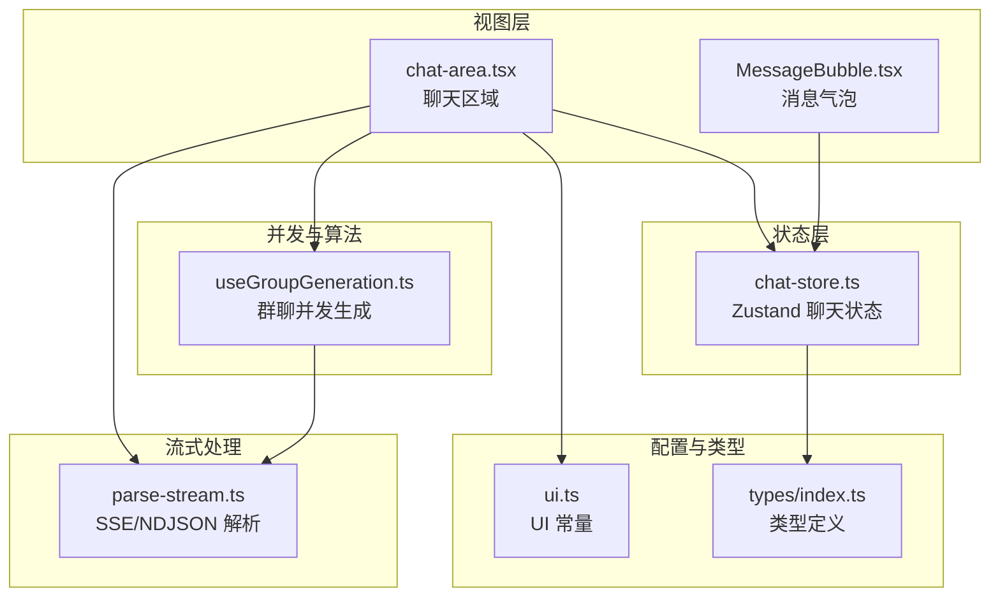
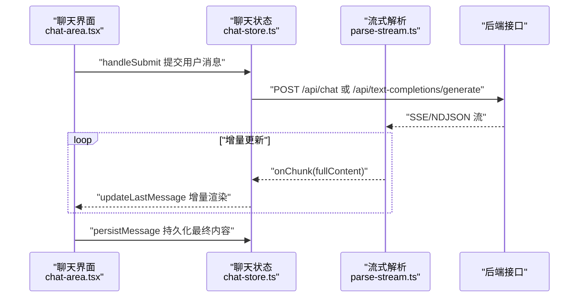
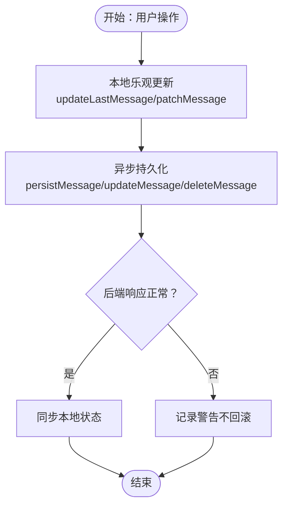
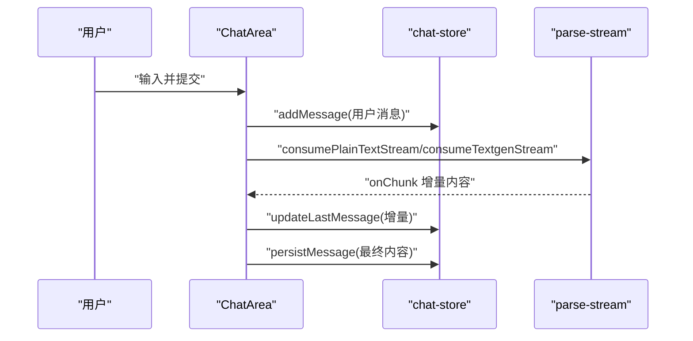
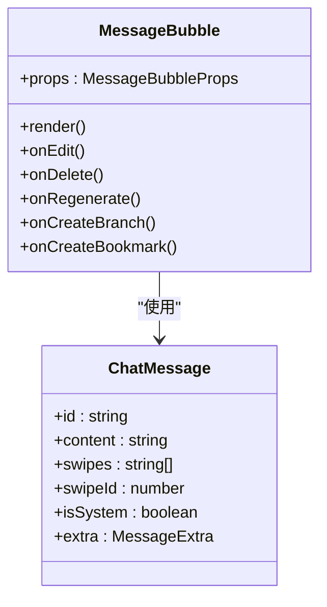
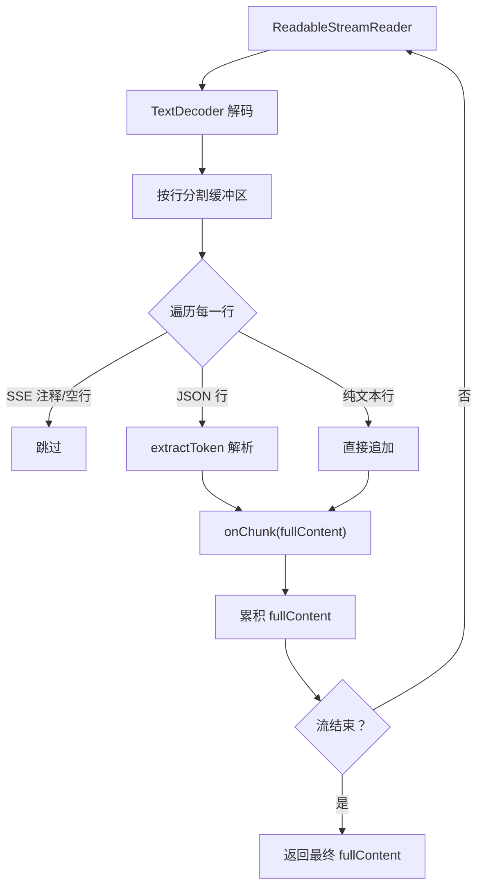
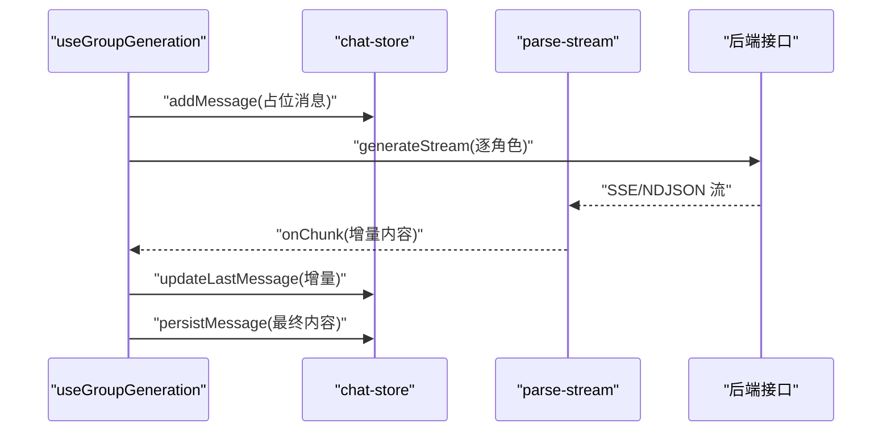
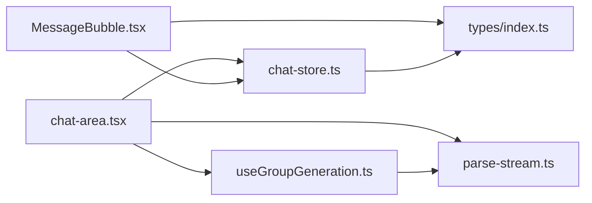

# 性能优化与内存管理

<cite>
**本文档引用的文件**
- [chat-store.ts](file://src/stores/chat-store.ts)
- [chat-area.tsx](file://src/components/chat/chat-area.tsx)
- [MessageBubble.tsx](file://src/components/chat/message-bubble/MessageBubble.tsx)
- [parse-stream.ts](file://src/lib/textgen/parse-stream.ts)
- [useGroupGeneration.ts](file://src/hooks/useGroupGeneration.ts)
- [ui.ts](file://src/lib/constants/ui.ts)
- [index.ts](file://src/types/index.ts)
</cite>

## 目录
1. [引言](#引言)
2. [项目结构](#项目结构)
3. [核心组件](#核心组件)
4. [架构总览](#架构总览)
5. [详细组件分析](#详细组件分析)
6. [依赖关系分析](#依赖关系分析)
7. [性能考量](#性能考量)
8. [故障排查指南](#故障排查指南)
9. [结论](#结论)
10. [附录](#附录)

## 引言
本文件聚焦于聊天状态管理的性能优化与内存管理策略，围绕以下目标展开：
- 深入解释聊天状态的内存管理策略、大数据量聊天的处理机制和状态更新的优化技巧
- 详细说明消息的懒加载、虚拟滚动和状态缓存的实现
- 阐述异步操作的并发处理、网络请求的节流和防抖机制
- 包含内存泄漏的预防措施、状态清理和垃圾回收的优化策略
- 提供性能监控、瓶颈分析和优化建议的实际案例

## 项目结构
本项目采用基于功能域的组织方式，聊天相关的核心位于 stores、components、hooks 和 lib 目录：
- 状态管理：src/stores/chat-store.ts（Zustand）
- UI 展示：src/components/chat/*
- 流式解析：src/lib/textgen/parse-stream.ts
- 群聊并发：src/hooks/useGroupGeneration.ts
- 常量与配置：src/lib/constants/ui.ts
- 类型定义：src/types/index.ts

图表来源
- [chat-store.ts:105-583](file://src/stores/chat-store.ts#L105-L583)
- [chat-area.tsx:34-1800](file://src/components/chat/chat-area.tsx#L34-L1800)
- [MessageBubble.tsx:60-280](file://src/components/chat/message-bubble/MessageBubble.tsx#L60-L280)
- [parse-stream.ts:1-116](file://src/lib/textgen/parse-stream.ts#L1-L116)
- [useGroupGeneration.ts:59-738](file://src/hooks/useGroupGeneration.ts#L59-L738)
- [ui.ts:1-13](file://src/lib/constants/ui.ts#L1-L13)
- [index.ts:60-131](file://src/types/index.ts#L60-L131)

章节来源
- [chat-store.ts:105-583](file://src/stores/chat-store.ts#L105-L583)
- [chat-area.tsx:34-1800](file://src/components/chat/chat-area.tsx#L34-L1800)
- [MessageBubble.tsx:60-280](file://src/components/chat/message-bubble/MessageBubble.tsx#L60-L280)
- [parse-stream.ts:1-116](file://src/lib/textgen/parse-stream.ts#L1-L116)
- [useGroupGeneration.ts:59-738](file://src/hooks/useGroupGeneration.ts#L59-L738)
- [ui.ts:1-13](file://src/lib/constants/ui.ts#L1-L13)
- [index.ts:60-131](file://src/types/index.ts#L60-L131)

## 核心组件
- Zustand 聊天状态存储：负责当前聊天、聊天列表、角色、生成状态以及 CRUD 操作的本地与远程同步
- 聊天区域组件：负责输入、提交、流式渲染、滚动控制、搜索与多选
- 消息气泡组件：负责单条消息的渲染、编辑、隐藏、重生成、分支与书签
- 流式解析工具：统一处理不同后端的 SSE/NDJSON 输出，增量更新 UI
- 群聊并发 Hook：封装多角色生成、截断、批次管理与并发控制
- UI 常量：集中管理防抖、延迟等 UI 行为参数

章节来源
- [chat-store.ts:15-103](file://src/stores/chat-store.ts#L15-L103)
- [chat-area.tsx:34-1800](file://src/components/chat/chat-area.tsx#L34-L1800)
- [MessageBubble.tsx:14-54](file://src/components/chat/message-bubble/MessageBubble.tsx#L14-L54)
- [parse-stream.ts:10-116](file://src/lib/textgen/parse-stream.ts#L10-L116)
- [useGroupGeneration.ts:59-738](file://src/hooks/useGroupGeneration.ts#L59-L738)
- [ui.ts:5-12](file://src/lib/constants/ui.ts#L5-L12)

## 架构总览
系统采用“状态驱动 UI”的架构，Zustand 管理聊天状态，组件通过 action 更新状态并触发网络请求。流式响应通过 ReadableStream 逐步解码并增量更新 UI，避免一次性渲染大文本带来的阻塞。

图表来源
- [chat-area.tsx:533-683](file://src/components/chat/chat-area.tsx#L533-L683)
- [chat-store.ts:235-272](file://src/stores/chat-store.ts#L235-L272)
- [parse-stream.ts:38-99](file://src/lib/textgen/parse-stream.ts#L38-L99)

## 详细组件分析

### Zustand 聊天状态存储（内存管理与状态更新优化）
- 状态结构与职责
  - currentChat：当前聊天对象，包含 messages 数组
  - chats：当前角色/群组的聊天列表
  - currentCharacter/isGenerating：角色与生成状态
  - 本地动作：addMessage/updateLastMessage/patchMessage/removeMessageLocal
  - 异步动作：startNewChat/loadChat/loadChatsForCharacter/loadOrCreateGroupChat 等
- 内存管理策略
  - 本地状态更新采用不可变更新（复制数组/对象），避免深层引用污染
  - 持久化消息时自动回写服务端 ID，解决分支/检查点定位问题
  - 删除消息时先本地移除再调用后端 DELETE，减少 UI 闪烁
- 并发与一致性
  - moveMessage 通过并发 PATCH 保证两条消息的 createdAt 交换
  - setActiveSwipe 本地乐观更新 + 异步持久化，失败不回滚
- 优化技巧
  - 通过局部选择器订阅（如 useChatStore(s => s.currentChat)）降低渲染范围
  - 本地乐观更新（renameChat、setMessageHidden）提升交互响应速度

图表来源
- [chat-store.ts:121-139](file://src/stores/chat-store.ts#L121-L139)
- [chat-store.ts:235-272](file://src/stores/chat-store.ts#L235-L272)
- [chat-store.ts:335-351](file://src/stores/chat-store.ts#L335-L351)
- [chat-store.ts:353-366](file://src/stores/chat-store.ts#L353-L366)
- [chat-store.ts:368-388](file://src/stores/chat-store.ts#L368-L388)

章节来源
- [chat-store.ts:15-103](file://src/stores/chat-store.ts#L15-L103)
- [chat-store.ts:105-583](file://src/stores/chat-store.ts#L105-L583)

### 聊天区域组件（输入、流式渲染与滚动控制）
- 输入与提交
  - 支持斜杠命令优先处理，避免连接检查与生成流程
  - 用户消息即时添加到 UI，随后持久化
- 流式渲染
  - 根据 activeCategory 决定走 /api/chat 或 /api/text-completions/generate
  - 使用 ReadableStream 逐步解码，通过 onChunk 增量更新最后一条 assistant 消息
- 滚动与可见性
  - 监听容器滚动，距离底部阈值判断是否自动滚动到底
  - 首次进入会话时直接跳到底部，提升用户体验
- 搜索与多选
  - Ctrl+F 唤出搜索栏，支持高亮与导航
  - 多选模式支持批量导出与操作

图表来源
- [chat-area.tsx:533-683](file://src/components/chat/chat-area.tsx#L533-L683)
- [chat-area.tsx:300-320](file://src/components/chat/chat-area.tsx#L300-L320)
- [chat-area.tsx:151-176](file://src/components/chat/chat-area.tsx#L151-L176)
- [parse-stream.ts:101-116](file://src/lib/textgen/parse-stream.ts#L101-L116)

章节来源
- [chat-area.tsx:34-1800](file://src/components/chat/chat-area.tsx#L34-L1800)
- [parse-stream.ts:1-116](file://src/lib/textgen/parse-stream.ts#L1-L116)

### 消息气泡组件（渲染与交互）
- 渲染策略
  - 根据 isUser/isSystem/swipes 等字段决定头像、样式与按钮
  - 支持编辑、复制、删除、隐藏、重生成、分支、书签、翻译、朗读、移动等操作
- Swipe 系统
  - left/right 箭头切换不同版本，计数器显示总数
  - 通过 useChatStore.getState() 直接读取最新状态，确保并发更新正确

图表来源
- [MessageBubble.tsx:60-233](file://src/components/chat/message-bubble/MessageBubble.tsx#L60-L233)
- [index.ts:60-84](file://src/types/index.ts#L60-L84)

章节来源
- [MessageBubble.tsx:14-280](file://src/components/chat/message-bubble/MessageBubble.tsx#L14-L280)
- [index.ts:60-131](file://src/types/index.ts#L60-L131)

### 流式解析工具（跨后端兼容与增量更新）
- 兼容性
  - 统一处理多种后端的 SSE/NDJSON 输出，提取 token 片段
  - 支持纯文本流与 JSONL 流，分别对应不同的解析路径
- 增量更新
  - 每收到一段 token，调用 onChunk(fullContent)，UI 实时更新
  - 末尾缓冲处理，确保最后一行也被正确解析

图表来源
- [parse-stream.ts:38-99](file://src/lib/textgen/parse-stream.ts#L38-L99)

章节来源
- [parse-stream.ts:1-116](file://src/lib/textgen/parse-stream.ts#L1-L116)

### 群聊并发生成（多角色、批次与截断）
- 并发策略
  - 逐角色生成，使用 AbortController 控制中止
  - 支持 continue/impersonate/swipe/normal/auto 多种模式
- 截断与安全
  - 检测其他角色名称，若出现即截断，避免生成混淆内容
  - 使用 gen_id 标识批次，支持整批重生
- 优化点
  - 本地占位消息 + 异步持久化，减少 UI 抖动
  - 多成员群聊时在 history 末尾追加 OOC 指令，约束角色身份

图表来源
- [useGroupGeneration.ts:276-447](file://src/hooks/useGroupGeneration.ts#L276-L447)
- [useGroupGeneration.ts:449-691](file://src/hooks/useGroupGeneration.ts#L449-L691)
- [parse-stream.ts:38-99](file://src/lib/textgen/parse-stream.ts#L38-L99)

章节来源
- [useGroupGeneration.ts:59-738](file://src/hooks/useGroupGeneration.ts#L59-L738)
- [parse-stream.ts:1-116](file://src/lib/textgen/parse-stream.ts#L1-L116)

### UI 常量与防抖/节流
- 常量定义
  - DROPDOWN_HIDE_DELAY：下拉菜单隐藏延迟，避免 mousedown 与 blur 冲突
  - DEBOUNCE_INPUT_MS：文本输入防抖延迟，减少频繁搜索/过滤
  - SAVE_FEEDBACK_MS：保存反馈消失延迟
- 应用场景
  - ChatArea 中的搜索与输入框建议浮层
  - 多选与批量操作的确认反馈

章节来源
- [ui.ts:5-12](file://src/lib/constants/ui.ts#L5-L12)

## 依赖关系分析
- 组件依赖
  - chat-area.tsx 依赖 chat-store、parse-stream、useGroupGeneration
  - MessageBubble.tsx 依赖 chat-store 状态与 types 定义
- 状态依赖
  - chat-store 依赖 types 中的 Chat/ChatMessage/Character 等类型
- 并发依赖
  - useGroupGeneration 依赖 connection-store、formatting-store、textgen-preset-store、worldinfo-store

图表来源
- [chat-area.tsx:34-1800](file://src/components/chat/chat-area.tsx#L34-L1800)
- [MessageBubble.tsx:60-280](file://src/components/chat/message-bubble/MessageBubble.tsx#L60-L280)
- [chat-store.ts:105-583](file://src/stores/chat-store.ts#L105-L583)
- [parse-stream.ts:1-116](file://src/lib/textgen/parse-stream.ts#L1-L116)
- [useGroupGeneration.ts:59-738](file://src/hooks/useGroupGeneration.ts#L59-L738)
- [index.ts:60-131](file://src/types/index.ts#L60-L131)

章节来源
- [chat-area.tsx:34-1800](file://src/components/chat/chat-area.tsx#L34-L1800)
- [MessageBubble.tsx:60-280](file://src/components/chat/message-bubble/MessageBubble.tsx#L60-L280)
- [chat-store.ts:105-583](file://src/stores/chat-store.ts#L105-L583)
- [parse-stream.ts:1-116](file://src/lib/textgen/parse-stream.ts#L1-L116)
- [useGroupGeneration.ts:59-738](file://src/hooks/useGroupGeneration.ts#L59-L738)
- [index.ts:60-131](file://src/types/index.ts#L60-L131)

## 性能考量
- 内存管理策略
  - 不可变更新：所有状态变更通过浅拷贝/映射创建新对象，避免共享引用导致的意外更新
  - 本地乐观更新：renameChat、setMessageHidden 等操作先更新本地，再异步持久化，减少等待时间
  - 按需持久化：用户消息先本地显示，流式结束后再持久化最终内容，避免重复写入
- 大数据量聊天处理
  - 流式渲染：通过增量更新避免一次性渲染超长文本，降低主线程压力
  - 滚动优化：仅在接近底部时自动滚动，减少不必要的布局计算
- 并发与网络
  - moveMessage 使用 Promise.all 并发 PATCH 两条消息，缩短等待时间
  - 群聊并发：逐角色生成，使用 AbortController 控制中止，避免资源浪费
- 防抖与节流
  - DEBOUNCE_INPUT_MS 用于输入搜索与建议，减少高频事件触发
  - DROPDOWN_HIDE_DELAY 避免 UI 闪烁与交互冲突

[本节为通用性能指导，无需特定文件引用]

## 故障排查指南
- 流式渲染异常
  - 确认后端返回 Content-Type 正确，SSE/NDJSON 格式符合预期
  - 检查 onChunk 回调是否被正确调用，避免 UI 不更新
- 并发更新冲突
  - 群聊生成时注意 isGenerating 状态，避免同时进行多个生成任务
  - 使用 AbortController 中止生成，确保状态恢复
- 状态不一致
  - 检查本地乐观更新后的持久化是否成功，失败时记录日志但不回滚
  - 删除消息时先本地移除再调用后端 DELETE，避免 UI 闪烁

章节来源
- [chat-area.tsx:672-683](file://src/components/chat/chat-area.tsx#L672-L683)
- [chat-store.ts:460-494](file://src/stores/chat-store.ts#L460-L494)
- [useGroupGeneration.ts:449-691](file://src/hooks/useGroupGeneration.ts#L449-L691)

## 结论
本项目通过 Zustand 状态管理、流式增量渲染、并发控制与合理的 UI 常量配置，在保证交互流畅的同时有效控制了内存占用与网络开销。针对大数据量聊天，建议结合懒加载与虚拟滚动进一步优化渲染性能；针对网络请求，建议引入统一的节流/防抖与缓存策略，以应对高并发场景。

[本节为总结性内容，无需特定文件引用]

## 附录
- Swipe 系统与分支/书签
  - appendSwipe/createBranch/createBookmark 等操作通过本地乐观更新与异步持久化协同工作
- 搜索与多选
  - ChatSearchBar 与多选模式配合，支持批量导出与操作
- 类型与扩展
  - MessageExtra 支持运行时扩展字段，便于记录生成元数据与媒体附件

章节来源
- [chat-store.ts:390-536](file://src/stores/chat-store.ts#L390-L536)
- [chat-area.tsx:151-176](file://src/components/chat/chat-area.tsx#L151-L176)
- [index.ts:97-131](file://src/types/index.ts#L97-L131)