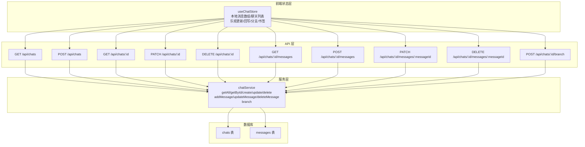
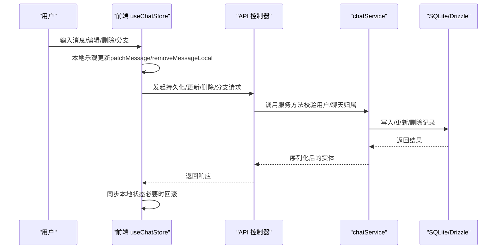
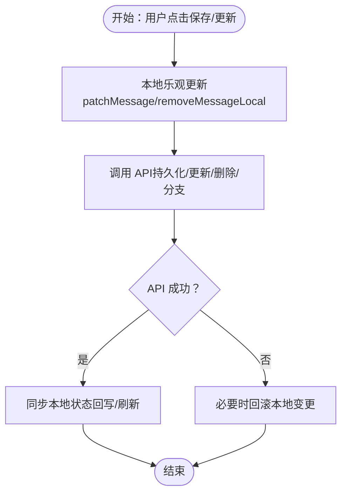
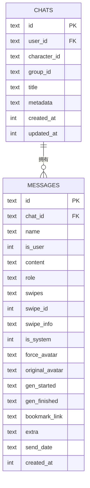
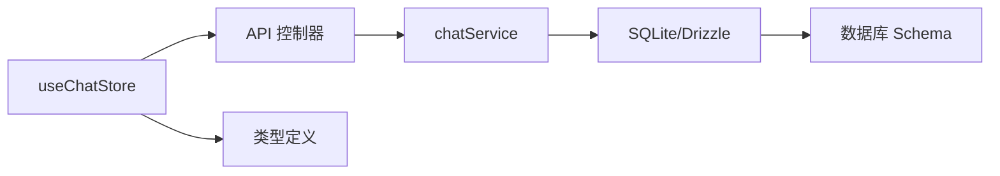
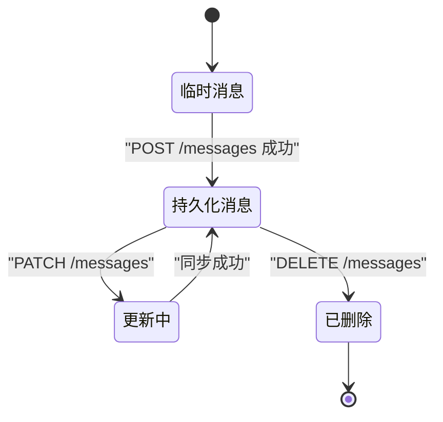

# 消息管理

<cite>
**本文引用的文件**
- [src/app/api/chats/route.ts](file://src/app/api/chats/route.ts)
- [src/app/api/chats/[id]/route.ts](file://src/app/api/chats/[id]/route.ts)
- [src/app/api/chats/[id]/messages/route.ts](file://src/app/api/chats/[id]/messages/route.ts)
- [src/app/api/chats/[id]/messages/[messageId]/route.ts](file://src/app/api/chats/[id]/messages/[messageId]/route.ts)
- [src/app/api/chats/[id]/branch/route.ts](file://src/app/api/chats/[id]/branch/route.ts)
- [src/lib/services/chat-service.ts](file://src/lib/services/chat-service.ts)
- [src/stores/chat-store.ts](file://src/stores/chat-store.ts)
- [src/lib/db/schema.ts](file://src/lib/db/schema.ts)
- [src/lib/db/index.ts](file://src/lib/db/index.ts)
- [src/types/index.ts](file://src/types/index.ts)
- [src/components/chat/message-bubble/MessageBubble.tsx](file://src/components/chat/message-bubble/MessageBubble.tsx)
- [src/components/chat/message-bubble/MessageEditor.tsx](file://src/components/chat/message-bubble/MessageEditor.tsx)
</cite>

## 目录
1. [简介](#简介)
2. [项目结构](#项目结构)
3. [核心组件](#核心组件)
4. [架构总览](#架构总览)
5. [详细组件分析](#详细组件分析)
6. [依赖关系分析](#依赖关系分析)
7. [性能考量](#性能考量)
8. [故障排查指南](#故障排查指南)
9. [结论](#结论)
10. [附录](#附录)

## 简介
本文件系统性梳理消息管理子系统的设计与实现，覆盖消息的创建、更新、删除与持久化流程，解释本地状态管理与数据库同步机制，阐述消息状态生命周期（从临时消息到持久化消息的转换）、实时更新与流式响应处理、以及消息状态同步策略。同时给出错误处理、性能优化与内存管理建议，并提供可操作的消息操作示例与最佳实践。

## 项目结构
消息管理涉及三层协作：
- API 层：提供 REST 接口，负责鉴权与请求转发至服务层。
- 服务层：封装数据库访问与业务规则，保证事务一致性与数据序列化。
- 前端状态层：使用轻量状态管理在本地维护聊天与消息，支持乐观更新与回滚策略，并与服务层双向同步。

图表来源
- [src/app/api/chats/route.ts:1-45](file://src/app/api/chats/route.ts#L1-L45)
- [src/app/api/chats/[id]/route.ts](file://src/app/api/chats/[id]/route.ts#L1-L74)
- [src/app/api/chats/[id]/messages/route.ts](file://src/app/api/chats/[id]/messages/route.ts#L1-L65)
- [src/app/api/chats/[id]/messages/[messageId]/route.ts](file://src/app/api/chats/[id]/messages/[messageId]/route.ts#L1-L85)
- [src/app/api/chats/[id]/branch/route.ts](file://src/app/api/chats/[id]/branch/route.ts#L1-L37)
- [src/lib/services/chat-service.ts:60-301](file://src/lib/services/chat-service.ts#L60-L301)
- [src/lib/db/schema.ts:129-168](file://src/lib/db/schema.ts#L129-L168)
- [src/stores/chat-store.ts:105-583](file://src/stores/chat-store.ts#L105-L583)

章节来源
- [src/app/api/chats/route.ts:1-45](file://src/app/api/chats/route.ts#L1-L45)
- [src/app/api/chats/[id]/route.ts](file://src/app/api/chats/[id]/route.ts#L1-L74)
- [src/app/api/chats/[id]/messages/route.ts](file://src/app/api/chats/[id]/messages/route.ts#L1-L65)
- [src/app/api/chats/[id]/messages/[messageId]/route.ts](file://src/app/api/chats/[id]/messages/[messageId]/route.ts#L1-L85)
- [src/app/api/chats/[id]/branch/route.ts](file://src/app/api/chats/[id]/branch/route.ts#L1-L37)
- [src/lib/services/chat-service.ts:60-301](file://src/lib/services/chat-service.ts#L60-L301)
- [src/lib/db/schema.ts:129-168](file://src/lib/db/schema.ts#L129-L168)
- [src/stores/chat-store.ts:105-583](file://src/stores/chat-store.ts#L105-L583)

## 核心组件
- API 控制器：提供聊天与消息的 CRUD、分支等接口，统一鉴权与错误处理。
- 服务层（chatService）：封装数据库访问、序列化/反序列化、业务校验与一致性更新。
- 前端状态层（useChatStore）：维护当前聊天、消息列表与生成状态，支持乐观更新、分支/书签、Swipe 切换、消息移动等交互。
- 数据模型（types）：定义消息、聊天、Swipe 元信息与扩展字段。
- 数据库 Schema：定义 chats 与 messages 表结构及外键约束。

章节来源
- [src/lib/services/chat-service.ts:60-301](file://src/lib/services/chat-service.ts#L60-L301)
- [src/stores/chat-store.ts:15-103](file://src/stores/chat-store.ts#L15-L103)
- [src/types/index.ts:58-149](file://src/types/index.ts#L58-L149)
- [src/lib/db/schema.ts:129-168](file://src/lib/db/schema.ts#L129-L168)

## 架构总览
消息管理采用“前端乐观 + 后端权威”的设计：
- 前端在本地即时渲染用户输入与流式生成中间态，提升交互流畅度。
- 后端负责持久化与一致性校验，确保跨设备与会话间的数据正确性。
- 前端在关键操作（如消息持久化、更新、删除、分支）后，以“回写/回滚”策略与后端保持同步。

图表来源
- [src/stores/chat-store.ts:235-272](file://src/stores/chat-store.ts#L235-L272)
- [src/app/api/chats/[id]/messages/route.ts](file://src/app/api/chats/[id]/messages/route.ts#L29-L64)
- [src/lib/services/chat-service.ts:147-203](file://src/lib/services/chat-service.ts#L147-L203)
- [src/lib/db/schema.ts:144-168](file://src/lib/db/schema.ts#L144-L168)

## 详细组件分析

### API 层：聊天与消息接口
- 聊天集合与单聊
  - GET /api/chats：按角色或群组筛选，返回聊天列表（不含消息）。
  - POST /api/chats：创建新聊天。
  - GET /api/chats/:id：获取完整聊天（含消息）。
  - PATCH /api/chats/:id：更新标题/元数据。
  - DELETE /api/chats/:id：删除聊天（消息由外键级联删除）。
- 消息集合与单条消息
  - GET /api/chats/:id/messages：获取聊天全部消息。
  - POST /api/chats/:id/messages：添加消息（含 swipes、extra、头像等）。
  - PATCH /api/chats/:id/messages/:messageId：更新消息（内容、swipe、隐藏、书签、时间等）。
  - DELETE /api/chats/:id/messages/:messageId：删除消息。
- 分支
  - POST /api/chats/:id/branch：从某条消息开始复制到新聊天。

章节来源
- [src/app/api/chats/route.ts:1-45](file://src/app/api/chats/route.ts#L1-L45)
- [src/app/api/chats/[id]/route.ts](file://src/app/api/chats/[id]/route.ts#L1-L74)
- [src/app/api/chats/[id]/messages/route.ts](file://src/app/api/chats/[id]/messages/route.ts#L1-L65)
- [src/app/api/chats/[id]/messages/[messageId]/route.ts](file://src/app/api/chats/[id]/messages/[messageId]/route.ts#L1-L85)
- [src/app/api/chats/[id]/branch/route.ts](file://src/app/api/chats/[id]/branch/route.ts#L1-L37)

### 服务层：chatService
- 查询与过滤
  - getAll：支持按角色或群组筛选，按 updatedAt 降序返回聊天列表。
  - getById：返回聊天及其全部消息，按 createdAt 升序排列。
- 写入与更新
  - create：生成 UUID，写入 chats，返回完整聊天。
  - addMessage：校验聊天归属，写入 messages，同时更新聊天 updatedAt。
  - updateMessage：增量更新消息字段（content、swipes、extra、头像、生成时间、书签等），并更新聊天 updatedAt。
  - deleteMessage：校验聊天归属后删除消息。
  - branch：从某条消息开始复制到新聊天，保留分支点之前的完整历史。
- 序列化与安全解析
  - serializeChat/serializeMessage：将数据库行转为 Chat/ChatMessage，JSON 字段安全解析与默认值处理。

章节来源
- [src/lib/services/chat-service.ts:60-301](file://src/lib/services/chat-service.ts#L60-L301)

### 前端状态层：useChatStore
- 本地状态
  - currentChat、chats、currentCharacter、isGenerating。
  - addMessage、updateLastMessage、patchMessage、removeMessageLocal 等纯本地操作。
- 异步动作（与 DB 联动）
  - startNewChat：创建聊天并可注入首条消息，随后刷新列表。
  - loadChat/loadChatsForCharacter/loadChatsForGroup：拉取远端数据并更新本地。
  - persistMessage：POST 新消息，成功后若服务端返回真实 ID，回写本地以保证分支/检查点引用稳定。
  - updateMessage：PATCH 单条消息，成功后本地同步。
  - deleteMessage：DELETE 单条消息，成功后本地移除。
  - setActiveSwipe/appendSwipe/deleteSwipe：维护 swipes 数组与 active swipe，先本地再异步持久化。
  - setMessageHidden/moveMessage/addEmptyReasoning/createBranch/createBookmark/renameChat/deleteChat：覆盖常见交互与分支/书签/重命名等场景。
- 乐观更新与回滚
  - renameChat：本地乐观更新 title，失败时可回滚。
  - moveMessage：本地先交换 createdAt，再并发 PATCH 两条消息，任一失败不影响另一条。
  - appendSwipe：本地立即切换 active swipe，随后异步持久化，失败不回滚但本地仍保持最新。

图表来源
- [src/stores/chat-store.ts:538-559](file://src/stores/chat-store.ts#L538-L559)
- [src/stores/chat-store.ts:460-494](file://src/stores/chat-store.ts#L460-L494)
- [src/stores/chat-store.ts:390-422](file://src/stores/chat-store.ts#L390-L422)

章节来源
- [src/stores/chat-store.ts:15-103](file://src/stores/chat-store.ts#L15-L103)
- [src/stores/chat-store.ts:167-209](file://src/stores/chat-store.ts#L167-L209)
- [src/stores/chat-store.ts:235-272](file://src/stores/chat-store.ts#L235-L272)
- [src/stores/chat-store.ts:335-351](file://src/stores/chat-store.ts#L335-L351)
- [src/stores/chat-store.ts:353-366](file://src/stores/chat-store.ts#L353-L366)
- [src/stores/chat-store.ts:368-388](file://src/stores/chat-store.ts#L368-L388)
- [src/stores/chat-store.ts:390-422](file://src/stores/chat-store.ts#L390-L422)
- [src/stores/chat-store.ts:424-452](file://src/stores/chat-store.ts#L424-L452)
- [src/stores/chat-store.ts:454-458](file://src/stores/chat-store.ts#L454-L458)
- [src/stores/chat-store.ts:460-494](file://src/stores/chat-store.ts#L460-L494)
- [src/stores/chat-store.ts:496-503](file://src/stores/chat-store.ts#L496-L503)
- [src/stores/chat-store.ts:505-536](file://src/stores/chat-store.ts#L505-L536)
- [src/stores/chat-store.ts:538-559](file://src/stores/chat-store.ts#L538-L559)
- [src/stores/chat-store.ts:561-581](file://src/stores/chat-store.ts#L561-L581)

### 数据模型与数据库结构
- 类型定义
  - ChatMessage：包含 swipes、swipeId、swipeInfo、isSystem、头像字段、生成时间、书签、extra 扩展等。
  - MessageExtra：承载模型/推理/媒体/其他运行时状态。
- 数据库表
  - chats：用户、角色/群组、标题、元数据、时间戳。
  - messages：消息正文、角色、swipes/swipeId/swipeInfo、隐藏、头像、生成时间、书签、extra、发送时间、创建时间。

图表来源
- [src/lib/db/schema.ts:129-168](file://src/lib/db/schema.ts#L129-L168)
- [src/types/index.ts:58-149](file://src/types/index.ts#L58-L149)

章节来源
- [src/types/index.ts:58-149](file://src/types/index.ts#L58-L149)
- [src/lib/db/schema.ts:129-168](file://src/lib/db/schema.ts#L129-L168)

### UI 组件：消息气泡与编辑器
- MessageBubble：渲染消息头像、推理块、正文，支持编辑、复制、删除、分支、书签、上下移动、Swipe 切换与选择器。
- MessageEditor：提供多行编辑、快捷键保存/取消、复制、添加推理、上下移动、删除等。

章节来源
- [src/components/chat/message-bubble/MessageBubble.tsx:1-280](file://src/components/chat/message-bubble/MessageBubble.tsx#L1-L280)
- [src/components/chat/message-bubble/MessageEditor.tsx:1-139](file://src/components/chat/message-bubble/MessageEditor.tsx#L1-L139)

## 依赖关系分析
- API 控制器依赖鉴权模块与 chatService。
- chatService 依赖 Drizzle ORM 与 SQLite，负责 SQL 查询、序列化与安全解析。
- 前端 useChatStore 依赖 Next.js 路由 API 与浏览器 fetch，负责本地状态与远端同步。
- 数据库迁移与字段补齐在启动时完成，确保 schema 与业务演进一致。

图表来源
- [src/app/api/chats/[id]/messages/route.ts](file://src/app/api/chats/[id]/messages/route.ts#L1-L65)
- [src/lib/services/chat-service.ts:1-6](file://src/lib/services/chat-service.ts#L1-L6)
- [src/lib/db/index.ts:1-14](file://src/lib/db/index.ts#L1-L14)
- [src/lib/db/schema.ts:1-240](file://src/lib/db/schema.ts#L1-L240)
- [src/stores/chat-store.ts:1-5](file://src/stores/chat-store.ts#L1-L5)

章节来源
- [src/lib/db/index.ts:1-14](file://src/lib/db/index.ts#L1-L14)
- [src/lib/db/index.ts:55-80](file://src/lib/db/index.ts#L55-L80)
- [src/lib/db/schema.ts:129-168](file://src/lib/db/schema.ts#L129-L168)
- [src/stores/chat-store.ts:105-583](file://src/stores/chat-store.ts#L105-L583)

## 性能考量
- 本地乐观更新：减少往返延迟，提升交互流畅度；对关键操作采用“先本地、后同步”，失败时回滚。
- 并发更新：消息移动采用 Promise.all 并发 PATCH 两条消息，降低等待时间。
- 流式响应：生成接口支持 SSE/NDJSON，前端可边接收边渲染，结合本地中间态提升体验。
- 数据库 WAL 模式与外键开启：提升并发写入稳定性与数据一致性。
- 字段幂等补齐：启动时统一补齐缺失列，避免迁移滞后导致的 500 错误。
- 内存管理：前端状态仅维护当前聊天与列表，避免无限增长；消息数组按需渲染，长列表建议虚拟化（UI 层已有基础结构）。

## 故障排查指南
- 401 未授权：确认鉴权中间件与会话有效性。
- 404 聊天/消息不存在：检查 chatId/messageId 与用户归属，服务层会进行用户校验。
- 500 服务器错误：查看 API 控制器与服务层日志，关注数据库连接与序列化异常。
- 乐观更新未回滚：renameChat/deleteMessage 等操作失败时，检查本地回滚逻辑与网络错误处理。
- 分支/书签引用丢失：persistMessage 成功后若服务端返回不同 ID，前端会自动回写本地，确保分支/书签引用稳定。

章节来源
- [src/app/api/chats/route.ts:18-21](file://src/app/api/chats/route.ts#L18-L21)
- [src/app/api/chats/[id]/messages/[messageId]/route.ts](file://src/app/api/chats/[id]/messages/[messageId]/route.ts#L51-L53)
- [src/stores/chat-store.ts:256-266](file://src/stores/chat-store.ts#L256-L266)
- [src/lib/db/index.ts:55-80](file://src/lib/db/index.ts#L55-L80)

## 结论
该消息管理系统通过清晰的三层分工与“前端乐观 + 后端权威”的策略，在保证数据一致性的同时显著提升了用户体验。本地状态与数据库的双向同步机制覆盖了常见交互场景，配合幂等迁移与字段补齐，增强了系统的健壮性与可演进性。建议在长列表与高并发场景下进一步引入虚拟化与缓存策略，持续优化性能与内存占用。

## 附录

### 消息状态生命周期
- 临时消息：前端本地生成，尚未持久化，可能包含流式中间态。
- 持久化消息：POST /api/chats/:id/messages 成功后，服务端返回真实 ID，前端回写本地以确保引用稳定。
- 状态变更：updateMessage 支持增量更新（内容、swipe、隐藏、书签、头像、生成时间等），并更新聊天 updatedAt。
- 删除：deleteMessage 成功后本地移除，失败时保持本地不变。

图表来源
- [src/app/api/chats/[id]/messages/route.ts](file://src/app/api/chats/[id]/messages/route.ts#L29-L64)
- [src/lib/services/chat-service.ts:147-203](file://src/lib/services/chat-service.ts#L147-L203)
- [src/stores/chat-store.ts:235-272](file://src/stores/chat-store.ts#L235-L272)

### 实时更新与流式响应
- 流式生成：生成接口支持 SSE/NDJSON，前端可逐步接收并更新最后一条 assistant 消息。
- 本地中间态：前端在流式过程中可更新最后一条消息内容，形成“流式中间态”体验。
- 同步策略：流式结束后触发最终持久化，确保最终一致性。

章节来源
- [src/app/api/text-completions/generate/route.ts:100-110](file://src/app/api/text-completions/generate/route.ts#L100-L110)
- [src/stores/chat-store.ts:121-130](file://src/stores/chat-store.ts#L121-L130)

### 消息操作示例与最佳实践
- 创建新聊天并注入首条消息
  - 步骤：POST /api/chats -> 若角色有首条消息则 POST /api/chats/:id/messages -> 刷新聊天列表。
  - 最佳实践：先创建聊天，再注入首条消息，确保顺序一致。
- 持久化本地临时消息
  - 步骤：persistMessage -> 若服务端返回新 ID，回写本地以替换临时 ID。
  - 最佳实践：传入 localId，便于后续分支/检查点引用。
- 更新消息（编辑内容、切换 swipe、隐藏、书签）
  - 步骤：updateMessage -> 成功后本地同步。
  - 最佳实践：对敏感字段（如头像、生成时间）采用增量更新，减少冗余写入。
- 删除消息
  - 步骤：deleteMessage -> 成功后本地移除。
  - 最佳实践：删除前确认用户意图，必要时提供二次确认。
- 分支与书签
  - 步骤：POST /api/chats/:id/branch -> 可选更新原消息 bookmarkLink。
  - 最佳实践：分支后刷新列表，确保 UI 与数据一致。

章节来源
- [src/stores/chat-store.ts:167-209](file://src/stores/chat-store.ts#L167-L209)
- [src/stores/chat-store.ts:235-272](file://src/stores/chat-store.ts#L235-L272)
- [src/stores/chat-store.ts:335-351](file://src/stores/chat-store.ts#L335-L351)
- [src/stores/chat-store.ts:353-366](file://src/stores/chat-store.ts#L353-L366)
- [src/app/api/chats/[id]/branch/route.ts](file://src/app/api/chats/[id]/branch/route.ts#L10-L36)
- [src/stores/chat-store.ts:505-536](file://src/stores/chat-store.ts#L505-L536)