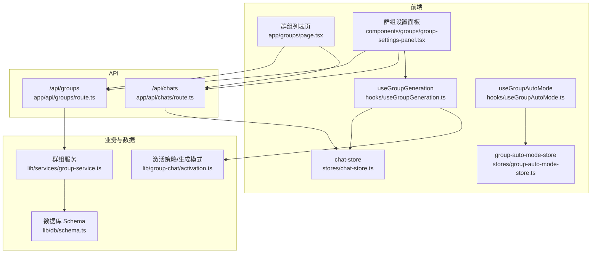
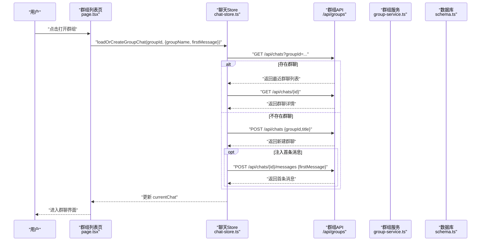
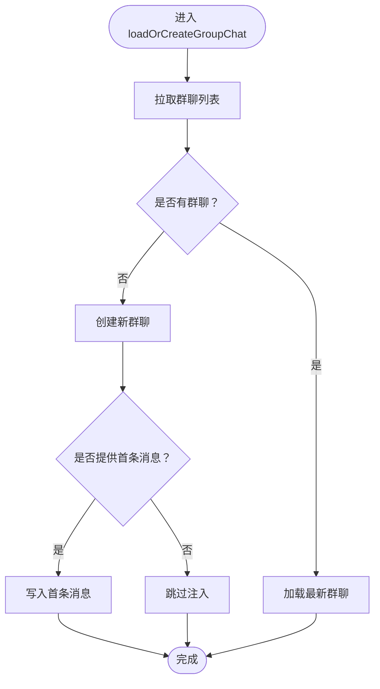
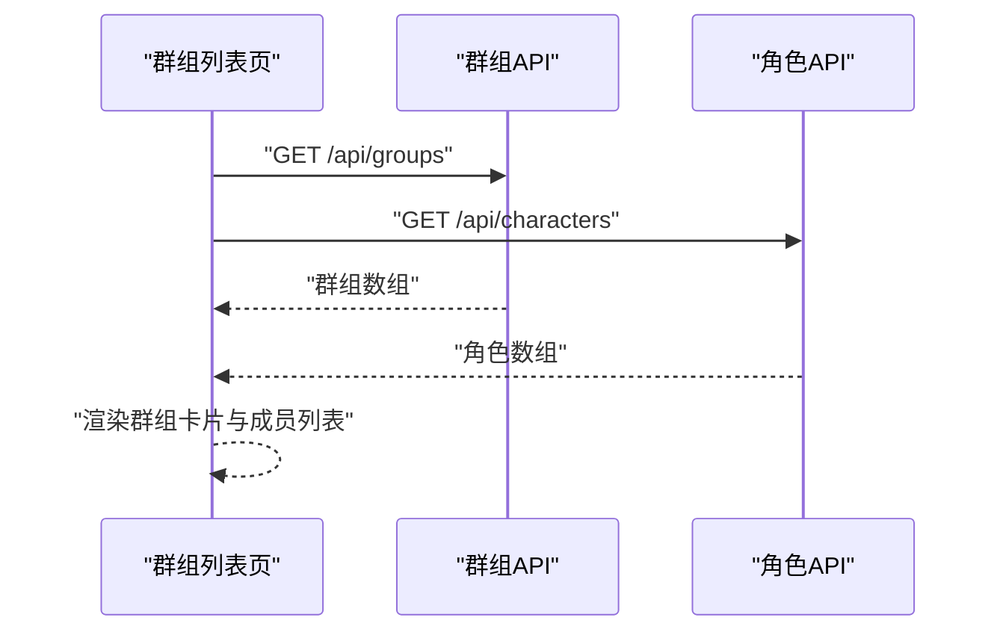
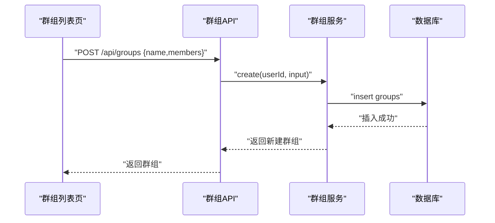
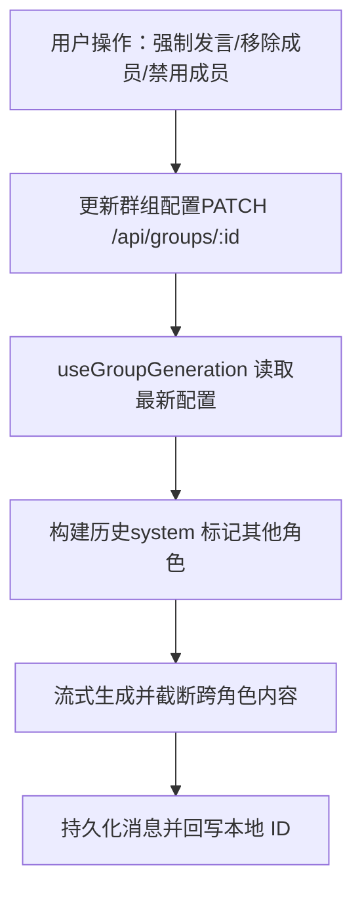
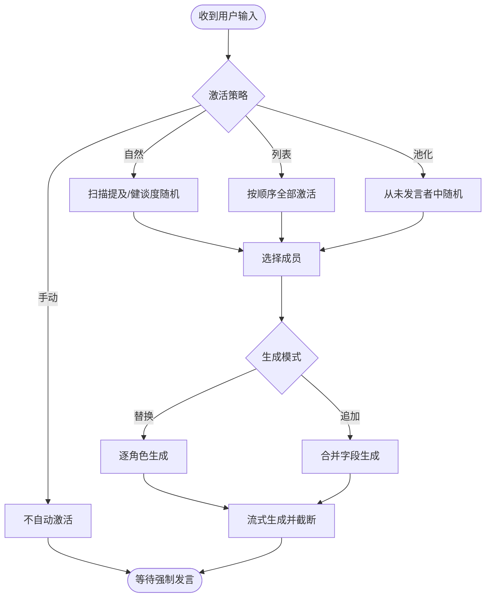
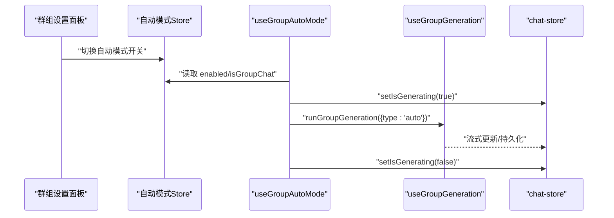
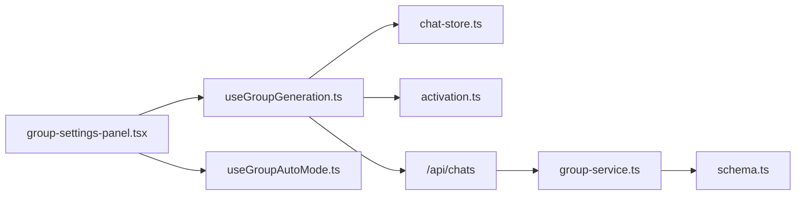

# 群组聊天集成

<cite>
**本文引用的文件**
- [src/hooks/useGroupAutoMode.ts](file://src/hooks/useGroupAutoMode.ts)
- [src/hooks/useGroupGeneration.ts](file://src/hooks/useGroupGeneration.ts)
- [src/stores/group-auto-mode-store.ts](file://src/stores/group-auto-mode-store.ts)
- [src/lib/group-chat/activation.ts](file://src/lib/group-chat/activation.ts)
- [src/lib/services/group-service.ts](file://src/lib/services/group-service.ts)
- [src/stores/chat-store.ts](file://src/stores/chat-store.ts)
- [src/lib/db/schema.ts](file://src/lib/db/schema.ts)
- [src/app/api/groups/route.ts](file://src/app/api/groups/route.ts)
- [src/app/api/chats/route.ts](file://src/app/api/chats/route.ts)
- [src/app/groups/page.tsx](file://src/app/groups/page.tsx)
- [src/components/groups/group-settings-panel.tsx](file://src/components/groups/group-settings-panel.tsx)
</cite>

## 目录
1. [简介](#简介)
2. [项目结构](#项目结构)
3. [核心组件](#核心组件)
4. [架构总览](#架构总览)
5. [详细组件分析](#详细组件分析)
6. [依赖关系分析](#依赖关系分析)
7. [性能考量](#性能考量)
8. [故障排查指南](#故障排查指南)
9. [结论](#结论)
10. [附录](#附录)

## 简介
本文件系统性阐述群组聊天集成的设计与实现，覆盖以下主题：
- 群组聊天的加载机制与自动创建逻辑
- 群组聊天列表的获取与展示
- 群组聊天的创建流程与首次消息注入
- 群组聊天与普通聊天的区别、成员管理与消息处理
- 激活策略与生成模式、自动模式与延迟轮询
- 状态管理、消息同步与性能优化策略
- 实际使用场景与配置示例

## 项目结构
围绕群组聊天的关键目录与文件如下：
- 前端页面与组件
  - 群组列表页：src/app/groups/page.tsx
  - 群组设置面板：src/components/groups/group-settings-panel.tsx
  - 自动模式 Hook：src/hooks/useGroupAutoMode.ts
  - 群组生成 Hook：src/hooks/useGroupGeneration.ts
  - 自动模式 Store：src/stores/group-auto-mode-store.ts
- 业务与数据层
  - 激活策略与生成模式：src/lib/group-chat/activation.ts
  - 群组服务与校验：src/lib/services/group-service.ts
  - 数据模型 Schema：src/lib/db/schema.ts
  - 聊天状态 Store：src/stores/chat-store.ts
- API 层
  - 群组 API：src/app/api/groups/route.ts
  - 聊天 API：src/app/api/chats/route.ts

**图表来源**
- [src/app/groups/page.tsx:1-261](file://src/app/groups/page.tsx#L1-L261)
- [src/components/groups/group-settings-panel.tsx:1-318](file://src/components/groups/group-settings-panel.tsx#L1-L318)
- [src/hooks/useGroupGeneration.ts:1-738](file://src/hooks/useGroupGeneration.ts#L1-L738)
- [src/hooks/useGroupAutoMode.ts:1-62](file://src/hooks/useGroupAutoMode.ts#L1-L62)
- [src/stores/group-auto-mode-store.ts:1-18](file://src/stores/group-auto-mode-store.ts#L1-L18)
- [src/stores/chat-store.ts:1-583](file://src/stores/chat-store.ts#L1-L583)
- [src/lib/group-chat/activation.ts:1-191](file://src/lib/group-chat/activation.ts#L1-L191)
- [src/lib/services/group-service.ts:1-174](file://src/lib/services/group-service.ts#L1-L174)
- [src/lib/db/schema.ts:1-240](file://src/lib/db/schema.ts#L1-L240)
- [src/app/api/groups/route.ts:1-34](file://src/app/api/groups/route.ts#L1-L34)
- [src/app/api/chats/route.ts:1-45](file://src/app/api/chats/route.ts#L1-L45)

**章节来源**
- [src/app/groups/page.tsx:1-261](file://src/app/groups/page.tsx#L1-L261)
- [src/components/groups/group-settings-panel.tsx:1-318](file://src/components/groups/group-settings-panel.tsx#L1-L318)
- [src/hooks/useGroupGeneration.ts:1-738](file://src/hooks/useGroupGeneration.ts#L1-L738)
- [src/hooks/useGroupAutoMode.ts:1-62](file://src/hooks/useGroupAutoMode.ts#L1-L62)
- [src/stores/group-auto-mode-store.ts:1-18](file://src/stores/group-auto-mode-store.ts#L1-L18)
- [src/stores/chat-store.ts:1-583](file://src/stores/chat-store.ts#L1-L583)
- [src/lib/group-chat/activation.ts:1-191](file://src/lib/group-chat/activation.ts#L1-L191)
- [src/lib/services/group-service.ts:1-174](file://src/lib/services/group-service.ts#L1-L174)
- [src/lib/db/schema.ts:1-240](file://src/lib/db/schema.ts#L1-L240)
- [src/app/api/groups/route.ts:1-34](file://src/app/api/groups/route.ts#L1-L34)
- [src/app/api/chats/route.ts:1-45](file://src/app/api/chats/route.ts#L1-L45)

## 核心组件
- 群组加载与自动创建
  - 前端通过聊天 Store 的 loadOrCreateGroupChat 实现“加载最近群聊或自动创建”的逻辑，并支持注入首条消息。
- 群组成员与激活策略
  - 激活策略模块提供自然、列表、手动、池化四种策略；生成模式支持替换与追加两类。
- 群组生成流程
  - useGroupGeneration 封装正常/续写/重生成/代笔/自动模式的完整流程，负责构建角色卡、历史、世界设定与流式输出。
- 自动模式
  - useGroupAutoMode 周期性触发生成，结合全局开关与 AbortController 控制并发与中断。
- 群组设置面板
  - 提供群组名称、头像、激活策略、生成模式、自定义 Join 前缀/后缀、允许自说、隐藏静音、自动模式开关与延迟等配置。

**章节来源**
- [src/stores/chat-store.ts:274-333](file://src/stores/chat-store.ts#L274-L333)
- [src/lib/group-chat/activation.ts:1-191](file://src/lib/group-chat/activation.ts#L1-L191)
- [src/hooks/useGroupGeneration.ts:449-691](file://src/hooks/useGroupGeneration.ts#L449-L691)
- [src/hooks/useGroupAutoMode.ts:17-61](file://src/hooks/useGroupAutoMode.ts#L17-L61)
- [src/components/groups/group-settings-panel.tsx:114-214](file://src/components/groups/group-settings-panel.tsx#L114-L214)

## 架构总览
群组聊天的端到端流程包括：UI 交互 -> API 请求 -> 业务服务 -> 数据库 -> Store 同步 -> 生成引擎 -> 流式渲染。

**图表来源**
- [src/app/groups/page.tsx:60-74](file://src/app/groups/page.tsx#L60-L74)
- [src/stores/chat-store.ts:274-333](file://src/stores/chat-store.ts#L274-L333)
- [src/app/api/chats/route.ts:14-44](file://src/app/api/chats/route.ts#L14-L44)

## 详细组件分析

### 群组加载与自动创建
- 加载最近群聊：通过查询 groupId 参数获取群聊列表，取最新一条加载。
- 自动创建：若列表为空，则创建新的群聊；可选注入首条消息（来自首个启用成员的 firstMessage）。
- 首次消息注入：当存在首条消息时，调用消息接口写入第一条 assistant 消息，形成“开场白”。

**图表来源**
- [src/stores/chat-store.ts:274-333](file://src/stores/chat-store.ts#L274-L333)
- [src/app/api/chats/route.ts:14-44](file://src/app/api/chats/route.ts#L14-L44)

**章节来源**
- [src/stores/chat-store.ts:274-333](file://src/stores/chat-store.ts#L274-L333)
- [src/app/groups/page.tsx:60-74](file://src/app/groups/page.tsx#L60-L74)

### 群组聊天列表获取
- 群组列表页同时拉取群组与角色列表，用于展示群组成员与头像拼贴。
- 支持搜索、删除群组、创建新群组（POST /api/groups）。

**图表来源**
- [src/app/groups/page.tsx:47-57](file://src/app/groups/page.tsx#L47-L57)
- [src/app/api/groups/route.ts:5-12](file://src/app/api/groups/route.ts#L5-L12)
- [src/app/api/chats/route.ts:5-22](file://src/app/api/chats/route.ts#L5-L22)

**章节来源**
- [src/app/groups/page.tsx:1-261](file://src/app/groups/page.tsx#L1-L261)
- [src/app/api/groups/route.ts:1-34](file://src/app/api/groups/route.ts#L1-L34)
- [src/app/api/chats/route.ts:1-45](file://src/app/api/chats/route.ts#L1-L45)

### 群组聊天创建流程
- 创建群组：POST /api/groups，携带 name、members 等字段，服务端进行 Zod 校验并入库。
- 创建群聊：POST /api/chats，携带 groupId 与 title，服务端返回新聊天。
- 首次消息注入：可选地在创建后写入首条 assistant 消息，使群聊具备开场白。

**图表来源**
- [src/app/groups/page.tsx:76-89](file://src/app/groups/page.tsx#L76-L89)
- [src/app/api/groups/route.ts:14-33](file://src/app/api/groups/route.ts#L14-L33)
- [src/lib/services/group-service.ts:109-131](file://src/lib/services/group-service.ts#L109-L131)

**章节来源**
- [src/app/groups/page.tsx:76-89](file://src/app/groups/page.tsx#L76-L89)
- [src/app/api/groups/route.ts:14-33](file://src/app/api/groups/route.ts#L14-L33)
- [src/lib/services/group-service.ts:109-131](file://src/lib/services/group-service.ts#L109-L131)

### 群组聊天与普通聊天的区别
- 聊天类型标识：普通聊天由 characterId 标识，群组聊天由 groupId 标识。
- 消息来源：群组聊天的消息 originalAvatar 指向具体成员角色；普通聊天由当前角色生成。
- 历史构建：群组生成时将其他角色的历史标记为 system 角色，避免混淆；普通聊天仅用户与当前角色。
- 世界设定：群组生成时合并成员世界书 ID，增强上下文一致性。

**章节来源**
- [src/stores/chat-store.ts:42-49](file://src/stores/chat-store.ts#L42-L49)
- [src/hooks/useGroupGeneration.ts:260-274](file://src/hooks/useGroupGeneration.ts#L260-L274)
- [src/lib/db/schema.ts:131-140](file://src/lib/db/schema.ts#L131-L140)

### 群组成员管理与消息处理
- 成员管理：设置面板支持添加/移除成员、启用/禁用、排序、强制发言、上传头像、收藏与删除群组。
- 消息处理：支持续写、重生成、流式更新、截断检测（避免跨角色生成）、本地占位消息与服务端 ID 回写。

**图表来源**
- [src/components/groups/group-settings-panel.tsx:216-284](file://src/components/groups/group-settings-panel.tsx#L216-L284)
- [src/hooks/useGroupGeneration.ts:277-447](file://src/hooks/useGroupGeneration.ts#L277-L447)
- [src/stores/chat-store.ts:235-272](file://src/stores/chat-store.ts#L235-L272)

**章节来源**
- [src/components/groups/group-settings-panel.tsx:1-318](file://src/components/groups/group-settings-panel.tsx#L1-L318)
- [src/hooks/useGroupGeneration.ts:277-447](file://src/hooks/useGroupGeneration.ts#L277-L447)
- [src/stores/chat-store.ts:235-272](file://src/stores/chat-store.ts#L235-L272)

### 激活策略与生成模式
- 激活策略
  - 自然：基于提及与健谈度随机激活；允许多轮自说控制。
  - 列表：按成员顺序轮流激活。
  - 手动：不自动激活，需用户强制指定。
  - 池化：避免重复，从未发言者中选择。
- 生成模式
  - 替换：逐个角色独立生成。
  - 追加：合并启用成员字段生成；支持禁用成员模式。

**图表来源**
- [src/lib/group-chat/activation.ts:59-190](file://src/lib/group-chat/activation.ts#L59-L190)
- [src/hooks/useGroupGeneration.ts:170-257](file://src/hooks/useGroupGeneration.ts#L170-L257)

**章节来源**
- [src/lib/group-chat/activation.ts:1-191](file://src/lib/group-chat/activation.ts#L1-L191)
- [src/hooks/useGroupGeneration.ts:170-257](file://src/hooks/useGroupGeneration.ts#L170-L257)

### 自动模式与首次消息注入
- 自动模式
  - 开关：全局开关与群组配置双层控制；启用后按 delay 秒周期触发生成。
  - 并发控制：避免与正在生成的任务冲突；支持 AbortController 立即中止。
- 首次消息注入
  - 在打开群组时，从首个启用成员的 firstMessage 构造首条消息并写入，形成自然开场。

**图表来源**
- [src/components/groups/group-settings-panel.tsx:114-214](file://src/components/groups/group-settings-panel.tsx#L114-L214)
- [src/stores/group-auto-mode-store.ts:13-17](file://src/stores/group-auto-mode-store.ts#L13-L17)
- [src/hooks/useGroupAutoMode.ts:17-61](file://src/hooks/useGroupAutoMode.ts#L17-L61)
- [src/hooks/useGroupGeneration.ts:449-691](file://src/hooks/useGroupGeneration.ts#L449-L691)

**章节来源**
- [src/stores/group-auto-mode-store.ts:1-18](file://src/stores/group-auto-mode-store.ts#L1-L18)
- [src/hooks/useGroupAutoMode.ts:1-62](file://src/hooks/useGroupAutoMode.ts#L1-L62)
- [src/app/groups/page.tsx:60-74](file://src/app/groups/page.tsx#L60-L74)

### 状态管理与消息同步
- Store 设计
  - currentChat/currentCharacter/isGenerating 等状态集中管理。
  - 消息持久化后自动回写服务端 ID，保证分支/检查点引用稳定。
- 消息同步
  - addMessage/updateLastMessage/persistMessage/updateMessage/deleteMessage 等原子操作封装。
  - 连续生成时通过占位消息与最终持久化，避免 UI 闪烁与引用丢失。

**章节来源**
- [src/stores/chat-store.ts:15-103](file://src/stores/chat-store.ts#L15-L103)
- [src/stores/chat-store.ts:235-351](file://src/stores/chat-store.ts#L235-L351)

## 依赖关系分析
- 组件耦合
  - 群组设置面板依赖 useGroupGeneration 与 useGroupAutoMode，实现即时配置变更与强制发言。
  - useGroupGeneration 依赖 chat-store、连接配置、格式化模板、世界设定等多 Store。
- 外部依赖
  - API 层负责鉴权与路由转发；服务层负责数据校验与持久化；数据库 Schema 定义实体关系。

**图表来源**
- [src/components/groups/group-settings-panel.tsx:1-318](file://src/components/groups/group-settings-panel.tsx#L1-L318)
- [src/hooks/useGroupGeneration.ts:1-738](file://src/hooks/useGroupGeneration.ts#L1-L738)
- [src/hooks/useGroupAutoMode.ts:1-62](file://src/hooks/useGroupAutoMode.ts#L1-L62)
- [src/stores/chat-store.ts:1-583](file://src/stores/chat-store.ts#L1-L583)
- [src/lib/group-chat/activation.ts:1-191](file://src/lib/group-chat/activation.ts#L1-L191)
- [src/app/api/chats/route.ts:1-45](file://src/app/api/chats/route.ts#L1-L45)
- [src/lib/services/group-service.ts:1-174](file://src/lib/services/group-service.ts#L1-L174)
- [src/lib/db/schema.ts:1-240](file://src/lib/db/schema.ts#L1-L240)

**章节来源**
- [src/components/groups/group-settings-panel.tsx:1-318](file://src/components/groups/group-settings-panel.tsx#L1-L318)
- [src/hooks/useGroupGeneration.ts:1-738](file://src/hooks/useGroupGeneration.ts#L1-L738)
- [src/hooks/useGroupAutoMode.ts:1-62](file://src/hooks/useGroupAutoMode.ts#L1-L62)
- [src/stores/chat-store.ts:1-583](file://src/stores/chat-store.ts#L1-L583)
- [src/lib/group-chat/activation.ts:1-191](file://src/lib/group-chat/activation.ts#L1-L191)
- [src/app/api/chats/route.ts:1-45](file://src/app/api/chats/route.ts#L1-L45)
- [src/lib/services/group-service.ts:1-174](file://src/lib/services/group-service.ts#L1-L174)
- [src/lib/db/schema.ts:1-240](file://src/lib/db/schema.ts#L1-L240)

## 性能考量
- 并发与中断
  - 自动模式使用 AbortController，在开关关闭或新一轮开始时立即中止上一轮生成。
- 批量与缓存
  - 群组与角色数据在页面加载时并行请求，减少等待时间。
- 流式渲染
  - 采用流式读取与增量更新，避免一次性渲染大段文本导致卡顿。
- 截断与稳定性
  - 生成过程中检测跨角色内容并截断，保证每条消息归属明确，降低后处理成本。

[本节为通用性能建议，无需特定文件引用]

## 故障排查指南
- 无法加载群组或聊天
  - 检查鉴权与用户 ID；确认 API 返回状态码与错误信息。
- 生成失败或中断
  - 查看 isGenerating 状态与 AbortController 是否被触发；检查网络中断与超时。
- 首条消息未注入
  - 确认 openGroupChat 时传入的 firstMessage 参数；检查消息接口返回。
- 自动模式无效
  - 确认自动模式开关与 isGroupChat 条件；检查 delay 设置与定时器是否清理。

**章节来源**
- [src/app/api/groups/route.ts:5-12](file://src/app/api/groups/route.ts#L5-L12)
- [src/app/api/chats/route.ts:5-22](file://src/app/api/chats/route.ts#L5-L22)
- [src/hooks/useGroupAutoMode.ts:24-60](file://src/hooks/useGroupAutoMode.ts#L24-L60)
- [src/stores/chat-store.ts:274-333](file://src/stores/chat-store.ts#L274-L333)

## 结论
本群组聊天集成以“策略驱动 + 流式生成 + 状态统一”的方式实现了灵活、可扩展的多角色协作对话体验。通过激活策略与生成模式的组合，既能满足自然社交场景，也能支持可控的批量生成；配合自动模式与首条消息注入，显著降低了使用门槛。建议在生产环境中关注并发控制、流式渲染与数据一致性，持续优化用户体验。

[本节为总结性内容，无需特定文件引用]

## 附录

### 实际使用场景
- 社交模拟：自然策略 + 追加模式，营造多角色互动氛围。
- 剧情创作：池化策略 + 替换模式，确保角色轮换均匀。
- 角色扮演：手动策略 + 追加模式，由用户主导角色出场。

### 配置示例
- 激活策略
  - 自然：基于提及与健谈度随机。
  - 列表：全员轮流。
  - 手动：仅强制发言。
  - 池化：从未发言者中随机。
- 生成模式
  - 替换：逐角色独立生成。
  - 追加：合并启用成员字段生成。
  - 追加（含禁用）：合并所有成员字段生成。
- 自动模式
  - 开启自动模式，设置延迟秒数，避免频繁触发。

**章节来源**
- [src/lib/group-chat/activation.ts:10-30](file://src/lib/group-chat/activation.ts#L10-L30)
- [src/components/groups/group-settings-panel.tsx:114-214](file://src/components/groups/group-settings-panel.tsx#L114-L214)