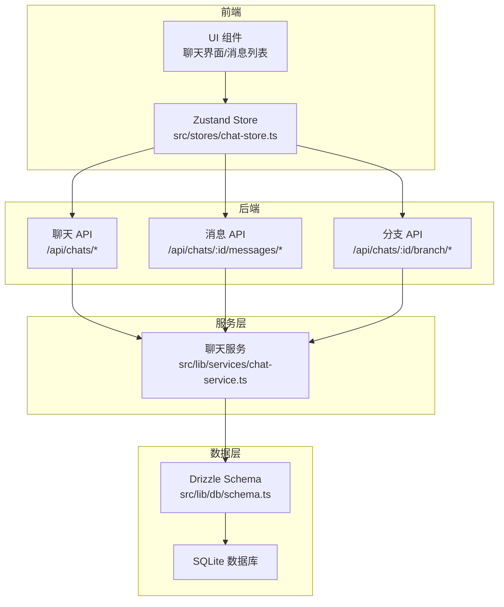
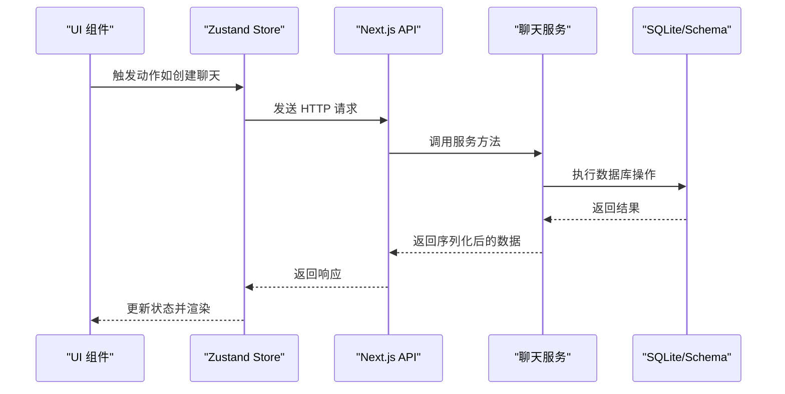
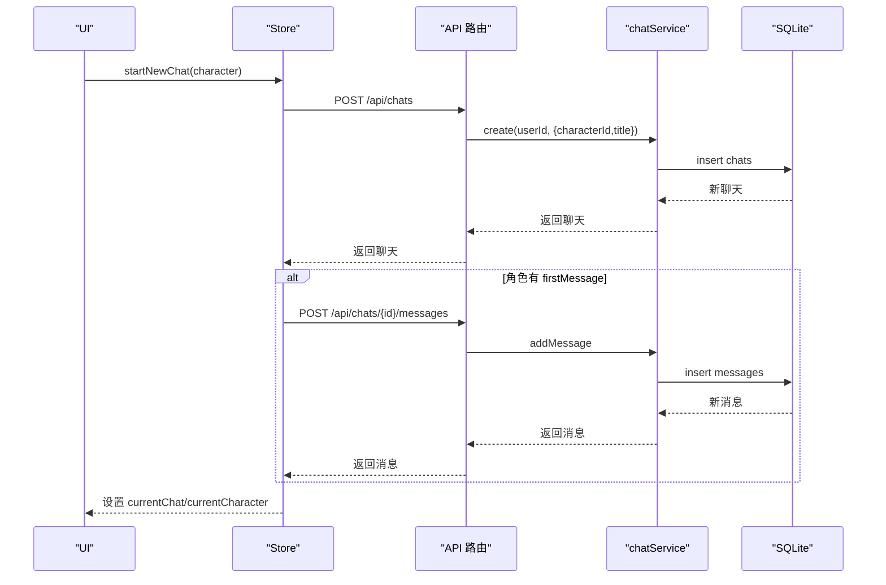
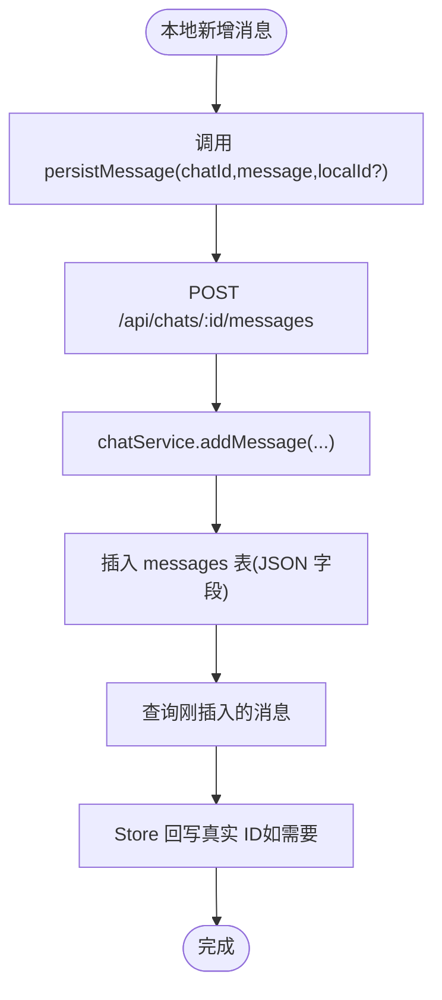
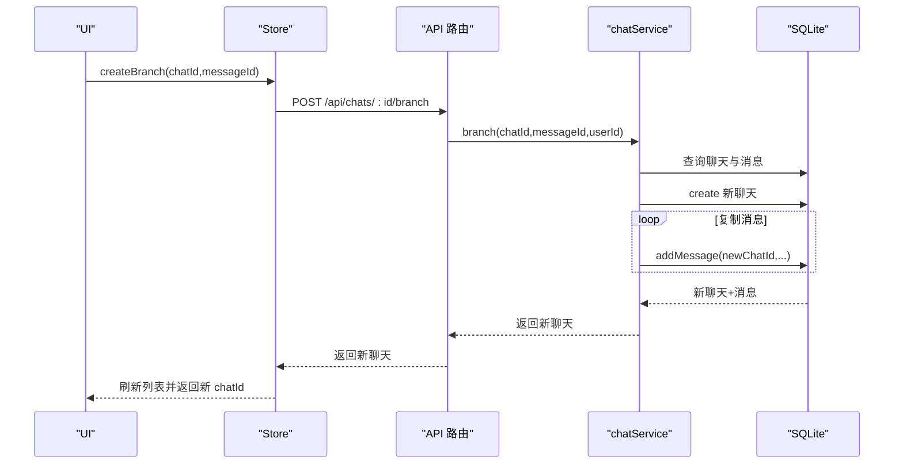
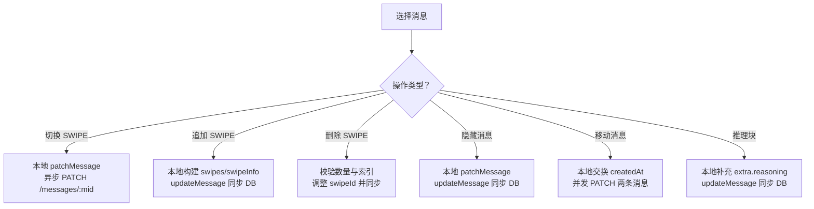
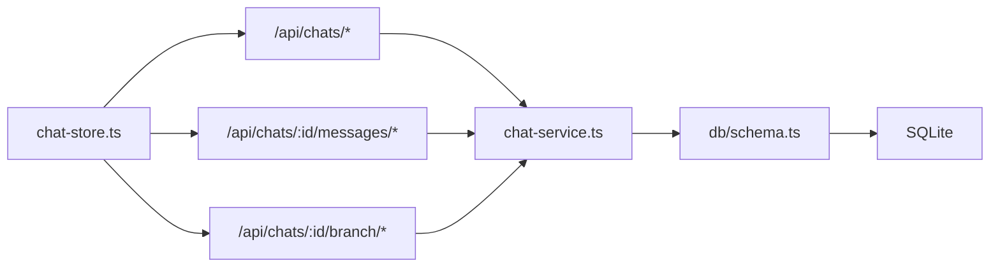

# 聊天状态管理

<cite>
**本文引用的文件**
- [src/stores/chat-store.ts](file://src/stores/chat-store.ts)
- [src/types/index.ts](file://src/types/index.ts)
- [src/app/api/chats/route.ts](file://src/app/api/chats/route.ts)
- [src/app/api/chats/[id]/route.ts](file://src/app/api/chats/[id]/route.ts)
- [src/app/api/chats/[id]/branch/route.ts](file://src/app/api/chats/[id]/branch/route.ts)
- [src/app/api/chats/[id]/messages/route.ts](file://src/app/api/chats/[id]/messages/route.ts)
- [src/lib/services/chat-service.ts](file://src/lib/services/chat-service.ts)
- [src/lib/db/schema.ts](file://src/lib/db/schema.ts)
- [src/lib/db/index.ts](file://src/lib/db/index.ts)
</cite>

## 目录
1. [简介](#简介)
2. [项目结构](#项目结构)
3. [核心组件](#核心组件)
4. [架构总览](#架构总览)
5. [详细组件分析](#详细组件分析)
6. [依赖关系分析](#依赖关系分析)
7. [性能考量](#性能考量)
8. [故障排查指南](#故障排查指南)
9. [结论](#结论)
10. [附录](#附录)

## 简介
本文件系统性阐述聊天状态管理系统的整体设计与实现，覆盖 ChatState 接口定义、聊天会话的状态管理、消息的本地与持久化存储机制，以及聊天创建、加载、更新与删除的完整流程。文档还解释了分支创建、书签管理与消息操作的细节，涵盖流式响应处理、消息状态同步与错误处理策略，并给出性能优化与内存管理建议。

## 项目结构
该系统采用前后端分层架构：
- 前端使用 Zustand 管理聊天状态，提供本地状态与异步持久化动作。
- 后端通过 Next.js App Router 提供 REST 风格 API。
- 数据访问层基于 Drizzle ORM + better-sqlite3，SQLite 作为本地存储。
- 类型系统统一定义在 TypeScript 类型文件中，确保前后端契约一致。

**图表来源**
- [src/stores/chat-store.ts:105-583](file://src/stores/chat-store.ts#L105-L583)
- [src/app/api/chats/route.ts:1-45](file://src/app/api/chats/route.ts#L1-45)
- [src/app/api/chats/[id]/messages/route.ts:1-65](file://src/app/api/chats/[id]/messages/route.ts#L1-L65)
- [src/app/api/chats/[id]/branch/route.ts:1-37](file://src/app/api/chats/[id]/branch/route.ts#L1-L37)
- [src/lib/services/chat-service.ts:60-301](file://src/lib/services/chat-service.ts#L60-L301)
- [src/lib/db/schema.ts:131-168](file://src/lib/db/schema.ts#L131-L168)

**章节来源**
- [src/stores/chat-store.ts:105-583](file://src/stores/chat-store.ts#L105-L583)
- [src/app/api/chats/route.ts:1-45](file://src/app/api/chats/route.ts#L1-L45)
- [src/app/api/chats/[id]/messages/route.ts:1-65](file://src/app/api/chats/[id]/messages/route.ts#L1-L65)
- [src/app/api/chats/[id]/branch/route.ts:1-37](file://src/app/api/chats/[id]/branch/route.ts#L1-L37)
- [src/lib/services/chat-service.ts:60-301](file://src/lib/services/chat-service.ts#L60-L301)
- [src/lib/db/schema.ts:131-168](file://src/lib/db/schema.ts#L131-L168)

## 核心组件
- ChatState 接口与 Zustand Store：定义并实现聊天状态的本地与持久化操作，包括创建、加载、更新、删除、消息增删改查、分支与书签、消息排序与推理块等。
- 类型系统：统一定义 Chat、ChatMessage、MessageExtra、SwipeInfo、Group 等核心类型，保证前后端一致性。
- API 层：提供聊天与消息的 REST 接口，负责鉴权与请求转发至服务层。
- 服务层：封装数据库读写、序列化/反序列化、分支复制等业务逻辑。
- 数据层：SQLite + Drizzle ORM，支持迁移与字段幂等补齐。

**章节来源**
- [src/stores/chat-store.ts:15-103](file://src/stores/chat-store.ts#L15-L103)
- [src/types/index.ts:60-149](file://src/types/index.ts#L60-L149)
- [src/types/index.ts:248-286](file://src/types/index.ts#L248-L286)
- [src/lib/services/chat-service.ts:60-301](file://src/lib/services/chat-service.ts#L60-L301)
- [src/lib/db/schema.ts:131-168](file://src/lib/db/schema.ts#L131-L168)

## 架构总览
系统遵循“前端状态 + 后端 API + 服务层 + 数据库”的分层设计。前端 Store 通过 fetch 调用后端 API，服务层进行数据库操作与数据转换，数据库采用 SQLite 并通过 Drizzle ORM 管理。

**图表来源**
- [src/stores/chat-store.ts:168-209](file://src/stores/chat-store.ts#L168-L209)
- [src/app/api/chats/route.ts:24-44](file://src/app/api/chats/route.ts#L24-L44)
- [src/lib/services/chat-service.ts:94-116](file://src/lib/services/chat-service.ts#L94-L116)
- [src/lib/db/schema.ts:131-168](file://src/lib/db/schema.ts#L131-L168)

## 详细组件分析

### ChatState 接口与动作设计
- 本地状态字段：currentChat、chats、currentCharacter、isGenerating。
- 本地动作：setCurrentChat、setChats、addMessage、updateLastMessage、patchMessage、removeMessageLocal、setIsGenerating、setCurrentCharacter、createNewChat。
- 异步动作（与数据库联动）：startNewChat、loadChat、loadChatsForCharacter、loadOrCreateGroupChat、loadChatsForGroup、persistMessage、updateMessage、deleteMessage、setActiveSwipe、appendSwipe、deleteSwipe、setMessageHidden、moveMessage、addEmptyReasoning、createBranch、createBookmark、deleteChat、renameChat。

这些动作通过 fetch 调用后端 API，服务层完成数据库操作，再将结果回填到 Store 中，实现本地乐观更新与最终一致性。

**章节来源**
- [src/stores/chat-store.ts:15-103](file://src/stores/chat-store.ts#L15-L103)
- [src/stores/chat-store.ts:105-583](file://src/stores/chat-store.ts#L105-L583)

### 聊天创建、加载、更新与删除流程
- 创建聊天：前端调用 POST /api/chats，服务层插入新聊天记录并返回；若角色带 firstMessage，则同时创建首条消息。
- 加载聊天：GET /api/chats/:id，服务层查询聊天及其全部消息并序列化返回。
- 加载列表：GET /api/chats?characterId=... 或 ?groupId=...，按 updatedAt 降序返回聊天列表。
- 更新聊天：PATCH /api/chats/:id，更新标题或元数据。
- 删除聊天：DELETE /api/chats/:id，级联删除消息，本地清理当前聊天与列表。

**图表来源**
- [src/stores/chat-store.ts:168-209](file://src/stores/chat-store.ts#L168-L209)
- [src/app/api/chats/route.ts:24-44](file://src/app/api/chats/route.ts#L24-L44)
- [src/lib/services/chat-service.ts:94-116](file://src/lib/services/chat-service.ts#L94-L116)
- [src/lib/services/chat-service.ts:147-203](file://src/lib/services/chat-service.ts#L147-L203)

**章节来源**
- [src/stores/chat-store.ts:168-233](file://src/stores/chat-store.ts#L168-L233)
- [src/app/api/chats/route.ts:5-44](file://src/app/api/chats/route.ts#L5-L44)
- [src/lib/services/chat-service.ts:60-116](file://src/lib/services/chat-service.ts#L60-L116)

### 消息的本地与持久化存储机制
- 本地存储：Store 中维护 currentChat.messages，支持即时更新与回写。
- 持久化存储：服务层将消息序列化为 JSON 字段存入 messages 表，swipes 与 swipeInfo 一一对应，extra 为通用扩展字段。
- ID 同步：持久化后若本地使用了临时 ID，Store 会自动回写服务端真实 ID，保证分支/书签引用稳定。

**图表来源**
- [src/stores/chat-store.ts:235-272](file://src/stores/chat-store.ts#L235-L272)
- [src/app/api/chats/[id]/messages/route.ts:29-64](file://src/app/api/chats/[id]/messages/route.ts#L29-L64)
- [src/lib/services/chat-service.ts:147-203](file://src/lib/services/chat-service.ts#L147-L203)
- [src/lib/db/schema.ts:145-168](file://src/lib/db/schema.ts#L145-L168)

**章节来源**
- [src/stores/chat-store.ts:235-272](file://src/stores/chat-store.ts#L235-L272)
- [src/lib/services/chat-service.ts:34-54](file://src/lib/services/chat-service.ts#L34-L54)
- [src/lib/db/schema.ts:145-168](file://src/lib/db/schema.ts#L145-L168)

### 分支创建与书签管理
- 分支创建：POST /api/chats/:id/branch，服务层根据 messageId 找到分支点，复制该消息之前的全部消息到新聊天。
- 书签：在消息上创建书签即创建分支，并将原消息的 bookmarkLink 指向新聊天 ID。

**图表来源**
- [src/stores/chat-store.ts:505-536](file://src/stores/chat-store.ts#L505-L536)
- [src/app/api/chats/[id]/branch/route.ts:10-36](file://src/app/api/chats/[id]/branch/route.ts#L10-L36)
- [src/lib/services/chat-service.ts:267-299](file://src/lib/services/chat-service.ts#L267-L299)

**章节来源**
- [src/stores/chat-store.ts:505-536](file://src/stores/chat-store.ts#L505-L536)
- [src/app/api/chats/[id]/branch/route.ts:10-36](file://src/app/api/chats/[id]/branch/route.ts#L10-L36)
- [src/lib/services/chat-service.ts:267-299](file://src/lib/services/chat-service.ts#L267-L299)

### 消息操作：SWIPE、隐藏、排序与推理块
- 切换 SWIPE：本地立即切换 active swipe 并异步写回 DB。
- 追加 SWIPE：本地构建 swipes 与 swipeInfo 数组，写回 DB 后同步本地。
- 删除 SWIPE：至少保留一条，必要时调整 swipeId 并同步。
- 隐藏消息：本地乐观更新 + 异步写回。
- 移动消息：与相邻消息互换 createdAt 并并发 PATCH 两条消息。
- 初始化推理块：为消息补充空的 reasoning 字段，便于编辑。

**图表来源**
- [src/stores/chat-store.ts:368-503](file://src/stores/chat-store.ts#L368-L503)
- [src/app/api/chats/[id]/messages/route.ts:29-64](file://src/app/api/chats/[id]/messages/route.ts#L29-L64)
- [src/lib/services/chat-service.ts:205-251](file://src/lib/services/chat-service.ts#L205-L251)

**章节来源**
- [src/stores/chat-store.ts:368-503](file://src/stores/chat-store.ts#L368-L503)
- [src/lib/services/chat-service.ts:205-251](file://src/lib/services/chat-service.ts#L205-L251)

### 流式响应处理与消息状态同步
- Store 在生成过程中通过 setIsGenerating 控制 UI 状态。
- updateLastMessage 支持对最后一条 assistant 消息进行增量更新，适合流式输出场景。
- persistMessage 支持将本地临时 ID 与服务端真实 ID 回写，确保后续分支/书签引用稳定。

**章节来源**
- [src/stores/chat-store.ts:22-34](file://src/stores/chat-store.ts#L22-L34)
- [src/stores/chat-store.ts:121-130](file://src/stores/chat-store.ts#L121-L130)
- [src/stores/chat-store.ts:256-266](file://src/stores/chat-store.ts#L256-L266)

### 错误处理机制
- Store 中多数异步动作使用 try/catch 并打印错误日志，避免阻塞 UI。
- API 层对未授权、未找到、服务器错误分别返回相应状态码与错误信息。
- 服务层对非法输入（如缺少 messageId）进行校验并返回错误。

**章节来源**
- [src/stores/chat-store.ts:206-208](file://src/stores/chat-store.ts#L206-L208)
- [src/stores/chat-store.ts:362-365](file://src/stores/chat-store.ts#L362-L365)
- [src/app/api/chats/[id]/branch/route.ts:20-25](file://src/app/api/chats/[id]/branch/route.ts#L20-L25)

## 依赖关系分析
- Store 依赖 API 路由，API 路由依赖服务层，服务层依赖 Drizzle Schema 与 SQLite。
- 类型系统贯穿前端 Store、API、服务层与数据库层，确保字段与约束一致。
- 数据库层通过迁移与字段幂等补齐，增强向前兼容性。

**图表来源**
- [src/stores/chat-store.ts:105-583](file://src/stores/chat-store.ts#L105-L583)
- [src/app/api/chats/route.ts:1-45](file://src/app/api/chats/route.ts#L1-L45)
- [src/app/api/chats/[id]/messages/route.ts:1-65](file://src/app/api/chats/[id]/messages/route.ts#L1-L65)
- [src/app/api/chats/[id]/branch/route.ts:1-37](file://src/app/api/chats/[id]/branch/route.ts#L1-L37)
- [src/lib/services/chat-service.ts:60-301](file://src/lib/services/chat-service.ts#L60-L301)
- [src/lib/db/schema.ts:131-168](file://src/lib/db/schema.ts#L131-L168)

**章节来源**
- [src/lib/db/index.ts:16-134](file://src/lib/db/index.ts#L16-L134)
- [src/lib/db/schema.ts:131-168](file://src/lib/db/schema.ts#L131-L168)

## 性能考量
- 本地乐观更新：Store 对大部分写操作采用乐观更新，减少等待时间，提升交互流畅度。
- 并发写入：移动消息时并发 PATCH 两条消息，降低往返延迟。
- 序列化开销：服务层对 JSON 字段进行序列化/反序列化，建议在高频路径避免重复解析。
- 数据库事务：Drizzle 默认非显式事务，批量写入可通过合并请求减少 I/O。
- 内存管理：Store 中 messages 数组随会话增长而增大，建议：
  - 仅保留必要的消息片段（如最近 N 条）。
  - 对长历史会话启用懒加载与虚拟滚动。
  - 定期清理无用分支与书签，避免引用链过长。
- 索引与查询：按 updatedAt 降序查询聊天列表，建议在 chats.updatedAt 建立索引（如需）。

[本节为通用性能建议，无需特定文件引用]

## 故障排查指南
- 无法创建/加载聊天：检查鉴权是否通过、用户 ID 是否匹配、数据库连接是否正常。
- 消息持久化失败：确认 /api/chats/:id/messages 返回 201，查看服务层日志与数据库字段是否存在。
- 分支创建失败：确认 messageId 存在于当前聊天中，且服务层能正确复制消息。
- SWIPE 切换异常：检查 swipes 与 swipeInfo 数组长度与索引范围，确保本地与 DB 同步。
- 删除消息后 UI 不刷新：确认本地 removeMessageLocal 已执行，或服务端返回 204。

**章节来源**
- [src/stores/chat-store.ts:206-208](file://src/stores/chat-store.ts#L206-L208)
- [src/stores/chat-store.ts:362-365](file://src/stores/chat-store.ts#L362-L365)
- [src/app/api/chats/[id]/branch/route.ts:20-25](file://src/app/api/chats/[id]/branch/route.ts#L20-L25)

## 结论
该聊天状态管理系统通过清晰的分层设计与严格的类型约束，实现了从本地状态到持久化的完整闭环。Store 提供丰富的动作以覆盖常见业务场景，API 与服务层承担数据一致性与安全控制，数据库层通过 Drizzle ORM 与迁移机制保障稳定性与可演进性。结合本文的性能与故障排查建议，可在保证用户体验的同时维持系统的健壮性与可维护性。

## 附录
- 类型定义概览：Chat、ChatMessage、MessageExtra、SwipeInfo、Group 等。
- 数据库表结构：chats、messages 与外键关系。
- 启动时迁移与字段补齐逻辑。

**章节来源**
- [src/types/index.ts:60-149](file://src/types/index.ts#L60-L149)
- [src/types/index.ts:248-286](file://src/types/index.ts#L248-L286)
- [src/lib/db/schema.ts:131-168](file://src/lib/db/schema.ts#L131-L168)
- [src/lib/db/index.ts:16-134](file://src/lib/db/index.ts#L16-L134)