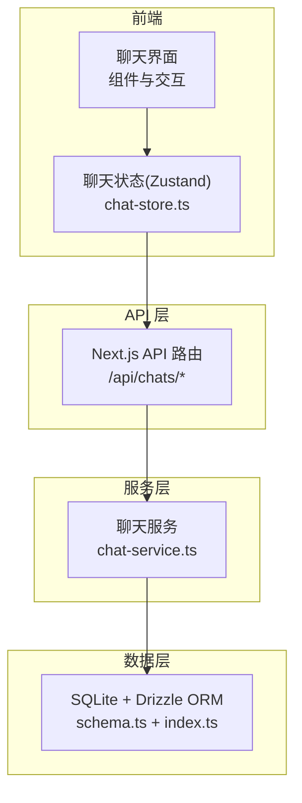
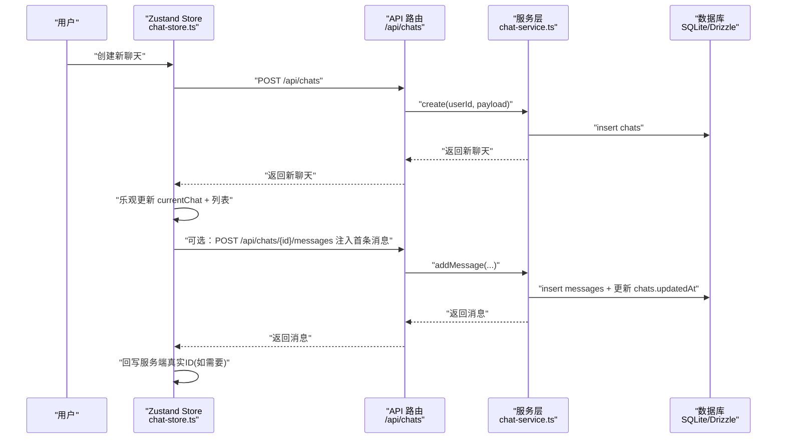
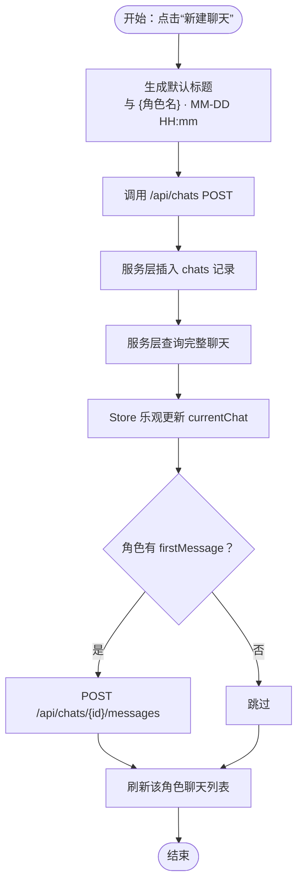
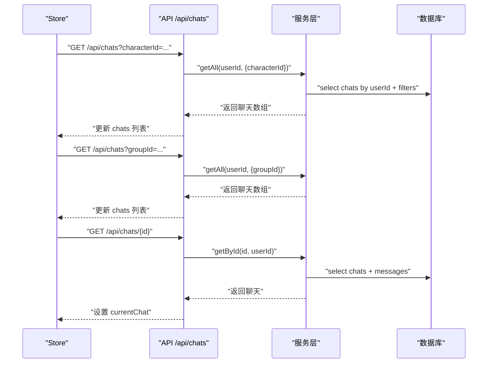
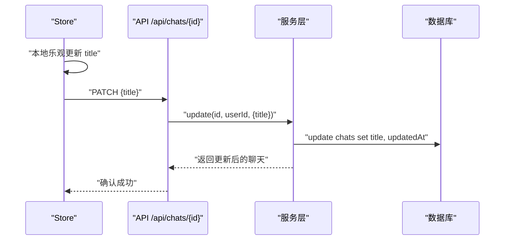
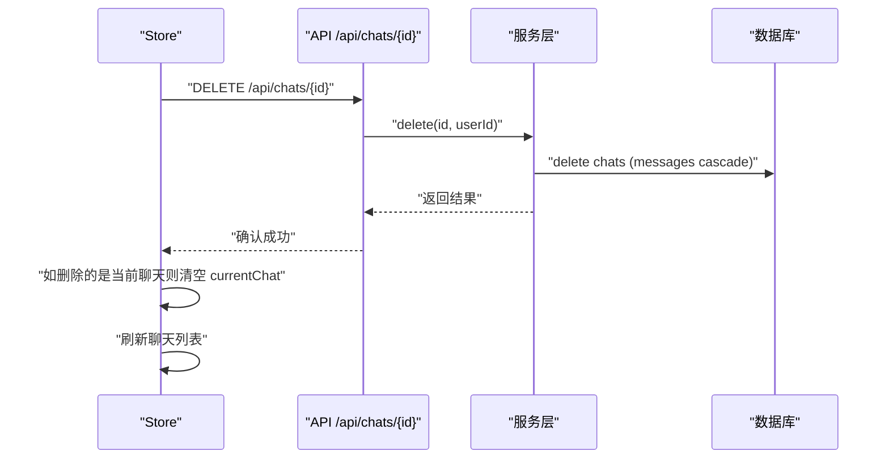
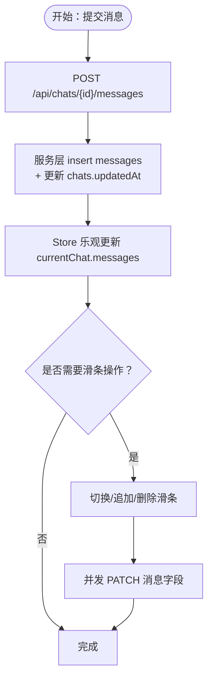
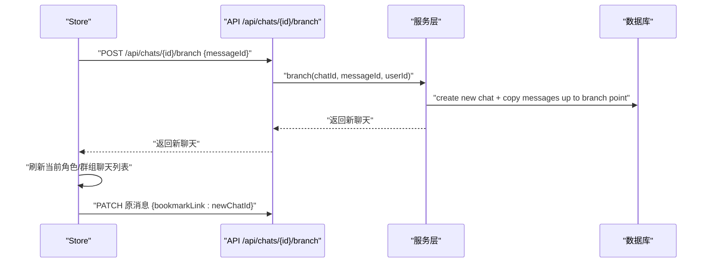
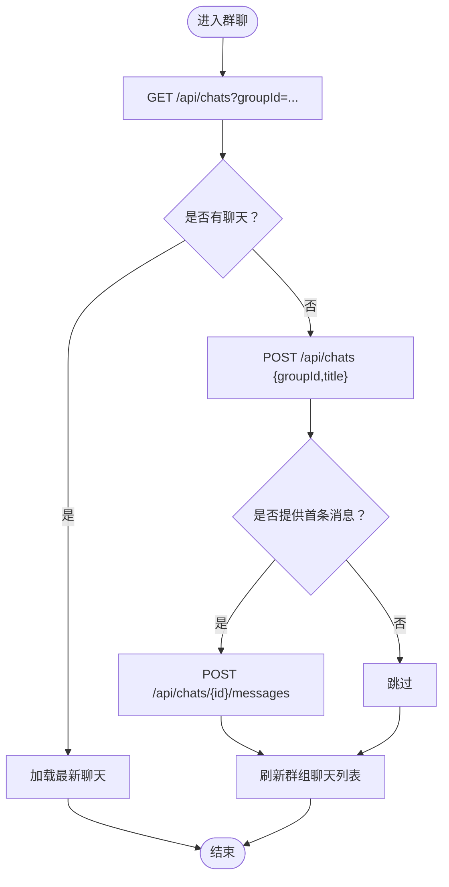
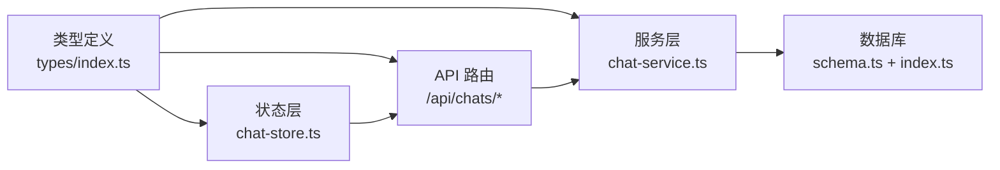

# 聊天生命周期

<cite>
**本文引用的文件**
- [README.md](file://README.md)
- [schema.ts](file://src/lib/db/schema.ts)
- [index.ts](file://src/lib/db/index.ts)
- [chat-service.ts](file://src/lib/services/chat-service.ts)
- [chat-store.ts](file://src/stores/chat-store.ts)
- [route.ts](file://src/app/api/chats/route.ts)
- [route.ts](file://src/app/api/chats/[id]/messages/route.ts)
- [route.ts](file://src/app/api/chats/[id]/branch/route.ts)
- [index.ts](file://src/types/index.ts)
</cite>

## 目录
1. [简介](#简介)
2. [项目结构](#项目结构)
3. [核心组件](#核心组件)
4. [架构总览](#架构总览)
5. [详细组件分析](#详细组件分析)
6. [依赖关系分析](#依赖关系分析)
7. [性能考量](#性能考量)
8. [故障排查指南](#故障排查指南)
9. [结论](#结论)
10. [附录](#附录)

## 简介
本文件系统化梳理“聊天生命周期”的完整实现，覆盖从创建、加载、更新、重命名到删除的全流程；解释聊天状态转换机制、标题自动生成策略、聊天列表维护方式；阐述持久化机制、数据库同步与本地状态管理；并提供错误处理、事务管理与数据一致性保障的最佳实践与操作示例。

## 项目结构
围绕聊天生命周期的关键目录与文件：
- 数据库层：Drizzle ORM + SQLite，迁移与幂等补齐确保表结构稳定
- 服务层：聊天服务封装 CRUD、分支、消息管理等核心业务
- API 层：Next.js App Router API 路由，鉴权后调用服务层
- 状态层：Zustand 全局状态，负责本地乐观更新与与后端同步
- 类型层：统一的 TypeScript 类型定义，确保前后端契约一致

图表来源
- [chat-store.ts:105-583](file://src/stores/chat-store.ts#L105-L583)
- [route.ts:1-45](file://src/app/api/chats/route.ts#L1-L45)
- [chat-service.ts:60-301](file://src/lib/services/chat-service.ts#L60-L301)
- [schema.ts:129-168](file://src/lib/db/schema.ts#L129-L168)
- [index.ts:1-134](file://src/lib/db/index.ts#L1-L134)

章节来源
- [README.md:78-136](file://README.md#L78-L136)

## 核心组件
- 数据模型：聊天表与消息表，支持角色/群组关联、标题、元数据、消息滑条(swipes)、生成时间戳、头像覆盖、书签链接等
- 数据库：SQLite + WAL 模式 + 外键约束；启动时自动迁移与字段幂等补齐
- 服务层：提供聊天 CRUD、消息 CRUD、分支创建、列表查询等
- API 层：鉴权后转发请求至服务层，返回标准化响应
- 状态层：Zustand store 提供本地乐观更新、批量异步动作、消息滑条切换、分支/书签、删除等

章节来源
- [schema.ts:129-168](file://src/lib/db/schema.ts#L129-L168)
- [index.ts:1-134](file://src/lib/db/index.ts#L1-L134)
- [chat-service.ts:60-301](file://src/lib/services/chat-service.ts#L60-L301)
- [chat-store.ts:15-103](file://src/stores/chat-store.ts#L15-L103)
- [index.ts:248-286](file://src/types/index.ts#L248-L286)

## 架构总览
聊天生命周期由“前端状态 -> API -> 服务层 -> 数据库”构成，遵循“本地乐观更新 + 后端幂等回写”的设计，确保用户体验与数据一致性。

图表来源
- [chat-store.ts:168-209](file://src/stores/chat-store.ts#L168-L209)
- [route.ts:24-44](file://src/app/api/chats/route.ts#L24-L44)
- [chat-service.ts:94-116](file://src/lib/services/chat-service.ts#L94-L116)
- [chat-service.ts:147-203](file://src/lib/services/chat-service.ts#L147-L203)

## 详细组件分析

### 聊天创建与标题自动生成
- 本地行为：store 生成默认标题（与角色名 + 时间戳），创建临时本地聊天对象
- 后端行为：API 路由接收请求，服务层创建聊天记录，返回完整聊天（含消息列表）
- 首条消息注入：若角色存在 firstMessage，则在创建后立即注入第一条消息
- 列表刷新：创建完成后拉取该角色的聊天列表，保持 UI 与数据库一致

图表来源
- [chat-store.ts:168-209](file://src/stores/chat-store.ts#L168-L209)
- [route.ts:24-44](file://src/app/api/chats/route.ts#L24-L44)
- [chat-service.ts:94-116](file://src/lib/services/chat-service.ts#L94-L116)
- [chat-service.ts:147-203](file://src/lib/services/chat-service.ts#L147-L203)

章节来源
- [chat-store.ts:8-13](file://src/stores/chat-store.ts#L8-L13)
- [chat-store.ts:168-209](file://src/stores/chat-store.ts#L168-L209)
- [route.ts:24-44](file://src/app/api/chats/route.ts#L24-L44)
- [chat-service.ts:94-116](file://src/lib/services/chat-service.ts#L94-L116)

### 聊天加载与列表维护
- 单聊加载：根据 chatId 查询完整聊天（含消息），Store 仅保存当前聊天
- 列表加载：按角色或群组维度查询聊天列表，按 updatedAt 降序排列
- 群聊策略：加载该群组所有聊天，选择最新一条作为当前聊天；若为空则创建新聊天

图表来源
- [chat-store.ts:211-233](file://src/stores/chat-store.ts#L211-L233)
- [chat-store.ts:274-333](file://src/stores/chat-store.ts#L274-L333)
- [route.ts:5-22](file://src/app/api/chats/route.ts#L5-L22)
- [chat-service.ts:60-92](file://src/lib/services/chat-service.ts#L60-L92)

章节来源
- [chat-store.ts:211-233](file://src/stores/chat-store.ts#L211-L233)
- [chat-store.ts:274-333](file://src/stores/chat-store.ts#L274-L333)
- [route.ts:5-22](file://src/app/api/chats/route.ts#L5-L22)
- [chat-service.ts:60-92](file://src/lib/services/chat-service.ts#L60-L92)

### 聊天更新与重命名
- 重命名：Store 乐观更新 currentChat 与列表项，随后异步 PATCH 到后端；若失败可在 UI 层提示或回滚
- 元数据更新：服务层支持 title 与 metadata 的增量更新，统一更新时间戳

图表来源
- [chat-store.ts:538-559](file://src/stores/chat-store.ts#L538-L559)
- [chat-service.ts:118-137](file://src/lib/services/chat-service.ts#L118-L137)

章节来源
- [chat-store.ts:538-559](file://src/stores/chat-store.ts#L538-L559)
- [chat-service.ts:118-137](file://src/lib/services/chat-service.ts#L118-L137)

### 聊天删除
- 删除聊天：API DELETE 调用服务层删除聊天；消息通过外键级联删除
- 列表同步：若删除的是当前聊天，清空当前聊天；否则刷新列表或移除对应项

图表来源
- [chat-store.ts:561-581](file://src/stores/chat-store.ts#L561-L581)
- [chat-service.ts:139-145](file://src/lib/services/chat-service.ts#L139-L145)

章节来源
- [chat-store.ts:561-581](file://src/stores/chat-store.ts#L561-L581)
- [chat-service.ts:139-145](file://src/lib/services/chat-service.ts#L139-L145)

### 消息持久化与滑条系统
- 持久化：Store 调用 /api/chats/{id}/messages POST，服务层插入消息并更新聊天时间戳
- 滑条：每条消息维护 swipes 数组与 swipeInfo，支持切换 active swipe、追加新滑条、删除滑条
- 乐观更新：本地先更新消息内容与元数据，再并发 PATCH 到后端，失败不回滚本地

图表来源
- [chat-store.ts:235-272](file://src/stores/chat-store.ts#L235-L272)
- [chat-store.ts:368-452](file://src/stores/chat-store.ts#L368-L452)
- [chat-service.ts:147-203](file://src/lib/services/chat-service.ts#L147-L203)
- [chat-service.ts:205-251](file://src/lib/services/chat-service.ts#L205-L251)

章节来源
- [chat-store.ts:235-272](file://src/stores/chat-store.ts#L235-L272)
- [chat-store.ts:368-452](file://src/stores/chat-store.ts#L368-L452)
- [chat-service.ts:147-203](file://src/lib/services/chat-service.ts#L147-L203)
- [chat-service.ts:205-251](file://src/lib/services/chat-service.ts#L205-L251)

### 分支与书签
- 分支：从某条消息开始复制历史消息到新聊天，保留标题与元数据
- 书签：创建分支并将原消息 bookmarkLink 指向新聊天，便于快速回到分支点

图表来源
- [chat-store.ts:505-536](file://src/stores/chat-store.ts#L505-L536)
- [chat-service.ts:267-299](file://src/lib/services/chat-service.ts#L267-L299)

章节来源
- [chat-store.ts:505-536](file://src/stores/chat-store.ts#L505-L536)
- [chat-service.ts:267-299](file://src/lib/services/chat-service.ts#L267-L299)

### 群聊加载/创建策略
- 若该群组已有聊天：加载最新一条作为当前聊天
- 若无聊天：创建新群聊并可选注入首条消息，然后刷新群组聊天列表

图表来源
- [chat-store.ts:274-333](file://src/stores/chat-store.ts#L274-L333)
- [route.ts:24-44](file://src/app/api/chats/route.ts#L24-L44)

章节来源
- [chat-store.ts:274-333](file://src/stores/chat-store.ts#L274-L333)
- [route.ts:24-44](file://src/app/api/chats/route.ts#L24-L44)

## 依赖关系分析
- 类型契约：前端与后端共享 Chat/ChatMessage/ChatMetadata 等类型，避免字段不一致导致的错误
- 数据库约束：外键约束保证消息删除时的级联清理；WAL 模式提升并发写入性能
- 服务层职责：封装 SQL 与序列化，屏蔽底层细节；提供幂等更新与一致性保障
- API 层职责：鉴权、参数校验、错误捕获与统一响应

图表来源
- [index.ts:248-286](file://src/types/index.ts#L248-L286)
- [chat-store.ts:105-583](file://src/stores/chat-store.ts#L105-L583)
- [chat-service.ts:60-301](file://src/lib/services/chat-service.ts#L60-L301)
- [schema.ts:129-168](file://src/lib/db/schema.ts#L129-L168)
- [index.ts:1-134](file://src/lib/db/index.ts#L1-L134)

章节来源
- [index.ts:248-286](file://src/types/index.ts#L248-L286)
- [schema.ts:129-168](file://src/lib/db/schema.ts#L129-L168)
- [index.ts:1-134](file://src/lib/db/index.ts#L1-L134)

## 性能考量
- 数据库优化
  - WAL 模式：提升并发写入吞吐，减少锁竞争
  - 外键开启：确保数据完整性，避免脏数据
  - 幂等补齐：启动时自动补齐缺失列，避免迁移遗漏导致的 500
- 状态层优化
  - 本地乐观更新：降低等待时间，提升交互流畅度
  - 并发 PATCH：消息顺序调整等操作采用并发请求，缩短同步时间
- API 层优化
  - 统一鉴权与错误处理，避免重复逻辑
  - 列表按 updatedAt 降序，减少前端排序成本

章节来源
- [index.ts:10-11](file://src/lib/db/index.ts#L10-L11)
- [index.ts:17-134](file://src/lib/db/index.ts#L17-L134)
- [chat-store.ts:481-493](file://src/stores/chat-store.ts#L481-L493)

## 故障排查指南
- 常见错误与处理
  - 未授权：API 层返回 401，检查登录状态与会话
  - 服务器内部错误：API 层捕获异常并返回 500，查看后端日志定位
  - 聊天不存在：服务层查询不到聊天或消息，检查 chatId/userId 是否匹配
  - 消息滑条异常：确认 swipes/swipeInfo 数组长度与索引一致性
- 事务与一致性
  - 服务层使用单条 INSERT/UPDATE/DELETE，简单事务；复杂分支复制在单次调用内完成
  - Store 乐观更新失败不回滚，建议在 UI 层提供重试或撤销操作
- 数据库迁移
  - 启动时自动迁移；若字段缺失，服务层进行幂等补齐，避免线上 500

章节来源
- [route.ts:5-22](file://src/app/api/chats/route.ts#L5-L22)
- [route.ts:24-44](file://src/app/api/chats/route.ts#L24-L44)
- [chat-service.ts:60-92](file://src/lib/services/chat-service.ts#L60-L92)
- [chat-service.ts:267-299](file://src/lib/services/chat-service.ts#L267-L299)
- [index.ts:17-134](file://src/lib/db/index.ts#L17-L134)

## 结论
本系统通过“前端乐观状态 + 后端幂等写入”的设计，在保证数据一致性的同时提供了流畅的交互体验。聊天生命周期的每个环节（创建、加载、更新、重命名、删除、分支、书签）均有清晰的职责划分与错误处理策略，配合数据库层的约束与迁移机制，确保了系统的稳定性与可维护性。

## 附录
- 操作示例（步骤化）
  - 新建聊天：在角色详情页点击“新建聊天”，系统自动创建并注入首条消息，随后刷新该角色聊天列表
  - 加载聊天：在侧边栏选择聊天，系统拉取完整聊天并展示
  - 重命名聊天：在聊天列表右键或菜单中选择“重命名”，输入新标题并确认
  - 删除聊天：在聊天列表右键或菜单中选择“删除”，确认后列表自动刷新
  - 分支聊天：在消息气泡菜单中选择“从此处创建分支”，系统创建新聊天并复制历史消息
  - 书签：在消息气泡菜单中选择“创建书签”，原消息 bookmarkLink 指向新聊天
- 最佳实践
  - 本地乐观更新：UI 与后端异步解耦，提升响应速度
  - 错误回退：后端失败时，Store 保留本地状态以便用户重试或撤销
  - 数据一致性：服务层统一序列化/反序列化，API 层严格鉴权与参数校验
  - 性能优化：合理使用并发 PATCH、WAL 模式、外键约束与幂等补齐