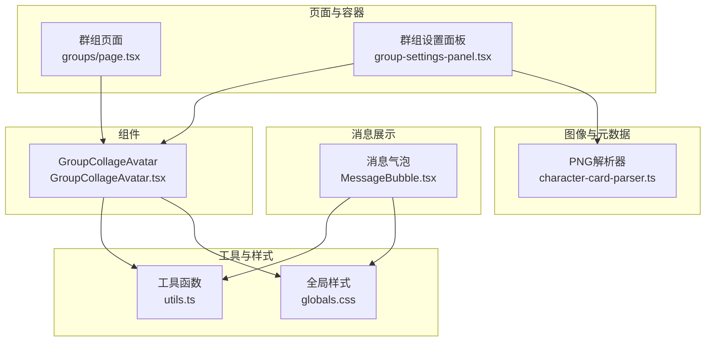
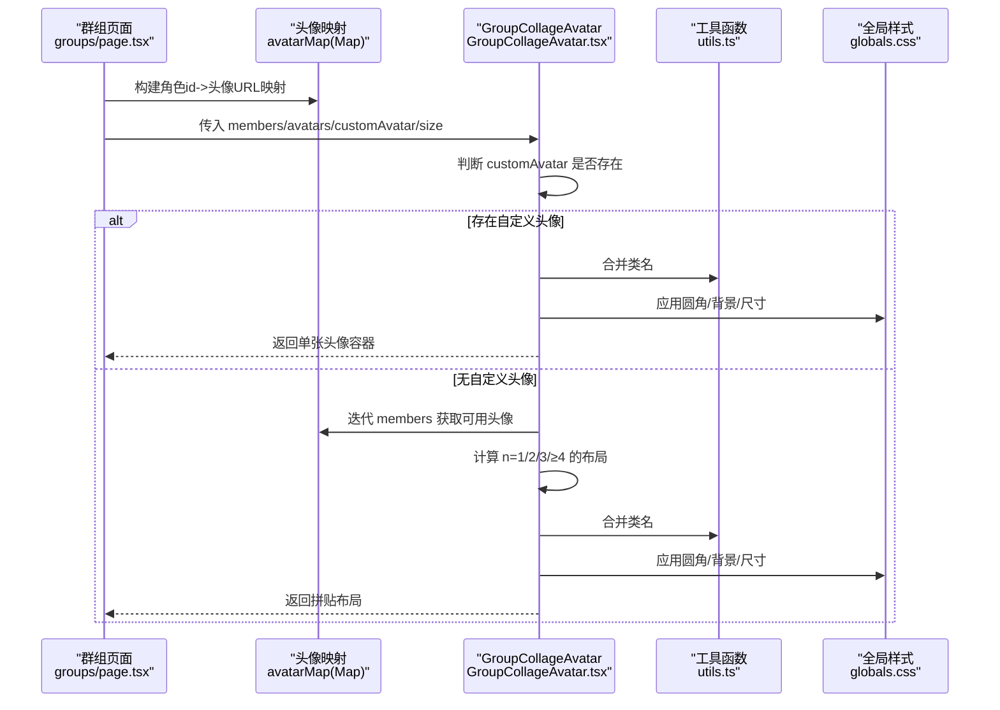
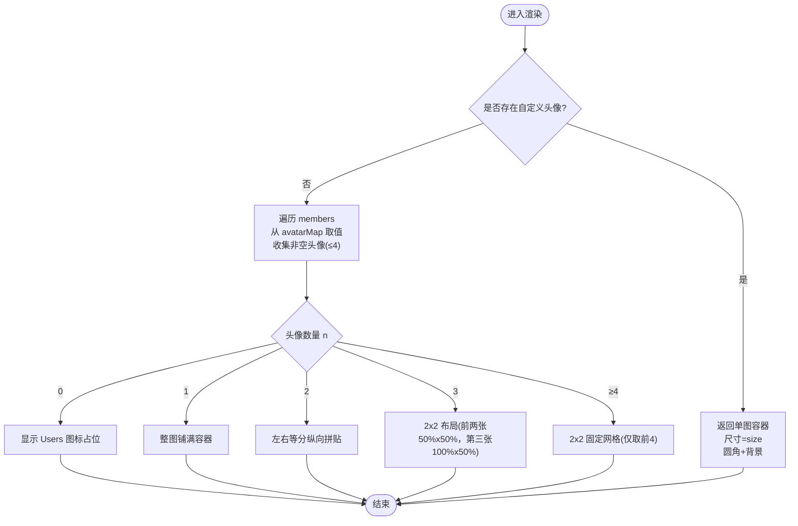
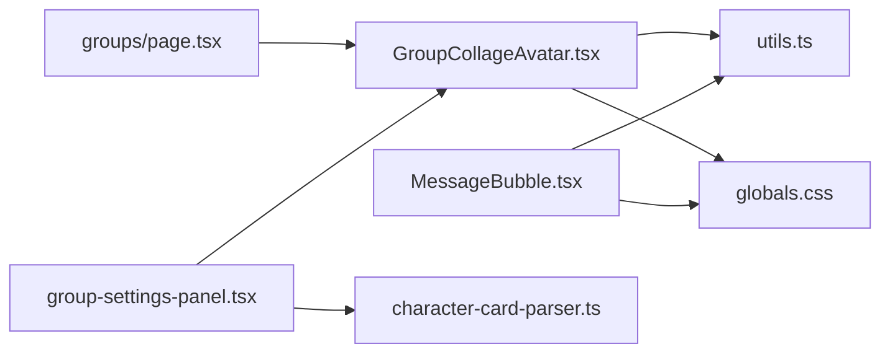

# 头像合成系统

<cite>
**本文档引用的文件**
- [GroupCollageAvatar.tsx](file://src/components/groups/GroupCollageAvatar.tsx)
- [page.tsx](file://src/app/groups/page.tsx)
- [group-settings-panel.tsx](file://src/components/groups/group-settings-panel.tsx)
- [MessageBubble.tsx](file://src/components/chat/message-bubble/MessageBubble.tsx)
- [character-card-parser.ts](file://src/lib/parsers/character-card-parser.ts)
- [utils.ts](file://src/lib/utils.ts)
- [globals.css](file://src/app/globals.css)
- [package.json](file://package.json)
</cite>

## 目录
1. [简介](#简介)
2. [项目结构](#项目结构)
3. [核心组件](#核心组件)
4. [架构总览](#架构总览)
5. [详细组件分析](#详细组件分析)
6. [依赖关系分析](#依赖关系分析)
7. [性能考虑](#性能考虑)
8. [故障排除指南](#故障排除指南)
9. [结论](#结论)
10. [附录](#附录)

## 简介
本文件面向“头像合成系统”的实现与使用，重点围绕 GroupCollageAvatar 组件展开，系统性解释其多头像拼接算法、尺寸计算与布局优化、自定义头像覆盖机制、默认头像生成规则以及头像缓存策略，并补充性能优化、内存管理、响应式设计、配置选项、样式定制与兼容性处理建议。目标是帮助开发者快速理解并扩展该功能。

## 项目结构
与头像合成直接相关的模块分布如下：
- 组件层：GroupCollageAvatar.tsx 实现群组头像拼贴逻辑
- 页面层：groups/page.tsx 使用 GroupCollageAvatar 渲染群组列表
- 设置面板：group-settings-panel.tsx 支持群组自定义头像上传与恢复
- 消息气泡：MessageBubble.tsx 展示单个角色头像的通用处理
- 工具与样式：utils.ts 提供类名合并；globals.css 定义主题变量与基础样式
- PNG 元数据：character-card-parser.ts 提供 PNG 内嵌/读取角色卡元数据能力（与头像存储/导入导出相关）

图表来源
- [page.tsx:218-224](file://src/app/groups/page.tsx#L218-L224)
- [GroupCollageAvatar.tsx:25-32](file://src/components/groups/GroupCollageAvatar.tsx#L25-L32)
- [group-settings-panel.tsx:143-155](file://src/components/groups/group-settings-panel.tsx#L143-L155)
- [MessageBubble.tsx:235-280](file://src/components/chat/message-bubble/MessageBubble.tsx#L235-L280)
- [character-card-parser.ts:260-353](file://src/lib/parsers/character-card-parser.ts#L260-L353)
- [utils.ts:4-6](file://src/lib/utils.ts#L4-L6)
- [globals.css:1-79](file://src/app/globals.css#L1-L79)

章节来源
- [page.tsx:218-224](file://src/app/groups/page.tsx#L218-L224)
- [GroupCollageAvatar.tsx:25-32](file://src/components/groups/GroupCollageAvatar.tsx#L25-L32)
- [group-settings-panel.tsx:143-155](file://src/components/groups/group-settings-panel.tsx#L143-L155)
- [MessageBubble.tsx:235-280](file://src/components/chat/message-bubble/MessageBubble.tsx#L235-L280)
- [character-card-parser.ts:260-353](file://src/lib/parsers/character-card-parser.ts#L260-L353)
- [utils.ts:4-6](file://src/lib/utils.ts#L4-L6)
- [globals.css:1-79](file://src/app/globals.css#L1-L79)

## 核心组件
- GroupCollageAvatar：根据传入的群组成员列表与头像映射，优先使用群组自定义头像；否则选取最多前 4 张可用头像进行拼贴；若均不可用，则显示 Users 图标。
- avatarMap：由调用方构建的 Map，键为角色 id，值为头像 URL（可为空）。
- customAvatar：群组自定义头像，优先级最高。
- size：像素尺寸，默认 40。
- className/title：用于样式与可访问性。

章节来源
- [GroupCollageAvatar.tsx:6-17](file://src/components/groups/GroupCollageAvatar.tsx#L6-L17)
- [page.tsx:106-106](file://src/app/groups/page.tsx#L106-L106)

## 架构总览
下图展示了从页面到组件再到样式的调用链路与职责分工：

图表来源
- [page.tsx:106-106](file://src/app/groups/page.tsx#L106-L106)
- [page.tsx:218-224](file://src/app/groups/page.tsx#L218-L224)
- [GroupCollageAvatar.tsx:33-44](file://src/components/groups/GroupCollageAvatar.tsx#L33-L44)
- [GroupCollageAvatar.tsx:47-53](file://src/components/groups/GroupCollageAvatar.tsx#L47-L53)
- [GroupCollageAvatar.tsx:67-74](file://src/components/groups/GroupCollageAvatar.tsx#L67-L74)
- [GroupCollageAvatar.tsx:76-84](file://src/components/groups/GroupCollageAvatar.tsx#L76-L84)
- [GroupCollageAvatar.tsx:87-97](file://src/components/groups/GroupCollageAvatar.tsx#L87-L97)
- [GroupCollageAvatar.tsx:100-108](file://src/components/groups/GroupCollageAvatar.tsx#L100-L108)
- [utils.ts:4-6](file://src/lib/utils.ts#L4-L6)
- [globals.css:1-79](file://src/app/globals.css#L1-L79)

## 详细组件分析

### GroupCollageAvatar 组件实现原理
- 输入参数与优先级
  - customAvatar 优先：若存在，直接返回单图容器，不参与拼贴。
  - 否则遍历 members，通过 avatarMap 取值，收集非空头像，最多 4 张。
- 布局策略
  - n=0：显示 Users 图标占位。
  - n=1：整图铺满容器。
  - n=2：左右等分纵向拼贴。
  - n=3：前两张 50%x50%，第三张横向铺满上半区。
  - n≥4：仅取前 4 张，统一 50%x50% 布局，形成 2×2 网格。
- 尺寸与样式
  - 容器为圆形（圆角），背景使用语义色，尺寸由 size 控制。
  - 图片采用 object-cover 保证裁剪填充，避免变形。
- 可访问性
  - 容器支持 title 属性，便于屏幕阅读器识别。

图表来源
- [GroupCollageAvatar.tsx:33-44](file://src/components/groups/GroupCollageAvatar.tsx#L33-L44)
- [GroupCollageAvatar.tsx:47-53](file://src/components/groups/GroupCollageAvatar.tsx#L47-L53)
- [GroupCollageAvatar.tsx:59-64](file://src/components/groups/GroupCollageAvatar.tsx#L59-L64)
- [GroupCollageAvatar.tsx:67-74](file://src/components/groups/GroupCollageAvatar.tsx#L67-L74)
- [GroupCollageAvatar.tsx:76-84](file://src/components/groups/GroupCollageAvatar.tsx#L76-L84)
- [GroupCollageAvatar.tsx:87-97](file://src/components/groups/GroupCollageAvatar.tsx#L87-L97)
- [GroupCollageAvatar.tsx:100-108](file://src/components/groups/GroupCollageAvatar.tsx#L100-L108)

章节来源
- [GroupCollageAvatar.tsx:25-32](file://src/components/groups/GroupCollageAvatar.tsx#L25-L32)
- [GroupCollageAvatar.tsx:33-44](file://src/components/groups/GroupCollageAvatar.tsx#L33-L44)
- [GroupCollageAvatar.tsx:47-53](file://src/components/groups/GroupCollageAvatar.tsx#L47-L53)
- [GroupCollageAvatar.tsx:59-64](file://src/components/groups/GroupCollageAvatar.tsx#L59-L64)
- [GroupCollageAvatar.tsx:67-74](file://src/components/groups/GroupCollageAvatar.tsx#L67-L74)
- [GroupCollageAvatar.tsx:76-84](file://src/components/groups/GroupCollageAvatar.tsx#L76-L84)
- [GroupCollageAvatar.tsx:87-97](file://src/components/groups/GroupCollageAvatar.tsx#L87-L97)
- [GroupCollageAvatar.tsx:100-108](file://src/components/groups/GroupCollageAvatar.tsx#L100-L108)

### 自定义头像覆盖机制
- 群组设置面板提供上传入口，成功后 group.avatar 字段被赋值；当存在该字段时，GroupCollageAvatar 会优先使用它作为头像。
- 用户可一键“恢复拼贴”，即将 group.avatar 置空，从而回到按成员头像拼贴的默认行为。

章节来源
- [group-settings-panel.tsx:143-155](file://src/components/groups/group-settings-panel.tsx#L143-L155)

### 默认头像生成规则
- 当 customAvatar 不存在且 avatarMap 中存在可用头像时，按顺序取前 4 张进行拼贴。
- 若所有成员均无头像，显示 Users 图标占位，体现“默认头像”语义。

章节来源
- [GroupCollageAvatar.tsx:47-53](file://src/components/groups/GroupCollageAvatar.tsx#L47-L53)
- [GroupCollageAvatar.tsx:59-64](file://src/components/groups/GroupCollageAvatar.tsx#L59-L64)

### 头像缓存策略
- 仓库未发现专门针对头像的前端缓存实现。现有机制包括：
  - React 组件复用：同一页面内复用 GroupCollageAvatar 实例，减少重复渲染。
  - avatarMap 由调用方一次性构建，避免重复查询。
  - 图片资源由浏览器缓存，组件层面未见显式缓存控制。
- 建议（基于现有代码未实现但可扩展的方向）：
  - 在 avatarMap 构建阶段加入本地缓存（如 sessionStorage/IndexedDB）以降低重复请求。
  - 对于频繁切换的群组列表，可引入轻量缓存与失效策略，结合 size 参数作为缓存键的一部分。

章节来源
- [page.tsx:106-106](file://src/app/groups/page.tsx#L106-L106)
- [GroupCollageAvatar.tsx:47-53](file://src/components/groups/GroupCollageAvatar.tsx#L47-L53)

### 性能优化与内存管理
- 渲染层面
  - 限制拼贴数量为 4，避免超大 DOM 结构导致重排与重绘成本上升。
  - 使用 object-cover 与固定尺寸，减少布局抖动。
- 资源层面
  - 图片加载失败时，React 组件未做额外处理；可在应用层（如消息气泡）参考 onError 隐藏图片的做法，避免空白块影响布局。
- 内存层面
  - 未发现专用的图片懒加载或卸载清理逻辑；可在需要时引入 IntersectionObserver 或在路由切换时清理图片资源。

章节来源
- [GroupCollageAvatar.tsx:100-108](file://src/components/groups/GroupCollageAvatar.tsx#L100-L108)
- [MessageBubble.tsx:247-255](file://src/components/chat/message-bubble/MessageBubble.tsx#L247-L255)

### 响应式设计
- GroupCollageAvatar 通过容器尺寸控制与 Flex/Wrap 布局适配不同宽度。
- 全局样式使用 oklch 色值与 Tailwind 变量，确保深浅主题一致的视觉表现。

章节来源
- [GroupCollageAvatar.tsx:56-57](file://src/components/groups/GroupCollageAvatar.tsx#L56-L57)
- [GroupCollageAvatar.tsx:87-97](file://src/components/groups/GroupCollageAvatar.tsx#L87-L97)
- [globals.css:1-29](file://src/app/globals.css#L1-L29)

### 配置选项与样式定制
- 配置项
  - members：成员 id 列表
  - avatarMap：角色 id -> 头像 URL 映射
  - customAvatar：群组自定义头像
  - size：像素尺寸
  - className：附加样式类
  - title：可访问性标题
- 样式定制
  - 圆形容器、背景色、边距与阴影由全局主题变量与 Tailwind 类组合决定。
  - 可通过 className 扩展或覆盖局部样式。

章节来源
- [GroupCollageAvatar.tsx:6-17](file://src/components/groups/GroupCollageAvatar.tsx#L6-L17)
- [utils.ts:4-6](file://src/lib/utils.ts#L4-L6)
- [globals.css:1-29](file://src/app/globals.css#L1-L29)

### 兼容性处理
- 头像 URL 兼容
  - 消息气泡组件对头像 URL 做了兼容处理：支持 data:、http(s)、绝对路径与相对路径，统一转为可访问的 URL。
  - GroupCollageAvatar 直接消费 avatarMap 的 URL，建议上游保证 URL 合法性。
- PNG 元数据兼容
  - PNG 解析器同时写入 chara 与 ccv3 文本块，兼顾旧版与新版解析器，间接提升头像卡片导入导出的兼容性。

章节来源
- [MessageBubble.tsx:273-279](file://src/components/chat/message-bubble/MessageBubble.tsx#L273-L279)
- [character-card-parser.ts:299-334](file://src/lib/parsers/character-card-parser.ts#L299-L334)

## 依赖关系分析
- 组件依赖
  - GroupCollageAvatar 依赖 utils.ts 的类名合并函数与全局样式变量。
  - 页面层 groups/page.tsx 依赖该组件进行群组列表渲染。
  - 设置面板 group-settings-panel.tsx 与 GroupCollageAvatar 协作，提供自定义头像上传与恢复。
- 外部依赖
  - lucide-react 提供图标（Users）。
  - Tailwind CSS 提供样式工具类。
  - PNG 相关依赖用于角色卡元数据的读写（与头像卡片导入导出相关）。

图表来源
- [GroupCollageAvatar.tsx:3-4](file://src/components/groups/GroupCollageAvatar.tsx#L3-L4)
- [utils.ts:4-6](file://src/lib/utils.ts#L4-L6)
- [globals.css:1-29](file://src/app/globals.css#L1-L29)
- [page.tsx:9-9](file://src/app/groups/page.tsx#L9-L9)
- [group-settings-panel.tsx:143-155](file://src/components/groups/group-settings-panel.tsx#L143-L155)
- [MessageBubble.tsx:235-280](file://src/components/chat/message-bubble/MessageBubble.tsx#L235-L280)
- [character-card-parser.ts:260-353](file://src/lib/parsers/character-card-parser.ts#L260-L353)

章节来源
- [package.json:18-46](file://package.json#L18-L46)

## 性能考虑
- 渲染性能
  - 限制拼贴数量为 4，避免过多子元素引发布局压力。
  - 使用固定百分比尺寸与 Flex/Wrap，减少复杂计算。
- 资源加载
  - 建议在应用层增加图片加载失败的兜底处理，避免空白块影响布局与可访问性。
- 内存占用
  - 对频繁切换的列表，可引入轻量缓存与失效策略，结合 size 作为缓存键，减少重复请求与渲染。

## 故障排除指南
- 自定义头像未生效
  - 检查 group.avatar 是否正确赋值；确认 GroupCollageAvatar 的 customAvatar 参数是否传递。
- 头像显示异常
  - 确认 avatarMap 中的 URL 可访问；参考消息气泡组件的 URL 兼容逻辑。
- 占位图标显示
  - 确认 members 列表与 avatarMap 是否正确；当 n=0 时会显示 Users 图标。

章节来源
- [group-settings-panel.tsx:143-155](file://src/components/groups/group-settings-panel.tsx#L143-L155)
- [GroupCollageAvatar.tsx:59-64](file://src/components/groups/GroupCollageAvatar.tsx#L59-L64)
- [MessageBubble.tsx:273-279](file://src/components/chat/message-bubble/MessageBubble.tsx#L273-L279)

## 结论
GroupCollageAvatar 通过简洁的优先级与布局策略，实现了稳定高效的群组头像合成。其优势在于：
- 明确的覆盖优先级（自定义头像 > 成员头像）
- 严格的拼贴上限（最多 4 张），兼顾性能与可读性
- 基于 Tailwind 的样式体系，易于定制与主题适配

建议后续在应用层补充图片错误处理与轻量缓存策略，进一步提升稳定性与性能。

## 附录
- 相关实现位置
  - GroupCollageAvatar 组件：[GroupCollageAvatar.tsx:25-109](file://src/components/groups/GroupCollageAvatar.tsx#L25-L109)
  - 页面使用示例：[page.tsx:218-224](file://src/app/groups/page.tsx#L218-L224)
  - 设置面板交互：[group-settings-panel.tsx:143-155](file://src/components/groups/group-settings-panel.tsx#L143-L155)
  - 消息气泡头像兼容：[MessageBubble.tsx:273-279](file://src/components/chat/message-bubble/MessageBubble.tsx#L273-L279)
  - PNG 元数据读写：[character-card-parser.ts:260-353](file://src/lib/parsers/character-card-parser.ts#L260-L353)
  - 工具函数与样式：[utils.ts:4-6](file://src/lib/utils.ts#L4-L6)、[globals.css:1-79](file://src/app/globals.css#L1-L79)