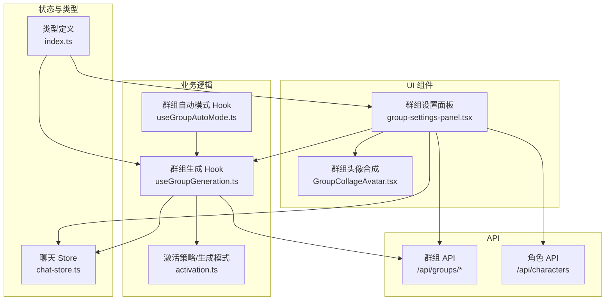
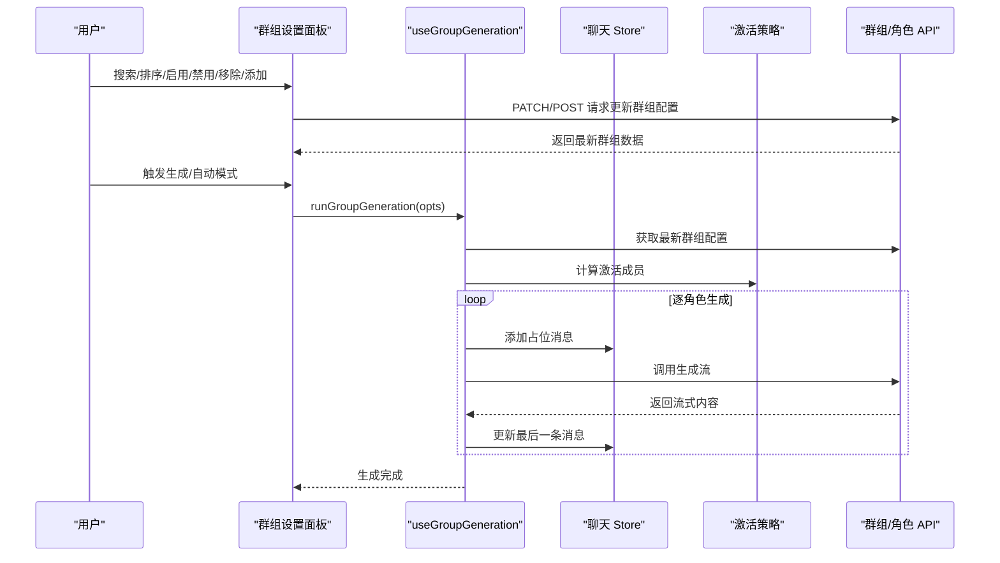
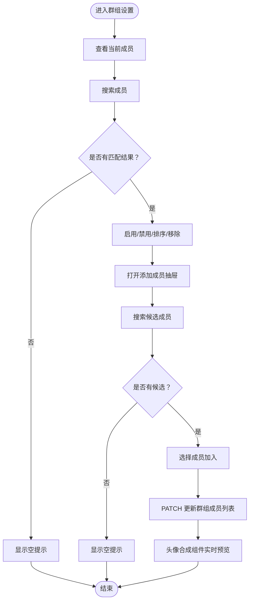
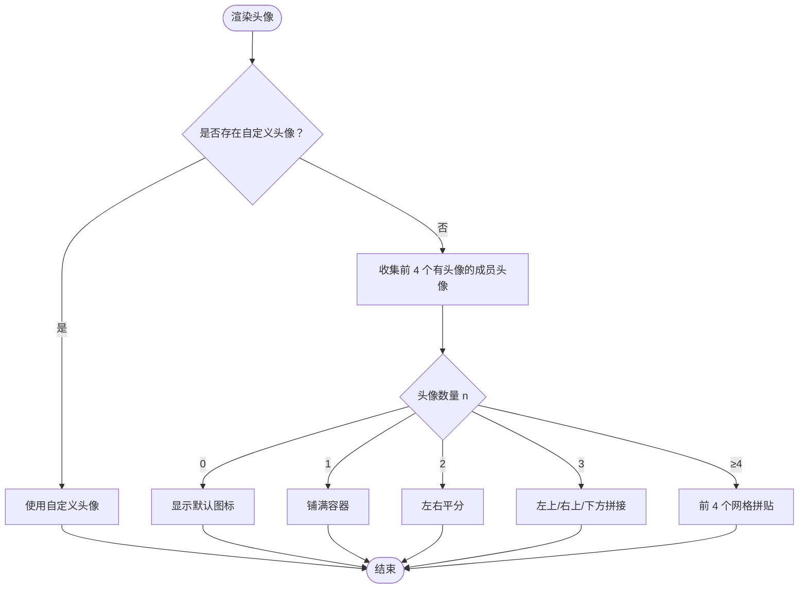
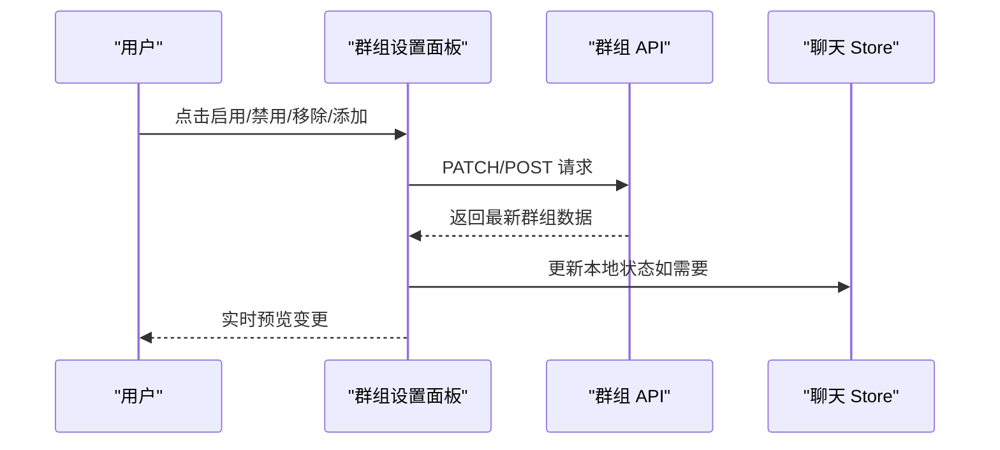
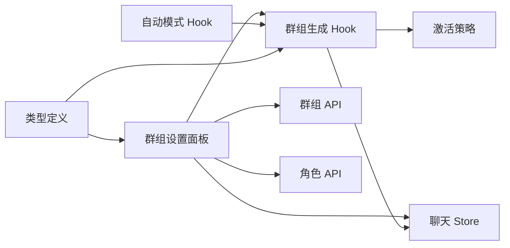

# 成员管理

<cite>
**本文引用的文件**
- [GroupCollageAvatar.tsx](file://src/components/groups/GroupCollageAvatar.tsx)
- [group-settings-panel.tsx](file://src/components/groups/group-settings-panel.tsx)
- [useGroupGeneration.ts](file://src/hooks/useGroupGeneration.ts)
- [useGroupAutoMode.ts](file://src/hooks/useGroupAutoMode.ts)
- [chat-store.ts](file://src/stores/chat-store.ts)
- [activation.ts](file://src/lib/group-chat/activation.ts)
- [index.ts](file://src/types/index.ts)
- [route.ts](file://src/app/api/groups/[id]/route.ts)
- [route.ts](file://src/app/api/groups/route.ts)
- [route.ts](file://src/app/api/characters/route.ts)
</cite>

## 目录
1. [简介](#简介)
2. [项目结构](#项目结构)
3. [核心组件](#核心组件)
4. [架构总览](#架构总览)
5. [详细组件分析](#详细组件分析)
6. [依赖关系分析](#依赖关系分析)
7. [性能考量](#性能考量)
8. [故障排查指南](#故障排查指南)
9. [结论](#结论)
10. [附录](#附录)

## 简介
本文件围绕“群组成员管理”的完整实现进行系统化说明，涵盖成员添加、移除与搜索功能，GroupCollageAvatar 组件如何合成显示多个成员头像，成员选择界面的交互设计（搜索过滤、多选机制与实时预览），以及成员状态管理（启用/禁用）、角色权限分配与成员变更通知机制。同时提供最佳实践与用户体验优化建议，帮助开发者与产品人员快速理解与维护该模块。

## 项目结构
成员管理相关代码主要分布在以下区域：
- UI 组件层：群组设置面板、成员头像合成组件
- 业务逻辑层：群组生成与自动模式 Hook、激活策略与生成模式
- 数据模型层：类型定义（Group、Character 等）
- API 层：群组与角色的后端接口
- 状态层：聊天 Store 与群组自动模式 Store



图表来源
- [group-settings-panel.tsx:1-318](file://src/components/groups/group-settings-panel.tsx#L1-L318)
- [GroupCollageAvatar.tsx:1-110](file://src/components/groups/GroupCollageAvatar.tsx#L1-L110)
- [useGroupGeneration.ts:1-738](file://src/hooks/useGroupGeneration.ts#L1-L738)
- [useGroupAutoMode.ts:1-62](file://src/hooks/useGroupAutoMode.ts#L1-L62)
- [activation.ts:1-191](file://src/lib/group-chat/activation.ts#L1-L191)
- [chat-store.ts:1-583](file://src/stores/chat-store.ts#L1-L583)
- [index.ts:270-286](file://src/types/index.ts#L270-L286)
- [route.ts:1-54](file://src/app/api/groups/[id]/route.ts#L1-L54)
- [route.ts:1-33](file://src/app/api/groups/route.ts#L1-L33)
- [route.ts:1-42](file://src/app/api/characters/route.ts#L1-L42)

章节来源
- [group-settings-panel.tsx:1-318](file://src/components/groups/group-settings-panel.tsx#L1-L318)
- [GroupCollageAvatar.tsx:1-110](file://src/components/groups/GroupCollageAvatar.tsx#L1-L110)
- [useGroupGeneration.ts:1-738](file://src/hooks/useGroupGeneration.ts#L1-L738)
- [useGroupAutoMode.ts:1-62](file://src/hooks/useGroupAutoMode.ts#L1-L62)
- [activation.ts:1-191](file://src/lib/group-chat/activation.ts#L1-L191)
- [chat-store.ts:1-583](file://src/stores/chat-store.ts#L1-L583)
- [index.ts:270-286](file://src/types/index.ts#L270-L286)
- [route.ts:1-54](file://src/app/api/groups/[id]/route.ts#L1-L54)
- [route.ts:1-33](file://src/app/api/groups/route.ts#L1-L33)
- [route.ts:1-42](file://src/app/api/characters/route.ts#L1-L42)

## 核心组件
- 群组设置面板：提供成员管理的搜索、排序、启用/禁用、强制发言、移除等操作入口，支持添加候选成员与实时预览。
- 群组头像合成组件：根据成员数量与自定义头像，渲染不同布局的拼贴头像，无成员头像时显示默认图标。
- 群组生成 Hook：负责加载群组与成员数据、构建世界书上下文、执行生成流程、处理激活策略与生成模式。
- 群组自动模式 Hook：基于定时器周期性触发群组生成，避免与正在生成的任务冲突。
- 类型定义：明确 Group、Character 等数据结构，支撑前后端一致性。

章节来源
- [group-settings-panel.tsx:32-103](file://src/components/groups/group-settings-panel.tsx#L32-L103)
- [GroupCollageAvatar.tsx:25-109](file://src/components/groups/GroupCollageAvatar.tsx#L25-L109)
- [useGroupGeneration.ts:59-132](file://src/hooks/useGroupGeneration.ts#L59-L132)
- [useGroupAutoMode.ts:17-60](file://src/hooks/useGroupAutoMode.ts#L17-L60)
- [index.ts:270-286](file://src/types/index.ts#L270-L286)

## 架构总览
成员管理的端到端流程如下：
- 用户在群组设置面板中进行成员操作（搜索、排序、启用/禁用、强制发言、移除、添加）。
- 面板通过 Hook 与 API 交互，更新群组配置（含成员列表与禁用成员列表）。
- 群组生成 Hook 在需要时加载最新群组配置，结合激活策略与生成模式，逐角色生成消息。
- 自动模式 Hook 周期性触发生成，避免与正在生成的任务冲突。
- 聊天 Store 负责消息的本地状态与持久化，保证 UI 与后端的一致性。



图表来源
- [group-settings-panel.tsx:58-68](file://src/components/groups/group-settings-panel.tsx#L58-L68)
- [useGroupGeneration.ts:450-691](file://src/hooks/useGroupGeneration.ts#L450-L691)
- [activation.ts:169-190](file://src/lib/group-chat/activation.ts#L169-L190)
- [chat-store.ts:105-166](file://src/stores/chat-store.ts#L105-L166)
- [route.ts:18-38](file://src/app/api/groups/[id]/route.ts#L18-L38)

## 详细组件分析

### 成员添加、移除与搜索
- 添加成员
  - 面板在“添加成员”抽屉中展示所有未在群组中的角色，并支持搜索过滤。
  - 选择后调用 PATCH 更新群组成员列表，新增成员会被置于列表首位。
- 移除成员
  - 在“当前成员”抽屉中，点击移除按钮会从成员列表与禁用成员列表中同时剔除该成员。
- 搜索过滤
  - “当前成员”与“添加成员”均支持按名称进行大小写不敏感的搜索过滤。
- 实时预览
  - 面板顶部的群组头像合成组件会根据成员数量与自定义头像实时渲染，直观反馈成员变化。



图表来源
- [group-settings-panel.tsx:216-285](file://src/components/groups/group-settings-panel.tsx#L216-L285)
- [group-settings-panel.tsx:287-316](file://src/components/groups/group-settings-panel.tsx#L287-L316)
- [GroupCollageAvatar.tsx:25-109](file://src/components/groups/GroupCollageAvatar.tsx#L25-L109)

章节来源
- [group-settings-panel.tsx:216-285](file://src/components/groups/group-settings-panel.tsx#L216-L285)
- [group-settings-panel.tsx:287-316](file://src/components/groups/group-settings-panel.tsx#L287-L316)
- [GroupCollageAvatar.tsx:25-109](file://src/components/groups/GroupCollageAvatar.tsx#L25-L109)

### GroupCollageAvatar 组件：多成员头像合成
- 优先级规则
  - 若存在自定义头像，则直接使用自定义头像作为整体头像。
  - 否则取前 4 个有头像的成员进行拼贴。
- 布局策略
  - 0 个：显示默认图标。
  - 1 个：铺满容器。
  - 2 个：左右平分。
  - 3 个：左上、右上、下方拼接。
  - ≥4 个：仅展示前 4 个，网格拼贴。
- 性能与可访问性
  - 使用固定像素尺寸与容器裁剪，避免布局抖动。
  - 无头像时提供标题提示，提升可访问性。



图表来源
- [GroupCollageAvatar.tsx:25-109](file://src/components/groups/GroupCollageAvatar.tsx#L25-L109)

章节来源
- [GroupCollageAvatar.tsx:25-109](file://src/components/groups/GroupCollageAvatar.tsx#L25-L109)

### 成员选择界面交互设计
- 搜索过滤
  - 输入框实时监听，支持大小写不敏感匹配。
- 多选机制
  - 当前实现为单选（移除/启用/禁用/排序），未见多选批量操作。
- 实时预览
  - 头像合成组件随成员变化即时更新，便于用户确认操作结果。
- 可用性细节
  - 禁用成员项具有视觉弱化（透明度降低）。
  - 支持上下移动成员顺序，便于调整发言顺序（在“追加/合并”模式下影响上下文组织）。

章节来源
- [group-settings-panel.tsx:216-285](file://src/components/groups/group-settings-panel.tsx#L216-L285)
- [group-settings-panel.tsx:287-316](file://src/components/groups/group-settings-panel.tsx#L287-L316)
- [GroupCollageAvatar.tsx:25-109](file://src/components/groups/GroupCollageAvatar.tsx#L25-L109)

### 成员状态管理（启用/禁用）、角色权限与成员变更通知
- 成员状态管理
  - 禁用成员不会参与激活策略计算，也不会在“追加/合并”模式下被合并。
  - 禁用状态与成员列表同步更新，移除成员时会同时清除其禁用状态。
- 角色权限
  - 群组 API 路由在请求前进行鉴权校验，确保仅用户本人可读写其群组。
- 成员变更通知
  - 前端通过 PATCH 请求提交变更，后端返回最新群组数据，面板即时刷新。
  - 聊天 Store 负责消息的本地状态与持久化，保证 UI 与后端一致。



图表来源
- [route.ts:18-38](file://src/app/api/groups/[id]/route.ts#L18-L38)
- [route.ts:14-32](file://src/app/api/groups/route.ts#L14-L32)
- [chat-store.ts:105-166](file://src/stores/chat-store.ts#L105-L166)

章节来源
- [route.ts:1-54](file://src/app/api/groups/[id]/route.ts#L1-L54)
- [route.ts:1-33](file://src/app/api/groups/route.ts#L1-L33)
- [chat-store.ts:105-166](file://src/stores/chat-store.ts#L105-L166)

### 生成流程与激活策略
- 激活策略
  - 自然：根据输入是否提及角色名、健谈度随机等规则激活成员。
  - 列表：按成员顺序全部轮流。
  - 手动：不自动激活，需用户强制指定角色。
  - 池化：避免重复，从未发言成员中随机选择。
- 生成模式
  - 替换：逐个角色轮流生成。
  - 追加：合并所有成员角色卡信息一起生成。
  - 追加（禁用）：同追加，但排除被禁用成员。
- 世界书与上下文
  - 生成前构建世界书上下文，聚合全局与聊天级书籍 ID，以及成员级书籍 ID。
- 自动模式
  - 周期性触发生成，避免与正在生成的任务冲突，支持中止。

```mermaid
flowchart TD
Start(["开始生成"]) --> Load["加载群组与成员数据"]
Load --> Strategy{"激活策略"}
Strategy --> |自然| Natural["按输入/健谈度激活"]
Strategy --> |列表| List["按顺序激活全部"]
Strategy --> |手动| Manual["等待强制指定"]
Strategy --> |池化| Pooled["从未发言者中随机"]
Natural --> Mode{"生成模式"}
List --> Mode
Manual --> Mode
Pooled --> Mode
Mode --> |替换| Swap["逐角色生成"]
Mode --> |追加| Append["合并角色卡生成"]
Mode --> |追加(禁用)| AppendDis["合并排除禁用"]
Swap --> Done(["完成"])
Append --> Done
AppendDis --> Done
```

图表来源
- [useGroupGeneration.ts:450-691](file://src/hooks/useGroupGeneration.ts#L450-L691)
- [activation.ts:169-190](file://src/lib/group-chat/activation.ts#L169-L190)
- [useGroupAutoMode.ts:17-60](file://src/hooks/useGroupAutoMode.ts#L17-L60)

章节来源
- [useGroupGeneration.ts:450-691](file://src/hooks/useGroupGeneration.ts#L450-L691)
- [activation.ts:169-190](file://src/lib/group-chat/activation.ts#L169-L190)
- [useGroupAutoMode.ts:17-60](file://src/hooks/useGroupAutoMode.ts#L17-L60)

## 依赖关系分析
- 组件耦合
  - 群组设置面板依赖聊天 Store 与群组生成 Hook，用于状态更新与生成触发。
  - 群组生成 Hook 依赖激活策略与聊天 Store，用于计算激活成员与消息持久化。
  - 自动模式 Hook 依赖群组生成 Hook 与聊天 Store，用于周期性触发与冲突避免。
- 外部依赖
  - 群组与角色 API 提供数据来源，鉴权通过 NextAuth。
  - 类型定义贯穿前后端，确保数据结构一致性。



图表来源
- [group-settings-panel.tsx:32-103](file://src/components/groups/group-settings-panel.tsx#L32-L103)
- [useGroupGeneration.ts:59-132](file://src/hooks/useGroupGeneration.ts#L59-L132)
- [useGroupAutoMode.ts:17-60](file://src/hooks/useGroupAutoMode.ts#L17-L60)
- [chat-store.ts:105-166](file://src/stores/chat-store.ts#L105-L166)
- [index.ts:270-286](file://src/types/index.ts#L270-L286)
- [route.ts:1-54](file://src/app/api/groups/[id]/route.ts#L1-L54)
- [route.ts:1-42](file://src/app/api/characters/route.ts#L1-L42)

章节来源
- [group-settings-panel.tsx:32-103](file://src/components/groups/group-settings-panel.tsx#L32-L103)
- [useGroupGeneration.ts:59-132](file://src/hooks/useGroupGeneration.ts#L59-L132)
- [useGroupAutoMode.ts:17-60](file://src/hooks/useGroupAutoMode.ts#L17-L60)
- [chat-store.ts:105-166](file://src/stores/chat-store.ts#L105-L166)
- [index.ts:270-286](file://src/types/index.ts#L270-L286)
- [route.ts:1-54](file://src/app/api/groups/[id]/route.ts#L1-L54)
- [route.ts:1-42](file://src/app/api/characters/route.ts#L1-L42)

## 性能考量
- 渲染优化
  - 成员列表与候选列表使用 useMemo 进行过滤与映射，减少不必要的重渲染。
  - 头像合成组件按需渲染，避免大图频繁重绘。
- 网络与存储
  - 群组与角色数据通过并行请求加载，缩短首屏等待时间。
  - 聊天 Store 提供本地乐观更新与持久化回写，减少闪烁与延迟。
- 生成性能
  - 自动模式使用 AbortController 控制中止，避免并发冲突。
  - 生成流式响应，逐步更新最后一条消息，提升感知速度。

章节来源
- [group-settings-panel.tsx:43-56](file://src/components/groups/group-settings-panel.tsx#L43-L56)
- [useGroupGeneration.ts:450-691](file://src/hooks/useGroupGeneration.ts#L450-L691)
- [useGroupAutoMode.ts:17-60](file://src/hooks/useGroupAutoMode.ts#L17-L60)
- [chat-store.ts:105-166](file://src/stores/chat-store.ts#L105-L166)

## 故障排查指南
- 无法加载群组或角色
  - 检查鉴权状态与用户会话是否有效。
  - 确认 API 路由返回状态码与错误信息。
- 成员变更未生效
  - 确认 PATCH 请求是否成功返回最新群组数据。
  - 检查聊天 Store 的本地状态是否同步更新。
- 生成失败或中断
  - 查看生成 Hook 的错误回调与中止信号。
  - 确认自动模式是否与正在生成的任务冲突。
- 头像合成异常
  - 检查自定义头像 URL 是否可访问。
  - 确认成员头像映射是否正确传递给组件。

章节来源
- [route.ts:1-54](file://src/app/api/groups/[id]/route.ts#L1-L54)
- [route.ts:1-42](file://src/app/api/characters/route.ts#L1-L42)
- [useGroupGeneration.ts:450-691](file://src/hooks/useGroupGeneration.ts#L450-L691)
- [useGroupAutoMode.ts:17-60](file://src/hooks/useGroupAutoMode.ts#L17-L60)
- [GroupCollageAvatar.tsx:25-109](file://src/components/groups/GroupCollageAvatar.tsx#L25-L109)

## 结论
成员管理模块通过清晰的 UI 抽屉式交互、可靠的 Hook 与 Store 状态管理、严谨的激活策略与生成模式，实现了从成员添加、移除、搜索到头像合成的完整闭环。配合自动模式与流式生成，既保证了易用性，也兼顾了性能与一致性。建议在后续迭代中考虑批量操作与更丰富的筛选条件，以进一步提升复杂场景下的效率。

## 附录
- 最佳实践
  - 使用并行请求加载群组与角色数据，缩短首屏等待。
  - 对成员列表与候选列表使用 useMemo，避免重复计算。
  - 在生成前获取最新群组配置，确保面板修改立即生效。
  - 自动模式开启时，注意与用户手动触发的生成任务冲突，使用 AbortController 控制中止。
- 用户体验优化建议
  - 在“当前成员”与“添加成员”抽屉中增加“全选/反选”按钮（若引入多选）。
  - 增加成员排序的拖拽支持，便于调整发言顺序。
  - 在搜索无结果时提供“清空搜索”按钮，减少误操作成本。
  - 为禁用成员提供“启用”快捷入口，减少二次操作路径。