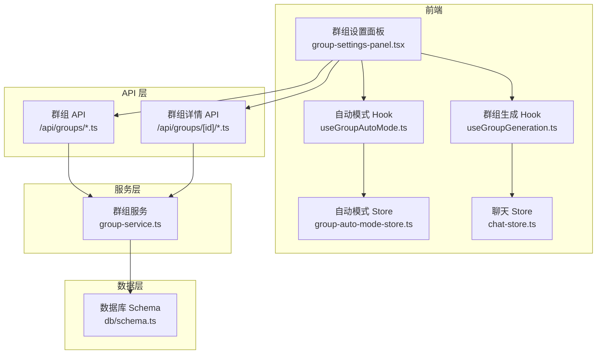
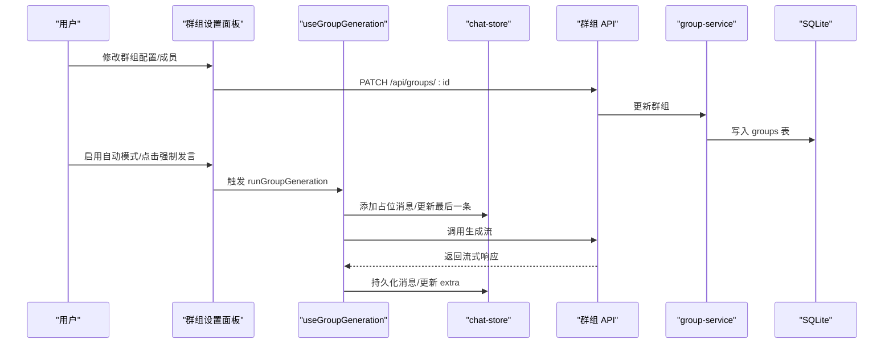
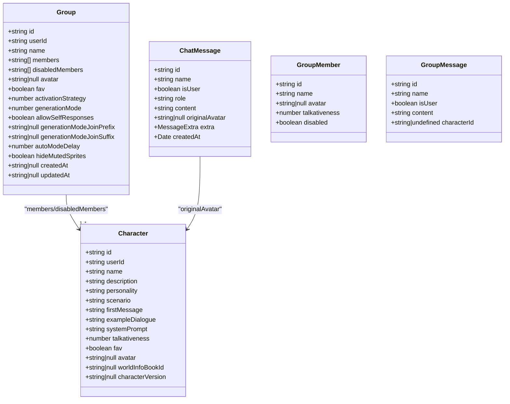
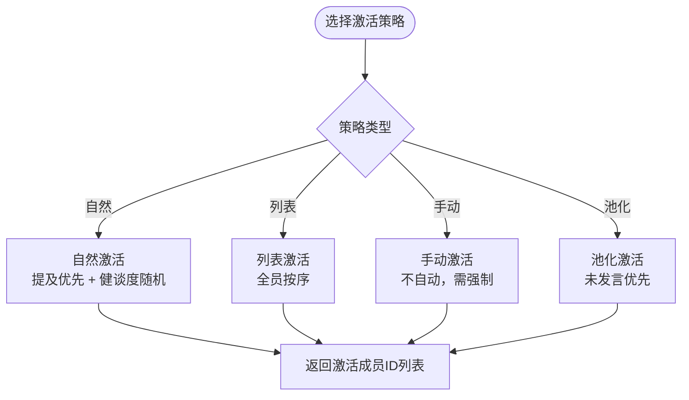
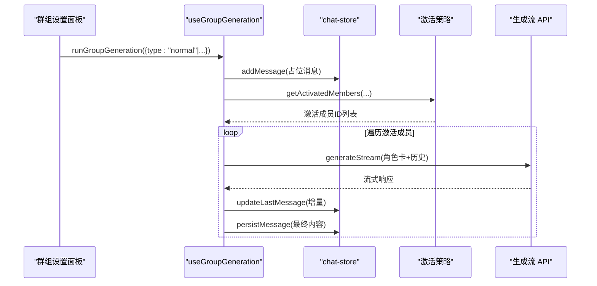
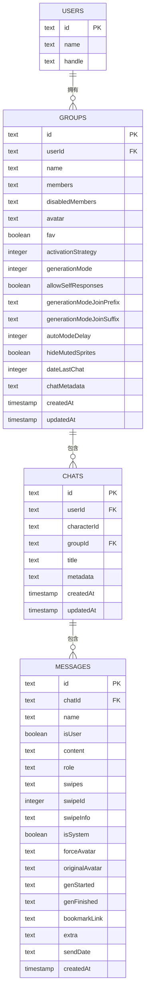
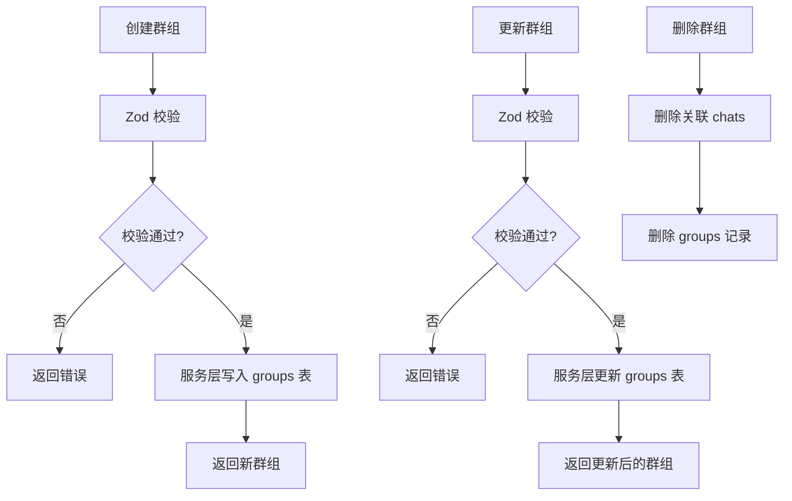
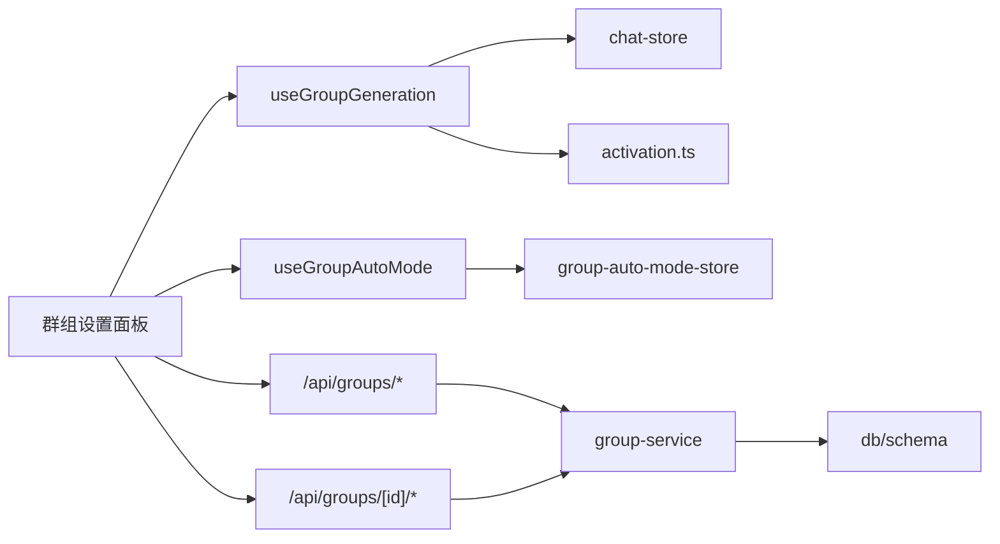

# 群组架构设计

<cite>
**本文档引用的文件**
- [src/lib/group-chat/activation.ts](file://src/lib/group-chat/activation.ts)
- [src/hooks/useGroupGeneration.ts](file://src/hooks/useGroupGeneration.ts)
- [src/hooks/useGroupAutoMode.ts](file://src/hooks/useGroupAutoMode.ts)
- [src/stores/group-auto-mode-store.ts](file://src/stores/group-auto-mode-store.ts)
- [src/components/groups/group-settings-panel.tsx](file://src/components/groups/group-settings-panel.tsx)
- [src/app/api/groups/route.ts](file://src/app/api/groups/route.ts)
- [src/app/api/groups/[id]/route.ts](file://src/app/api/groups/[id]/route.ts)
- [src/lib/services/group-service.ts](file://src/lib/services/group-service.ts)
- [src/lib/db/schema.ts](file://src/lib/db/schema.ts)
- [src/types/index.ts](file://src/types/index.ts)
- [src/stores/chat-store.ts](file://src/stores/chat-store.ts)
</cite>

## 目录
1. [简介](#简介)
2. [项目结构](#项目结构)
3. [核心组件](#核心组件)
4. [架构总览](#架构总览)
5. [详细组件分析](#详细组件分析)
6. [依赖关系分析](#依赖关系分析)
7. [性能考虑](#性能考虑)
8. [故障排查指南](#故障排查指南)
9. [结论](#结论)

## 简介
本文件系统性阐述群组架构设计，覆盖数据模型、成员关系与状态管理，解释 GroupItem 与 CharacterItem 的设计理念，激活策略与生成模式的差异，以及群组生命周期、权限控制与数据持久化机制。文档还提供群组创建、更新、删除的完整流程，并说明与角色系统的集成方式。

## 项目结构
群组功能围绕前端 Hook、UI 面板、API 路由与后端服务层协同工作，采用分层架构：
- 前端层：React 组件与 Hooks 负责交互与状态管理
- 业务层：群组生成与激活策略逻辑封装在 Hook 中
- 服务层：API 路由与服务类负责鉴权、校验与数据库操作
- 数据层：Drizzle ORM 映射 SQLite 表结构

**图表来源**
- [src/components/groups/group-settings-panel.tsx:1-318](file://src/components/groups/group-settings-panel.tsx#L1-318)
- [src/hooks/useGroupGeneration.ts:1-738](file://src/hooks/useGroupGeneration.ts#L1-738)
- [src/hooks/useGroupAutoMode.ts:1-62](file://src/hooks/useGroupAutoMode.ts#L1-62)
- [src/stores/group-auto-mode-store.ts:1-18](file://src/stores/group-auto-mode-store.ts#L1-18)
- [src/stores/chat-store.ts:1-200](file://src/stores/chat-store.ts#L1-200)
- [src/app/api/groups/route.ts:1-34](file://src/app/api/groups/route.ts#L1-34)
- [src/app/api/groups/[id]/route.ts](file://src/app/api/groups/[id]/route.ts#L1-55)
- [src/lib/services/group-service.ts:1-174](file://src/lib/services/group-service.ts#L1-174)
- [src/lib/db/schema.ts:100-126](file://src/lib/db/schema.ts#L100-126)

**章节来源**
- [src/components/groups/group-settings-panel.tsx:1-318](file://src/components/groups/group-settings-panel.tsx#L1-318)
- [src/hooks/useGroupGeneration.ts:1-738](file://src/hooks/useGroupGeneration.ts#L1-738)
- [src/hooks/useGroupAutoMode.ts:1-62](file://src/hooks/useGroupAutoMode.ts#L1-62)
- [src/stores/group-auto-mode-store.ts:1-18](file://src/stores/group-auto-mode-store.ts#L1-18)
- [src/stores/chat-store.ts:1-200](file://src/stores/chat-store.ts#L1-200)
- [src/app/api/groups/route.ts:1-34](file://src/app/api/groups/route.ts#L1-34)
- [src/app/api/groups/[id]/route.ts](file://src/app/api/groups/[id]/route.ts#L1-55)
- [src/lib/services/group-service.ts:1-174](file://src/lib/services/group-service.ts#L1-174)
- [src/lib/db/schema.ts:100-126](file://src/lib/db/schema.ts#L100-126)

## 核心组件
- 激活策略与生成模式：定义在激活模块中，提供自然、列表、手动、池化四种激活策略，以及替换、追加、追加（含禁用）三种生成模式。
- 群组生成 Hook：封装群组聊天的完整流程，包括消息持久化、历史构建、角色卡合并、流式生成与截断处理。
- 自动模式 Hook：基于定时器周期触发群组生成，受全局开关与群组状态控制。
- 群组设置面板：提供群组配置、成员管理、强制发言、自动模式开关与延迟设置。
- API 与服务层：提供群组的增删改查，配合 Zod 校验与 Drizzle ORM 持久化。
- 类型与数据模型：统一的 Group、Character、ChatMessage 等类型，保证前后端一致性。

**章节来源**
- [src/lib/group-chat/activation.ts:1-191](file://src/lib/group-chat/activation.ts#L1-191)
- [src/hooks/useGroupGeneration.ts:1-738](file://src/hooks/useGroupGeneration.ts#L1-738)
- [src/hooks/useGroupAutoMode.ts:1-62](file://src/hooks/useGroupAutoMode.ts#L1-62)
- [src/components/groups/group-settings-panel.tsx:1-318](file://src/components/groups/group-settings-panel.tsx#L1-318)
- [src/lib/services/group-service.ts:1-174](file://src/lib/services/group-service.ts#L1-174)
- [src/types/index.ts:272-286](file://src/types/index.ts#L272-286)

## 架构总览
群组系统遵循“前端交互 + 业务逻辑 + 服务层 + 数据库”的分层设计。前端通过 Hook 与 Store 管理状态，调用 API 路由，服务层进行鉴权与数据校验，最终通过 Drizzle ORM 写入 SQLite。

**图表来源**
- [src/components/groups/group-settings-panel.tsx:114-214](file://src/components/groups/group-settings-panel.tsx#L114-214)
- [src/hooks/useGroupGeneration.ts:450-691](file://src/hooks/useGroupGeneration.ts#L450-691)
- [src/stores/chat-store.ts:114-150](file://src/stores/chat-store.ts#L114-150)
- [src/app/api/groups/[id]/route.ts](file://src/app/api/groups/[id]/route.ts#L18-38)
- [src/lib/services/group-service.ts:133-159](file://src/lib/services/group-service.ts#L133-159)
- [src/lib/db/schema.ts:103-126](file://src/lib/db/schema.ts#L103-126)

## 详细组件分析

### 数据模型与接口设计
- Group 数据模型：包含群组标识、所属用户、成员列表、禁用成员、头像、收藏、激活策略、生成模式、自发言许可、Join 前缀/后缀、自动模式延迟、隐藏静音成员等字段。
- Character 类型：角色卡数据结构，包含名称、描述、个性、场景、首次消息、示例对话、系统提示、Talkativeness 等，用于群组激活与角色卡合并。
- ChatMessage 类型：消息结构，支持 isUser、role、content、originalAvatar、extra 等字段，extra 中携带生成批次 ID、API、模型等信息。
- GroupMember 与 GroupMessage：激活策略所需的数据结构，分别描述成员与近期消息。

**图表来源**
- [src/types/index.ts:272-286](file://src/types/index.ts#L272-286)
- [src/types/index.ts:154-184](file://src/types/index.ts#L154-184)
- [src/types/index.ts:60-84](file://src/types/index.ts#L60-84)
- [src/lib/group-chat/activation.ts:39-53](file://src/lib/group-chat/activation.ts#L39-53)

**章节来源**
- [src/types/index.ts:272-286](file://src/types/index.ts#L272-286)
- [src/types/index.ts:154-184](file://src/types/index.ts#L154-184)
- [src/types/index.ts:60-84](file://src/types/index.ts#L60-84)
- [src/lib/group-chat/activation.ts:39-53](file://src/lib/group-chat/activation.ts#L39-53)

### 激活策略与生成模式
- 激活策略
  - 自然（NATURAL）：优先匹配用户输入中的角色名，否则按健谈度随机选择，避免连续自言自语。
  - 列表（LIST）：按成员顺序全部激活。
  - 手动（MANUAL）：不自动激活，需用户强制指定角色。
  - 池化（POOLED）：从最近消息中识别当前轮次已发言者，从未发言者中随机选择，必要时排除上一位说话者。
- 生成模式
  - 替换（SWAP）：逐个角色独立生成，使用各自角色卡。
  - 追加（APPEND）：合并启用成员的角色卡字段，统一生成。
  - 追加（含禁用，APPEND_DISABLED）：合并所有成员的角色卡字段，包括被禁用成员（仅在当前发言者或特定场景保留）。

**图表来源**
- [src/lib/group-chat/activation.ts:66-112](file://src/lib/group-chat/activation.ts#L66-112)
- [src/lib/group-chat/activation.ts:114-125](file://src/lib/group-chat/activation.ts#L114-125)
- [src/lib/group-chat/activation.ts:133-167](file://src/lib/group-chat/activation.ts#L133-167)
- [src/lib/group-chat/activation.ts:170-190](file://src/lib/group-chat/activation.ts#L170-190)

**章节来源**
- [src/lib/group-chat/activation.ts:10-30](file://src/lib/group-chat/activation.ts#L10-30)
- [src/lib/group-chat/activation.ts:66-190](file://src/lib/group-chat/activation.ts#L66-190)

### 群组生成流程与状态管理
- 群组生成 Hook 负责：
  - 加载群组与成员数据，构建世界书上下文。
  - 根据激活策略计算激活成员，逐角色生成消息。
  - 构造角色卡合并（APPEND/APPEND_DISABLED 模式），构建历史消息（区分用户、当前角色与他人角色）。
  - 流式接收生成内容，进行串角截断，更新最后一条占位消息。
  - 持久化消息，回填服务端真实 ID，记录 extra（包含生成批次 ID、API、模型）。
  - 支持普通生成、续写、重生成、流式重新生成与自动模式触发。
- 自动模式 Hook：
  - 在启用且为群组聊天时，按设定延迟周期触发生成。
  - 避免与正在进行的生成冲突，使用 AbortController 控制中断。
  - 与全局自动模式开关联动。

**图表来源**
- [src/hooks/useGroupGeneration.ts:450-691](file://src/hooks/useGroupGeneration.ts#L450-691)
- [src/hooks/useGroupGeneration.ts:277-447](file://src/hooks/useGroupGeneration.ts#L277-447)
- [src/lib/group-chat/activation.ts:170-190](file://src/lib/group-chat/activation.ts#L170-190)
- [src/stores/chat-store.ts:114-150](file://src/stores/chat-store.ts#L114-150)

**章节来源**
- [src/hooks/useGroupGeneration.ts:59-738](file://src/hooks/useGroupGeneration.ts#L59-738)
- [src/hooks/useGroupAutoMode.ts:17-61](file://src/hooks/useGroupAutoMode.ts#L17-61)

### 权限控制与数据持久化
- 权限控制
  - API 路由在请求进入时进行会话鉴权，仅授权用户可访问。
  - 服务层在查询与更新时结合 userId 进行资源归属校验，防止越权。
- 数据持久化
  - 群组数据以 JSON 形式存储在 groups 表的 members/disabledMembers 等字段中。
  - 聊天与消息通过 chats/messages 表维护，支持按群组维度关联与删除。
  - 自动生成与更新时间戳，便于排序与审计。

**图表来源**
- [src/lib/db/schema.ts:6-16](file://src/lib/db/schema.ts#L6-16)
- [src/lib/db/schema.ts:103-126](file://src/lib/db/schema.ts#L103-126)
- [src/lib/db/schema.ts:131-140](file://src/lib/db/schema.ts#L131-140)
- [src/lib/db/schema.ts:145-168](file://src/lib/db/schema.ts#L145-168)

**章节来源**
- [src/app/api/groups/route.ts:5-12](file://src/app/api/groups/route.ts#L5-12)
- [src/app/api/groups/[id]/route.ts](file://src/app/api/groups/[id]/route.ts#L7-16)
- [src/lib/services/group-service.ts:93-107](file://src/lib/services/group-service.ts#L93-107)
- [src/lib/db/schema.ts:103-126](file://src/lib/db/schema.ts#L103-126)

### 群组生命周期管理
- 创建：前端提交表单，API 校验后调用服务层创建，返回新群组。
- 更新：面板修改配置，PATCH 请求更新群组，服务层序列化 JSON 字段并写入数据库。
- 删除：删除群组时先清理关联聊天，再删除群组记录，确保数据一致性。

**图表来源**
- [src/app/api/groups/route.ts:14-33](file://src/app/api/groups/route.ts#L14-33)
- [src/app/api/groups/[id]/route.ts](file://src/app/api/groups/[id]/route.ts#L18-38)
- [src/lib/services/group-service.ts:109-131](file://src/lib/services/group-service.ts#L109-131)
- [src/lib/services/group-service.ts:133-159](file://src/lib/services/group-service.ts#L133-159)
- [src/lib/services/group-service.ts:161-172](file://src/lib/services/group-service.ts#L161-172)

**章节来源**
- [src/app/api/groups/route.ts:14-33](file://src/app/api/groups/route.ts#L14-33)
- [src/app/api/groups/[id]/route.ts](file://src/app/api/groups/[id]/route.ts#L18-38)
- [src/lib/services/group-service.ts:109-172](file://src/lib/services/group-service.ts#L109-172)

### 与角色系统的集成
- 成员来源：群组成员来自角色卡列表，加载时通过角色 ID 映射到具体角色对象。
- 角色卡合并：在 APPEND/APPEND_DISABLED 模式下，将多个角色的描述、个性、场景、示例对话等字段按 Join 前缀/后缀规则合并，形成统一系统提示。
- 历史构建：区分用户消息、当前角色消息与其他角色消息，避免混淆与角色串扰。
- Talkativeness：自然激活策略使用 talkativeness 参数进行概率选择，提升多样性。

**章节来源**
- [src/hooks/useGroupGeneration.ts:109-132](file://src/hooks/useGroupGeneration.ts#L109-132)
- [src/hooks/useGroupGeneration.ts:170-257](file://src/hooks/useGroupGeneration.ts#L170-257)
- [src/hooks/useGroupGeneration.ts:260-274](file://src/hooks/useGroupGeneration.ts#L260-274)
- [src/types/index.ts:154-184](file://src/types/index.ts#L154-184)

## 依赖关系分析
- 组件耦合
  - 群组设置面板依赖生成 Hook 与自动模式 Hook，实现配置变更与即时触发。
  - 生成 Hook 依赖聊天 Store 进行消息状态管理，依赖激活策略模块计算激活成员。
  - API 路由依赖服务层，服务层依赖数据库 Schema。
- 外部依赖
  - Drizzle ORM 提供类型安全的数据库访问。
  - Zod 用于请求体校验。
  - React Hooks 与 Zustand Store 管理前端状态。

**图表来源**
- [src/components/groups/group-settings-panel.tsx:1-318](file://src/components/groups/group-settings-panel.tsx#L1-318)
- [src/hooks/useGroupGeneration.ts:1-738](file://src/hooks/useGroupGeneration.ts#L1-738)
- [src/hooks/useGroupAutoMode.ts:1-62](file://src/hooks/useGroupAutoMode.ts#L1-62)
- [src/stores/group-auto-mode-store.ts:1-18](file://src/stores/group-auto-mode-store.ts#L1-18)
- [src/stores/chat-store.ts:1-200](file://src/stores/chat-store.ts#L1-200)
- [src/lib/group-chat/activation.ts:1-191](file://src/lib/group-chat/activation.ts#L1-191)
- [src/app/api/groups/route.ts:1-34](file://src/app/api/groups/route.ts#L1-34)
- [src/app/api/groups/[id]/route.ts](file://src/app/api/groups/[id]/route.ts#L1-55)
- [src/lib/services/group-service.ts:1-174](file://src/lib/services/group-service.ts#L1-174)
- [src/lib/db/schema.ts:100-126](file://src/lib/db/schema.ts#L100-126)

**章节来源**
- [src/components/groups/group-settings-panel.tsx:1-318](file://src/components/groups/group-settings-panel.tsx#L1-318)
- [src/hooks/useGroupGeneration.ts:1-738](file://src/hooks/useGroupGeneration.ts#L1-738)
- [src/lib/group-chat/activation.ts:1-191](file://src/lib/group-chat/activation.ts#L1-191)
- [src/lib/services/group-service.ts:1-174](file://src/lib/services/group-service.ts#L1-174)
- [src/lib/db/schema.ts:100-126](file://src/lib/db/schema.ts#L100-126)

## 性能考虑
- 流式生成：采用流式读取与增量更新，减少一次性渲染压力。
- 截断保护：检测其他角色名称出现即截断，避免生成内容冗余与角色串扰。
- 自动模式节流：在生成进行中跳过本轮，避免并发冲突。
- 数据库写入：批量更新与按需序列化 JSON 字段，降低 I/O 开销。
- 前端状态：使用局部状态与闭包缓存，避免不必要的重渲染。

## 故障排查指南
- 无法生成消息
  - 检查是否选择了有效模型与提供商。
  - 查看自动模式是否处于生成中状态，避免并发冲突。
  - 确认激活成员列表非空，MANUAL 策略需手动指定角色。
- 消息持久化异常
  - 确认 chat-store 的 persistMessage 调用链路正常，extra 字段包含生成批次 ID。
  - 检查服务端返回状态码与错误信息。
- 自动模式不生效
  - 确认全局自动模式开关已开启，且当前聊天为群组聊天。
  - 检查延迟设置是否合理，避免过于频繁触发。
- 权限问题
  - 确认会话鉴权通过，API 返回 401 时检查登录状态。
  - 更新群组时确认 userId 与资源归属一致。

**章节来源**
- [src/hooks/useGroupGeneration.ts:453-456](file://src/hooks/useGroupGeneration.ts#L453-456)
- [src/hooks/useGroupAutoMode.ts:24-53](file://src/hooks/useGroupAutoMode.ts#L24-53)
- [src/stores/chat-store.ts:52-77](file://src/stores/chat-store.ts#L52-77)
- [src/app/api/groups/[id]/route.ts](file://src/app/api/groups/[id]/route.ts#L19-37)

## 结论
本群组架构以清晰的分层设计实现了灵活的激活策略与生成模式，结合完善的权限控制与数据持久化，提供了稳定可靠的群组聊天体验。通过 Hook 与 Store 的解耦，UI 面板能够高效地驱动业务流程，同时保持良好的可维护性与扩展性。