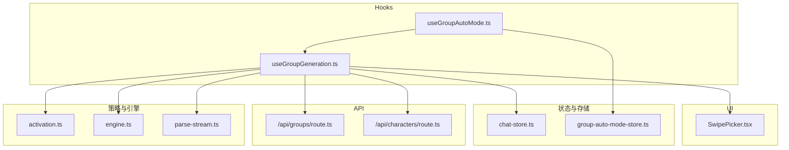
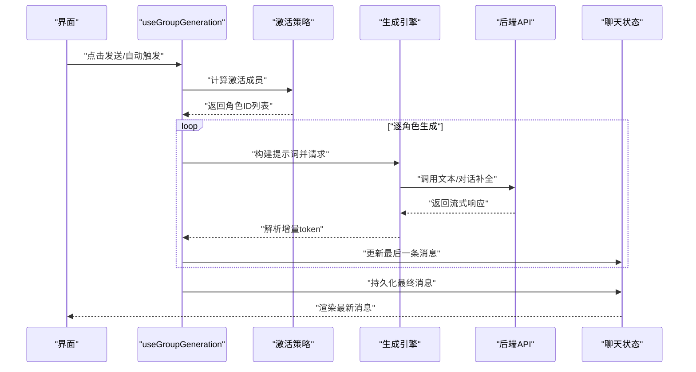
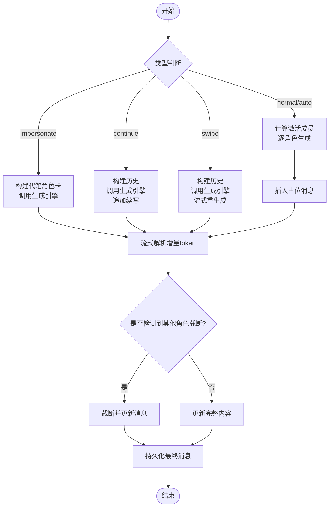
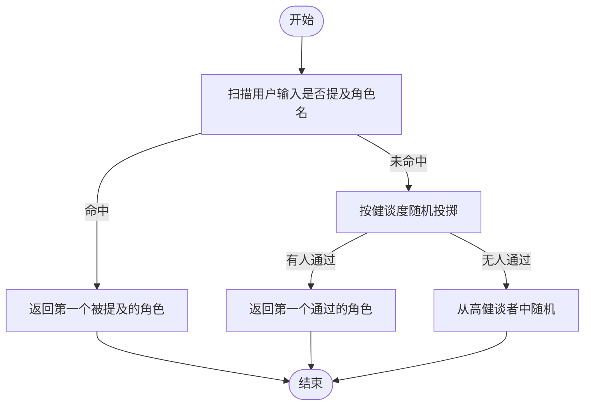
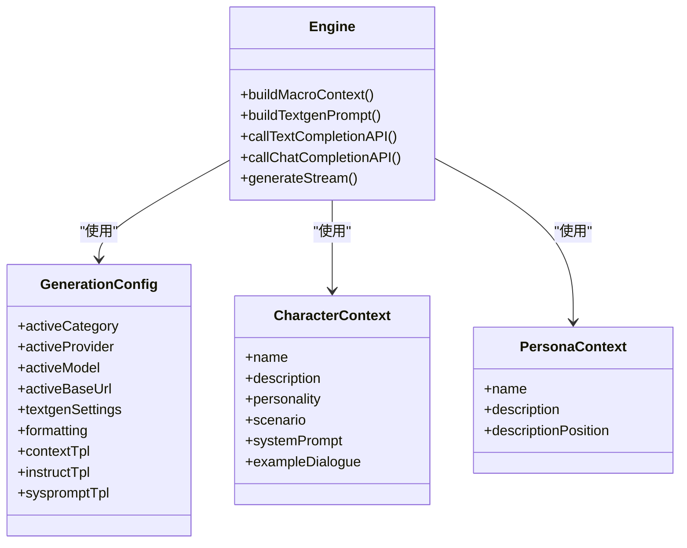
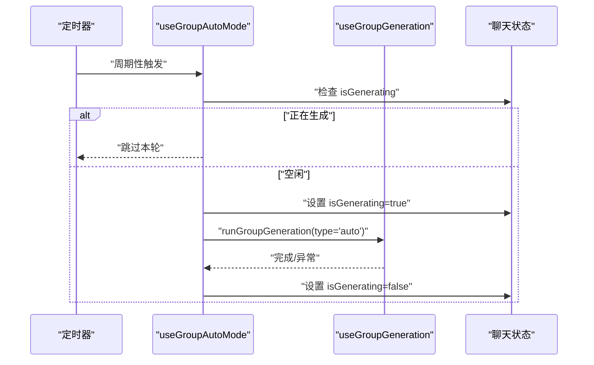
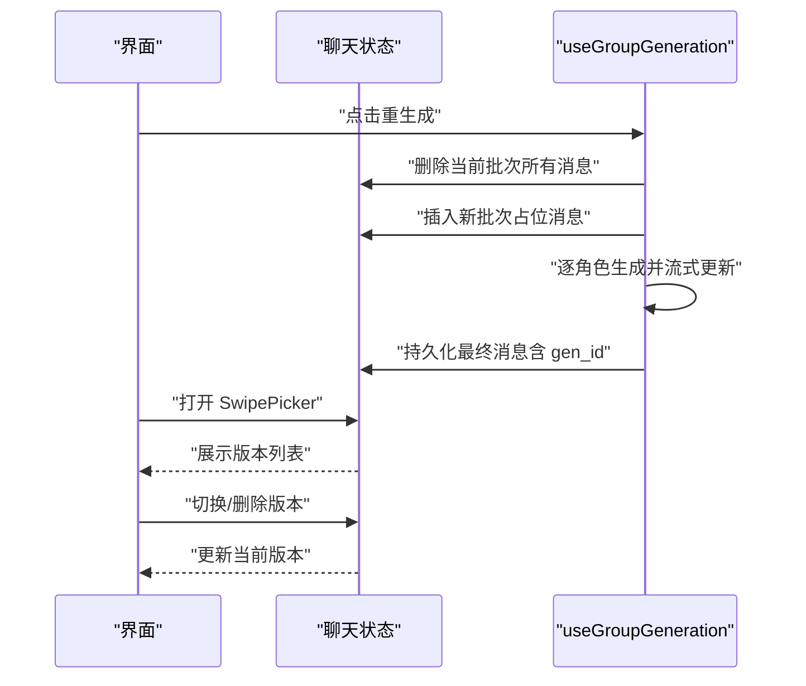
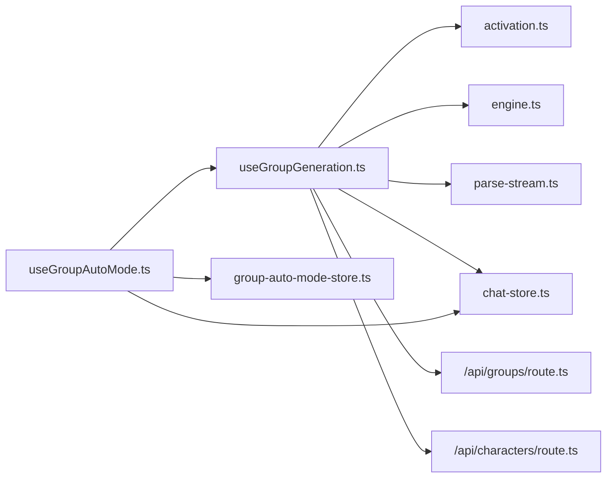

# 群组生成机制

<cite>
**本文引用的文件**
- [useGroupGeneration.ts](file://src/hooks/useGroupGeneration.ts)
- [useGroupAutoMode.ts](file://src/hooks/useGroupAutoMode.ts)
- [activation.ts](file://src/lib/group-chat/activation.ts)
- [engine.ts](file://src/lib/generation/engine.ts)
- [parse-stream.ts](file://src/lib/textgen/parse-stream.ts)
- [group-auto-mode-store.ts](file://src/stores/group-auto-mode-store.ts)
- [chat-store.ts](file://src/stores/chat-store.ts)
- [route.ts](file://src/app/api/groups/route.ts)
- [route.ts](file://src/app/api/characters/route.ts)
- [SwipePicker.tsx](file://src/components/chat/message-bubble/SwipePicker.tsx)
</cite>

## 目录
1. [引言](#引言)
2. [项目结构](#项目结构)
3. [核心组件](#核心组件)
4. [架构总览](#架构总览)
5. [详细组件分析](#详细组件分析)
6. [依赖关系分析](#依赖关系分析)
7. [性能考量](#性能考量)
8. [故障排查指南](#故障排查指南)
9. [结论](#结论)
10. [附录](#附录)

## 引言
本文件系统性阐述本项目的群组生成机制，覆盖多角色轮换生成的实现原理、角色激活策略、消息流转与状态管理；深入解释 useGroupGeneration 与 useGroupAutoMode Hook 的工作机制与使用方法；阐明 @点名功能的解析算法、消息路由与响应处理；说明 Swipe 多版本机制、冲突解决与一致性保证；并提供性能优化、并发控制与错误处理策略。

## 项目结构
围绕群组生成的关键模块分布如下：
- Hooks 层：useGroupGeneration、useGroupAutoMode
- 激活策略：activation.ts（自然、列表、手动、池化）
- 生成引擎：engine.ts（统一构建提示词与调用 API）
- 流式解析：parse-stream.ts（兼容多后端的 SSE/NDJSON 解析）
- 状态存储：chat-store.ts、group-auto-mode-store.ts
- API 层：/api/groups、/api/characters
- UI 组件：SwipePicker.tsx（消息多版本选择）

**图表来源**
- [useGroupGeneration.ts:1-738](file://src/hooks/useGroupGeneration.ts#L1-L738)
- [useGroupAutoMode.ts:1-62](file://src/hooks/useGroupAutoMode.ts#L1-L62)
- [activation.ts:1-191](file://src/lib/group-chat/activation.ts#L1-L191)
- [engine.ts:1-238](file://src/lib/generation/engine.ts#L1-L238)
- [parse-stream.ts:1-116](file://src/lib/textgen/parse-stream.ts#L1-L116)
- [group-auto-mode-store.ts:1-18](file://src/stores/group-auto-mode-store.ts#L1-L18)
- [chat-store.ts:1-200](file://src/stores/chat-store.ts#L1-L200)
- [route.ts:1-34](file://src/app/api/groups/route.ts#L1-L34)
- [route.ts:1-42](file://src/app/api/characters/route.ts#L1-L42)
- [SwipePicker.tsx:1-129](file://src/components/chat/message-bubble/SwipePicker.tsx#L1-L129)

**章节来源**
- [useGroupGeneration.ts:1-738](file://src/hooks/useGroupGeneration.ts#L1-L738)
- [useGroupAutoMode.ts:1-62](file://src/hooks/useGroupAutoMode.ts#L1-L62)
- [activation.ts:1-191](file://src/lib/group-chat/activation.ts#L1-L191)
- [engine.ts:1-238](file://src/lib/generation/engine.ts#L1-L238)
- [parse-stream.ts:1-116](file://src/lib/textgen/parse-stream.ts#L1-L116)
- [group-auto-mode-store.ts:1-18](file://src/stores/group-auto-mode-store.ts#L1-L18)
- [chat-store.ts:1-200](file://src/stores/chat-store.ts#L1-L200)
- [route.ts:1-34](file://src/app/api/groups/route.ts#L1-L34)
- [route.ts:1-42](file://src/app/api/characters/route.ts#L1-L42)
- [SwipePicker.tsx:1-129](file://src/components/chat/message-bubble/SwipePicker.tsx#L1-L129)

## 核心组件
- useGroupGeneration：封装群组聊天的发送、续写、重生成、代笔、滑动重生成等全流程，协调激活策略、角色卡合并、历史构建、流式解析与持久化。
- useGroupAutoMode：基于定时器自动触发群组生成，避免与进行中的生成任务冲突，并支持独立的 AbortController 控制。
- 激活策略（activation.ts）：提供自然、列表、手动、池化四种策略，决定下一个说话的角色。
- 生成引擎（engine.ts）：统一构建提示词模板、宏替换、历史序列、系统提示词，并根据配置选择文本补全或对话补全 API。
- 流式解析（parse-stream.ts）：兼容多后端的 SSE/NDJSON/纯文本流，抽取增量 token 并回调全量内容。
- 状态存储（chat-store.ts、group-auto-mode-store.ts）：维护当前聊天、消息列表、生成状态、群组自动模式开关。
- API（/api/groups、/api/characters）：加载群组与角色列表，供 Hook 初始化使用。
- UI（SwipePicker.tsx）：展示消息多版本并支持删除与切换。

**章节来源**
- [useGroupGeneration.ts:59-737](file://src/hooks/useGroupGeneration.ts#L59-L737)
- [useGroupAutoMode.ts:17-61](file://src/hooks/useGroupAutoMode.ts#L17-L61)
- [activation.ts:10-191](file://src/lib/group-chat/activation.ts#L10-L191)
- [engine.ts:25-238](file://src/lib/generation/engine.ts#L25-L238)
- [parse-stream.ts:10-116](file://src/lib/textgen/parse-stream.ts#L10-L116)
- [chat-store.ts:15-103](file://src/stores/chat-store.ts#L15-L103)
- [group-auto-mode-store.ts:7-17](file://src/stores/group-auto-mode-store.ts#L7-L17)
- [route.ts:1-34](file://src/app/api/groups/route.ts#L1-L34)
- [route.ts:1-42](file://src/app/api/characters/route.ts#L1-L42)
- [SwipePicker.tsx:17-129](file://src/components/chat/message-bubble/SwipePicker.tsx#L17-L129)

## 架构总览
群组生成从 UI 触发，进入 useGroupGeneration 的 runGroupGeneration，依据激活策略计算应说话的角色，逐角色调用 generateStream，流式消费后更新消息并持久化。自动模式由 useGroupAutoMode 定时触发，避免与生成冲突。

**图表来源**
- [useGroupGeneration.ts:450-691](file://src/hooks/useGroupGeneration.ts#L450-L691)
- [activation.ts:169-191](file://src/lib/group-chat/activation.ts#L169-L191)
- [engine.ts:229-238](file://src/lib/generation/engine.ts#L229-L238)
- [parse-stream.ts:38-99](file://src/lib/textgen/parse-stream.ts#L38-L99)
- [chat-store.ts:25-99](file://src/stores/chat-store.ts#L25-L99)

## 详细组件分析

### useGroupGeneration Hook 机制
- 群组与成员加载：首次进入群组聊天时并行拉取群组与角色列表，映射成员信息。
- 世界信息构建：聚合全局与群内角色的世界书 ID，形成 WI payload。
- 角色卡合并（APPEND 模式）：将多个成员的描述、个性、场景、示例对话按前缀/后缀规则拼接，支持占位符替换。
- 历史构建：区分用户、当前角色与他人角色的历史，他人角色以 system 角色+名称前缀标记，避免混淆。
- 生成流程：
  - impersonate：在 APPEND 合并基础上注入“代笔”指令，不持久化，仅回调片段。
  - continue：对最后一条 assistant 内容追加续写，更新本地并回写数据库。
  - swipe：对最后一条 assistant 进行流式重生成（不删除消息），用于多版本对比。
  - normal/auto：计算激活成员，逐角色生成，插入占位消息，流式更新，最终持久化。
- 截断保护：检测其他角色名称开头的换行，及时截断并更新消息。
- 错误处理：捕获中止信号与异常，更新最后一条消息为错误提示并回调 onError。

**图表来源**
- [useGroupGeneration.ts:472-536](file://src/hooks/useGroupGeneration.ts#L472-L536)
- [useGroupGeneration.ts:538-571](file://src/hooks/useGroupGeneration.ts#L538-L571)
- [useGroupGeneration.ts:573-666](file://src/hooks/useGroupGeneration.ts#L573-L666)
- [parse-stream.ts:38-99](file://src/lib/textgen/parse-stream.ts#L38-L99)

**章节来源**
- [useGroupGeneration.ts:59-737](file://src/hooks/useGroupGeneration.ts#L59-L737)

### 角色激活策略
- 自然激活（NATURAL）：扫描用户输入是否包含角色名，若命中则优先；否则按健谈度随机投掷，无人通过则从高健谈者中随机。
- 列表激活（LIST）：按成员顺序全部轮流。
- 手动激活（MANUAL）：不自动激活，需用户强制指定角色。
- 池化激活（POOLED）：从最近消息反向扫描，收集当前轮次已发言者，从未发言者中随机；若全已发言，则排除上一位后随机。

**图表来源**
- [activation.ts:59-112](file://src/lib/group-chat/activation.ts#L59-L112)

**章节来源**
- [activation.ts:10-191](file://src/lib/group-chat/activation.ts#L10-L191)

### 生成引擎与消息格式化
- 宏上下文：汇总用户、角色、persona、历史、输入等宏变量，用于模板替换。
- 提示词构建：支持 instruct 与简单模板两种路径，结合系统提示词、历史与宏变量生成最终 prompt。
- API 调用：根据 activeCategory 选择文本补全或对话补全，统一返回流式响应。
- 停止字符串：自动收集并合并 stop 列表，提升生成稳定性。

**图表来源**
- [engine.ts:25-91](file://src/lib/generation/engine.ts#L25-L91)
- [engine.ts:97-146](file://src/lib/generation/engine.ts#L97-L146)
- [engine.ts:155-227](file://src/lib/generation/engine.ts#L155-L227)
- [engine.ts:232-238](file://src/lib/generation/engine.ts#L232-L238)

**章节来源**
- [engine.ts:1-238](file://src/lib/generation/engine.ts#L1-L238)

### 流式解析与跨后端兼容
- 多格式支持：SSE、NDJSON、纯文本、部分后端直接输出文本等。
- token 提取：从多种响应结构中抽取增量 token，统一回调全量内容。
- 中止安全：支持 AbortSignal，读取过程中可中断并安全退出。

**章节来源**
- [parse-stream.ts:10-116](file://src/lib/textgen/parse-stream.ts#L10-L116)

### 自动模式 Hook（useGroupAutoMode）
- 条件触发：仅在启用且为群组聊天时启动定时器。
- 冲突避免：每次触发前检查 isGenerating，避免与正在进行的生成冲突。
- 中止控制：使用独立 AbortController，关闭开关时立即 abort。
- 错误降级：捕获异常并记录警告，不影响定时器运行。

**图表来源**
- [useGroupAutoMode.ts:24-60](file://src/hooks/useGroupAutoMode.ts#L24-L60)
- [chat-store.ts:22-34](file://src/stores/chat-store.ts#L22-L34)
- [useGroupGeneration.ts:450-691](file://src/hooks/useGroupGeneration.ts#L450-L691)

**章节来源**
- [useGroupAutoMode.ts:1-62](file://src/hooks/useGroupAutoMode.ts#L1-L62)
- [group-auto-mode-store.ts:1-18](file://src/stores/group-auto-mode-store.ts#L1-L18)

### @点名功能解析与路由
- 解析算法：在自然激活策略中，扫描用户输入是否包含角色名，命中即优先返回该角色。
- 路由与响应：命中后直接进入该角色的生成流程，构建历史与角色卡，调用生成引擎并流式更新。
- 一致性：@点名不改变群组配置，仅影响本次激活决策。

**章节来源**
- [activation.ts:77-86](file://src/lib/group-chat/activation.ts#L77-L86)
- [useGroupGeneration.ts:617-628](file://src/hooks/useGroupGeneration.ts#L617-L628)

### Swipe 多版本机制、冲突解决与一致性
- 版本生成：重生成时通过 appendSwipe 追加新版本，同时保留旧版本。
- 版本选择：SwipePicker 展示所有版本，支持点击切换与删除（保留至少一个版本）。
- 冲突解决：当进行新的生成时，若存在未完成的生成，自动模式会等待其完成；普通生成流程中，AbortSignal 可中止当前生成。
- 一致性保证：所有消息持久化时携带生成批次标识（gen_id），重生成时按批次删除旧版本再插入新版本，确保 UI 与数据库一致。

**图表来源**
- [useGroupGeneration.ts:694-728](file://src/hooks/useGroupGeneration.ts#L694-L728)
- [chat-store.ts:78-88](file://src/stores/chat-store.ts#L78-L88)
- [SwipePicker.tsx:21-129](file://src/components/chat/message-bubble/SwipePicker.tsx#L21-L129)

**章节来源**
- [useGroupGeneration.ts:694-728](file://src/hooks/useGroupGeneration.ts#L694-L728)
- [chat-store.ts:78-88](file://src/stores/chat-store.ts#L78-L88)
- [SwipePicker.tsx:1-129](file://src/components/chat/message-bubble/SwipePicker.tsx#L1-L129)

## 依赖关系分析
- useGroupGeneration 依赖：
  - 激活策略：自然/列表/手动/池化
  - 生成引擎：提示词构建与 API 调用
  - 流式解析：增量 token 提取
  - 状态存储：消息增删改查、生成状态
  - API：群组与角色列表
- useGroupAutoMode 依赖：
  - useGroupGeneration 的生成能力
  - 自动模式开关 store
  - 聊天状态 store 的 isGenerating

**图表来源**
- [useGroupGeneration.ts:16-28](file://src/hooks/useGroupGeneration.ts#L16-L28)
- [useGroupAutoMode.ts:12-15](file://src/hooks/useGroupAutoMode.ts#L12-L15)
- [activation.ts:10-30](file://src/lib/group-chat/activation.ts#L10-L30)
- [engine.ts:25-36](file://src/lib/generation/engine.ts#L25-L36)
- [parse-stream.ts:10-15](file://src/lib/textgen/parse-stream.ts#L10-L15)
- [chat-store.ts:15-34](file://src/stores/chat-store.ts#L15-L34)
- [group-auto-mode-store.ts:7-17](file://src/stores/group-auto-mode-store.ts#L7-L17)
- [route.ts:1-34](file://src/app/api/groups/route.ts#L1-L34)
- [route.ts:1-42](file://src/app/api/characters/route.ts#L1-L42)

**章节来源**
- [useGroupGeneration.ts:16-28](file://src/hooks/useGroupGeneration.ts#L16-L28)
- [useGroupAutoMode.ts:12-15](file://src/hooks/useGroupAutoMode.ts#L12-L15)
- [activation.ts:10-30](file://src/lib/group-chat/activation.ts#L10-L30)
- [engine.ts:25-36](file://src/lib/generation/engine.ts#L25-L36)
- [parse-stream.ts:10-15](file://src/lib/textgen/parse-stream.ts#L10-L15)
- [chat-store.ts:15-34](file://src/stores/chat-store.ts#L15-L34)
- [group-auto-mode-store.ts:7-17](file://src/stores/group-auto-mode-store.ts#L7-L17)
- [route.ts:1-34](file://src/app/api/groups/route.ts#L1-L34)
- [route.ts:1-42](file://src/app/api/characters/route.ts#L1-L42)

## 性能考量
- 并发控制
  - 自动模式使用独立 AbortController，避免多个生成任务互相干扰。
  - 生成期间设置 isGenerating，自动模式检测并跳过本轮，减少无效调用。
- 流式更新
  - 采用增量 token 回调，降低 UI 重绘压力，提升交互流畅度。
- 数据预取与缓存
  - 首次进入群组时并行加载群组与角色列表，减少等待时间。
- 历史构建优化
  - 他人角色以 system 角色+名称标记，避免重复拼接与混淆，提高模型稳定性。
- 停止字符串合并
  - 自动收集并合并 stop 列表，缩短生成长度，减少 token 消耗。

**章节来源**
- [useGroupAutoMode.ts:24-60](file://src/hooks/useGroupAutoMode.ts#L24-L60)
- [chat-store.ts:22-34](file://src/stores/chat-store.ts#L22-L34)
- [useGroupGeneration.ts:111-114](file://src/hooks/useGroupGeneration.ts#L111-L114)
- [engine.ts:160-181](file://src/lib/generation/engine.ts#L160-L181)

## 故障排查指南
- 无法生成
  - 检查是否选择了模型（activeModel），未选择时会回调错误。
  - 确认 isGenerating 状态，自动模式会在生成中时跳过。
- 生成被中断
  - 确认 AbortSignal 是否被外部中止；中断时会显示“已中止”提示。
- 截断问题
  - 若发现其他角色名提前出现导致截断，检查角色名是否与输入冲突；必要时调整角色名或禁用相关成员。
- 多版本混乱
  - 使用 SwipePicker 切换版本；删除版本时注意保留至少一个版本。
- 自动模式异常
  - 检查自动模式开关与延迟设置；确认未与其他生成任务冲突。

**章节来源**
- [useGroupGeneration.ts:453-456](file://src/hooks/useGroupGeneration.ts#L453-L456)
- [useGroupGeneration.ts:564-569](file://src/hooks/useGroupGeneration.ts#L564-L569)
- [useGroupGeneration.ts:377-389](file://src/hooks/useGroupGeneration.ts#L377-L389)
- [useGroupAutoMode.ts:33-47](file://src/hooks/useGroupAutoMode.ts#L33-L47)
- [SwipePicker.tsx:109-121](file://src/components/chat/message-bubble/SwipePicker.tsx#L109-L121)

## 结论
本群组生成机制通过统一的生成引擎与灵活的激活策略，实现了多角色轮换生成、@点名路由、自动模式与多版本管理。借助流式解析与状态管理，系统在性能与一致性之间取得平衡；通过中止控制与错误处理，提升了用户体验与稳定性。建议在复杂场景下合理配置激活策略与生成模式，并利用自动模式与多版本工具提升创作效率。

## 附录
- 关键 API
  - GET /api/groups：获取用户群组列表
  - GET /api/characters：获取用户角色列表
- 关键状态
  - isGenerating：全局生成状态，用于自动模式避让
  - group.autoModeDelay：自动模式触发间隔（秒）
  - 消息 extra.gen_id：生成批次标识，用于重生成与版本管理

**章节来源**
- [route.ts:1-34](file://src/app/api/groups/route.ts#L1-L34)
- [route.ts:1-42](file://src/app/api/characters/route.ts#L1-L42)
- [chat-store.ts:22-34](file://src/stores/chat-store.ts#L22-L34)
- [useGroupGeneration.ts:43-44](file://src/hooks/useGroupGeneration.ts#L43-L44)