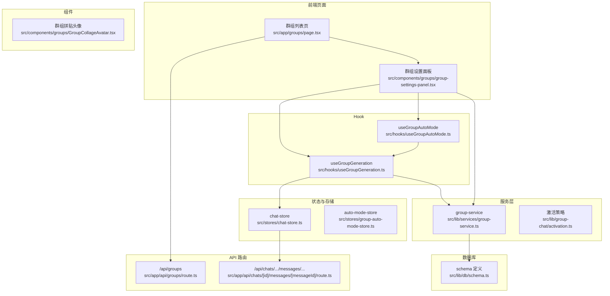
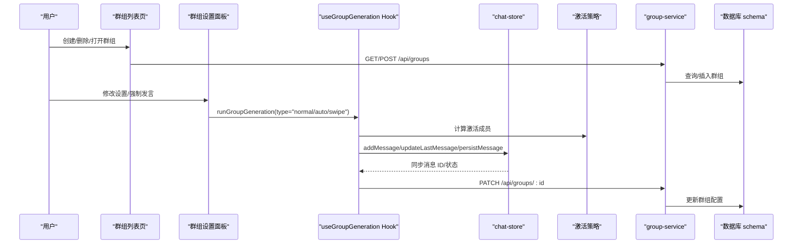
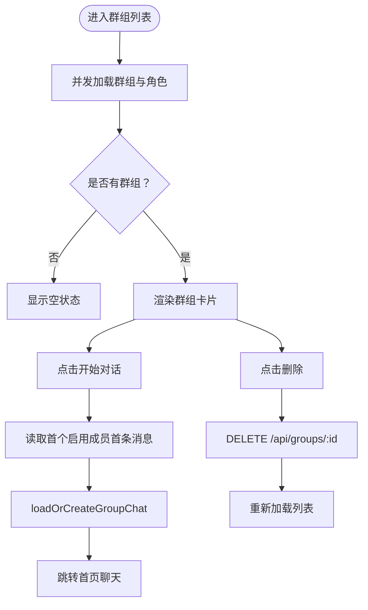
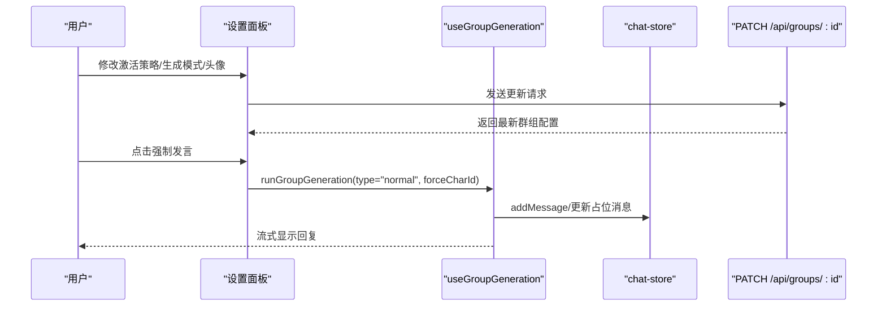
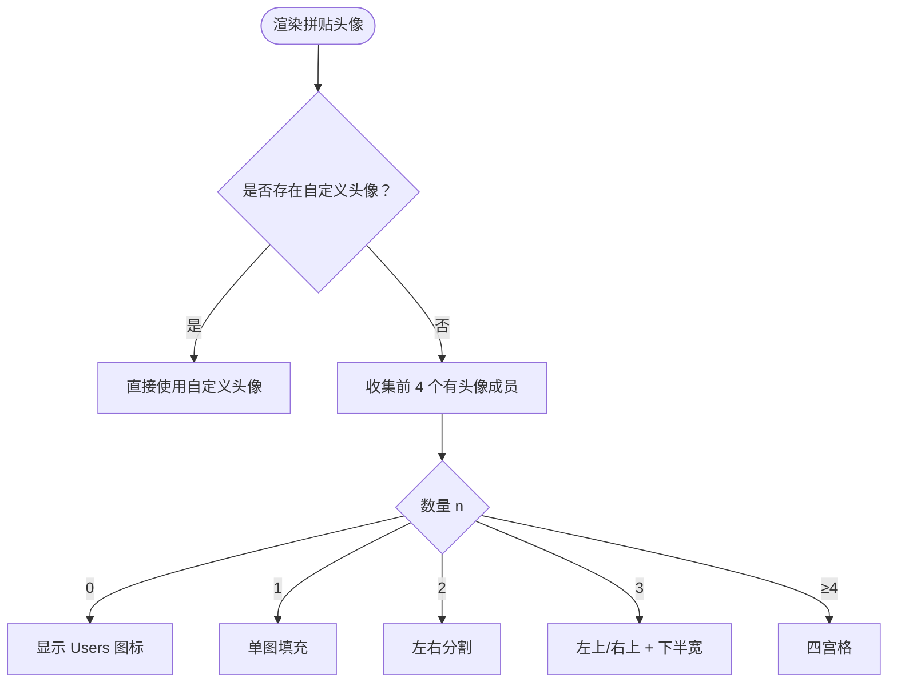
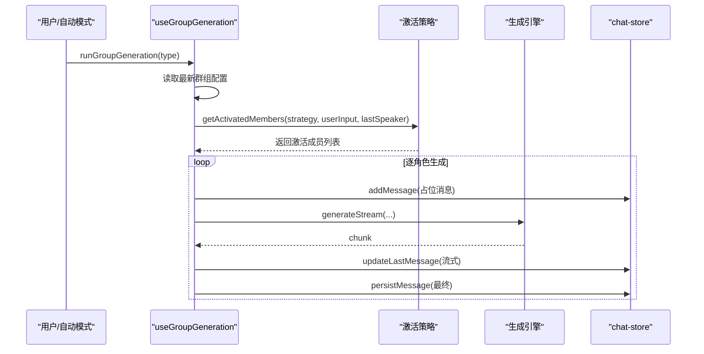
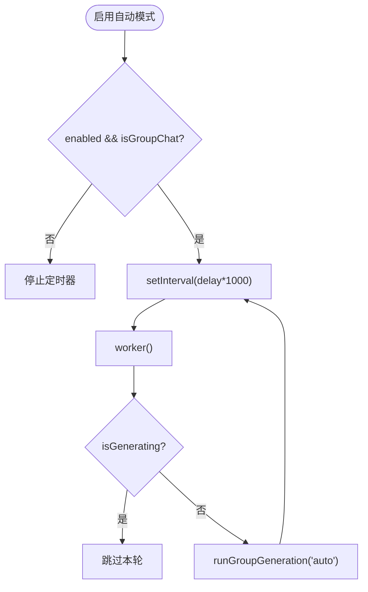
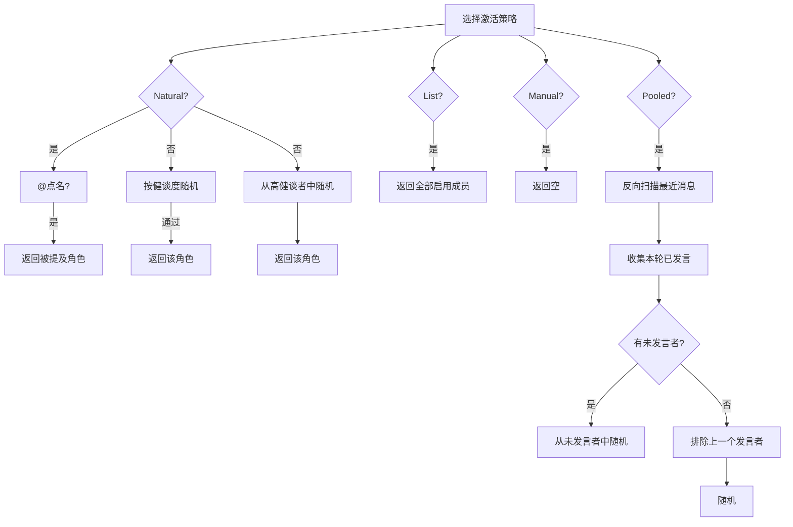
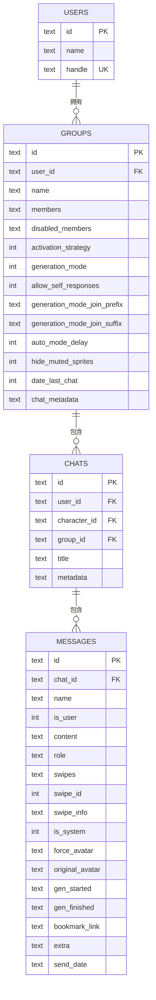
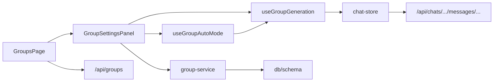

# 群组聊天系统

<cite>
**本文档引用的文件**
- [src/app/groups/page.tsx](file://src/app/groups/page.tsx)
- [src/components/groups/group-settings-panel.tsx](file://src/components/groups/group-settings-panel.tsx)
- [src/components/groups/GroupCollageAvatar.tsx](file://src/components/groups/GroupCollageAvatar.tsx)
- [src/hooks/useGroupGeneration.ts](file://src/hooks/useGroupGeneration.ts)
- [src/hooks/useGroupAutoMode.ts](file://src/hooks/useGroupAutoMode.ts)
- [src/lib/group-chat/activation.ts](file://src/lib/group-chat/activation.ts)
- [src/lib/services/group-service.ts](file://src/lib/services/group-service.ts)
- [src/lib/db/schema.ts](file://src/lib/db/schema.ts)
- [src/stores/chat-store.ts](file://src/stores/chat-store.ts)
- [src/app/api/groups/route.ts](file://src/app/api/groups/route.ts)
- [src/app/api/chats/[id]/messages/[messageId]/route.ts](file://src/app/api/chats/[id]/messages/[messageId]/route.ts)
- [src/stores/group-auto-mode-store.ts](file://src/stores/group-auto-mode-store.ts)
- [README.md](file://README.md)
</cite>

## 目录
1. [简介](#简介)
2. [项目结构](#项目结构)
3. [核心组件](#核心组件)
4. [架构总览](#架构总览)
5. [详细组件分析](#详细组件分析)
6. [依赖关系分析](#依赖关系分析)
7. [性能考量](#性能考量)
8. [故障排查指南](#故障排查指南)
9. [结论](#结论)
10. [附录](#附录)

## 简介
本文件面向 SillyTavern Next 的群组聊天系统，提供从架构设计、成员管理、协作模式到消息流式处理与状态同步的完整技术文档。重点覆盖以下能力：
- 多角色轮换生成与@点名机制
- Swipe 多版本机制与版本切换
- 群组设置面板、头像合成与权限控制
- 群组聊天的消息流式处理、状态同步与性能优化
- 最佳实践与团队协作指南

## 项目结构
群组聊天系统围绕「页面 + 组件 + Hook + 服务层 + 数据库」五层构建，形成清晰的职责分离与可扩展性。

**图表来源**
- [src/app/groups/page.tsx:1-261](file://src/app/groups/page.tsx#L1-L261)
- [src/components/groups/group-settings-panel.tsx:1-318](file://src/components/groups/group-settings-panel.tsx#L1-L318)
- [src/components/groups/GroupCollageAvatar.tsx:1-110](file://src/components/groups/GroupCollageAvatar.tsx#L1-L110)
- [src/hooks/useGroupGeneration.ts:1-738](file://src/hooks/useGroupGeneration.ts#L1-L738)
- [src/hooks/useGroupAutoMode.ts:1-62](file://src/hooks/useGroupAutoMode.ts#L1-L62)
- [src/lib/group-chat/activation.ts:1-191](file://src/lib/group-chat/activation.ts#L1-L191)
- [src/lib/services/group-service.ts:1-174](file://src/lib/services/group-service.ts#L1-L174)
- [src/lib/db/schema.ts:100-168](file://src/lib/db/schema.ts#L100-L168)
- [src/stores/chat-store.ts:235-528](file://src/stores/chat-store.ts#L235-L528)
- [src/app/api/groups/route.ts:1-34](file://src/app/api/groups/route.ts#L1-L34)
- [src/app/api/chats/[id]/messages/[messageId]/route.ts:33-84](file://src/app/api/chats/[id]/messages/[messageId]/route.ts#L33-L84)

**章节来源**
- [src/app/groups/page.tsx:1-261](file://src/app/groups/page.tsx#L1-L261)
- [src/components/groups/group-settings-panel.tsx:1-318](file://src/components/groups/group-settings-panel.tsx#L1-L318)
- [src/components/groups/GroupCollageAvatar.tsx:1-110](file://src/components/groups/GroupCollageAvatar.tsx#L1-L110)
- [src/hooks/useGroupGeneration.ts:1-738](file://src/hooks/useGroupGeneration.ts#L1-L738)
- [src/hooks/useGroupAutoMode.ts:1-62](file://src/hooks/useGroupAutoMode.ts#L1-L62)
- [src/lib/group-chat/activation.ts:1-191](file://src/lib/group-chat/activation.ts#L1-L191)
- [src/lib/services/group-service.ts:1-174](file://src/lib/services/group-service.ts#L1-L174)
- [src/lib/db/schema.ts:100-168](file://src/lib/db/schema.ts#L100-L168)
- [src/stores/chat-store.ts:235-528](file://src/stores/chat-store.ts#L235-L528)
- [src/app/api/groups/route.ts:1-34](file://src/app/api/groups/route.ts#L1-L34)
- [src/app/api/chats/[id]/messages/[messageId]/route.ts:33-84](file://src/app/api/chats/[id]/messages/[messageId]/route.ts#L33-L84)

## 核心组件
- 群组列表页：负责群组的创建、删除、进入聊天，以及成员头像拼贴展示。
- 群组设置面板：提供激活策略、生成模式、Join 前缀/后缀、自动模式、成员管理、强制发言等功能。
- 头像合成组件：根据成员头像生成拼贴头像，支持自定义头像优先。
- 群组生成 Hook：封装群聊生成、续写、重生、Swipe、自动模式等流程，统一消息容器与流式处理。
- 激活策略模块：实现自然、列表、手动、池化四种激活策略。
- 服务层与数据库：提供群组 CRUD、序列化、迁移与表结构定义。
- 状态与存储：chat-store 负责消息持久化、Swipe 同步、分支与检查点；auto-mode-store 管理自动模式全局开关。

**章节来源**
- [src/app/groups/page.tsx:36-260](file://src/app/groups/page.tsx#L36-L260)
- [src/components/groups/group-settings-panel.tsx:32-102](file://src/components/groups/group-settings-panel.tsx#L32-L102)
- [src/components/groups/GroupCollageAvatar.tsx:25-109](file://src/components/groups/GroupCollageAvatar.tsx#L25-L109)
- [src/hooks/useGroupGeneration.ts:59-737](file://src/hooks/useGroupGeneration.ts#L59-L737)
- [src/lib/group-chat/activation.ts:10-191](file://src/lib/group-chat/activation.ts#L10-L191)
- [src/lib/services/group-service.ts:91-173](file://src/lib/services/group-service.ts#L91-L173)
- [src/lib/db/schema.ts:100-168](file://src/lib/db/schema.ts#L100-L168)
- [src/stores/chat-store.ts:235-528](file://src/stores/chat-store.ts#L235-L528)
- [src/stores/group-auto-mode-store.ts:1-17](file://src/stores/group-auto-mode-store.ts#L1-L17)

## 架构总览
群组聊天系统遵循「UI 组件 + Hook 逻辑 + 服务层 + 数据库」的分层架构，结合 Next.js App Router 的 API 路由实现前后端一体化。

**图表来源**
- [src/app/groups/page.tsx:47-95](file://src/app/groups/page.tsx#L47-L95)
- [src/components/groups/group-settings-panel.tsx:43-56](file://src/components/groups/group-settings-panel.tsx#L43-L56)
- [src/hooks/useGroupGeneration.ts:450-691](file://src/hooks/useGroupGeneration.ts#L450-L691)
- [src/lib/group-chat/activation.ts:169-191](file://src/lib/group-chat/activation.ts#L169-L191)
- [src/lib/services/group-service.ts:133-159](file://src/lib/services/group-service.ts#L133-L159)
- [src/lib/db/schema.ts:100-168](file://src/lib/db/schema.ts#L100-L168)

## 详细组件分析

### 群组列表页（GroupsPage）
- 功能要点
  - 加载用户群组与角色列表，支持搜索与批量选择成员创建群组。
  - 打开群组时读取首个启用成员的首条消息作为开场白，调用 chat-store 加载或创建群组聊天。
  - 删除群组时级联删除相关聊天记录。
- 关键交互
  - 创建：POST /api/groups，body 包含 name、members。
  - 删除：DELETE /api/groups/:id。
  - 打开：调用 loadOrCreateGroupChat，跳转首页开始对话。

**图表来源**
- [src/app/groups/page.tsx:47-95](file://src/app/groups/page.tsx#L47-L95)
- [src/app/api/groups/route.ts:14-33](file://src/app/api/groups/route.ts#L14-L33)

**章节来源**
- [src/app/groups/page.tsx:36-260](file://src/app/groups/page.tsx#L36-L260)
- [src/app/api/groups/route.ts:5-12](file://src/app/api/groups/route.ts#L5-L12)
- [src/app/api/groups/route.ts:14-33](file://src/app/api/groups/route.ts#L14-L33)

### 群组设置面板（GroupSettingsPanel）
- 功能要点
  - 控制区：名称、头像上传/恢复、激活策略、生成模式、Join 前缀/后缀、允许自言自语、隐藏静音 sprites、收藏、删除群组。
  - 成员区：搜索、排序、启用/禁用、移除、强制发言。
  - 添加区：搜索候选角色并加入群组。
  - 自动模式：启用/禁用、延迟设置，配合 useGroupAutoMode 自动触发。
- 关键交互
  - PATCH /api/groups/:id 更新群组配置。
  - 强制发言：调用 useGroupGeneration(type="normal", forceCharId)。

**图表来源**
- [src/components/groups/group-settings-panel.tsx:43-68](file://src/components/groups/group-settings-panel.tsx#L43-L68)
- [src/components/groups/group-settings-panel.tsx:119-124](file://src/components/groups/group-settings-panel.tsx#L119-L124)
- [src/components/groups/group-settings-panel.tsx:238-245](file://src/components/groups/group-settings-panel.tsx#L238-L245)
- [src/hooks/useGroupGeneration.ts:450-691](file://src/hooks/useGroupGeneration.ts#L450-L691)

**章节来源**
- [src/components/groups/group-settings-panel.tsx:32-102](file://src/components/groups/group-settings-panel.tsx#L32-L102)
- [src/components/groups/group-settings-panel.tsx:114-214](file://src/components/groups/group-settings-panel.tsx#L114-L214)
- [src/components/groups/group-settings-panel.tsx:216-285](file://src/components/groups/group-settings-panel.tsx#L216-L285)
- [src/components/groups/group-settings-panel.tsx:287-316](file://src/components/groups/group-settings-panel.tsx#L287-L316)

### 头像合成（GroupCollageAvatar）
- 功能要点
  - 自定义头像优先；否则取前 4 个有头像的成员拼贴；全无头像时显示 Users 图标。
  - 支持不同布局（1/2/3/4 个头像）。
- 性能与可用性
  - 通过 Map<characterId -> avatar> 避免重复查询。
  - 样式固定像素尺寸，保证 UI 一致性。

**图表来源**
- [src/components/groups/GroupCollageAvatar.tsx:25-109](file://src/components/groups/GroupCollageAvatar.tsx#L25-L109)

**章节来源**
- [src/components/groups/GroupCollageAvatar.tsx:25-109](file://src/components/groups/GroupCollageAvatar.tsx#L25-L109)

### 群组生成 Hook（useGroupGeneration）
- 功能要点
  - 支持 normal、swipe、continue、impersonate、auto 五种类型。
  - 自然激活策略：@点名、健谈度随机、高健谈者优先。
  - 列表/池化激活：按顺序轮流或避免重复。
  - Join 模式：合并多个角色卡字段（描述/个性/场景/示例对话），支持前缀/后缀与占位符替换。
  - 流式处理：consumePlainTextStream/consumeTextgenStream，支持截断与续写。
  - 状态同步：addMessage/updateLastMessage/persistMessage，支持 Swipe 多版本。
- 关键流程
  - 读取最新群组配置（PATCH 后可能变更）。
  - 计算激活成员（策略 + 最近消息 + @点名）。
  - 逐角色生成，占位消息 + 流式更新 + 持久化。

**图表来源**
- [src/hooks/useGroupGeneration.ts:450-691](file://src/hooks/useGroupGeneration.ts#L450-L691)
- [src/lib/group-chat/activation.ts:169-191](file://src/lib/group-chat/activation.ts#L169-L191)
- [src/stores/chat-store.ts:235-272](file://src/stores/chat-store.ts#L235-L272)

**章节来源**
- [src/hooks/useGroupGeneration.ts:59-737](file://src/hooks/useGroupGeneration.ts#L59-L737)
- [src/lib/group-chat/activation.ts:59-191](file://src/lib/group-chat/activation.ts#L59-L191)
- [src/stores/chat-store.ts:235-272](file://src/stores/chat-store.ts#L235-L272)

### 自动模式（useGroupAutoMode）
- 行为
  - 仅在 enabled 且 isGroupChat 时启动定时器，周期性触发 runGroupGeneration("auto")。
  - 避免与进行中的生成冲突，使用独立 AbortController。
- 配置
  - 延迟来自群组配置 autoModeDelay，最小 1 秒。

**图表来源**
- [src/hooks/useGroupAutoMode.ts:17-61](file://src/hooks/useGroupAutoMode.ts#L17-L61)
- [src/stores/group-auto-mode-store.ts:1-17](file://src/stores/group-auto-mode-store.ts#L1-L17)

**章节来源**
- [src/hooks/useGroupAutoMode.ts:17-61](file://src/hooks/useGroupAutoMode.ts#L17-L61)
- [src/stores/group-auto-mode-store.ts:1-17](file://src/stores/group-auto-mode-store.ts#L1-L17)

### 激活策略与生成模式
- 激活策略
  - Natural：@点名优先，随后按健谈度随机，最后从高健谈者中随机。
  - List：按成员顺序全部轮流。
  - Manual：仅强制发言有效。
  - Pooled：避免重复，从未发言者中随机。
- 生成模式
  - Swap：逐角色独立生成。
  - Append：合并所有启用成员角色卡字段生成。
  - Append+Disabled：合并所有成员（包括禁用）生成。

**图表来源**
- [src/lib/group-chat/activation.ts:59-191](file://src/lib/group-chat/activation.ts#L59-L191)

**章节来源**
- [src/lib/group-chat/activation.ts:10-30](file://src/lib/group-chat/activation.ts#L10-L30)
- [src/lib/group-chat/activation.ts:59-191](file://src/lib/group-chat/activation.ts#L59-L191)

### 数据模型与 API
- 数据模型（groups 表）
  - 关键字段：members/disabledMembers、activationStrategy、generationMode、allowSelfResponses、generationModeJoinPrefix/Suffix、autoModeDelay、hideMutedSprites、dateLastChat、chatMetadata。
- API
  - GET /api/groups：列出用户群组。
  - POST /api/groups：创建群组。
  - PATCH /api/groups/:id：更新群组配置。
  - DELETE /api/groups/:id：删除群组（级联删除聊天）。
  - PATCH /api/chats/:id/messages/:messageId：更新消息（含 Swipe）。

**图表来源**
- [src/lib/db/schema.ts:100-168](file://src/lib/db/schema.ts#L100-L168)

**章节来源**
- [src/lib/db/schema.ts:100-168](file://src/lib/db/schema.ts#L100-L168)
- [src/app/api/groups/route.ts:5-12](file://src/app/api/groups/route.ts#L5-L12)
- [src/app/api/groups/route.ts:14-33](file://src/app/api/groups/route.ts#L14-L33)
- [src/app/api/chats/[id]/messages/[messageId]/route.ts:33-84](file://src/app/api/chats/[id]/messages/[messageId]/route.ts#L33-L84)

## 依赖关系分析
- 组件耦合
  - GroupsPage 与 GroupSettingsPanel 通过 chat-store 与 group-service 解耦。
  - GroupSettingsPanel 依赖 useGroupGeneration 与 useGroupAutoMode，形成 UI-逻辑桥接。
- 外部依赖
  - NextAuth 认证保护 API。
  - Drizzle ORM + SQLite 存储群组与聊天数据。
  - Vercel AI SDK 生成流式响应。
- 循环依赖
  - 未发现直接循环依赖；Hook 与 Store 通过函数式调用解耦。

**图表来源**
- [src/app/groups/page.tsx:36-260](file://src/app/groups/page.tsx#L36-L260)
- [src/components/groups/group-settings-panel.tsx:32-102](file://src/components/groups/group-settings-panel.tsx#L32-L102)
- [src/hooks/useGroupGeneration.ts:59-737](file://src/hooks/useGroupGeneration.ts#L59-L737)
- [src/hooks/useGroupAutoMode.ts:17-61](file://src/hooks/useGroupAutoMode.ts#L17-L61)
- [src/lib/services/group-service.ts:91-173](file://src/lib/services/group-service.ts#L91-L173)
- [src/lib/db/schema.ts:100-168](file://src/lib/db/schema.ts#L100-L168)
- [src/app/api/groups/route.ts:1-34](file://src/app/api/groups/route.ts#L1-L34)
- [src/app/api/chats/[id]/messages/[messageId]/route.ts:33-84](file://src/app/api/chats/[id]/messages/[messageId]/route.ts#L33-L84)

**章节来源**
- [src/app/groups/page.tsx:36-260](file://src/app/groups/page.tsx#L36-L260)
- [src/components/groups/group-settings-panel.tsx:32-102](file://src/components/groups/group-settings-panel.tsx#L32-L102)
- [src/hooks/useGroupGeneration.ts:59-737](file://src/hooks/useGroupGeneration.ts#L59-L737)
- [src/hooks/useGroupAutoMode.ts:17-61](file://src/hooks/useGroupAutoMode.ts#L17-L61)
- [src/lib/services/group-service.ts:91-173](file://src/lib/services/group-service.ts#L91-L173)
- [src/lib/db/schema.ts:100-168](file://src/lib/db/schema.ts#L100-L168)
- [src/app/api/groups/route.ts:1-34](file://src/app/api/groups/route.ts#L1-L34)
- [src/app/api/chats/[id]/messages/[messageId]/route.ts:33-84](file://src/app/api/chats/[id]/messages/[messageId]/route.ts#L33-L84)

## 性能考量
- 流式处理
  - 使用 consumePlainTextStream/consumeTextgenStream 实时更新消息，降低等待时间。
  - 截断逻辑避免跨角色混杂，减少无效生成。
- 并发与节流
  - 自动模式使用 AbortController，避免并发生成冲突。
  - 定时器最小延迟 1 秒，防止过度触发。
- 数据同步
  - chat-store 在持久化后回写服务端真实 ID，避免分支/检查点错位。
  - PATCH /api/chats/.../messages/... 同步 Swipe 与额外元数据。
- UI 渲染
  - 头像拼贴按需计算，使用 Map 缓存头像 URL。
  - 成员列表搜索与排序使用 useMemo，减少重渲染。

[本节为通用性能指导，无需特定文件引用]

## 故障排查指南
- 无法创建群组
  - 检查 /api/groups POST 的输入校验（至少 1 个成员、名称长度限制）。
  - 确认 NextAuth 会话有效。
- 生成失败或中断
  - 查看 runGroupGeneration 的 onError 回调与控制台日志。
  - 确认 activeModel 已配置，否则会提前返回错误。
  - 自动模式冲突：若 isGenerating 为真，worker 会跳过本轮。
- 消息未同步或 ID 不一致
  - 检查 persistMessage 是否成功，确认服务端返回的真实 ID 已回写本地。
  - Swipe 切换后 PATCH 请求是否成功。
- 头像显示异常
  - 确认 customAvatar 是否存在；否则检查成员头像是否为空。
- 权限与认证
  - API 路由均受 NextAuth 保护，确认登录状态。

**章节来源**
- [src/hooks/useGroupGeneration.ts:450-691](file://src/hooks/useGroupGeneration.ts#L450-L691)
- [src/stores/chat-store.ts:235-272](file://src/stores/chat-store.ts#L235-L272)
- [src/app/api/chats/[id]/messages/[messageId]/route.ts:33-84](file://src/app/api/chats/[id]/messages/[messageId]/route.ts#L33-L84)
- [src/app/api/groups/route.ts:5-12](file://src/app/api/groups/route.ts#L5-L12)

## 结论
SillyTavern Next 的群组聊天系统通过清晰的分层架构与完善的 Hook/Store 设计，实现了多角色轮换生成、@点名、Swipe 多版本、自动模式与头像合成等核心能力。其以流式处理与状态同步为基础，兼顾易用性与可扩展性，适合团队协作与复杂剧情推进场景。

[本节为总结性内容，无需特定文件引用]

## 附录

### 群组聊天最佳实践与团队协作指南
- 激活策略选择
  - 自然：适合开放讨论，@点名与健谈度提升互动质量。
  - 列表：适合固定角色轮演，便于控制节奏。
  - 池化：避免重复，确保每位成员都有机会发言。
  - 手动：适合严格控制场景，仅在需要时强制发言。
- 生成模式选择
  - Swap：适合强调角色个性与独立视角。
  - Append：适合统一世界观下的多角色整合叙述。
  - Append+Disabled：适合需要包含所有角色背景的场景。
- @点名与健谈度
  - 在输入中明确 @角色名，提高被提及角色的激活概率。
  - 合理设置健谈度，平衡活跃与均衡。
- 自动模式
  - 设置合理的 autoModeDelay，避免过于频繁触发。
  - 在多人协作时开启自动模式，减少手动操作负担。
- 头像与品牌
  - 使用自定义拼贴头像增强群组辨识度。
  - 统一风格头像，提升视觉一致性。
- 消息与版本管理
  - 使用 Swipe 多版本对比不同创意方向。
  - 通过分支与检查点保存重要节点，便于回溯与复用。
- 数据与安全
  - 确保 NextAuth 配置正确，生产环境使用强随机 AUTH_SECRET。
  - 定期备份 SQLite 数据库，保障数据安全。

**章节来源**
- [README.md:1-178](file://README.md#L1-L178)
- [src/lib/group-chat/activation.ts:59-191](file://src/lib/group-chat/activation.ts#L59-L191)
- [src/hooks/useGroupGeneration.ts:163-257](file://src/hooks/useGroupGeneration.ts#L163-L257)
- [src/stores/chat-store.ts:368-387](file://src/stores/chat-store.ts#L368-L387)