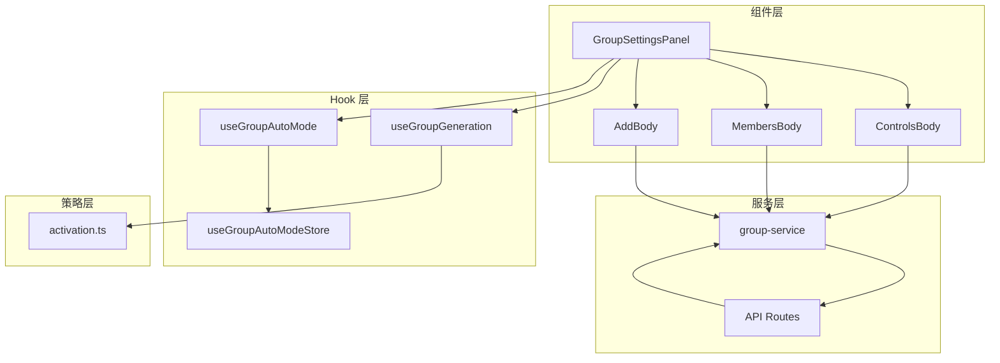
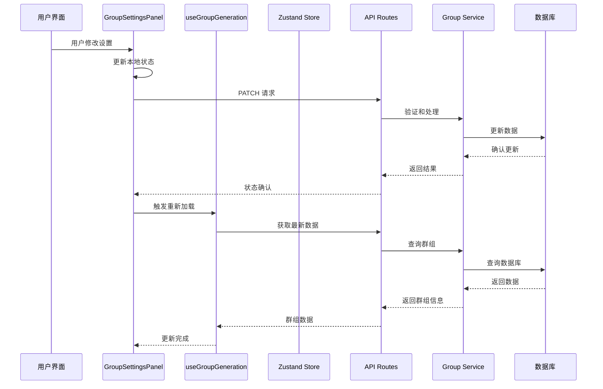
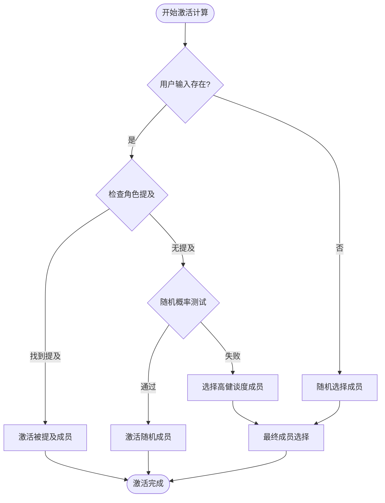
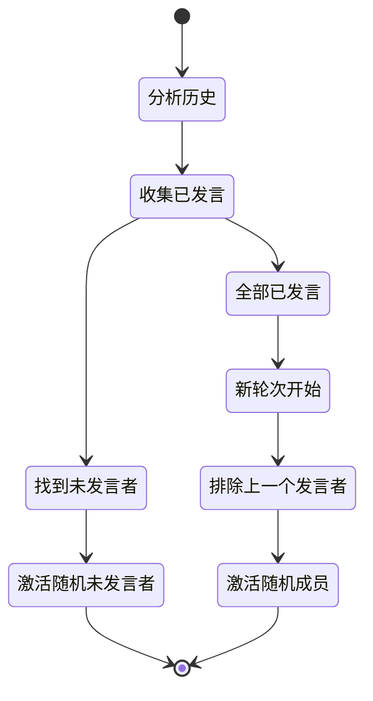
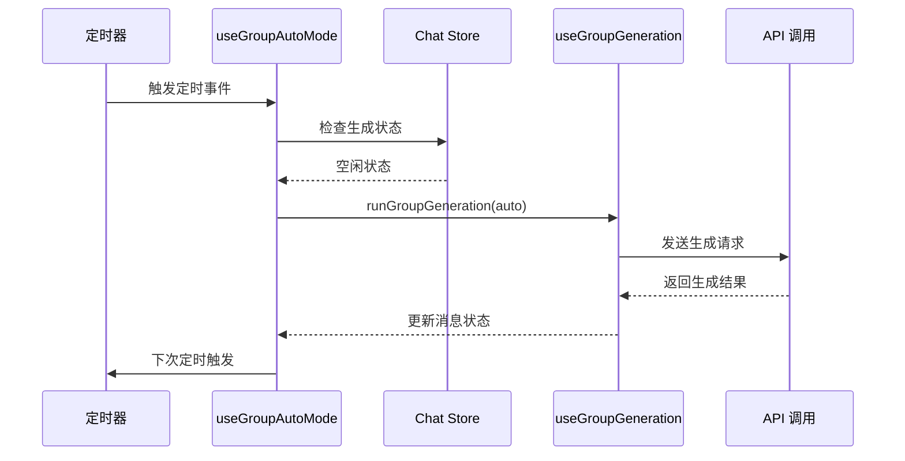
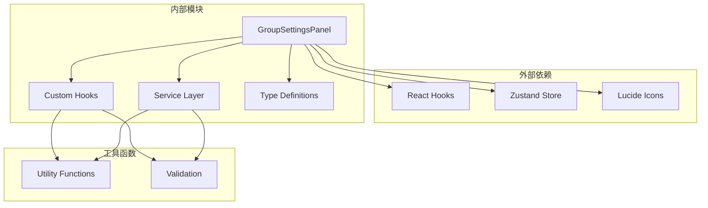

# 群组设置面板

<cite>
**本文档引用的文件**
- [group-settings-panel.tsx](file://src/components/groups/group-settings-panel.tsx)
- [useGroupGeneration.ts](file://src/hooks/useGroupGeneration.ts)
- [useGroupAutoMode.ts](file://src/hooks/useGroupAutoMode.ts)
- [activation.ts](file://src/lib/group-chat/activation.ts)
- [group-auto-mode-store.ts](file://src/stores/group-auto-mode-store.ts)
- [route.ts](file://src/app/api/groups/[id]/route.ts)
- [group-service.ts](file://src/lib/services/group-service.ts)
- [index.ts](file://src/lib/db/index.ts)
- [GroupCollageAvatar.tsx](file://src/components/groups/GroupCollageAvatar.tsx)
- [chat-store.ts](file://src/stores/chat-store.ts)
</cite>

## 目录
1. [简介](#简介)
2. [项目结构](#项目结构)
3. [核心组件](#核心组件)
4. [架构概览](#架构概览)
5. [详细组件分析](#详细组件分析)
6. [依赖关系分析](#依赖关系分析)
7. [性能考虑](#性能考虑)
8. [故障排除指南](#故障排除指南)
9. [结论](#结论)

## 简介

群组设置面板是 SillyTavern Next 中用于管理群组聊天的核心界面组件。该面板提供了完整的群组配置功能，包括激活策略配置、生成模式设置、成员管理、头像自定义和收藏功能等。本文档将深入分析该组件的架构设计、实现细节和交互机制。

## 项目结构

群组设置面板位于组件系统的核心位置，采用模块化设计，与状态管理、API 服务和激活策略模块紧密集成：

**图表来源**
- [group-settings-panel.tsx:32-103](file://src/components/groups/group-settings-panel.tsx#L32-L103)
- [useGroupGeneration.ts:59-737](file://src/hooks/useGroupGeneration.ts#L59-L737)
- [useGroupAutoMode.ts:17-61](file://src/hooks/useGroupAutoMode.ts#L17-L61)

**章节来源**
- [group-settings-panel.tsx:1-318](file://src/components/groups/group-settings-panel.tsx#L1-L318)
- [useGroupGeneration.ts:1-738](file://src/hooks/useGroupGeneration.ts#L1-L738)

## 核心组件

### GroupSettingsPanel 主组件

主组件负责整个设置面板的渲染和状态管理，采用抽屉式布局设计，提供三个主要功能区域：

- **群组控制**：包含基本设置、激活策略、生成模式等核心配置
- **当前成员**：显示和管理群组成员，支持搜索、排序和操作
- **添加成员**：提供成员选择和添加功能

组件特性：
- 响应式设计，支持面板折叠展开
- 实时状态同步，所有更改即时保存到服务器
- 错误处理和加载状态管理
- 文件上传处理（头像自定义）

**章节来源**
- [group-settings-panel.tsx:32-103](file://src/components/groups/group-settings-panel.tsx#L32-L103)

### ControlsBody 控制面板

控制面板包含以下关键配置项：

#### 激活策略配置
- **自然激活（Natural）**：基于角色提及和健谈度的智能激活
- **列表激活（List）**：按固定顺序轮流激活成员
- **手动激活（Manual）**：仅通过强制发言按钮激活
- **池化激活（Pooled）**：避免重复，优先激活未发言成员

#### 生成模式设置
- **替换模式（Swap）**：每个角色独立生成回复
- **追加模式（Join）**：合并启用成员的角色卡信息
- **追加禁用模式（Join+Disabled）**：合并所有成员的角色卡信息

#### 高级功能
- 允许自响应：控制角色连续发言
- 隐藏静音成员：过滤掉被禁用的成员
- 自动模式：定时自动触发群组生成
- 收藏功能：将重要群组标记为收藏

**章节来源**
- [group-settings-panel.tsx:114-214](file://src/components/groups/group-settings-panel.tsx#L114-L214)

### MembersBody 成员管理

成员管理功能提供完整的成员操作能力：

- **成员搜索**：实时搜索和过滤成员
- **成员排序**：拖拽调整成员发言顺序
- **静音控制**：启用/禁用特定成员
- **强制发言**：手动触发特定成员回复
- **成员移除**：从群组中移除成员

**章节来源**
- [group-settings-panel.tsx:216-285](file://src/components/groups/group-settings-panel.tsx#L216-L285)

### AddBody 成员添加

成员添加功能提供便捷的成员选择界面：

- **候选成员筛选**：显示所有可用角色
- **搜索功能**：快速定位目标角色
- **批量添加**：一键添加多个成员

**章节来源**
- [group-settings-panel.tsx:287-316](file://src/components/groups/group-settings-panel.tsx#L287-L316)

## 架构概览

群组设置面板采用分层架构设计，各层职责明确，耦合度低：

**图表来源**
- [group-settings-panel.tsx:58-68](file://src/components/groups/group-settings-panel.tsx#L58-L68)
- [route.ts:18-38](file://src/app/api/groups/[id]/route.ts#L18-L38)
- [group-service.ts:133-159](file://src/lib/services/group-service.ts#L133-L159)

## 详细组件分析

### 激活策略工作原理

激活策略决定了群组聊天中哪个成员应该回复。系统实现了四种不同的激活策略：

#### 自然激活（Natural）
自然激活是最复杂的策略，结合了多种触发条件：

**图表来源**
- [activation.ts:66-112](file://src/lib/group-chat/activation.ts#L66-L112)

#### 列表激活（List）
列表激活按照固定的成员顺序逐一激活，确保每个成员都有平等的发言机会。

#### 手动激活（Manual）
手动激活完全依赖用户的主动操作，只有通过强制发言按钮才能触发特定成员的回复。

#### 池化激活（Pooled）
池化激活避免重复发言，通过分析最近的消息历史来确定哪些成员还没有发言：

**图表来源**
- [activation.ts:133-167](file://src/lib/group-chat/activation.ts#L133-L167)

**章节来源**
- [activation.ts:11-30](file://src/lib/group-chat/activation.ts#L11-L30)
- [activation.ts:66-190](file://src/lib/group-chat/activation.ts#L66-L190)

### 生成模式设置详解

生成模式决定了系统如何处理多个角色的回复：

#### 替换模式（Swap）
在替换模式下，每个被激活的角色都会独立生成回复，这种方式保持了每个角色的独特性和个性。

#### 追加模式（Join）
追加模式将所有启用成员的角色卡信息合并，形成一个综合的上下文，然后由模型生成统一的回复。这种模式适合需要协调一致性的场景。

#### 追加禁用模式（Join+Disabled）
与追加模式类似，但会包含所有成员（包括被禁用的成员），适用于需要完整上下文信息的场景。

**章节来源**
- [useGroupGeneration.ts:170-257](file://src/hooks/useGroupGeneration.ts#L170-L257)

### 自动模式实现

自动模式通过定时器实现群组的自动回复功能：

**图表来源**
- [useGroupAutoMode.ts:24-60](file://src/hooks/useGroupAutoMode.ts#L24-L60)
- [useGroupGeneration.ts:450-691](file://src/hooks/useGroupGeneration.ts#L450-L691)

**章节来源**
- [useGroupAutoMode.ts:17-61](file://src/hooks/useGroupAutoMode.ts#L17-L61)
- [group-auto-mode-store.ts:7-17](file://src/stores/group-auto-mode-store.ts#L7-L17)

### 头像自定义功能

头像自定义功能提供了灵活的头像管理机制：

#### 自定义头像
用户可以上传自定义图片作为群组头像，支持 JPG、PNG 等常见格式。

#### 拼贴头像
当没有自定义头像时，系统会自动使用前四个成员的头像创建拼贴效果。

#### 头像映射
系统维护成员 ID 到头像 URL 的映射关系，确保头像显示的一致性。

**章节来源**
- [group-settings-panel.tsx:143-155](file://src/components/groups/group-settings-panel.tsx#L143-L155)
- [GroupCollageAvatar.tsx:25-53](file://src/components/groups/GroupCollageAvatar.tsx#L25-L53)

### 收藏功能实现

收藏功能通过简单的布尔标志实现：

- **状态存储**：在数据库中存储 `fav` 字段
- **UI 显示**：使用星形图标表示收藏状态
- **交互操作**：点击图标切换收藏状态
- **视觉反馈**：收藏状态下图标变为黄色填充

**章节来源**
- [group-settings-panel.tsx:204-206](file://src/components/groups/group-settings-panel.tsx#L204-L206)
- [group-service.ts:66-85](file://src/lib/services/group-service.ts#L66-L85)

## 依赖关系分析

群组设置面板的依赖关系清晰明确，遵循单一职责原则：

**图表来源**
- [group-settings-panel.tsx:3-14](file://src/components/groups/group-settings-panel.tsx#L3-L14)
- [useGroupGeneration.ts:8-29](file://src/hooks/useGroupGeneration.ts#L8-L29)

### 核心依赖关系

1. **状态管理依赖**
   - 使用 Zustand 进行全局状态管理
   - 与聊天存储和自动模式存储集成

2. **API 通信依赖**
   - 通过 Next.js API 路由进行数据交换
   - 集成 Zod 验证确保数据完整性

3. **业务逻辑依赖**
   - 激活策略算法独立封装
   - 生成模式逻辑集中处理

**章节来源**
- [chat-store.ts:15-103](file://src/stores/chat-store.ts#L15-L103)
- [group-service.ts:11-38](file://src/lib/services/group-service.ts#L11-L38)

## 性能考虑

### 渲染优化
- 使用 React.memo 和 useMemo 优化组件渲染
- 条件渲染减少不必要的 DOM 更新
- 虚拟滚动处理大量成员列表

### 网络优化
- 批量 API 请求减少网络往返
- 缓存策略避免重复数据获取
- 错误边界处理提升用户体验

### 内存管理
- 及时清理定时器和事件监听器
- 合理的组件卸载处理
- 避免内存泄漏

## 故障排除指南

### 常见问题及解决方案

#### 设置无法保存
- **症状**：修改设置后刷新页面发现设置恢复默认
- **原因**：网络请求失败或 API 验证错误
- **解决**：检查网络连接，查看浏览器开发者工具中的错误日志

#### 激活策略不生效
- **症状**：设置的激活策略没有按预期工作
- **原因**：激活策略参数传递错误或服务端验证失败
- **解决**：确认激活策略数值范围（0-3），检查服务端日志

#### 自动模式异常
- **症状**：自动模式定时器不工作或频繁触发
- **原因**：定时器状态管理错误或并发生成冲突
- **解决**：检查自动模式开关状态，确保没有多个实例同时运行

#### 头像显示问题
- **症状**：自定义头像无法显示或显示异常
- **原因**：文件格式不支持或路径错误
- **解决**：确认上传文件格式，检查文件大小限制

**章节来源**
- [group-settings-panel.tsx:58-68](file://src/components/groups/group-settings-panel.tsx#L58-L68)
- [useGroupAutoMode.ts:24-60](file://src/hooks/useGroupAutoMode.ts#L24-L60)

## 结论

群组设置面板是一个设计精良、功能完整的组件系统。它通过清晰的架构设计、完善的错误处理和优秀的用户体验，为用户提供了强大的群组聊天管理能力。

### 主要优势
- **模块化设计**：各功能模块职责明确，易于维护和扩展
- **响应式交互**：实时状态同步和即时反馈
- **灵活配置**：丰富的激活策略和生成模式选项
- **性能优化**：合理的渲染优化和网络请求策略

### 技术亮点
- **激活策略算法**：实现了复杂的自然激活逻辑
- **自动模式系统**：可靠的定时触发机制
- **状态管理系统**：完整的本地和远程状态同步
- **头像处理机制**：灵活的头像管理和显示

该组件为 SillyTavern Next 的群组聊天功能奠定了坚实的基础，为用户提供了丰富而直观的群组管理体验。