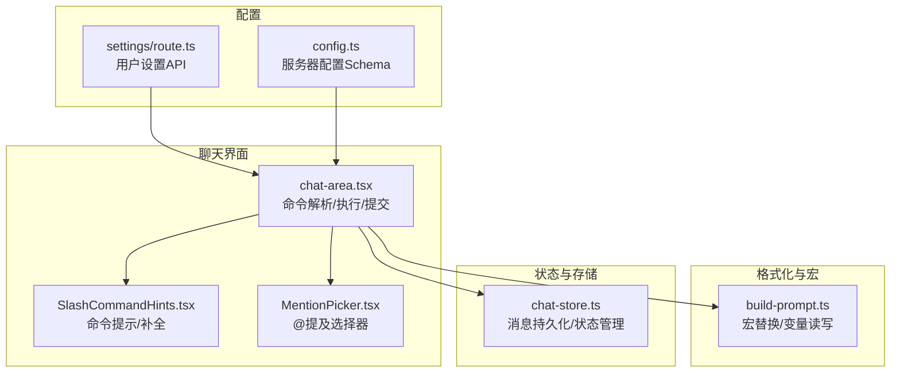
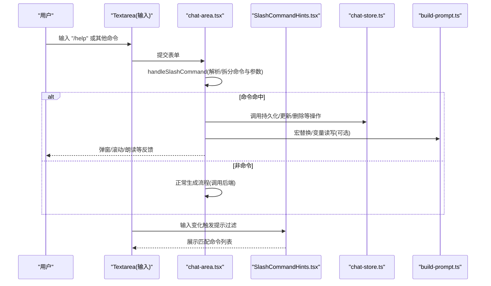
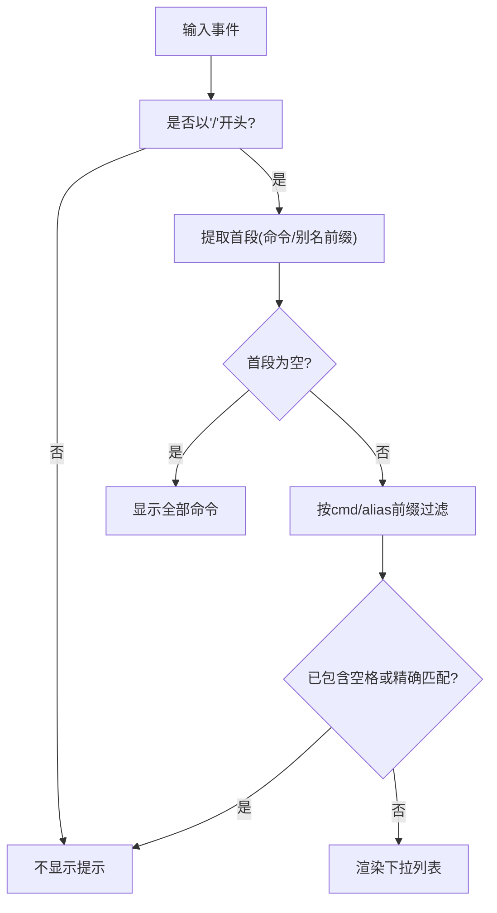
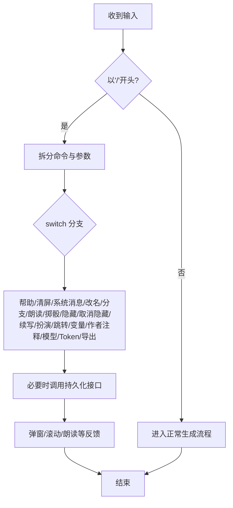
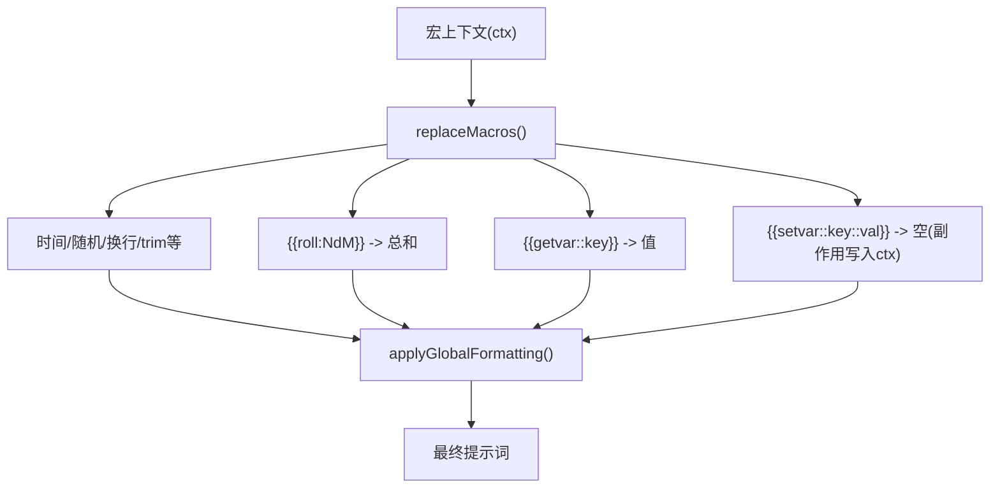
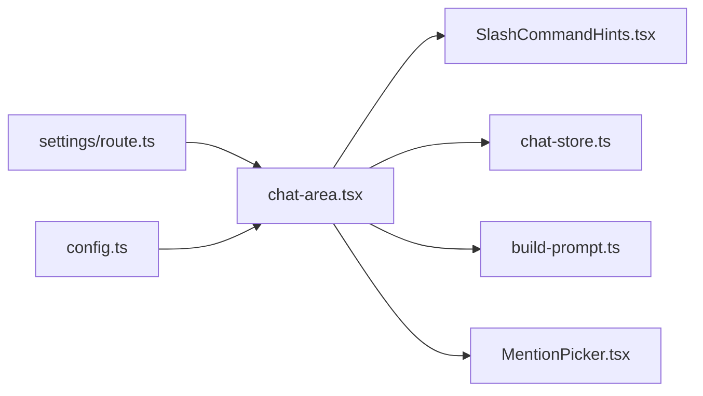

# 斜杠命令系统

<cite>
**本文引用的文件**
- [SlashCommandHints.tsx](file://src/components/chat/SlashCommandHints.tsx)
- [chat-area.tsx](file://src/components/chat/chat-area.tsx)
- [build-prompt.ts](file://src/lib/formatting/build-prompt.ts)
- [chat-store.ts](file://src/stores/chat-store.ts)
- [settings/route.ts](file://src/app/api/settings/route.ts)
- [config.ts](file://src/lib/config.ts)
- [MentionPicker.tsx](file://src/components/chat/MentionPicker.tsx)
</cite>

## 目录
1. [简介](#简介)
2. [项目结构](#项目结构)
3. [核心组件](#核心组件)
4. [架构总览](#架构总览)
5. [详细组件分析](#详细组件分析)
6. [依赖关系分析](#依赖关系分析)
7. [性能考量](#性能考量)
8. [故障排查指南](#故障排查指南)
9. [结论](#结论)
10. [附录](#附录)

## 简介
本文件系统性梳理 SillyTavern Next 的斜杠命令系统，涵盖命令解析、注册与执行流程、内置命令实现、参数处理与错误处理、命令提示与智能补全、快捷键支持、配置项与扩展方式等。目标是帮助开发者快速理解与扩展命令功能。

## 项目结构
斜杠命令系统主要由以下模块构成：
- 命令提示与补全：SlashCommandHints.tsx
- 命令解析与执行：chat-area.tsx
- 文本宏与变量：build-prompt.ts
- 存储与持久化：chat-store.ts
- 配置与设置：settings/route.ts、config.ts
- 与命令系统协同的输入辅助：MentionPicker.tsx

**图表来源**
- [chat-area.tsx](file://src/components/chat/chat-area.tsx)
- [SlashCommandHints.tsx](file://src/components/chat/SlashCommandHints.tsx)
- [MentionPicker.tsx](file://src/components/chat/MentionPicker.tsx)
- [build-prompt.ts](file://src/lib/formatting/build-prompt.ts)
- [chat-store.ts](file://src/stores/chat-store.ts)
- [settings/route.ts](file://src/app/api/settings/route.ts)
- [config.ts](file://src/lib/config.ts)

**章节来源**
- [SlashCommandHints.tsx](file://src/components/chat/SlashCommandHints.tsx)
- [chat-area.tsx](file://src/components/chat/chat-area.tsx)
- [build-prompt.ts](file://src/lib/formatting/build-prompt.ts)
- [chat-store.ts](file://src/stores/chat-store.ts)
- [settings/route.ts](file://src/app/api/settings/route.ts)
- [config.ts](file://src/lib/config.ts)
- [MentionPicker.tsx](file://src/components/chat/MentionPicker.tsx)

## 核心组件
- 命令提示与补全（SlashCommandHints.tsx）
  - 定义内置命令清单与别名，提供输入过滤与下拉展示。
- 命令解析与执行（chat-area.tsx）
  - 识别“/”开头的命令，拆分命令与参数，按分支处理各内置命令。
- 文本宏与变量（build-prompt.ts）
  - 支持在提示词中通过宏读取/设置聊天变量，与命令系统联动。
- 存储与持久化（chat-store.ts）
  - 提供消息持久化接口，支撑命令对消息的新增、更新、删除与隐藏。
- 配置与设置（settings/route.ts、config.ts）
  - 用户设置与服务器配置，影响命令运行时行为（如模型信息、格式化开关等）。
- 输入辅助（MentionPicker.tsx）
  - 与命令提示并列的输入辅助组件，提升输入效率。

**章节来源**
- [SlashCommandHints.tsx](file://src/components/chat/SlashCommandHints.tsx)
- [chat-area.tsx](file://src/components/chat/chat-area.tsx)
- [build-prompt.ts](file://src/lib/formatting/build-prompt.ts)
- [chat-store.ts](file://src/stores/chat-store.ts)
- [settings/route.ts](file://src/app/api/settings/route.ts)
- [config.ts](file://src/lib/config.ts)
- [MentionPicker.tsx](file://src/components/chat/MentionPicker.tsx)

## 架构总览
命令系统的关键交互流程如下：

**图表来源**
- [chat-area.tsx](file://src/components/chat/chat-area.tsx)
- [SlashCommandHints.tsx](file://src/components/chat/SlashCommandHints.tsx)
- [chat-store.ts](file://src/stores/chat-store.ts)
- [build-prompt.ts](file://src/lib/formatting/build-prompt.ts)

## 详细组件分析

### 命令提示与补全（SlashCommandHints.tsx）
- 命令清单与别名
  - 内置命令集合包含帮助、清屏、系统消息、改名、分支、朗读、掷骰、隐藏/取消隐藏、续写、扮演、跳转、变量设置/读取、作者注释、模型信息、Token估算、导出等。
  - 支持别名（如 help/?、clear/flush）。
- 过滤逻辑
  - 仅当输入以“/”开头时生效；按首段（命令或别名前缀）进行过滤；若已包含空格或已精确匹配，则不再显示提示。
- UI 展示
  - 下拉面板按匹配度排序，支持键盘高亮与点击选择。

**图表来源**
- [SlashCommandHints.tsx](file://src/components/chat/SlashCommandHints.tsx)

**章节来源**
- [SlashCommandHints.tsx](file://src/components/chat/SlashCommandHints.tsx)

### 命令解析与执行（chat-area.tsx）
- 解析流程
  - 以“/”开头即视为命令；首个空格前为命令名（转小写），剩余部分为参数。
- 执行分支
  - 帮助/清屏/系统消息/改名/分支/朗读/掷骰/隐藏/取消隐藏/续写/扮演/跳转/变量设置/变量读取/作者注释/模型信息/Token估算/导出等。
- 参数处理与校验
  - 大多数命令对参数有明确格式要求（如 roll 的 NdM、go 的序号、setvar 的 key=value）。
- 错误处理
  - 参数缺失或非法时弹窗提示；部分操作需要确认（如清屏）。
- 与存储交互
  - 新增系统消息、更新消息元数据、删除消息、切换隐藏状态等均通过 chat-store 的持久化接口完成。
- 与宏系统联动
  - 某些命令（如 setvar/getvar）与 build-prompt 的宏变量机制配合，实现提示词中的变量读写。

**图表来源**
- [chat-area.tsx](file://src/components/chat/chat-area.tsx)
- [chat-store.ts](file://src/stores/chat-store.ts)

**章节来源**
- [chat-area.tsx](file://src/components/chat/chat-area.tsx)
- [chat-store.ts](file://src/stores/chat-store.ts)

### 文本宏与变量（build-prompt.ts）
- 宏替换
  - 支持多种宏（时间、随机数、roll、getvar、setvar、换行、trim等），在构建提示词时统一替换。
- 与命令联动
  - setvar/getvar 既可通过命令设置/读取，也可在提示词中通过宏读取/设置，二者共享同一变量存储。
- 全局格式化
  - 提供全局格式化开关（如折叠换行、去除行尾空格），影响最终输出。

**图表来源**
- [build-prompt.ts](file://src/lib/formatting/build-prompt.ts)

**章节来源**
- [build-prompt.ts](file://src/lib/formatting/build-prompt.ts)

### 存储与持久化（chat-store.ts）
- 消息持久化
  - 提供 persistMessage 接口，将消息写入数据库并回填服务端 ID，保证分支/检查点场景的消息一致性。
- 命令依赖
  - 多数命令（新增系统消息、删除消息、切换隐藏状态）依赖该接口完成数据落盘与状态同步。

**章节来源**
- [chat-store.ts](file://src/stores/chat-store.ts)

### 配置与设置（settings/route.ts、config.ts）
- 用户设置 API
  - 提供获取与保存用户连接配置的接口，影响命令运行时的模型/提供商/分类等上下文。
- 服务器配置 Schema
  - 定义服务器端配置结构与默认值，支持环境变量覆盖，便于部署期定制。

**章节来源**
- [settings/route.ts](file://src/app/api/settings/route.ts)
- [config.ts](file://src/lib/config.ts)

### 输入辅助（MentionPicker.tsx）
- 与命令提示并列的输入辅助组件，支持在群聊模式下输入 @ 后弹出角色列表，实现快速提及。
- 与命令提示共享浮层层级，避免遮挡。

**章节来源**
- [MentionPicker.tsx](file://src/components/chat/MentionPicker.tsx)

## 依赖关系分析
- 组件耦合
  - chat-area.tsx 依赖 SlashCommandHints.tsx 进行提示，依赖 chat-store.ts 进行持久化，依赖 build-prompt.ts 进行宏替换。
  - SlashCommandHints.tsx 与 MentionPicker.tsx 为并列的输入辅助组件，共同提升输入体验。
- 外部依赖
  - 用户设置与服务器配置通过 API 与 Schema 管理，影响命令运行时上下文。

**图表来源**
- [chat-area.tsx](file://src/components/chat/chat-area.tsx)
- [SlashCommandHints.tsx](file://src/components/chat/SlashCommandHints.tsx)
- [MentionPicker.tsx](file://src/components/chat/MentionPicker.tsx)
- [build-prompt.ts](file://src/lib/formatting/build-prompt.ts)
- [chat-store.ts](file://src/stores/chat-store.ts)
- [settings/route.ts](file://src/app/api/settings/route.ts)
- [config.ts](file://src/lib/config.ts)

**章节来源**
- [chat-area.tsx](file://src/components/chat/chat-area.tsx)
- [SlashCommandHints.tsx](file://src/components/chat/SlashCommandHints.tsx)
- [MentionPicker.tsx](file://src/components/chat/MentionPicker.tsx)
- [build-prompt.ts](file://src/lib/formatting/build-prompt.ts)
- [chat-store.ts](file://src/stores/chat-store.ts)
- [settings/route.ts](file://src/app/api/settings/route.ts)
- [config.ts](file://src/lib/config.ts)

## 性能考量
- 命令提示过滤
  - 采用字符串前缀匹配与别名匹配，复杂度低，适合高频输入场景。
- 宏替换
  - 宏替换在构建提示词阶段进行，避免在命令执行时重复计算。
- 持久化
  - 命令涉及的持久化操作（新增/更新/删除/隐藏）应避免在高频命令中阻塞 UI，建议异步处理并在成功后及时更新本地状态。

[本节为通用指导，无需特定文件来源]

## 故障排查指南
- 命令无效或未响应
  - 确认输入以“/”开头且未包含多余空格（提示面板会在包含空格时关闭）。
  - 检查命令是否在内置清单中，或是否存在别名。
- 参数错误
  - 按照命令帮助提示提供正确格式（如 roll 的 NdM、go 的序号、setvar 的 key=value）。
- 模型未选择
  - 非命令场景需要先在设置中选择模型，否则会提示未选择模型。
- 语音朗读失败
  - 检查浏览器是否支持 Web Speech API，或确认输入内容非空。
- 数据未持久化
  - 若命令涉及消息变更，检查网络与后端接口状态，确认 chat-store 的持久化调用是否成功。

**章节来源**
- [chat-area.tsx](file://src/components/chat/chat-area.tsx)
- [chat-store.ts](file://src/stores/chat-store.ts)

## 结论
斜杠命令系统在 SillyTavern Next 中实现了清晰的职责分离：提示与补全由独立组件负责，命令解析与执行集中在聊天界面，宏与变量通过格式化模块统一管理，存储通过专用接口保障一致性。该设计易于扩展与维护，同时为后续引入自定义命令与插件机制提供了良好基础。

[本节为总结，无需特定文件来源]

## 附录

### 内置命令一览与用法要点
- 帮助/清屏/系统消息/改名/分支/朗读/掷骰/隐藏/取消隐藏/续写/扮演/跳转/变量设置/变量读取/作者注释/模型信息/Token估算/导出
- 参数格式与边界条件已在执行分支中明确处理，建议在扩展时遵循相同模式。

**章节来源**
- [chat-area.tsx](file://src/components/chat/chat-area.tsx)

### 命令提示与补全的交互细节
- 仅在输入以“/”开头时生效
- 以首段前缀过滤命令
- 已包含空格或精确匹配时关闭提示
- 支持别名匹配

**章节来源**
- [SlashCommandHints.tsx](file://src/components/chat/SlashCommandHints.tsx)

### 宏与变量在命令中的协作
- setvar/getvar 可在命令与提示词中双向使用
- 宏替换在构建提示词阶段统一处理，确保一致性

**章节来源**
- [build-prompt.ts](file://src/lib/formatting/build-prompt.ts)
- [chat-area.tsx](file://src/components/chat/chat-area.tsx)