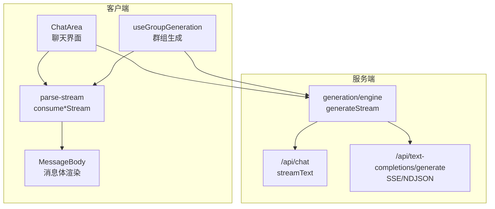
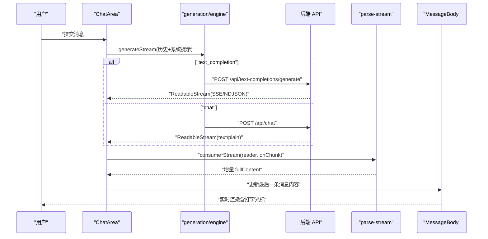
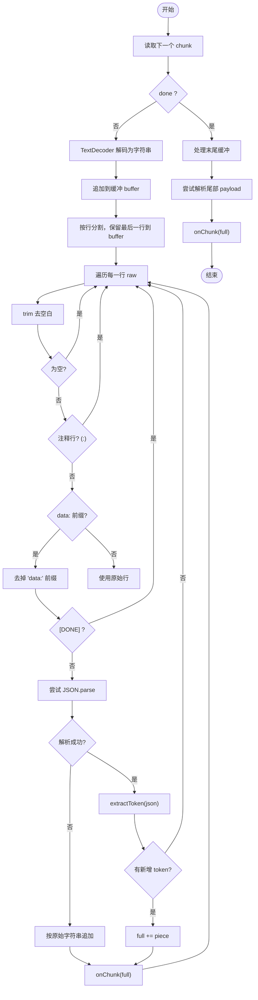
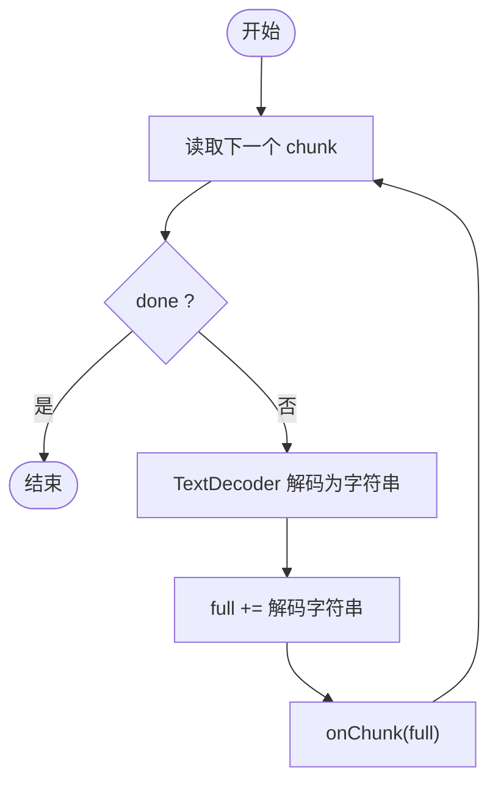
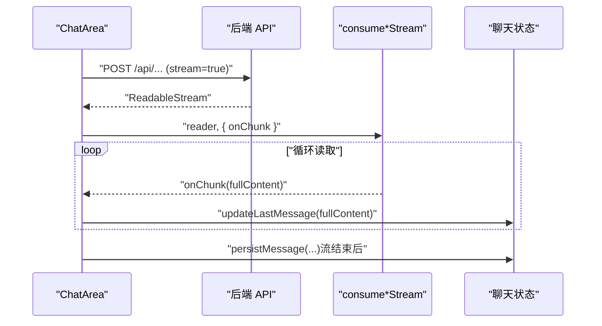
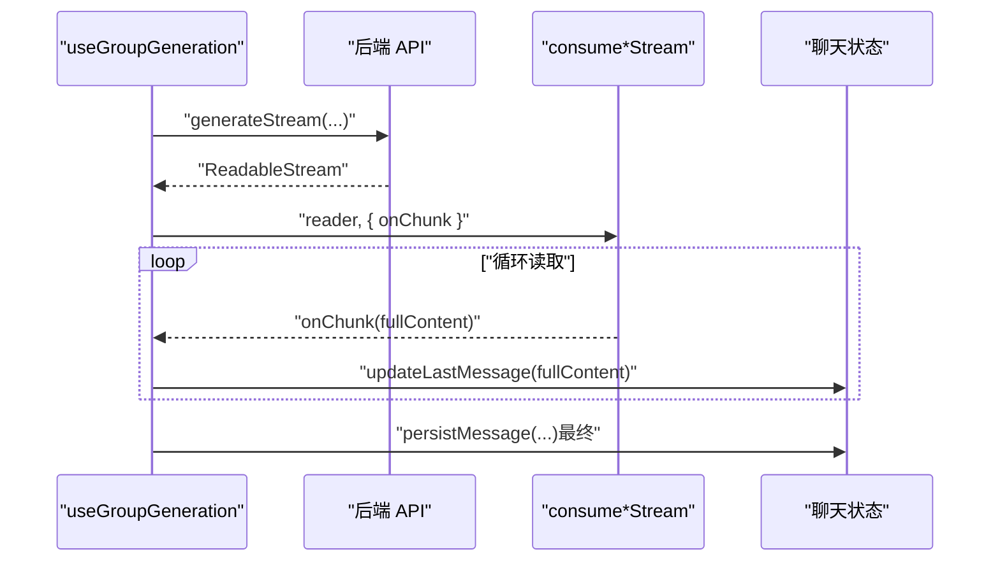
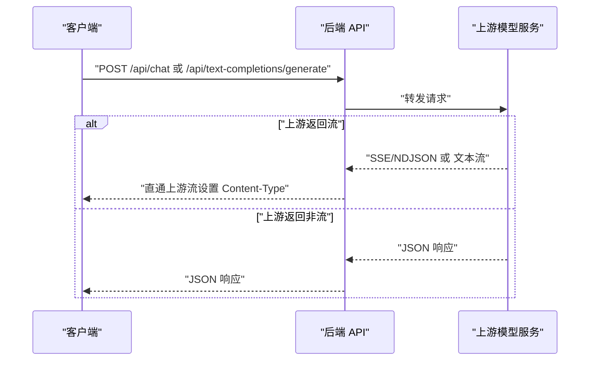
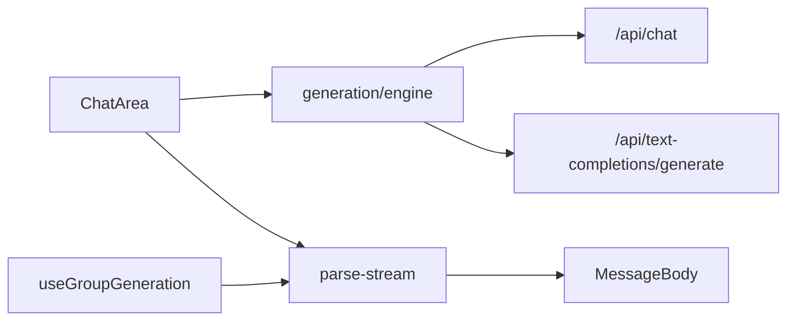

# 流式响应处理

<cite>
**本文引用的文件**
- [src/lib/textgen/parse-stream.ts](file://src/lib/textgen/parse-stream.ts)
- [src/hooks/useGroupGeneration.ts](file://src/hooks/useGroupGeneration.ts)
- [src/components/chat/chat-area.tsx](file://src/components/chat/chat-area.tsx)
- [src/components/chat/message-bubble/MessageBody.tsx](file://src/components/chat/message-bubble/MessageBody.tsx)
- [src/lib/generation/engine.ts](file://src/lib/generation/engine.ts)
- [src/app/api/chat/route.ts](file://src/app/api/chat/route.ts)
- [src/app/api/text-completions/generate/route.ts](file://src/app/api/text-completions/generate/route.ts)
</cite>

## 目录
1. [简介](#简介)
2. [项目结构](#项目结构)
3. [核心组件](#核心组件)
4. [架构总览](#架构总览)
5. [详细组件分析](#详细组件分析)
6. [依赖关系分析](#依赖关系分析)
7. [性能考量](#性能考量)
8. [故障排除指南](#故障排除指南)
9. [结论](#结论)

## 简介
本文档围绕 SillyTavern Next 的流式响应处理系统，系统性阐述以下内容：
- 流式响应的实现原理与 HTTP 流传输机制
- 客户端对 SSE/NDJSON 的解析策略与增量渲染
- consumePlainTextStream 与 consumeTextgenStream 的工作机制、数据块处理与错误恢复
- 在聊天界面中的实时渲染、内容增量更新与用户体验优化
- 性能优化策略、内存管理与资源清理
- 调试方法与常见问题排查

## 项目结构
与流式响应相关的关键模块分布如下：
- 客户端解析与消费：src/lib/textgen/parse-stream.ts
- 聊天主界面与流式生成：src/components/chat/chat-area.tsx
- 群组聊天流式生成：src/hooks/useGroupGeneration.ts
- 文本补全与聊天 API 转发：src/lib/generation/engine.ts、src/app/api/chat/route.ts、src/app/api/text-completions/generate/route.ts
- 消息体渲染与打字光标：src/components/chat/message-bubble/MessageBody.tsx

图表来源
- [src/components/chat/chat-area.tsx:520-683](file://src/components/chat/chat-area.tsx#L520-L683)
- [src/hooks/useGroupGeneration.ts:277-447](file://src/hooks/useGroupGeneration.ts#L277-L447)
- [src/lib/textgen/parse-stream.ts:38-115](file://src/lib/textgen/parse-stream.ts#L38-L115)
- [src/lib/generation/engine.ts:232-237](file://src/lib/generation/engine.ts#L232-L237)
- [src/app/api/chat/route.ts:158-170](file://src/app/api/chat/route.ts#L158-L170)
- [src/app/api/text-completions/generate/route.ts:100-110](file://src/app/api/text-completions/generate/route.ts#L100-L110)

章节来源
- [src/lib/textgen/parse-stream.ts:1-115](file://src/lib/textgen/parse-stream.ts#L1-L115)
- [src/components/chat/chat-area.tsx:1-800](file://src/components/chat/chat-area.tsx#L1-L800)
- [src/hooks/useGroupGeneration.ts:1-738](file://src/hooks/useGroupGeneration.ts#L1-L738)
- [src/lib/generation/engine.ts:183-237](file://src/lib/generation/engine.ts#L183-L237)
- [src/app/api/chat/route.ts:1-177](file://src/app/api/chat/route.ts#L1-L177)
- [src/app/api/text-completions/generate/route.ts:1-121](file://src/app/api/text-completions/generate/route.ts#L1-L121)

## 核心组件
- consumeTextgenStream：消费基于 SSE/NDJSON 的文本生成流，按行解析，提取本次新增 token，并通过 onChunk 回调增量更新。
- consumePlainTextStream：消费 vercel AI SDK 风格的纯文本流，逐块解码并直接拼接，通过 onChunk 回调增量更新。
- ChatArea：负责发起请求、获取 ReadableStream、调用 consume*Stream 并更新消息内容，支持中断与持久化。
- useGroupGeneration：封装群组聊天的流式生成流程，支持续写、截断检测、占位消息与持久化。
- generation/engine：统一生成入口，根据 activeCategory 选择文本补全或聊天补全 API。
- 服务端 API：/api/chat 使用 streamText 输出标准文本流；/api/text-completions/generate 直通上游 SSE/NDJSON。

章节来源
- [src/lib/textgen/parse-stream.ts:38-115](file://src/lib/textgen/parse-stream.ts#L38-L115)
- [src/components/chat/chat-area.tsx:520-683](file://src/components/chat/chat-area.tsx#L520-L683)
- [src/hooks/useGroupGeneration.ts:277-447](file://src/hooks/useGroupGeneration.ts#L277-L447)
- [src/lib/generation/engine.ts:232-237](file://src/lib/generation/engine.ts#L232-L237)
- [src/app/api/chat/route.ts:158-170](file://src/app/api/chat/route.ts#L158-L170)
- [src/app/api/text-completions/generate/route.ts:100-110](file://src/app/api/text-completions/generate/route.ts#L100-L110)

## 架构总览
下面的序列图展示了从用户提交消息到流式渲染完成的端到端流程，涵盖文本补全与聊天补全两类路径。

图表来源
- [src/components/chat/chat-area.tsx:633-660](file://src/components/chat/chat-area.tsx#L633-L660)
- [src/lib/generation/engine.ts:232-237](file://src/lib/generation/engine.ts#L232-L237)
- [src/app/api/chat/route.ts:158-170](file://src/app/api/chat/route.ts#L158-L170)
- [src/app/api/text-completions/generate/route.ts:100-110](file://src/app/api/text-completions/generate/route.ts#L100-L110)
- [src/lib/textgen/parse-stream.ts:38-115](file://src/lib/textgen/parse-stream.ts#L38-L115)

## 详细组件分析

### consumeTextgenStream：SSE/NDJSON 流解析与增量更新
- 输入：ReadableStreamDefaultReader<Uint8Array>，ConsumeStreamOptions（onChunk 回调、可选 AbortSignal）
- 解析策略：
  - 使用 TextDecoder 以流式方式解码二进制块
  - 按行切分缓冲区，丢弃注释行与 [DONE] 标记
  - 尝试将每行解析为 JSON，若成功则从 JSON 中提取本次新增 token；若失败则按原始字符串直接拼接
  - 末尾未换行的缓冲单独处理，避免遗漏
- 增量更新：每次提取到有效 token 或非 JSON 行时，将新增内容追加到 full，并调用 onChunk(full)
- 错误恢复：解析异常时吞掉错误并继续处理后续行；AbortSignal 由上层控制，此处不抛错
- 返回值：完整文本内容（用于持久化）

图表来源
- [src/lib/textgen/parse-stream.ts:38-99](file://src/lib/textgen/parse-stream.ts#L38-L99)

章节来源
- [src/lib/textgen/parse-stream.ts:38-99](file://src/lib/textgen/parse-stream.ts#L38-L99)

### consumePlainTextStream：纯文本流解析与增量更新
- 输入：ReadableStreamDefaultReader<Uint8Array>，ConsumeStreamOptions
- 解析策略：
  - 使用 TextDecoder 以流式方式解码二进制块
  - 直接将解码后的字符串追加到 full
  - 每次读取后调用 onChunk(full)，实现逐块增量更新
- 适用场景：vercel AI SDK 风格的 /api/chat 文本流
- 返回值：完整文本内容（用于持久化）

图表来源
- [src/lib/textgen/parse-stream.ts:101-115](file://src/lib/textgen/parse-stream.ts#L101-L115)

章节来源
- [src/lib/textgen/parse-stream.ts:101-115](file://src/lib/textgen/parse-stream.ts#L101-L115)

### ChatArea：流式生成与实时渲染
- 发起请求：
  - 根据 activeCategory 决定调用 /api/text-completions/generate（文本补全）或 /api/chat（聊天补全）
  - 构造历史、系统提示、世界书等参数
- 流式消费：
  - 获取 response.body.getReader()
  - 调用 consumeTextgenStream 或 consumePlainTextStream
  - onChunk 中调用 updateLastMessage 实时更新最后一条消息
- 中断与错误：
  - 使用 AbortController 控制中断
  - 捕获 AbortError 与其它错误，分别处理“中止”和“错误提示”
- 持久化：
  - 流结束后将 assistant 消息持久化到数据库

图表来源
- [src/components/chat/chat-area.tsx:633-683](file://src/components/chat/chat-area.tsx#L633-L683)
- [src/lib/textgen/parse-stream.ts:38-115](file://src/lib/textgen/parse-stream.ts#L38-L115)

章节来源
- [src/components/chat/chat-area.tsx:520-683](file://src/components/chat/chat-area.tsx#L520-L683)

### useGroupGeneration：群组聊天流式生成
- 功能要点：
  - 续写（continue）：保留原内容，新生成追加，最终 patch 更新消息内容
  - 截断检测：正则匹配其他角色名称，若检测到其他角色开头即截断并更新
  - 占位消息：为每个成员生成前先插入空消息占位，流式填充后再持久化
  - 中断处理：AbortError 时更新最后一条消息为“已中止”
- 流式消费：
  - 调用 consumeTextgenStream 或 consumePlainTextStream，并将 onChunk 传给钩子内部的处理函数

图表来源
- [src/hooks/useGroupGeneration.ts:277-447](file://src/hooks/useGroupGeneration.ts#L277-L447)
- [src/lib/textgen/parse-stream.ts:38-115](file://src/lib/textgen/parse-stream.ts#L38-L115)

章节来源
- [src/hooks/useGroupGeneration.ts:367-413](file://src/hooks/useGroupGeneration.ts#L367-L413)

### 服务端 API：SSE/NDJSON 与文本流直通
- /api/chat：
  - 使用 streamText 输出标准文本流，Next.js 将自动设置合适的 Content-Type
- /api/text-completions/generate：
  - 当 settings.streaming === true 时，直接将上游 SSE/NDJSON 流直通给前端，设置 Content-Type 为上游类型或回退为 text/event-stream
- 错误处理：
  - 上游非 OK 状态时返回 JSON 错误
  - 捕获网络异常并返回友好错误

图表来源
- [src/app/api/chat/route.ts:158-170](file://src/app/api/chat/route.ts#L158-L170)
- [src/app/api/text-completions/generate/route.ts:100-110](file://src/app/api/text-completions/generate/route.ts#L100-L110)

章节来源
- [src/app/api/chat/route.ts:158-170](file://src/app/api/chat/route.ts#L158-L170)
- [src/app/api/text-completions/generate/route.ts:83-110](file://src/app/api/text-completions/generate/route.ts#L83-L110)

### 消息体渲染与打字光标
- MessageBody：
  - streaming 为真时显示打字光标动画
  - 长内容支持折叠/展开，避免渲染压力
  - 支持搜索高亮与附件展示

章节来源
- [src/components/chat/message-bubble/MessageBody.tsx:31-109](file://src/components/chat/message-bubble/MessageBody.tsx#L31-L109)

## 依赖关系分析
- ChatArea 依赖 generation/engine 的 generateStream，根据 activeCategory 选择不同 API
- generation/engine 依赖 /api/chat 与 /api/text-completions/generate
- parse-stream 提供 consumeTextgenStream 与 consumePlainTextStream，被 ChatArea 与 useGroupGeneration 调用
- useGroupGeneration 内部同样调用 consume*Stream，并在续写与截断场景中进行特殊处理

图表来源
- [src/components/chat/chat-area.tsx:633-660](file://src/components/chat/chat-area.tsx#L633-L660)
- [src/hooks/useGroupGeneration.ts:394-408](file://src/hooks/useGroupGeneration.ts#L394-L408)
- [src/lib/generation/engine.ts:232-237](file://src/lib/generation/engine.ts#L232-L237)
- [src/lib/textgen/parse-stream.ts:38-115](file://src/lib/textgen/parse-stream.ts#L38-L115)

章节来源
- [src/components/chat/chat-area.tsx:520-683](file://src/components/chat/chat-area.tsx#L520-L683)
- [src/hooks/useGroupGeneration.ts:277-447](file://src/hooks/useGroupGeneration.ts#L277-L447)
- [src/lib/generation/engine.ts:183-237](file://src/lib/generation/engine.ts#L183-L237)
- [src/lib/textgen/parse-stream.ts:10-15](file://src/lib/textgen/parse-stream.ts#L10-L15)

## 性能考量
- 流式解码与增量更新
  - 使用 TextDecoder(stream: true) 进行流式解码，避免一次性解码大块数据
  - 按行解析与缓冲区复用，减少字符串拼接次数
- DOM 与渲染优化
  - MessageBody 在 streaming 时禁用长内容折叠，保证实时性
  - 打字光标动画采用轻量 CSS 动画，避免重排
- 内存与资源管理
  - 使用 AbortController 在用户中断时取消请求与读取
  - 流结束后及时释放 Reader 与中间变量，避免内存泄漏
- 后端直通
  - /api/text-completions/generate 在开启 streaming 时直接 pipe 上游流，降低延迟与 CPU 开销

[本节为通用性能建议，无需特定文件引用]

## 故障排除指南
- 无法看到流式效果
  - 检查 activeCategory 与对应 API 是否正确：聊天补全走 /api/chat，文本补全走 /api/text-completions/generate
  - 确认后端 streaming 已开启（settings.streaming === true）
- 流中断或报错
  - 查看 ChatArea 的错误处理：AbortError 会被捕获并忽略，其它错误会写入最后一条消息
  - 群组生成中的 AbortError 会更新为“已中止”，检查 AbortController 是否被意外触发
- 内容截断
  - 群组生成中存在截断检测逻辑，若检测到其他角色开头会截断并更新内容
- 世界书/系统提示异常
  - 检查 /api/chat 的世界书拼接逻辑与最终 systemPrompt 的生成
- 后端上游错误
  - /api/chat 与 /api/text-completions/generate 在上游非 OK 时会返回 JSON 错误，检查状态码与错误体

章节来源
- [src/components/chat/chat-area.tsx:672-682](file://src/components/chat/chat-area.tsx#L672-L682)
- [src/hooks/useGroupGeneration.ts:656-664](file://src/hooks/useGroupGeneration.ts#L656-L664)
- [src/app/api/chat/route.ts:171-175](file://src/app/api/chat/route.ts#L171-L175)
- [src/app/api/text-completions/generate/route.ts:92-98](file://src/app/api/text-completions/generate/route.ts#L92-L98)

## 结论
SillyTavern Next 的流式响应处理通过“服务端直通 + 客户端增量解析 + 前端实时渲染”的架构，实现了低延迟、高体验的聊天生成流程。consumeTextgenStream 与 consumePlainTextStream 在兼容多种后端的同时，提供了稳健的增量更新与错误恢复能力；ChatArea 与 useGroupGeneration 将这些能力整合到实际交互中，配合 MessageBody 的渲染优化，显著提升了用户的感知速度与可读性。结合合理的中断控制与资源清理策略，系统在复杂场景下仍能保持稳定与高效。