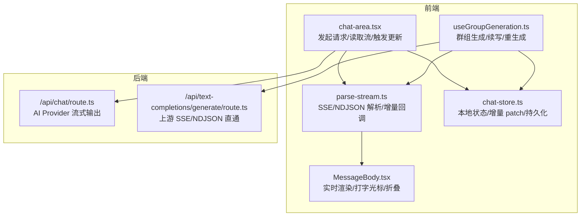
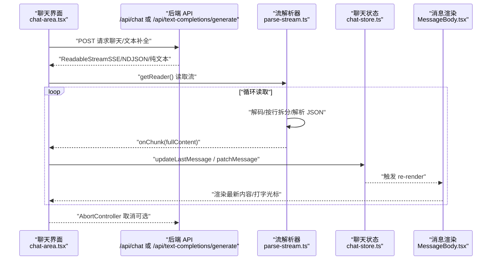
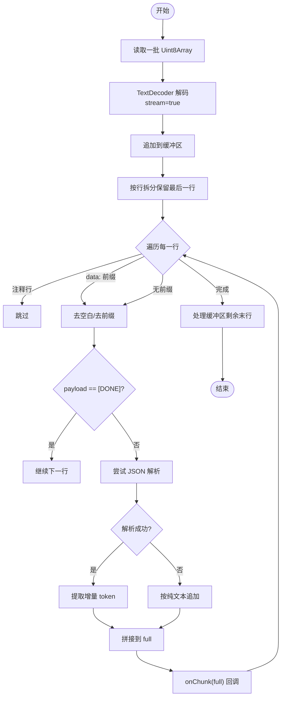
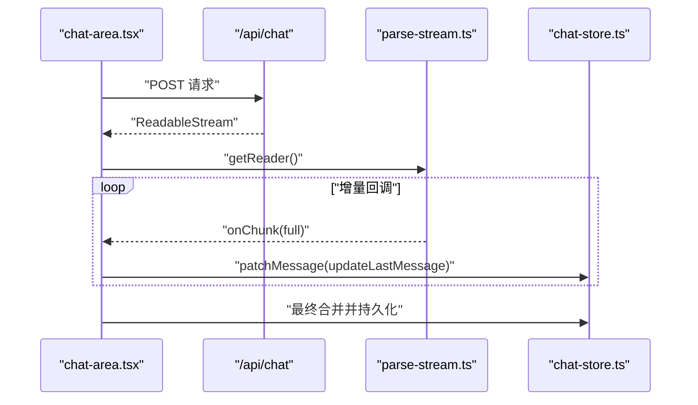
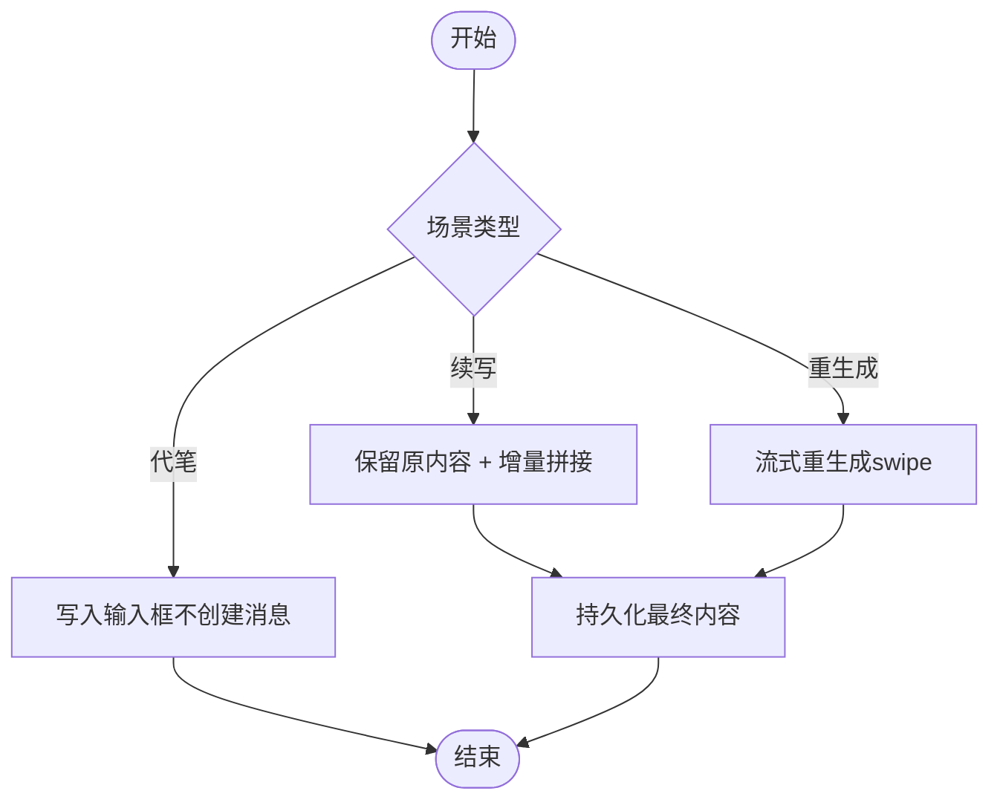
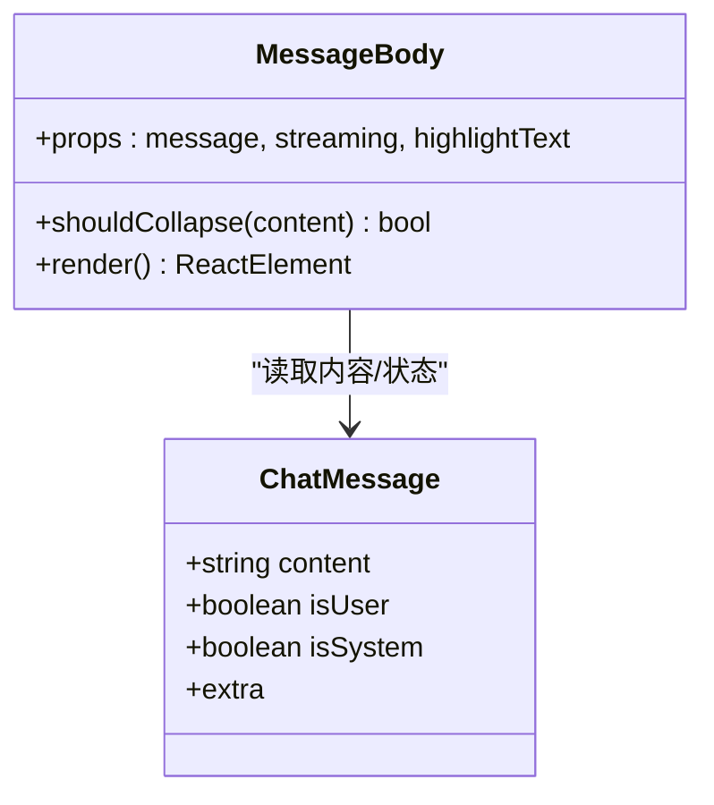
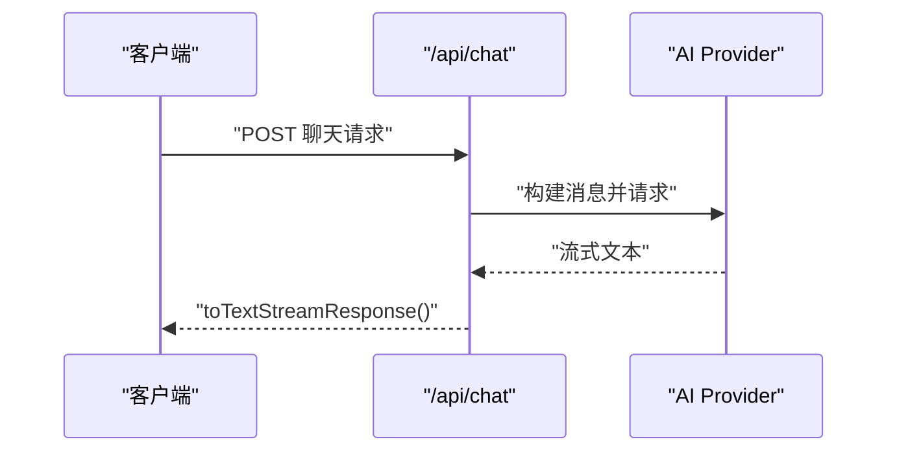
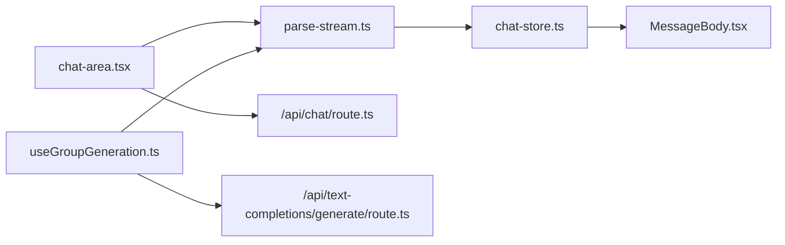

# 流式响应处理

<cite>
**本文引用的文件**
- [src/lib/textgen/parse-stream.ts](file://src/lib/textgen/parse-stream.ts)
- [src/components/chat/chat-area.tsx](file://src/components/chat/chat-area.tsx)
- [src/hooks/useGroupGeneration.ts](file://src/hooks/useGroupGeneration.ts)
- [src/app/api/chat/route.ts](file://src/app/api/chat/route.ts)
- [src/app/api/text-completions/generate/route.ts](file://src/app/api/text-completions/generate/route.ts)
- [src/components/chat/message-bubble/MessageBody.tsx](file://src/components/chat/message-bubble/MessageBody.tsx)
- [src/stores/chat-store.ts](file://src/stores/chat-store.ts)
</cite>

## 目录
1. [简介](#简介)
2. [项目结构](#项目结构)
3. [核心组件](#核心组件)
4. [架构总览](#架构总览)
5. [详细组件分析](#详细组件分析)
6. [依赖关系分析](#依赖关系分析)
7. [性能考量](#性能考量)
8. [故障排查指南](#故障排查指南)
9. [结论](#结论)
10. [附录](#附录)

## 简介
本文件面向 SillyTavern Next 的流式响应处理系统，系统性阐述流式 AI 响应的实现原理、数据解析机制与增量更新策略。重点覆盖以下方面：
- 流式数据的接收、解析、缓冲与渲染全流程
- SSE/NDJSON 等多后端格式兼容与增量 token 提取
- 实时渲染与 UI 更新策略，含长文本折叠与“打字光标”体验
- 性能优化、内存管理与网络异常处理
- 代码级流程图与调用序列图，便于开发者理解与扩展

## 项目结构
围绕流式响应的关键文件分布如下：
- 解析层：统一在解析模块中消费流并回调增量内容
- 控制层：聊天区域与群组生成钩子负责发起请求、读取流与触发 UI 更新
- API 层：聊天与文本补全两类 API，分别对接不同后端与流式协议
- 渲染层：消息气泡与消息正文组件负责实时展示与交互
- 状态层：聊天 store 提供本地增量 patch 与持久化接口

图表来源
- [src/components/chat/chat-area.tsx:950-1031](file://src/components/chat/chat-area.tsx#L950-L1031)
- [src/hooks/useGroupGeneration.ts:391-413](file://src/hooks/useGroupGeneration.ts#L391-L413)
- [src/lib/textgen/parse-stream.ts:38-99](file://src/lib/textgen/parse-stream.ts#L38-L99)
- [src/components/chat/message-bubble/MessageBody.tsx:34-109](file://src/components/chat/message-bubble/MessageBody.tsx#L34-L109)
- [src/stores/chat-store.ts:105-153](file://src/stores/chat-store.ts#L105-L153)
- [src/app/api/chat/route.ts:50-177](file://src/app/api/chat/route.ts#L50-L177)
- [src/app/api/text-completions/generate/route.ts:78-120](file://src/app/api/text-completions/generate/route.ts#L78-L120)

章节来源
- [src/lib/textgen/parse-stream.ts:1-115](file://src/lib/textgen/parse-stream.ts#L1-L115)
- [src/components/chat/chat-area.tsx:950-1031](file://src/components/chat/chat-area.tsx#L950-L1031)
- [src/hooks/useGroupGeneration.ts:391-413](file://src/hooks/useGroupGeneration.ts#L391-L413)
- [src/app/api/chat/route.ts:50-177](file://src/app/api/chat/route.ts#L50-L177)
- [src/app/api/text-completions/generate/route.ts:78-120](file://src/app/api/text-completions/generate/route.ts#L78-L120)
- [src/components/chat/message-bubble/MessageBody.tsx:34-109](file://src/components/chat/message-bubble/MessageBody.tsx#L34-L109)
- [src/stores/chat-store.ts:105-153](file://src/stores/chat-store.ts#L105-L153)

## 核心组件
- 流解析器（consumeTextgenStream / consumePlainTextStream）
  - 负责读取 ReadableStream，按行拆分缓冲区，识别 SSE/NDJSON 数据块，提取增量 token，并通过回调持续输出完整字符串
  - 支持多种后端字段映射，兼容纯文本直通
- 聊天区域控制器（chat-area.tsx）
  - 发起聊天或文本补全请求，根据配置选择不同后端路径，读取流并以增量方式更新最后一条消息
- 群组生成钩子（useGroupGeneration.ts）
  - 支持续写、重生成、代笔等场景，结合截断检测与 swipe 版本管理，最终持久化消息
- API 层
  - /api/chat：基于 AI SDK 的流式输出，统一返回文本流
  - /api/text-completions/generate：直接透传上游 SSE/NDJSON，支持自定义 BaseURL
- 渲染层（MessageBody.tsx）
  - 实时渲染、打字光标闪烁、长文本折叠与展开
- 状态层（chat-store.ts）
  - 提供 updateLastMessage、patchMessage、persistMessage 等接口，支撑增量更新与持久化

章节来源
- [src/lib/textgen/parse-stream.ts:10-115](file://src/lib/textgen/parse-stream.ts#L10-L115)
- [src/components/chat/chat-area.tsx:950-1031](file://src/components/chat/chat-area.tsx#L950-L1031)
- [src/hooks/useGroupGeneration.ts:391-413](file://src/hooks/useGroupGeneration.ts#L391-L413)
- [src/app/api/chat/route.ts:50-177](file://src/app/api/chat/route.ts#L50-L177)
- [src/app/api/text-completions/generate/route.ts:78-120](file://src/app/api/text-completions/generate/route.ts#L78-L120)
- [src/components/chat/message-bubble/MessageBody.tsx:34-109](file://src/components/chat/message-bubble/MessageBody.tsx#L34-L109)
- [src/stores/chat-store.ts:105-153](file://src/stores/chat-store.ts#L105-L153)

## 架构总览
下面的序列图展示了从用户触发到 UI 实时更新的完整链路，涵盖两种主要路径：聊天 API（AI SDK）与文本补全 API（上游直通）。

图表来源
- [src/components/chat/chat-area.tsx:950-1031](file://src/components/chat/chat-area.tsx#L950-L1031)
- [src/lib/textgen/parse-stream.ts:38-99](file://src/lib/textgen/parse-stream.ts#L38-L99)
- [src/stores/chat-store.ts:105-153](file://src/stores/chat-store.ts#L105-L153)
- [src/components/chat/message-bubble/MessageBody.tsx:34-109](file://src/components/chat/message-bubble/MessageBody.tsx#L34-L109)
- [src/app/api/chat/route.ts:50-177](file://src/app/api/chat/route.ts#L50-L177)
- [src/app/api/text-completions/generate/route.ts:78-120](file://src/app/api/text-completions/generate/route.ts#L78-L120)

## 详细组件分析

### 流解析器：consumeTextgenStream 与 consumePlainTextStream
- 功能要点
  - 使用 TextDecoder 流式解码 Uint8Array
  - SSE/NDJSON 行式缓冲：按换行拆分，保留最后一行作为 tail
  - 忽略注释行（以冒号开头），过滤 [DONE] 标记
  - JSON 解析失败时回退为纯文本直接拼接
  - 从多种后端字段中提取增量 token（choices/delta/content/token/response 等）
- 错误与边界
  - 非 JSON 行按原样追加，避免解析异常中断
  - 末尾缓冲单独处理，确保未换行数据也被消费
- 复杂度
  - 时间复杂度近似 O(N)，N 为总字节数；空间复杂度 O(L)，L 为单次缓冲长度

图表来源
- [src/lib/textgen/parse-stream.ts:38-99](file://src/lib/textgen/parse-stream.ts#L38-L99)

章节来源
- [src/lib/textgen/parse-stream.ts:1-115](file://src/lib/textgen/parse-stream.ts#L1-L115)

### 聊天区域控制器：实时续写与增量更新
- 关键流程
  - 构造请求体（消息历史、系统提示、世界书信息等）
  - 选择后端路径：AI SDK 路径或文本补全直通路径
  - 获取 reader 并调用 parse-stream，每收到增量就通过 store 更新最后一条消息
  - 续写场景：保留原内容，新生成追加到同一消息
  - 最终合并 baseContent 与增量内容，持久化更新
- 中断与错误
  - AbortController 支持取消
  - 非 AbortError 的异常弹窗提示

图表来源
- [src/components/chat/chat-area.tsx:950-1031](file://src/components/chat/chat-area.tsx#L950-L1031)
- [src/lib/textgen/parse-stream.ts:38-99](file://src/lib/textgen/parse-stream.ts#L38-L99)
- [src/stores/chat-store.ts:105-153](file://src/stores/chat-store.ts#L105-L153)

章节来源
- [src/components/chat/chat-area.tsx:950-1031](file://src/components/chat/chat-area.tsx#L950-L1031)

### 群组生成钩子：续写/重生成/代笔
- 场景与策略
  - 续写：保留原内容，增量追加到同一消息，完成后一次性持久化
  - 重生成：对最后一条 assistant 消息进行流式重生成，不删除消息，使用 swipe 版本管理
  - 代笔：在用户视角生成回复，不创建消息，仅将增量写入输入框
- 截断检测与 UI 更新
  - 在 onChunkWithTruncation 中检测截断正则，必要时提前停止并使用截断后的最终内容
- 持久化
  - 正常生成结束后，调用 persistMessage 写入数据库并回填服务端真实 ID

图表来源
- [src/hooks/useGroupGeneration.ts:391-413](file://src/hooks/useGroupGeneration.ts#L391-L413)
- [src/stores/chat-store.ts:52-86](file://src/stores/chat-store.ts#L52-L86)

章节来源
- [src/hooks/useGroupGeneration.ts:391-413](file://src/hooks/useGroupGeneration.ts#L391-L413)
- [src/stores/chat-store.ts:52-86](file://src/stores/chat-store.ts#L52-L86)

### 渲染层：实时渲染与用户体验
- 实时渲染
  - MessageBody 在 streaming 为真时显示“打字光标”，并在每次增量回调后触发 re-render
- 长文本折叠
  - 超过阈值的文本默认折叠，支持展开/收起
- 交互细节
  - 折叠预览、渐变遮罩、折叠按钮与高亮文本

图表来源
- [src/components/chat/message-bubble/MessageBody.tsx:15-109](file://src/components/chat/message-bubble/MessageBody.tsx#L15-L109)

章节来源
- [src/components/chat/message-bubble/MessageBody.tsx:34-109](file://src/components/chat/message-bubble/MessageBody.tsx#L34-L109)

### API 层：聊天与文本补全
- /api/chat
  - 使用 AI SDK 的 streamText，将最终消息与系统提示拼装后返回文本流
  - 支持世界书信息注入与多 Provider 配置
- /api/text-completions/generate
  - 根据设置决定是否开启流式，若上游返回流则直接透传（SSE/NDJSON）
  - 支持自定义 BaseURL 与鉴权头

图表来源
- [src/app/api/chat/route.ts:50-177](file://src/app/api/chat/route.ts#L50-L177)

章节来源
- [src/app/api/chat/route.ts:50-177](file://src/app/api/chat/route.ts#L50-L177)
- [src/app/api/text-completions/generate/route.ts:78-120](file://src/app/api/text-completions/generate/route.ts#L78-L120)

## 依赖关系分析
- 控制层依赖解析层：chat-area.tsx 与 useGroupGeneration.ts 通过 consumeTextgenStream/consumePlainTextStream 统一消费流
- 渲染层依赖状态层：MessageBody 依赖 store 的消息状态与 patch 更新
- API 层独立于解析层：/api/chat 返回 AI SDK 流，/api/text-completions/generate 直接透传上游流
- 解析层与 UI 更新解耦：解析器只负责增量回调，UI 更新由 store 驱动

图表来源
- [src/components/chat/chat-area.tsx:950-1031](file://src/components/chat/chat-area.tsx#L950-L1031)
- [src/hooks/useGroupGeneration.ts:391-413](file://src/hooks/useGroupGeneration.ts#L391-L413)
- [src/lib/textgen/parse-stream.ts:38-99](file://src/lib/textgen/parse-stream.ts#L38-L99)
- [src/stores/chat-store.ts:105-153](file://src/stores/chat-store.ts#L105-L153)
- [src/components/chat/message-bubble/MessageBody.tsx:34-109](file://src/components/chat/message-bubble/MessageBody.tsx#L34-L109)
- [src/app/api/chat/route.ts:50-177](file://src/app/api/chat/route.ts#L50-L177)
- [src/app/api/text-completions/generate/route.ts:78-120](file://src/app/api/text-completions/generate/route.ts#L78-L120)

章节来源
- [src/components/chat/chat-area.tsx:950-1031](file://src/components/chat/chat-area.tsx#L950-L1031)
- [src/hooks/useGroupGeneration.ts:391-413](file://src/hooks/useGroupGeneration.ts#L391-L413)
- [src/lib/textgen/parse-stream.ts:1-115](file://src/lib/textgen/parse-stream.ts#L1-L115)
- [src/stores/chat-store.ts:105-153](file://src/stores/chat-store.ts#L105-L153)
- [src/components/chat/message-bubble/MessageBody.tsx:34-109](file://src/components/chat/message-bubble/MessageBody.tsx#L34-L109)
- [src/app/api/chat/route.ts:50-177](file://src/app/api/chat/route.ts#L50-L177)
- [src/app/api/text-completions/generate/route.ts:78-120](file://src/app/api/text-completions/generate/route.ts#L78-L120)

## 性能考量
- 流式解码与缓冲
  - 使用 TextDecoder(stream=true) 降低内存峰值，按行拆分减少单次 JSON 解析压力
- 增量回调频率
  - 建议在 UI 层做节流/防抖，避免频繁 re-render（例如按帧或固定间隔批量更新）
- 长文本渲染
  - MessageBody 默认折叠超阈值内容，减少首屏渲染成本
- 网络与中断
  - AbortController 支持即时取消，避免无效流量与 UI 占用
- 内存管理
  - 解析器仅维护单行缓冲，避免累积大对象；store 的 patchMessage 仅替换目标消息，降低重绘范围

## 故障排查指南
- 常见问题与定位
  - 无响应或无增量：检查后端是否正确返回流（Content-Type 与 keep-alive），确认前端 reader 是否存在
  - 解析异常：部分后端可能输出纯文本行，解析失败会回退为纯文本拼接；如仍无内容，检查上游返回结构
  - 截断与截断检测：群组生成中若命中截断正则，会提前停止并使用截断后内容，需检查正则与提示词
  - 取消与错误：AbortError 不弹窗，其他错误会弹出提示；确认信号传递与异常捕获
- 调试建议
  - 在 onChunk 回调中打印 full 长度或片段，验证增量是否连续
  - 使用浏览器网络面板观察 SSE/NDJSON 分片与 Content-Type
  - 在 store 的 patchMessage 处打断点，确认 UI 更新时机
  - 若出现内存增长，检查是否存在未释放的 reader 或未清理的订阅

章节来源
- [src/lib/textgen/parse-stream.ts:38-99](file://src/lib/textgen/parse-stream.ts#L38-L99)
- [src/components/chat/chat-area.tsx:1022-1031](file://src/components/chat/chat-area.tsx#L1022-L1031)
- [src/hooks/useGroupGeneration.ts:391-413](file://src/hooks/useGroupGeneration.ts#L391-L413)

## 结论
SillyTavern Next 的流式响应处理通过“统一解析 + 多后端直通 + 增量 UI 更新”的架构，实现了跨 Provider 的稳定流式体验。解析器对 SSE/NDJSON 的兼容与对纯文本的回退，保证了广泛的后端适配；store 的增量 patch 与渲染层的实时反馈，提供了流畅的用户体验。建议在大规模消息场景下配合节流与长文本折叠，进一步优化性能与稳定性。

## 附录
- 相关实现路径参考
  - 流解析器：[src/lib/textgen/parse-stream.ts:1-115](file://src/lib/textgen/parse-stream.ts#L1-L115)
  - 聊天区域控制器：[src/components/chat/chat-area.tsx:950-1031](file://src/components/chat/chat-area.tsx#L950-L1031)
  - 群组生成钩子：[src/hooks/useGroupGeneration.ts:391-413](file://src/hooks/useGroupGeneration.ts#L391-L413)
  - 聊天 API：[src/app/api/chat/route.ts:50-177](file://src/app/api/chat/route.ts#L50-L177)
  - 文本补全 API：[src/app/api/text-completions/generate/route.ts:78-120](file://src/app/api/text-completions/generate/route.ts#L78-L120)
  - 渲染组件：[src/components/chat/message-bubble/MessageBody.tsx:34-109](file://src/components/chat/message-bubble/MessageBody.tsx#L34-L109)
  - 状态管理：[src/stores/chat-store.ts:105-153](file://src/stores/chat-store.ts#L105-L153)