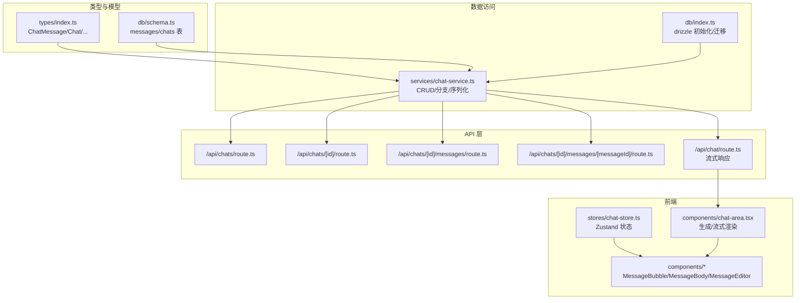
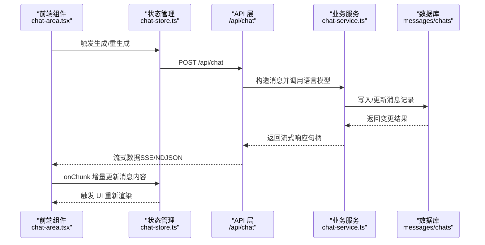
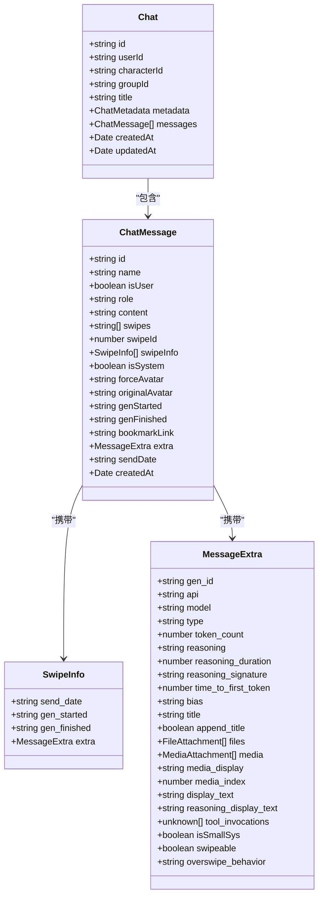
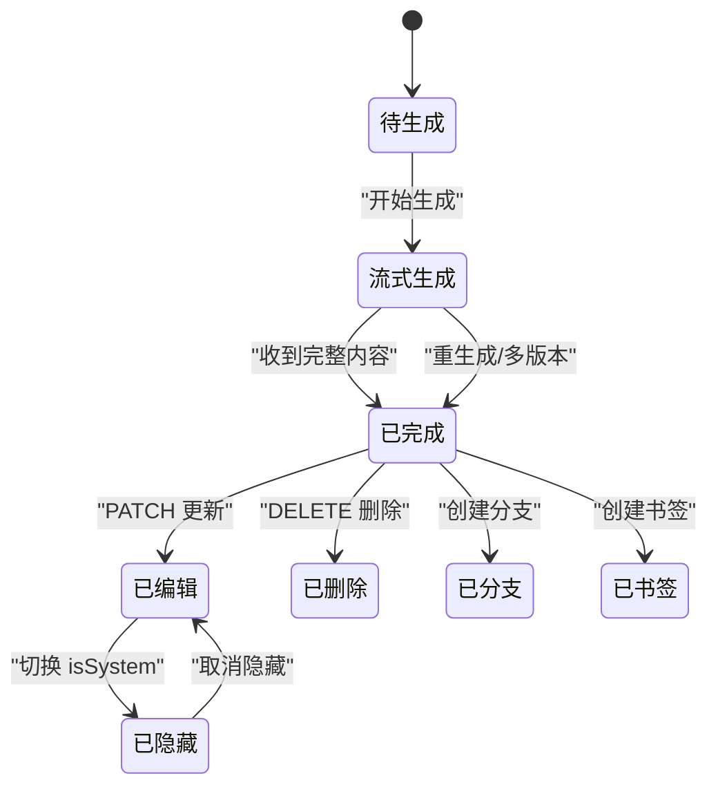
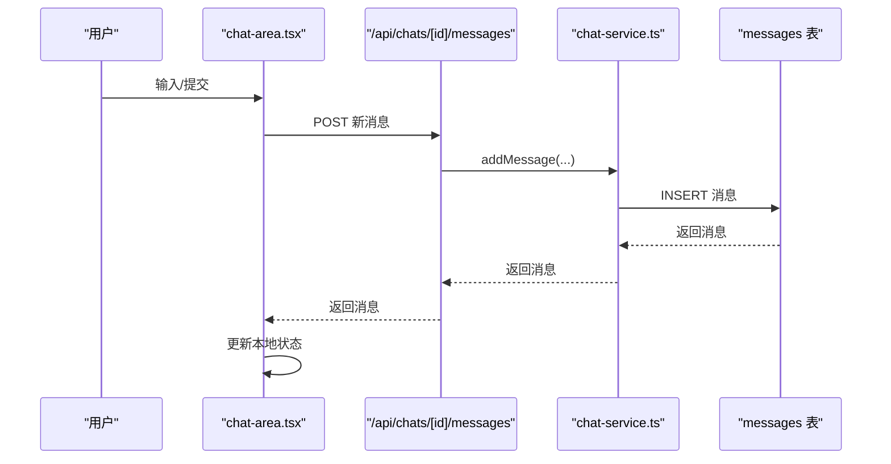
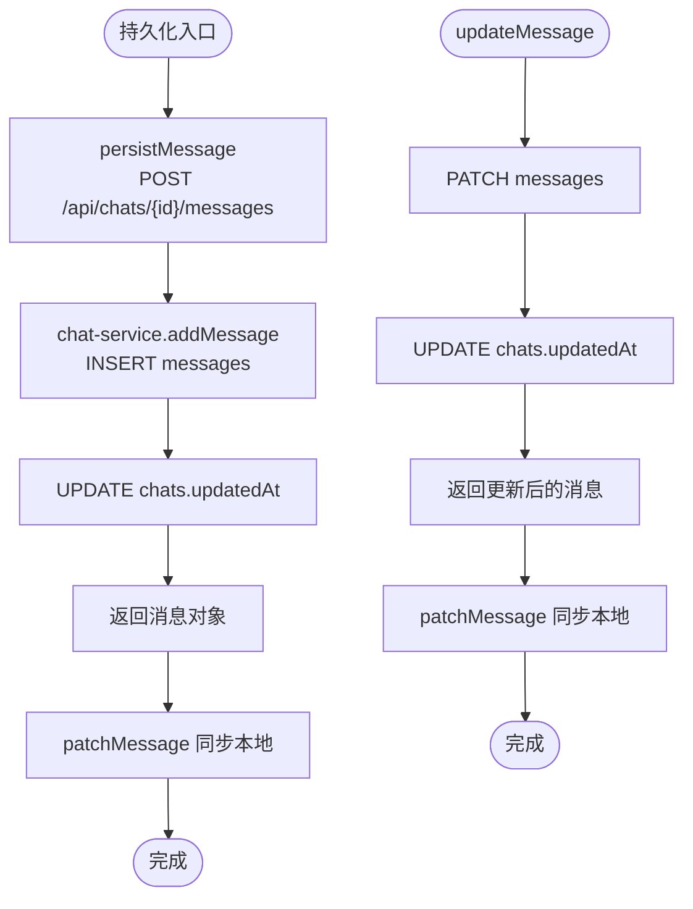
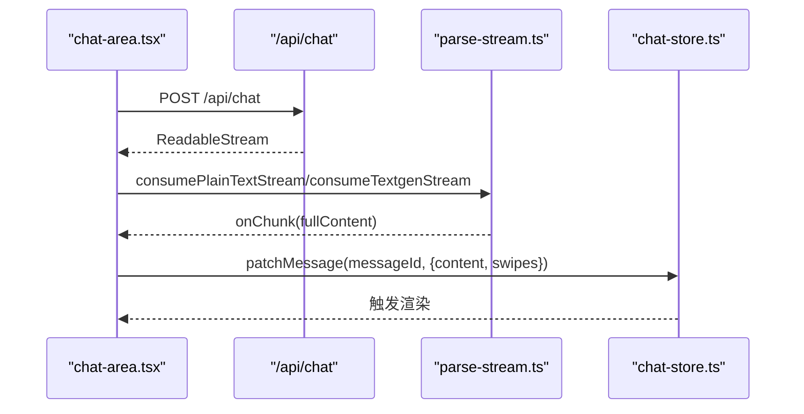
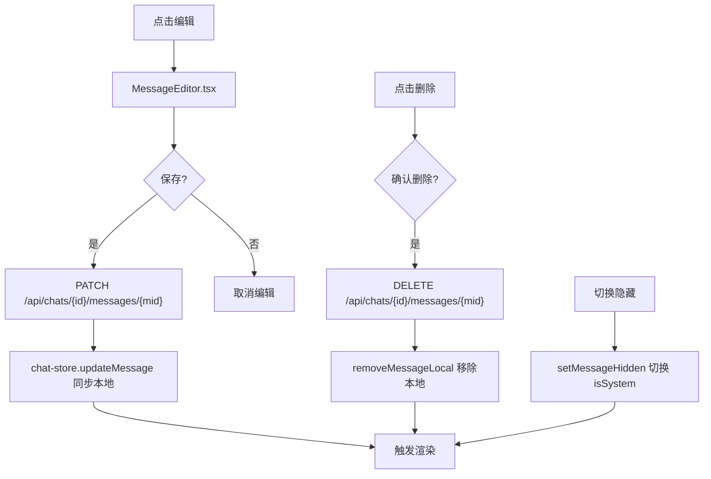
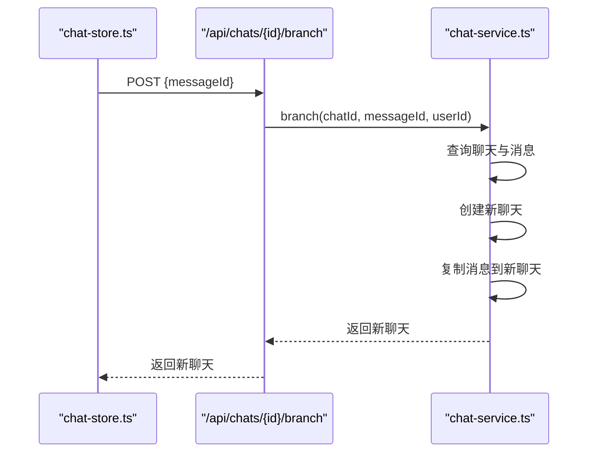
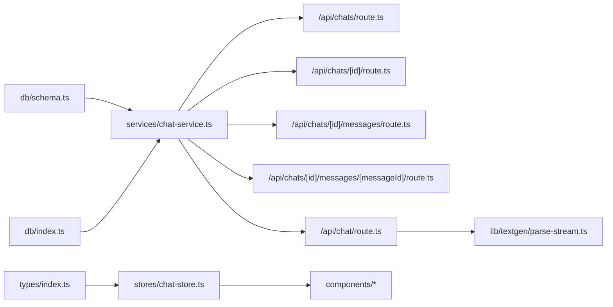

# 消息处理系统

<cite>
**本文引用的文件**
- [schema.ts](file://src/lib/db/schema.ts)
- [index.ts](file://src/lib/db/index.ts)
- [chat-service.ts](file://src/lib/services/chat-service.ts)
- [chat-store.ts](file://src/stores/chat-store.ts)
- [index.ts](file://src/types/index.ts)
- [chat-area.tsx](file://src/components/chat/chat-area.tsx)
- [MessageBubble.tsx](file://src/components/chat/message-bubble/MessageBubble.tsx)
- [MessageBody.tsx](file://src/components/chat/message-bubble/MessageBody.tsx)
- [MessageEditor.tsx](file://src/components/chat/message-bubble/MessageEditor.tsx)
- [route.ts](file://src/app/api/chats/route.ts)
- [route.ts](file://src/app/api/chats/[id]/route.ts)
- [route.ts](file://src/app/api/chats/[id]/messages/route.ts)
- [route.ts](file://src/app/api/chats/[id]/messages/[messageId]/route.ts)
- [route.ts](file://src/app/api/chat/route.ts)
- [parse-stream.ts](file://src/lib/textgen/parse-stream.ts)
</cite>

## 目录
1. [简介](#简介)
2. [项目结构](#项目结构)
3. [核心组件](#核心组件)
4. [架构总览](#架构总览)
5. [详细组件分析](#详细组件分析)
6. [依赖关系分析](#依赖关系分析)
7. [性能考量](#性能考量)
8. [故障排查指南](#故障排查指南)
9. [结论](#结论)
10. [附录](#附录)

## 简介
本文件面向 SillyTavern Next 的消息处理系统，系统性梳理消息的生命周期管理、消息类型定义、消息状态转换、用户与助手消息处理流程、消息持久化与数据库存储策略、流式响应与增量更新、实时渲染机制，以及消息编辑、删除、隐藏等交互能力。文档同时提供关键流程的可视化图示与最佳实践建议，帮助开发者理解与扩展消息处理功能。

## 项目结构
消息处理相关代码主要分布在以下层次：
- 类型与模型层：定义消息、聊天、预设等核心类型与数据库表结构
- 数据访问层：封装数据库读写、序列化与迁移
- 业务服务层：提供聊天与消息的业务操作（创建、更新、删除、分支等）
- API 层：暴露 REST 接口，对接客户端请求
- 前端状态与渲染层：Zustand 状态管理、消息 UI 组件与流式渲染

图表来源
- [index.ts:58-131](file://src/types/index.ts#L58-L131)
- [schema.ts:145-168](file://src/lib/db/schema.ts#L145-L168)
- [index.ts:1-134](file://src/lib/db/index.ts#L1-L134)
- [chat-service.ts:60-300](file://src/lib/services/chat-service.ts#L60-L300)
- [route.ts:1-45](file://src/app/api/chats/route.ts#L1-L45)
- [route.ts:1-74](file://src/app/api/chats/[id]/route.ts#L1-L74)
- [route.ts:1-65](file://src/app/api/chats/[id]/messages/route.ts#L1-L65)
- [route.ts:33-84](file://src/app/api/chats/[id]/messages/[messageId]/route.ts#L33-L84)
- [route.ts:50-177](file://src/app/api/chat/route.ts#L50-L177)
- [chat-store.ts:105-583](file://src/stores/chat-store.ts#L105-L583)
- [chat-area.tsx:710-1002](file://src/components/chat/chat-area.tsx#L710-L1002)

章节来源
- [index.ts:58-131](file://src/types/index.ts#L58-L131)
- [schema.ts:145-168](file://src/lib/db/schema.ts#L145-L168)
- [index.ts:1-134](file://src/lib/db/index.ts#L1-L134)
- [chat-service.ts:60-300](file://src/lib/services/chat-service.ts#L60-L300)
- [route.ts:1-45](file://src/app/api/chats/route.ts#L1-L45)
- [route.ts:1-74](file://src/app/api/chats/[id]/route.ts#L1-L74)
- [route.ts:1-65](file://src/app/api/chats/[id]/messages/route.ts#L1-L65)
- [route.ts:33-84](file://src/app/api/chats/[id]/messages/[messageId]/route.ts#L33-L84)
- [route.ts:50-177](file://src/app/api/chat/route.ts#L50-L177)
- [chat-store.ts:105-583](file://src/stores/chat-store.ts#L105-L583)
- [chat-area.tsx:710-1002](file://src/components/chat/chat-area.tsx#L710-L1002)

## 核心组件
- 类型与模型
  - ChatMessage：消息实体，包含内容、角色、swipe 系统、头像、生成时间、扩展信息等
  - Chat：聊天实体，包含消息数组与元数据
  - 数据库表 messages/chats：与 ChatMessage/Chat 对应的 SQLite 表结构
- 数据访问层
  - db/index.ts：Drizzle 初始化、WAL 模式、外键开启、自动迁移与字段幂等补齐
  - schema.ts：定义表结构与字段约束
- 业务服务层
  - chat-service.ts：提供聊天与消息的 CRUD、分支、序列化、更新时间戳维护等
- API 层
  - /api/chats、/api/chats/[id]、/api/chats/[id]/messages、/api/chats/[id]/messages/[messageId]：REST 接口
  - /api/chat：流式响应接口，支持 SSE/NDJSON
- 前端状态与渲染
  - chat-store.ts：Zustand 状态管理，负责本地状态与后端同步
  - MessageBubble/MessageBody/MessageEditor：消息 UI 组件
  - chat-area.tsx：生成与流式渲染主流程

章节来源
- [index.ts:58-131](file://src/types/index.ts#L58-L131)
- [schema.ts:145-168](file://src/lib/db/schema.ts#L145-L168)
- [index.ts:1-134](file://src/lib/db/index.ts#L1-L134)
- [chat-service.ts:60-300](file://src/lib/services/chat-service.ts#L60-L300)
- [route.ts:1-45](file://src/app/api/chats/route.ts#L1-L45)
- [route.ts:1-74](file://src/app/api/chats/[id]/route.ts#L1-L74)
- [route.ts:1-65](file://src/app/api/chats/[id]/messages/route.ts#L1-L65)
- [route.ts:33-84](file://src/app/api/chats/[id]/messages/[messageId]/route.ts#L33-L84)
- [route.ts:50-177](file://src/app/api/chat/route.ts#L50-L177)
- [chat-store.ts:105-583](file://src/stores/chat-store.ts#L105-L583)
- [MessageBubble.tsx:1-280](file://src/components/chat/message-bubble/MessageBubble.tsx#L1-L280)
- [MessageBody.tsx:49-82](file://src/components/chat/message-bubble/MessageBody.tsx#L49-L82)
- [MessageEditor.tsx:1-138](file://src/components/chat/message-bubble/MessageEditor.tsx#L1-L138)
- [chat-area.tsx:710-1002](file://src/components/chat/chat-area.tsx#L710-L1002)

## 架构总览
消息处理系统采用分层架构：
- 前端通过 chat-store.ts 发起请求，调用 API 层
- API 层校验鉴权后委托 chat-service.ts 执行业务逻辑
- chat-service.ts 使用 Drizzle ORM 操作 SQLite 数据库
- 流式响应由 /api/chat 返回，前端使用 parse-stream.ts 解析增量片段

图表来源
- [chat-area.tsx:710-1002](file://src/components/chat/chat-area.tsx#L710-L1002)
- [chat-store.ts:335-366](file://src/stores/chat-store.ts#L335-L366)
- [route.ts:50-177](file://src/app/api/chat/route.ts#L50-L177)
- [chat-service.ts:147-203](file://src/lib/services/chat-service.ts#L147-L203)
- [schema.ts:145-168](file://src/lib/db/schema.ts#L145-L168)

## 详细组件分析

### 消息类型与状态模型
- ChatMessage 字段要点
  - 角色：user/assistant/system
  - 内容：content
  - Swipe 系统：swipes 数组与 swipeId，swipeInfo 与每条 swipe 的元信息
  - 头像：forceAvatar/ originalAvatar
  - 生成时间：genStarted/genFinished
  - 扩展：extra（包含推理、媒体、书签等）
  - 隐藏：isSystem
- Chat 字段要点
  - 包含 messages 数组与 metadata
- 数据库映射
  - messages 表包含上述字段，支持 JSON 字段存储 swipes/swipeInfo/extra 等
  - chats 表维护聊天元数据与时间戳

图表来源
- [index.ts:58-131](file://src/types/index.ts#L58-L131)
- [schema.ts:145-168](file://src/lib/db/schema.ts#L145-L168)

章节来源
- [index.ts:58-131](file://src/types/index.ts#L58-L131)
- [schema.ts:145-168](file://src/lib/db/schema.ts#L145-L168)

### 消息生命周期与状态转换
- 生命周期阶段
  - 创建：前端或服务端创建消息，写入数据库并更新聊天 updatedAt
  - 流式生成：后端流式返回，前端增量更新 content 与 swipes
  - 编辑：PATCH 更新 content/swipes/swipeInfo/extra/isSystem 等
  - 隐藏：切换 isSystem 控制渲染
  - 删除：删除消息记录并同步 UI
  - 分支/书签：基于消息创建新聊天或建立书签链接
- 状态转换
  - assistant 消息在生成过程中 content 为空，流式到达后逐步填充
  - swipe 切换通过 swipeId 选择当前展示版本
  - isSystem 控制消息是否参与 prompt 渲染

图表来源
- [chat-service.ts:147-203](file://src/lib/services/chat-service.ts#L147-L203)
- [chat-store.ts:335-366](file://src/stores/chat-store.ts#L335-L366)
- [chat-store.ts:424-452](file://src/stores/chat-store.ts#L424-L452)
- [chat-store.ts:454-458](file://src/stores/chat-store.ts#L454-L458)

章节来源
- [chat-service.ts:147-203](file://src/lib/services/chat-service.ts#L147-L203)
- [chat-store.ts:335-366](file://src/stores/chat-store.ts#L335-L366)
- [chat-store.ts:424-452](file://src/stores/chat-store.ts#L424-L452)
- [chat-store.ts:454-458](file://src/stores/chat-store.ts#L454-L458)

### 用户消息与助手消息处理流程
- 用户消息
  - 由前端提交，经 /api/chats/[id]/messages POST 写入数据库
  - 服务端返回消息对象，前端更新本地状态
- 助手消息
  - 由 /api/chat 触发生成，支持流式返回
  - 前端消费流，增量更新 assistant 消息内容
  - 支持多版本（swipes）并行生成与切换

图表来源
- [route.ts:29-65](file://src/app/api/chats/[id]/messages/route.ts#L29-L65)
- [chat-service.ts:147-203](file://src/lib/services/chat-service.ts#L147-L203)
- [schema.ts:145-168](file://src/lib/db/schema.ts#L145-L168)

章节来源
- [route.ts:29-65](file://src/app/api/chats/[id]/messages/route.ts#L29-L65)
- [chat-service.ts:147-203](file://src/lib/services/chat-service.ts#L147-L203)
- [schema.ts:145-168](file://src/lib/db/schema.ts#L145-L168)

### 消息持久化与数据库存储策略
- 持久化策略
  - chat-store.ts 的 persistMessage/updateMessage/deleteMessage 等方法封装了与后端的交互
  - chat-service.ts 负责数据库写入、更新时间戳维护与序列化
  - db/index.ts 负责 Drizzle 初始化、WAL 模式、外键与迁移
- 数据库设计
  - messages 表支持 JSON 字段存储 swipes/swipeInfo/extra
  - chats 表维护用户、角色/群组关联与元数据
  - CASCADE 删除确保聊天删除时消息一并清理

图表来源
- [chat-store.ts:235-272](file://src/stores/chat-store.ts#L235-L272)
- [chat-store.ts:335-366](file://src/stores/chat-store.ts#L335-L366)
- [chat-service.ts:147-203](file://src/lib/services/chat-service.ts#L147-L203)
- [chat-service.ts:205-251](file://src/lib/services/chat-service.ts#L205-L251)
- [schema.ts:145-168](file://src/lib/db/schema.ts#L145-L168)

章节来源
- [chat-store.ts:235-272](file://src/stores/chat-store.ts#L235-L272)
- [chat-store.ts:335-366](file://src/stores/chat-store.ts#L335-L366)
- [chat-service.ts:147-203](file://src/lib/services/chat-service.ts#L147-L203)
- [chat-service.ts:205-251](file://src/lib/services/chat-service.ts#L205-L251)
- [schema.ts:145-168](file://src/lib/db/schema.ts#L145-L168)

### 流式响应、增量更新与实时渲染
- 流式响应
  - /api/chat 使用 AI SDK streamText 输出文本流
  - /api/text-completions/generate/route.ts 直接透传上游 SSE/NDJSON
- 增量更新
  - chat-area.tsx 中的 onChunk 回调接收增量字符串，更新 assistant 消息的 content 与 swipes
  - 支持并发生成多个版本（swipes），完成后统一持久化
- 实时渲染
  - Zustand 状态变更触发组件重渲染
  - MessageBody.tsx 支持流式光标闪烁与折叠/展开

图表来源
- [route.ts:50-177](file://src/app/api/chat/route.ts#L50-L177)
- [chat-area.tsx:710-1002](file://src/components/chat/chat-area.tsx#L710-L1002)
- [parse-stream.ts:101-115](file://src/lib/textgen/parse-stream.ts#L101-L115)
- [chat-store.ts:335-366](file://src/stores/chat-store.ts#L335-L366)

章节来源
- [route.ts:50-177](file://src/app/api/chat/route.ts#L50-L177)
- [chat-area.tsx:710-1002](file://src/components/chat/chat-area.tsx#L710-L1002)
- [parse-stream.ts:101-115](file://src/lib/textgen/parse-stream.ts#L101-L115)
- [chat-store.ts:335-366](file://src/stores/chat-store.ts#L335-L366)

### 消息编辑、删除、隐藏与交互
- 编辑
  - MessageEditor.tsx 提供编辑界面，支持 Ctrl/Cmd+Enter 保存、Esc 取消
  - chat-store.ts.updateMessage 发送 PATCH 请求并同步本地
- 删除
  - chat-store.ts.deleteMessage 调用 DELETE /api/chats/[id]/messages/[messageId]
  - 成功后移除本地消息
- 隐藏
  - setMessageHidden 切换 isSystem，隐藏的消息不参与 prompt 渲染
- 其他交互
  - MessageBubble.tsx 提供复制、重生成、分支、书签、移动、推理块等按钮

图表来源
- [MessageEditor.tsx:1-138](file://src/components/chat/message-bubble/MessageEditor.tsx#L1-L138)
- [chat-store.ts:335-366](file://src/stores/chat-store.ts#L335-L366)
- [chat-store.ts:454-458](file://src/stores/chat-store.ts#L454-L458)
- [MessageBubble.tsx:1-280](file://src/components/chat/message-bubble/MessageBubble.tsx#L1-L280)

章节来源
- [MessageEditor.tsx:1-138](file://src/components/chat/message-bubble/MessageEditor.tsx#L1-L138)
- [chat-store.ts:335-366](file://src/stores/chat-store.ts#L335-L366)
- [chat-store.ts:454-458](file://src/stores/chat-store.ts#L454-L458)
- [MessageBubble.tsx:1-280](file://src/components/chat/message-bubble/MessageBubble.tsx#L1-L280)

### 分支与书签
- 分支
  - chat-service.branch 从指定消息开始复制历史消息到新聊天
  - chat-store.createBranch 调用 /api/chats/{id}/branch
- 书签
  - createBookmark 先创建分支，再在原消息写入 bookmarkLink 指向新聊天

图表来源
- [chat-store.ts:505-536](file://src/stores/chat-store.ts#L505-L536)
- [chat-service.ts:267-299](file://src/lib/services/chat-service.ts#L267-L299)
- [route.ts:1-65](file://src/app/api/chats/[id]/branch/route.ts#L1-L65)

章节来源
- [chat-store.ts:505-536](file://src/stores/chat-store.ts#L505-L536)
- [chat-service.ts:267-299](file://src/lib/services/chat-service.ts#L267-L299)

## 依赖关系分析
- 组件耦合
  - chat-store.ts 依赖 types/index.ts 的类型定义与 API 路径
  - chat-service.ts 依赖 db/schema.ts 的表结构与 db/index.ts 的连接
  - API 层路由依赖 chat-service.ts 提供的业务能力
  - 前端组件依赖 chat-store.ts 的状态与事件回调
- 外部依赖
  - Drizzle ORM + better-sqlite3
  - AI SDK streamText
  - 浏览器 ReadableStream 与 TextDecoder

图表来源
- [index.ts:58-131](file://src/types/index.ts#L58-L131)
- [schema.ts:145-168](file://src/lib/db/schema.ts#L145-L168)
- [index.ts:1-134](file://src/lib/db/index.ts#L1-L134)
- [chat-service.ts:60-300](file://src/lib/services/chat-service.ts#L60-L300)
- [route.ts:1-45](file://src/app/api/chats/route.ts#L1-L45)
- [route.ts:1-74](file://src/app/api/chats/[id]/route.ts#L1-L74)
- [route.ts:1-65](file://src/app/api/chats/[id]/messages/route.ts#L1-L65)
- [route.ts:33-84](file://src/app/api/chats/[id]/messages/[messageId]/route.ts#L33-L84)
- [route.ts:50-177](file://src/app/api/chat/route.ts#L50-L177)
- [chat-store.ts:105-583](file://src/stores/chat-store.ts#L105-L583)
- [parse-stream.ts:1-116](file://src/lib/textgen/parse-stream.ts#L1-L116)

章节来源
- [index.ts:58-131](file://src/types/index.ts#L58-L131)
- [schema.ts:145-168](file://src/lib/db/schema.ts#L145-L168)
- [index.ts:1-134](file://src/lib/db/index.ts#L1-L134)
- [chat-service.ts:60-300](file://src/lib/services/chat-service.ts#L60-L300)
- [route.ts:1-45](file://src/app/api/chats/route.ts#L1-L45)
- [route.ts:1-74](file://src/app/api/chats/[id]/route.ts#L1-L74)
- [route.ts:1-65](file://src/app/api/chats/[id]/messages/route.ts#L1-L65)
- [route.ts:33-84](file://src/app/api/chats/[id]/messages/[messageId]/route.ts#L33-L84)
- [route.ts:50-177](file://src/app/api/chat/route.ts#L50-L177)
- [chat-store.ts:105-583](file://src/stores/chat-store.ts#L105-L583)
- [parse-stream.ts:1-116](file://src/lib/textgen/parse-stream.ts#L1-L116)

## 性能考量
- 数据库
  - WAL 模式提升并发读写性能
  - 外键开启保障数据一致性
  - 迁移与字段幂等补齐避免 schema 变更导致的错误
- 流式处理
  - 使用 ReadableStream 与 TextDecoder 低开销地增量拼接
  - consumeTextgenStream/parse-stream.ts 统一解析逻辑，兼容多种后端格式
- 前端渲染
  - Zustand 状态局部更新，减少不必要的重渲染
  - MessageBody 支持折叠与流式光标，优化长内容体验

## 故障排查指南
- 401 未授权
  - API 层在未登录时返回 401，需检查鉴权中间件与会话状态
- 404 资源不存在
  - 聊天或消息不存在时返回 404，需确认 chatId/messageId 与用户关联
- 500 服务器错误
  - chat-service.ts 与 API 层捕获异常并记录日志，检查数据库连接与迁移状态
- 流式解析异常
  - parse-stream.ts 对非 JSON 行进行容错处理，若出现解析失败，检查上游响应格式与 SSE/NDJSON 规范

章节来源
- [route.ts:5-22](file://src/app/api/chats/route.ts#L5-L22)
- [route.ts:15-26](file://src/app/api/chats/[id]/route.ts#L15-L26)
- [route.ts:16-27](file://src/app/api/chats/[id]/messages/route.ts#L16-L27)
- [route.ts:51-59](file://src/app/api/chats/[id]/messages/[messageId]/route.ts#L51-L59)
- [chat-service.ts:60-300](file://src/lib/services/chat-service.ts#L60-L300)
- [parse-stream.ts:38-99](file://src/lib/textgen/parse-stream.ts#L38-L99)

## 结论
SillyTavern Next 的消息处理系统通过清晰的分层设计与完善的类型定义，实现了从消息创建、流式生成、增量更新到持久化的完整闭环。Zustand 状态管理与 Drizzle ORM 的结合，既保证了前端交互的流畅性，也确保了数据的一致性与可维护性。通过 swipes 系统与分支/书签能力，系统提供了强大的消息版本管理与知识组织能力。建议在扩展新功能时遵循现有分层与类型约定，保持 API 与数据库 schema 的演进一致性。

## 附录
- 最佳实践
  - 保持前端状态与后端数据的双向同步，优先使用 chat-store.ts 的封装方法
  - 流式解析尽量复用 parse-stream.ts 的通用逻辑，避免重复实现
  - 新增字段时，先完善 schema.ts 与 db/index.ts 的迁移/幂等补齐，再补充类型定义
  - 对外暴露的 API 应统一鉴权与输入校验，避免 500 错误