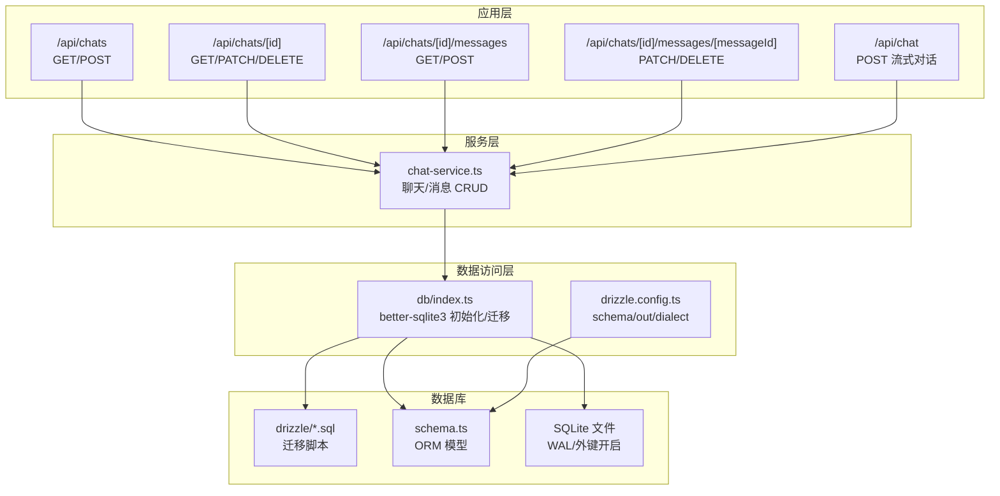
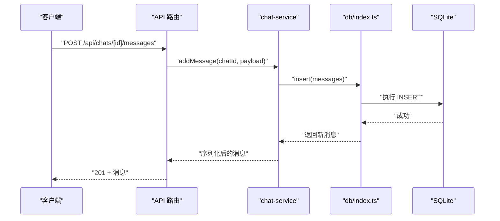
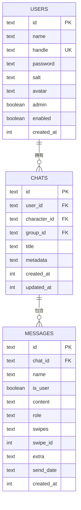
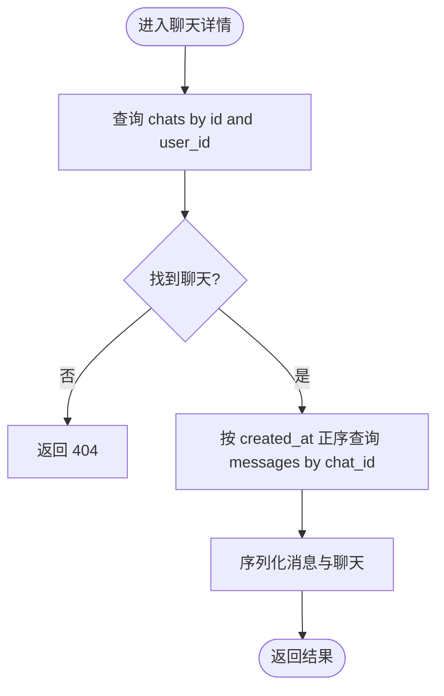
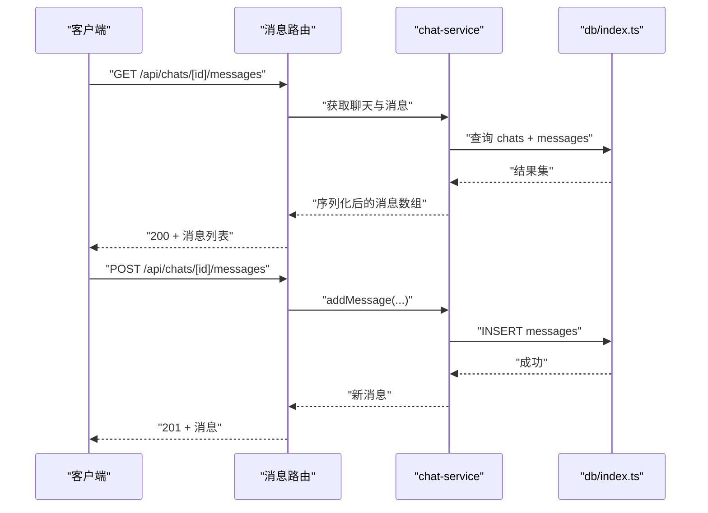
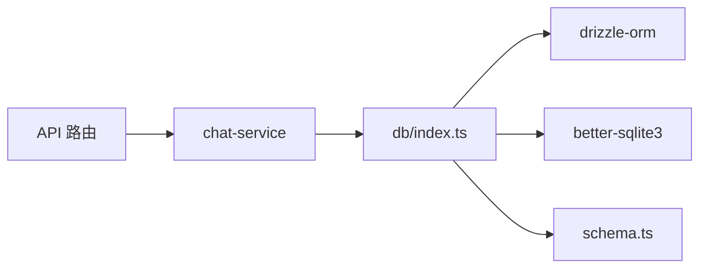

# 消息存储机制

<cite>
**本文引用的文件**
- [drizzle.config.ts](file://drizzle.config.ts)
- [schema.ts](file://src/lib/db/schema.ts)
- [index.ts](file://src/lib/db/index.ts)
- [0000_noisy_songbird.sql](file://drizzle/0000_noisy_songbird.sql)
- [0001_world_info_links.sql](file://drizzle/0001_world_info_links.sql)
- [0002_textgen_preset.sql](file://drizzle/0002_textgen_preset.sql)
- [chat-service.ts](file://src/lib/services/chat-service.ts)
- [route.ts（聊天列表）](file://src/app/api/chats/route.ts)
- [route.ts（单聊）](file://src/app/api/chats/[id]/route.ts)
- [route.ts（消息列表）](file://src/app/api/chats/[id]/messages/route.ts)
- [route.ts（单消息）](file://src/app/api/chats/[id]/messages/[messageId]/route.ts)
- [route.ts（实时对话）](file://src/app/api/chat/route.ts)
</cite>

## 目录
1. [简介](#简介)
2. [项目结构](#项目结构)
3. [核心组件](#核心组件)
4. [架构总览](#架构总览)
5. [详细组件分析](#详细组件分析)
6. [依赖分析](#依赖分析)
7. [性能考虑](#性能考虑)
8. [故障排查指南](#故障排查指南)
9. [结论](#结论)
10. [附录](#附录)

## 简介
本文件系统性阐述 SillyTavern Next 的消息存储机制，覆盖数据库 Schema 设计、表关系、数据模型、持久化策略、缓存与同步、索引与查询优化、事务与并发控制、数据一致性保障，以及实际可用的数据库脚本与查询优化建议。目标是帮助开发者快速理解并高效扩展消息数据的存储与检索。

## 项目结构
围绕消息存储的关键目录与文件如下：
- 数据库配置与迁移
  - drizzle 配置：[drizzle.config.ts](file://drizzle.config.ts)
  - 初始迁移脚本：[0000_noisy_songbird.sql](file://drizzle/0000_noisy_songbird.sql)
  - 扩展迁移脚本：[0001_world_info_links.sql](file://drizzle/0001_world_info_links.sql)、[0002_textgen_preset.sql](file://drizzle/0002_textgen_preset.sql)
  - 运行时初始化与迁移：[index.ts](file://src/lib/db/index.ts)
- 数据模型定义（Drizzle ORM）
  - 模型文件：[schema.ts](file://src/lib/db/schema.ts)
- API 层（消息 CRUD 与聊天管理）
  - 聊天列表与创建：[route.ts（聊天列表）](file://src/app/api/chats/route.ts)
  - 单聊读取/更新/删除：[route.ts（单聊）](file://src/app/api/chats/[id]/route.ts)
  - 消息列表与新增：[route.ts（消息列表）](file://src/app/api/chats/[id]/messages/route.ts)
  - 单消息更新/删除：[route.ts（单消息）](file://src/app/api/chats/[id]/messages/[messageId]/route.ts)
  - 实时对话流式生成：[route.ts（实时对话）](file://src/app/api/chat/route.ts)
- 业务服务层（消息与聊天操作）
  - 聊天与消息服务：[chat-service.ts](file://src/lib/services/chat-service.ts)

图表来源
- [drizzle.config.ts:1-11](file://drizzle.config.ts#L1-L11)
- [schema.ts:144-168](file://src/lib/db/schema.ts#L144-L168)
- [index.ts:1-134](file://src/lib/db/index.ts#L1-L134)
- [0000_noisy_songbird.sql:84-97](file://drizzle/0000_noisy_songbird.sql#L84-L97)
- [route.ts（聊天列表）:1-45](file://src/app/api/chats/route.ts#L1-L45)
- [route.ts（单聊）:1-74](file://src/app/api/chats/[id]/route.ts#L1-L74)
- [route.ts（消息列表）:1-65](file://src/app/api/chats/[id]/messages/route.ts#L1-L65)
- [route.ts（单消息）:1-85](file://src/app/api/chats/[id]/messages/[messageId]/route.ts#L1-L85)
- [route.ts（实时对话）:1-177](file://src/app/api/chat/route.ts#L1-L177)

章节来源
- [drizzle.config.ts:1-11](file://drizzle.config.ts#L1-L11)
- [schema.ts:144-168](file://src/lib/db/schema.ts#L144-L168)
- [index.ts:1-134](file://src/lib/db/index.ts#L1-L134)
- [0000_noisy_songbird.sql:84-97](file://drizzle/0000_noisy_songbird.sql#L84-L97)

## 核心组件
- 数据库初始化与迁移
  - 使用 better-sqlite3 作为驱动，启用 WAL 模式与外键约束，确保并发写入与参照完整性。
  - 自动迁移：启动时扫描迁移目录并执行未执行的迁移，随后进行“字段幂等补齐”，避免因迁移滞后导致的列缺失错误。
- 数据模型与表关系
  - messages 表：存储每条消息，包含角色、内容、时间戳、swipes 及其对应的 swipeInfo、头像强制/原始头像、生成时间、额外元信息等。
  - chats 表：存储聊天会话，包含用户、角色卡/群组关联、标题、元数据、时间戳。
  - 外键关系：messages.chat_id -> chats.id（级联删除），确保删除聊天时自动清理消息。
- 业务服务层
  - chat-service 提供聊天与消息的增删改查、分支复制、消息更新（编辑、swipe、隐藏、书签、头像等）。
  - 所有操作均基于 Drizzle ORM 查询，返回类型安全的实体对象。

章节来源
- [index.ts:16-134](file://src/lib/db/index.ts#L16-L134)
- [schema.ts:144-168](file://src/lib/db/schema.ts#L144-L168)
- [chat-service.ts:60-301](file://src/lib/services/chat-service.ts#L60-L301)

## 架构总览
消息存储采用“API → 服务层 → 数据访问层 → SQLite”的分层架构。Drizzle ORM 将 TypeScript 类型与 SQLite 映射，配合迁移脚本与运行时补齐，确保 Schema 的演进与兼容。

图表来源
- [route.ts（消息列表）:29-64](file://src/app/api/chats/[id]/messages/route.ts#L29-L64)
- [chat-service.ts:147-203](file://src/lib/services/chat-service.ts#L147-L203)
- [index.ts:1-134](file://src/lib/db/index.ts#L1-L134)

## 详细组件分析

### 数据模型与表关系
- 用户与聊天
  - users：用户基本信息与认证字段。
  - chats：会话记录，关联 users、characters、groups。
- 消息模型
  - messages：每条消息的完整生命周期数据，包括 swipes/swipeInfo、isSystem、头像字段、生成时间、额外元信息、发送时间等。
- 外键与约束
  - messages.chat_id → chats.id（ON DELETE CASCADE），删除聊天自动删除消息。
  - 多处表在运行时进行“字段幂等补齐”，确保 Schema 演进的向后兼容。

图表来源
- [schema.ts:6-16](file://src/lib/db/schema.ts#L6-L16)
- [schema.ts:131-140](file://src/lib/db/schema.ts#L131-L140)
- [schema.ts:145-168](file://src/lib/db/schema.ts#L145-L168)
- [0000_noisy_songbird.sql:139-149](file://drizzle/0000_noisy_songbird.sql#L139-L149)
- [0000_noisy_songbird.sql:35-47](file://drizzle/0000_noisy_songbird.sql#L35-L47)
- [0000_noisy_songbird.sql:84-97](file://drizzle/0000_noisy_songbird.sql#L84-L97)

章节来源
- [schema.ts:6-16](file://src/lib/db/schema.ts#L6-L16)
- [schema.ts:131-140](file://src/lib/db/schema.ts#L131-L140)
- [schema.ts:145-168](file://src/lib/db/schema.ts#L145-L168)
- [0000_noisy_songbird.sql:84-97](file://drizzle/0000_noisy_songbird.sql#L84-L97)

### 消息持久化策略
- 写入路径
  - 通过 API POST /api/chats/[id]/messages 调用 chat-service.addMessage，生成唯一 ID，写入 messages 表，并更新所属 chats.updatedAt。
- 数据完整性
  - 外键约束确保消息归属有效；运行时补齐逻辑保证新增列不会导致 500 错误。
- 并发与事务
  - better-sqlite3 默认非事务写入；如需强一致，可在调用方或上层封装事务块（见“性能与并发”章节）。

章节来源
- [route.ts（消息列表）:29-64](file://src/app/api/chats/[id]/messages/route.ts#L29-L64)
- [chat-service.ts:147-203](file://src/lib/services/chat-service.ts#L147-L203)
- [index.ts:16-134](file://src/lib/db/index.ts#L16-L134)

### 缓存机制与数据同步
- 缓存现状
  - 代码中未发现专用的消息缓存层（如 Redis/Memcached）。消息读取直接走数据库查询。
- 同步策略
  - 消息变更通过 API 直接写库，前端通过轮询或 WebSocket 订阅（若实现）获取最新消息。
  - 服务层在新增/更新消息后，会同步更新 chats.updatedAt，便于前端感知会话变更。

章节来源
- [chat-service.ts:196-203](file://src/lib/services/chat-service.ts#L196-L203)
- [chat-service.ts:244-247](file://src/lib/services/chat-service.ts#L244-L247)

### 查询流程与性能
- 常见查询
  - 获取聊天列表：按用户过滤，按更新时间倒序。
  - 获取单聊及全部消息：先查聊天，再按创建时间正序查消息。
  - 新增/更新/删除消息：按消息 ID 与所属聊天 ID 过滤，确保用户可见性。
- 性能要点
  - messages.created_at 已用于排序，但未见显式索引；建议对 chat_id+created_at 建立复合索引以加速“按聊天分页/排序”场景。
  - users.handle 与 settings.user_id 存在唯一索引，避免重复与冲突。

图表来源
- [chat-service.ts:80-92](file://src/lib/services/chat-service.ts#L80-L92)

章节来源
- [chat-service.ts:62-92](file://src/lib/services/chat-service.ts#L62-L92)

### 事务处理、并发控制与一致性
- 事务与并发
  - 当前消息写入未包裹显式事务；如需强一致（例如“原子性地插入消息并更新会话时间”），可在服务层使用事务块包裹。
- 一致性保障
  - 外键约束（messages.chat_id → chats.id）与运行时补齐逻辑共同保证数据一致性与 Schema 演进的稳定性。
- 并发冲突
  - better-sqlite3 在 WAL 模式下具备较好的并发写入能力；仍建议在高并发场景下引入重试与幂等写入策略。

章节来源
- [index.ts:10-11](file://src/lib/db/index.ts#L10-L11)
- [chat-service.ts:147-203](file://src/lib/services/chat-service.ts#L147-L203)

### 数据库 Schema 示例与迁移
- 初始 Schema（messages/chats/users 等）
  - 参考迁移脚本：[0000_noisy_songbird.sql](file://drizzle/0000_noisy_songbird.sql)
- 扩展迁移
  - 角色卡扩展字段：[0001_world_info_links.sql](file://drizzle/0001_world_info_links.sql)
  - 文本生成预设扩展字段：[0002_textgen_preset.sql](file://drizzle/0002_textgen_preset.sql)
- 运行时补齐
  - 对 characters、presets、messages、personas、groups 等表进行“字段幂等补齐”，避免迁移滞后导致的列缺失。

章节来源
- [0000_noisy_songbird.sql:84-97](file://drizzle/0000_noisy_songbird.sql#L84-L97)
- [0001_world_info_links.sql:1-3](file://drizzle/0001_world_info_links.sql#L1-L3)
- [0002_textgen_preset.sql:1-5](file://drizzle/0002_textgen_preset.sql#L1-L5)
- [index.ts:32-128](file://src/lib/db/index.ts#L32-L128)

### API 工作流（消息 CRUD）

图表来源
- [route.ts（消息列表）:5-27](file://src/app/api/chats/[id]/messages/route.ts#L5-L27)
- [route.ts（消息列表）:29-64](file://src/app/api/chats/[id]/messages/route.ts#L29-L64)
- [chat-service.ts:80-92](file://src/lib/services/chat-service.ts#L80-L92)
- [chat-service.ts:147-203](file://src/lib/services/chat-service.ts#L147-L203)

## 依赖分析
- 组件耦合
  - API 路由仅依赖 chat-service；chat-service 依赖 db/index.ts 与 schema.ts；db/index.ts 依赖 better-sqlite3 与 drizzle-orm。
- 外部依赖
  - better-sqlite3（SQLite 驱动）、drizzle-orm（ORM 与迁移）、Zod（请求校验）。
- 潜在循环依赖
  - 未发现循环导入；各层职责清晰。

图表来源
- [route.ts（聊天列表）:1-45](file://src/app/api/chats/route.ts#L1-L45)
- [chat-service.ts:1-6](file://src/lib/services/chat-service.ts#L1-L6)
- [index.ts:1-14](file://src/lib/db/index.ts#L1-L14)
- [schema.ts:1-2](file://src/lib/db/schema.ts#L1-L2)

章节来源
- [chat-service.ts:1-6](file://src/lib/services/chat-service.ts#L1-L6)
- [index.ts:1-14](file://src/lib/db/index.ts#L1-L14)

## 性能考虑
- 索引建议
  - 为 messages.chat_id + created_at 建立复合索引，提升“按聊天分页/排序”的查询效率。
  - 为 chats.user_id + updated_at 建立索引，优化“按用户拉取最近会话”的性能。
- 查询优化
  - 优先使用主键或唯一索引进行过滤；避免 SELECT *，仅选择必要字段。
  - 对高频查询（如“最近 N 条消息”）可考虑分页游标或时间窗口限制。
- 存储与并发
  - WAL 模式已启用，适合高并发写入；如出现写放大，可评估定期 VACUUM 或调整 WAL 参数。
- 缓存策略
  - 对“聊天列表/消息列表”可引入短期缓存（如内存缓存），结合失效策略（如 LRU）降低数据库压力。

[本节为通用性能建议，无需特定文件引用]

## 故障排查指南
- “列不存在”或“500 错误”
  - 现象：迁移文件未包含新增列导致查询报错。
  - 处理：运行时补齐逻辑会自动添加缺失列；若仍失败，请检查数据库权限与迁移目录。
- “未授权/找不到聊天/消息”
  - 现象：返回 401/404。
  - 处理：确认鉴权状态、用户 ID 与资源归属；检查 chat_id/message_id 是否正确。
- “外键约束失败”
  - 现象：插入消息时报外键错误。
  - 处理：确保 chat_id 对应的聊天存在且属于当前用户；检查删除策略（CASCADE）是否生效。

章节来源
- [index.ts:16-134](file://src/lib/db/index.ts#L16-L134)
- [route.ts（消息列表）:10-26](file://src/app/api/chats/[id]/messages/route.ts#L10-L26)
- [route.ts（单消息）:16-55](file://src/app/api/chats/[id]/messages/[messageId]/route.ts#L16-L55)

## 结论
SillyTavern Next 的消息存储以 SQLite + Drizzle ORM 为核心，通过迁移脚本与运行时补齐实现 Schema 的稳健演进；外键约束与服务层的用户归属校验共同保障数据一致性。当前未内置专用缓存层，建议在高并发场景引入事务与缓存策略，并针对热点查询建立复合索引以提升性能。

[本节为总结性内容，无需特定文件引用]

## 附录

### 数据库 Schema 快速参考（关键表）
- users
  - 主键：id；唯一：handle；字段：name、password、salt、avatar、admin、enabled、created_at。
- chats
  - 主键：id；外键：user_id → users.id；可空外键：character_id → characters.id、group_id → groups.id；字段：title、metadata、created_at、updated_at。
- messages
  - 主键：id；外键：chat_id → chats.id（ON DELETE CASCADE）；字段：name、is_user、content、role、swipes、swipe_id、extra、send_date、created_at。

章节来源
- [0000_noisy_songbird.sql:139-149](file://drizzle/0000_noisy_songbird.sql#L139-L149)
- [0000_noisy_songbird.sql:35-47](file://drizzle/0000_noisy_songbird.sql#L35-L47)
- [0000_noisy_songbird.sql:84-97](file://drizzle/0000_noisy_songbird.sql#L84-L97)

### 查询优化技巧清单
- 为高频查询字段建立索引：messages.chat_id + created_at、chats.user_id + updated_at。
- 使用分页或游标，避免一次性加载大量消息。
- 对只读查询启用只读连接池或 WAL 读取优化。
- 在服务层对输入进行严格校验，减少无效写入。

[本节为通用优化建议，无需特定文件引用]