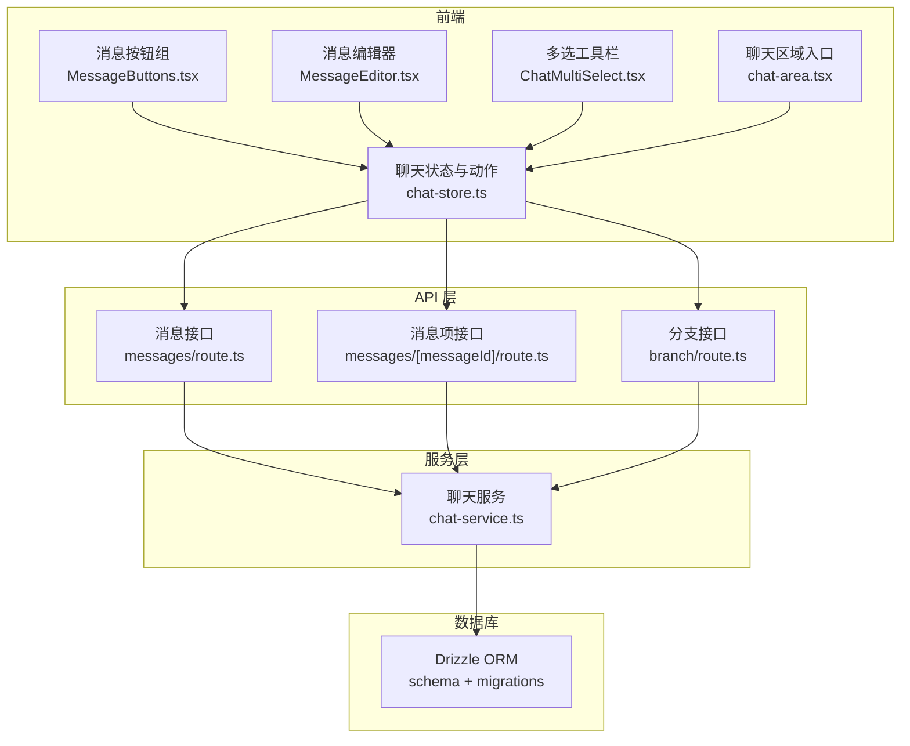
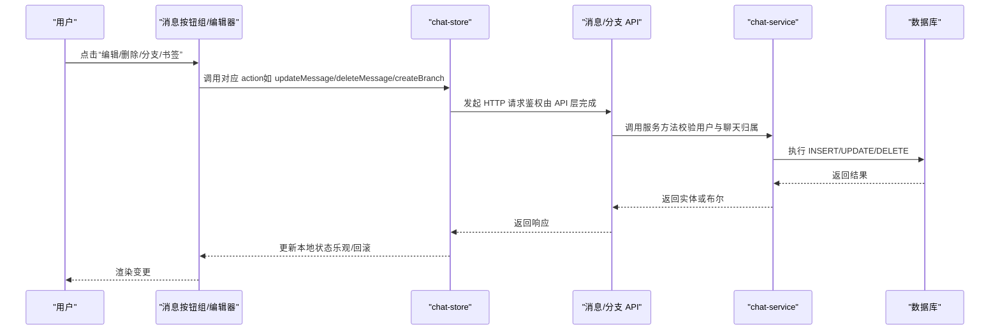
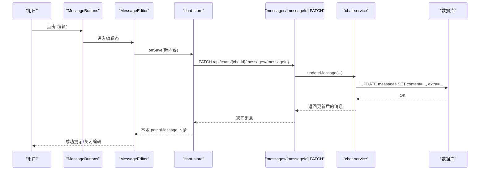
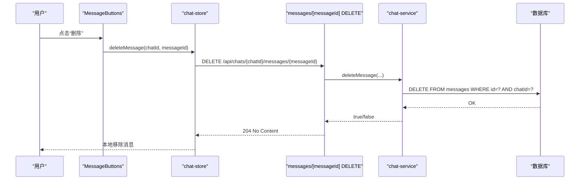
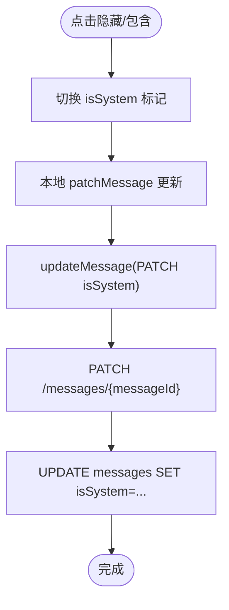
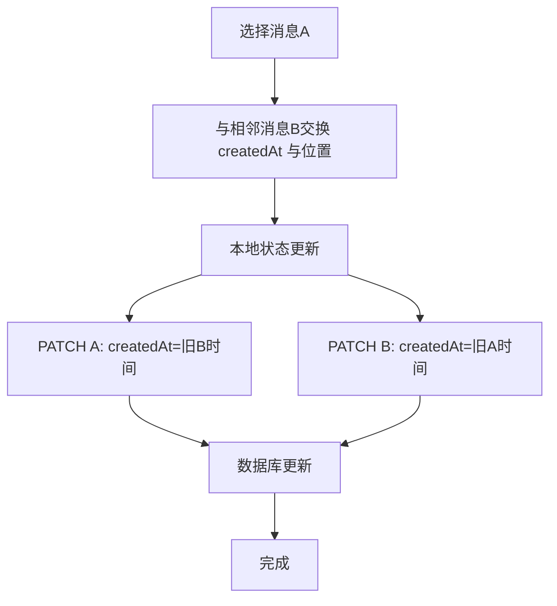
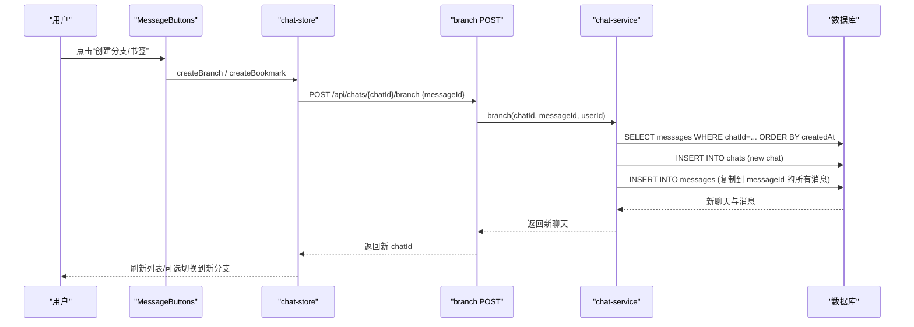
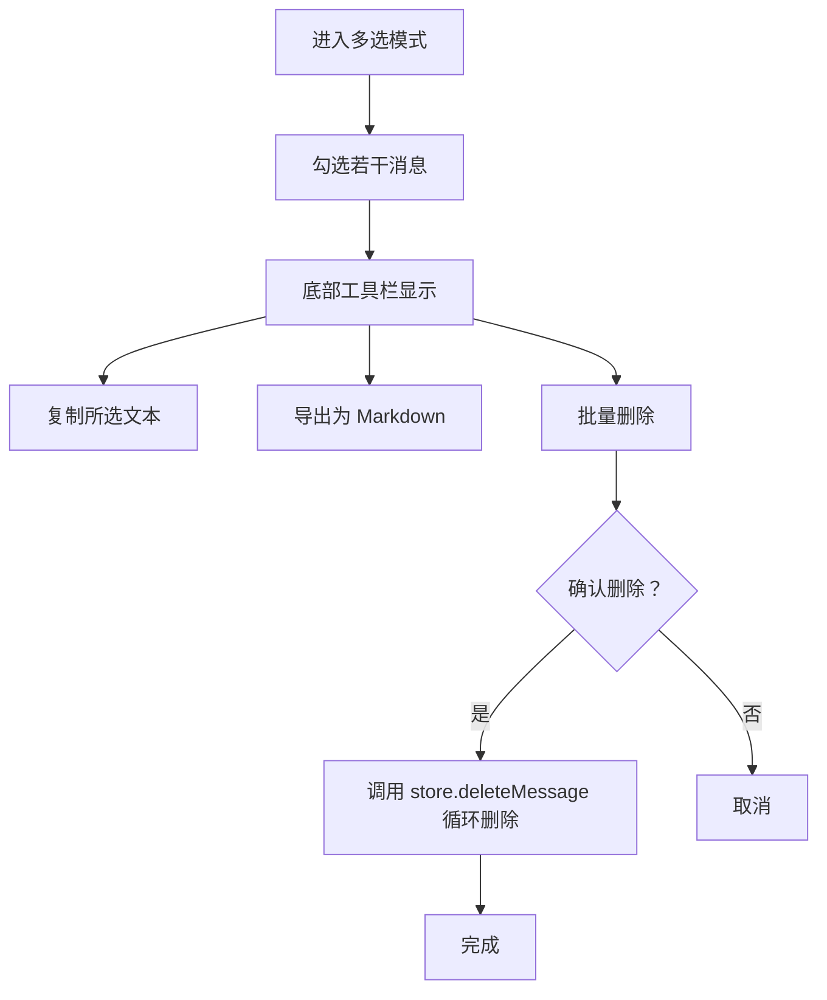
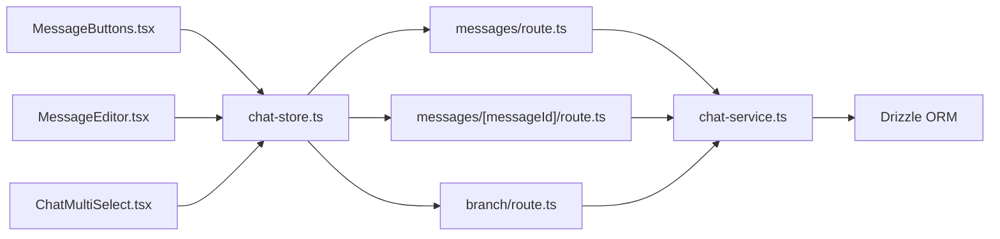

# 消息操作功能

<cite>
**本文档引用的文件**
- [src/app/api/chats/[id]/messages/route.ts](file://src/app/api/chats/[id]/messages/route.ts)
- [src/app/api/chats/[id]/messages/[messageId]/route.ts](file://src/app/api/chats/[id]/messages/[messageId]/route.ts)
- [src/app/api/chats/[id]/branch/route.ts](file://src/app/api/chats/[id]/branch/route.ts)
- [src/lib/services/chat-service.ts](file://src/lib/services/chat-service.ts)
- [src/stores/chat-store.ts](file://src/stores/chat-store.ts)
- [src/components/chat/message-bubble/MessageButtons.tsx](file://src/components/chat/message-bubble/MessageButtons.tsx)
- [src/components/chat/message-bubble/MessageEditor.tsx](file://src/components/chat/message-bubble/MessageEditor.tsx)
- [src/components/chat/chat-area.tsx](file://src/components/chat/chat-area.tsx)
- [src/components/chat/ChatMultiSelect.tsx](file://src/components/chat/ChatMultiSelect.tsx)
- [src/types/index.ts](file://src/types/index.ts)
</cite>

## 目录
1. [简介](#简介)
2. [项目结构](#项目结构)
3. [核心组件](#核心组件)
4. [架构总览](#架构总览)
5. [详细组件分析](#详细组件分析)
6. [依赖关系分析](#依赖关系分析)
7. [性能考虑](#性能考虑)
8. [故障排查指南](#故障排查指南)
9. [结论](#结论)
10. [附录](#附录)

## 简介
本文件面向 SillyTavern Next 的“消息操作功能”，系统性梳理消息的编辑、删除、隐藏、移动、分支创建等核心能力，覆盖前后端实现、权限控制、数据一致性、UI 交互与快捷键支持、批量操作、历史与撤销重做策略以及备份建议。目标是帮助开发者快速理解并扩展消息操作的完整实现。

## 项目结构
消息操作涉及三层协作：
- API 层：提供消息 CRUD、分支创建等 REST 接口，统一鉴权与错误处理
- 服务层：封装数据库访问与业务规则，确保数据一致性
- 前端状态与 UI：通过 Zustand Store 发起请求，驱动 UI 与本地状态同步

图表来源
- [src/components/chat/message-bubble/MessageButtons.tsx:1-274](file://src/components/chat/message-bubble/MessageButtons.tsx#L1-L274)
- [src/components/chat/message-bubble/MessageEditor.tsx:1-139](file://src/components/chat/message-bubble/MessageEditor.tsx#L1-L139)
- [src/components/chat/ChatMultiSelect.tsx:1-110](file://src/components/chat/ChatMultiSelect.tsx#L1-L110)
- [src/stores/chat-store.ts:1-583](file://src/stores/chat-store.ts#L1-L583)
- [src/app/api/chats/[id]/messages/route.ts](file://src/app/api/chats/[id]/messages/route.ts#L1-L65)
- [src/app/api/chats/[id]/messages/[messageId]/route.ts](file://src/app/api/chats/[id]/messages/[messageId]/route.ts#L1-L85)
- [src/app/api/chats/[id]/branch/route.ts](file://src/app/api/chats/[id]/branch/route.ts#L1-L37)
- [src/lib/services/chat-service.ts:1-301](file://src/lib/services/chat-service.ts#L1-L301)

章节来源
- [src/stores/chat-store.ts:1-583](file://src/stores/chat-store.ts#L1-L583)
- [src/lib/services/chat-service.ts:1-301](file://src/lib/services/chat-service.ts#L1-L301)

## 核心组件
- 消息编辑器（MessageEditor）：提供编辑、保存、取消、复制、上下移动、添加推理块等能力，支持键盘快捷键（Ctrl/⌘+Enter 保存、Esc 取消、F2 编辑）
- 消息按钮组（MessageButtons）：提供复制、编辑、删除、重生成、分支、书签、翻译、朗读、生成图片等操作入口，支持“更多操作”折叠菜单
- 聊天状态与动作（chat-store）：封装消息 CRUD、分支、书签、移动、swipe 切换、推理块、批量删除等动作，负责本地乐观更新与后端同步
- 聊天区域入口（chat-area）：承载多选模式、搜索、批量导出/复制/删除等高级功能
- 多选工具栏（ChatMultiSelect）：批量复制、导出、删除
- API 层（messages、messages/[messageId]、branch）：REST 接口，鉴权与错误处理
- 服务层（chat-service）：数据库访问与业务规则，确保消息归属校验与一致性

章节来源
- [src/components/chat/message-bubble/MessageEditor.tsx:1-139](file://src/components/chat/message-bubble/MessageEditor.tsx#L1-L139)
- [src/components/chat/message-bubble/MessageButtons.tsx:1-274](file://src/components/chat/message-bubble/MessageButtons.tsx#L1-L274)
- [src/stores/chat-store.ts:1-583](file://src/stores/chat-store.ts#L1-L583)
- [src/components/chat/chat-area.tsx:1-200](file://src/components/chat/chat-area.tsx#L1-L200)
- [src/components/chat/ChatMultiSelect.tsx:1-110](file://src/components/chat/ChatMultiSelect.tsx#L1-L110)
- [src/app/api/chats/[id]/messages/route.ts](file://src/app/api/chats/[id]/messages/route.ts#L1-L65)
- [src/app/api/chats/[id]/messages/[messageId]/route.ts](file://src/app/api/chats/[id]/messages/[messageId]/route.ts#L1-L85)
- [src/app/api/chats/[id]/branch/route.ts](file://src/app/api/chats/[id]/branch/route.ts#L1-L37)
- [src/lib/services/chat-service.ts:1-301](file://src/lib/services/chat-service.ts#L1-L301)

## 架构总览
消息操作遵循“前端 Store → API → 服务层 → 数据库”的调用链，所有写操作均进行用户归属校验，确保安全性与一致性。

图表来源
- [src/stores/chat-store.ts:335-366](file://src/stores/chat-store.ts#L335-L366)
- [src/app/api/chats/[id]/messages/[messageId]/route.ts](file://src/app/api/chats/[id]/messages/[messageId]/route.ts#L23-L60)
- [src/lib/services/chat-service.ts:205-251](file://src/lib/services/chat-service.ts#L205-L251)
- [src/app/api/chats/[id]/branch/route.ts](file://src/app/api/chats/[id]/branch/route.ts#L10-L31)

## 详细组件分析

### 消息编辑（编辑器与按钮）
- 编辑器支持：
  - 键盘快捷键：Ctrl/⌘+Enter 保存，Esc 取消，F2 进入编辑
  - 功能按钮：保存、取消、复制、添加推理块、上下移动
- 按钮组支持：
  - 最后一条消息显示“重生成”
  - 更多操作：隐藏/包含到 Prompt、分支、书签、翻译、朗读、生成图片、删除
- 前端行为：
  - 编辑保存 → 调用 store.updateMessage → API PATCH → 服务层校验 → DB 更新 → 本地 patchMessage 同步
  - 删除 → store.deleteMessage → API DELETE → 本地 removeMessageLocal 同步

图表来源
- [src/components/chat/message-bubble/MessageButtons.tsx:89-93](file://src/components/chat/message-bubble/MessageButtons.tsx#L89-L93)
- [src/components/chat/message-bubble/MessageEditor.tsx:50-58](file://src/components/chat/message-bubble/MessageEditor.tsx#L50-L58)
- [src/stores/chat-store.ts:335-351](file://src/stores/chat-store.ts#L335-L351)
- [src/app/api/chats/[id]/messages/[messageId]/route.ts](file://src/app/api/chats/[id]/messages/[messageId]/route.ts#L23-L60)
- [src/lib/services/chat-service.ts:205-251](file://src/lib/services/chat-service.ts#L205-L251)

章节来源
- [src/components/chat/message-bubble/MessageEditor.tsx:1-139](file://src/components/chat/message-bubble/MessageEditor.tsx#L1-L139)
- [src/components/chat/message-bubble/MessageButtons.tsx:1-274](file://src/components/chat/message-bubble/MessageButtons.tsx#L1-L274)
- [src/stores/chat-store.ts:335-351](file://src/stores/chat-store.ts#L335-L351)

### 消息删除
- 前端流程：store.deleteMessage → API DELETE → 本地 removeMessageLocal
- 服务层校验：确认聊天属于当前用户，再执行删除
- 注意：删除接口返回 204 表示成功

图表来源
- [src/components/chat/message-bubble/MessageButtons.tsx:195-206](file://src/components/chat/message-bubble/MessageButtons.tsx#L195-L206)
- [src/stores/chat-store.ts:353-366](file://src/stores/chat-store.ts#L353-L366)
- [src/app/api/chats/[id]/messages/[messageId]/route.ts](file://src/app/api/chats/[id]/messages/[messageId]/route.ts#L62-L84)
- [src/lib/services/chat-service.ts:253-265](file://src/lib/services/chat-service.ts#L253-L265)

章节来源
- [src/stores/chat-store.ts:353-366](file://src/stores/chat-store.ts#L353-L366)
- [src/app/api/chats/[id]/messages/[messageId]/route.ts](file://src/app/api/chats/[id]/messages/[messageId]/route.ts#L62-L84)
- [src/lib/services/chat-service.ts:253-265](file://src/lib/services/chat-service.ts#L253-L265)

### 消息隐藏与包含到 Prompt
- 前端：setMessageHidden → 本地 patchMessage → updateMessage（PATCH isSystem）
- 服务层：updateMessage 支持 isSystem 字段更新
- UI 行为：按钮组“更多操作”中提供“从 Prompt 排除/包含到 Prompt”切换

图表来源
- [src/stores/chat-store.ts:454-458](file://src/stores/chat-store.ts#L454-L458)
- [src/app/api/chats/[id]/messages/[messageId]/route.ts](file://src/app/api/chats/[id]/messages/[messageId]/route.ts#L36-L49)
- [src/lib/services/chat-service.ts:205-251](file://src/lib/services/chat-service.ts#L205-L251)
- [src/components/chat/message-bubble/MessageButtons.tsx:117-127](file://src/components/chat/message-bubble/MessageButtons.tsx#L117-L127)

章节来源
- [src/stores/chat-store.ts:454-458](file://src/stores/chat-store.ts#L454-L458)
- [src/components/chat/message-bubble/MessageButtons.tsx:117-127](file://src/components/chat/message-bubble/MessageButtons.tsx#L117-L127)

### 消息移动（上下交换顺序）
- 前端：moveMessage 本地先互换 createdAt 与数组位置，再并发 PATCH 两条消息的 createdAt
- 服务层：updateMessage 支持 createdAt 更新
- 限制：首尾不可移动

图表来源
- [src/stores/chat-store.ts:460-494](file://src/stores/chat-store.ts#L460-L494)
- [src/app/api/chats/[id]/messages/[messageId]/route.ts](file://src/app/api/chats/[id]/messages/[messageId]/route.ts#L36-L49)
- [src/lib/services/chat-service.ts:205-251](file://src/lib/services/chat-service.ts#L205-L251)

章节来源
- [src/stores/chat-store.ts:460-494](file://src/stores/chat-store.ts#L460-L494)

### 分支创建与书签
- 分支创建：POST /api/chats/{chatId}/branch，body 包含 messageId
- 服务层：chat-service.branch 从 messageId 开始复制消息至新聊天
- 书签：createBookmark = createBranch + 在原消息写入 bookmarkLink
- 前端：MessageButtons 提供“创建分支/已有检查点”“创建检查点/移除检查点”按钮

图表来源
- [src/components/chat/message-bubble/MessageButtons.tsx:128-161](file://src/components/chat/message-bubble/MessageButtons.tsx#L128-L161)
- [src/stores/chat-store.ts:505-536](file://src/stores/chat-store.ts#L505-L536)
- [src/app/api/chats/[id]/branch/route.ts](file://src/app/api/chats/[id]/branch/route.ts#L10-L31)
- [src/lib/services/chat-service.ts:267-299](file://src/lib/services/chat-service.ts#L267-L299)

章节来源
- [src/stores/chat-store.ts:505-536](file://src/stores/chat-store.ts#L505-L536)
- [src/app/api/chats/[id]/branch/route.ts](file://src/app/api/chats/[id]/branch/route.ts#L1-L37)
- [src/lib/services/chat-service.ts:267-299](file://src/lib/services/chat-service.ts#L267-L299)

### 批量操作（多选）
- 多选模式：chat-area 中开启多选，底部弹出工具栏
- 支持：复制、导出为 Markdown、批量删除
- 导出函数：exportMessagesAsMarkdown、selectedMessagesToText

图表来源
- [src/components/chat/chat-area.tsx:1737-1758](file://src/components/chat/chat-area.tsx#L1737-L1758)
- [src/components/chat/ChatMultiSelect.tsx:19-81](file://src/components/chat/ChatMultiSelect.tsx#L19-L81)
- [src/stores/chat-store.ts:353-366](file://src/stores/chat-store.ts#L353-L366)

章节来源
- [src/components/chat/chat-area.tsx:1737-1758](file://src/components/chat/chat-area.tsx#L1737-L1758)
- [src/components/chat/ChatMultiSelect.tsx:1-110](file://src/components/chat/ChatMultiSelect.tsx#L1-L110)
- [src/stores/chat-store.ts:353-366](file://src/stores/chat-store.ts#L353-L366)

### Swipe 切换与推理块
- 切换 active swipe：本地 patchMessage + 并发写 DB（失败不回滚）
- 追加新 swipe：本地更新 swipes/swipeInfo/swipeId，再 updateMessage 同步
- 删除 swipe：至少保留 1 个，必要时调整 swipeId
- 初始化推理块：为 assistant 消息添加空 reasoning 字段，便于 UI 编辑

章节来源
- [src/stores/chat-store.ts:368-452](file://src/stores/chat-store.ts#L368-L452)
- [src/types/index.ts:60-131](file://src/types/index.ts#L60-L131)

## 依赖关系分析
- 组件耦合
  - MessageButtons 与 MessageEditor 通过 chat-store 的回调解耦
  - chat-store 对 API 层与服务层形成统一抽象，避免 UI 直接依赖网络细节
- 数据一致性
  - 所有写操作均在服务层进行用户与聊天归属校验
  - 删除与移动采用本地乐观更新 + 后端同步，失败时可通过刷新恢复
- 外部依赖
  - Drizzle ORM：数据库访问
  - Next.js Server Actions/路由：API 层
  - Zustand：状态管理

图表来源
- [src/components/chat/message-bubble/MessageButtons.tsx:1-274](file://src/components/chat/message-bubble/MessageButtons.tsx#L1-L274)
- [src/components/chat/message-bubble/MessageEditor.tsx:1-139](file://src/components/chat/message-bubble/MessageEditor.tsx#L1-L139)
- [src/components/chat/ChatMultiSelect.tsx:1-110](file://src/components/chat/ChatMultiSelect.tsx#L1-L110)
- [src/stores/chat-store.ts:1-583](file://src/stores/chat-store.ts#L1-L583)
- [src/app/api/chats/[id]/messages/route.ts](file://src/app/api/chats/[id]/messages/route.ts#L1-L65)
- [src/app/api/chats/[id]/messages/[messageId]/route.ts](file://src/app/api/chats/[id]/messages/[messageId]/route.ts#L1-L85)
- [src/app/api/chats/[id]/branch/route.ts](file://src/app/api/chats/[id]/branch/route.ts#L1-L37)
- [src/lib/services/chat-service.ts:1-301](file://src/lib/services/chat-service.ts#L1-L301)

章节来源
- [src/stores/chat-store.ts:1-583](file://src/stores/chat-store.ts#L1-L583)
- [src/lib/services/chat-service.ts:1-301](file://src/lib/services/chat-service.ts#L1-L301)

## 性能考虑
- 本地乐观更新：编辑、删除、移动、分支等操作先更新 UI，再异步同步后端，提升交互流畅度
- 并发写入：移动消息时并发 PATCH 两条消息的时间戳，减少往返
- 防抖与节流：搜索与输入场景建议结合现有防抖常量使用（如输入防抖）
- 数据序列化：服务层统一序列化/反序列化 JSON 字段，避免重复解析

## 故障排查指南
- 401 未授权
  - 现象：API 返回 Unauthorized
  - 排查：确认登录态与鉴权中间件生效
- 404 聊天/消息不存在
  - 现象：返回 Chat not found / Message not found
  - 排查：确认 chatId/messageId 正确且属于当前用户
- 删除无效
  - 现象：前端未移除
  - 排查：确认 API 返回 204，store.deleteMessage 的本地移除逻辑是否执行
- 移动失败
  - 现象：边界消息无法移动
  - 排查：首尾消息不可移动属预期；检查索引与方向参数
- 分支/书签失败
  - 现象：返回 Branch failed
  - 排查：确认 messageId 存在于当前聊天；服务层分支逻辑是否找到该消息

章节来源
- [src/app/api/chats/[id]/messages/route.ts](file://src/app/api/chats/[id]/messages/route.ts#L10-L27)
- [src/app/api/chats/[id]/messages/[messageId]/route.ts](file://src/app/api/chats/[id]/messages/[messageId]/route.ts#L51-L53)
- [src/app/api/chats/[id]/branch/route.ts](file://src/app/api/chats/[id]/branch/route.ts#L27-L31)

## 结论
消息操作功能通过清晰的三层架构实现了完整的编辑、删除、隐藏、移动、分支与书签能力，前端采用乐观更新与并发写入优化体验，后端以服务层统一校验与序列化保障一致性。UI 提供丰富的交互与快捷键支持，并辅以多选批量能力。建议在生产环境中结合备份策略与日志监控，持续完善撤销/重做与历史追踪能力。

## 附录
- 权限控制要点
  - API 层统一鉴权，未登录返回 401
  - 服务层校验聊天 belongs_to 当前用户，否则拒绝写入
- 数据模型关键字段
  - ChatMessage：content、swipes、swipeId、swipeInfo、isSystem、extra、bookmarkLink、avatar 相关字段等
- 快捷键与交互
  - 编辑器：Ctrl/⌘+Enter 保存，Esc 取消，F2 进入编辑
  - 搜索：Ctrl/⌘+F 唤出，Enter/Shift+Enter 导航匹配
  - 多选：底部工具栏支持复制、导出、批量删除

章节来源
- [src/types/index.ts:60-131](file://src/types/index.ts#L60-L131)
- [src/components/chat/message-bubble/MessageEditor.tsx:50-58](file://src/components/chat/message-bubble/MessageEditor.tsx#L50-L58)
- [src/components/chat/chat-area.tsx:139-149](file://src/components/chat/chat-area.tsx#L139-L149)
- [src/components/chat/ChatMultiSelect.tsx:19-81](file://src/components/chat/ChatMultiSelect.tsx#L19-L81)