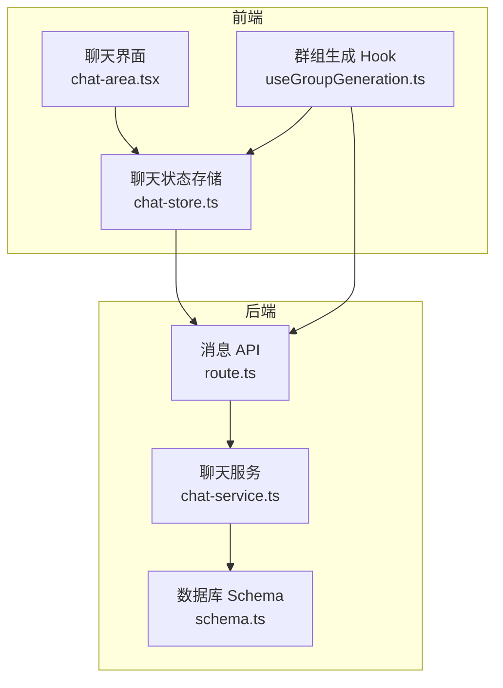
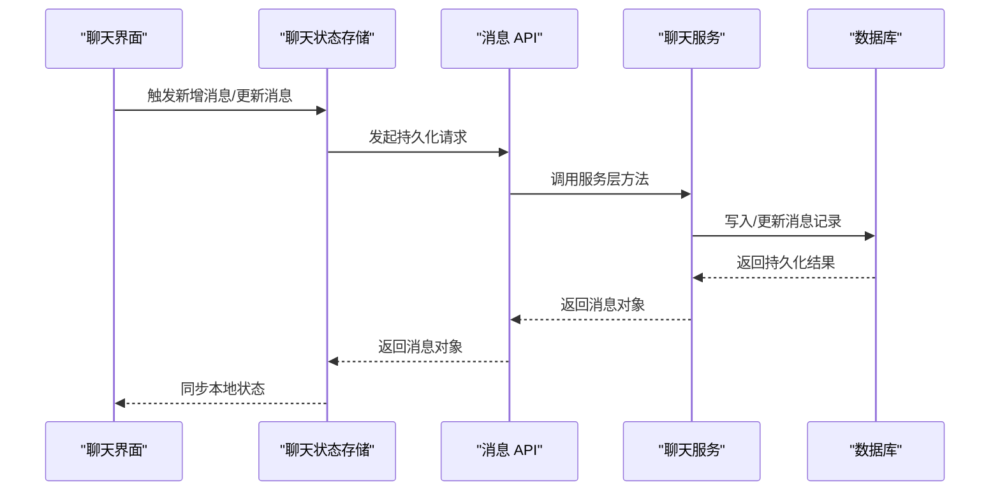
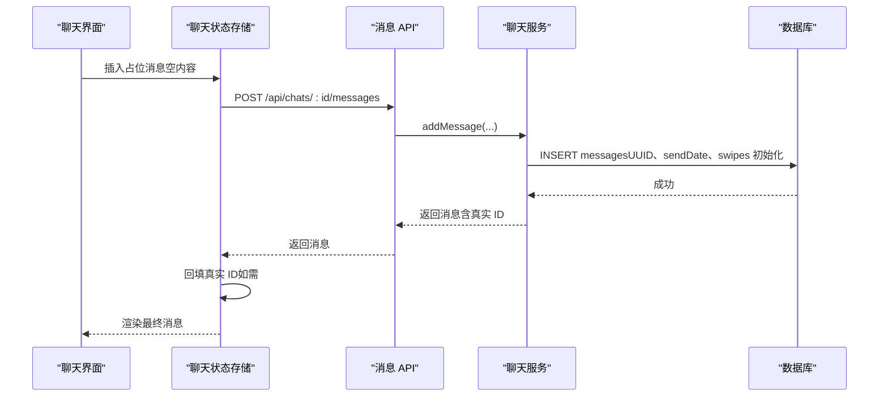
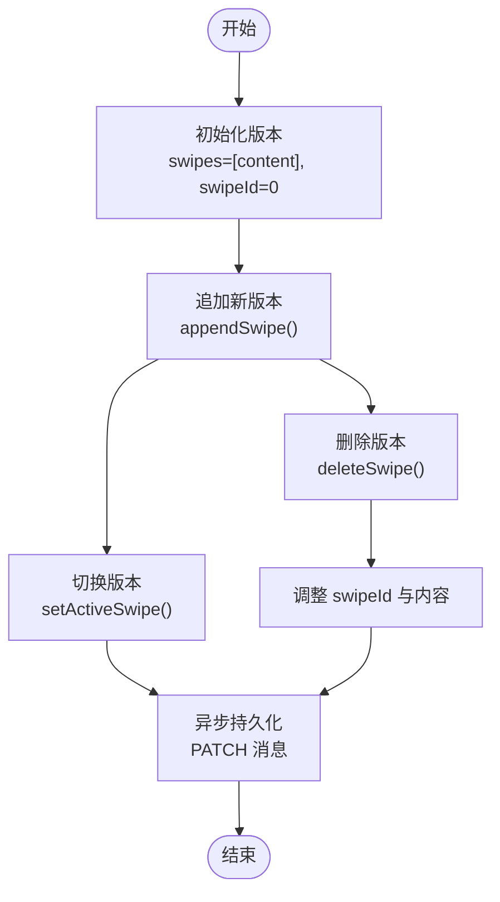
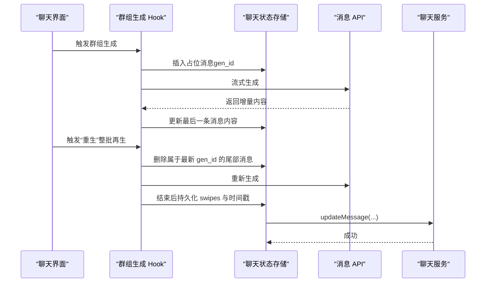
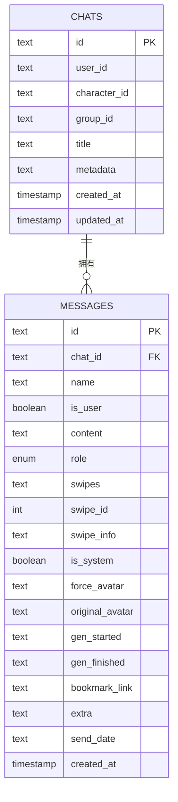
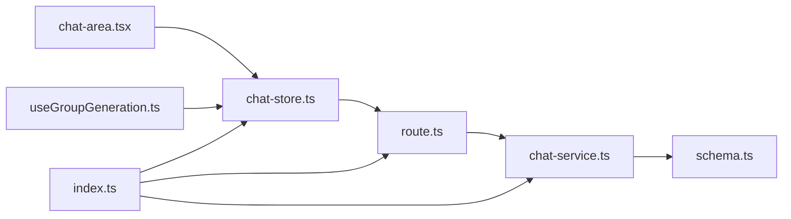

# 消息生命周期管理

<cite>
**本文引用的文件**
- [schema.ts](file://src/lib/db/schema.ts)
- [chat-service.ts](file://src/lib/services/chat-service.ts)
- [chat-store.ts](file://src/stores/chat-store.ts)
- [route.ts](file://src/app/api/chats/[id]/messages/route.ts)
- [index.ts](file://src/types/index.ts)
- [chat-area.tsx](file://src/components/chat/chat-area.tsx)
- [useGroupGeneration.ts](file://src/hooks/useGroupGeneration.ts)
</cite>

## 目录
1. [简介](#简介)
2. [项目结构](#项目结构)
3. [核心组件](#核心组件)
4. [架构总览](#架构总览)
5. [详细组件分析](#详细组件分析)
6. [依赖关系分析](#依赖关系分析)
7. [性能考量](#性能考量)
8. [故障排查指南](#故障排查指南)
9. [结论](#结论)
10. [附录](#附录)

## 简介
本文件面向 SillyTavern Next 的消息生命周期管理，系统性阐述消息从创建到销毁的完整流程，包括消息状态转换、消息类型分类（用户消息、助手消息、系统消息）、消息状态管理、创建流程、状态变更机制、持久化策略与内存管理、消息ID生成策略、时间戳管理与消息版本控制。文档同时提供关键流程的时序图与类图，帮助开发者快速理解并正确使用消息生命周期管理机制。

## 项目结构
围绕消息生命周期的关键模块与文件如下：
- 数据库层：定义消息表结构与约束，确保消息的持久化与一致性
- 服务层：封装消息的增删改查、分支与版本（swipe）管理
- 存储层：前端状态管理，负责本地内存与后端数据库的双向同步
- API 层：暴露消息 CRUD 与分支接口，统一鉴权与错误处理
- 类型定义：明确消息角色、扩展字段、时间戳与版本控制字段
- UI 与 Hook：负责生成过程中的消息占位、流式更新、批量生成与版本持久化

图表来源
- [chat-area.tsx:790-915](file://src/components/chat/chat-area.tsx#L790-L915)
- [chat-store.ts:235-272](file://src/stores/chat-store.ts#L235-L272)
- [route.ts:29-64](file://src/app/api/chats/[id]/messages/route.ts#L29-L64)
- [chat-service.ts:147-251](file://src/lib/services/chat-service.ts#L147-L251)
- [schema.ts:142-168](file://src/lib/db/schema.ts#L142-L168)

章节来源
- [schema.ts:142-168](file://src/lib/db/schema.ts#L142-L168)
- [chat-service.ts:147-251](file://src/lib/services/chat-service.ts#L147-L251)
- [chat-store.ts:235-272](file://src/stores/chat-store.ts#L235-L272)
- [route.ts:29-64](file://src/app/api/chats/[id]/messages/route.ts#L29-L64)
- [index.ts:58-131](file://src/types/index.ts#L58-L131)
- [chat-area.tsx:790-915](file://src/components/chat/chat-area.tsx#L790-L915)
- [useGroupGeneration.ts:359-737](file://src/hooks/useGroupGeneration.ts#L359-L737)

## 核心组件
- 消息表结构与字段
  - 主键：id（UUID）
  - 外键：chatId（关联 chats，级联删除）
  - 角色：role ∈ {"user","assistant","system"}
  - 状态字段：isSystem（隐藏/不可见）、swipes/swipeId/swipeInfo（版本/重生成）
  - 头像字段：forceAvatar/originalAvatar
  - 时间戳：genStarted/genFinished（生成起止时间）、sendDate（发送时间）、createdAt
  - 扩展：extra（MessageExtra，包含模型、TTFT、推理耗时、媒体等）
- 服务层能力
  - 新增消息：生成 UUID、记录 sendDate、初始化 swipe 与 swipeInfo
  - 更新消息：支持内容、swipe、头像、生成时间、扩展字段、书签等
  - 删除消息：基于外键约束级联删除
  - 分支：复制历史至新聊天，保持消息顺序与属性
- 存储层能力
  - 本地内存：addMessage/patchMessage/updateLastMessage/removeMessageLocal
  - 同步持久化：persistMessage/updateMessage/deleteMessage
  - 版本管理：appendSwipe/setActiveSwipe/deleteSwipe
  - 元数据：moveMessage/addEmptyReasoning/createBranch/createBookmark
- API 层
  - GET /api/chats/:id/messages → 返回消息列表
  - POST /api/chats/:id/messages → 新增消息（含 swipes 初始化）

章节来源
- [schema.ts:142-168](file://src/lib/db/schema.ts#L142-L168)
- [chat-service.ts:147-251](file://src/lib/services/chat-service.ts#L147-L251)
- [chat-store.ts:114-150](file://src/stores/chat-store.ts#L114-L150)
- [route.ts:5-27](file://src/app/api/chats/[id]/messages/route.ts#L5-L27)

## 架构总览
消息生命周期由“前端状态 + 后端持久化”双轨驱动，前端负责即时体验与版本管理，后端负责数据一致性与跨设备同步。

图表来源
- [chat-store.ts:235-272](file://src/stores/chat-store.ts#L235-L272)
- [route.ts:29-64](file://src/app/api/chats/[id]/messages/route.ts#L29-L64)
- [chat-service.ts:147-251](file://src/lib/services/chat-service.ts#L147-L251)
- [schema.ts:142-168](file://src/lib/db/schema.ts#L142-L168)

## 详细组件分析

### 消息类型与状态分类
- 角色分类
  - user：用户输入的消息
  - assistant：AI 输出的消息
  - system：系统提示或对 AI 不可见的消息（isSystem=true）
- 状态字段
  - isSystem：隐藏/不可见（不参与提示词渲染）
  - genStarted/genFinished：生成起止时间，用于统计 TTFT 与推理耗时
  - extra：扩展字段，承载模型、TTFT、推理耗时、媒体等运行时信息
  - swipes/swipeId/swipeInfo：版本控制与重生成能力

章节来源
- [index.ts:58-131](file://src/types/index.ts#L58-L131)
- [schema.ts:142-168](file://src/lib/db/schema.ts#L142-L168)

### 消息创建流程
- 前端本地占位
  - UI 在生成开始时插入一条空的 assistant 消息，便于即时反馈
- 服务端持久化
  - 生成 UUID、记录 sendDate、初始化 swipes 与 swipeInfo
  - 写入数据库并更新聊天 updatedAt
- 前端回填真实 ID
  - 若本地使用临时 ID，后端返回真实 ID 后自动回填，避免分支/检查点找不到消息

图表来源
- [chat-area.tsx:790-822](file://src/components/chat/chat-area.tsx#L790-L822)
- [chat-store.ts:235-272](file://src/stores/chat-store.ts#L235-L272)
- [route.ts:29-64](file://src/app/api/chats/[id]/messages/route.ts#L29-L64)
- [chat-service.ts:147-203](file://src/lib/services/chat-service.ts#L147-L203)

章节来源
- [chat-area.tsx:790-822](file://src/components/chat/chat-area.tsx#L790-L822)
- [chat-store.ts:235-272](file://src/stores/chat-store.ts#L235-L272)
- [chat-service.ts:147-203](file://src/lib/services/chat-service.ts#L147-L203)

### 状态变更机制与版本控制
- 版本（Swipe）管理
  - 初始版本：content 与 swipes 包含初始内容，swipeId=0
  - 新版本：appendSwipe 追加内容与 swipeInfo，更新 swipeId 指向当前版本
  - 切换版本：setActiveSwipe 仅更新本地显示与生成时间，随后异步持久化
  - 删除版本：deleteSwipe 保留至少一条版本，必要时调整 swipeId
- 生成状态
  - 生成开始：genStarted 记录开始时间
  - 生成结束：genFinished 记录结束时间，extra 中补充模型、TTFT 等
- 隐藏消息
  - setMessageHidden 切换 isSystem，影响提示词渲染与 UI 显示

图表来源
- [chat-store.ts:390-452](file://src/stores/chat-store.ts#L390-L452)
- [chat-service.ts:205-251](file://src/lib/services/chat-service.ts#L205-L251)

章节来源
- [chat-store.ts:390-452](file://src/stores/chat-store.ts#L390-L452)
- [chat-service.ts:205-251](file://src/lib/services/chat-service.ts#L205-L251)

### 群组消息生成与批量版本管理
- 批次标识：使用 gen_id 标识一次批量生成的多条消息
- 串角截断：检测是否生成了其他角色的对话并进行截断
- 重生（整批再生）：根据最新 gen_id 删除尾部消息并重新生成
- 结束后持久化：将 swipes、swipeInfo、生成时间与 extra 同步到数据库

图表来源
- [useGroupGeneration.ts:359-737](file://src/hooks/useGroupGeneration.ts#L359-L737)
- [chat-area.tsx:871-915](file://src/components/chat/chat-area.tsx#L871-L915)
- [chat-store.ts:335-422](file://src/stores/chat-store.ts#L335-L422)
- [chat-service.ts:205-251](file://src/lib/services/chat-service.ts#L205-L251)

章节来源
- [useGroupGeneration.ts:359-737](file://src/hooks/useGroupGeneration.ts#L359-L737)
- [chat-area.tsx:871-915](file://src/components/chat/chat-area.tsx#L871-L915)
- [chat-store.ts:335-422](file://src/stores/chat-store.ts#L335-L422)

### 消息删除与分支
- 删除消息
  - 本地移除：removeMessageLocal
  - 后端删除：DELETE /api/chats/:id/messages/:mid
- 分支
  - 从某条消息开始复制历史到新聊天，保留消息顺序与属性
  - 书签：创建分支并在原消息上记录 bookmarkLink

章节来源
- [chat-store.ts:353-366](file://src/stores/chat-store.ts#L353-L366)
- [chat-service.ts:253-300](file://src/lib/services/chat-service.ts#L253-L300)

### 数据模型与字段映射

图表来源
- [schema.ts:128-168](file://src/lib/db/schema.ts#L128-L168)

章节来源
- [schema.ts:128-168](file://src/lib/db/schema.ts#L128-L168)

## 依赖关系分析
- 前端依赖
  - chat-store 依赖 route 与 chat-service，实现本地状态与后端的双向同步
  - chat-area 与 useGroupGeneration 依赖 chat-store 与 API，完成生成与版本管理
- 后端依赖
  - route 依赖 chat-service，后者依赖 schema 与数据库
- 类型依赖
  - index.ts 定义 ChatMessage、MessageExtra、SwipeInfo 等，贯穿前后端

图表来源
- [chat-area.tsx:790-915](file://src/components/chat/chat-area.tsx#L790-L915)
- [useGroupGeneration.ts:359-737](file://src/hooks/useGroupGeneration.ts#L359-L737)
- [chat-store.ts:235-272](file://src/stores/chat-store.ts#L235-L272)
- [route.ts:29-64](file://src/app/api/chats/[id]/messages/route.ts#L29-L64)
- [chat-service.ts:147-251](file://src/lib/services/chat-service.ts#L147-L251)
- [schema.ts:142-168](file://src/lib/db/schema.ts#L142-L168)
- [index.ts:58-131](file://src/types/index.ts#L58-L131)

章节来源
- [chat-store.ts:235-272](file://src/stores/chat-store.ts#L235-L272)
- [chat-service.ts:147-251](file://src/lib/services/chat-service.ts#L147-L251)
- [route.ts:29-64](file://src/app/api/chats/[id]/messages/route.ts#L29-L64)
- [index.ts:58-131](file://src/types/index.ts#L58-L131)

## 性能考量
- 本地乐观更新
  - 前端优先更新本地状态，减少等待时间；后端失败时可回滚或提示
- 批量操作
  - moveMessage 使用并发 PATCH，提升交互响应速度
- 流式生成
  - 群组生成采用流式读取，边生成边更新，降低首帧延迟感知
- 版本持久化
  - setActiveSwipe 采用异步持久化，避免阻塞 UI

章节来源
- [chat-store.ts:460-494](file://src/stores/chat-store.ts#L460-L494)
- [useGroupGeneration.ts:359-737](file://src/hooks/useGroupGeneration.ts#L359-L737)

## 故障排查指南
- 401 未授权
  - 确认鉴权中间件生效，请求头携带有效会话
- 404 聊天不存在
  - 确认 chatId 正确且属于当前用户
- 持久化失败
  - 检查网络与后端日志；前端会记录错误并回退本地状态
- 版本丢失
  - 确认 swipes 与 swipeInfo 同步更新；若后端失败，本地仍保留临时状态
- 生成中断
  - 检查 AbortController 信号；错误消息会写入最后一条 assistant 消息

章节来源
- [route.ts:10-26](file://src/app/api/chats/[id]/messages/route.ts#L10-L26)
- [chat-store.ts:268-271](file://src/stores/chat-store.ts#L268-L271)
- [useGroupGeneration.ts:654-665](file://src/hooks/useGroupGeneration.ts#L654-L665)

## 结论
SillyTavern Next 的消息生命周期管理通过“前端状态 + 后端持久化”的协同机制，实现了高效、可观测且可扩展的消息管理。消息类型与状态字段清晰，版本控制完善，生成过程具备良好的可观测性与可恢复性。遵循本文档的最佳实践，可确保消息在不同状态下的行为一致、持久化可靠、内存占用可控。

## 附录
- 消息ID生成策略
  - 使用 UUID（crypto.randomUUID），确保全局唯一
- 时间戳管理
  - sendDate：消息发送时间（ISO 字符串）
  - genStarted/genFinished：生成起止时间（ISO 字符串）
  - createdAt：数据库记录创建时间（时间戳）
- 版本控制要点
  - swipes：版本内容数组
  - swipeId：当前激活版本索引
  - swipeInfo：每个版本对应的元数据（send_date、gen_started、gen_finished、extra）

章节来源
- [chat-service.ts:166-194](file://src/lib/services/chat-service.ts#L166-L194)
- [chat-store.ts:390-422](file://src/stores/chat-store.ts#L390-L422)
- [index.ts:86-131](file://src/types/index.ts#L86-L131)