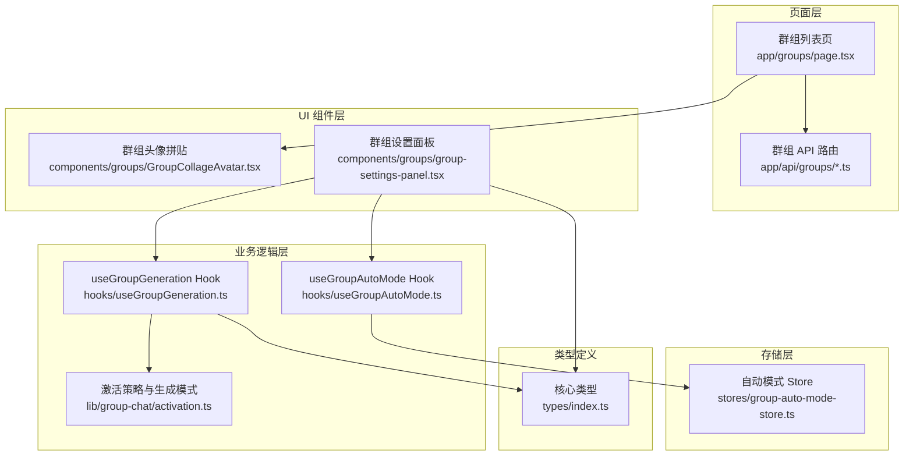
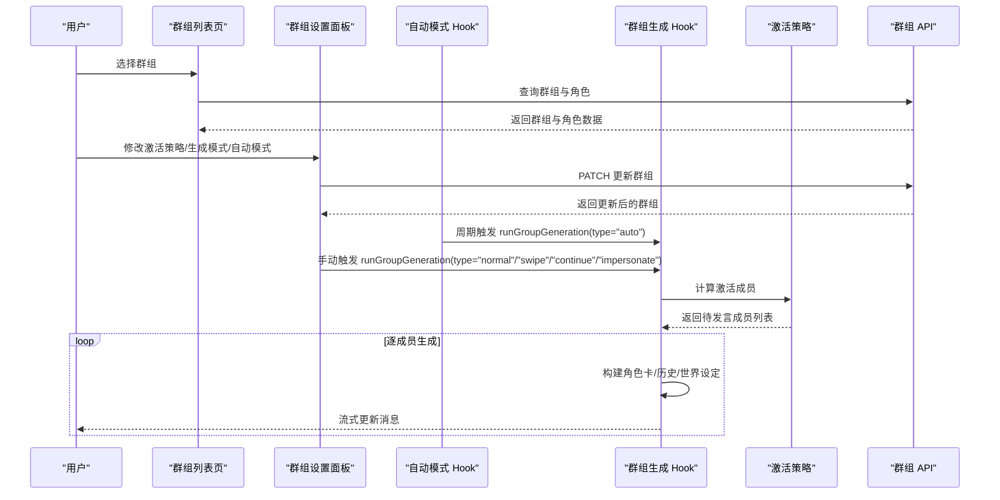
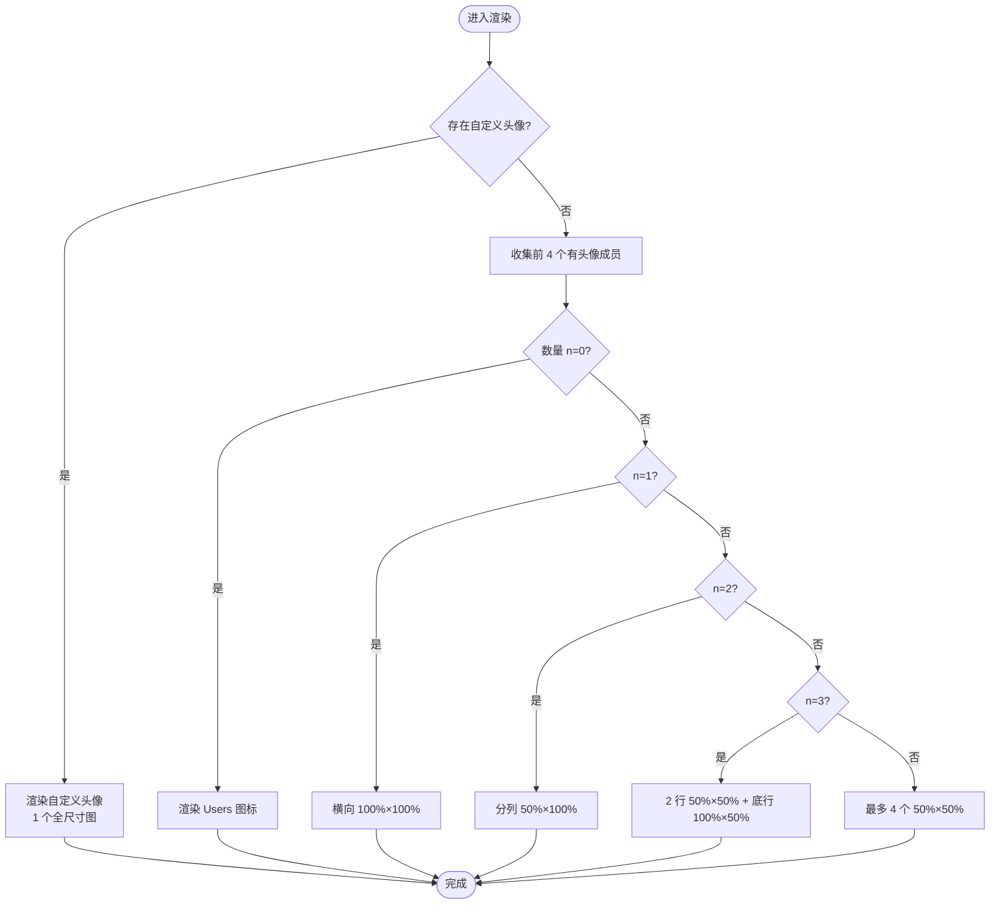
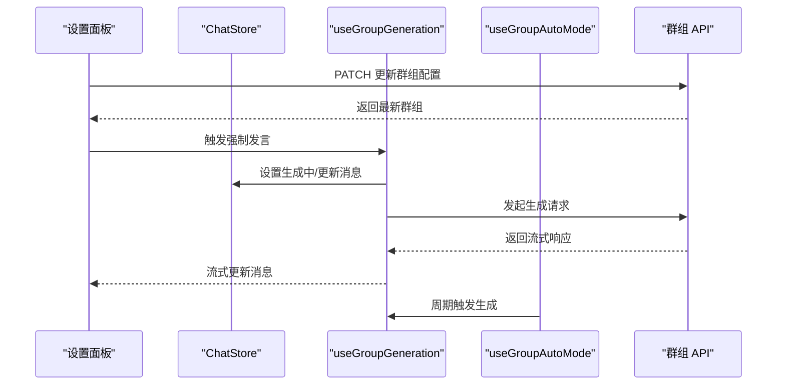
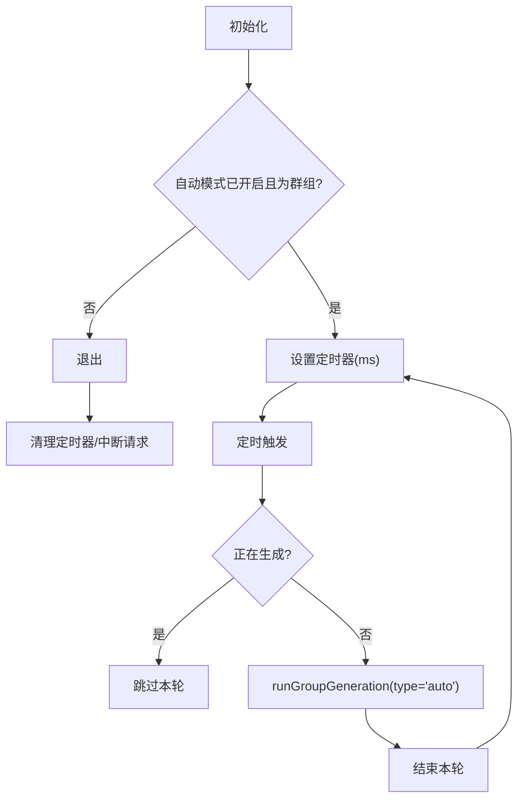
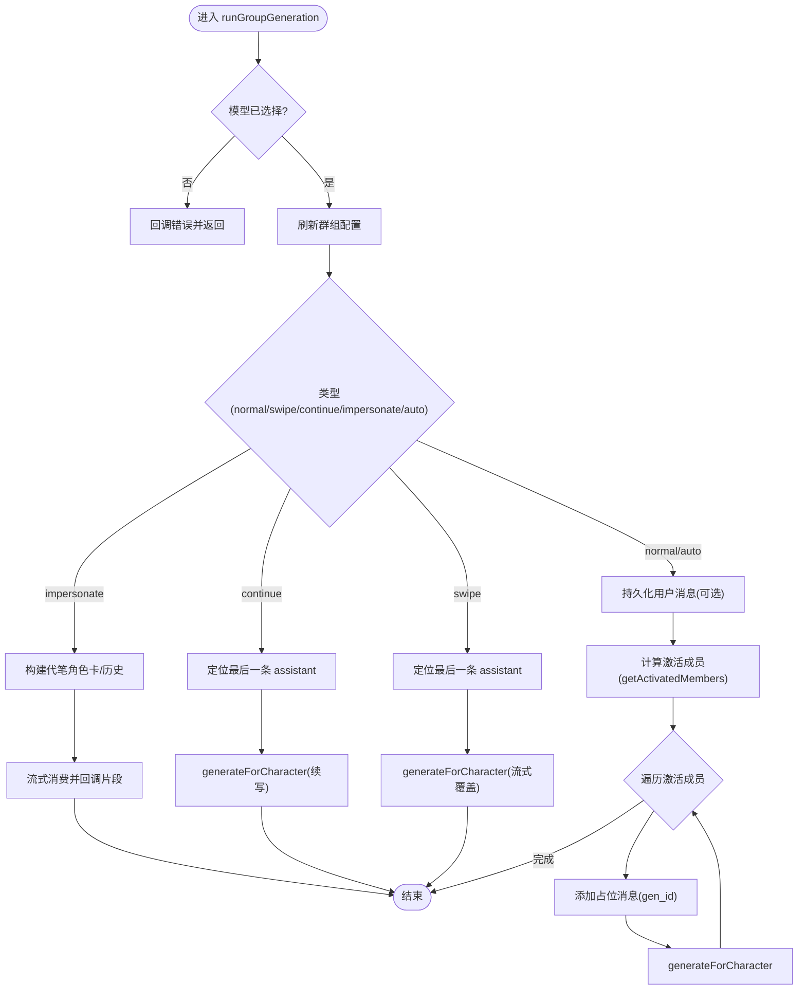
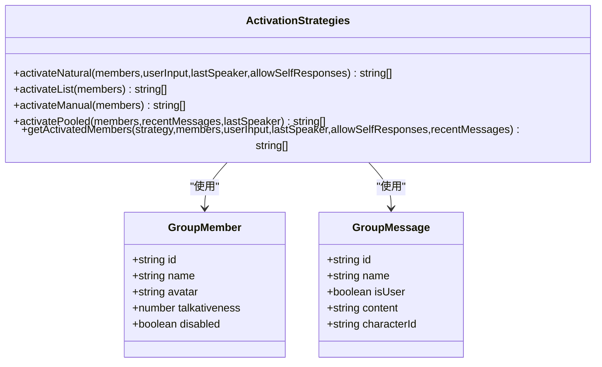
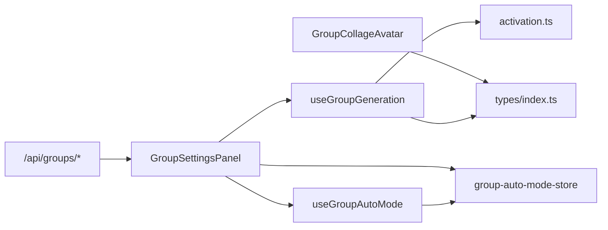

# 群组协作模式

<cite>
**本文引用的文件**
- [src/components/groups/GroupCollageAvatar.tsx](file://src/components/groups/GroupCollageAvatar.tsx)
- [src/components/groups/group-settings-panel.tsx](file://src/components/groups/group-settings-panel.tsx)
- [src/hooks/useGroupAutoMode.ts](file://src/hooks/useGroupAutoMode.ts)
- [src/hooks/useGroupGeneration.ts](file://src/hooks/useGroupGeneration.ts)
- [src/lib/group-chat/activation.ts](file://src/lib/group-chat/activation.ts)
- [src/stores/group-auto-mode-store.ts](file://src/stores/group-auto-mode-store.ts)
- [src/app/groups/page.tsx](file://src/app/groups/page.tsx)
- [src/app/api/groups/route.ts](file://src/app/api/groups/route.ts)
- [src/app/api/groups/[id]/route.ts](file://src/app/api/groups/[id]/route.ts)
- [src/types/index.ts](file://src/types/index.ts)
</cite>

## 目录
1. [简介](#简介)
2. [项目结构](#项目结构)
3. [核心组件](#核心组件)
4. [架构总览](#架构总览)
5. [详细组件分析](#详细组件分析)
6. [依赖关系分析](#依赖关系分析)
7. [性能考量](#性能考量)
8. [故障排查指南](#故障排查指南)
9. [结论](#结论)
10. [附录](#附录)

## 简介
本文件系统性梳理 SillyTavern Next 的群组协作模式，围绕多角色协作的实现机制进行深入解析，涵盖角色头像拼贴显示、角色切换动画与协作状态指示器的设计思路；详细说明不同协作策略（轮流发言、并行生成、智能调度算法）；阐述协作过程中的消息协调、冲突解决与状态同步机制；并提供用户体验设计、交互反馈与视觉效果的实现要点，以及配置项与自定义扩展建议。

## 项目结构
群组协作相关代码主要分布在以下模块：
- UI 组件层：群组头像拼贴组件、群组设置面板
- 业务逻辑层：群组生成 Hook、激活策略与生成模式
- 存储层：自动模式全局开关 Store
- 页面层：群组列表页、API 路由
- 类型定义：消息、角色、群组等核心类型

图表来源
- [src/app/groups/page.tsx:1-261](file://src/app/groups/page.tsx#L1-L261)
- [src/components/groups/GroupCollageAvatar.tsx:1-110](file://src/components/groups/GroupCollageAvatar.tsx#L1-L110)
- [src/components/groups/group-settings-panel.tsx:1-318](file://src/components/groups/group-settings-panel.tsx#L1-L318)
- [src/hooks/useGroupAutoMode.ts:1-62](file://src/hooks/useGroupAutoMode.ts#L1-L62)
- [src/hooks/useGroupGeneration.ts:1-738](file://src/hooks/useGroupGeneration.ts#L1-L738)
- [src/lib/group-chat/activation.ts:1-191](file://src/lib/group-chat/activation.ts#L1-L191)
- [src/stores/group-auto-mode-store.ts:1-18](file://src/stores/group-auto-mode-store.ts#L1-L18)
- [src/app/api/groups/route.ts:1-34](file://src/app/api/groups/route.ts#L1-L34)
- [src/app/api/groups/[id]/route.ts:1-55](file://src/app/api/groups/[id]/route.ts#L1-L55)
- [src/types/index.ts:1-533](file://src/types/index.ts#L1-L533)

章节来源
- [src/app/groups/page.tsx:1-261](file://src/app/groups/page.tsx#L1-L261)
- [src/components/groups/GroupCollageAvatar.tsx:1-110](file://src/components/groups/GroupCollageAvatar.tsx#L1-L110)
- [src/components/groups/group-settings-panel.tsx:1-318](file://src/components/groups/group-settings-panel.tsx#L1-L318)
- [src/hooks/useGroupAutoMode.ts:1-62](file://src/hooks/useGroupAutoMode.ts#L1-L62)
- [src/hooks/useGroupGeneration.ts:1-738](file://src/hooks/useGroupGeneration.ts#L1-L738)
- [src/lib/group-chat/activation.ts:1-191](file://src/lib/group-chat/activation.ts#L1-L191)
- [src/stores/group-auto-mode-store.ts:1-18](file://src/stores/group-auto-mode-store.ts#L1-L18)
- [src/app/api/groups/route.ts:1-34](file://src/app/api/groups/route.ts#L1-L34)
- [src/app/api/groups/[id]/route.ts:1-55](file://src/app/api/groups/[id]/route.ts#L1-L55)
- [src/types/index.ts:1-533](file://src/types/index.ts#L1-L533)

## 核心组件
- 群组头像拼贴组件：根据成员数量与自定义头像，渲染 1/2/3/4 像素拼贴布局，无头像时回退为 Users 图标。
- 群组设置面板：提供激活策略、生成模式、Join 前缀/后缀、自动模式延迟、静音成员、强制发言等配置与操作。
- 自动模式 Hook：基于定时器周期触发群组生成，避免与正在生成的任务冲突，支持 AbortController 中断。
- 群组生成 Hook：封装群组聊天主流程，支持 normal/swipe/continue/impersonate/auto 五种模式；负责消息持久化、历史构建、角色卡合并、截断与冲突处理。
- 激活策略与生成模式：提供自然、列表、手动、池化四种激活策略；提供替换、追加、追加（含禁用）三种生成模式。
- 自动模式 Store：全局开关自动模式，配合面板与 Hook 使用。
- 群组 API：提供群组的增删改查与列表查询。
- 类型定义：统一消息、角色、群组、世界设定等类型，支撑跨层数据一致性。

章节来源
- [src/components/groups/GroupCollageAvatar.tsx:1-110](file://src/components/groups/GroupCollageAvatar.tsx#L1-L110)
- [src/components/groups/group-settings-panel.tsx:1-318](file://src/components/groups/group-settings-panel.tsx#L1-L318)
- [src/hooks/useGroupAutoMode.ts:1-62](file://src/hooks/useGroupAutoMode.ts#L1-L62)
- [src/hooks/useGroupGeneration.ts:1-738](file://src/hooks/useGroupGeneration.ts#L1-L738)
- [src/lib/group-chat/activation.ts:1-191](file://src/lib/group-chat/activation.ts#L1-L191)
- [src/stores/group-auto-mode-store.ts:1-18](file://src/stores/group-auto-mode-store.ts#L1-L18)
- [src/app/api/groups/route.ts:1-34](file://src/app/api/groups/route.ts#L1-L34)
- [src/app/api/groups/[id]/route.ts:1-55](file://src/app/api/groups/[id]/route.ts#L1-L55)
- [src/types/index.ts:1-533](file://src/types/index.ts#L1-L533)

## 架构总览
群组协作的端到端流程如下：
- 用户在群组列表页选择群组进入聊天，或在设置面板中调整群组参数。
- 设置面板通过 Hook 与 Store 控制自动模式与成员配置，同时调用群组生成 Hook 触发生成。
- 群组生成 Hook 根据激活策略计算待发言成员，逐个生成并流式更新消息；必要时进行角色截断与冲突处理。
- 自动模式 Hook 在后台按设定延迟周期触发生成，避免与当前生成任务冲突。
- API 层负责群组数据的持久化与查询。

图表来源
- [src/app/groups/page.tsx:1-261](file://src/app/groups/page.tsx#L1-L261)
- [src/components/groups/group-settings-panel.tsx:1-318](file://src/components/groups/group-settings-panel.tsx#L1-L318)
- [src/hooks/useGroupAutoMode.ts:1-62](file://src/hooks/useGroupAutoMode.ts#L1-L62)
- [src/hooks/useGroupGeneration.ts:1-738](file://src/hooks/useGroupGeneration.ts#L1-L738)
- [src/lib/group-chat/activation.ts:1-191](file://src/lib/group-chat/activation.ts#L1-L191)
- [src/app/api/groups/[id]/route.ts:1-55](file://src/app/api/groups/[id]/route.ts#L1-L55)

## 详细组件分析

### 群组头像拼贴组件（GroupCollageAvatar）
- 功能要点
  - 自定义头像优先级最高；否则取前 4 个有头像的成员拼贴。
  - 支持 1/2/3/≥4 种布局，无头像时显示 Users 图标。
  - 尺寸与样式通过 props 与工具类控制，标题用于可访问性。
- 设计与可用性
  - 拼贴布局直观体现成员数量与身份，便于快速识别群组构成。
  - 无头像回退图标降低视觉噪音，提升一致性体验。

图表来源
- [src/components/groups/GroupCollageAvatar.tsx:19-110](file://src/components/groups/GroupCollageAvatar.tsx#L19-L110)

章节来源
- [src/components/groups/GroupCollageAvatar.tsx:1-110](file://src/components/groups/GroupCollageAvatar.tsx#L1-L110)

### 群组设置面板（GroupSettingsPanel）
- 功能要点
  - 加载当前群组与全部角色，支持折叠/展开抽屉式面板。
  - 控制区：名称、头像上传/恢复、激活策略、生成模式、Join 前缀/后缀、允许自言自语、隐藏静音、自动模式开关与延迟。
  - 成员区：搜索、排序、启用/禁用、强制发言、移除成员。
  - 添加区：搜索候选角色并加入群组。
  - 自动模式工作线程由 Hook 管理，面板内部自治开关。
- 交互反馈
  - 操作即时更新内存状态并异步提交至 API，保证面板与后端配置同步。
  - 强制发言按钮在生成中禁用，避免并发冲突。

图表来源
- [src/components/groups/group-settings-panel.tsx:1-318](file://src/components/groups/group-settings-panel.tsx#L1-L318)
- [src/hooks/useGroupGeneration.ts:1-738](file://src/hooks/useGroupGeneration.ts#L1-L738)
- [src/hooks/useGroupAutoMode.ts:1-62](file://src/hooks/useGroupAutoMode.ts#L1-L62)
- [src/app/api/groups/[id]/route.ts:1-55](file://src/app/api/groups/[id]/route.ts#L1-L55)

章节来源
- [src/components/groups/group-settings-panel.tsx:1-318](file://src/components/groups/group-settings-panel.tsx#L1-L318)

### 自动模式 Hook（useGroupAutoMode）
- 行为
  - 仅在开启且处于群组聊天时启动定时器，按延迟秒数轮询。
  - 每轮先检查是否正在生成，避免并发冲突；使用 AbortController 支持即时中断。
  - 触发群组生成时设置“生成中”状态，完成后清理。
- 可靠性
  - 清理阶段会取消定时器与未完成的请求，防止内存泄漏与僵尸任务。

图表来源
- [src/hooks/useGroupAutoMode.ts:1-62](file://src/hooks/useGroupAutoMode.ts#L1-L62)
- [src/stores/group-auto-mode-store.ts:1-18](file://src/stores/group-auto-mode-store.ts#L1-L18)
- [src/hooks/useGroupGeneration.ts:1-738](file://src/hooks/useGroupGeneration.ts#L1-L738)

章节来源
- [src/hooks/useGroupAutoMode.ts:1-62](file://src/hooks/useGroupAutoMode.ts#L1-L62)
- [src/stores/group-auto-mode-store.ts:1-18](file://src/stores/group-auto-mode-store.ts#L1-L18)

### 群组生成 Hook（useGroupGeneration）
- 主流程
  - 加载群组与成员，构建世界设定、格式化模板、角色卡合并（APPEND 模式）、历史构建（区分用户/自己/他人）。
  - 根据激活策略计算待发言成员；逐个生成并流式更新消息；支持 continue/swipe/impersonate 等模式。
  - 错误处理：捕获中止与异常，更新消息状态并回调错误。
- 消息协调与冲突解决
  - 截断逻辑：检测生成内容中是否出现其他角色的开头，若命中则截断到最近的该角色标记处，避免角色串台。
  - 自言自语控制：通过“允许自言自语”与上次说话者 ID，避免同一角色连续发言。
  - 世界设定合并：聚合全局与聊天级世界书，以及成员角色级世界书，避免重复与冲突。
- 状态同步
  - 生成前刷新群组配置，确保面板修改即时生效。
  - 生成批次使用 gen_id 标识，支持“重生”删除该批次并重跑。

图表来源
- [src/hooks/useGroupGeneration.ts:1-738](file://src/hooks/useGroupGeneration.ts#L1-L738)
- [src/lib/group-chat/activation.ts:1-191](file://src/lib/group-chat/activation.ts#L1-L191)

章节来源
- [src/hooks/useGroupGeneration.ts:1-738](file://src/hooks/useGroupGeneration.ts#L1-L738)

### 激活策略与生成模式
- 激活策略
  - 自然：扫描输入是否提及角色名，按健谈度随机；无人激活则从高健谈者中随机。
  - 列表：按成员顺序全部轮流。
  - 手动：不自动激活，需用户强制指定角色。
  - 池化：避免重复，从未发言者中随机；若全都说过则新轮次开始，排除上一个说话者。
- 生成模式
  - 替换：逐个角色轮流生成，保持独立角色卡。
  - 追加：合并所有成员的角色卡字段（描述/个性/场景/示例），支持前缀/后缀与占位符替换。
  - 追加（含禁用）：与追加相同，但排除被禁用成员。

图表来源
- [src/lib/group-chat/activation.ts:1-191](file://src/lib/group-chat/activation.ts#L1-L191)
- [src/types/index.ts:272-286](file://src/types/index.ts#L272-L286)

章节来源
- [src/lib/group-chat/activation.ts:1-191](file://src/lib/group-chat/activation.ts#L1-L191)
- [src/types/index.ts:272-286](file://src/types/index.ts#L272-L286)

### 自动模式 Store
- 提供全局开关与切换方法，与自动模式 Hook 协作，确保面板与后台一致。

章节来源
- [src/stores/group-auto-mode-store.ts:1-18](file://src/stores/group-auto-mode-store.ts#L1-L18)

### 群组 API
- 列表与创建：GET /api/groups、POST /api/groups
- 更新与删除：GET /api/groups/[id]、PATCH /api/groups/[id]、DELETE /api/groups/[id]
- 权限：均需认证，使用 NextAuth 鉴权。

章节来源
- [src/app/api/groups/route.ts:1-34](file://src/app/api/groups/route.ts#L1-L34)
- [src/app/api/groups/[id]/route.ts:1-55](file://src/app/api/groups/[id]/route.ts#L1-L55)

## 依赖关系分析
- 组件耦合
  - GroupCollageAvatar 与 Avatar 映射解耦，仅依赖成员列表与映射。
  - GroupSettingsPanel 依赖 ChatStore、useGroupGeneration、useGroupAutoMode 与 Store，形成面板-逻辑-状态闭环。
- 数据流
  - 面板修改 → API 更新 → Hook 读取最新配置 → 生成流程使用新配置。
- 外部依赖
  - NextAuth 认证、流式生成引擎、世界设定服务等。

图表来源
- [src/components/groups/GroupCollageAvatar.tsx:1-110](file://src/components/groups/GroupCollageAvatar.tsx#L1-L110)
- [src/components/groups/group-settings-panel.tsx:1-318](file://src/components/groups/group-settings-panel.tsx#L1-L318)
- [src/hooks/useGroupGeneration.ts:1-738](file://src/hooks/useGroupGeneration.ts#L1-L738)
- [src/hooks/useGroupAutoMode.ts:1-62](file://src/hooks/useGroupAutoMode.ts#L1-L62)
- [src/stores/group-auto-mode-store.ts:1-18](file://src/stores/group-auto-mode-store.ts#L1-L18)
- [src/lib/group-chat/activation.ts:1-191](file://src/lib/group-chat/activation.ts#L1-L191)
- [src/types/index.ts:1-533](file://src/types/index.ts#L1-L533)
- [src/app/api/groups/[id]/route.ts:1-55](file://src/app/api/groups/[id]/route.ts#L1-L55)

章节来源
- [src/components/groups/GroupCollageAvatar.tsx:1-110](file://src/components/groups/GroupCollageAvatar.tsx#L1-L110)
- [src/components/groups/group-settings-panel.tsx:1-318](file://src/components/groups/group-settings-panel.tsx#L1-L318)
- [src/hooks/useGroupGeneration.ts:1-738](file://src/hooks/useGroupGeneration.ts#L1-L738)
- [src/hooks/useGroupAutoMode.ts:1-62](file://src/hooks/useGroupAutoMode.ts#L1-L62)
- [src/stores/group-auto-mode-store.ts:1-18](file://src/stores/group-auto-mode-store.ts#L1-L18)
- [src/lib/group-chat/activation.ts:1-191](file://src/lib/group-chat/activation.ts#L1-L191)
- [src/types/index.ts:1-533](file://src/types/index.ts#L1-L533)
- [src/app/api/groups/[id]/route.ts:1-55](file://src/app/api/groups/[id]/route.ts#L1-L55)

## 性能考量
- 并发控制
  - 自动模式与手动触发均检查“正在生成”状态，避免并发生成导致资源争用与状态混乱。
- 流式更新
  - 采用流式读取与增量更新，减少一次性渲染压力，提升交互流畅度。
- 截断与冲突处理
  - 通过正则检测与截断，避免角色串台带来的无效渲染与重试成本。
- 拼贴渲染
  - 拼贴布局按需裁剪至最多 4 个头像，降低 DOM 数量与图片加载压力。

## 故障排查指南
- 无法生成
  - 检查是否选择了模型；若未选择，生成会直接返回错误提示。
  - 确认网络与 API 可达性，查看浏览器控制台与服务端日志。
- 自动模式无效
  - 确认自动模式开关已开启且处于群组聊天；检查延迟设置是否合理。
  - 若面板修改后未生效，确认 Hook 是否重新拉取了最新群组配置。
- 角色串台/混入
  - 检查激活策略与“允许自言自语”设置；确保历史构建正确区分用户/自己/他人。
  - 如使用 APPEND 模式，确认前缀/后缀与占位符替换是否符合预期。
- 头像显示异常
  - 检查自定义头像 URL 是否有效；无头像时会回退为 Users 图标。

章节来源
- [src/hooks/useGroupGeneration.ts:450-691](file://src/hooks/useGroupGeneration.ts#L450-L691)
- [src/hooks/useGroupAutoMode.ts:17-61](file://src/hooks/useGroupAutoMode.ts#L17-L61)
- [src/components/groups/GroupCollageAvatar.tsx:33-108](file://src/components/groups/GroupCollageAvatar.tsx#L33-L108)

## 结论
SillyTavern Next 的群组协作模式以清晰的职责分离与强类型约束为基础，结合灵活的激活策略与生成模式，实现了多角色协同的高效与可控。通过流式生成、冲突截断与状态同步机制，既保障了生成质量，又提升了用户体验。面板化的配置与自动模式进一步降低了使用门槛，适合从轻度到重度协作场景。

## 附录
- 配置项速览
  - 激活策略：自然/列表/手动/池化
  - 生成模式：替换/追加/追加（含禁用）
  - Join 前缀/后缀：支持占位符与字段名替换
  - 自动模式：开关与延迟
  - 静音成员：隐藏静音成员的头像与参与
  - 允许自言自语：控制同一角色连续发言
- 扩展建议
  - 新增激活策略：在激活策略模块新增策略函数，并在面板中暴露选项。
  - 新增生成模式：在生成 Hook 中扩展角色卡合并逻辑与历史构建分支。
  - 视觉增强：在消息气泡中增加协作状态指示器（如“生成中/截断/错误”徽标）。
  - 动画优化：为角色切换与消息插入添加过渡动画，提升节奏感。
  - 无障碍：为头像拼贴与状态指示器提供更丰富的可访问性标签。