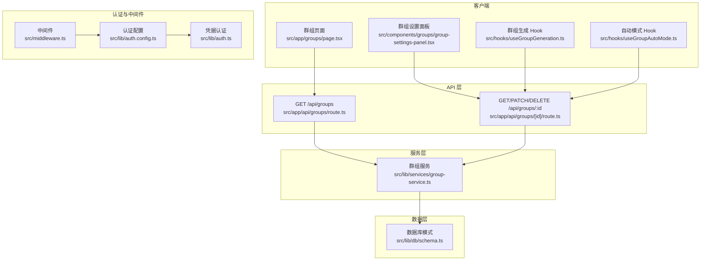
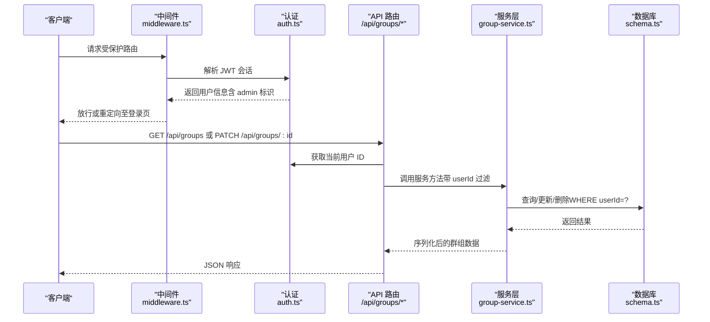
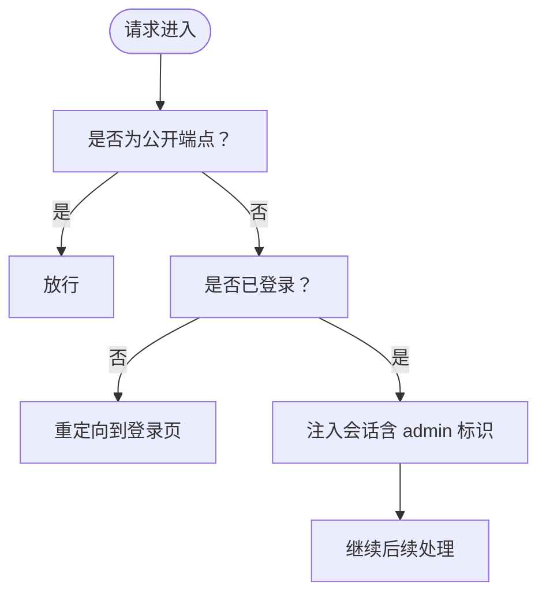
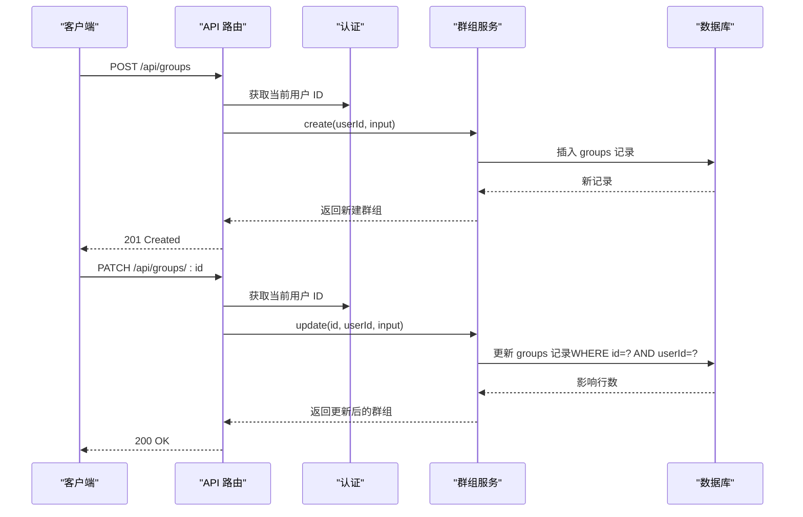
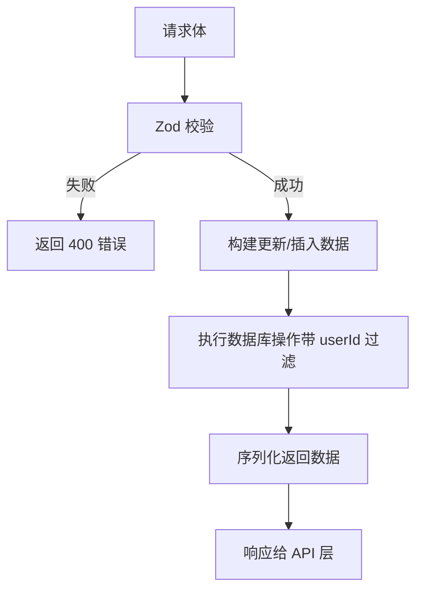
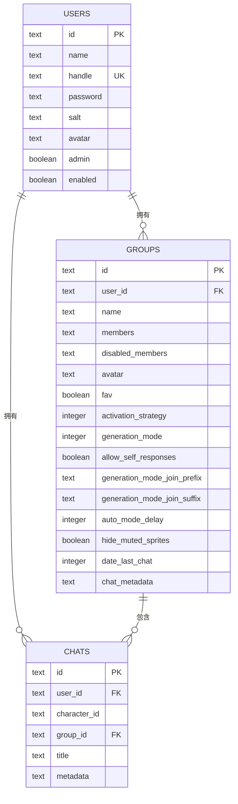
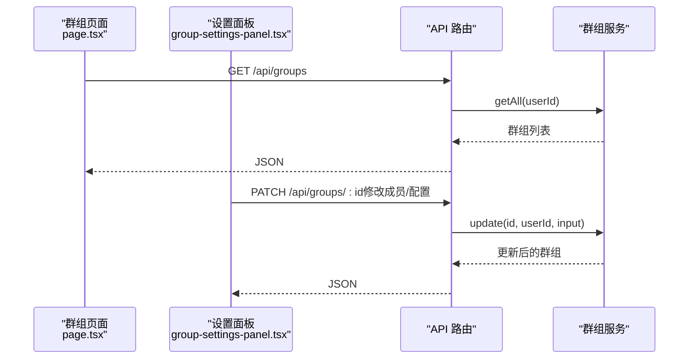
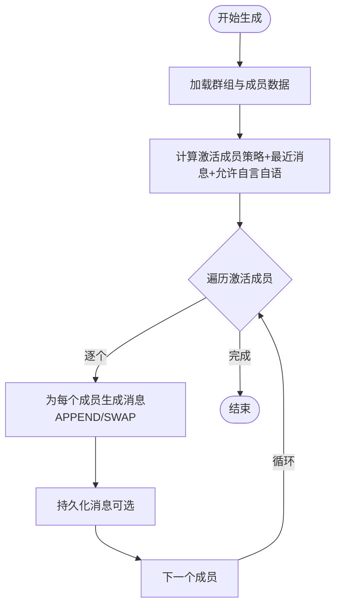
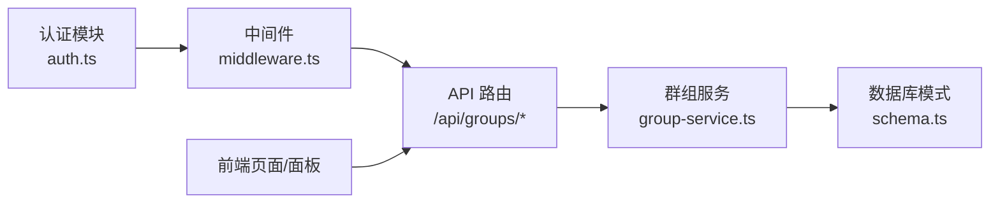

# 群组权限控制

<cite>
**本文引用的文件**
- [src/app/api/groups/[id]/route.ts](file://src/app/api/groups/[id]/route.ts)
- [src/app/api/groups/route.ts](file://src/app/api/groups/route.ts)
- [src/lib/services/group-service.ts](file://src/lib/services/group-service.ts)
- [src/lib/db/schema.ts](file://src/lib/db/schema.ts)
- [src/lib/auth.ts](file://src/lib/auth.ts)
- [src/lib/auth.config.ts](file://src/lib/auth.config.ts)
- [src/middleware.ts](file://src/middleware.ts)
- [src/app/groups/page.tsx](file://src/app/groups/page.tsx)
- [src/components/groups/group-settings-panel.tsx](file://src/components/groups/group-settings-panel.tsx)
- [src/hooks/useGroupGeneration.ts](file://src/hooks/useGroupGeneration.ts)
- [src/hooks/useGroupAutoMode.ts](file://src/hooks/useGroupAutoMode.ts)
- [src/lib/group-chat/activation.ts](file://src/lib/group-chat/activation.ts)
</cite>

## 目录
1. [简介](#简介)
2. [项目结构](#项目结构)
3. [核心组件](#核心组件)
4. [架构总览](#架构总览)
5. [详细组件分析](#详细组件分析)
6. [依赖关系分析](#依赖关系分析)
7. [性能考量](#性能考量)
8. [故障排查指南](#故障排查指南)
9. [结论](#结论)
10. [附录](#附录)

## 简介
本文件针对 SillyTavern Next 的群组权限控制系统进行系统化技术文档整理。当前代码库实现了基于用户维度的群组所有权隔离与基础的成员管理能力，围绕“群组”资源提供了创建、查询、更新与删除的 API，并在前端页面与设置面板中提供成员增删、禁用/启用、排序以及群组配置的交互。

需要特别说明的是：当前实现并未引入“角色分级（如管理员/编辑者/普通成员）”的细粒度权限模型，而是采用“用户-群组”一对一归属的简单授权策略。这意味着：
- 所有对群组的操作（创建、读取、更新、删除）均以当前登录用户的 ID 作为唯一授权依据；
- 群组内部的成员管理（增删、禁用、排序）由前端 UI 控制，但未在后端实施严格的“角色权限校验”；
- 管理员/编辑者/普通成员的权限分层、访问控制列表（ACL）、动态权限检查、权限继承、临时权限授予与审计日志等功能尚未在代码中体现。

本文件将基于现有代码，梳理当前的授权与访问控制现状，并给出面向未来扩展的建议与最佳实践。

## 项目结构
与群组权限控制直接相关的目录与文件如下：
- API 层：/src/app/api/groups/*
- 服务层：/src/lib/services/group-service.ts
- 数据模型：/src/lib/db/schema.ts（groups、users、chats）
- 认证与会话：/src/lib/auth.ts、/src/lib/auth.config.ts、/src/middleware.ts
- 前端页面与设置面板：/src/app/groups/page.tsx、/src/components/groups/group-settings-panel.tsx
- 群组生成与自动模式：/src/hooks/useGroupGeneration.ts、/src/hooks/useGroupAutoMode.ts、/src/lib/group-chat/activation.ts

图表来源
- [src/app/groups/page.tsx:1-261](file://src/app/groups/page.tsx#L1-L261)
- [src/components/groups/group-settings-panel.tsx:1-318](file://src/components/groups/group-settings-panel.tsx#L1-L318)
- [src/middleware.ts:1-35](file://src/middleware.ts#L1-L35)
- [src/lib/auth.config.ts:1-52](file://src/lib/auth.config.ts#L1-L52)
- [src/lib/auth.ts:1-59](file://src/lib/auth.ts#L1-L59)
- [src/app/api/groups/route.ts:1-33](file://src/app/api/groups/route.ts#L1-L33)
- [src/app/api/groups/[id]/route.ts:1-54](file://src/app/api/groups/[id]/route.ts#L1-L54)
- [src/lib/services/group-service.ts:1-174](file://src/lib/services/group-service.ts#L1-L174)
- [src/lib/db/schema.ts:100-126](file://src/lib/db/schema.ts#L100-L126)

章节来源
- [src/app/groups/page.tsx:1-261](file://src/app/groups/page.tsx#L1-L261)
- [src/components/groups/group-settings-panel.tsx:1-318](file://src/components/groups/group-settings-panel.tsx#L1-L318)
- [src/middleware.ts:1-35](file://src/middleware.ts#L1-L35)
- [src/lib/auth.config.ts:1-52](file://src/lib/auth.config.ts#L1-L52)
- [src/lib/auth.ts:1-59](file://src/lib/auth.ts#L1-L59)
- [src/app/api/groups/route.ts:1-33](file://src/app/api/groups/route.ts#L1-L33)
- [src/app/api/groups/[id]/route.ts:1-54](file://src/app/api/groups/[id]/route.ts#L1-L54)
- [src/lib/services/group-service.ts:1-174](file://src/lib/services/group-service.ts#L1-L174)
- [src/lib/db/schema.ts:100-126](file://src/lib/db/schema.ts#L100-L126)

## 核心组件
- 认证与会话
  - NextAuth 配置与回调：负责 JWT 令牌发放、会话注入用户信息（含 admin 标识）。
  - 中间件：统一拦截路由，处理登录态与公开端点放行。
- API 层
  - 群组列表与创建：GET /api/groups、POST /api/groups。
  - 群组详情与更新/删除：GET /api/groups/:id、PATCH /api/groups/:id、DELETE /api/groups/:id。
- 服务层
  - 群组服务：封装数据库访问、输入校验（Zod）、序列化与更新/删除逻辑。
- 数据层
  - 群组表：包含成员列表、禁用成员列表、生成模式、激活策略等字段。
- 前端
  - 群组页面：展示群组列表、创建与删除。
  - 设置面板：成员管理、配置修改、删除群组。
  - 群组生成与自动模式：基于群组配置与成员状态执行生成流程。

章节来源
- [src/lib/auth.ts:1-59](file://src/lib/auth.ts#L1-L59)
- [src/lib/auth.config.ts:1-52](file://src/lib/auth.config.ts#L1-L52)
- [src/middleware.ts:1-35](file://src/middleware.ts#L1-L35)
- [src/app/api/groups/route.ts:1-33](file://src/app/api/groups/route.ts#L1-L33)
- [src/app/api/groups/[id]/route.ts:1-54](file://src/app/api/groups/[id]/route.ts#L1-L54)
- [src/lib/services/group-service.ts:1-174](file://src/lib/services/group-service.ts#L1-L174)
- [src/lib/db/schema.ts:100-126](file://src/lib/db/schema.ts#L100-L126)
- [src/app/groups/page.tsx:1-261](file://src/app/groups/page.tsx#L1-L261)
- [src/components/groups/group-settings-panel.tsx:1-318](file://src/components/groups/group-settings-panel.tsx#L1-L318)
- [src/hooks/useGroupGeneration.ts:1-738](file://src/hooks/useGroupGeneration.ts#L1-L738)
- [src/hooks/useGroupAutoMode.ts:1-62](file://src/hooks/useGroupAutoMode.ts#L1-L62)
- [src/lib/group-chat/activation.ts:1-53](file://src/lib/group-chat/activation.ts#L1-L53)

## 架构总览
当前权限控制遵循“用户-群组”所有权模型：
- 登录态校验：所有受保护路由均需有效 JWT 会话。
- 资源归属：群组记录包含 userId 字段，API 在读取/更新/删除时以 userId 作为过滤条件。
- 前端交互：设置面板允许修改成员列表、禁用成员、排序与群组配置，但未在后端实施角色权限校验。

图表来源
- [src/middleware.ts:1-35](file://src/middleware.ts#L1-L35)
- [src/lib/auth.ts:1-59](file://src/lib/auth.ts#L1-L59)
- [src/app/api/groups/route.ts:1-33](file://src/app/api/groups/route.ts#L1-L33)
- [src/app/api/groups/[id]/route.ts:1-54](file://src/app/api/groups/[id]/route.ts#L1-L54)
- [src/lib/services/group-service.ts:90-174](file://src/lib/services/group-service.ts#L90-L174)
- [src/lib/db/schema.ts:100-126](file://src/lib/db/schema.ts#L100-L126)

## 详细组件分析

### 认证与会话（NextAuth）
- 会话策略：JWT，最大有效期可配置。
- 回调：将用户信息（含 admin 标识）写入 token 并透传到 session。
- 中间件：统一拦截，放行登录页、认证 API 与公开端点（如健康检查），其余未登录请求重定向至登录页。

图表来源
- [src/lib/auth.config.ts:38-46](file://src/lib/auth.config.ts#L38-L46)
- [src/middleware.ts:8-30](file://src/middleware.ts#L8-L30)
- [src/lib/auth.ts:37-56](file://src/lib/auth.ts#L37-L56)

章节来源
- [src/lib/auth.config.ts:1-52](file://src/lib/auth.config.ts#L1-L52)
- [src/middleware.ts:1-35](file://src/middleware.ts#L1-L35)
- [src/lib/auth.ts:1-59](file://src/lib/auth.ts#L1-L59)

### 群组 API（创建/读取/更新/删除）
- GET /api/groups：返回当前用户的所有群组。
- POST /api/groups：创建群组，要求至少 1 个成员。
- GET /api/groups/:id：返回指定群组，若不存在返回 404。
- PATCH /api/groups/:id：更新群组配置（名称、成员、禁用成员、头像、收藏、激活策略、生成模式、自定义模板、自动模式延迟、隐藏静音成员等）。
- DELETE /api/groups/:id：删除群组及其关联聊天。

图表来源
- [src/app/api/groups/route.ts:1-33](file://src/app/api/groups/route.ts#L1-L33)
- [src/app/api/groups/[id]/route.ts:1-54](file://src/app/api/groups/[id]/route.ts#L1-L54)
- [src/lib/services/group-service.ts:109-159](file://src/lib/services/group-service.ts#L109-L159)
- [src/lib/db/schema.ts:100-126](file://src/lib/db/schema.ts#L100-L126)

章节来源
- [src/app/api/groups/route.ts:1-33](file://src/app/api/groups/route.ts#L1-L33)
- [src/app/api/groups/[id]/route.ts:1-54](file://src/app/api/groups/[id]/route.ts#L1-L54)
- [src/lib/services/group-service.ts:1-174](file://src/lib/services/group-service.ts#L1-L174)
- [src/lib/db/schema.ts:100-126](file://src/lib/db/schema.ts#L100-L126)

### 群组服务层（数据访问与校验）
- 输入校验：使用 Zod 对创建与更新请求体进行严格校验。
- 序列化：将 JSON 字符串字段解析为数组/对象，统一对外暴露。
- 权限边界：所有查询/更新/删除均以 userId 作为 WHERE 条件，确保跨用户隔离。
- 删除行为：先删除关联聊天，再删除群组。

图表来源
- [src/lib/services/group-service.ts:11-38](file://src/lib/services/group-service.ts#L11-L38)
- [src/lib/services/group-service.ts:66-85](file://src/lib/services/group-service.ts#L66-L85)
- [src/lib/services/group-service.ts:109-172](file://src/lib/services/group-service.ts#L109-L172)
- [src/lib/db/schema.ts:100-126](file://src/lib/db/schema.ts#L100-L126)

章节来源
- [src/lib/services/group-service.ts:1-174](file://src/lib/services/group-service.ts#L1-L174)
- [src/lib/db/schema.ts:100-126](file://src/lib/db/schema.ts#L100-L126)

### 数据模型（群组表）
- 关键字段：userId（外键）、members（JSON 数组，角色 ID 列表）、disabledMembers（JSON 数组，禁用成员 ID 列表）、generationMode、activationStrategy、allowSelfResponses、generationModeJoinPrefix/Suffix、autoModeDelay、hideMutedSprites、dateLastChat 等。
- 关联关系：群组与用户（一对多），群组与聊天（一对多，聊天记录可为空）。

图表来源
- [src/lib/db/schema.ts:6-16](file://src/lib/db/schema.ts#L6-L16)
- [src/lib/db/schema.ts:100-126](file://src/lib/db/schema.ts#L100-L126)
- [src/lib/db/schema.ts:128-140](file://src/lib/db/schema.ts#L128-L140)

章节来源
- [src/lib/db/schema.ts:100-126](file://src/lib/db/schema.ts#L100-L126)

### 前端页面与设置面板
- 群组页面：列出当前用户的所有群组，支持创建与删除。
- 设置面板：支持成员管理（增删、禁用/启用、排序）、群组配置修改、头像上传与恢复、删除群组等。
- 重要注意：成员管理与配置修改均为前端发起的 PATCH 请求，未在后端实施角色权限校验。

图表来源
- [src/app/groups/page.tsx:36-260](file://src/app/groups/page.tsx#L36-L260)
- [src/components/groups/group-settings-panel.tsx:32-103](file://src/components/groups/group-settings-panel.tsx#L32-L103)
- [src/app/api/groups/[id]/route.ts:18-38](file://src/app/api/groups/[id]/route.ts#L18-L38)
- [src/lib/services/group-service.ts:133-159](file://src/lib/services/group-service.ts#L133-L159)

章节来源
- [src/app/groups/page.tsx:1-261](file://src/app/groups/page.tsx#L1-L261)
- [src/components/groups/group-settings-panel.tsx:1-318](file://src/components/groups/group-settings-panel.tsx#L1-L318)
- [src/app/api/groups/[id]/route.ts:1-54](file://src/app/api/groups/[id]/route.ts#L1-L54)
- [src/lib/services/group-service.ts:90-174](file://src/lib/services/group-service.ts#L90-L174)

### 群组生成与自动模式
- 生成 Hook：根据激活策略与成员状态计算“激活成员”，支持正常、续写、重生、代笔与自动模式。
- 自动模式 Hook：周期性触发生成，避免与正在生成的任务冲突。
- 成员状态：disabledMembers 字段影响激活策略与生成流程。

图表来源
- [src/hooks/useGroupGeneration.ts:450-691](file://src/hooks/useGroupGeneration.ts#L450-L691)
- [src/hooks/useGroupAutoMode.ts:17-61](file://src/hooks/useGroupAutoMode.ts#L17-L61)
- [src/lib/group-chat/activation.ts:10-30](file://src/lib/group-chat/activation.ts#L10-L30)

章节来源
- [src/hooks/useGroupGeneration.ts:1-738](file://src/hooks/useGroupGeneration.ts#L1-L738)
- [src/hooks/useGroupAutoMode.ts:1-62](file://src/hooks/useGroupAutoMode.ts#L1-L62)
- [src/lib/group-chat/activation.ts:1-53](file://src/lib/group-chat/activation.ts#L1-L53)

## 依赖关系分析
- API 层依赖认证模块获取当前用户 ID，并将 userId 作为资源访问的唯一授权依据。
- 服务层依赖数据库模式，所有 CRUD 操作均带有 userId 过滤条件，保证资源隔离。
- 前端设置面板与 API 层直接通信，未引入后端角色权限校验，存在潜在风险。

图表来源
- [src/lib/auth.ts:1-59](file://src/lib/auth.ts#L1-L59)
- [src/middleware.ts:1-35](file://src/middleware.ts#L1-L35)
- [src/app/api/groups/route.ts:1-33](file://src/app/api/groups/route.ts#L1-L33)
- [src/app/api/groups/[id]/route.ts:1-54](file://src/app/api/groups/[id]/route.ts#L1-L54)
- [src/lib/services/group-service.ts:90-174](file://src/lib/services/group-service.ts#L90-L174)
- [src/lib/db/schema.ts:100-126](file://src/lib/db/schema.ts#L100-L126)

章节来源
- [src/lib/auth.ts:1-59](file://src/lib/auth.ts#L1-L59)
- [src/middleware.ts:1-35](file://src/middleware.ts#L1-L35)
- [src/app/api/groups/route.ts:1-33](file://src/app/api/groups/route.ts#L1-L33)
- [src/app/api/groups/[id]/route.ts:1-54](file://src/app/api/groups/[id]/route.ts#L1-L54)
- [src/lib/services/group-service.ts:1-174](file://src/lib/services/group-service.ts#L1-L174)
- [src/lib/db/schema.ts:100-126](file://src/lib/db/schema.ts#L100-L126)

## 性能考量
- 数据库查询：API 层与服务层均使用精确 WHERE 条件（id 与 userId），避免全表扫描。
- 序列化成本：成员列表与禁用成员列表为 JSON 字段，序列化/反序列化开销较低。
- 前端并发：设置面板同时拉取群组与角色列表，Promise.all 并发减少往返时间。
- 生成流程：APPEND 模式会合并多个角色卡字段，字符串拼接与正则替换可能带来额外开销，建议在大规模成员时优化模板处理。

## 故障排查指南
- 401 未授权
  - 检查中间件是否正确重定向至登录页。
  - 确认浏览器 Cookie 中的 JWT 是否有效。
- 404 未找到
  - 确认群组 ID 是否属于当前用户（服务层以 userId 过滤）。
- 400 输入无效
  - 检查请求体是否满足 Zod 校验规则（如成员数量、数值范围、布尔值等）。
- 删除异常
  - 确认删除流程是否先清理关联聊天，再删除群组。
- 前端设置无效
  - 确认 PATCH 请求是否成功返回，以及前端是否正确更新本地状态。

章节来源
- [src/middleware.ts:8-30](file://src/middleware.ts#L8-L30)
- [src/app/api/groups/[id]/route.ts:18-54](file://src/app/api/groups/[id]/route.ts#L18-L54)
- [src/lib/services/group-service.ts:133-172](file://src/lib/services/group-service.ts#L133-L172)

## 结论
当前实现以“用户-群组”所有权为核心，通过认证中间件与服务层的 userId 过滤，实现了基本的资源隔离与访问控制。前端设置面板提供了丰富的成员管理与配置能力，但未在后端实施角色权限校验。若需引入管理员/编辑者/普通成员的细粒度权限模型，建议在服务层增加角色判定、ACL 校验与审计日志，并在前端补充权限状态渲染与操作按钮显隐。

## 附录
- 安全最佳实践
  - 强制使用 HTTPS 传输，确保 JWT 安全。
  - 限制请求体大小与频率，防止滥用。
  - 对敏感操作（删除群组、批量成员变更）增加二次确认与审计日志。
  - 逐步引入角色权限模型与最小权限原则，避免“超级用户”滥用。
- 常见问题与解决方案
  - 问题：用户 A 可以修改用户 B 的群组？
    - 解决：确保所有 API 调用均携带 userId 过滤，且前端不绕过后端校验。
  - 问题：成员管理未生效？
    - 解决：检查 PATCH 请求是否成功，确认前端状态更新逻辑与后端返回一致。
  - 问题：生成结果不符合预期？
    - 解决：核对激活策略与禁用成员状态，必要时切换生成模式或调整模板。