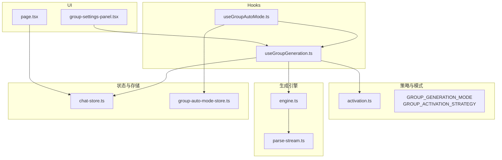
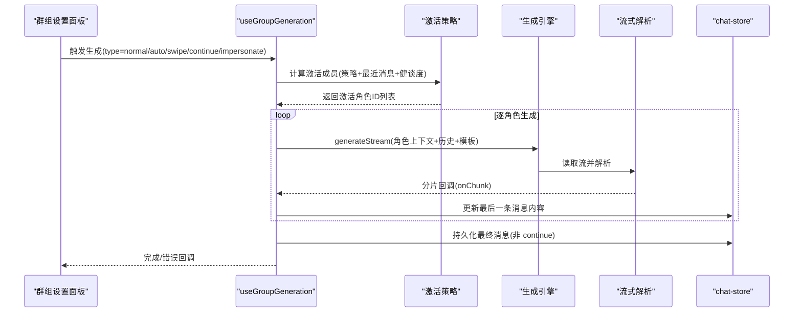
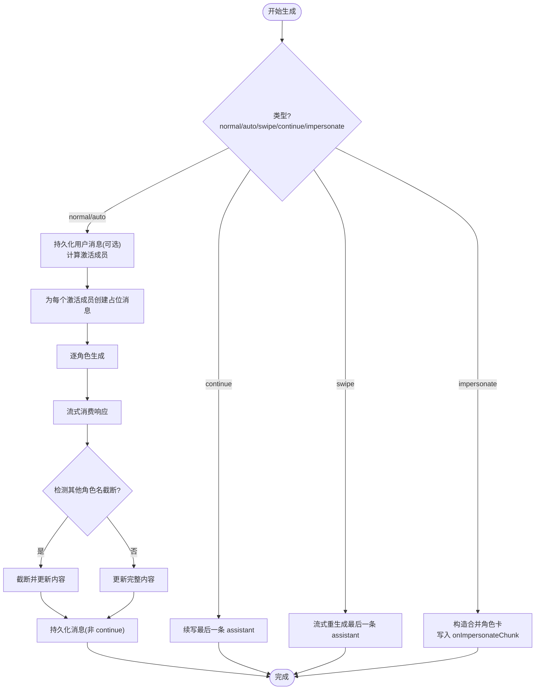
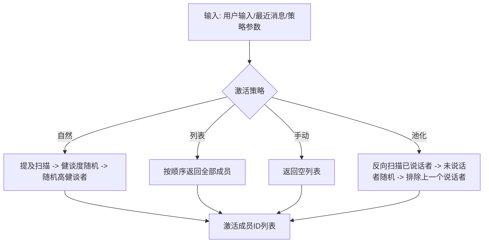
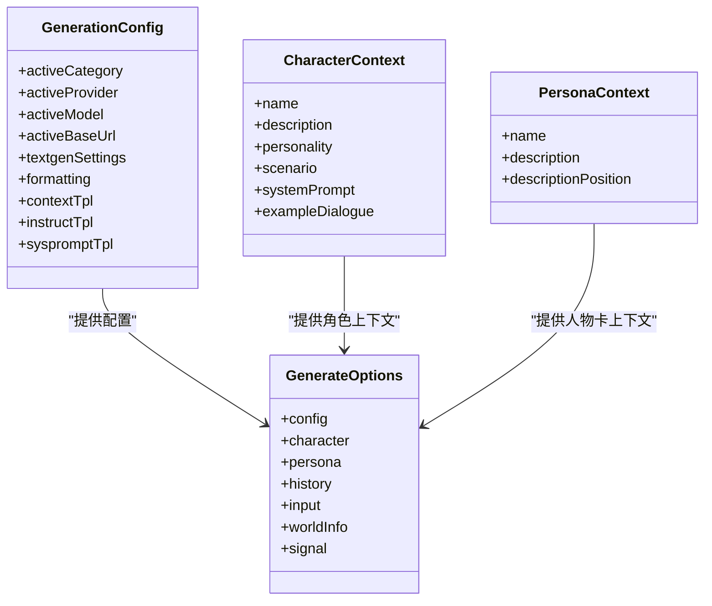
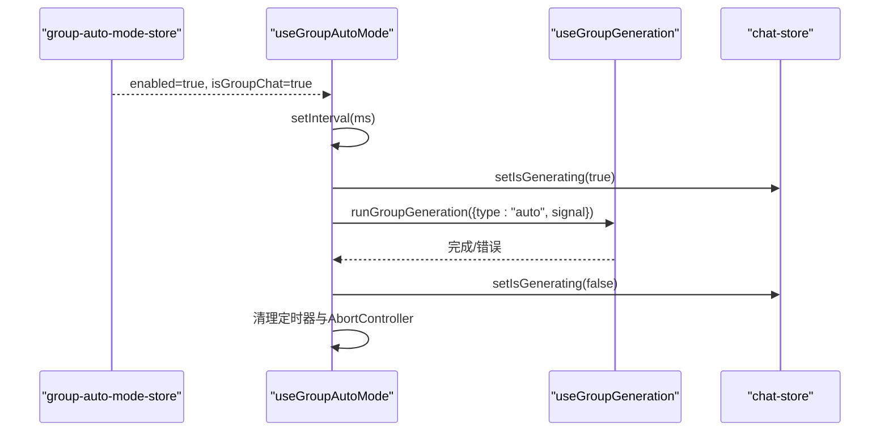
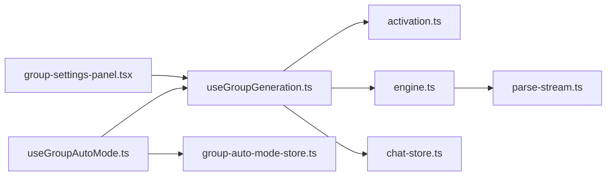

# 群组生成机制

<cite>
**本文引用的文件**
- [useGroupGeneration.ts](file://src/hooks/useGroupGeneration.ts)
- [useGroupAutoMode.ts](file://src/hooks/useGroupAutoMode.ts)
- [activation.ts](file://src/lib/group-chat/activation.ts)
- [engine.ts](file://src/lib/generation/engine.ts)
- [parse-stream.ts](file://src/lib/textgen/parse-stream.ts)
- [chat-store.ts](file://src/stores/chat-store.ts)
- [group-auto-mode-store.ts](file://src/stores/group-auto-mode-store.ts)
- [group-settings-panel.tsx](file://src/components/groups/group-settings-panel.tsx)
- [page.tsx](file://src/app/groups/page.tsx)
</cite>

## 目录
1. [简介](#简介)
2. [项目结构](#项目结构)
3. [核心组件](#核心组件)
4. [架构总览](#架构总览)
5. [详细组件分析](#详细组件分析)
6. [依赖关系分析](#依赖关系分析)
7. [性能考量](#性能考量)
8. [故障排查指南](#故障排查指南)
9. [结论](#结论)
10. [附录](#附录)

## 简介
本文件系统性阐述 SillyTavern Next 的群组生成机制，重点围绕 useGroupGeneration Hook 的实现，覆盖并发消息生成、角色轮询与响应合并策略、自动模式触发与停止、手动模式下的用户干预、性能优化、错误处理与超时管理，并提供配置示例与调试技巧，帮助开发者理解并优化群组聊天体验。

## 项目结构
群组生成涉及前端 Hook、激活策略、生成引擎、流式解析、全局状态与 UI 控件等模块协同工作。关键路径如下：
- Hooks 层：useGroupGeneration、useGroupAutoMode
- 激活策略：GROUP_ACTIVATION_STRATEGY、GROUP_GENERATION_MODE
- 生成引擎：generateStream、buildTextgenPrompt、callChatCompletionAPI
- 流式解析：consumeTextgenStream、consumePlainTextStream
- 状态层：chat-store、group-auto-mode-store
- UI 层：群组设置面板、群组列表页

图表来源
- [useGroupGeneration.ts:1-738](file://src/hooks/useGroupGeneration.ts#L1-L738)
- [useGroupAutoMode.ts:1-62](file://src/hooks/useGroupAutoMode.ts#L1-L62)
- [activation.ts:1-191](file://src/lib/group-chat/activation.ts#L1-L191)
- [engine.ts:1-238](file://src/lib/generation/engine.ts#L1-L238)
- [parse-stream.ts:1-116](file://src/lib/textgen/parse-stream.ts#L1-L116)
- [chat-store.ts:1-583](file://src/stores/chat-store.ts#L1-L583)
- [group-auto-mode-store.ts:1-18](file://src/stores/group-auto-mode-store.ts#L1-L18)
- [group-settings-panel.tsx:1-318](file://src/components/groups/group-settings-panel.tsx#L1-L318)
- [page.tsx:1-261](file://src/app/groups/page.tsx#L1-L261)

章节来源
- [useGroupGeneration.ts:1-738](file://src/hooks/useGroupGeneration.ts#L1-L738)
- [useGroupAutoMode.ts:1-62](file://src/hooks/useGroupAutoMode.ts#L1-L62)
- [activation.ts:1-191](file://src/lib/group-chat/activation.ts#L1-L191)
- [engine.ts:1-238](file://src/lib/generation/engine.ts#L1-L238)
- [parse-stream.ts:1-116](file://src/lib/textgen/parse-stream.ts#L1-L116)
- [chat-store.ts:1-583](file://src/stores/chat-store.ts#L1-L583)
- [group-auto-mode-store.ts:1-18](file://src/stores/group-auto-mode-store.ts#L1-L18)
- [group-settings-panel.tsx:1-318](file://src/components/groups/group-settings-panel.tsx#L1-L318)
- [page.tsx:1-261](file://src/app/groups/page.tsx#L1-L261)

## 核心组件
- useGroupGeneration：封装群组聊天的完整生命周期，包括消息持久化、角色激活、逐角色生成、流式更新与错误处理。
- useGroupAutoMode：基于定时器的自动触发器，避免与进行中的生成冲突，支持 AbortController 中断。
- 激活策略与生成模式：提供自然、列表、手动、池化四种激活策略，以及替换、追加、追加（含禁用）三种生成模式。
- 生成引擎与流式解析：统一构建提示词与调用 API，兼容多种后端格式，提供纯文本与 JSONL/SSE 流式解析。
- 状态与存储：chat-store 管理消息容器与持久化，group-auto-mode-store 管理自动模式开关。
- UI 面板：群组设置面板提供策略、模式、自动模式延迟等配置入口，支持强制发言与成员管理。

章节来源
- [useGroupGeneration.ts:59-737](file://src/hooks/useGroupGeneration.ts#L59-L737)
- [useGroupAutoMode.ts:17-61](file://src/hooks/useGroupAutoMode.ts#L17-L61)
- [activation.ts:10-30](file://src/lib/group-chat/activation.ts#L10-L30)
- [engine.ts:25-63](file://src/lib/generation/engine.ts#L25-L63)
- [parse-stream.ts:10-116](file://src/lib/textgen/parse-stream.ts#L10-L116)
- [chat-store.ts:15-103](file://src/stores/chat-store.ts#L15-L103)
- [group-auto-mode-store.ts:7-17](file://src/stores/group-auto-mode-store.ts#L7-L17)
- [group-settings-panel.tsx:32-318](file://src/components/groups/group-settings-panel.tsx#L32-L318)

## 架构总览
群组生成采用“策略驱动 + 逐角色并发生成”的架构。UI 触发生成后，Hook 读取当前群组与成员配置，计算激活成员，逐角色调用生成引擎，流式消费响应并更新消息容器，同时支持继续、重生成、重生等变体操作。

图表来源
- [useGroupGeneration.ts:450-691](file://src/hooks/useGroupGeneration.ts#L450-L691)
- [activation.ts:169-190](file://src/lib/group-chat/activation.ts#L169-L190)
- [engine.ts:232-237](file://src/lib/generation/engine.ts#L232-L237)
- [parse-stream.ts:38-99](file://src/lib/textgen/parse-stream.ts#L38-L99)
- [chat-store.ts:114-150](file://src/stores/chat-store.ts#L114-L150)

## 详细组件分析

### useGroupGeneration Hook 实现原理
- 群组与成员加载：首次进入群组聊天时并行拉取群组与角色列表，映射成员信息并缓存。
- 世界信息构建：聚合全局与群内角色的世界书 ID，形成 World Info Payload。
- 角色卡合并策略：
  - 追加模式：将多个成员的描述、个性、场景、示例对话按前缀/后缀规则拼接，支持占位符替换。
  - 替换模式：使用单角色卡，不合并。
- 历史构建：将其他角色的历史标记为 system 角色并加上说话者前缀，避免 AI 混淆。
- 逐角色生成：
  - 为每个激活成员创建占位消息，调用 generateStream，流式消费响应。
  - 截断逻辑：检测其他角色名称开头的分段，及时截断并更新消息内容。
  - 继续/重生成：支持续写最后一条 assistant 或对最后一条进行流式重生成。
  - 重生：删除当前批次消息并重新发起 normal 流程。
- 错误处理：捕获异常并更新最后一条消息为错误提示，调用 onError 回调。
- 自动模式：每次生成前后维护 isGenerating 状态，避免冲突。

图表来源
- [useGroupGeneration.ts:472-536](file://src/hooks/useGroupGeneration.ts#L472-L536)
- [useGroupGeneration.ts:538-571](file://src/hooks/useGroupGeneration.ts#L538-L571)
- [useGroupGeneration.ts:573-666](file://src/hooks/useGroupGeneration.ts#L573-L666)
- [useGroupGeneration.ts:277-447](file://src/hooks/useGroupGeneration.ts#L277-L447)

章节来源
- [useGroupGeneration.ts:77-132](file://src/hooks/useGroupGeneration.ts#L77-L132)
- [useGroupGeneration.ts:81-97](file://src/hooks/useGroupGeneration.ts#L81-L97)
- [useGroupGeneration.ts:140-153](file://src/hooks/useGroupGeneration.ts#L140-L153)
- [useGroupGeneration.ts:170-257](file://src/hooks/useGroupGeneration.ts#L170-L257)
- [useGroupGeneration.ts:260-274](file://src/hooks/useGroupGeneration.ts#L260-L274)
- [useGroupGeneration.ts:277-447](file://src/hooks/useGroupGeneration.ts#L277-L447)
- [useGroupGeneration.ts:449-691](file://src/hooks/useGroupGeneration.ts#L449-L691)
- [useGroupGeneration.ts:693-728](file://src/hooks/useGroupGeneration.ts#L693-L728)

### 激活策略与生成模式
- 激活策略
  - 自然：扫描用户输入是否提及角色名，按健谈度随机，无人激活则从高健谈者中随机。
  - 列表：按成员顺序全部轮流。
  - 手动：不自动激活，需用户强制指定。
  - 池化：避免重复，从未说话者中选，或在一轮结束后排除上一个说话者。
- 生成模式
  - 替换：逐个角色独立生成。
  - 追加：合并启用成员的角色卡信息一起生成。
  - 追加（含禁用）：合并所有成员的角色卡信息，包括被禁用成员（自身除外）。

图表来源
- [activation.ts:59-112](file://src/lib/group-chat/activation.ts#L59-L112)
- [activation.ts:114-117](file://src/lib/group-chat/activation.ts#L114-L117)
- [activation.ts:119-125](file://src/lib/group-chat/activation.ts#L119-L125)
- [activation.ts:127-167](file://src/lib/group-chat/activation.ts#L127-L167)

章节来源
- [activation.ts:10-30](file://src/lib/group-chat/activation.ts#L10-L30)
- [activation.ts:59-190](file://src/lib/group-chat/activation.ts#L59-L190)

### 生成引擎与流式解析
- 统一入口：generateStream 根据 activeCategory 选择文本补全或聊天补全 API。
- 提示词构建：buildTextgenPrompt 结合宏替换、系统提示、历史与角色卡，支持 instruct 与简单模板。
- API 调用：callTextCompletionAPI 与 callChatCompletionAPI 分别处理不同类别。
- 流式解析：consumeTextgenStream 兼容多种后端格式，consumePlainTextStream 适用于纯文本流。

图表来源
- [engine.ts:25-63](file://src/lib/generation/engine.ts#L25-L63)
- [engine.ts:97-146](file://src/lib/generation/engine.ts#L97-L146)
- [engine.ts:152-227](file://src/lib/generation/engine.ts#L152-L227)
- [engine.ts:232-237](file://src/lib/generation/engine.ts#L232-L237)

章节来源
- [engine.ts:25-238](file://src/lib/generation/engine.ts#L25-L238)
- [parse-stream.ts:10-116](file://src/lib/textgen/parse-stream.ts#L10-L116)

### 自动模式触发与停止
- 触发条件：启用开关且当前为群组聊天。
- 执行流程：每间隔 autoModeDelay 秒检查 isGenerating，避免冲突；使用独立 AbortController。
- 停止机制：清理定时器与 AbortController.abort，确保资源释放。

图表来源
- [useGroupAutoMode.ts:17-61](file://src/hooks/useGroupAutoMode.ts#L17-L61)
- [group-auto-mode-store.ts:7-17](file://src/stores/group-auto-mode-store.ts#L7-L17)
- [chat-store.ts:152](file://src/stores/chat-store.ts#L152)
- [useGroupGeneration.ts:450-691](file://src/hooks/useGroupGeneration.ts#L450-L691)

章节来源
- [useGroupAutoMode.ts:17-61](file://src/hooks/useGroupAutoMode.ts#L17-L61)
- [group-auto-mode-store.ts:7-17](file://src/stores/group-auto-mode-store.ts#L7-L17)
- [chat-store.ts:152](file://src/stores/chat-store.ts#L152)

### 手动模式下的用户干预
- 强制发言：在群组设置面板点击“强制发言”，可绕过激活策略直接生成指定角色。
- 成员管理：支持上移/下移、启用/静音、移除成员，动态调整激活池。
- 自动模式开关：可开启/关闭自动模式，并设置延迟秒数。

章节来源
- [group-settings-panel.tsx:238-245](file://src/components/groups/group-settings-panel.tsx#L238-L245)
- [group-settings-panel.tsx:224-237](file://src/components/groups/group-settings-panel.tsx#L224-L237)
- [group-settings-panel.tsx:195-202](file://src/components/groups/group-settings-panel.tsx#L195-L202)

## 依赖关系分析
- useGroupGeneration 依赖：
  - 激活策略：getActivatedMembers
  - 生成引擎：generateStream、buildTextgenPrompt
  - 流式解析：consumeTextgenStream/consumePlainTextStream
  - 状态：chat-store（消息增删改查）、group-auto-mode-store（自动模式）
  - UI：群组设置面板提供配置与触发入口
- useGroupAutoMode 依赖：
  - chat-store（isGenerating）
  - group-gen（runGroupGeneration）

图表来源
- [useGroupGeneration.ts:16-28](file://src/hooks/useGroupGeneration.ts#L16-L28)
- [useGroupGeneration.ts:15-16](file://src/hooks/useGroupGeneration.ts#L15-L16)
- [useGroupAutoMode.ts:13-15](file://src/hooks/useGroupAutoMode.ts#L13-L15)
- [group-settings-panel.tsx:10-13](file://src/components/groups/group-settings-panel.tsx#L10-L13)

章节来源
- [useGroupGeneration.ts:16-28](file://src/hooks/useGroupGeneration.ts#L16-L28)
- [useGroupAutoMode.ts:13-15](file://src/hooks/useGroupAutoMode.ts#L13-L15)
- [group-settings-panel.tsx:10-13](file://src/components/groups/group-settings-panel.tsx#L10-L13)

## 性能考量
- 并发与串行：
  - 逐角色生成采用串行循环，避免模型并发导致的令牌泄漏与上下文污染风险；如需提升吞吐，可在后端或模型侧支持并发。
- 流式更新：
  - 通过 onChunk 逐步更新最后一条消息，减少一次性渲染压力。
- 截断与稳定性：
  - 截断逻辑避免跨角色混写，提高稳定性；建议在角色名较多或相似时谨慎使用追加模式。
- 缓存与去抖：
  - 群组与角色列表加载使用 Promise.all 并缓存，避免重复请求。
- 自动模式节流：
  - 通过 isGenerating 与 AbortController 防止重复触发与资源浪费。

[本节为通用性能指导，无需特定文件来源]

## 故障排查指南
- 常见错误与处理
  - 模型未选择：在生成前校验 activeModel，若为空则提示用户在设置中选择。
  - 无可用成员：当激活策略返回空列表时直接返回。
  - 流中断：AbortError 时更新最后一条消息为“已中止”，并停止后续生成。
  - API 失败：捕获响应错误并显示错误信息。
- 调试技巧
  - 在 impersonate 模式下观察 onImpersonateChunk 输出，验证合并角色卡与系统提示。
  - 使用 continue/swipe 验证历史构建与截断逻辑。
  - 在自动模式下观察 isGenerating 状态变化，确认定时器与 AbortController 正常工作。
- 建议的日志点
  - 群组加载、激活成员计算、逐角色生成开始/结束、流式解析片段、错误捕获与回退。

章节来源
- [useGroupGeneration.ts:453-456](file://src/hooks/useGroupGeneration.ts#L453-L456)
- [useGroupGeneration.ts:656-664](file://src/hooks/useGroupGeneration.ts#L656-L664)
- [useGroupAutoMode.ts:30-47](file://src/hooks/useGroupAutoMode.ts#L30-L47)

## 结论
SillyTavern Next 的群组生成机制通过策略驱动与逐角色生成，实现了稳定可控的多角色对话体验。结合自动模式、手动干预与完善的错误处理，既保证了易用性，也为性能优化与扩展提供了清晰的边界。建议在需要更高吞吐时评估后端并发能力与模型限制，并在 UI 层持续优化交互反馈。

[本节为总结性内容，无需特定文件来源]

## 附录

### 配置示例与最佳实践
- 激活策略选择
  - 自然：适合动态互动；池化：避免重复，适合长对话轮次。
  - 列表：适合固定顺序的剧场式对话。
  - 手动：完全由用户控制，适合引导性强的剧情。
- 生成模式选择
  - 追加模式：增强上下文一致性，适合角色间联动；注意角色卡长度与停用词。
  - 替换模式：降低上下文复杂度，适合快速轮换。
- 自动模式
  - 设置合理的 autoModeDelay，避免过于频繁触发；在 isGenerating 期间跳过本轮。
- 截断与稳定性
  - 在追加模式下，确保角色名唯一性；必要时在系统提示中强调“仅当前角色身份”。

[本节为通用配置建议，无需特定文件来源]