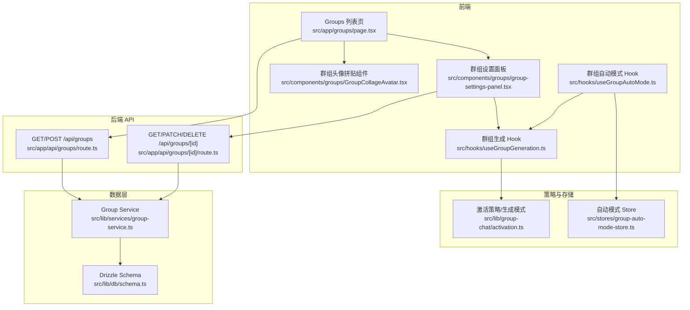
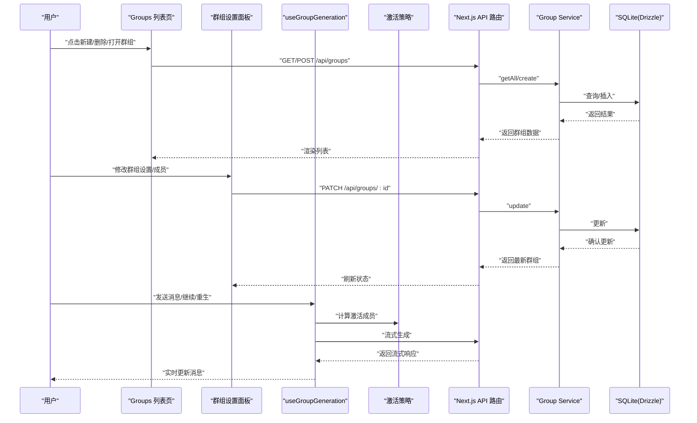
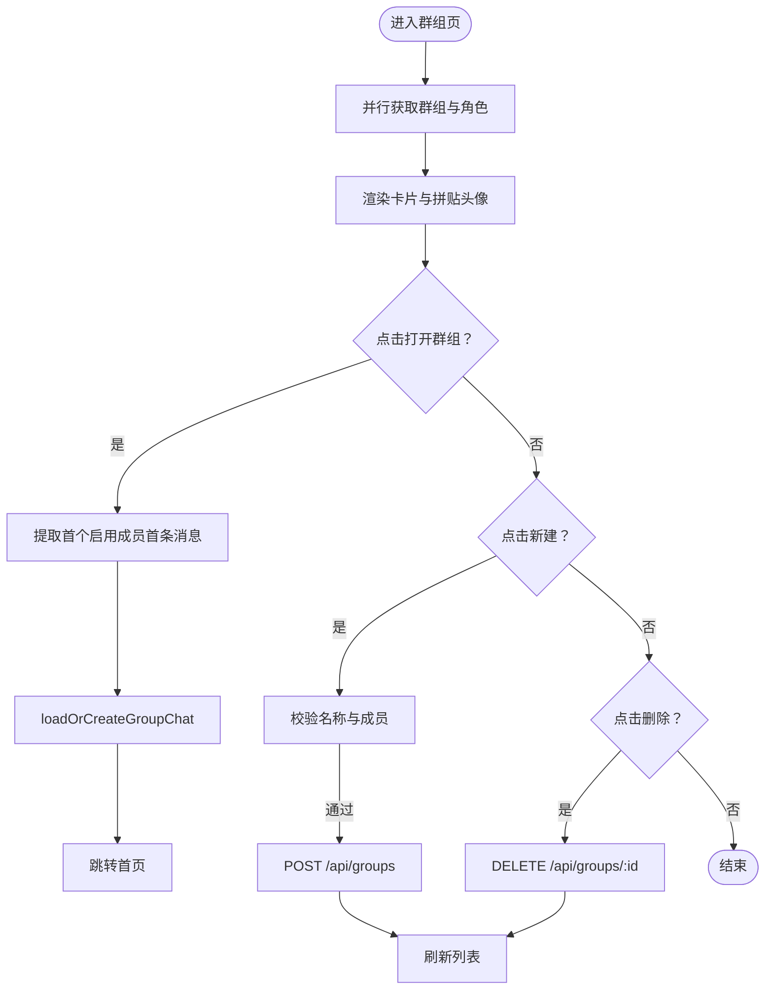
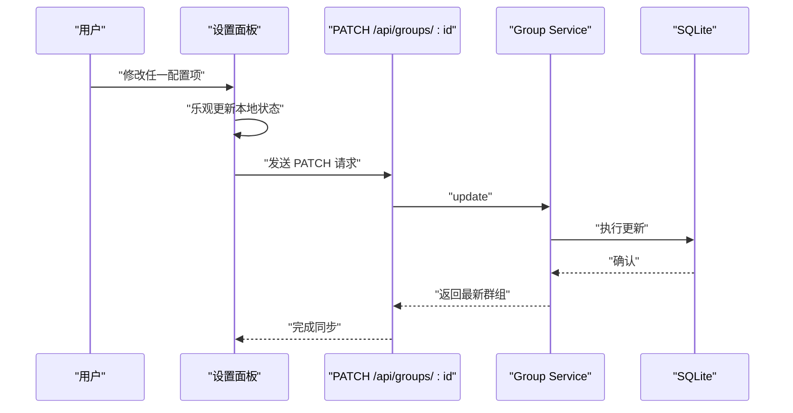
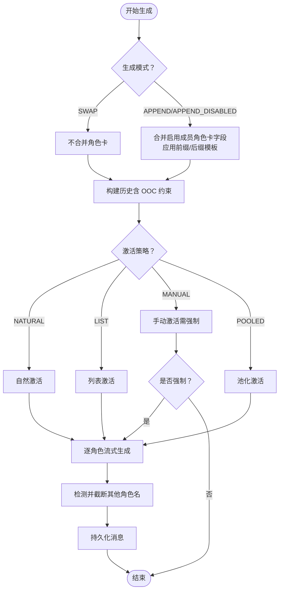
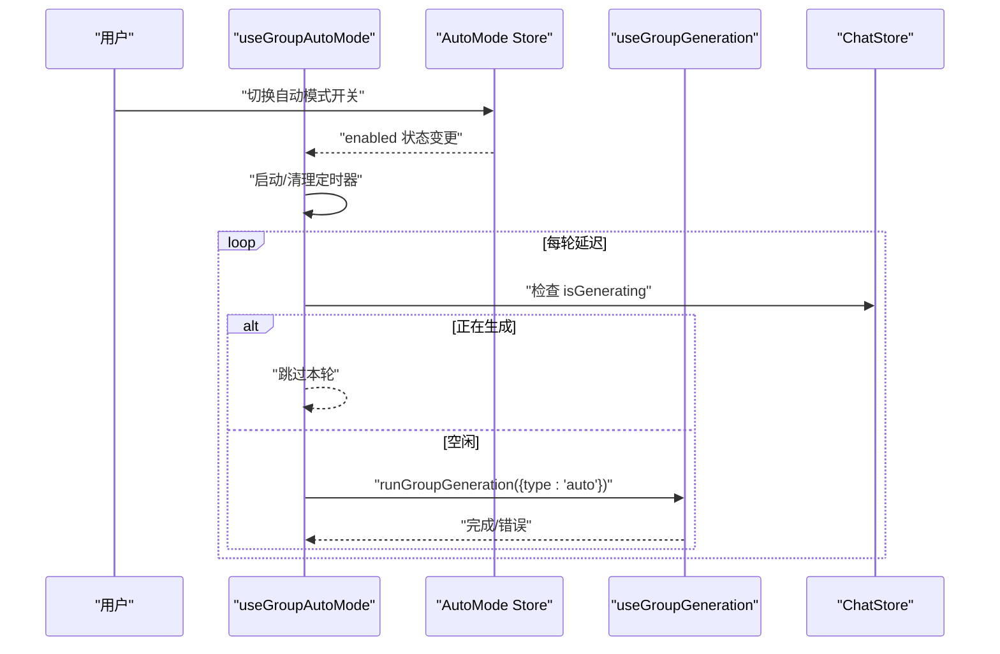
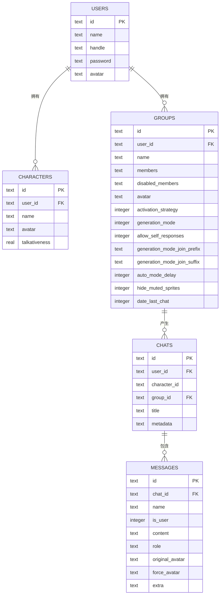
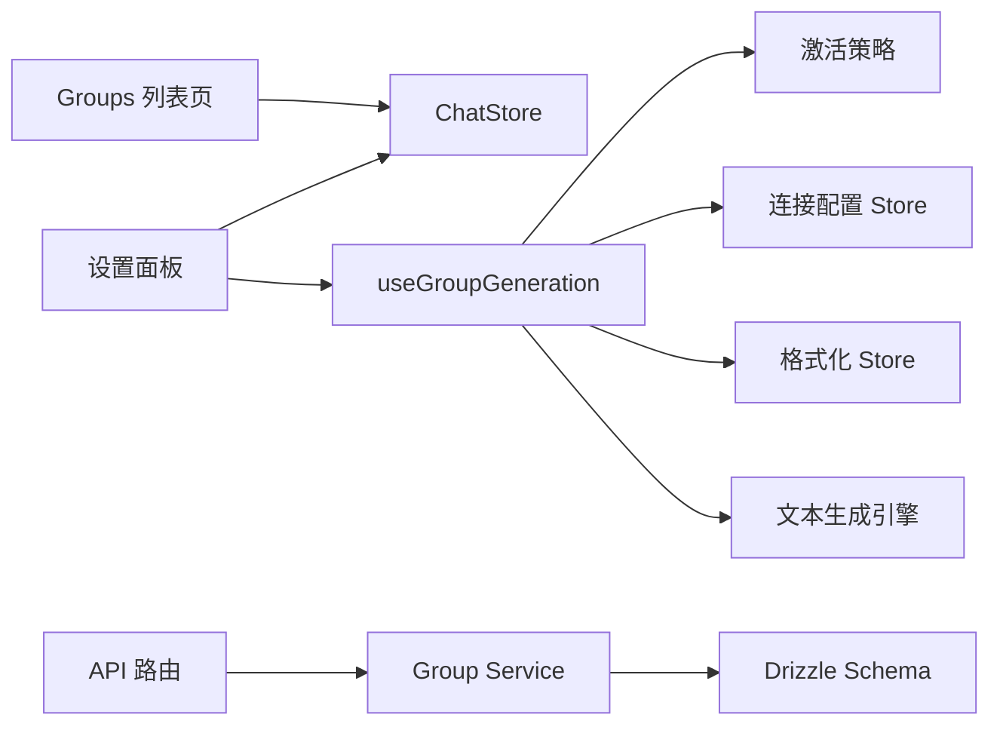

# 群组管理

<cite>
**本文引用的文件**   
- [src/app/groups/page.tsx](file://src/app/groups/page.tsx)
- [src/components/groups/group-settings-panel.tsx](file://src/components/groups/group-settings-panel.tsx)
- [src/components/groups/GroupCollageAvatar.tsx](file://src/components/groups/GroupCollageAvatar.tsx)
- [src/hooks/useGroupGeneration.ts](file://src/hooks/useGroupGeneration.ts)
- [src/hooks/useGroupAutoMode.ts](file://src/hooks/useGroupAutoMode.ts)
- [src/lib/group-chat/activation.ts](file://src/lib/group-chat/activation.ts)
- [src/stores/group-auto-mode-store.ts](file://src/stores/group-auto-mode-store.ts)
- [src/app/api/groups/route.ts](file://src/app/api/groups/route.ts)
- [src/app/api/groups/[id]/route.ts](file://src/app/api/groups/[id]/route.ts)
- [src/lib/services/group-service.ts](file://src/lib/services/group-service.ts)
- [src/lib/db/schema.ts](file://src/lib/db/schema.ts)
</cite>

## 目录
1. [简介](#简介)
2. [项目结构](#项目结构)
3. [核心组件](#核心组件)
4. [架构总览](#架构总览)
5. [详细组件分析](#详细组件分析)
6. [依赖关系分析](#依赖关系分析)
7. [性能考量](#性能考量)
8. [故障排查指南](#故障排查指南)
9. [结论](#结论)
10. [附录](#附录)

## 简介
本技术文档围绕 SillyTavern Next 的群组管理功能进行系统化梳理，覆盖以下主题：
- 群组的创建、编辑与删除机制
- 群组设置面板的实现原理与配置项
- 群组成员的添加、移除与权限（禁用/启用）管理
- 群组聊天的配置参数：生成策略、角色分配与消息路由规则
- 用户界面设计、状态管理与数据持久化
- 最佳实践与常见问题解决方案

## 项目结构
群组管理涉及前端页面、设置面板、生成与自动模式钩子、激活策略、API 路由以及数据库模型与服务层。关键文件分布如下：
- 页面与设置面板：Groups 列表页与右侧设置抽屉
- 生成与自动模式：useGroupGeneration 与 useGroupAutoMode
- 激活策略：GROUP_ACTIVATION_STRATEGY 与 GROUP_GENERATION_MODE
- API 层：/api/groups 与 /api/groups/[id]
- 数据层：Drizzle ORM Schema 与 Group Service

**图表来源**
- [src/app/groups/page.tsx:1-261](file://src/app/groups/page.tsx#L1-L261)
- [src/components/groups/group-settings-panel.tsx:1-318](file://src/components/groups/group-settings-panel.tsx#L1-L318)
- [src/components/groups/GroupCollageAvatar.tsx:1-110](file://src/components/groups/GroupCollageAvatar.tsx#L1-L110)
- [src/hooks/useGroupGeneration.ts:1-738](file://src/hooks/useGroupGeneration.ts#L1-L738)
- [src/hooks/useGroupAutoMode.ts:1-62](file://src/hooks/useGroupAutoMode.ts#L1-L62)
- [src/lib/group-chat/activation.ts:1-191](file://src/lib/group-chat/activation.ts#L1-L191)
- [src/stores/group-auto-mode-store.ts:1-18](file://src/stores/group-auto-mode-store.ts#L1-L18)
- [src/app/api/groups/route.ts:1-34](file://src/app/api/groups/route.ts#L1-L34)
- [src/app/api/groups/[id]/route.ts:1-55](file://src/app/api/groups/[id]/route.ts#L1-L55)
- [src/lib/services/group-service.ts:1-174](file://src/lib/services/group-service.ts#L1-L174)
- [src/lib/db/schema.ts:100-126](file://src/lib/db/schema.ts#L100-L126)

**章节来源**
- [src/app/groups/page.tsx:1-261](file://src/app/groups/page.tsx#L1-L261)
- [src/components/groups/group-settings-panel.tsx:1-318](file://src/components/groups/group-settings-panel.tsx#L1-L318)
- [src/components/groups/GroupCollageAvatar.tsx:1-110](file://src/components/groups/GroupCollageAvatar.tsx#L1-L110)
- [src/hooks/useGroupGeneration.ts:1-738](file://src/hooks/useGroupGeneration.ts#L1-L738)
- [src/hooks/useGroupAutoMode.ts:1-62](file://src/hooks/useGroupAutoMode.ts#L1-L62)
- [src/lib/group-chat/activation.ts:1-191](file://src/lib/group-chat/activation.ts#L1-L191)
- [src/stores/group-auto-mode-store.ts:1-18](file://src/stores/group-auto-mode-store.ts#L1-L18)
- [src/app/api/groups/route.ts:1-34](file://src/app/api/groups/route.ts#L1-L34)
- [src/app/api/groups/[id]/route.ts:1-55](file://src/app/api/groups/[id]/route.ts#L1-L55)
- [src/lib/services/group-service.ts:1-174](file://src/lib/services/group-service.ts#L1-L174)
- [src/lib/db/schema.ts:100-126](file://src/lib/db/schema.ts#L100-L126)

## 核心组件
- 群组列表页：负责加载群组与角色、渲染卡片、打开群聊、创建与删除群组。
- 群组设置面板：提供群组控制、成员管理与添加成员的抽屉式界面，并支持即时 PATCH 更新。
- 群组生成 Hook：封装群组聊天的完整生成流程，包括激活策略、角色卡合并、历史构建与流式输出。
- 激活策略模块：提供自然、列表、手动、池化四种激活策略与三种生成模式。
- 自动模式 Hook：基于定时器周期性触发群组生成，避免与正在生成的任务冲突。
- API 与服务层：提供群组的增删改查与鉴权校验，服务层负责数据序列化与 Drizzle ORM 操作。

**章节来源**
- [src/app/groups/page.tsx:36-261](file://src/app/groups/page.tsx#L36-L261)
- [src/components/groups/group-settings-panel.tsx:32-103](file://src/components/groups/group-settings-panel.tsx#L32-L103)
- [src/hooks/useGroupGeneration.ts:59-738](file://src/hooks/useGroupGeneration.ts#L59-L738)
- [src/lib/group-chat/activation.ts:10-191](file://src/lib/group-chat/activation.ts#L10-L191)
- [src/hooks/useGroupAutoMode.ts:17-62](file://src/hooks/useGroupAutoMode.ts#L17-L62)
- [src/app/api/groups/route.ts:5-34](file://src/app/api/groups/route.ts#L5-L34)
- [src/app/api/groups/[id]/route.ts:7-55](file://src/app/api/groups/[id]/route.ts#L7-L55)
- [src/lib/services/group-service.ts:91-174](file://src/lib/services/group-service.ts#L91-L174)

## 架构总览
群组管理采用前后端分离的 Next.js App Router 结构，前端通过 React Hooks 与 Zustand 状态管理协调 UI 与生成逻辑，后端通过 Next.js 路由处理请求并调用服务层访问数据库。

**图表来源**
- [src/app/groups/page.tsx:47-95](file://src/app/groups/page.tsx#L47-L95)
- [src/components/groups/group-settings-panel.tsx:58-68](file://src/components/groups/group-settings-panel.tsx#L58-L68)
- [src/hooks/useGroupGeneration.ts:450-691](file://src/hooks/useGroupGeneration.ts#L450-L691)
- [src/lib/group-chat/activation.ts:169-191](file://src/lib/group-chat/activation.ts#L169-L191)
- [src/app/api/groups/route.ts:5-34](file://src/app/api/groups/route.ts#L5-L34)
- [src/app/api/groups/[id]/route.ts:18-38](file://src/app/api/groups/[id]/route.ts#L18-L38)
- [src/lib/services/group-service.ts:133-159](file://src/lib/services/group-service.ts#L133-L159)

## 详细组件分析

### 群组列表页（创建、打开、删除）
- 加载与渲染：并行拉取群组与角色列表，渲染卡片与拼贴头像，展示激活策略与生成模式标签。
- 打开群聊：根据首个启用成员的首条消息构造上下文，调用聊天存储加载或创建群聊并跳转首页。
- 创建群组：校验名称与成员集合，POST 至 /api/groups。
- 删除群组：DELETE /api/groups/:id，同时清理相关聊天记录。

**图表来源**
- [src/app/groups/page.tsx:47-95](file://src/app/groups/page.tsx#L47-L95)
- [src/app/api/groups/route.ts:14-33](file://src/app/api/groups/route.ts#L14-L33)
- [src/app/api/groups/[id]/route.ts:40-54](file://src/app/api/groups/[id]/route.ts#L40-L54)

**章节来源**
- [src/app/groups/page.tsx:36-261](file://src/app/groups/page.tsx#L36-L261)
- [src/app/api/groups/route.ts:5-34](file://src/app/api/groups/route.ts#L5-L34)
- [src/app/api/groups/[id]/route.ts:7-55](file://src/app/api/groups/[id]/route.ts#L7-L55)

### 群组设置面板（配置与成员管理）
- 面板结构：控制区、成员区、添加成员区三段抽屉，支持展开/折叠。
- 控制区：名称、头像上传/恢复、激活策略、生成模式、Join 前缀/后缀、允许自言自语、隐藏静音成员、启用自动模式、自动模式延迟、收藏与删除。
- 成员区：搜索、移动顺序、启用/禁用、强制发言、移除成员。
- 添加成员区：搜索候选角色并加入群组。
- 实时更新：PATCH /api/groups/:id，UI 乐观更新后与服务端同步。

**图表来源**
- [src/components/groups/group-settings-panel.tsx:58-68](file://src/components/groups/group-settings-panel.tsx#L58-L68)
- [src/app/api/groups/[id]/route.ts:18-38](file://src/app/api/groups/[id]/route.ts#L18-L38)
- [src/lib/services/group-service.ts:133-159](file://src/lib/services/group-service.ts#L133-L159)

**章节来源**
- [src/components/groups/group-settings-panel.tsx:32-318](file://src/components/groups/group-settings-panel.tsx#L32-L318)
- [src/app/api/groups/[id]/route.ts:18-38](file://src/app/api/groups/[id]/route.ts#L18-L38)
- [src/lib/services/group-service.ts:24-38](file://src/lib/services/group-service.ts#L24-L38)

### 群组生成与激活策略
- 生成模式：
  - 替换（SWAP）：逐角色独立生成，保留各自角色卡。
  - 追加（APPEND）：合并启用成员的角色卡字段，支持前缀/后缀模板。
  - 追加（含禁用）（APPEND_DISABLED）：合并所有成员（含禁用），但仅在当前发言者为禁用成员时保留其字段。
- 激活策略：
  - 自然（NATURAL）：扫描提及、按健谈度随机，否则从高健谈者中随机。
  - 列表（LIST）：按顺序轮流激活所有启用成员。
  - 手动（MANUAL）：不自动激活，需强制指定角色。
  - 池化（POOLED）：避免重复，从未发言者中随机选择。
- 历史构建与串角截断：为单个角色构建历史，追加 OOC 指令约束其仅扮演当前角色；流式输出时检测其他角色名并截断。
- 续写/重生/流式重生成：支持 continue、regenerate、swipe 等变体。

**图表来源**
- [src/hooks/useGroupGeneration.ts:170-257](file://src/hooks/useGroupGeneration.ts#L170-L257)
- [src/hooks/useGroupGeneration.ts:260-447](file://src/hooks/useGroupGeneration.ts#L260-L447)
- [src/lib/group-chat/activation.ts:66-191](file://src/lib/group-chat/activation.ts#L66-L191)

**章节来源**
- [src/hooks/useGroupGeneration.ts:170-447](file://src/hooks/useGroupGeneration.ts#L170-L447)
- [src/lib/group-chat/activation.ts:10-191](file://src/lib/group-chat/activation.ts#L10-L191)

### 自动模式与状态管理
- 自动模式 Store：全局开关与切换方法。
- 自动模式 Hook：仅在启用且处于群组聊天时启动定时器，每轮检查是否正在生成，避免并发冲突；使用独立 AbortController，关闭时立即中止。
- 与生成 Hook 协作：以 "auto" 类型触发群组生成，错误通过日志告警。

**图表来源**
- [src/stores/group-auto-mode-store.ts:13-17](file://src/stores/group-auto-mode-store.ts#L13-L17)
- [src/hooks/useGroupAutoMode.ts:17-62](file://src/hooks/useGroupAutoMode.ts#L17-L62)
- [src/hooks/useGroupGeneration.ts:450-691](file://src/hooks/useGroupGeneration.ts#L450-L691)

**章节来源**
- [src/stores/group-auto-mode-store.ts:1-18](file://src/stores/group-auto-mode-store.ts#L1-L18)
- [src/hooks/useGroupAutoMode.ts:1-62](file://src/hooks/useGroupAutoMode.ts#L1-L62)
- [src/hooks/useGroupGeneration.ts:693-738](file://src/hooks/useGroupGeneration.ts#L693-L738)

### 数据模型与持久化
- 群组表（groups）：包含群组基本信息、成员数组、禁用成员数组、激活策略、生成模式、自定义头像、自动模式延迟、最后聊天时间戳等。
- 聊天表（chats）：与群组关联，记录群组聊天会话元数据。
- 消息表（messages）：保存逐角色生成的消息，包含 originalAvatar、forceAvatar、extra（gen_id 等）。
- 服务层：Zod 校验输入，序列化/反序列化 JSON 字段，Drizzle ORM 操作 SQLite。

**图表来源**
- [src/lib/db/schema.ts:100-168](file://src/lib/db/schema.ts#L100-L168)
- [src/lib/services/group-service.ts:66-85](file://src/lib/services/group-service.ts#L66-L85)

**章节来源**
- [src/lib/db/schema.ts:100-168](file://src/lib/db/schema.ts#L100-L168)
- [src/lib/services/group-service.ts:66-85](file://src/lib/services/group-service.ts#L66-L85)

## 依赖关系分析
- 组件耦合：
  - Groups 列表页依赖聊天存储以加载/创建群聊。
  - 设置面板依赖聊天存储与生成 Hook 以强制发言与更新状态。
  - 生成 Hook 依赖激活策略、格式化模板、连接配置、世界设定等多 Store。
- 外部依赖：
  - Next.js App Router 路由与鉴权中间件。
  - Drizzle ORM 与 SQLite。
  - 流式解析工具与文本生成引擎。

**图表来源**
- [src/app/groups/page.tsx:38-40](file://src/app/groups/page.tsx#L38-L40)
- [src/components/groups/group-settings-panel.tsx:10-14](file://src/components/groups/group-settings-panel.tsx#L10-L14)
- [src/hooks/useGroupGeneration.ts:8-29](file://src/hooks/useGroupGeneration.ts#L8-L29)
- [src/lib/group-chat/activation.ts:10-34](file://src/lib/group-chat/activation.ts#L10-L34)
- [src/app/api/groups/route.ts:1-3](file://src/app/api/groups/route.ts#L1-L3)
- [src/lib/services/group-service.ts:1-6](file://src/lib/services/group-service.ts#L1-L6)
- [src/lib/db/schema.ts:100-126](file://src/lib/db/schema.ts#L100-L126)

**章节来源**
- [src/app/groups/page.tsx:38-40](file://src/app/groups/page.tsx#L38-L40)
- [src/components/groups/group-settings-panel.tsx:10-14](file://src/components/groups/group-settings-panel.tsx#L10-L14)
- [src/hooks/useGroupGeneration.ts:8-29](file://src/hooks/useGroupGeneration.ts#L8-L29)
- [src/lib/group-chat/activation.ts:10-34](file://src/lib/group-chat/activation.ts#L10-L34)
- [src/app/api/groups/route.ts:1-3](file://src/app/api/groups/route.ts#L1-L3)
- [src/lib/services/group-service.ts:1-6](file://src/lib/services/group-service.ts#L1-L6)
- [src/lib/db/schema.ts:100-126](file://src/lib/db/schema.ts#L100-L126)

## 性能考量
- 并发控制：自动模式在生成中跳过本轮，避免重复触发导致的资源竞争。
- 流式输出：使用流式解析与增量更新，减少 UI 重绘与内存占用。
- 乐观更新：设置面板 PATCH 后立即更新 UI，降低等待时间。
- 激活策略复杂度：自然与池化策略在成员较多时仍保持线性扫描，建议控制群组规模或优化前端搜索过滤。
- 数据库写入：批量更新与序列化 JSON 字段，注意 SQLite 在大对象上的写入成本。

## 故障排查指南
- 无法创建群组
  - 检查输入校验：名称与成员必填，成员至少 1 个。
  - 确认鉴权：API 路由要求登录。
  - 查看服务层异常日志。
- 删除群组后聊天未清理
  - 确认服务层删除逻辑已执行群组聊天删除。
- 自动模式不触发
  - 检查自动模式开关与 isGroupChat 条件。
  - 确认未处于生成中状态。
- 生成内容被截断
  - 检查串角截断正则与角色名一致性。
  - 确保历史构建包含 OOC 约束。
- 成员排序或禁用状态异常
  - 确认 PATCH 请求成功并刷新本地状态。
  - 检查激活策略与最近消息统计。

**章节来源**
- [src/app/api/groups/route.ts:14-33](file://src/app/api/groups/route.ts#L14-L33)
- [src/app/api/groups/[id]/route.ts:40-54](file://src/app/api/groups/[id]/route.ts#L40-L54)
- [src/lib/services/group-service.ts:161-172](file://src/lib/services/group-service.ts#L161-L172)
- [src/hooks/useGroupAutoMode.ts:24-60](file://src/hooks/useGroupAutoMode.ts#L24-L60)
- [src/hooks/useGroupGeneration.ts:368-428](file://src/hooks/useGroupGeneration.ts#L368-L428)
- [src/components/groups/group-settings-panel.tsx:58-68](file://src/components/groups/group-settings-panel.tsx#L58-L68)

## 结论
SillyTavern Next 的群组管理通过清晰的分层设计实现了完整的生命周期管理：从前端 UI 到生成与自动模式，再到 API 与数据库层。激活策略与生成模式提供了灵活的群聊行为控制，设置面板支持细粒度配置与即时生效。建议在大规模群组场景下关注性能与并发控制，并持续完善错误处理与可观测性。

## 附录
- 最佳实践
  - 合理设置自动模式延迟，避免频繁触发。
  - 使用 JOIN 前缀/后缀模板统一多角色上下文风格。
  - 定期清理禁用成员，保持激活池健康。
  - 为群组设置自定义头像以提升辨识度。
- 常见问题
  - 成员头像缺失：使用拼贴头像回退方案。
  - 生成卡顿：检查网络与模型配置，必要时切换为 SWAP 模式。
  - 消息错乱：确保历史构建正确，避免角色混淆。