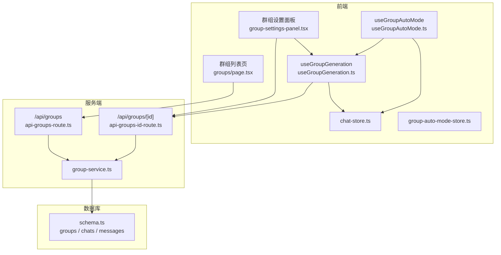
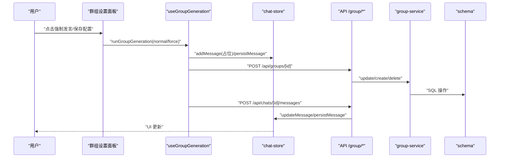
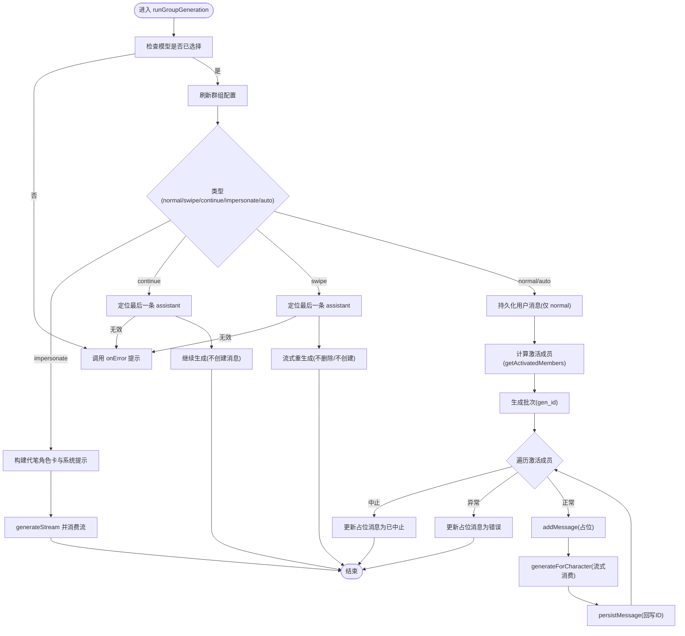
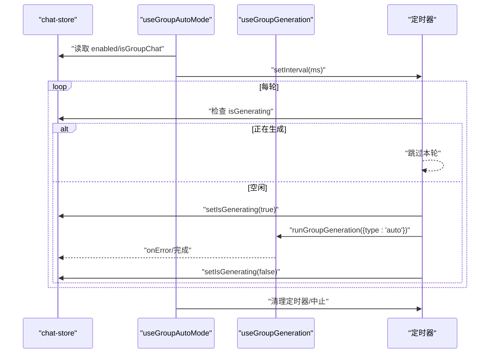
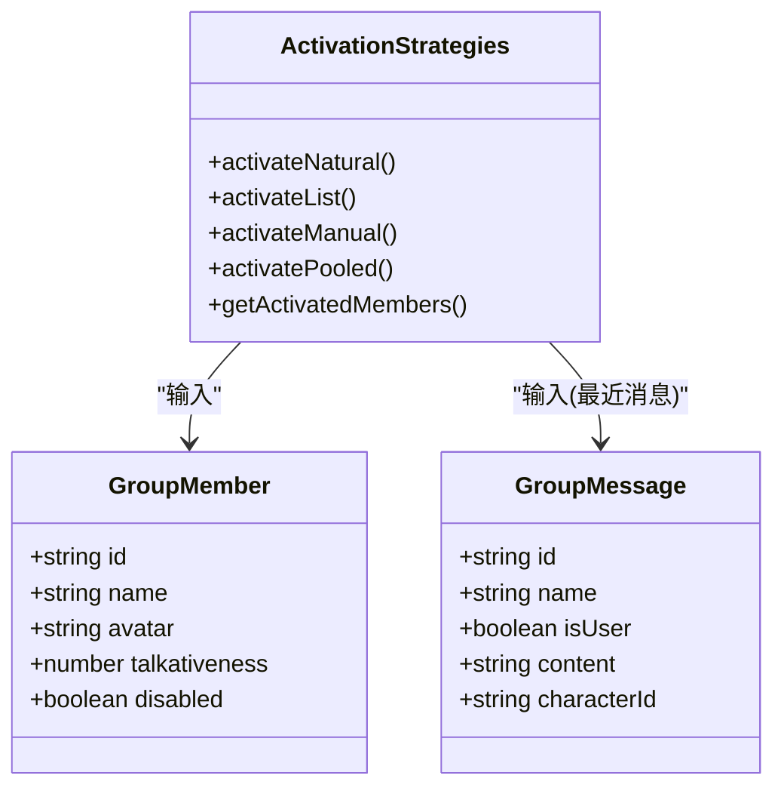
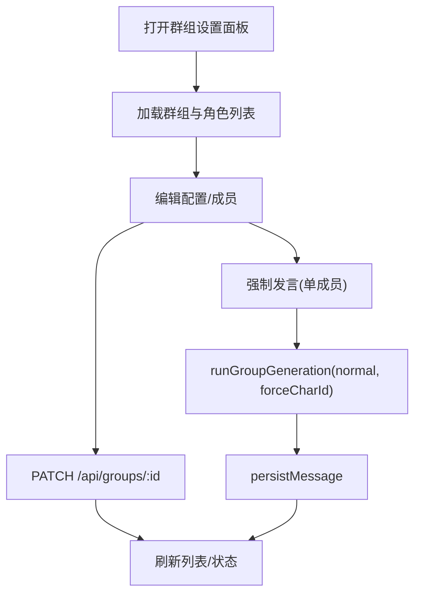
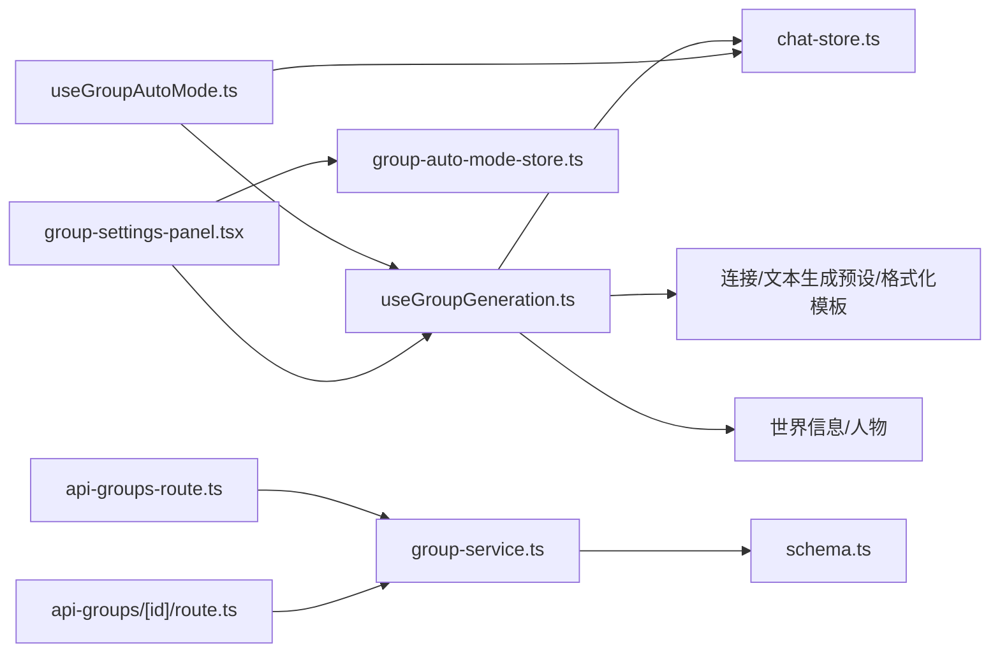
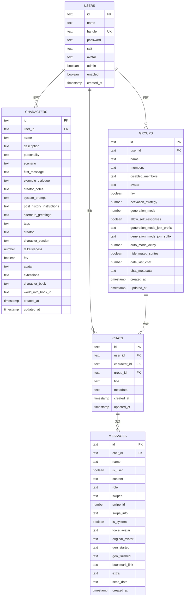

# 群组聊天系统

<cite>
**本文引用的文件**
- [useGroupGeneration.ts](file://src/hooks/useGroupGeneration.ts)
- [useGroupAutoMode.ts](file://src/hooks/useGroupAutoMode.ts)
- [activation.ts](file://src/lib/group-chat/activation.ts)
- [group-settings-panel.tsx](file://src/components/groups/group-settings-panel.tsx)
- [groups/page.tsx](file://src/app/groups/page.tsx)
- [chat-store.ts](file://src/stores/chat-store.ts)
- [group-auto-mode-store.ts](file://src/stores/group-auto-mode-store.ts)
- [group-service.ts](file://src/lib/services/group-service.ts)
- [schema.ts](file://src/lib/db/schema.ts)
- [index.ts](file://src/types/index.ts)
- [api-groups-route.ts](file://src/app/api/groups/route.ts)
- [api-groups-id-route.ts](file://src/app/api/groups/[id]/route.ts)
</cite>

## 目录
1. [简介](#简介)
2. [项目结构](#项目结构)
3. [核心组件](#核心组件)
4. [架构总览](#架构总览)
5. [详细组件分析](#详细组件分析)
6. [依赖关系分析](#依赖关系分析)
7. [性能考量](#性能考量)
8. [故障排查指南](#故障排查指南)
9. [结论](#结论)
10. [附录](#附录)

## 简介
本文件面向 SillyTavern Next 的群组聊天系统，提供从架构设计、多角色协作机制、并发生成策略到权限控制、消息同步与冲突解决的完整技术文档。重点解析 useGroupGeneration 与 useGroupAutoMode Hook 的实现原理，阐述群组成员管理、消息路由与自动/手动/混合模式的使用场景与配置方法，并给出配置示例与最佳实践。

## 项目结构
群组聊天系统围绕以下层次组织：
- 前端 Hook 层：useGroupGeneration、useGroupAutoMode 负责生成流程与自动模式调度
- 组件层：群组设置面板、群组列表页面负责用户交互与配置持久化
- 状态层：chat-store 管理当前聊天与消息容器；group-auto-mode-store 管理自动模式开关
- 服务层：group-service 提供群组 CRUD 与校验
- 数据层：Drizzle ORM schema 定义 groups、chats、messages 等表结构
- 类型层：统一定义 Chat、Character、Group、MessageExtra 等类型

图表来源
- [group-settings-panel.tsx](file://src/components/groups/group-settings-panel.tsx)
- [groups/page.tsx](file://src/app/groups/page.tsx)
- [useGroupGeneration.ts](file://src/hooks/useGroupGeneration.ts)
- [useGroupAutoMode.ts](file://src/hooks/useGroupAutoMode.ts)
- [chat-store.ts](file://src/stores/chat-store.ts)
- [group-auto-mode-store.ts](file://src/stores/group-auto-mode-store.ts)
- [api-groups-route.ts](file://src/app/api/groups/route.ts)
- [api-groups-id-route.ts](file://src/app/api/groups/[id]/route.ts)
- [group-service.ts](file://src/lib/services/group-service.ts)
- [schema.ts](file://src/lib/db/schema.ts)

章节来源
- [groups/page.tsx:36-261](file://src/app/groups/page.tsx#L36-L261)
- [group-settings-panel.tsx:32-318](file://src/components/groups/group-settings-panel.tsx#L32-L318)
- [useGroupGeneration.ts:59-738](file://src/hooks/useGroupGeneration.ts#L59-L738)
- [useGroupAutoMode.ts:17-62](file://src/hooks/useGroupAutoMode.ts#L17-L62)
- [chat-store.ts:105-583](file://src/stores/chat-store.ts#L105-L583)
- [group-auto-mode-store.ts:13-18](file://src/stores/group-auto-mode-store.ts#L13-L18)
- [api-groups-route.ts:5-34](file://src/app/api/groups/route.ts#L5-L34)
- [api-groups-id-route.ts:7-55](file://src/app/api/groups/[id]/route.ts#L7-L55)
- [group-service.ts:91-174](file://src/lib/services/group-service.ts#L91-L174)
- [schema.ts:103-168](file://src/lib/db/schema.ts#L103-L168)

## 核心组件
- useGroupGeneration：封装群组聊天的完整生成流程，包括用户消息持久化、激活策略计算、逐角色生成、流式更新与错误处理
- useGroupAutoMode：基于定时器的自动触发器，避免与进行中的生成冲突，支持 AbortController 中断
- 激活策略模块：提供自然、列表、手动、池化四种策略，决定“谁说话”
- 群组设置面板：提供群组配置、成员管理、强制发言、自动模式开关与延迟设置
- chat-store：统一管理当前聊天、消息容器、消息持久化与本地/服务端同步
- group-service 与 schema：提供群组 CRUD、Zod 校验与 SQLite 存储

章节来源
- [useGroupGeneration.ts:59-738](file://src/hooks/useGroupGeneration.ts#L59-L738)
- [useGroupAutoMode.ts:17-62](file://src/hooks/useGroupAutoMode.ts#L17-L62)
- [activation.ts:11-191](file://src/lib/group-chat/activation.ts#L11-L191)
- [group-settings-panel.tsx:114-214](file://src/components/groups/group-settings-panel.tsx#L114-L214)
- [chat-store.ts:105-583](file://src/stores/chat-store.ts#L105-L583)
- [group-service.ts:91-174](file://src/lib/services/group-service.ts#L91-L174)
- [schema.ts:103-168](file://src/lib/db/schema.ts#L103-L168)

## 架构总览
群组聊天采用“前端 Hook + 组件 + 状态 + 服务 + 数据库”的分层架构：
- 前端通过 useGroupGeneration 统一调度生成，内部调用 generateStream 并消费流式响应
- useGroupAutoMode 在后台定时触发生成，避免与进行中的生成冲突
- chat-store 负责消息容器与持久化，支持本地占位消息与服务端真实 ID 回写
- group-service 与 schema 实现群组数据的校验、存储与查询
- UI 通过群组设置面板与群组列表页完成配置与入口

图表来源
- [group-settings-panel.tsx:238-245](file://src/components/groups/group-settings-panel.tsx#L238-L245)
- [useGroupGeneration.ts:450-691](file://src/hooks/useGroupGeneration.ts#L450-L691)
- [chat-store.ts:235-351](file://src/stores/chat-store.ts#L235-L351)
- [api-groups-id-route.ts:18-37](file://src/app/api/groups/[id]/route.ts#L18-L37)
- [group-service.ts:133-159](file://src/lib/services/group-service.ts#L133-L159)
- [schema.ts:103-168](file://src/lib/db/schema.ts#L103-L168)

## 详细组件分析

### useGroupGeneration Hook 分析
- 功能职责
  - 管理群组与成员数据加载与缓存
  - 构建世界信息上下文、角色系统提示与历史消息
  - 基于激活策略计算“谁说话”，逐角色生成并流式更新
  - 支持 normal/swipe/continue/impersonate/auto 等多种模式
  - 截断跨角色生成，保证每条消息只属于当前角色
  - 与 chat-store 协作，实现本地占位消息与服务端真实 ID 回写

- 关键流程
  - 初始化与依赖注入：订阅 chat-store、连接配置、文本生成预设、格式化模板、人物与世界信息
  - 加载群组与成员：并行拉取 /api/groups/:id 与 /api/characters
  - 构建世界信息：聚合全局与群成员角色级世界书 ID
  - 生成模式处理：APPEND/APPEND_DISABLED 模式合并角色卡字段，SWAP 模式使用单角色卡
  - 历史构建：将他人发言标记为 system 角色，避免混淆
  - 逐角色生成：为每个激活成员创建占位消息，调用 generateStream 并消费流
  - 截断与持久化：检测其他角色名触发截断，最终持久化消息并回写 ID

- 错误处理与并发
  - 使用 AbortSignal 控制中止，中止时更新占位消息为“已中止”
  - 连续生成时捕获异常并提示，不影响其他成员
  - 通过 gen_id 批次标识，支持“重生”删除该批次消息并重跑

图表来源
- [useGroupGeneration.ts:450-691](file://src/hooks/useGroupGeneration.ts#L450-L691)
- [useGroupGeneration.ts:277-447](file://src/hooks/useGroupGeneration.ts#L277-L447)
- [activation.ts:169-190](file://src/lib/group-chat/activation.ts#L169-L190)

章节来源
- [useGroupGeneration.ts:59-738](file://src/hooks/useGroupGeneration.ts#L59-L738)

### useGroupAutoMode Hook 分析
- 行为概述
  - 仅在启用且当前为群组聊天时启动定时器
  - 每轮触发前检查 chat-store.isGenerating，避免与进行中的生成冲突
  - 使用独立 AbortController，关闭开关时立即中止
  - 读取 group.autoModeDelay 作为轮询间隔（秒）

图表来源
- [useGroupAutoMode.ts:24-60](file://src/hooks/useGroupAutoMode.ts#L24-L60)
- [chat-store.ts:152-152](file://src/stores/chat-store.ts#L152-L152)
- [useGroupGeneration.ts:450-691](file://src/hooks/useGroupGeneration.ts#L450-L691)

章节来源
- [useGroupAutoMode.ts:17-62](file://src/hooks/useGroupAutoMode.ts#L17-L62)
- [group-auto-mode-store.ts:13-18](file://src/stores/group-auto-mode-store.ts#L13-L18)

### 激活策略与生成模式
- 激活策略
  - 自然：扫描提及角色名、按健谈度随机、无人激活则随机高健谈者
  - 列表：按成员顺序全部轮流
  - 手动：不自动激活，需强制指定
  - 池化：避免重复，从未说话者中选，必要时排除上一个说话者
- 生成模式
  - 替换(SWAP)：逐角色独立卡生成
  - 追加(APPEND)：合并启用成员字段生成
  - 追加(禁用)(APPEND_DISABLED)：合并所有成员字段生成

图表来源
- [activation.ts:39-53](file://src/lib/group-chat/activation.ts#L39-L53)
- [activation.ts:66-190](file://src/lib/group-chat/activation.ts#L66-L190)

章节来源
- [activation.ts:11-191](file://src/lib/group-chat/activation.ts#L11-L191)

### 群组设置面板与成员管理
- 配置项
  - 名称、头像、激活策略、生成模式、允许自言自语、隐藏静音成员 sprites、自动模式开关与延迟
  - Join 前缀/后缀（APPEND 模式）
- 成员管理
  - 搜索、上下移动、启用/禁用、移除
  - 强制发言：对指定成员发起一次 normal 生成
- 数据持久化
  - PATCH /api/groups/:id 更新群组配置
  - 删除群组同时删除关联聊天

图表来源
- [group-settings-panel.tsx:43-68](file://src/components/groups/group-settings-panel.tsx#L43-L68)
- [group-settings-panel.tsx:238-245](file://src/components/groups/group-settings-panel.tsx#L238-L245)
- [api-groups-id-route.ts:18-37](file://src/app/api/groups/[id]/route.ts#L18-L37)

章节来源
- [group-settings-panel.tsx:114-214](file://src/components/groups/group-settings-panel.tsx#L114-L214)
- [group-settings-panel.tsx:216-284](file://src/components/groups/group-settings-panel.tsx#L216-L284)
- [group-settings-panel.tsx:287-318](file://src/components/groups/group-settings-panel.tsx#L287-L318)

### 群组列表页
- 功能
  - 创建群组：选择成员并提交
  - 打开群聊：加载或创建最近聊天并跳转首页
  - 删除群组：确认后删除并刷新
- 交互
  - 搜索角色、批量选择成员、展示成员数量与最后聊天时间

章节来源
- [groups/page.tsx:36-261](file://src/app/groups/page.tsx#L36-L261)

### 权限控制与消息同步
- 权限控制
  - 所有 /api/groups* 路由均通过 auth() 校验，未登录返回 401
- 消息同步与冲突解决
  - chat-store 在 persistMessage 成功后，若本地占位 ID 与服务端不同，自动回写真实 ID，避免分支/检查点错位
  - 生成过程中使用 AbortController 中止，占位消息更新为“已中止”
  - 重生操作按 gen_id 批次删除尾部消息，再重跑 normal

章节来源
- [api-groups-route.ts:5-12](file://src/app/api/groups/route.ts#L5-L12)
- [api-groups-id-route.ts:7-16](file://src/app/api/groups/[id]/route.ts#L7-L16)
- [chat-store.ts:257-266](file://src/stores/chat-store.ts#L257-L266)
- [useGroupGeneration.ts:694-728](file://src/hooks/useGroupGeneration.ts#L694-L728)

## 依赖关系分析
- 组件耦合
  - useGroupGeneration 依赖 chat-store、连接配置、文本生成预设、格式化模板、人物与世界信息
  - useGroupAutoMode 依赖 useGroupGeneration 与 chat-store 的 isGenerating 标志
  - 群组设置面板依赖 useGroupGeneration 与 group-auto-mode-store
- 外部依赖
  - generateStream 与 consumePlainTextStream/consumeTextgenStream 提供流式生成与消费
  - Drizzle ORM 与 SQLite 提供数据持久化
- 循环依赖
  - 未发现循环依赖；各模块职责清晰，通过 store 与 service 解耦

图表来源
- [useGroupGeneration.ts:8-28](file://src/hooks/useGroupGeneration.ts#L8-L28)
- [useGroupAutoMode.ts:12-20](file://src/hooks/useGroupAutoMode.ts#L12-L20)
- [group-settings-panel.tsx:10-14](file://src/components/groups/group-settings-panel.tsx#L10-L14)
- [api-groups-route.ts:1-3](file://src/app/api/groups/route.ts#L1-L3)
- [api-groups-id-route.ts:1-3](file://src/app/api/groups/[id]/route.ts#L1-L3)
- [group-service.ts:1-6](file://src/lib/services/group-service.ts#L1-L6)
- [schema.ts:103-168](file://src/lib/db/schema.ts#L103-L168)

章节来源
- [useGroupGeneration.ts:8-28](file://src/hooks/useGroupGeneration.ts#L8-L28)
- [useGroupAutoMode.ts:12-20](file://src/hooks/useGroupAutoMode.ts#L12-L20)
- [group-settings-panel.tsx:10-14](file://src/components/groups/group-settings-panel.tsx#L10-L14)
- [api-groups-route.ts:1-3](file://src/app/api/groups/route.ts#L1-L3)
- [api-groups-id-route.ts:1-3](file://src/app/api/groups/[id]/route.ts#L1-L3)
- [group-service.ts:1-6](file://src/lib/services/group-service.ts#L1-L6)
- [schema.ts:103-168](file://src/lib/db/schema.ts#L103-L168)

## 性能考量
- 并发生成
  - 逐角色串行生成，避免模型并发限制导致的资源争用
  - 使用 AbortController 控制中止，减少无效请求
- 流式更新
  - 通过 consumePlainTextStream/consumeTextgenStream 实时更新最后一条占位消息，降低 UI 刷新成本
- 数据同步
  - 本地占位消息与服务端真实 ID 回写，避免分支/检查点错位带来的二次请求
- 激活策略
  - 池化策略减少重复，提升轮转公平性；自然策略结合健谈度与随机，平衡多样性与可控性

## 故障排查指南
- 无法生成
  - 检查是否选择了模型；若未选择，Hook 会在 onError 中提示
  - 确认 isGenerating 标志未被占用（自动模式会设置为 true）
- 生成被中止
  - 查看占位消息是否显示“已中止”；可通过“重生”删除该批次消息并重跑
- 成员未发声
  - 检查激活策略与 allowSelfResponses 设置；手动策略不会自动激活
  - 确认成员未被禁用；禁用成员在 APPEND_DISABLED 模式下仍可能被合并
- 自动模式无效
  - 确认已启用自动模式且当前为群组聊天
  - 检查 autoModeDelay 是否合理（最小为 1 秒）

章节来源
- [useGroupGeneration.ts:453-456](file://src/hooks/useGroupGeneration.ts#L453-L456)
- [useGroupAutoMode.ts:33-33](file://src/hooks/useGroupAutoMode.ts#L33-L33)
- [activation.ts:179-189](file://src/lib/group-chat/activation.ts#L179-L189)

## 结论
群组聊天系统通过 useGroupGeneration 与 useGroupAutoMode 的协同，实现了灵活的多角色协作与自动触发机制。结合激活策略与生成模式，系统既支持自然对话，也支持可控的强制发言与池化轮转。通过 chat-store 的消息容器与持久化回写，确保了消息一致性与 UI 的实时反馈。建议在生产环境中合理配置自动模式延迟与激活策略，以获得更佳的用户体验与资源利用率。

## 附录

### 配置示例与最佳实践
- 自动模式
  - 场景：希望群组自动轮转发言，无需人工干预
  - 配置：启用自动模式，设置合理的 autoModeDelay（如 5-15 秒）
  - 注意：避免与高频生成冲突，关注 isGenerating 标志
- 手动模式
  - 场景：仅在用户明确指定时让特定角色发言
  - 配置：选择 Manual 激活策略，使用“强制发言”按钮
  - 注意：适合小规模讨论或需要严格控制节奏的场合
- 混合模式
  - 场景：自然触发 + 手动干预相结合
  - 配置：选择 Natural 激活策略，配合“强制发言”按钮
  - 注意：保持 allowSelfResponses 合理设置，避免角色连续发言造成混乱
- 生成模式
  - APPEND/APPEND_DISABLED：适合需要上下文融合的复杂对话
  - SWAP：适合强调角色个性与独立性的场景
- 成员管理
  - 使用池化策略时，建议定期清理长期未发声的成员，提升轮转效率
  - 对关键角色启用，避免被禁用影响整体对话质量

### 数据模型概览

图表来源
- [schema.ts:6-168](file://src/lib/db/schema.ts#L6-L168)