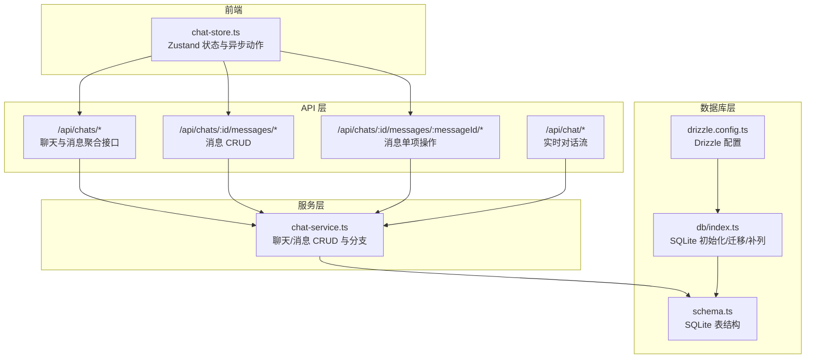
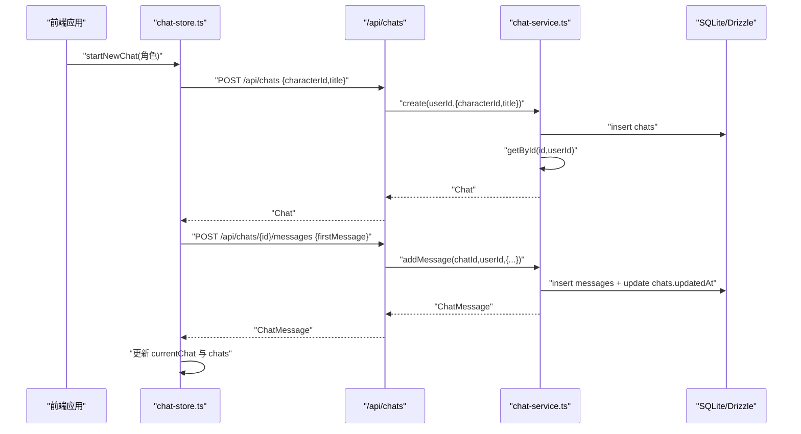
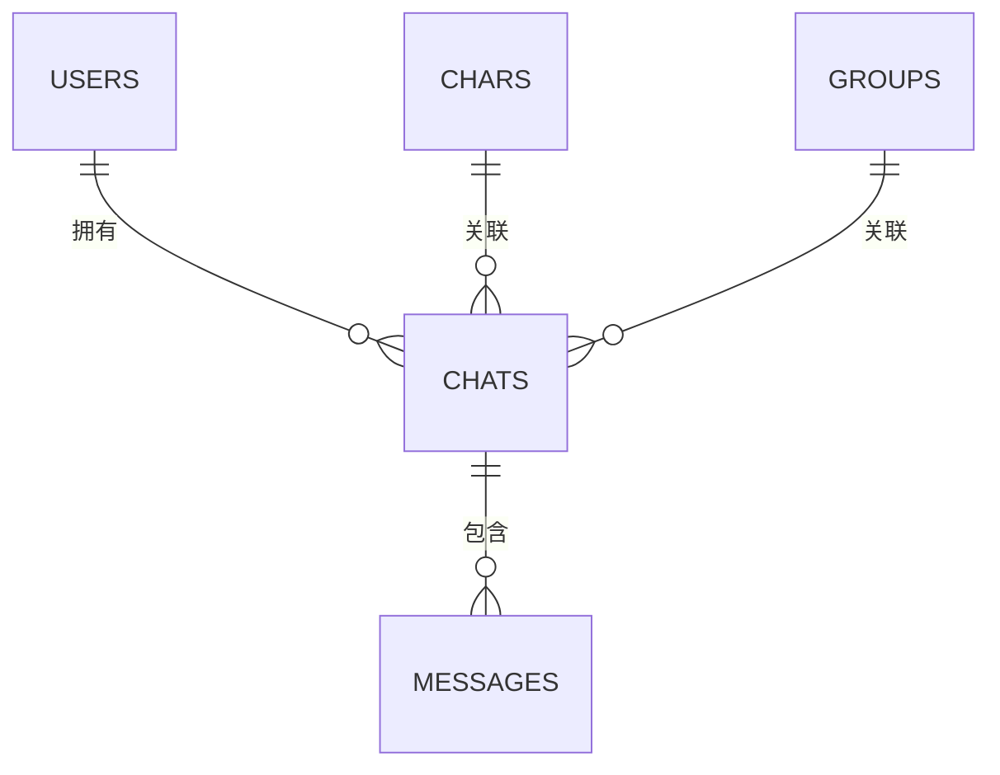
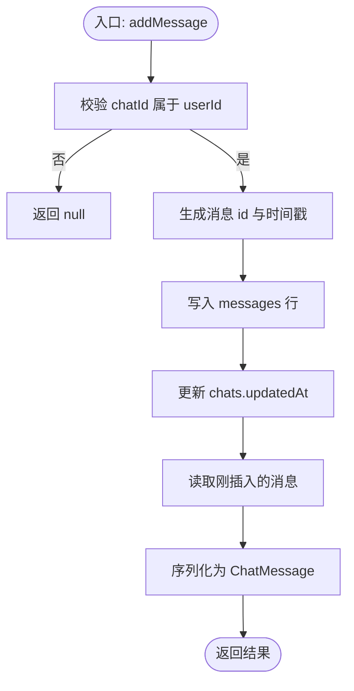
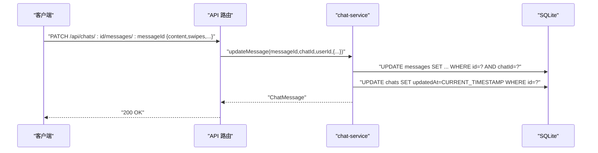
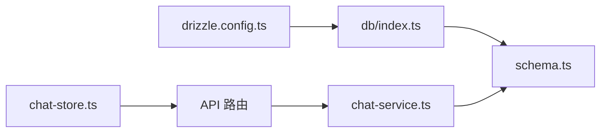

# 聊天历史管理

<cite>
**本文引用的文件**
- [schema.ts](file://src/lib/db/schema.ts)
- [index.ts](file://src/lib/db/index.ts)
- [chat-service.ts](file://src/lib/services/chat-service.ts)
- [chat-store.ts](file://src/stores/chat-store.ts)
- [index.ts](file://src/types/index.ts)
- [drizzle.config.ts](file://drizzle.config.ts)
- [route.ts](file://src/app/api/chats/route.ts)
- [route.ts](file://src/app/api/chats/[id]/route.ts)
- [route.ts](file://src/app/api/chats/[id]/messages/route.ts)
- [route.ts](file://src/app/api/chats/[id]/messages/[messageId]/route.ts)
- [route.ts](file://src/app/api/chats/[id]/branch/route.ts)
- [route.ts](file://src/app/api/chat/route.ts)
- [start.ts](file://scripts/start.ts)
</cite>

## 目录
1. [简介](#简介)
2. [项目结构](#项目结构)
3. [核心组件](#核心组件)
4. [架构总览](#架构总览)
5. [详细组件分析](#详细组件分析)
6. [依赖关系分析](#依赖关系分析)
7. [性能考量](#性能考量)
8. [故障排查指南](#故障排查指南)
9. [结论](#结论)
10. [附录](#附录)

## 简介
本文件面向 SillyTavern Next 的“聊天历史管理”子系统，系统性梳理了聊天会话与消息的历史存储结构、数据模型设计、数据库查询与更新流程、消息分页与无限滚动策略、备份恢复与迁移机制，以及面向开发者的 API 接口规范与使用示例。目标是帮助开发者快速理解并扩展历史管理能力。

## 项目结构
围绕聊天历史管理的关键目录与文件如下：
- 数据库层：schema 定义、Drizzle 配置、SQLite 初始化与迁移
- 业务服务层：聊天与消息 CRUD 服务
- API 层：Next.js App Router 路由，暴露聊天与消息的 REST 接口
- 前端状态层：Zustand store，封装本地状态与异步动作，协调与后端的持久化
- 类型定义：统一的消息、聊天、预设、世界设定等类型

图表来源
- [chat-store.ts:105-583](file://src/stores/chat-store.ts#L105-L583)
- [route.ts:1-45](file://src/app/api/chats/route.ts#L1-L45)
- [route.ts:1-65](file://src/app/api/chats/[id]/messages/route.ts#L1-L65)
- [route.ts:1-85](file://src/app/api/chats/[id]/messages/[messageId]/route.ts#L1-L85)
- [route.ts:1-37](file://src/app/api/chats/[id]/branch/route.ts#L1-L37)
- [route.ts:1-177](file://src/app/api/chat/route.ts#L1-L177)
- [chat-service.ts:60-301](file://src/lib/services/chat-service.ts#L60-L301)
- [schema.ts:129-168](file://src/lib/db/schema.ts#L129-L168)
- [index.ts:1-134](file://src/lib/db/index.ts#L1-L134)
- [drizzle.config.ts:1-11](file://drizzle.config.ts#L1-L11)

章节来源
- [schema.ts:129-168](file://src/lib/db/schema.ts#L129-L168)
- [index.ts:1-134](file://src/lib/db/index.ts#L1-L134)
- [drizzle.config.ts:1-11](file://drizzle.config.ts#L1-L11)

## 核心组件
- 数据模型与表结构
  - 聊天表 chats：记录会话维度的标题、元数据、角色/群组归属、时间戳
  - 消息表 messages：记录每条消息的内容、角色、是否用户、swipe 历史、生成时间、头像、额外信息等
- 服务层
  - chat-service：提供聊天列表、详情、创建、更新、删除；消息新增、更新、删除；分支复制
- API 层
  - /api/chats：列表与创建；/api/chats/:id：读取/更新/删除；/api/chats/:id/messages：消息列表与新增；/api/chats/:id/messages/:messageId：消息 PATCH/DELETE；/api/chats/:id/branch：从某消息开始分支
- 前端状态层
  - chat-store：封装本地状态、消息流式更新、消息重写/删除、消息移动、分支/书签、聊天重命名/删除、与后端的同步与乐观更新
- 类型系统
  - Chat、ChatMessage、MessageExtra、SwipeInfo 等类型定义，确保前后端一致性

章节来源
- [schema.ts:129-168](file://src/lib/db/schema.ts#L129-L168)
- [chat-service.ts:60-301](file://src/lib/services/chat-service.ts#L60-L301)
- [route.ts:1-45](file://src/app/api/chats/route.ts#L1-L45)
- [route.ts:1-65](file://src/app/api/chats/[id]/messages/route.ts#L1-L65)
- [route.ts:1-85](file://src/app/api/chats/[id]/messages/[messageId]/route.ts#L1-L85)
- [route.ts:1-37](file://src/app/api/chats/[id]/branch/route.ts#L1-L37)
- [chat-store.ts:15-103](file://src/stores/chat-store.ts#L15-L103)
- [index.ts:58-131](file://src/types/index.ts#L58-L131)

## 架构总览
下面的序列图展示了“创建新聊天并添加第一条消息”的完整流程，从前端 store 发起到后端服务与数据库持久化：

图表来源
- [chat-store.ts:168-209](file://src/stores/chat-store.ts#L168-L209)
- [route.ts:24-44](file://src/app/api/chats/route.ts#L24-L44)
- [route.ts:29-64](file://src/app/api/chats/[id]/messages/route.ts#L29-L64)
- [chat-service.ts:94-116](file://src/lib/services/chat-service.ts#L94-L116)
- [chat-service.ts:147-203](file://src/lib/services/chat-service.ts#L147-L203)

## 详细组件分析

### 数据模型与存储结构
- 聊天表 chats
  - 主键 id，外键 user_id，可选 character_id/group_id，title/metadata，时间戳 createdAt/updatedAt
- 消息表 messages
  - 主键 id，外键 chat_id（级联删除），name/isUser/role/content，swipes/swipeId/swipeInfo，isSystem，头像字段，生成时间，extra，sendDate，createdAt
- JSON 字段
  - metadata、extra、swipes、swipeInfo、characterBook、tags、alternateGreetings 等均以 JSON 文本存储，便于扩展与兼容旧格式

图表来源
- [schema.ts:6-16](file://src/lib/db/schema.ts#L6-L16)
- [schema.ts:21-53](file://src/lib/db/schema.ts#L21-L53)
- [schema.ts:103-126](file://src/lib/db/schema.ts#L103-L126)
- [schema.ts:131-140](file://src/lib/db/schema.ts#L131-L140)
- [schema.ts:145-168](file://src/lib/db/schema.ts#L145-L168)

章节来源
- [schema.ts:129-168](file://src/lib/db/schema.ts#L129-L168)

### 服务层：聊天与消息 CRUD
- 聊天
  - getAll：按用户过滤，支持按 characterId 或 groupId 过滤，按 updatedAt 降序
  - getById：读取聊天及其全部消息，按 createdAt 升序
  - create/update/delete：创建新会话、更新标题/元数据、删除会话（消息通过外键级联删除）
- 消息
  - addMessage：校验聊天归属，写入消息与初始 swipe 信息，更新聊天 updatedAt
  - updateMessage：支持 content/swipes/swipeId/swipeInfo/extra/isSystem/头像/生成时间/书签/createdAt 等增量更新
  - deleteMessage：校验聊天归属后删除
- 分支
  - branch：从某条消息开始复制到新聊天，包含分支点消息

图表来源
- [chat-service.ts:147-203](file://src/lib/services/chat-service.ts#L147-L203)

章节来源
- [chat-service.ts:60-301](file://src/lib/services/chat-service.ts#L60-L301)

### API 层：REST 接口与请求处理
- /api/chats
  - GET：按用户拉取聊天列表，支持 characterId/groupId 过滤
  - POST：创建新聊天
- /api/chats/:id
  - GET：读取单个聊天（含消息）
  - PATCH：更新标题/元数据
  - DELETE：删除聊天（消息级联删除）
- /api/chats/:id/messages
  - GET：获取聊天全部消息
  - POST：新增消息
- /api/chats/:id/messages/:messageId
  - PATCH：更新消息（内容、swipe、头像、生成时间、extra、createdAt 等）
  - DELETE：删除消息
- /api/chats/:id/branch
  - POST：从某消息开始分支复制

图表来源
- [route.ts:23-59](file://src/app/api/chats/[id]/messages/[messageId]/route.ts#L23-L59)
- [chat-service.ts:205-251](file://src/lib/services/chat-service.ts#L205-L251)

章节来源
- [route.ts:1-45](file://src/app/api/chats/route.ts#L1-L45)
- [route.ts:1-74](file://src/app/api/chats/[id]/route.ts#L1-L74)
- [route.ts:1-65](file://src/app/api/chats/[id]/messages/route.ts#L1-L65)
- [route.ts:1-85](file://src/app/api/chats/[id]/messages/[messageId]/route.ts#L1-L85)
- [route.ts:1-37](file://src/app/api/chats/[id]/branch/route.ts#L1-L37)

### 前端状态层：store 动作与同步策略
- 本地状态
  - currentChat、chats、currentCharacter、isGenerating
  - addMessage/updateLastMessage/patchMessage/removeMessageLocal/setIsGenerating/setCurrentCharacter/createNewChat
- 异步动作
  - startNewChat：调用 /api/chats 创建聊天，必要时注入第一条消息，刷新列表
  - loadChat/loadChatsForCharacter/loadChatsForGroup：拉取聊天与消息
  - persistMessage：新增消息并回填服务端 id
  - updateMessage：PATCH 消息，同步本地
  - deleteMessage：删除消息并本地移除
  - setActiveSwipe/appendSwipe/deleteSwipe：swipe 管理与持久化
  - setMessageHidden/moveMessage：隐藏与消息顺序调整
  - addEmptyReasoning/createBranch/createBookmark/renameChat/deleteChat：高级操作与乐观更新
- 与后端的交互
  - 所有动作均通过 fetch 调用 /api/*，错误时打印日志并回退本地状态

章节来源
- [chat-store.ts:15-583](file://src/stores/chat-store.ts#L15-L583)

### 实时对话流（开发用）
- /api/chat
  - 支持多提供商、温度、最大输出、停止序列、系统提示、世界设定集成、自定义 base_url/api_key
  - 使用 streamText 输出文本流响应
  - 世界设定通过 worldInfo 参数注入，支持 atDepth 插入

章节来源
- [route.ts:1-177](file://src/app/api/chat/route.ts#L1-L177)

## 依赖关系分析
- 数据库初始化与迁移
  - db/index.ts 在应用启动时自动执行迁移与“补列”策略，保证 schema 与现有数据库兼容
  - drizzle.config.ts 指定 schema 文件路径与输出目录
- 服务层依赖
  - chat-service 依赖 schema 与 drizzle ORM，负责序列化/反序列化 JSON 字段
- API 层依赖
  - 各路由依赖 chat-service 完成业务逻辑，统一鉴权与错误处理
- 前端依赖
  - chat-store 依赖类型定义与 API 路由，实现乐观更新与错误回退

图表来源
- [drizzle.config.ts:1-11](file://drizzle.config.ts#L1-L11)
- [index.ts:1-134](file://src/lib/db/index.ts#L1-L134)
- [schema.ts:1-240](file://src/lib/db/schema.ts#L1-L240)
- [chat-service.ts:1-301](file://src/lib/services/chat-service.ts#L1-L301)
- [route.ts:1-45](file://src/app/api/chats/route.ts#L1-L45)

章节来源
- [drizzle.config.ts:1-11](file://drizzle.config.ts#L1-L11)
- [index.ts:1-134](file://src/lib/db/index.ts#L1-L134)
- [schema.ts:1-240](file://src/lib/db/schema.ts#L1-L240)
- [chat-service.ts:1-301](file://src/lib/services/chat-service.ts#L1-L301)
- [route.ts:1-45](file://src/app/api/chats/route.ts#L1-L45)

## 性能考量
- 查询与索引
  - chats.updatedAt 降序查询用于“最近聊天列表”，建议在该列建立索引以提升排序效率
  - messages.chatId+createdAt 组合查询用于“按时间顺序加载消息”，建议建立复合索引
- JSON 字段
  - metadata/extra/swipes/swipeInfo 等以 JSON 存储，查询时注意避免全表扫描，必要时拆分或增加派生列
- 级联删除
  - messages.chatId 外键级联删除，删除聊天时无需手动清理消息，但需关注 WAL 模式下的事务一致性
- 流式响应
  - /api/chat 使用 streamText 输出流，适合长文本生成场景，减少首字节延迟
- 乐观更新
  - chat-store 对部分操作采用乐观更新（如 renameChat、setMessageHidden、moveMessage），减少往返延迟，失败时可回滚本地状态

章节来源
- [chat-service.ts:62-77](file://src/lib/services/chat-service.ts#L62-L77)
- [chat-service.ts:86-89](file://src/lib/services/chat-service.ts#L86-L89)
- [chat-store.ts:538-559](file://src/stores/chat-store.ts#L538-L559)
- [route.ts:158-170](file://src/app/api/chat/route.ts#L158-L170)

## 故障排查指南
- 权限与认证
  - 所有 API 路由均进行鉴权，未登录返回 401；若出现 401，请确认 NextAuth 会话有效
- 数据迁移与补列
  - 启动时自动执行迁移；若字段缺失，db/index.ts 会尝试幂等补列；若仍报错，请检查数据库文件权限与 WAL 文件
- 备份与回滚
  - 启动前自动备份数据库（含 -wal/-shm），保留最近若干份；迁移失败时可按控制台提示回滚
- 常见错误
  - 404：聊天或消息不存在（校验 chatId/消息 id 是否正确）
  - 400：请求体校验失败（检查字段类型与必填项）
  - 500：服务异常（查看控制台日志）

章节来源
- [route.ts:5-22](file://src/app/api/chats/route.ts#L5-L22)
- [route.ts:23-59](file://src/app/api/chats/[id]/messages/[messageId]/route.ts#L23-L59)
- [index.ts:16-134](file://src/lib/db/index.ts#L16-L134)
- [start.ts:24-95](file://scripts/start.ts#L24-L95)

## 结论
本系统以 SQLite + Drizzle 为核心，结合明确的数据模型、完善的 CRUD 服务与 REST API，以及前端 store 的乐观更新策略，实现了稳定高效的聊天历史管理。通过迁移与补列机制保障演进兼容，通过备份与回滚策略降低风险。未来可在查询索引、JSON 字段拆分与分页/无限滚动策略上进一步优化。

## 附录

### API 接口清单与使用示例

- 获取聊天列表
  - 方法：GET
  - 路径：/api/chats?characterId={id}&groupId={id}
  - 示例：GET /api/chats?characterId=abc
  - 返回：聊天数组（不含消息）
- 创建聊天
  - 方法：POST
  - 路径：/api/chats
  - 请求体：{ characterId?, groupId?, title?, metadata? }
  - 示例：POST /api/chats { "characterId":"abc","title":"新聊天" }
  - 返回：新聊天对象
- 获取单个聊天（含消息）
  - 方法：GET
  - 路径：/api/chats/:id
  - 示例：GET /api/chats/xyz
  - 返回：聊天对象（含 messages）
- 更新聊天
  - 方法：PATCH
  - 路径：/api/chats/:id
  - 请求体：{ title?, metadata? }
  - 示例：PATCH /api/chats/xyz { "title":"新标题" }
  - 返回：更新后的聊天
- 删除聊天
  - 方法：DELETE
  - 路径：/api/chats/:id
  - 示例：DELETE /api/chats/xyz
  - 返回：204 No Content
- 获取聊天消息列表
  - 方法：GET
  - 路径：/api/chats/:id/messages
  - 示例：GET /api/chats/xyz/messages
  - 返回：消息数组（按 createdAt 升序）
- 新增消息
  - 方法：POST
  - 路径：/api/chats/:id/messages
  - 请求体：{ name,isUser,role,content,extra?,isSystem?,forceAvatar?,originalAvatar?,genStarted?,genFinished? }
  - 示例：POST /api/chats/xyz/messages { "name":"助手","isUser":false,"role":"assistant","content":"你好" }
  - 返回：新增消息
- 更新消息
  - 方法：PATCH
  - 路径：/api/chats/:id/messages/:messageId
  - 请求体：{ content?,swipes?,swipeId?,swipeInfo?,extra?,isSystem?,forceAvatar?,originalAvatar?,genStarted?,genFinished?,bookmarkLink?,createdAt? }
  - 示例：PATCH /api/chats/xyz/messages/msg123 { "content":"更新内容" }
  - 返回：更新后的消息
- 删除消息
  - 方法：DELETE
  - 路径：/api/chats/:id/messages/:messageId
  - 示例：DELETE /api/chats/xyz/messages/msg123
  - 返回：204 No Content
- 从消息分支
  - 方法：POST
  - 路径：/api/chats/:id/branch
  - 请求体：{ messageId }
  - 示例：POST /api/chats/xyz/branch { "messageId":"msg123" }
  - 返回：新聊天对象（含分支点前的消息）

章节来源
- [route.ts:1-45](file://src/app/api/chats/route.ts#L1-L45)
- [route.ts:1-74](file://src/app/api/chats/[id]/route.ts#L1-L74)
- [route.ts:1-65](file://src/app/api/chats/[id]/messages/route.ts#L1-L65)
- [route.ts:1-85](file://src/app/api/chats/[id]/messages/[messageId]/route.ts#L1-L85)
- [route.ts:1-37](file://src/app/api/chats/[id]/branch/route.ts#L1-L37)

### 数据模型与类型参考
- Chat：id、userId、characterId、groupId、title、metadata、messages[]、createdAt、updatedAt
- ChatMessage：id、name、isUser、role、content、swipes[]、swipeId、swipeInfo[]、isSystem、头像字段、genStarted、genFinished、bookmarkLink、extra、sendDate、createdAt
- MessageExtra：生成批次、API/model/type、Token/推理统计、偏置/标题、媒体/附件、其他运行时状态等
- ChatMetadata：note_prompt、note_interval、note_position、chat_scenario、world_info_book_ids

章节来源
- [index.ts:58-131](file://src/types/index.ts#L58-L131)
- [index.ts:246-267](file://src/types/index.ts#L246-L267)

### 备份恢复与迁移机制
- 启动前备份
  - 自动复制主库与 WAL/SHM 文件，保留最近若干份
- 迁移执行
  - 使用 drizzle-kit migrate 执行迁移；失败时按提示回滚
- 补列策略
  - 启动时检测并补全缺失列，避免因迁移文件滞后导致 500

章节来源
- [start.ts:24-95](file://scripts/start.ts#L24-L95)
- [index.ts:16-134](file://src/lib/db/index.ts#L16-L134)