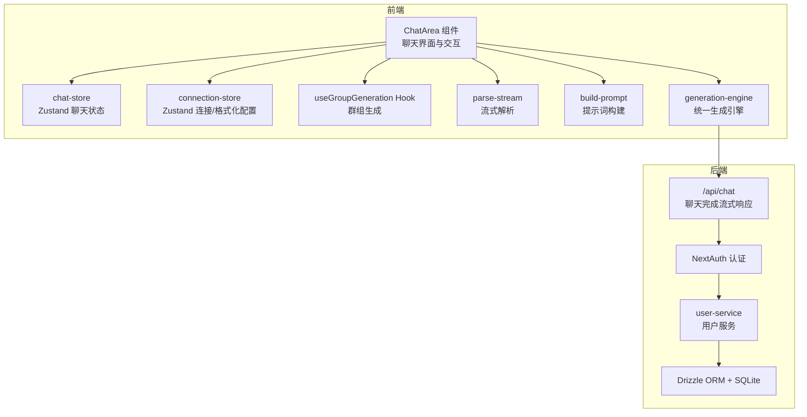
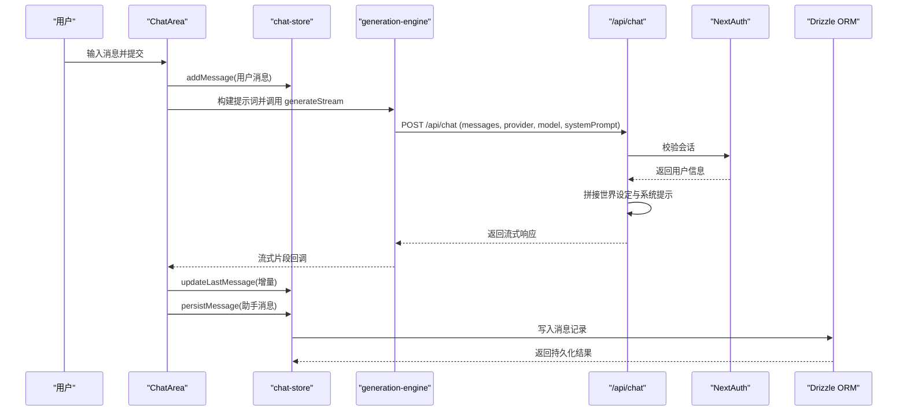
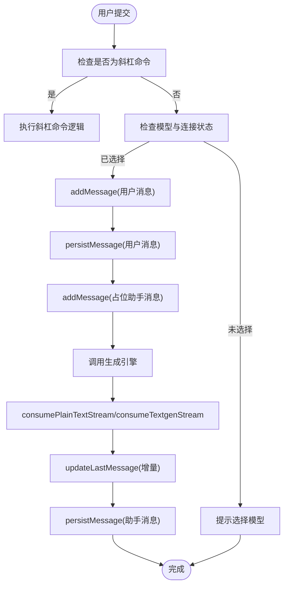
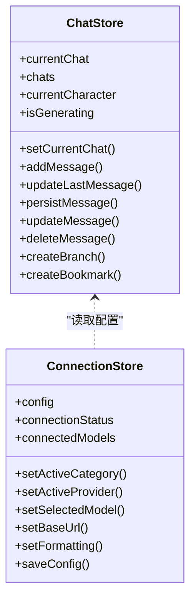
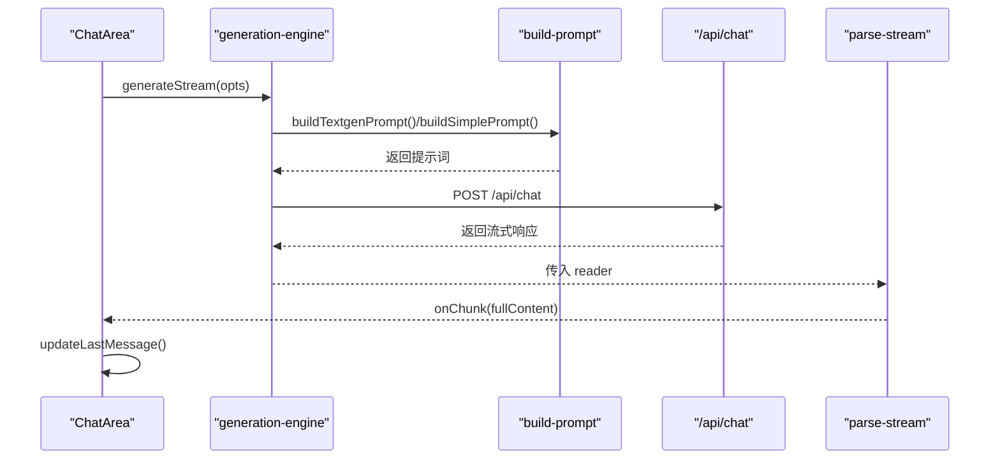
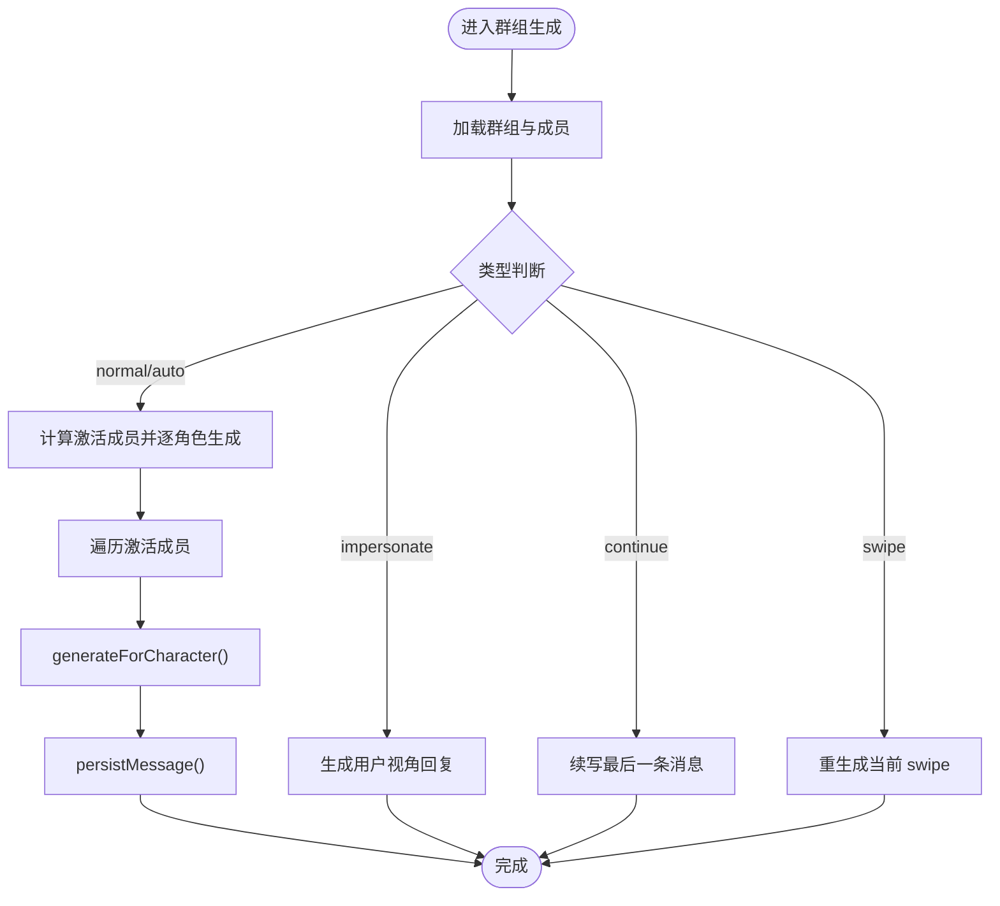
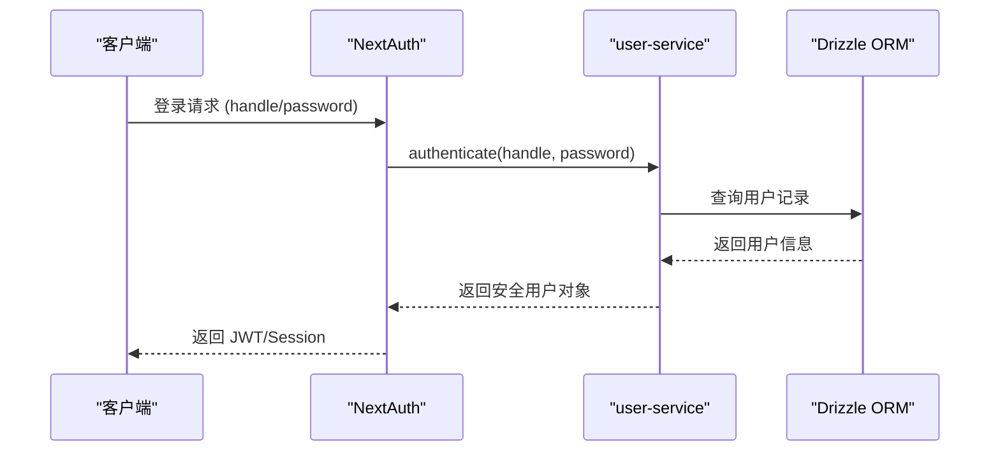
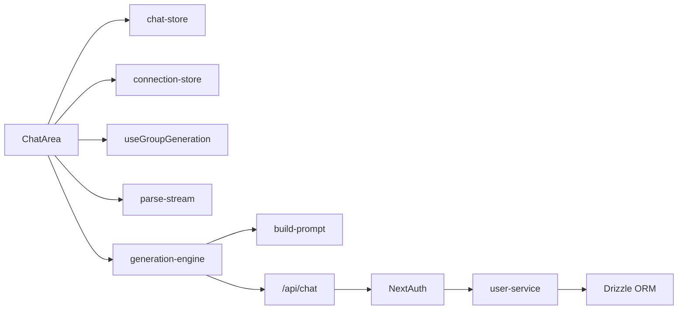

# 聊天引擎架构

<cite>
**本文引用的文件**
- [src/components/chat/chat-area.tsx](file://src/components/chat/chat-area.tsx)
- [src/stores/chat-store.ts](file://src/stores/chat-store.ts)
- [src/lib/stores/connection-store.ts](file://src/lib/stores/connection-store.ts)
- [src/hooks/useGroupGeneration.ts](file://src/hooks/useGroupGeneration.ts)
- [src/lib/textgen/parse-stream.ts](file://src/lib/textgen/parse-stream.ts)
- [src/app/api/chat/route.ts](file://src/app/api/chat/route.ts)
- [src/lib/generation/engine.ts](file://src/lib/generation/engine.ts)
- [src/lib/formatting/build-prompt.ts](file://src/lib/formatting/build-prompt.ts)
- [src/lib/auth.ts](file://src/lib/auth.ts)
- [src/lib/services/user-service.ts](file://src/lib/services/user-service.ts)
- [src/lib/db/index.ts](file://src/lib/db/index.ts)
- [src/types/index.ts](file://src/types/index.ts)
- [package.json](file://package.json)
</cite>

## 目录
1. [引言](#引言)
2. [项目结构](#项目结构)
3. [核心组件](#核心组件)
4. [架构总览](#架构总览)
5. [详细组件分析](#详细组件分析)
6. [依赖分析](#依赖分析)
7. [性能考虑](#性能考虑)
8. [故障排查指南](#故障排查指南)
9. [结论](#结论)
10. [附录](#附录)

## 引言
本文件面向 SillyTavern Next 的聊天引擎，系统性梳理其整体架构、核心组件关系与数据流向，重点覆盖以下方面：
- ChatArea 组件的设计模式、状态管理策略与组件通信机制
- 聊天引擎如何集成 Zustand 状态管理、NextAuth 认证系统与 Drizzle ORM 数据库
- 初始化流程、事件处理机制与错误处理策略
- 通过架构图与序列图帮助开发者快速理解系统运行原理

## 项目结构
SillyTavern Next 采用 Next.js App Router 结构，前端以组件与状态管理为核心，后端以 API 路由与 Drizzle ORM 数据库为支撑。聊天引擎的关键目录与文件如下：
- 前端组件与状态
  - src/components/chat/chat-area.tsx：聊天主界面与交互逻辑
  - src/stores/chat-store.ts：Zustand 聊天状态管理
  - src/lib/stores/connection-store.ts：Zustand 连接与格式化配置
  - src/hooks/useGroupGeneration.ts：群组聊天生成 Hook
  - src/lib/textgen/parse-stream.ts：文本补全流式解析
  - src/lib/formatting/build-prompt.ts：高级格式化与提示词构建
  - src/lib/generation/engine.ts：统一生成引擎（单聊/群聊共用）
- 后端 API 与认证
  - src/app/api/chat/route.ts：聊天完成流式响应 API
  - src/lib/auth.ts 与 src/lib/services/user-service.ts：NextAuth 与用户服务
  - src/lib/db/index.ts：Drizzle ORM 与 SQLite 数据库初始化
- 类型定义
  - src/types/index.ts：核心类型（消息、角色、聊天、群组、世界设定等）

**图表来源**
- [src/components/chat/chat-area.tsx](file://src/components/chat/chat-area.tsx)
- [src/stores/chat-store.ts](file://src/stores/chat-store.ts)
- [src/lib/stores/connection-store.ts](file://src/lib/stores/connection-store.ts)
- [src/hooks/useGroupGeneration.ts](file://src/hooks/useGroupGeneration.ts)
- [src/lib/textgen/parse-stream.ts](file://src/lib/textgen/parse-stream.ts)
- [src/lib/generation/engine.ts](file://src/lib/generation/engine.ts)
- [src/app/api/chat/route.ts](file://src/app/api/chat/route.ts)
- [src/lib/auth.ts](file://src/lib/auth.ts)
- [src/lib/services/user-service.ts](file://src/lib/services/user-service.ts)
- [src/lib/db/index.ts](file://src/lib/db/index.ts)

**章节来源**
- [src/components/chat/chat-area.tsx](file://src/components/chat/chat-area.tsx)
- [src/stores/chat-store.ts](file://src/stores/chat-store.ts)
- [src/lib/stores/connection-store.ts](file://src/lib/stores/connection-store.ts)
- [src/hooks/useGroupGeneration.ts](file://src/hooks/useGroupGeneration.ts)
- [src/lib/textgen/parse-stream.ts](file://src/lib/textgen/parse-stream.ts)
- [src/lib/generation/engine.ts](file://src/lib/generation/engine.ts)
- [src/app/api/chat/route.ts](file://src/app/api/chat/route.ts)
- [src/lib/auth.ts](file://src/lib/auth.ts)
- [src/lib/services/user-service.ts](file://src/lib/services/user-service.ts)
- [src/lib/db/index.ts](file://src/lib/db/index.ts)
- [src/types/index.ts](file://src/types/index.ts)

## 核心组件
- ChatArea 组件
  - 负责聊天界面渲染、输入处理、斜杠命令、搜索与多选、附件上传、消息滚动与流式接收
  - 通过 useChatStore 与 useConnectionStore 等状态源进行数据与配置读取
  - 通过 useGroupGeneration Hook 实现群组聊天的多角色生成
- Zustand 状态管理
  - chat-store：聊天生命周期（创建、加载、消息持久化、分支、书签、重生成等）
  - connection-store：API 类别、提供商、模型、基础 URL、格式化配置与连接状态
- 生成引擎
  - generation-engine：统一 text completion 与 chat completion 的调用入口
  - build-prompt：高级格式化（宏替换、停用词、Instruct/简单模式拼接）
  - parse-stream：SSE/NDJSON/纯文本流式解析
- 认证与数据库
  - NextAuth：基于 Credentials Provider 的认证流程
  - Drizzle ORM + SQLite：数据库初始化与迁移、用户与聊天数据存取

**章节来源**
- [src/components/chat/chat-area.tsx](file://src/components/chat/chat-area.tsx)
- [src/stores/chat-store.ts](file://src/stores/chat-store.ts)
- [src/lib/stores/connection-store.ts](file://src/lib/stores/connection-store.ts)
- [src/lib/generation/engine.ts](file://src/lib/generation/engine.ts)
- [src/lib/formatting/build-prompt.ts](file://src/lib/formatting/build-prompt.ts)
- [src/lib/textgen/parse-stream.ts](file://src/lib/textgen/parse-stream.ts)
- [src/lib/auth.ts](file://src/lib/auth.ts)
- [src/lib/services/user-service.ts](file://src/lib/services/user-service.ts)
- [src/lib/db/index.ts](file://src/lib/db/index.ts)

## 架构总览
聊天引擎采用“前端组件 + Zustand 状态 + 生成引擎 + 后端 API”的分层架构：
- 前端层：ChatArea 负责 UI 与交互，useGroupGeneration 封装群组生成流程
- 状态层：Zustand 管理聊天、连接与格式化配置，提供本地与异步持久化动作
- 生成层：engine 负责提示词构建与 API 调用，parse-stream 负责流式解析
- 后端层：/api/chat 提供流式响应，NextAuth 进行认证，Drizzle ORM 访问 SQLite

**图表来源**
- [src/components/chat/chat-area.tsx](file://src/components/chat/chat-area.tsx)
- [src/stores/chat-store.ts](file://src/stores/chat-store.ts)
- [src/lib/generation/engine.ts](file://src/lib/generation/engine.ts)
- [src/app/api/chat/route.ts](file://src/app/api/chat/route.ts)
- [src/lib/auth.ts](file://src/lib/auth.ts)
- [src/lib/db/index.ts](file://src/lib/db/index.ts)

## 详细组件分析

### ChatArea 组件分析
- 设计模式
  - 命令式与声明式结合：通过 useState/useEffect 管理 UI 状态与副作用，通过 useChatStore/useConnectionStore 管理业务状态
  - Hook 复用：useGroupGeneration 将群组生成逻辑抽离，便于复用与测试
- 状态管理策略
  - 本地即时状态：输入框、滚动位置、搜索与多选状态
  - 业务状态：消息列表、生成状态、附件、@ 提及等
  - 与 Zustand 的协作：通过 addMessage/updateLastMessage/persistMessage 等动作与 store 同步
- 组件通信机制
  - ChatArea 与 chat-store：动作调用与状态订阅
  - ChatArea 与 connection-store：读取 activeCategory/activeProvider/activeModel/baseUrl/formatting
  - ChatArea 与 useGroupGeneration：在群组聊天时走统一生成流程
  - ChatArea 与 parse-stream：流式解析并增量更新 UI
- 事件处理与错误处理
  - 提交事件：handleSubmit 中处理斜杠命令、连接状态检查、流式接收与错误捕获
  - 停止生成：AbortController 中断请求
  - 错误处理：统一捕获异常并更新最后一条消息为错误提示

**图表来源**
- [src/components/chat/chat-area.tsx](file://src/components/chat/chat-area.tsx)
- [src/lib/textgen/parse-stream.ts](file://src/lib/textgen/parse-stream.ts)
- [src/stores/chat-store.ts](file://src/stores/chat-store.ts)

**章节来源**
- [src/components/chat/chat-area.tsx](file://src/components/chat/chat-area.tsx)
- [src/stores/chat-store.ts](file://src/stores/chat-store.ts)
- [src/lib/textgen/parse-stream.ts](file://src/lib/textgen/parse-stream.ts)

### Zustand 状态管理（chat-store 与 connection-store）
- chat-store
  - 负责聊天生命周期：创建新聊天、加载聊天、加载角色/群组聊天列表、消息持久化与更新、删除、分支与书签、重命名、移动消息、推理块、swipe 系统等
  - 异步动作通过 fetch 调用后端 API，成功后同步本地状态
- connection-store
  - 负责 API 类别切换、提供商与模型选择、基础 URL、自动连接、代理配置、格式化全局设置
  - 通过 saveConfig 持久化配置到后端 /api/settings

**图表来源**
- [src/stores/chat-store.ts](file://src/stores/chat-store.ts)
- [src/lib/stores/connection-store.ts](file://src/lib/stores/connection-store.ts)

**章节来源**
- [src/stores/chat-store.ts](file://src/stores/chat-store.ts)
- [src/lib/stores/connection-store.ts](file://src/lib/stores/connection-store.ts)

### 生成引擎与提示词构建
- generation-engine
  - 统一入口 generateStream：根据 activeCategory 选择 text completion 或 chat completion
  - callTextCompletionAPI/callChatCompletionAPI：分别调用 /api/text-completions/generate 或 /api/chat
  - buildTextgenPrompt/buildSimplePrompt：基于高级格式化模板与宏构建提示词
- build-prompt
  - 宏替换 replaceMacros：支持 {{user}}/{{char}}/{{persona}} 等静态与动态宏
  - collectStopStrings：收集停用词（自定义、名称、序列等）
  - Instruct/简单模式拼接：renderMessage 与 buildInstructPrompt/buildSimplePrompt
- parse-stream
  - consumeTextgenStream：兼容多种后端的 SSE/NDJSON/JSONL 流式解析
  - consumePlainTextStream：/api/chat 的纯文本流式解析

**图表来源**
- [src/lib/generation/engine.ts](file://src/lib/generation/engine.ts)
- [src/lib/formatting/build-prompt.ts](file://src/lib/formatting/build-prompt.ts)
- [src/app/api/chat/route.ts](file://src/app/api/chat/route.ts)
- [src/lib/textgen/parse-stream.ts](file://src/lib/textgen/parse-stream.ts)

**章节来源**
- [src/lib/generation/engine.ts](file://src/lib/generation/engine.ts)
- [src/lib/formatting/build-prompt.ts](file://src/lib/formatting/build-prompt.ts)
- [src/lib/textgen/parse-stream.ts](file://src/lib/textgen/parse-stream.ts)

### 群组聊天生成（useGroupGeneration）
- 功能概述
  - 读取当前聊天的 groupId，加载群组与成员信息
  - 根据激活策略（自然/列表/手动/池化）选择成员
  - 逐角色生成消息，支持续写、重生成、代笔（impersonate）
  - 截断其他角色的对话，保证只生成当前角色内容
- 关键流程
  - runGroupGeneration：根据类型（normal/swipe/continue/impersonate/auto）执行不同流程
  - generateForCharacter：为单个角色构建历史与系统提示，调用 generateStream
  - runGroupRegenerate：删除当前批次消息并重新生成

**图表来源**
- [src/hooks/useGroupGeneration.ts](file://src/hooks/useGroupGeneration.ts)

**章节来源**
- [src/hooks/useGroupGeneration.ts](file://src/hooks/useGroupGeneration.ts)

### 认证系统（NextAuth）与数据库（Drizzle ORM）
- NextAuth
  - 基于 Credentials Provider 的登录流程，校验用户凭据并通过 userService.authenticate 获取用户信息
  - JWT 与 Session 回调将用户信息写入 token 与 session
- 用户服务与数据库
  - userService：用户认证、创建、更新、密码变更、删除
  - db/index：初始化 SQLite 数据库与 Drizzle ORM，自动迁移与字段幂等补齐
- API 层认证
  - /api/chat 路由通过 auth() 获取会话，未授权返回 401

**图表来源**
- [src/lib/auth.ts](file://src/lib/auth.ts)
- [src/lib/services/user-service.ts](file://src/lib/services/user-service.ts)
- [src/lib/db/index.ts](file://src/lib/db/index.ts)

**章节来源**
- [src/lib/auth.ts](file://src/lib/auth.ts)
- [src/lib/services/user-service.ts](file://src/lib/services/user-service.ts)
- [src/lib/db/index.ts](file://src/lib/db/index.ts)
- [src/app/api/chat/route.ts](file://src/app/api/chat/route.ts)

## 依赖分析
- 外部依赖
  - ai：提供 streamText 与流式响应能力
  - next-auth：NextAuth v5 认证
  - drizzle-orm + better-sqlite3：ORM 与 SQLite
  - zustand：轻量状态管理
  - react、next：前端框架
- 内部模块耦合
  - ChatArea 依赖 chat-store、connection-store、useGroupGeneration、parse-stream、build-prompt、generation-engine
  - generation-engine 依赖 build-prompt 与 API 路由
  - API 路由依赖 NextAuth、secrets 与 worldinfo 服务

**图表来源**
- [src/components/chat/chat-area.tsx](file://src/components/chat/chat-area.tsx)
- [src/stores/chat-store.ts](file://src/stores/chat-store.ts)
- [src/lib/stores/connection-store.ts](file://src/lib/stores/connection-store.ts)
- [src/hooks/useGroupGeneration.ts](file://src/hooks/useGroupGeneration.ts)
- [src/lib/textgen/parse-stream.ts](file://src/lib/textgen/parse-stream.ts)
- [src/lib/generation/engine.ts](file://src/lib/generation/engine.ts)
- [src/lib/formatting/build-prompt.ts](file://src/lib/formatting/build-prompt.ts)
- [src/app/api/chat/route.ts](file://src/app/api/chat/route.ts)
- [src/lib/auth.ts](file://src/lib/auth.ts)
- [src/lib/services/user-service.ts](file://src/lib/services/user-service.ts)
- [src/lib/db/index.ts](file://src/lib/db/index.ts)

**章节来源**
- [package.json](file://package.json)
- [src/components/chat/chat-area.tsx](file://src/components/chat/chat-area.tsx)
- [src/stores/chat-store.ts](file://src/stores/chat-store.ts)
- [src/lib/stores/connection-store.ts](file://src/lib/stores/connection-store.ts)
- [src/hooks/useGroupGeneration.ts](file://src/hooks/useGroupGeneration.ts)
- [src/lib/textgen/parse-stream.ts](file://src/lib/textgen/parse-stream.ts)
- [src/lib/generation/engine.ts](file://src/lib/generation/engine.ts)
- [src/lib/formatting/build-prompt.ts](file://src/lib/formatting/build-prompt.ts)
- [src/app/api/chat/route.ts](file://src/app/api/chat/route.ts)
- [src/lib/auth.ts](file://src/lib/auth.ts)
- [src/lib/services/user-service.ts](file://src/lib/services/user-service.ts)
- [src/lib/db/index.ts](file://src/lib/db/index.ts)

## 性能考虑
- 流式渲染
  - 通过 consumeTextgenStream/consumePlainTextStream 增量更新 UI，减少首 Token 延迟与内存占用
- 状态最小化
  - chat-store 仅在必要时更新消息列表，避免不必要的重渲染
- 群组生成优化
  - useGroupGeneration 在生成前计算激活成员，避免无效请求
- 数据库幂等
  - db/index 在迁移后进行字段幂等补齐，降低迁移失败风险

## 故障排查指南
- 生成失败
  - ChatArea：捕获异常并在最后一条消息中显示错误提示
  - generation-engine：根据 activeCategory 选择 text completion 或 chat completion，确认 provider/model 配置
- 认证问题
  - /api/chat 返回 401：确认 NextAuth 会话有效，检查 credentials 凭据
  - user-service：密码哈希与验证逻辑，确认盐值与 scrypt 配置
- 数据库问题
  - db/index：迁移失败或字段缺失，检查 migrations 文件与幂等补齐逻辑

**章节来源**
- [src/components/chat/chat-area.tsx](file://src/components/chat/chat-area.tsx)
- [src/lib/generation/engine.ts](file://src/lib/generation/engine.ts)
- [src/app/api/chat/route.ts](file://src/app/api/chat/route.ts)
- [src/lib/services/user-service.ts](file://src/lib/services/user-service.ts)
- [src/lib/db/index.ts](file://src/lib/db/index.ts)

## 结论
SillyTavern Next 的聊天引擎以组件化与状态管理为核心，通过统一的生成引擎与流式解析实现高效、稳定的聊天体验。Zustand 提供轻量的状态管理，NextAuth 保障认证安全，Drizzle ORM 确保数据一致性。群组聊天通过 useGroupGeneration Hook 实现灵活的激活策略与多角色生成，满足复杂场景需求。

## 附录
- 类型定义概览
  - ChatMessage：消息结构（含 swipe、extra、头像等）
  - Character/Chat/Group：角色、聊天与群组结构
  - WorldInfo：世界设定词条与设置
  - GenerationSettings/Preset：生成设置与预设

**章节来源**
- [src/types/index.ts](file://src/types/index.ts)