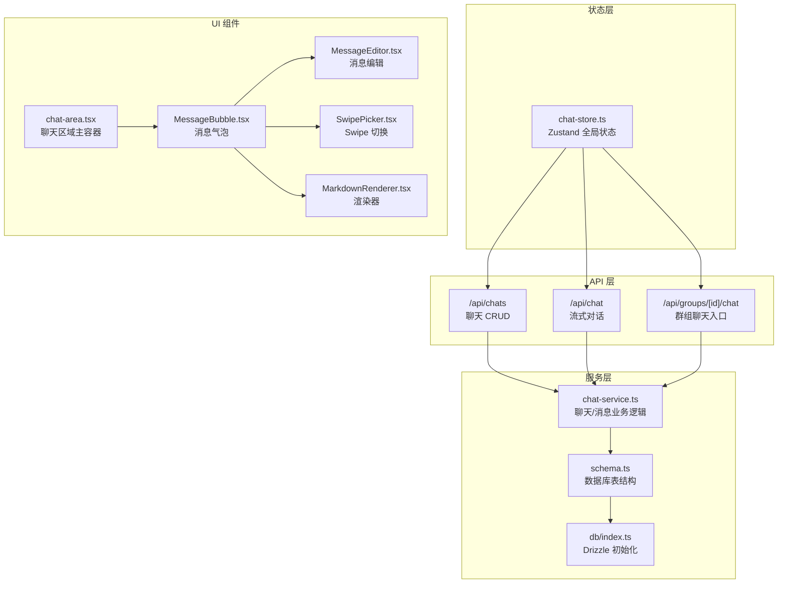
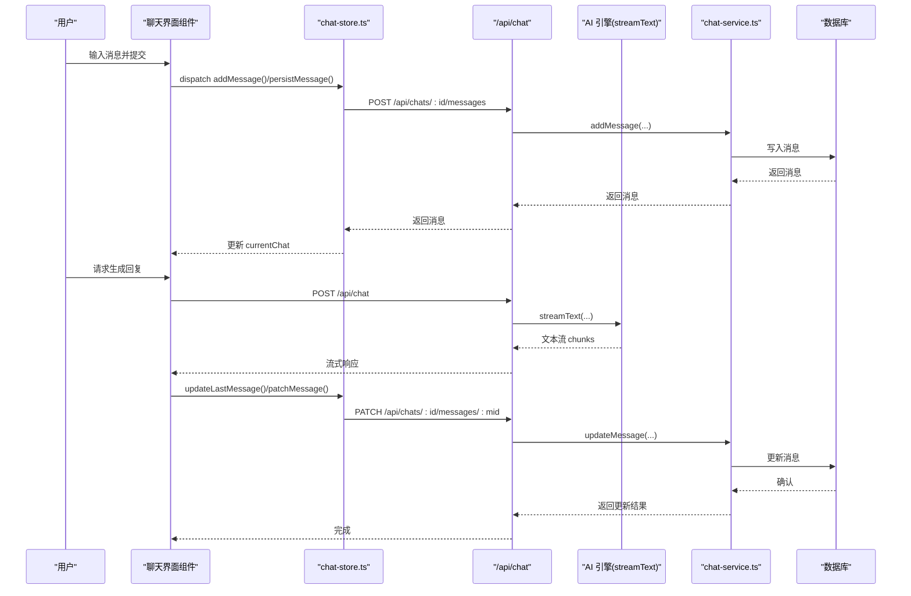
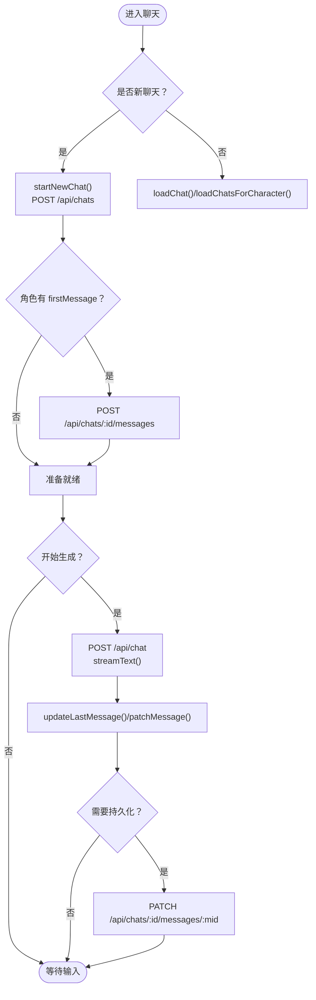
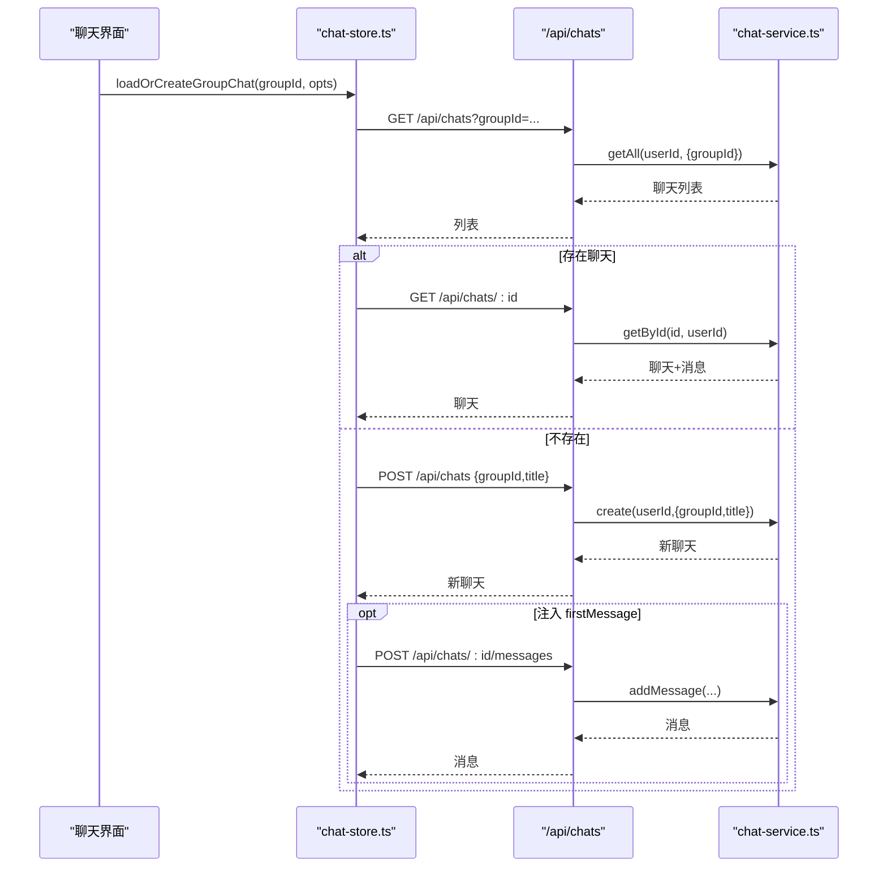
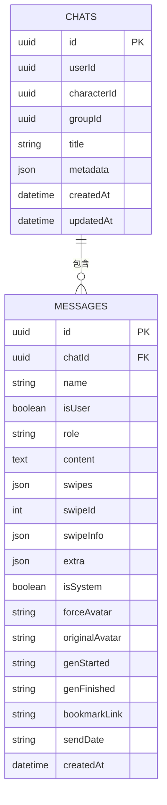
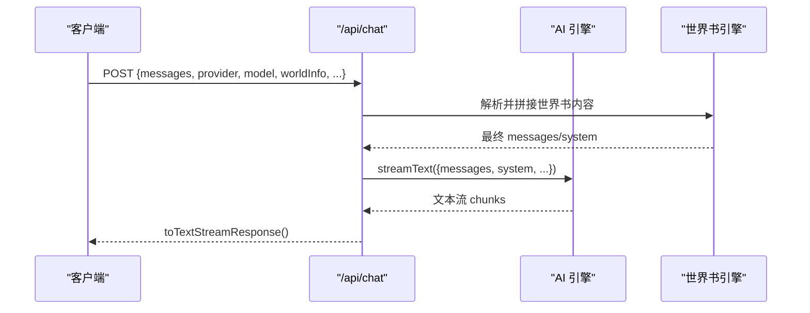
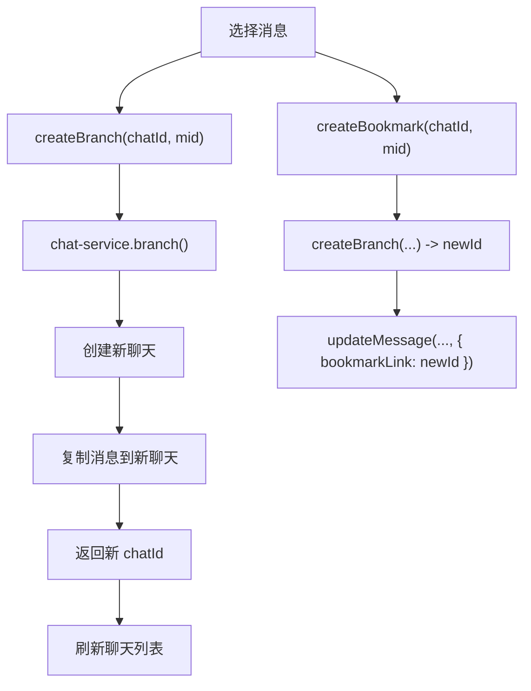
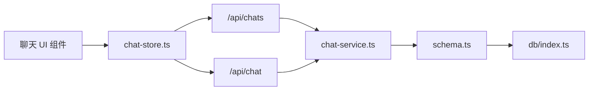

# 聊天系统

<cite>
**本文引用的文件**
- [README.md](file://README.md)
- [chat-store.ts](file://src/stores/chat-store.ts)
- [route.ts](file://src/app/api/chat/route.ts)
- [route.ts](file://src/app/api/chats/route.ts)
- [chat-service.ts](file://src/lib/services/chat-service.ts)
- [schema.ts](file://src/lib/db/schema.ts)
- [index.ts](file://src/lib/db/index.ts)
- [chat-area.tsx](file://src/components/chat/chat-area.tsx)
- [MarkdownRenderer.tsx](file://src/components/chat/markdown/MarkdownRenderer.tsx)
- [MessageBubble.tsx](file://src/components/chat/message-bubble/MessageBubble.tsx)
- [MessageBody.tsx](file://src/components/chat/message-bubble/MessageBody.tsx)
- [MessageEditor.tsx](file://src/components/chat/message-bubble/MessageEditor.tsx)
- [MessageButtons.tsx](file://src/components/chat/message-bubble/MessageButtons.tsx)
- [MessageHeader.tsx](file://src/components/chat/message-bubble/MessageHeader.tsx)
- [MessageReasoning.tsx](file://src/components/chat/message-bubble/MessageReasoning.tsx)
- [SwipePicker.tsx](file://src/components/chat/message-bubble/SwipePicker.tsx)
- [SwipeArrows.tsx](file://src/components/chat/message-bubble/SwipeArrows.tsx)
- [ChatMultiSelect.tsx](file://src/components/chat/ChatMultiSelect.tsx)
- [ChatSearchBar.tsx](file://src/components/chat/ChatSearchBar.tsx)
- [ChatStats.tsx](file://src/components/chat/ChatStats.tsx)
- [MentionPicker.tsx](file://src/components/chat/MentionPicker.tsx)
- [MessageAttachments.tsx](file://src/components/chat/MessageAttachments.tsx)
- [SlashCommandHints.tsx](file://src/components/chat/SlashCommandHints.tsx)
- [group-settings-panel.tsx](file://src/components/groups/group-settings-panel.tsx)
- [group-chat route.ts](file://src/app/api/groups/[id]/chat/route.ts)
- [group-chat route.ts](file://src/app/api/groups/[id]/chat/messages/route.ts)
- [useGroupAutoMode.ts](file://src/hooks/useGroupAutoMode.ts)
- [useGroupGeneration.ts](file://src/hooks/useGroupGeneration.ts)
</cite>

## 目录
1. [简介](#简介)
2. [项目结构](#项目结构)
3. [核心组件](#核心组件)
4. [架构总览](#架构总览)
5. [详细组件分析](#详细组件分析)
6. [依赖关系分析](#依赖关系分析)
7. [性能考虑](#性能考虑)
8. [故障排除指南](#故障排除指南)
9. [结论](#结论)
10. [附录](#附录)

## 简介
本文件面向 SillyTavern Next 的聊天系统，提供从架构设计、消息处理流程、流式响应实现，到单人与群组聊天差异、消息存储与状态管理、历史与分支管理、界面组件与实时通信、性能优化与扩展开发的系统化技术文档。目标读者包括前端工程师、全栈开发者与产品/运营人员。

## 项目结构
聊天系统围绕“状态层（Zustand Store）—服务层（Drizzle ORM + Service）—API 层（Next.js App Router）—UI 组件”展开，形成清晰的分层职责与稳定的调用链。

图表来源
- [chat-store.ts:105-583](file://src/stores/chat-store.ts#L105-L583)
- [chat-service.ts:60-301](file://src/lib/services/chat-service.ts#L60-L301)
- [schema.ts](file://src/lib/db/schema.ts)
- [index.ts](file://src/lib/db/index.ts)
- [route.ts:50-177](file://src/app/api/chat/route.ts#L50-L177)
- [route.ts:5-45](file://src/app/api/chats/route.ts#L5-L45)
- [chat-area.tsx](file://src/components/chat/chat-area.tsx)
- [MessageBubble.tsx](file://src/components/chat/message-bubble/MessageBubble.tsx)
- [MessageEditor.tsx](file://src/components/chat/message-bubble/MessageEditor.tsx)
- [SwipePicker.tsx](file://src/components/chat/message-bubble/SwipePicker.tsx)
- [MarkdownRenderer.tsx](file://src/components/chat/markdown/MarkdownRenderer.tsx)

章节来源
- [README.md:1-178](file://README.md#L1-L178)

## 核心组件
- 全局状态与动作（Zustand）
  - 负责当前聊天、聊天列表、当前角色、生成状态等本地状态维护
  - 提供异步动作：创建/加载聊天、持久化消息、更新/删除消息、分支/书签、消息移动、Swipe 切换与删除、隐藏消息、重命名/删除聊天等
  - 关键路径参考：[chat-store.ts:105-583](file://src/stores/chat-store.ts#L105-L583)

- 对话引擎（流式响应）
  - 接收消息数组、模型参数、世界书集成等，通过 Vercel AI SDK 的 streamText 以文本流形式返回
  - 支持多种 Provider、自定义 BaseURL、API Key 管理与回退
  - 关键路径参考：[route.ts:50-177](file://src/app/api/chat/route.ts#L50-L177)

- 聊天服务（业务逻辑）
  - 负责聊天与消息的 CRUD、分支复制、序列化/反序列化、时间戳更新
  - 关键路径参考：[chat-service.ts:60-301](file://src/lib/services/chat-service.ts#L60-L301)

- 数据库与模式
  - 定义 chats 与 messages 表，支持 swipes、swipeId、swipeInfo、extra、bookmarkLink 等字段
  - 关键路径参考：[schema.ts](file://src/lib/db/schema.ts)

章节来源
- [chat-store.ts:105-583](file://src/stores/chat-store.ts#L105-L583)
- [route.ts:50-177](file://src/app/api/chat/route.ts#L50-L177)
- [chat-service.ts:60-301](file://src/lib/services/chat-service.ts#L60-L301)
- [schema.ts](file://src/lib/db/schema.ts)

## 架构总览
聊天系统采用“前端状态 + 后端服务 + 数据库”的三层架构，结合 Drizzle ORM 实现类型安全的数据访问。对话生成通过流式接口返回，UI 通过 Zustand 状态驱动局部更新与持久化。

图表来源
- [chat-store.ts:236-272](file://src/stores/chat-store.ts#L236-L272)
- [route.ts:50-177](file://src/app/api/chat/route.ts#L50-L177)
- [chat-service.ts:147-203](file://src/lib/services/chat-service.ts#L147-L203)

## 详细组件分析

### 状态管理与消息处理
- 本地状态
  - currentChat、chats、currentCharacter、isGenerating 等
  - addMessage/updateLastMessage/patchMessage/removeMessageLocal 等本地操作
- 异步动作
  - startNewChat/loadChat/loadChatsForCharacter：创建/加载单人聊天
  - loadOrCreateGroupChat/loadChatsForGroup：加载/创建群组聊天
  - persistMessage/updateMessage/deleteMessage：消息持久化与更新
  - createBranch/createBookmark：分支与书签
  - moveMessage/setMessageHidden/addEmptyReasoning：消息操作
  - renameChat/deleteChat：聊天元数据变更与删除
- 关键路径参考：[chat-store.ts:105-583](file://src/stores/chat-store.ts#L105-L583)

图表来源
- [chat-store.ts:168-209](file://src/stores/chat-store.ts#L168-L209)
- [route.ts:50-177](file://src/app/api/chat/route.ts#L50-L177)
- [chat-service.ts:205-251](file://src/lib/services/chat-service.ts#L205-L251)

章节来源
- [chat-store.ts:105-583](file://src/stores/chat-store.ts#L105-L583)

### 单人聊天 vs 群组聊天
- 单人聊天
  - 通过 characterId 关联角色，聊天列表按角色过滤
  - 新建聊天时可注入角色的 firstMessage
  - 关键路径参考：[chat-store.ts:168-209](file://src/stores/chat-store.ts#L168-L209)、[route.ts:24-44](file://src/app/api/chats/route.ts#L24-L44)
- 群组聊天
  - 通过 groupId 关联群组，loadOrCreateGroupChat 会优先加载最近聊天，否则创建新聊天
  - 支持群组成员轮换生成与 @ 点名（由群组服务与 UI 控件配合）
  - 关键路径参考：[chat-store.ts:274-333](file://src/stores/chat-store.ts#L274-L333)、[group-chat route.ts](file://src/app/api/groups/[id]/chat/route.ts)、[group-settings-panel.tsx](file://src/components/groups/group-settings-panel.tsx)

图表来源
- [chat-store.ts:274-333](file://src/stores/chat-store.ts#L274-L333)
- [chat-service.ts:60-116](file://src/lib/services/chat-service.ts#L60-L116)

章节来源
- [chat-store.ts:274-333](file://src/stores/chat-store.ts#L274-L333)
- [chat-service.ts:60-116](file://src/lib/services/chat-service.ts#L60-L116)

### 消息存储机制与状态管理
- 存储字段
  - 消息：content、role、name、swipes、swipeId、swipeInfo、extra、isSystem、forceAvatar、originalAvatar、genStarted、genFinished、bookmarkLink、sendDate、createdAt
  - 聊天：title、metadata、characterId/groupId、createdAt/updatedAt
- 序列化/反序列化
  - JSON 字段安全解析与默认值处理，避免异常导致读取失败
- 时间戳与一致性
  - 每次消息更新会同步刷新聊天 updatedAt，保证列表排序与检索一致性
- 关键路径参考：[chat-service.ts:11-54](file://src/lib/services/chat-service.ts#L11-L54)、[schema.ts](file://src/lib/db/schema.ts)

图表来源
- [schema.ts](file://src/lib/db/schema.ts)

章节来源
- [chat-service.ts:11-54](file://src/lib/services/chat-service.ts#L11-L54)
- [schema.ts](file://src/lib/db/schema.ts)

### 流式响应实现
- 请求参数校验与世界书集成
  - 使用 Zod 校验请求体，支持 worldInfo 的全局/角色/聊天级词条拼接与 atDepth 插入
- API Key 管理与回退
  - 优先从用户密钥服务获取，其次环境变量，本地 Provider 不强制密钥
- 流式输出
  - 通过 streamText 返回文本流，前端按 chunk 更新 UI
- 关键路径参考：[route.ts:50-177](file://src/app/api/chat/route.ts#L50-L177)

图表来源
- [route.ts:50-177](file://src/app/api/chat/route.ts#L50-L177)

章节来源
- [route.ts:50-177](file://src/app/api/chat/route.ts#L50-L177)

### 聊天历史管理、消息编辑与删除
- 历史管理
  - 聊天列表按 updatedAt 降序排列，支持按 characterId/groupId 过滤
  - 加载聊天时同时获取全部消息并按 createdAt 升序展示
- 消息编辑
  - updateMessage 支持 content、swipes、swipeId、swipeInfo、extra、isSystem、头像覆盖、生成时间戳等字段增量更新
  - UI 侧通过 patchMessage 做乐观更新，随后同步至服务端
- 消息删除
  - deleteMessage 删除对应记录，前端移除本地缓存
- 关键路径参考：[chat-store.ts:335-366](file://src/stores/chat-store.ts#L335-L366)、[chat-service.ts:205-265](file://src/lib/services/chat-service.ts#L205-L265)

章节来源
- [chat-store.ts:335-366](file://src/stores/chat-store.ts#L335-L366)
- [chat-service.ts:205-265](file://src/lib/services/chat-service.ts#L205-L265)

### 分支创建与书签机制
- 分支（Branch）
  - 从指定消息处分割新聊天，复制该消息及之前的全部消息
  - 返回新 chatId，刷新同角色或同群组的聊天列表
- 书签（Bookmark）
  - 在原消息上记录 bookmarkLink 指向新分支，便于快速跳转
- 关键路径参考：[chat-store.ts:505-536](file://src/stores/chat-store.ts#L505-L536)、[chat-service.ts:267-299](file://src/lib/services/chat-service.ts#L267-L299)

图表来源
- [chat-store.ts:505-536](file://src/stores/chat-store.ts#L505-L536)
- [chat-service.ts:267-299](file://src/lib/services/chat-service.ts#L267-L299)

章节来源
- [chat-store.ts:505-536](file://src/stores/chat-store.ts#L505-L536)
- [chat-service.ts:267-299](file://src/lib/services/chat-service.ts#L267-L299)

### 界面组件设计与交互
- 主容器
  - chat-area.tsx：滚动区域、输入区、快捷操作、搜索/统计/多选等
- 消息气泡
  - MessageBubble.tsx：承载消息主体、头像、时间、操作按钮
  - MessageBody.tsx：渲染 Markdown/富文本
  - MessageHeader.tsx：显示名称/角色/头像
  - MessageButtons.tsx：编辑/删除/复制/分享/书签/分支等
  - MessageEditor.tsx：内联编辑与撤销
  - MessageReasoning.tsx：推理块（可编辑 details）
  - SwipePicker.tsx/SwipeArrows.tsx：多版本（Swipe）切换与增删
- 辅助控件
  - MentionPicker.tsx：@ 提及
  - MessageAttachments.tsx：附件/链接预览
  - SlashCommandHints.tsx：斜杠命令提示
  - ChatSearchBar.tsx/ChatStats.tsx/ChatMultiSelect.tsx：搜索、统计、批量选择
- 关键路径参考：[chat-area.tsx](file://src/components/chat/chat-area.tsx)、[MessageBubble.tsx](file://src/components/chat/message-bubble/MessageBubble.tsx)、[MessageBody.tsx](file://src/components/chat/message-bubble/MessageBody.tsx)、[MessageEditor.tsx](file://src/components/chat/message-bubble/MessageEditor.tsx)、[MessageButtons.tsx](file://src/components/chat/message-bubble/MessageButtons.tsx)、[MessageHeader.tsx](file://src/components/chat/message-bubble/MessageHeader.tsx)、[MessageReasoning.tsx](file://src/components/chat/message-bubble/MessageReasoning.tsx)、[SwipePicker.tsx](file://src/components/chat/message-bubble/SwipePicker.tsx)、[SwipeArrows.tsx](file://src/components/chat/message-bubble/SwipeArrows.tsx)、[MentionPicker.tsx](file://src/components/chat/MentionPicker.tsx)、[MessageAttachments.tsx](file://src/components/chat/MessageAttachments.tsx)、[SlashCommandHints.tsx](file://src/components/chat/SlashCommandHints.tsx)、[ChatSearchBar.tsx](file://src/components/chat/ChatSearchBar.tsx)、[ChatStats.tsx](file://src/components/chat/ChatStats.tsx)、[ChatMultiSelect.tsx](file://src/components/chat/ChatMultiSelect.tsx)

章节来源
- [chat-area.tsx](file://src/components/chat/chat-area.tsx)
- [MessageBubble.tsx](file://src/components/chat/message-bubble/MessageBubble.tsx)
- [MessageBody.tsx](file://src/components/chat/message-bubble/MessageBody.tsx)
- [MessageEditor.tsx](file://src/components/chat/message-bubble/MessageEditor.tsx)
- [MessageButtons.tsx](file://src/components/chat/message-bubble/MessageButtons.tsx)
- [MessageHeader.tsx](file://src/components/chat/message-bubble/MessageHeader.tsx)
- [MessageReasoning.tsx](file://src/components/chat/message-bubble/MessageReasoning.tsx)
- [SwipePicker.tsx](file://src/components/chat/message-bubble/SwipePicker.tsx)
- [SwipeArrows.tsx](file://src/components/chat/message-bubble/SwipeArrows.tsx)
- [MentionPicker.tsx](file://src/components/chat/MentionPicker.tsx)
- [MessageAttachments.tsx](file://src/components/chat/MessageAttachments.tsx)
- [SlashCommandHints.tsx](file://src/components/chat/SlashCommandHints.tsx)
- [ChatSearchBar.tsx](file://src/components/chat/ChatSearchBar.tsx)
- [ChatStats.tsx](file://src/components/chat/ChatStats.tsx)
- [ChatMultiSelect.tsx](file://src/components/chat/ChatMultiSelect.tsx)

### 群组聊天与自动模式
- 群组入口
  - /api/groups/[id]/chat：群组聊天入口，支持加载最近聊天或创建新聊天
  - /api/groups/[id]/chat/messages：群组聊天消息管理
- 自动模式与生成钩子
  - useGroupAutoMode.ts/useGroupGeneration.ts：封装群组自动轮换与生成流程，与 UI 组件协同
- 关键路径参考：[group-chat route.ts](file://src/app/api/groups/[id]/chat/route.ts)、[group-chat route.ts](file://src/app/api/groups/[id]/chat/messages/route.ts)、[useGroupAutoMode.ts](file://src/hooks/useGroupAutoMode.ts)、[useGroupGeneration.ts](file://src/hooks/useGroupGeneration.ts)

章节来源
- [group-chat route.ts](file://src/app/api/groups/[id]/chat/route.ts)
- [group-chat route.ts](file://src/app/api/groups/[id]/chat/messages/route.ts)
- [useGroupAutoMode.ts](file://src/hooks/useGroupAutoMode.ts)
- [useGroupGeneration.ts](file://src/hooks/useGroupGeneration.ts)

## 依赖关系分析
- 组件耦合
  - chat-store.ts 作为单一事实来源，被 UI 组件广泛消费
  - chat-service.ts 与 schema.ts/ORM 紧密耦合，负责数据一致性
  - API 层路由仅做参数校验与转发，保持薄层职责
- 外部依赖
  - Vercel AI SDK：流式生成
  - Drizzle ORM：类型安全数据库访问
  - NextAuth：鉴权
- 循环依赖
  - 未发现直接循环依赖；状态与服务通过 API 层解耦

图表来源
- [chat-store.ts:105-583](file://src/stores/chat-store.ts#L105-L583)
- [chat-service.ts:60-301](file://src/lib/services/chat-service.ts#L60-L301)
- [schema.ts](file://src/lib/db/schema.ts)
- [index.ts](file://src/lib/db/index.ts)

章节来源
- [chat-store.ts:105-583](file://src/stores/chat-store.ts#L105-L583)
- [chat-service.ts:60-301](file://src/lib/services/chat-service.ts#L60-L301)
- [schema.ts](file://src/lib/db/schema.ts)
- [index.ts](file://src/lib/db/index.ts)

## 性能考虑
- 流式渲染
  - 使用 streamText 逐步更新 UI，降低首帧延迟，提升感知性能
- 乐观更新
  - patchMessage 与本地状态先行，减少闪烁与等待
- 批量更新
  - moveMessage 使用并发 PATCH，减少往返次数
- 数据序列化
  - JSON 字段安全解析，避免异常导致整页崩溃
- 列表排序
  - 聊天列表按 updatedAt 降序，消息按 createdAt 升序，保证时间线清晰
- 建议
  - 大消息分片上传/预览
  - 滚动区域虚拟化
  - 世界书词条缓存与增量更新

## 故障排除指南
- 未授权访问
  - 现象：返回 401
  - 排查：确认 NextAuth 会话有效
  - 参考：[route.ts:52-55](file://src/app/api/chat/route.ts#L52-L55)、[route.ts:7-10](file://src/app/api/chats/route.ts#L7-L10)
- 请求参数错误
  - 现象：返回 400，包含 details
  - 排查：核对 messages、provider、model、temperature 等字段
  - 参考：[route.ts:58-65](file://src/app/api/chat/route.ts#L58-L65)
- API Key 缺失
  - 现象：返回 400，提示缺少密钥
  - 排查：检查用户密钥服务或环境变量
  - 参考：[route.ts:132-151](file://src/app/api/chat/route.ts#L132-L151)
- 世界书拼接失败
  - 现象：控制台报错但不影响生成
  - 排查：检查世界书书籍 ID 与权限
  - 参考：[route.ts:76-130](file://src/app/api/chat/route.ts#L76-L130)
- 消息持久化失败
  - 现象：本地回写失败或状态不一致
  - 排查：检查网络与服务端日志，必要时重试
  - 参考：[chat-store.ts:236-272](file://src/stores/chat-store.ts#L236-L272)
- 分支/书签异常
  - 现象：分支无法定位或书签失效
  - 排查：确认 bookmarkLink 与分支 chatId 一致，刷新列表
  - 参考：[chat-store.ts:505-536](file://src/stores/chat-store.ts#L505-L536)

章节来源
- [route.ts:50-177](file://src/app/api/chat/route.ts#L50-L177)
- [route.ts:5-45](file://src/app/api/chats/route.ts#L5-L45)
- [chat-store.ts:236-272](file://src/stores/chat-store.ts#L236-L272)
- [chat-store.ts:505-536](file://src/stores/chat-store.ts#L505-L536)

## 结论
SillyTavern Next 的聊天系统以清晰的分层架构、完善的流式生成能力、灵活的消息与分支机制，以及丰富的 UI 组件，提供了稳定且可扩展的聊天体验。通过 Zustand 状态与 Drizzle ORM 的协作，系统在一致性、性能与可维护性之间取得良好平衡。建议在后续迭代中引入虚拟列表、世界书缓存与更细粒度的错误恢复策略。

## 附录
- 扩展开发指南
  - 新增 Provider：在 AI Provider 适配层注册，补充密钥与元信息
  - 新增数据表：在 schema.ts 定义，生成迁移并应用
  - 新增 UI 组件：遵循现有 MessageBubble/MessageEditor 模式，确保与 Store 的契约一致
- 常用命令
  - 初始化：npm run setup
  - 数据库迁移：npm run db:migrate
  - 类型检查：npm run typecheck
- 部署要点
  - 使用 Docker 长期运行，挂载数据卷，生产环境配置 AUTH_SECRET 与 HTTPS