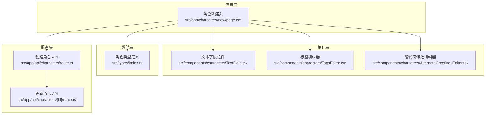
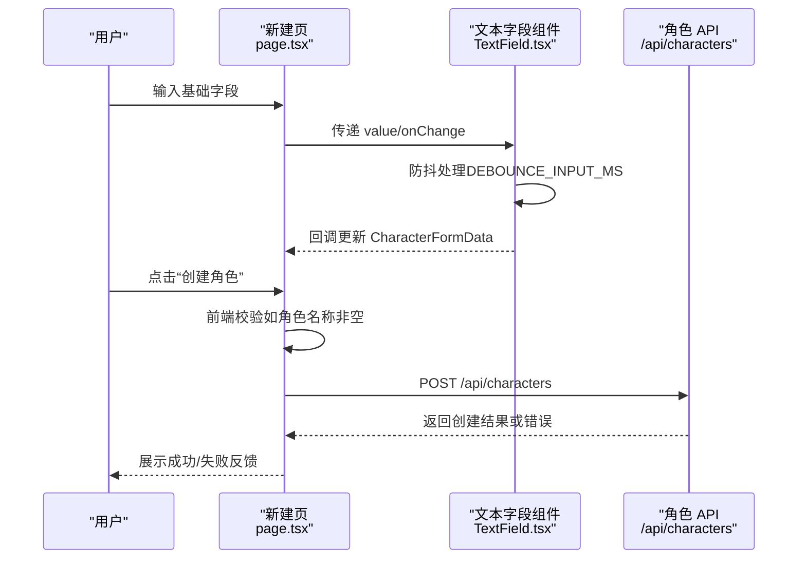
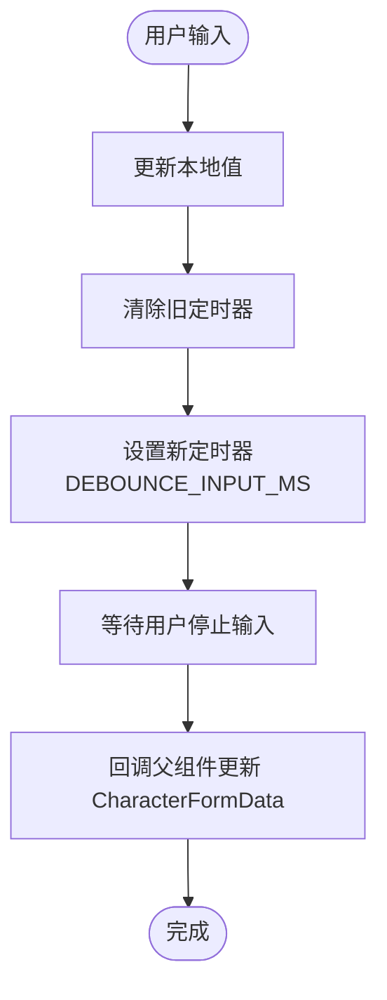
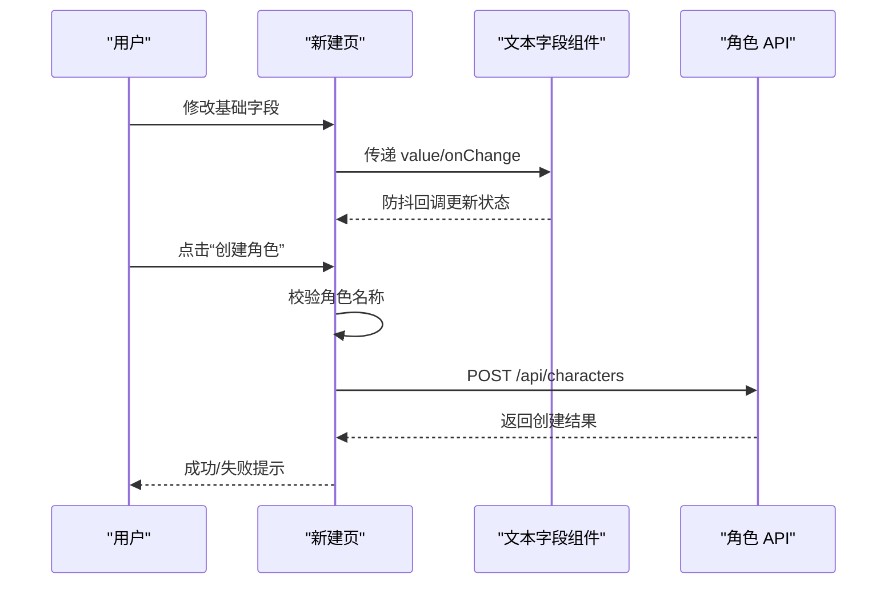
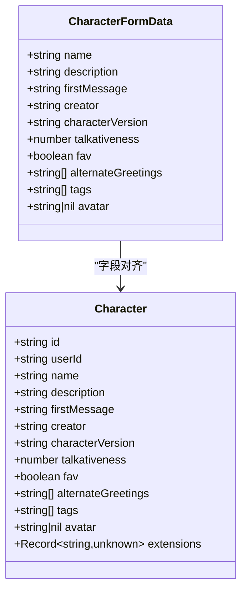
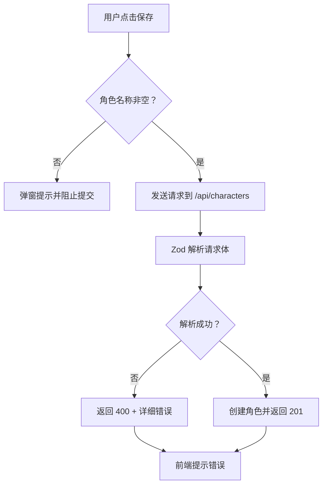
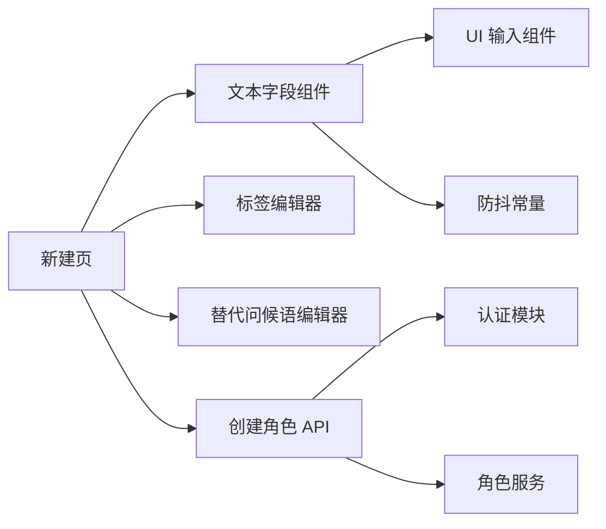

# 基础角色字段

<cite>
**本文档引用的文件**
- [src/components/characters/TextField.tsx](file://src/components/characters/TextField.tsx)
- [src/app/characters/new/page.tsx](file://src/app/characters/new/page.tsx)
- [src/types/index.ts](file://src/types/index.ts)
- [src/lib/constants/ui.ts](file://src/lib/constants/ui.ts)
- [src/components/characters/TagsEditor.tsx](file://src/components/characters/TagsEditor.tsx)
- [src/components/characters/AlternateGreetingsEditor.tsx](file://src/components/characters/AlternateGreetingsEditor.tsx)
- [src/app/api/characters/route.ts](file://src/app/api/characters/route.ts)
- [src/app/api/characters/[id]/route.ts](file://src/app/api/characters/[id]/route.ts)
- [src/lib/parsers/character-card-parser.ts](file://src/lib/parsers/character-card-parser.ts)
</cite>

## 目录
1. [简介](#简介)
2. [项目结构](#项目结构)
3. [核心组件](#核心组件)
4. [架构总览](#架构总览)
5. [详细组件分析](#详细组件分析)
6. [依赖关系分析](#依赖关系分析)
7. [性能考虑](#性能考虑)
8. [故障排除指南](#故障排除指南)
9. [结论](#结论)

## 简介
本文件聚焦“基础角色字段”的设计与实现，涵盖角色表单中的核心字段（角色名称、描述、第一条消息等）的输入规则、验证机制与用户体验；同时深入解析文本字段组件的实现原理（防抖、多行文本、帮助链接）、字段数据绑定与状态管理、以及字符编码与特殊字符处理策略。文档还提供了字段验证错误处理与用户反馈机制的实现细节，并通过图示展示关键流程。

## 项目结构
基础角色字段涉及的前端页面、组件与类型定义主要分布在以下路径：
- 页面层：角色新建页负责渲染基础字段与触发保存
- 组件层：文本字段组件、标签编辑器、替代问候语编辑器
- 类型层：角色表单数据结构与角色实体结构
- 服务层：API 路由负责输入校验与持久化

**图表来源**
- [src/app/characters/new/page.tsx:1-155](file://src/app/characters/new/page.tsx#L1-L155)
- [src/components/characters/TextField.tsx:1-51](file://src/components/characters/TextField.tsx#L1-L51)
- [src/components/characters/TagsEditor.tsx:1-88](file://src/components/characters/TagsEditor.tsx#L1-L88)
- [src/components/characters/AlternateGreetingsEditor.tsx:1-38](file://src/components/characters/AlternateGreetingsEditor.tsx#L1-L38)
- [src/types/index.ts:186-243](file://src/types/index.ts#L186-L243)
- [src/app/api/characters/route.ts:1-41](file://src/app/api/characters/route.ts#L1-L41)
- [src/app/api/characters/[id]/route.ts:1-46](file://src/app/api/characters/[id]/route.ts#L1-L46)

**章节来源**
- [src/app/characters/new/page.tsx:1-155](file://src/app/characters/new/page.tsx#L1-L155)
- [src/types/index.ts:186-243](file://src/types/index.ts#L186-L243)

## 核心组件
本节梳理基础角色字段的输入规则与验证机制，重点说明必填字段与可选字段的约束、前端本地校验与后端严格校验的关系。

- 必填字段
  - 角色名称：新建页在提交时进行非空校验，若为空则弹窗提示并阻止提交
  - 其他基础字段（描述、第一条消息等）在新建页中以多行文本形式提供，未见前端强制非空校验，但建议保持一致性
- 可选字段
  - 创建者、版本号、话语度（范围 0-1）、收藏标记、头像上传等
- 输入规则
  - 文本字段支持单行与多行两种形态，多行文本具备自动调整高度的能力
  - 文本字段组件内置防抖机制，降低频繁写入带来的性能压力
  - 文本字段组件支持帮助链接，便于用户查阅规范

**章节来源**
- [src/app/characters/new/page.tsx:53-69](file://src/app/characters/new/page.tsx#L53-L69)
- [src/app/characters/new/page.tsx:130-134](file://src/app/characters/new/page.tsx#L130-L134)
- [src/components/characters/TextField.tsx:16-50](file://src/components/characters/TextField.tsx#L16-L50)

## 架构总览
基础角色字段从用户输入到服务端存储的整体流程如下：

**图表来源**
- [src/app/characters/new/page.tsx:33-69](file://src/app/characters/new/page.tsx#L33-L69)
- [src/components/characters/TextField.tsx:16-50](file://src/components/characters/TextField.tsx#L16-L50)
- [src/lib/constants/ui.ts:8-9](file://src/lib/constants/ui.ts#L8-L9)
- [src/app/api/characters/route.ts:19-41](file://src/app/api/characters/route.ts#L19-L41)

## 详细组件分析

### 文本字段组件（TextField）
- 设计目标：为角色新建/编辑页提供统一的文本输入体验，支持单行与多行、帮助链接与防抖更新
- 实现要点
  - 状态管理：组件内部维护本地值，避免父组件频繁重渲染
  - 防抖机制：使用定时器在用户停止输入一段时间后才回调父组件，提升性能
  - 多行支持：通过 props 控制是否渲染 textarea，提供最小高度与自动调整能力
  - 帮助链接：可选的帮助链接按钮，打开外部文档
- 输入规则
  - 单行文本：适用于短文本（如名称、版本号等）
  - 多行文本：适用于描述、第一条消息等较长文本
  - 编码与过滤：组件不对输入内容做特殊字符过滤，遵循浏览器默认行为；字符长度限制由上层业务与后端约束决定

**图表来源**
- [src/components/characters/TextField.tsx:16-50](file://src/components/characters/TextField.tsx#L16-L50)
- [src/lib/constants/ui.ts:8-9](file://src/lib/constants/ui.ts#L8-L9)

**章节来源**
- [src/components/characters/TextField.tsx:1-51](file://src/components/characters/TextField.tsx#L1-L51)
- [src/lib/constants/ui.ts:1-13](file://src/lib/constants/ui.ts#L1-L13)

### 角色新建页（基础字段布局）
- 字段布局
  - 左侧：头像上传、标签编辑、创建者/版本号、话语度滑块
  - 右侧：基础字段（创建者备注、角色名称、描述、第一条消息）与高级字段（可折叠展开）
- 数据绑定
  - 使用 React 状态管理角色表单数据，通过 updateField 方法按字段名更新
  - 文本字段组件通过 onChange 将变更回传至父组件，形成双向绑定效果
- 保存流程
  - 提交前进行角色名称非空校验
  - 发送 POST 请求到 /api/characters，成功后跳转到角色详情页

**图表来源**
- [src/app/characters/new/page.tsx:33-69](file://src/app/characters/new/page.tsx#L33-L69)
- [src/app/characters/new/page.tsx:129-149](file://src/app/characters/new/page.tsx#L129-L149)

**章节来源**
- [src/app/characters/new/page.tsx:1-155](file://src/app/characters/new/page.tsx#L1-L155)

### 标签编辑器（TagsEditor）
- 功能概述：支持搜索已有标签、创建新标签、移除标签，用于为角色打标
- 交互特性
  - 自动补全：根据输入内容筛选匹配标签
  - 新建标签：当输入不在现有标签中时，允许一键创建
  - 状态同步：通过 onChange 将标签数组回传给父组件
- 与基础字段的关系：标签编辑器位于左侧区域，与基础字段共同构成角色创建表单

**章节来源**
- [src/components/characters/TagsEditor.tsx:1-88](file://src/components/characters/TagsEditor.tsx#L1-L88)

### 替代问候语编辑器（AlternateGreetingsEditor）
- 功能概述：为角色提供多个备用问候语，支持增删
- 交互特性
  - 多行文本：每条问候语使用 textarea，支持多行输入
  - 动态增删：点击“添加”新增一行，点击“×”删除对应项
- 与基础字段的关系：位于右侧高级字段区域，属于扩展字段

**章节来源**
- [src/components/characters/AlternateGreetingsEditor.tsx:1-38](file://src/components/characters/AlternateGreetingsEditor.tsx#L1-L38)

### 类型定义与数据模型
- 角色表单数据（CharacterFormData）
  - 包含基础字段（名称、描述、第一条消息等）与可选字段（创建者、版本号、话语度等）
  - 用于前端表单渲染与状态管理
- 角色实体（Character）
  - 包含服务端字段（如 id、userId、创建/更新时间等），用于持久化与跨页面展示
- 字段映射
  - 表单数据与实体字段一一对应，部分扩展字段（如 extensions）仅存在于实体中

**图表来源**
- [src/types/index.ts:186-243](file://src/types/index.ts#L186-L243)
- [src/types/index.ts:154-184](file://src/types/index.ts#L154-L184)

**章节来源**
- [src/types/index.ts:186-243](file://src/types/index.ts#L186-L243)

### 输入验证与错误处理
- 前端本地校验
  - 角色名称非空：新建页在提交时进行检查，若为空则弹窗提示并阻止提交
- 后端严格校验
  - API 路由使用 Zod Schema 对请求体进行安全解析，返回结构化的错误信息
  - 若输入不符合规范，返回 400 错误及详细信息
- 用户反馈
  - 新建页：失败时弹窗提示“创建失败”
  - 编辑页：保存成功后短暂显示“已保存”状态，随后自动恢复

**图表来源**
- [src/app/characters/new/page.tsx:53-69](file://src/app/characters/new/page.tsx#L53-L69)
- [src/app/api/characters/route.ts:19-41](file://src/app/api/characters/route.ts#L19-L41)

**章节来源**
- [src/app/characters/new/page.tsx:53-69](file://src/app/characters/new/page.tsx#L53-L69)
- [src/app/api/characters/route.ts:19-41](file://src/app/api/characters/route.ts#L19-L41)

## 依赖关系分析
- 组件耦合
  - 新建页依赖文本字段组件、标签编辑器与替代问候语编辑器
  - 文本字段组件依赖 UI 输入组件与防抖常量
- 外部依赖
  - API 路由依赖认证模块与角色服务，后者负责数据库操作与输入校验
- 循环依赖
  - 未发现循环依赖迹象，各模块职责清晰

**图表来源**
- [src/app/characters/new/page.tsx:1-155](file://src/app/characters/new/page.tsx#L1-L155)
- [src/components/characters/TextField.tsx:1-51](file://src/components/characters/TextField.tsx#L1-L51)
- [src/lib/constants/ui.ts:1-13](file://src/lib/constants/ui.ts#L1-L13)
- [src/app/api/characters/route.ts:1-41](file://src/app/api/characters/route.ts#L1-L41)

**章节来源**
- [src/app/characters/new/page.tsx:1-155](file://src/app/characters/new/page.tsx#L1-L155)
- [src/components/characters/TextField.tsx:1-51](file://src/components/characters/TextField.tsx#L1-L51)
- [src/lib/constants/ui.ts:1-13](file://src/lib/constants/ui.ts#L1-L13)
- [src/app/api/characters/route.ts:1-41](file://src/app/api/characters/route.ts#L1-L41)

## 性能考虑
- 防抖优化
  - 文本字段组件采用防抖机制，减少频繁状态更新与重渲染
  - 防抖间隔由全局常量统一管理，便于统一调优
- 渲染优化
  - 使用局部状态与 useCallback 优化新建页的渲染性能
  - 多行文本组件提供最小高度与自动调整，避免不必要的滚动条闪烁
- 网络优化
  - 保存按钮禁用状态避免重复提交
  - 成功后及时跳转，减少无效请求

**章节来源**
- [src/components/characters/TextField.tsx:16-50](file://src/components/characters/TextField.tsx#L16-L50)
- [src/lib/constants/ui.ts:8-9](file://src/lib/constants/ui.ts#L8-L9)
- [src/app/characters/new/page.tsx:33-69](file://src/app/characters/new/page.tsx#L33-L69)

## 故障排除指南
- 角色名称为空导致无法保存
  - 现象：点击“创建角色”后无响应或弹窗提示
  - 处理：确保角色名称非空后再提交
- 输入延迟问题
  - 现象：修改后立即生效但稍后又恢复
  - 处理：确认防抖时间是否过长；必要时调整全局防抖常量
- 保存失败
  - 现象：弹窗提示“创建失败”
  - 处理：检查网络连接与后端日志；查看 API 返回的错误详情
- 标签无法添加
  - 现象：输入新标签后无法创建
  - 处理：确认标签服务可用；检查是否存在同名标签

**章节来源**
- [src/app/characters/new/page.tsx:53-69](file://src/app/characters/new/page.tsx#L53-L69)
- [src/lib/constants/ui.ts:8-9](file://src/lib/constants/ui.ts#L8-L9)
- [src/app/api/characters/route.ts:19-41](file://src/app/api/characters/route.ts#L19-L41)

## 结论
基础角色字段通过统一的文本字段组件、完善的表单数据模型与严格的前后端校验，实现了良好的用户体验与数据一致性。防抖机制与状态管理有效提升了性能与交互流畅度。建议在后续迭代中：
- 在新建页对描述与第一条消息等字段增加前端非空校验，保持一致性
- 明确字符长度限制并在 UI 中提供实时字数统计
- 对特殊字符与编码进行统一处理策略，避免跨平台兼容性问题