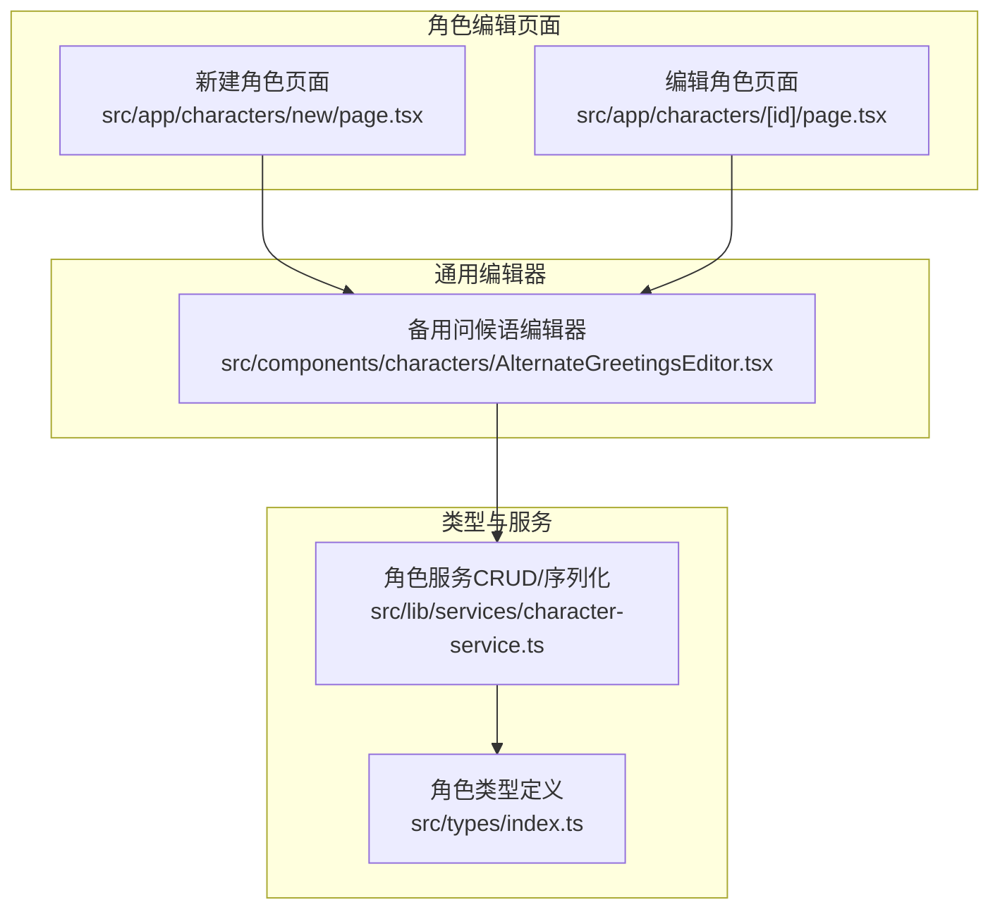
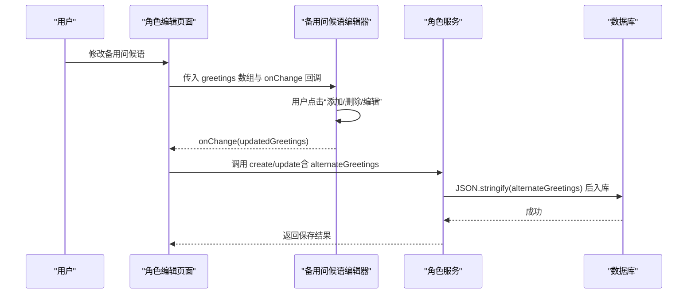
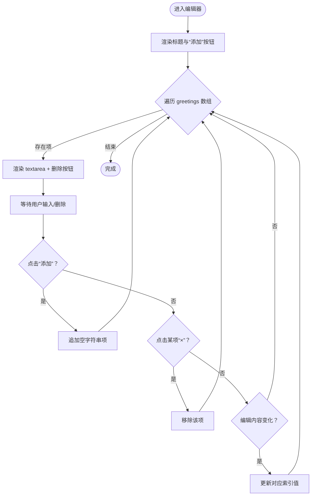
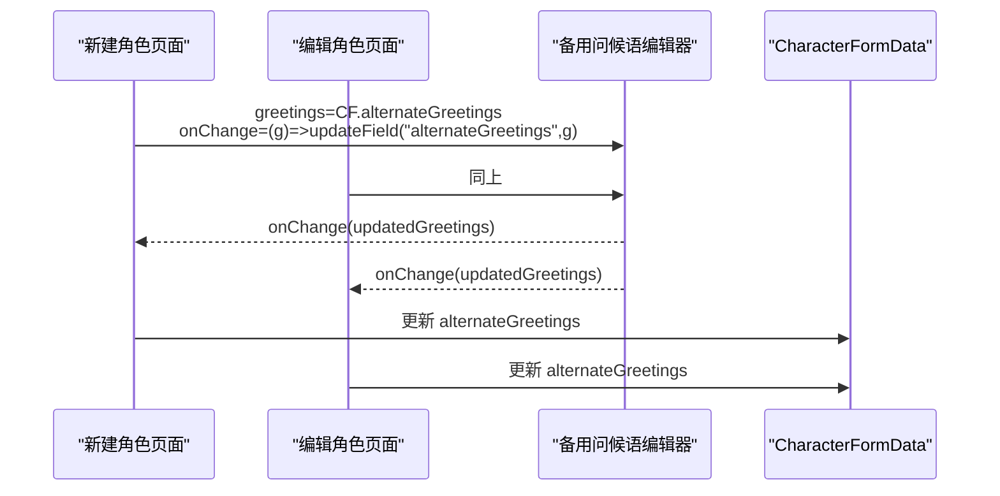
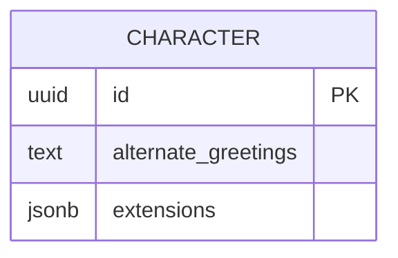
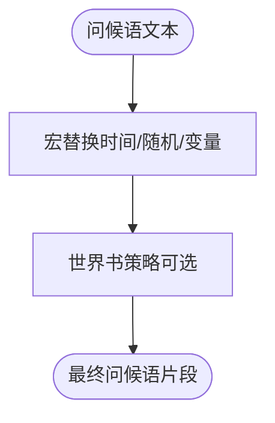
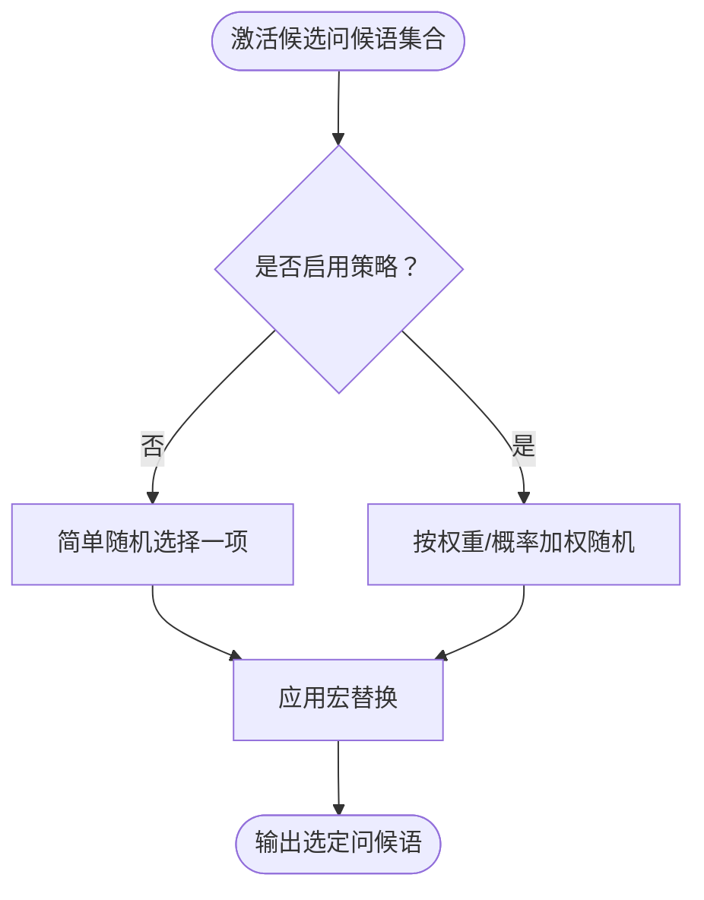
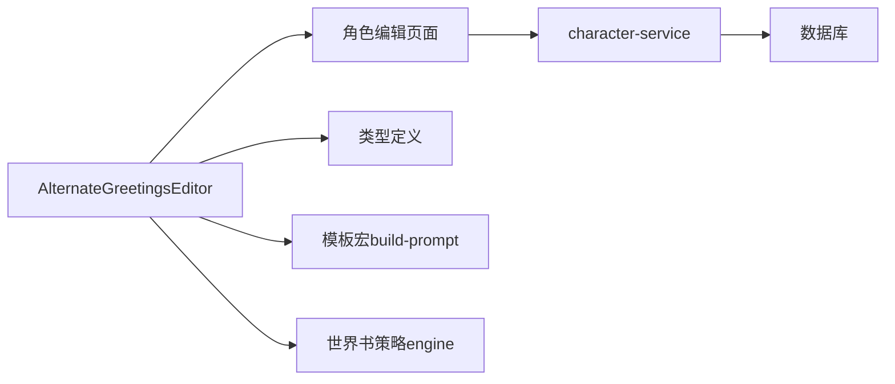

# 备用问候语编辑器

<cite>
**本文档引用的文件**
- [src/components/characters/AlternateGreetingsEditor.tsx](file://src/components/characters/AlternateGreetingsEditor.tsx)
- [src/app/characters/new/page.tsx](file://src/app/characters/new/page.tsx)
- [src/app/characters/[id]/page.tsx](file://src/app/characters/[id]/page.tsx)
- [src/types/index.ts](file://src/types/index.ts)
- [src/lib/services/character-service.ts](file://src/lib/services/character-service.ts)
- [src/lib/formatting/build-prompt.ts](file://src/lib/formatting/build-prompt.ts)
- [src/lib/worldinfo/engine.ts](file://src/lib/worldinfo/engine.ts)
- [src/lib/group-chat/activation.ts](file://src/lib/group-chat/activation.ts)
</cite>

## 目录
1. [简介](#简介)
2. [项目结构](#项目结构)
3. [核心组件](#核心组件)
4. [架构总览](#架构总览)
5. [详细组件分析](#详细组件分析)
6. [依赖关系分析](#依赖关系分析)
7. [性能考虑](#性能考虑)
8. [故障排查指南](#故障排查指南)
9. [结论](#结论)
10. [附录](#附录)

## 简介
本文件面向“备用问候语编辑器”的综合技术文档，聚焦以下目标：
- 备用问候语的管理功能：添加、编辑、删除、排序
- 数据结构、存储格式与序列化机制
- 编辑器的用户界面设计、交互模式与输入验证
- 问候语模板变量、动态内容插入与条件触发机制
- 策略配置、随机选择算法与性能优化建议

## 项目结构
备用问候语编辑器位于角色编辑页面，作为通用的“替代问候语”字段编辑器，贯穿“新建角色”和“编辑角色”两个入口。其核心实现为一个轻量的客户端组件，负责渲染与维护字符串数组，并通过回调向上游传递变更。

**图表来源**
- [src/app/characters/new/page.tsx:128-138](file://src/app/characters/new/page.tsx#L128-L138)
- [src/app/characters/[id]/page.tsx:177-187](file://src/app/characters/[id]/page.tsx#L177-L187)
- [src/components/characters/AlternateGreetingsEditor.tsx:1-37](file://src/components/characters/AlternateGreetingsEditor.tsx#L1-L37)
- [src/types/index.ts:154-184](file://src/types/index.ts#L154-L184)
- [src/lib/services/character-service.ts:86-113](file://src/lib/services/character-service.ts#L86-L113)

**章节来源**
- [src/app/characters/new/page.tsx:128-138](file://src/app/characters/new/page.tsx#L128-L138)
- [src/app/characters/[id]/page.tsx:177-187](file://src/app/characters/[id]/page.tsx#L177-L187)
- [src/components/characters/AlternateGreetingsEditor.tsx:1-37](file://src/components/characters/AlternateGreetingsEditor.tsx#L1-L37)
- [src/types/index.ts:154-184](file://src/types/index.ts#L154-L184)
- [src/lib/services/character-service.ts:86-113](file://src/lib/services/character-service.ts#L86-L113)

## 核心组件
- 备用问候语编辑器（AlternateGreetingsEditor）：接收字符串数组与变更回调，渲染多行文本框列表，支持添加、删除与逐项编辑。
- 角色编辑页面（新建/编辑）：承载编辑器，维护 CharacterFormData 并通过 updateField 更新 alternateGreetings。
- 类型系统（Character/CharacterFormData）：定义 alternateGreetings 的数据结构为 string[]。
- 角色服务（character-service）：负责 alternateGreetings 的 JSON 序列化与反序列化，持久化到数据库。

关键点：
- 数据结构：alternateGreetings 为字符串数组，每个元素代表一条备用问候语。
- 存储格式：以 JSON 数组形式存入数据库，读取时解析为数组。
- 输入验证：Zod Schema 对 alternateGreetings 的类型进行约束（数组元素为字符串）。

**章节来源**
- [src/components/characters/AlternateGreetingsEditor.tsx:6-9](file://src/components/characters/AlternateGreetingsEditor.tsx#L6-L9)
- [src/types/index.ts:168](file://src/types/index.ts#L168)
- [src/types/index.ts:200](file://src/types/index.ts#L200)
- [src/lib/services/character-service.ts:99](file://src/lib/services/character-service.ts#L99)
- [src/lib/services/character-service.ts:155](file://src/lib/services/character-service.ts#L155)
- [src/lib/services/character-service.ts:196](file://src/lib/services/character-service.ts#L196)

## 架构总览
备用问候语从“编辑器输入”到“持久化存储”的完整链路如下：

**图表来源**
- [src/app/characters/new/page.tsx:134](file://src/app/characters/new/page.tsx#L134)
- [src/app/characters/[id]/page.tsx:183](file://src/app/characters/[id]/page.tsx#L183)
- [src/components/characters/AlternateGreetingsEditor.tsx:17-25](file://src/components/characters/AlternateGreetingsEditor.tsx#L17-L25)
- [src/lib/services/character-service.ts:155](file://src/lib/services/character-service.ts#L155)
- [src/lib/services/character-service.ts:196](file://src/lib/services/character-service.ts#L196)

## 详细组件分析

### 备用问候语编辑器（AlternateGreetingsEditor）
- 功能职责
  - 渲染标题与“添加”按钮，用于追加空字符串项
  - 为数组中每个元素渲染 textarea，支持多行编辑
  - 提供“删除”按钮，移除对应索引项
  - 通过 onChange 回调向上游同步更新后的数组
- 交互模式
  - 添加：点击“添加”按钮，向数组末尾追加空字符串
  - 删除：点击某项右侧“×”，过滤掉该项
  - 编辑：在对应 textarea 中输入或修改内容
  - 排序：当前实现未提供拖拽排序；可通过删除再添加的方式调整顺序
- UI 设计
  - 使用等宽字体与可调整尺寸的 textarea，便于编辑长文本
  - 按钮采用 outline 样式，保持简洁一致性

**图表来源**
- [src/components/characters/AlternateGreetingsEditor.tsx:12-36](file://src/components/characters/AlternateGreetingsEditor.tsx#L12-L36)

**章节来源**
- [src/components/characters/AlternateGreetingsEditor.tsx:1-37](file://src/components/characters/AlternateGreetingsEditor.tsx#L1-L37)

### 角色编辑页面（新建/编辑）
- 页面职责
  - 维护 CharacterFormData，包含 alternateGreetings 字段
  - 将 greetings 与 onChange 传递给 AlternateGreetingsEditor
  - 通过 updateField 更新对应字段
- 集成点
  - 新建页面：在右侧编辑区渲染 AlternateGreetingsEditor
  - 编辑页面：同样渲染 AlternateGreetingsEditor，并支持高级设定区域

**图表来源**
- [src/app/characters/new/page.tsx:134](file://src/app/characters/new/page.tsx#L134)
- [src/app/characters/[id]/page.tsx:183](file://src/app/characters/[id]/page.tsx#L183)

**章节来源**
- [src/app/characters/new/page.tsx:128-138](file://src/app/characters/new/page.tsx#L128-L138)
- [src/app/characters/[id]/page.tsx:177-187](file://src/app/characters/[id]/page.tsx#L177-L187)

### 数据结构与序列化机制
- 类型定义
  - Character/CharacterFormData 的 alternateGreetings 字段均为 string[]
- 存储与序列化
  - 写入：character-service 在 create/update 时将 alternateGreetings JSON.stringify 后存入数据库
  - 读取：从数据库读取后 JSON.parse，恢复为字符串数组
- 备注
  - 若数据库字段为空，反序列化时返回空数组

**图表来源**
- [src/lib/services/character-service.ts:99](file://src/lib/services/character-service.ts#L99)
- [src/lib/services/character-service.ts:155](file://src/lib/services/character-service.ts#L155)
- [src/lib/services/character-service.ts:196](file://src/lib/services/character-service.ts#L196)

**章节来源**
- [src/types/index.ts:168](file://src/types/index.ts#L168)
- [src/types/index.ts:200](file://src/types/index.ts#L200)
- [src/lib/services/character-service.ts:86-113](file://src/lib/services/character-service.ts#L86-L113)
- [src/lib/services/character-service.ts:155](file://src/lib/services/character-service.ts#L155)
- [src/lib/services/character-service.ts:196](file://src/lib/services/character-service.ts#L196)

### 模板变量、动态内容与条件触发
- 模板变量与动态内容
  - 问候语文本支持多种模板宏与变量（如时间、随机数、聊天变量等），由构建提示词的工具模块统一处理
  - 宏替换发生在提示词构建阶段，适用于问候语文本
- 条件触发机制
  - 世界书（World Info）具备触发器与概率控制，但当前备用问候语字段本身未内置触发器
  - 可通过在问候语中嵌入宏或结合世界书策略实现条件化内容

**图表来源**
- [src/lib/formatting/build-prompt.ts:60-117](file://src/lib/formatting/build-prompt.ts#L60-L117)
- [src/lib/worldinfo/engine.ts:240-272](file://src/lib/worldinfo/engine.ts#L240-L272)

**章节来源**
- [src/lib/formatting/build-prompt.ts:60-117](file://src/lib/formatting/build-prompt.ts#L60-L117)
- [src/lib/worldinfo/engine.ts:240-272](file://src/lib/worldinfo/engine.ts#L240-L272)

### 策略配置与随机选择算法
- 备用问候语选择策略
  - 当前实现未提供专用的“备用问候语策略配置”界面
  - 可通过在问候语中使用宏（如随机数）实现简单随机效果
- 随机选择算法参考
  - 世界书引擎展示了基于权重的随机选择流程，可借鉴其思路用于更复杂的问候语选择策略（例如按概率/权重选择）

**图表来源**
- [src/lib/worldinfo/engine.ts:240-272](file://src/lib/worldinfo/engine.ts#L240-L272)

**章节来源**
- [src/lib/worldinfo/engine.ts:240-272](file://src/lib/worldinfo/engine.ts#L240-L272)

## 依赖关系分析
- 组件耦合
  - AlternateGreetingsEditor 仅依赖 greetings 与 onChange，耦合度低，复用性强
  - 角色编辑页面通过 props 将状态与回调传递给编辑器
- 类型与服务
  - 类型定义确保 alternateGreetings 为 string[]，避免运行期类型错误
  - 角色服务负责序列化/反序列化，屏蔽数据库细节
- 外部依赖
  - 模板宏与世界书策略由各自模块提供，编辑器不直接依赖

**图表来源**
- [src/components/characters/AlternateGreetingsEditor.tsx:12-36](file://src/components/characters/AlternateGreetingsEditor.tsx#L12-L36)
- [src/app/characters/new/page.tsx:134](file://src/app/characters/new/page.tsx#L134)
- [src/app/characters/[id]/page.tsx:183](file://src/app/characters/[id]/page.tsx#L183)
- [src/lib/services/character-service.ts:86-113](file://src/lib/services/character-service.ts#L86-L113)
- [src/lib/formatting/build-prompt.ts:60-117](file://src/lib/formatting/build-prompt.ts#L60-L117)
- [src/lib/worldinfo/engine.ts:240-272](file://src/lib/worldinfo/engine.ts#L240-L272)

**章节来源**
- [src/components/characters/AlternateGreetingsEditor.tsx:1-37](file://src/components/characters/AlternateGreetingsEditor.tsx#L1-L37)
- [src/app/characters/new/page.tsx:128-138](file://src/app/characters/new/page.tsx#L128-L138)
- [src/app/characters/[id]/page.tsx:177-187](file://src/app/characters/[id]/page.tsx#L177-L187)
- [src/lib/services/character-service.ts:86-113](file://src/lib/services/character-service.ts#L86-L113)
- [src/lib/formatting/build-prompt.ts:60-117](file://src/lib/formatting/build-prompt.ts#L60-L117)
- [src/lib/worldinfo/engine.ts:240-272](file://src/lib/worldinfo/engine.ts#L240-L272)

## 性能考虑
- 渲染性能
  - 备用问候语通常数量有限，textarea 列表渲染开销极小
  - 建议避免在大量条目时频繁重排 DOM，当前实现通过数组映射渲染即可满足需求
- 序列化成本
  - create/update 时对 alternateGreetings 进行 JSON.stringify/parse，成本与数组长度线性相关
  - 建议在批量更新时合并多次 onChange 调用，减少重复序列化
- 模板宏替换
  - 宏替换在提示词构建阶段执行，与问候语编辑器解耦，不影响编辑器性能
- 随机选择
  - 若引入权重/概率选择策略，注意避免在高频路径中重复计算权重总和，可缓存累计权重

[本节为通用性能建议，无需特定文件引用]

## 故障排查指南
- 问题：备用问候语未保存
  - 检查：角色服务在 create/update 是否正确传入 alternateGreetings
  - 参考：写入时 JSON.stringify，读取时 JSON.parse
- 问题：编辑器无法添加/删除条目
  - 检查：onChange 回调是否正确传递至父组件并更新 CharacterFormData
  - 参考：编辑器内部通过浅拷贝与过滤实现更新
- 问题：问候语显示异常（换行/空白）
  - 检查：构建提示词时的全局格式化选项（折叠换行/去除多余空格）
- 问题：期望按概率/权重选择备用问候语但未生效
  - 说明：当前未内置该策略；可在问候语中使用宏实现简单随机，或参考世界书引擎的权重选择思路

**章节来源**
- [src/lib/services/character-service.ts:155](file://src/lib/services/character-service.ts#L155)
- [src/lib/services/character-service.ts:196](file://src/lib/services/character-service.ts#L196)
- [src/components/characters/AlternateGreetingsEditor.tsx:17-32](file://src/components/characters/AlternateGreetingsEditor.tsx#L17-L32)
- [src/lib/formatting/build-prompt.ts:119-132](file://src/lib/formatting/build-prompt.ts#L119-L132)
- [src/lib/worldinfo/engine.ts:240-272](file://src/lib/worldinfo/engine.ts#L240-L272)

## 结论
备用问候语编辑器以最小实现提供了完整的“添加-编辑-删除-排序”能力，配合角色服务的 JSON 序列化与类型约束，确保数据一致性与可维护性。通过模板宏与世界书策略，可进一步增强问候语的动态性与条件触发能力。未来可在现有基础上扩展“策略配置”与“权重/概率选择”等高级特性，以满足更复杂的场景需求。

[本节为总结性内容，无需特定文件引用]

## 附录
- 相关实现路径
  - 编辑器组件：[src/components/characters/AlternateGreetingsEditor.tsx](file://src/components/characters/AlternateGreetingsEditor.tsx)
  - 角色编辑页面（新建）：[src/app/characters/new/page.tsx](file://src/app/characters/new/page.tsx)
  - 角色编辑页面（编辑）：[src/app/characters/[id]/page.tsx](file://src/app/characters/[id]/page.tsx)
  - 类型定义：[src/types/index.ts](file://src/types/index.ts)
  - 角色服务（序列化/反序列化）：[src/lib/services/character-service.ts](file://src/lib/services/character-service.ts)
  - 模板宏与变量：[src/lib/formatting/build-prompt.ts](file://src/lib/formatting/build-prompt.ts)
  - 世界书策略（权重随机）：[src/lib/worldinfo/engine.ts](file://src/lib/worldinfo/engine.ts)

[本节为补充信息，无需特定文件引用]