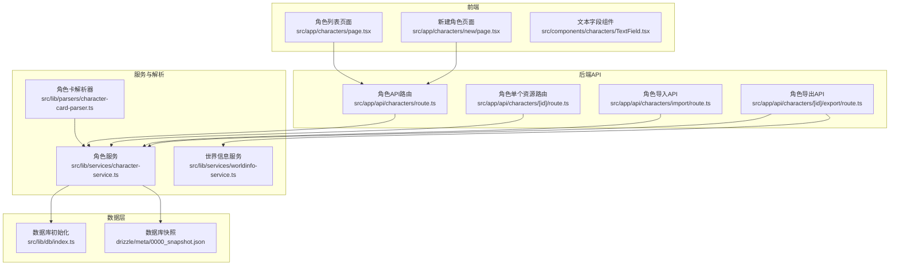
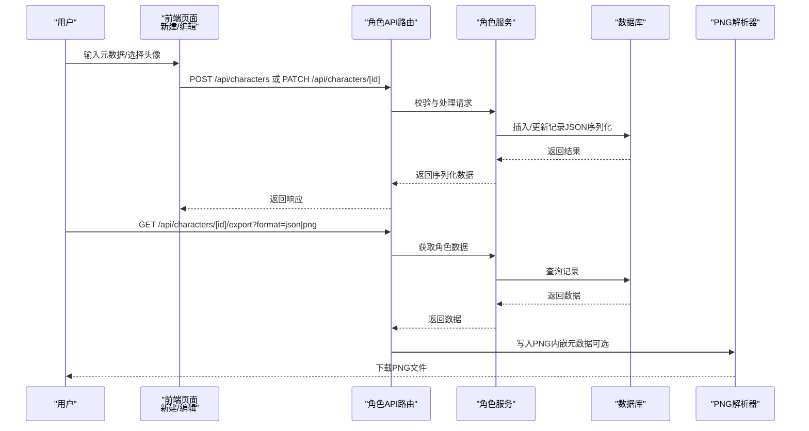
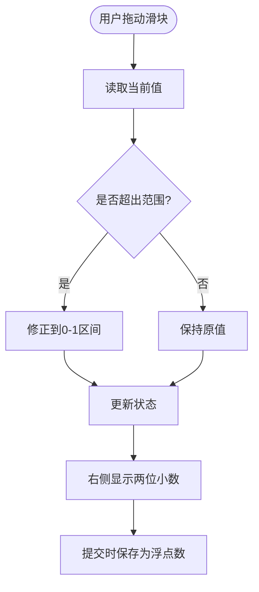
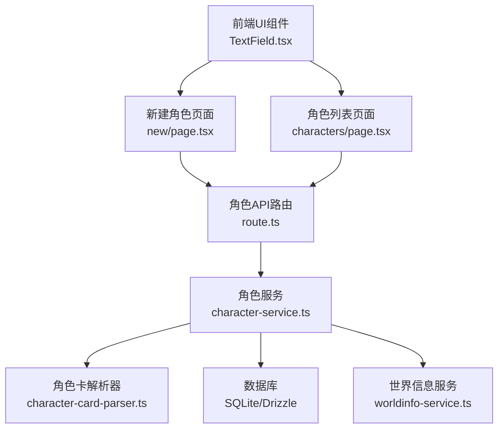

# 角色元数据配置

<cite>
**本文档引用的文件**
- [角色列表页面](file://src/app/characters/page.tsx)
- [新建角色页面](file://src/app/characters/new/page.tsx)
- [角色字段组件](file://src/components/characters/TextField.tsx)
- [数据库初始化](file://src/lib/db/index.ts)
- [类型定义](file://src/types/index.ts)
- [角色API路由](file://src/app/api/characters/route.ts)
- [角色单个资源路由](file://src/app/api/characters/[id]/route.ts)
- [角色导入API](file://src/app/api/characters/import/route.ts)
- [角色导出API](file://src/app/api/characters/[id]/export/route.ts)
- [角色服务](file://src/lib/services/character-service.ts)
- [角色卡解析器](file://src/lib/parsers/character-card-parser.ts)
- [数据库快照](file://drizzle/meta/0000_snapshot.json)
- [世界信息服务](file://src/lib/services/worldinfo-service.ts)
</cite>

## 目录
1. [简介](#简介)
2. [项目结构](#项目结构)
3. [核心组件](#核心组件)
4. [架构总览](#架构总览)
5. [详细组件分析](#详细组件分析)
6. [依赖关系分析](#依赖关系分析)
7. [性能考虑](#性能考虑)
8. [故障排除指南](#故障排除指南)
9. [结论](#结论)
10. [附录](#附录)

## 简介
本文件详细说明角色元数据配置功能，包括创建者信息、版本控制、收藏功能、话语度调节器的数值范围与步长、视觉反馈机制，以及元数据字段的数据类型、验证规则、存储方案。同时涵盖元数据的导入导出、PNG内嵌元数据、备份恢复与版本兼容性处理，并提供最佳实践、命名规范与维护策略。

## 项目结构
角色元数据配置涉及前端页面、API路由、服务层、数据库与解析器等多个层次：

- 前端页面负责用户交互与表单渲染
- API路由处理请求与鉴权
- 服务层进行数据校验、转换与持久化
- 数据库采用SQLite + Drizzle ORM
- 解析器支持TavernCard V1/V2/V3与PNG内嵌元数据

**图表来源**
- [角色列表页面:1-258](file://src/app/characters/page.tsx#L1-L258)
- [新建角色页面:1-155](file://src/app/characters/new/page.tsx#L1-L155)
- [角色API路由:1-42](file://src/app/api/characters/route.ts#L1-L42)
- [角色单个资源路由:1-47](file://src/app/api/characters/[id]/route.ts#L1-L47)
- [角色导入API:1-90](file://src/app/api/characters/import/route.ts#L1-L90)
- [角色导出API:1-162](file://src/app/api/characters/[id]/export/route.ts#L1-L162)
- [角色服务:1-252](file://src/lib/services/character-service.ts#L1-L252)
- [角色卡解析器:1-354](file://src/lib/parsers/character-card-parser.ts#L1-L354)
- [数据库初始化:1-134](file://src/lib/db/index.ts#L1-L134)
- [数据库快照:140-339](file://drizzle/meta/0000_snapshot.json#L140-L339)
- [世界信息服务:389-409](file://src/lib/services/worldinfo-service.ts#L389-L409)

**章节来源**
- [角色列表页面:1-258](file://src/app/characters/page.tsx#L1-L258)
- [新建角色页面:1-155](file://src/app/characters/new/page.tsx#L1-L155)
- [角色API路由:1-42](file://src/app/api/characters/route.ts#L1-L42)
- [角色单个资源路由:1-47](file://src/app/api/characters/[id]/route.ts#L1-L47)
- [角色导入API:1-90](file://src/app/api/characters/import/route.ts#L1-L90)
- [角色导出API:1-162](file://src/app/api/characters/[id]/export/route.ts#L1-L162)
- [角色服务:1-252](file://src/lib/services/character-service.ts#L1-L252)
- [角色卡解析器:1-354](file://src/lib/parsers/character-card-parser.ts#L1-L354)
- [数据库初始化:1-134](file://src/lib/db/index.ts#L1-L134)
- [数据库快照:140-339](file://drizzle/meta/0000_snapshot.json#L140-L339)
- [世界信息服务:389-409](file://src/lib/services/worldinfo-service.ts#L389-L409)

## 核心组件
- 角色元数据字段
  - 创建者信息：creator（字符串）
  - 版本控制：characterVersion（字符串）
  - 收藏功能：fav（布尔值）
  - 话语度：talkativeness（数值，范围0-1，步长0.05）
  - 头像：avatar（字符串，可为空）
  - 标签：tags（字符串数组）
  - 备注：creatorNotes（字符串）
  - 系统提示：systemPrompt（字符串）
  - 历史后指令：postHistoryInstructions（字符串）
  - 替代问候：alternateGreetings（字符串数组）
  - 世界书绑定：worldInfoBookId（字符串，可为空）
  - 扩展字段：extensions（记录类型）

- 数据验证规则
  - 名称长度限制与必填
  - talkativeness范围与可选
  - 数组字段可选
  - 扩展字段透传（passthrough）

- 存储方案
  - JSON序列化存储数组与对象字段
  - SQLite整型/实数/文本类型映射
  - 时间戳字段使用ISO字符串存储

**章节来源**
- [类型定义:154-210](file://src/types/index.ts#L154-L210)
- [角色服务:11-53](file://src/lib/services/character-service.ts#L11-L53)
- [数据库快照:167-233](file://drizzle/meta/0000_snapshot.json#L167-L233)
- [角色列表页面:14-24](file://src/app/characters/page.tsx#L14-L24)
- [新建角色页面:14-31](file://src/app/characters/new/page.tsx#L14-L31)

## 架构总览
角色元数据配置的端到端流程如下：

**图表来源**
- [新建角色页面:53-69](file://src/app/characters/new/page.tsx#L53-L69)
- [角色API路由:19-41](file://src/app/api/characters/route.ts#L19-L41)
- [角色单个资源路由:19-34](file://src/app/api/characters/[id]/route.ts#L19-L34)
- [角色服务:139-212](file://src/lib/services/character-service.ts#L139-L212)
- [角色导出API:15-144](file://src/app/api/characters/[id]/export/route.ts#L15-L144)
- [角色卡解析器:299-334](file://src/lib/parsers/character-card-parser.ts#L299-L334)

## 详细组件分析

### 话语度调节器
- 数值范围：0（极少说话）到1（非常健谈）
- 步长：0.05
- 视觉反馈：滑块右侧显示两位小数的当前值
- 存储：浮点数字段，数据库默认值为0.5

**图表来源**
- [新建角色页面:119-124](file://src/app/characters/new/page.tsx#L119-L124)
- [数据库快照:183-189](file://drizzle/meta/0000_snapshot.json#L183-L189)

**章节来源**
- [新建角色页面:119-124](file://src/app/characters/new/page.tsx#L119-L124)
- [数据库快照:183-189](file://drizzle/meta/0000_snapshot.json#L183-L189)

### 元数据字段与验证
- 字段类型与约束
  - 字符串字段：name、description、personality、scenario、firstMessage、exampleDialogue、creatorNotes、systemPrompt、postHistoryInstructions、creator、characterVersion、avatar
  - 数组字段：alternateGreetings、tags
  - 数值字段：talkativeness（0-1）
  - 布尔字段：fav
  - 对象字段：extensions、characterBook
  - 时间戳：createDate、createdAt、updatedAt（ISO字符串）

- 验证规则
  - 必填：name（最小长度1，最大200）
  - 可选：其余字段
  - talkativeness范围检查
  - 数组字段元素类型为字符串
  - 扩展字段透传（passthrough）

**章节来源**
- [类型定义:154-210](file://src/types/index.ts#L154-L210)
- [角色服务:11-53](file://src/lib/services/character-service.ts#L11-L53)

### 存储与序列化
- 数据库存储
  - 字符串数组：JSON序列化后存储为TEXT
  - 对象字段：JSON序列化后存储为TEXT
  - 浮点数：REAL类型
  - 布尔值：INTEGER类型（0/1）
  - 时间戳：INTEGER类型（Unix时间戳）

- 服务层序列化
  - 读取：JSON反序列化为数组/对象
  - 写入：JSON序列化为字符串
  - 默认值：talkativeness默认0.5，fav默认false

**章节来源**
- [角色服务:86-113](file://src/lib/services/character-service.ts#L86-L113)
- [数据库快照:140-233](file://drizzle/meta/0000_snapshot.json#L140-L233)

### 导入导出与PNG内嵌元数据
- 导入支持格式
  - JSON：V2/V3规范或V1裸数据
  - PNG：从tEXt chunk提取chara/ccv3元数据
  - 自动识别并转换为内部格式
  - PNG导入时可将图片作为头像（base64 data URL）

- 导出格式
  - JSON：顶层V1兼容字段 + V3规范 + data + character_book
  - PNG：同时写入chara（V2占位）+ ccv3（V3主体）tEXt chunk
  - 世界书绑定：优先使用角色自带characterBook，否则从worldInfoBookId实时转换

- 版本兼容性
  - V3导出自动包含V2兼容字段
  - PNG同时写入V2/V3元数据以保证兼容

**章节来源**
- [角色导入API:33-75](file://src/app/api/characters/import/route.ts#L33-L75)
- [角色导出API:33-78](file://src/app/api/characters/[id]/export/route.ts#L33-L78)
- [角色卡解析器:104-129](file://src/lib/parsers/character-card-parser.ts#L104-L129)
- [角色卡解析器:266-293](file://src/lib/parsers/character-card-parser.ts#L266-L293)
- [角色卡解析器:299-334](file://src/lib/parsers/character-card-parser.ts#L299-L334)

### 收藏与标签管理
- 收藏功能
  - 前端：星标按钮切换fav状态
  - 后端：PATCH /api/characters/[id] 更新fav字段
  - 列表：按收藏优先排序

- 标签管理
  - 前端：TagsEditor组件管理标签
  - 存储：JSON数组，支持过滤与搜索
  - 同步：新建后可通过服务同步标签

**章节来源**
- [角色列表页面:93-96](file://src/app/characters/page.tsx#L93-L96)
- [角色列表页面:153-160](file://src/app/characters/page.tsx#L153-L160)
- [新建角色页面:113-113](file://src/app/characters/new/page.tsx#L113-L113)

### 创建者信息与版本控制
- 创建者信息
  - creator字段用于标识创作者
  - 列表页展示"by creator"标签

- 版本控制
  - characterVersion字段用于版本标识
  - 支持语义化版本号或自定义版本字符串

**章节来源**
- [角色列表页面:214-214](file://src/app/characters/page.tsx#L214-L214)
- [新建角色页面:116-117](file://src/app/characters/new/page.tsx#L116-L117)
- [类型定义:170-171](file://src/types/index.ts#L170-L171)

## 依赖关系分析
角色元数据配置的关键依赖关系如下：

**图表来源**
- [角色字段组件:1-51](file://src/components/characters/TextField.tsx#L1-L51)
- [新建角色页面:1-155](file://src/app/characters/new/page.tsx#L1-L155)
- [角色列表页面:1-258](file://src/app/characters/page.tsx#L1-L258)
- [角色API路由:1-42](file://src/app/api/characters/route.ts#L1-L42)
- [角色服务:1-252](file://src/lib/services/character-service.ts#L1-L252)
- [角色卡解析器:1-354](file://src/lib/parsers/character-card-parser.ts#L1-L354)
- [世界信息服务:389-409](file://src/lib/services/worldinfo-service.ts#L389-L409)

**章节来源**
- [角色字段组件:1-51](file://src/components/characters/TextField.tsx#L1-L51)
- [角色服务:1-252](file://src/lib/services/character-service.ts#L1-L252)

## 性能考虑
- 前端防抖输入
  - 文本字段组件使用防抖减少频繁网络请求
  - 搜索框延迟300ms触发查询

- 数据库索引与查询
  - 按用户ID与更新时间排序
  - 模糊查询基于名称字段

- 序列化开销
  - 数组/对象字段JSON序列化，注意大对象的存储与传输成本

- PNG处理
  - 导出PNG时创建最小有效图像，避免额外内存占用

**章节来源**
- [角色字段组件:23-27](file://src/components/characters/TextField.tsx#L23-L27)
- [角色列表页面:74-79](file://src/app/characters/page.tsx#L74-L79)
- [角色服务:116-130](file://src/lib/services/character-service.ts#L116-L130)
- [角色导出API:148-161](file://src/app/api/characters/[id]/export/route.ts#L148-L161)

## 故障排除指南
- 导入失败
  - 检查文件格式：仅支持.json与.png
  - PNG需包含chara/ccv3元数据
  - JSON需符合V1/V2/V3规范

- 验证错误
  - name为空或超长
  - talkativeness超出0-1范围
  - 数组字段元素类型不符

- 导出异常
  - 确认角色存在且属于当前用户
  - PNG导出时若无头像，将使用最小PNG模板

- 数据库问题
  - 启动时自动迁移，如遇字段缺失会尝试补充
  - 若出现字段不匹配，检查数据库快照与迁移文件

**章节来源**
- [角色导入API:26-75](file://src/app/api/characters/import/route.ts#L26-L75)
- [角色服务:11-53](file://src/lib/services/character-service.ts#L11-L53)
- [角色导出API:28-139](file://src/app/api/characters/[id]/export/route.ts#L28-L139)
- [数据库初始化:17-132](file://src/lib/db/index.ts#L17-L132)

## 结论
角色元数据配置功能通过清晰的前后端分层、严格的输入验证、灵活的导入导出机制与兼容的存储方案，实现了完整的角色卡片生命周期管理。话语度调节器提供了直观的参数控制，收藏与标签增强了组织能力，而PNG内嵌元数据则确保了跨平台兼容性与便捷分享。

## 附录

### 最佳实践
- 命名规范
  - 字段命名遵循驼峰命名法
  - creator与characterVersion建议使用语义化值
  - talkativeness建议使用0.05步进的倍数

- 数据完整性
  - 重要字段（name、firstMessage）建议必填
  - 大型对象（extensions、characterBook）谨慎使用
  - 定期备份数据库与关键角色文件

- 版本兼容
  - 导出时优先使用V3规范，同时保留V2兼容字段
  - PNG导出同时写入chara与ccv3元数据

- 维护策略
  - 定期审查talkativeness与fav使用情况
  - 清理无效标签与过期版本
  - 监控数据库迁移日志，及时修复字段缺失

**章节来源**
- [角色服务:139-212](file://src/lib/services/character-service.ts#L139-L212)
- [角色卡解析器:209-258](file://src/lib/parsers/character-card-parser.ts#L209-L258)
- [数据库快照:183-189](file://drizzle/meta/0000_snapshot.json#L183-L189)