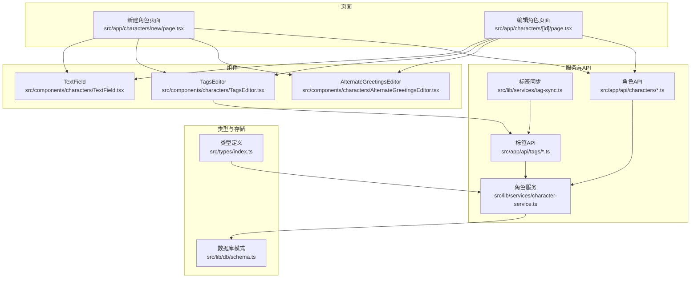
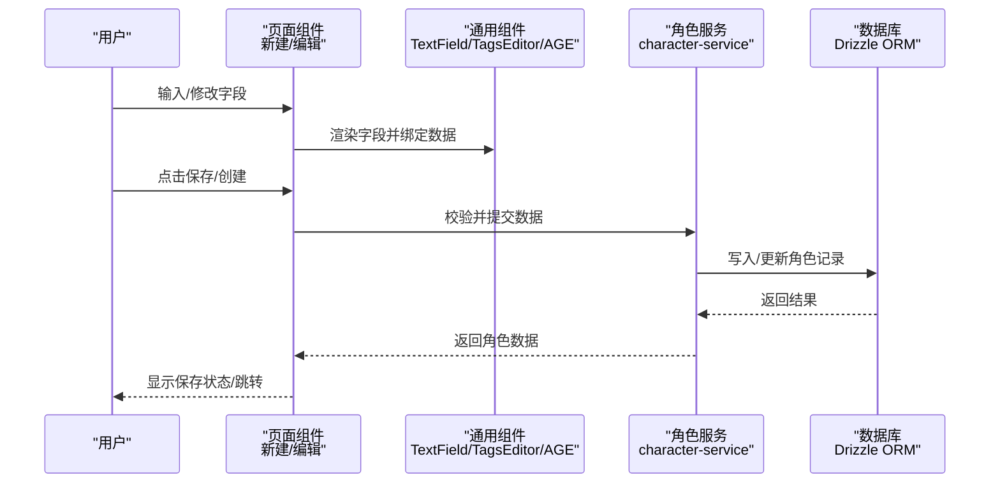
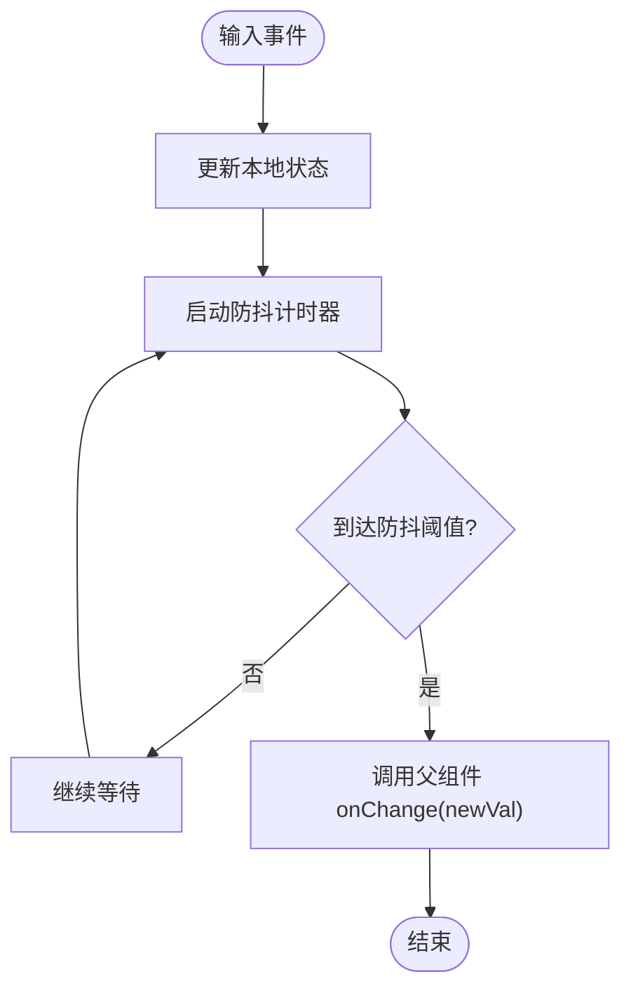
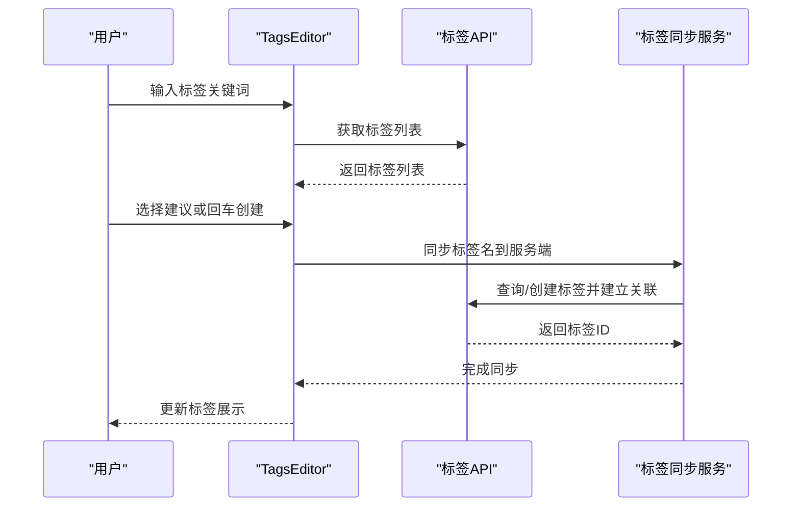
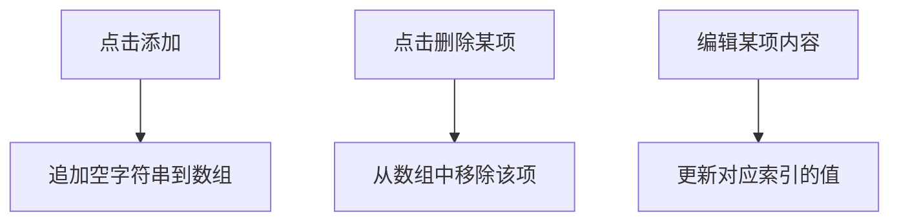
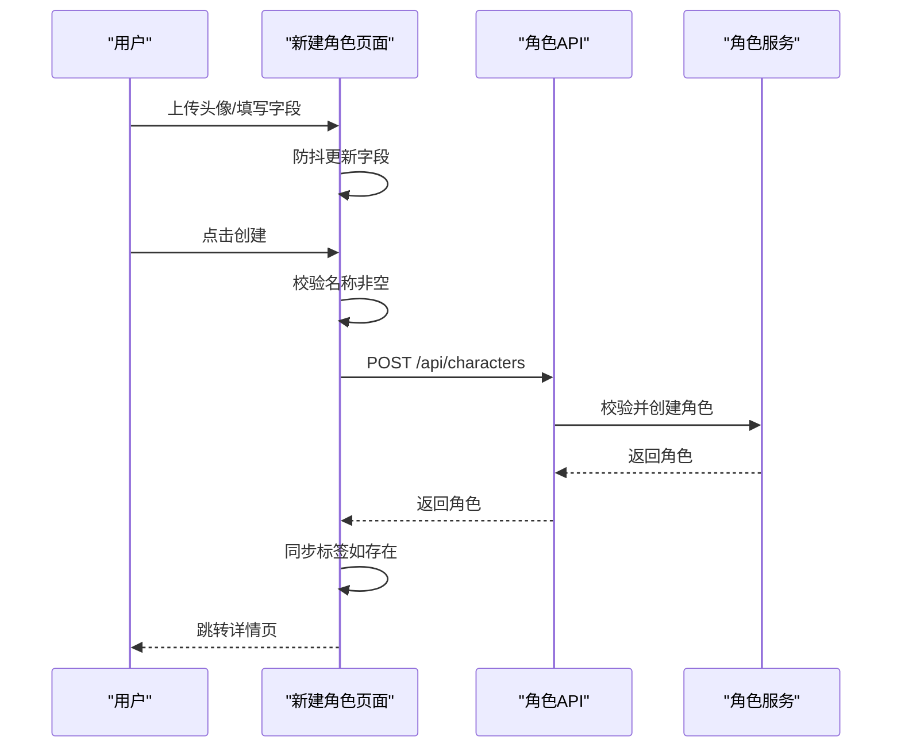
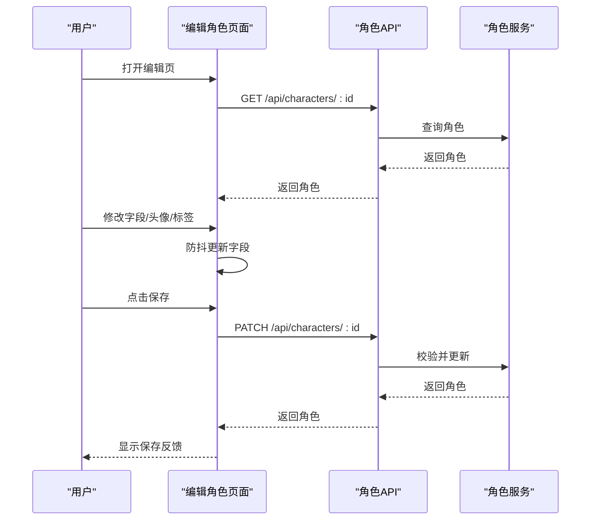
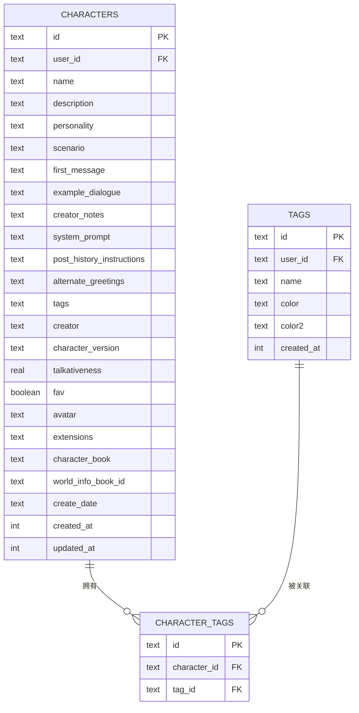
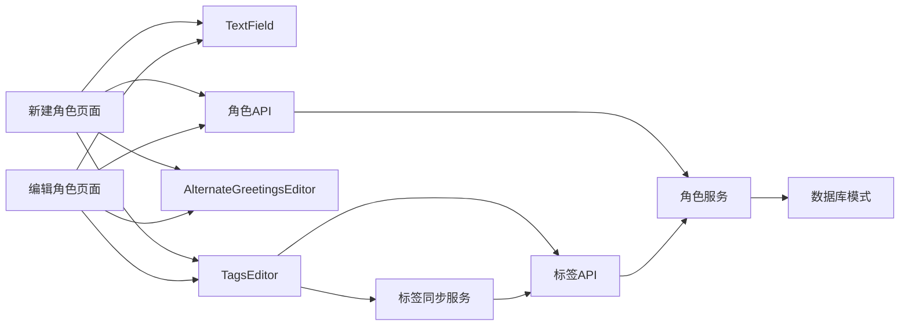
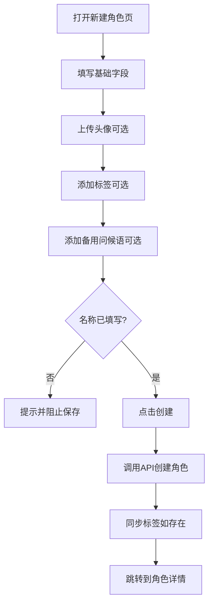

# 角色创建与编辑

<cite>
**本文引用的文件**
- [src/app/characters/new/page.tsx](file://src/app/characters/new/page.tsx)
- [src/app/characters/[id]/page.tsx](file://src/app/characters/[id]/page.tsx)
- [src/components/characters/AlternateGreetingsEditor.tsx](file://src/components/characters/AlternateGreetingsEditor.tsx)
- [src/components/characters/TagsEditor.tsx](file://src/components/characters/TagsEditor.tsx)
- [src/components/characters/TextField.tsx](file://src/components/characters/TextField.tsx)
- [src/app/api/characters/route.ts](file://src/app/api/characters/route.ts)
- [src/app/api/characters/[id]/route.ts](file://src/app/api/characters/[id]/route.ts)
- [src/app/api/tags/route.ts](file://src/app/api/tags/route.ts)
- [src/lib/services/character-service.ts](file://src/lib/services/character-service.ts)
- [src/lib/services/tag-sync.ts](file://src/lib/services/tag-sync.ts)
- [src/lib/constants/ui.ts](file://src/lib/constants/ui.ts)
- [src/lib/db/schema.ts](file://src/lib/db/schema.ts)
- [src/types/index.ts](file://src/types/index.ts)
</cite>

## 目录
1. [简介](#简介)
2. [项目结构](#项目结构)
3. [核心组件](#核心组件)
4. [架构总览](#架构总览)
5. [详细组件分析](#详细组件分析)
6. [依赖关系分析](#依赖关系分析)
7. [性能考量](#性能考量)
8. [故障排查指南](#故障排查指南)
9. [结论](#结论)
10. [附录](#附录)

## 简介
本文件系统性梳理“角色创建与编辑”功能，覆盖表单字段、验证规则、用户交互流程、字段渲染与数据绑定机制，并详细说明头像上传、标签选择、收藏、备用问候语编辑器、高级设定（场景设定、系统提示词、历史后指令等）以及导出/复制/删除等操作。文档同时提供最佳实践与常见问题解决方案，帮助开发者与使用者高效完成角色设计与维护。

## 项目结构
角色相关页面与组件主要位于以下路径：
- 页面：新建角色与编辑角色页面
- 组件：通用表单字段组件、备用问候语编辑器、标签编辑器
- 服务与API：角色服务、标签同步、标签API、角色API
- 类型与数据库：角色数据模型、数据库表结构

图表来源
- [src/app/characters/new/page.tsx:1-155](file://src/app/characters/new/page.tsx#L1-L155)
- [src/app/characters/[id]/page.tsx:1-230](file://src/app/characters/[id]/page.tsx#L1-L230)
- [src/components/characters/TextField.tsx:1-51](file://src/components/characters/TextField.tsx#L1-L51)
- [src/components/characters/TagsEditor.tsx:1-88](file://src/components/characters/TagsEditor.tsx#L1-L88)
- [src/components/characters/AlternateGreetingsEditor.tsx:1-38](file://src/components/characters/AlternateGreetingsEditor.tsx#L1-L38)
- [src/app/api/characters/route.ts:1-42](file://src/app/api/characters/route.ts#L1-L42)
- [src/app/api/characters/[id]/route.ts:1-47](file://src/app/api/characters/[id]/route.ts#L1-L47)
- [src/app/api/tags/route.ts:1-45](file://src/app/api/tags/route.ts#L1-L45)
- [src/lib/services/character-service.ts:1-252](file://src/lib/services/character-service.ts#L1-L252)
- [src/lib/services/tag-sync.ts:1-36](file://src/lib/services/tag-sync.ts#L1-L36)
- [src/lib/db/schema.ts:1-240](file://src/lib/db/schema.ts#L1-L240)
- [src/types/index.ts:154-209](file://src/types/index.ts#L154-L209)

章节来源
- [src/app/characters/new/page.tsx:1-155](file://src/app/characters/new/page.tsx#L1-L155)
- [src/app/characters/[id]/page.tsx:1-230](file://src/app/characters/[id]/page.tsx#L1-L230)
- [src/components/characters/TextField.tsx:1-51](file://src/components/characters/TextField.tsx#L1-L51)
- [src/components/characters/TagsEditor.tsx:1-88](file://src/components/characters/TagsEditor.tsx#L1-L88)
- [src/components/characters/AlternateGreetingsEditor.tsx:1-38](file://src/components/characters/AlternateGreetingsEditor.tsx#L1-L38)
- [src/app/api/characters/route.ts:1-42](file://src/app/api/characters/route.ts#L1-L42)
- [src/app/api/characters/[id]/route.ts:1-47](file://src/app/api/characters/[id]/route.ts#L1-L47)
- [src/app/api/tags/route.ts:1-45](file://src/app/api/tags/route.ts#L1-L45)
- [src/lib/services/character-service.ts:1-252](file://src/lib/services/character-service.ts#L1-L252)
- [src/lib/services/tag-sync.ts:1-36](file://src/lib/services/tag-sync.ts#L1-L36)
- [src/lib/db/schema.ts:1-240](file://src/lib/db/schema.ts#L1-L240)
- [src/types/index.ts:154-209](file://src/types/index.ts#L154-L209)

## 核心组件
- 表单字段组件（TextField）：统一处理输入、防抖与多行/单行渲染，支持帮助链接。
- 标签编辑器（TagsEditor）：支持搜索现有标签、创建新标签、显示建议列表、移除标签。
- 备用问候语编辑器（AlternateGreetingsEditor）：支持动态增删多条问候语，使用等宽字体便于排版。
- 页面组件（新建/编辑）：负责头像上传、收藏切换、高级设定折叠、保存/导出/复制/删除等交互。

章节来源
- [src/components/characters/TextField.tsx:1-51](file://src/components/characters/TextField.tsx#L1-L51)
- [src/components/characters/TagsEditor.tsx:1-88](file://src/components/characters/TagsEditor.tsx#L1-L88)
- [src/components/characters/AlternateGreetingsEditor.tsx:1-38](file://src/components/characters/AlternateGreetingsEditor.tsx#L1-L38)
- [src/app/characters/new/page.tsx:33-155](file://src/app/characters/new/page.tsx#L33-L155)
- [src/app/characters/[id]/page.tsx:22-230](file://src/app/characters/[id]/page.tsx#L22-L230)

## 架构总览
角色创建与编辑采用“页面组件 + 通用表单组件 + 服务层 + 数据库”的分层架构。页面组件负责UI与交互，通用组件负责字段渲染与数据绑定；服务层负责数据校验、持久化与业务逻辑；数据库层负责结构化存储。

图表来源
- [src/app/characters/new/page.tsx:53-69](file://src/app/characters/new/page.tsx#L53-L69)
- [src/app/characters/[id]/page.tsx:54-70](file://src/app/characters/[id]/page.tsx#L54-L70)
- [src/lib/services/character-service.ts:139-174](file://src/lib/services/character-service.ts#L139-L174)
- [src/lib/db/schema.ts:21-53](file://src/lib/db/schema.ts#L21-L53)

## 详细组件分析

### 表单字段组件 TextField
- 功能要点
  - 支持单行与多行输入。
  - 内部使用防抖机制，降低频繁写入与网络请求压力。
  - 可选帮助链接，引导用户查阅文档。
- 数据绑定
  - 通过受控组件方式，将本地状态与父组件回调联动。
- 性能与体验
  - 防抖延迟集中管理，避免输入卡顿与重复请求。

图表来源
- [src/components/characters/TextField.tsx:23-27](file://src/components/characters/TextField.tsx#L23-L27)
- [src/lib/constants/ui.ts:8-12](file://src/lib/constants/ui.ts#L8-L12)

章节来源
- [src/components/characters/TextField.tsx:1-51](file://src/components/characters/TextField.tsx#L1-L51)
- [src/lib/constants/ui.ts:8-12](file://src/lib/constants/ui.ts#L8-L12)

### 标签编辑器 TagsEditor
- 功能要点
  - 搜索已有标签并建议匹配项，支持创建新标签。
  - 输入框支持回车添加、ESC关闭建议、失焦延时隐藏。
  - 展示当前标签集合，支持一键移除。
- 数据绑定与同步
  - 通过 onChange 回传标签数组，页面组件负责保存。
  - 新建角色保存后，调用标签同步服务，确保标签持久化并建立关联。

图表来源
- [src/components/characters/TagsEditor.tsx:20-37](file://src/components/characters/TagsEditor.tsx#L20-L37)
- [src/lib/services/tag-sync.ts:6-35](file://src/lib/services/tag-sync.ts#L6-L35)
- [src/app/api/tags/route.ts:25-44](file://src/app/api/tags/route.ts#L25-L44)

章节来源
- [src/components/characters/TagsEditor.tsx:1-88](file://src/components/characters/TagsEditor.tsx#L1-L88)
- [src/lib/services/tag-sync.ts:1-36](file://src/lib/services/tag-sync.ts#L1-L36)
- [src/app/api/tags/route.ts:1-45](file://src/app/api/tags/route.ts#L1-L45)

### 备用问候语编辑器 AlternateGreetingsEditor
- 功能要点
  - 动态增删多条问候语，适合多轮对话开场句管理。
  - 使用等宽字体，便于对齐与排版。
- 数据绑定
  - 通过 greetings 数组与 onChange 回调实现双向绑定。

图表来源
- [src/components/characters/AlternateGreetingsEditor.tsx:12-37](file://src/components/characters/AlternateGreetingsEditor.tsx#L12-L37)

章节来源
- [src/components/characters/AlternateGreetingsEditor.tsx:1-38](file://src/components/characters/AlternateGreetingsEditor.tsx#L1-L38)

### 页面组件：新建角色（NewCharacterPage）
- 表单字段
  - 基本信息：名称、描述、第一条消息、创建者备注、系统提示词、历史后指令。
  - 高级设定：性格、场景、对话示例、系统提示词、历史后指令（折叠显示）。
  - 元数据：创建者、版本、话语度、收藏、标签、头像。
- 交互流程
  - 头像上传：FileReader 读取为 DataURL，回填到 avatar 字段。
  - 保存：校验必填字段（名称非空），调用角色API创建，成功后同步标签并跳转详情。
  - 收藏：切换 fav 字段并即时高亮。

图表来源
- [src/app/characters/new/page.tsx:53-69](file://src/app/characters/new/page.tsx#L53-L69)
- [src/app/api/characters/route.ts:19-41](file://src/app/api/characters/route.ts#L19-L41)
- [src/lib/services/character-service.ts:139-174](file://src/lib/services/character-service.ts#L139-L174)

章节来源
- [src/app/characters/new/page.tsx:14-31](file://src/app/characters/new/page.tsx#L14-L31)
- [src/app/characters/new/page.tsx:53-69](file://src/app/characters/new/page.tsx#L53-L69)
- [src/app/api/characters/route.ts:19-41](file://src/app/api/characters/route.ts#L19-L41)
- [src/lib/services/character-service.ts:139-174](file://src/lib/services/character-service.ts#L139-L174)

### 页面组件：编辑角色（CharacterEditPage）
- 表单字段
  - 与新建页一致，但支持角色书绑定（世界书）与更多导出/复制/删除操作。
- 交互流程
  - 加载：首次进入拉取角色与世界书列表。
  - 保存：PATCH 更新，成功后短暂显示“已保存”反馈。
  - 导出：支持导出 JSON 与 PNG 角色卡。
  - 复制：基于现有角色创建副本。
  - 删除：二次确认后删除并返回列表。

图表来源
- [src/app/characters/[id]/page.tsx:32-48](file://src/app/characters/[id]/page.tsx#L32-L48)
- [src/app/characters/[id]/page.tsx:54-70](file://src/app/characters/[id]/page.tsx#L54-L70)
- [src/app/api/characters/[id]/route.ts:19-34](file://src/app/api/characters/[id]/route.ts#L19-L34)
- [src/lib/services/character-service.ts:176-212](file://src/lib/services/character-service.ts#L176-L212)

章节来源
- [src/app/characters/[id]/page.tsx:22-99](file://src/app/characters/[id]/page.tsx#L22-L99)
- [src/app/characters/[id]/page.tsx:85-97](file://src/app/characters/[id]/page.tsx#L85-L97)
- [src/app/api/characters/[id]/route.ts:19-34](file://src/app/api/characters/[id]/route.ts#L19-L34)
- [src/lib/services/character-service.ts:176-212](file://src/lib/services/character-service.ts#L176-L212)

### 数据模型与数据库映射
- 角色数据模型（CharacterFormData）与数据库表（characters）字段对齐，包含基础V1/V2字段、ST扩展字段、世界书绑定与元数据。
- 标签与角色通过中间表 character_tags 关联，支持按标签筛选。

图表来源
- [src/lib/db/schema.ts:21-74](file://src/lib/db/schema.ts#L21-L74)
- [src/types/index.ts:154-209](file://src/types/index.ts#L154-L209)

章节来源
- [src/lib/db/schema.ts:21-74](file://src/lib/db/schema.ts#L21-L74)
- [src/types/index.ts:154-209](file://src/types/index.ts#L154-L209)

## 依赖关系分析
- 页面组件依赖通用表单组件与服务层。
- 服务层依赖数据库与Zod Schema进行数据校验。
- 标签编辑器依赖标签API与标签同步服务。
- API路由负责鉴权与调用服务层。

图表来源
- [src/app/characters/new/page.tsx:8-11](file://src/app/characters/new/page.tsx#L8-L11)
- [src/app/characters/[id]/page.tsx:7-10](file://src/app/characters/[id]/page.tsx#L7-L10)
- [src/app/api/characters/route.ts:2](file://src/app/api/characters/route.ts#L2)
- [src/app/api/characters/[id]/route.ts:2](file://src/app/api/characters/[id]/route.ts#L2)
- [src/app/api/tags/route.ts:2](file://src/app/api/tags/route.ts#L2)
- [src/lib/services/character-service.ts:1](file://src/lib/services/character-service.ts#L1)
- [src/lib/services/tag-sync.ts:6](file://src/lib/services/tag-sync.ts#L6)
- [src/lib/db/schema.ts:1](file://src/lib/db/schema.ts#L1)

章节来源
- [src/app/characters/new/page.tsx:8-11](file://src/app/characters/new/page.tsx#L8-L11)
- [src/app/characters/[id]/page.tsx:7-10](file://src/app/characters/[id]/page.tsx#L7-L10)
- [src/app/api/characters/route.ts:2](file://src/app/api/characters/route.ts#L2)
- [src/app/api/characters/[id]/route.ts:2](file://src/app/api/characters/[id]/route.ts#L2)
- [src/app/api/tags/route.ts:2](file://src/app/api/tags/route.ts#L2)
- [src/lib/services/character-service.ts:1](file://src/lib/services/character-service.ts#L1)
- [src/lib/services/tag-sync.ts:6](file://src/lib/services/tag-sync.ts#L6)
- [src/lib/db/schema.ts:1](file://src/lib/db/schema.ts#L1)

## 性能考量
- 防抖输入：统一的防抖延迟减少无效请求与重绘。
- 建议列表延迟隐藏：避免鼠标点击与失焦时序冲突导致的闪烁。
- 保存反馈：短暂提示避免频繁刷新状态。
- 数据库JSON字段：alternateGreetings、tags、extensions等以JSON存储，查询时解析，注意索引与查询条件优化。

章节来源
- [src/lib/constants/ui.ts:8-12](file://src/lib/constants/ui.ts#L8-L12)
- [src/lib/db/schema.ts:35-46](file://src/lib/db/schema.ts#L35-L46)

## 故障排查指南
- 保存失败
  - 检查鉴权状态与用户ID是否正确传递至服务层。
  - 查看API返回的错误信息与状态码。
- 标签未生效
  - 确认新建角色后是否调用了标签同步服务。
  - 检查标签API是否返回成功并建立关联。
- 头像无法显示
  - 确认上传文件为图片类型且大小合理。
  - 检查DataURL是否正确写入avatar字段。
- 高级设定不显示
  - 确认折叠按钮是否被点击展开。
  - 检查字段是否为空，空字段不会影响保存。
- 删除角色后聊天残留
  - 服务层在删除角色时会先删除其关联聊天，确保无孤儿记录。

章节来源
- [src/app/api/characters/route.ts:20-41](file://src/app/api/characters/route.ts#L20-L41)
- [src/app/api/characters/[id]/route.ts:36-46](file://src/app/api/characters/[id]/route.ts#L36-L46)
- [src/lib/services/character-service.ts:214-225](file://src/lib/services/character-service.ts#L214-L225)
- [src/lib/services/tag-sync.ts:6-35](file://src/lib/services/tag-sync.ts#L6-L35)
- [src/app/api/tags/route.ts:25-44](file://src/app/api/tags/route.ts#L25-L44)

## 结论
角色创建与编辑功能通过统一的表单组件、严格的前后端校验与清晰的页面交互，实现了从基础信息到高级设定的完整角色设计流程。配合标签系统与世界书绑定，用户可以高效组织与复用角色资源。建议在实际使用中遵循最佳实践，关注性能与可维护性，持续优化用户体验。

## 附录

### 角色表单字段清单与用途
- 基本信息
  - 名称：角色名称（必填）
  - 描述：角色外观与心理特征描述
  - 第一条消息：每次开始聊天时角色发送的消息
  - 创建者备注：仅用于使用说明，不发送给AI
  - 系统提示词：覆盖默认系统提示词（高级用户）
  - 历史后指令：在聊天历史之后、AI回复之前的指令
- 高级设定（可折叠）
  - 性格：角色性格特征概要
  - 场景：角色所处场景设定
  - 对话示例：示例对话格式
- 元数据
  - 创建者、版本、话语度、收藏、标签、头像、角色书绑定

章节来源
- [src/app/characters/new/page.tsx:14-31](file://src/app/characters/new/page.tsx#L14-L31)
- [src/app/characters/[id]/page.tsx:154-175](file://src/app/characters/[id]/page.tsx#L154-L175)
- [src/types/index.ts:154-209](file://src/types/index.ts#L154-L209)

### 验证规则摘要
- 新建/更新：使用Zod Schema进行字段长度、范围与类型校验，支持未知字段透传。
- 必填字段：名称至少1字符，最多200字符。
- 数值范围：话语度0~1。
- 数组字段：标签与备用问候语为字符串数组。

章节来源
- [src/lib/services/character-service.ts:11-53](file://src/lib/services/character-service.ts#L11-L53)

### 用户交互流程图（创建角色）

图表来源
- [src/app/characters/new/page.tsx:53-69](file://src/app/characters/new/page.tsx#L53-L69)
- [src/lib/services/tag-sync.ts:6-35](file://src/lib/services/tag-sync.ts#L6-L35)